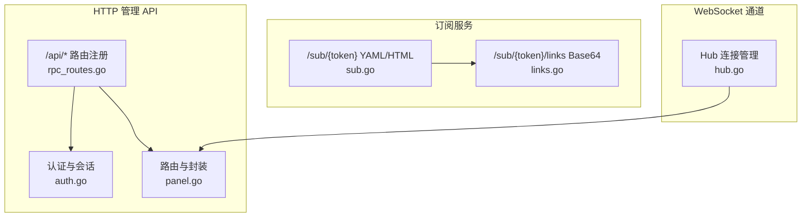
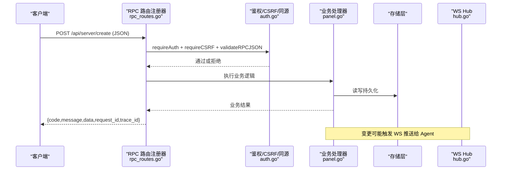
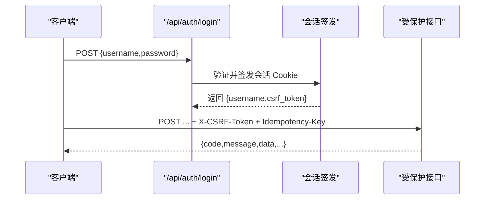
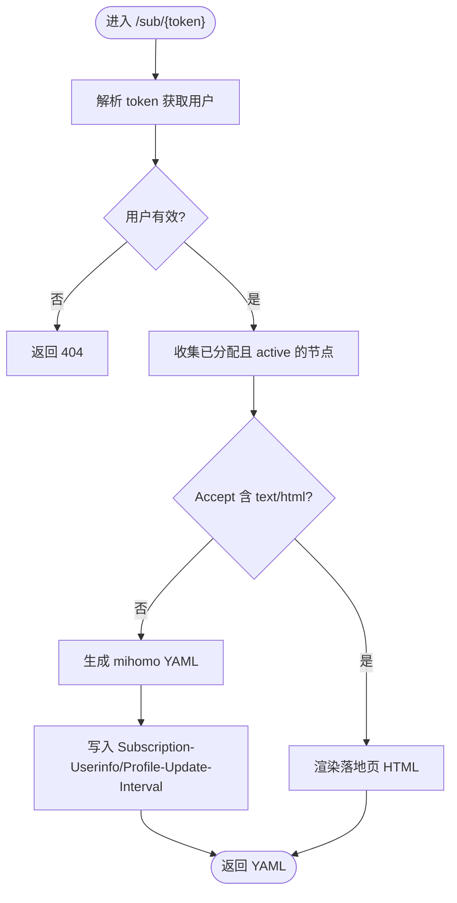
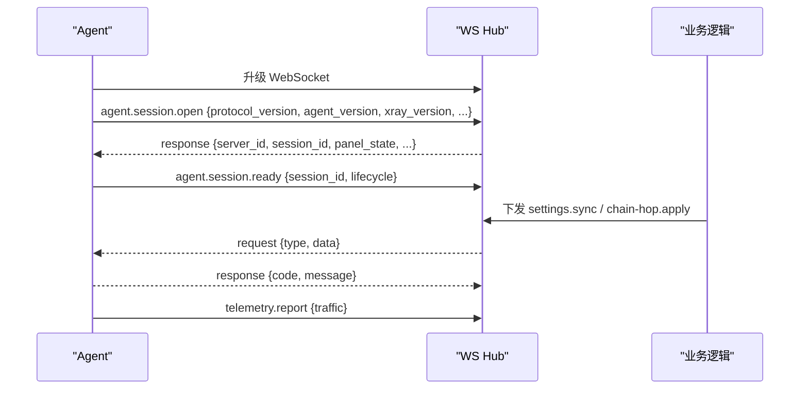
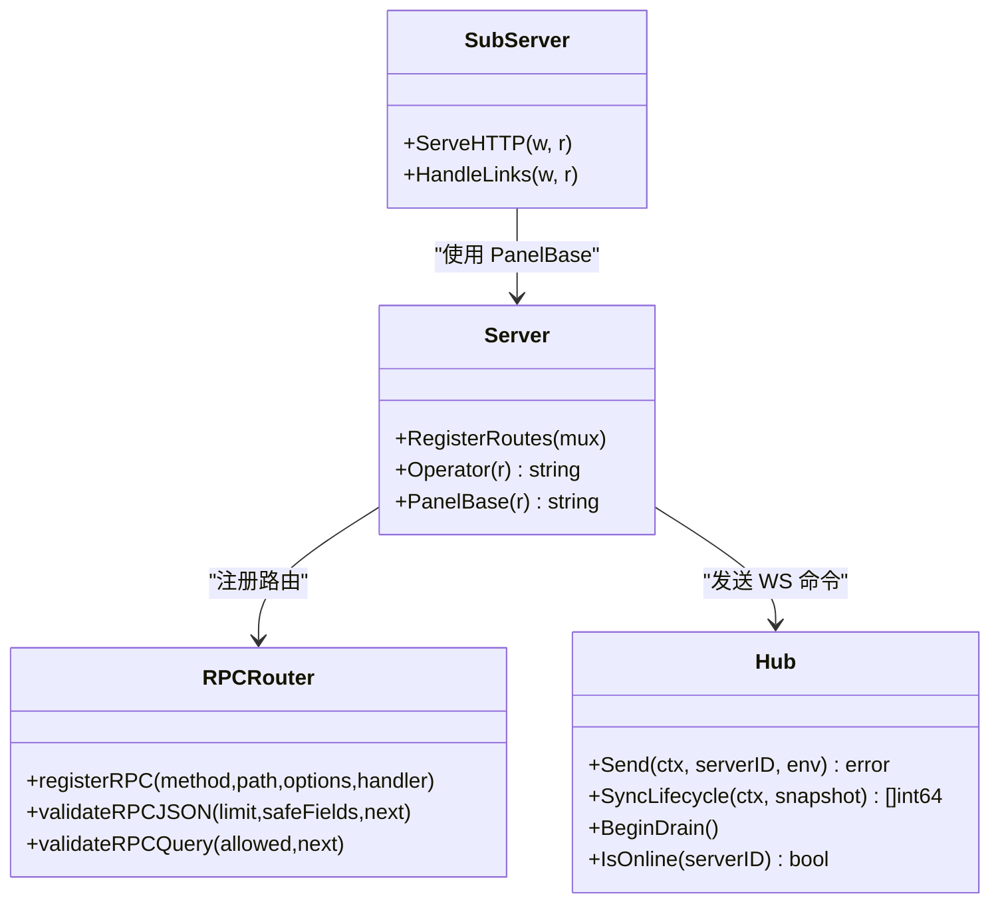

# API 参考

<cite>
**本文引用的文件**   
- [openapi.yaml](file://docs/openapi.yaml)
- [ws-protocol.schema.json](file://docs/ws-protocol.schema.json)
- [rpc_routes.go](file://src/backend/internal/panel/rpc_routes.go)
- [auth.go](file://src/backend/internal/panel/auth.go)
- [panel.go](file://src/backend/internal/panel/panel.go)
- [sub.go](file://src/backend/internal/sub/sub.go)
- [links.go](file://src/backend/internal/sub/links.go)
- [hub.go](file://src/backend/internal/ws/hub.go)
</cite>

## 目录
1. [简介](#简介)
2. [项目结构](#项目结构)
3. [核心组件](#核心组件)
4. [架构总览](#架构总览)
5. [详细组件分析](#详细组件分析)
6. [依赖关系分析](#依赖关系分析)
7. [性能考虑](#性能考虑)
8. [故障排查指南](#故障排查指南)
9. [结论](#结论)
10. [附录](#附录)

## 简介
本文件为 Lattix-codex 的完整 API 参考，覆盖：
- HTTP REST RPC 接口（路径、方法、请求体、响应信封、错误码）
- WebSocket 协议规范（连接建立、消息格式、事件类型、实时交互）
- 订阅接口（YAML 落地页、V2Ray/Clash 链接、二维码生成说明）
- 认证与授权（会话 Cookie、CSRF、同源校验、幂等键）
- 版本管理与兼容性策略
- 最佳实践与性能优化建议

所有接口遵循统一的业务信封：HTTP 状态始终为 200，业务结果由响应体的 code 表达。部分场景（订阅、文件下载、WebSocket Upgrade、健康检查、第三方 HTTP）不使用此信封。

**章节来源**
- [openapi.yaml:1-12](file://docs/openapi.yaml#L1-L12)

## 项目结构
后端通过统一的 RPC 路由注册器将管理 API 暴露为 /api/* 路径；订阅端点位于 /sub/*；WebSocket 用于面板与 Agent 之间的双向通信。

**图表来源**
- [rpc_routes.go:33-72](file://src/backend/internal/panel/rpc_routes.go#L33-L72)
- [auth.go:67-135](file://src/backend/internal/panel/auth.go#L67-L135)
- [panel.go:158-276](file://src/backend/internal/panel/panel.go#L158-L276)
- [sub.go:147-190](file://src/backend/internal/sub/sub.go#L147-L190)
- [links.go:20-43](file://src/backend/internal/sub/links.go#L20-L43)
- [hub.go:25-62](file://src/backend/internal/ws/hub.go#L25-L62)

**章节来源**
- [panel.go:158-276](file://src/backend/internal/panel/panel.go#L158-L276)
- [rpc_routes.go:33-72](file://src/backend/internal/panel/rpc_routes.go#L33-L72)

## 核心组件
- RPC 路由与中间件：统一鉴权、CSRF、同源校验、JSON 校验、查询参数白名单、幂等性保护、日志策略。
- 认证与会话：基于 Cookie 的会话签名、CSRF Token、登录/登出/当前用户探活。
- 订阅服务：按用户生成 mihomo(Clash.Meta) YAML 或浏览器落地页 HTML；提供 vless/trojan/vmess/ss 分享链接集合。
- WebSocket Hub：Agent 连接注册、心跳、离线重连、生命周期同步、命令投递与缓冲控制。

**章节来源**
- [rpc_routes.go:82-123](file://src/backend/internal/panel/rpc_routes.go#L82-L123)
- [auth.go:26-65](file://src/backend/internal/panel/auth.go#L26-L65)
- [sub.go:147-190](file://src/backend/internal/sub/sub.go#L147-L190)
- [links.go:45-109](file://src/backend/internal/sub/links.go#L45-L109)
- [hub.go:101-138](file://src/backend/internal/ws/hub.go#L101-L138)

## 架构总览
下图展示一次典型的管理 API 调用流程，包括鉴权、CSRF、JSON 校验、业务处理与统一信封返回。

**图表来源**
- [rpc_routes.go:33-72](file://src/backend/internal/panel/rpc_routes.go#L33-L72)
- [auth.go:149-185](file://src/backend/internal/panel/auth.go#L149-L185)
- [panel.go:330-347](file://src/backend/internal/panel/panel.go#L330-L347)
- [hub.go:110-138](file://src/backend/internal/ws/hub.go#L110-L138)

## 详细组件分析

### HTTP REST RPC 接口总览
- 基础规则
  - 所有管理 API 均返回 HTTP 200，业务状态由 body.code 表达。
  - 请求体必须为 application/json；GET 请求仅允许声明的查询参数。
  - 写操作默认启用 CSRF 与幂等键 Idempotency-Key。
  - 响应头包含 X-Request-ID、X-Trace-ID。
- 通用请求/响应信封
  - 请求体：任意 JSON 对象（具体字段见各接口）。
  - 响应体：{code, message, data, request_id, trace_id}。
- 错误码枚举（节选）
  - OK、ACCEPTED、AUTH_REQUIRED、AUTH_INVALID_CREDENTIALS、INVALID_ARGUMENT、NOT_FOUND、CONFLICT、OPERATION_LOCKED、UNSUPPORTED_ACTION、INTERNAL_ERROR、UPSTREAM_ERROR、SERVICE_UNAVAILABLE、SERVER_OFFLINE、PORT_OUT_OF_RANGE、UPDATE_IN_PROGRESS。
- 版本与兼容
  - OpenAPI 版本 3.1.0；向后兼容以“新增字段可忽略”为原则；废弃接口保留并标注弃用。

**章节来源**
- [openapi.yaml:1-12](file://docs/openapi.yaml#L1-L12)
- [openapi.yaml:338-368](file://docs/openapi.yaml#L338-L368)
- [openapi.yaml:495-523](file://docs/openapi.yaml#L495-L523)
- [panel.go:330-347](file://src/backend/internal/panel/panel.go#L330-L347)
- [rpc_routes.go:82-123](file://src/backend/internal/panel/rpc_routes.go#L82-L123)

### 认证与授权
- 登录/登出/当前用户
  - POST /api/auth/login：用户名密码登录，成功返回 username 与 csrf_token，并设置会话 Cookie。
  - POST /api/auth/logout：清除会话 Cookie。
  - GET /api/auth/me：返回当前用户名与 csrf_token。
- 会话机制
  - Cookie 名：lattix_session；HttpOnly；Secure 在 HTTPS 下启用；SameSite=Lax；有效期 7 天。
  - 会话值：base64url(user|exp).base64url(hmac)，由服务器密钥派生签名。
- CSRF 与同源校验
  - 写操作需携带 X-CSRF-Token，值为 session 的 HMAC。
  - 登录接口强制 SameOrigin 校验（Origin/Referer 与 Host 一致，HTTPS 下要求 https）。
- 幂等性
  - 写操作支持 Idempotency-Key（长度 8-128，字符集 a-zA-Z0-9._:-），结合请求体哈希去重与缓存响应。

**图表来源**
- [auth.go:67-135](file://src/backend/internal/panel/auth.go#L67-L135)
- [auth.go:164-185](file://src/backend/internal/panel/auth.go#L164-L185)
- [rpc_routes.go:157-226](file://src/backend/internal/panel/rpc_routes.go#L157-L226)

**章节来源**
- [auth.go:26-65](file://src/backend/internal/panel/auth.go#L26-L65)
- [auth.go:67-135](file://src/backend/internal/panel/auth.go#L67-L135)
- [auth.go:149-204](file://src/backend/internal/panel/auth.go#L149-L204)
- [rpc_routes.go:157-226](file://src/backend/internal/panel/rpc_routes.go#L157-L226)

### 订阅接口
- GET /sub/{token}
  - 行为：根据 token 解析用户，输出 mihomo(Clash.Meta) YAML 或浏览器落地页 HTML（Accept 含 text/html）。
  - 头部：Subscription-Userinfo（upload/download/expire）、Profile-Update-Interval=24。
  - 停权态：expired/disabled 时返回空 proxies，不报错。
- GET /sub/{token}/links
  - 行为：返回 base64 编码的换行分隔分享链接集合（vless/trojan/vmess/ss），仅包含分配给用户的 active 节点。
  - 停权态：返回空集合。
- 链接生成规则
  - VLESS/Trojan：security=reality，携带 pbk/sid/sni/fp，传输扩展 grpc/xhttp。
  - VMess：base64(JSON)，携带 reality 扩展字段。
  - Shadowsocks：SIP002，2022-blake3 多用户使用 PSK:password。

**图表来源**
- [sub.go:147-190](file://src/backend/internal/sub/sub.go#L147-L190)
- [sub.go:42-53](file://src/backend/internal/sub/sub.go#L42-L53)

**章节来源**
- [sub.go:147-190](file://src/backend/internal/sub/sub.go#L147-L190)
- [links.go:20-43](file://src/backend/internal/sub/links.go#L20-L43)
- [links.go:45-109](file://src/backend/internal/sub/links.go#L45-L109)

### WebSocket 协议规范
- 连接建立
  - 由 Agent 发起升级至 WebSocket，Panel 侧通过 Hub 进行鉴权与 Session 打开。
  - 首次握手后，Agent 发送 agent.session.open 请求，Panel 返回 OK 并附带 server_id、session_id、issued_token 等。
- 消息信封
  - 字段：kind(request/response/event)、type（层级命名）、request_id、trace_id、data；response 包含 code/message。
  - 常见类型：agent.session.open/ready、agent.credential.commit、panel.lifecycle.changed、agent.settings.sync/changed、telemetry.report、chain-hop.apply。
- 实时交互模式
  - Panel 向 Agent 下发配置与应用指令；Agent 上报遥测与状态变更；Hub 维护在线连接、缓冲与超时。

**图表来源**
- [ws-protocol.schema.json:107-132](file://docs/ws-protocol.schema.json#L107-L132)
- [ws-protocol.schema.json:136-179](file://docs/ws-protocol.schema.json#L136-L179)
- [ws-protocol.schema.json:256-296](file://docs/ws-protocol.schema.json#L256-L296)
- [hub.go:110-138](file://src/backend/internal/ws/hub.go#L110-L138)

**章节来源**
- [ws-protocol.schema.json:107-132](file://docs/ws-protocol.schema.json#L107-L132)
- [ws-protocol.schema.json:136-179](file://docs/ws-protocol.schema.json#L136-L179)
- [ws-protocol.schema.json:256-296](file://docs/ws-protocol.schema.json#L256-L296)
- [hub.go:110-138](file://src/backend/internal/ws/hub.go#L110-L138)

### 关键 API 清单与示例
以下列出主要分组与用途，具体字段请参考 OpenAPI 定义与实现细节。

- 认证
  - POST /api/auth/login：登录，返回 username 与 csrf_token。
  - POST /api/auth/logout：登出，清除会话。
  - GET /api/auth/me：返回当前用户与 csrf_token。
- 服务器
  - GET /api/server/list：列出服务器。
  - POST /api/server/create/update/delete/repair/rotate-token/upgrade-xray/upgrade-agent：增删改查与运维操作。
  - GET /api/server/list-metric-samples/get-metric-history：指标采样与历史。
  - GET /api/server/list-commands：查看命令记录。
  - GET /api/server/list-release-versions：查询可用版本。
- 提供者与汇率
  - /api/provider/*：CRUD 供应商。
  - /api/exchange-rate/*：刷新、保存自定义汇率、删除自定义汇率。
- 节点
  - /api/node/*：创建、重试、删除。
- 链路
  - /api/chain/*：创建、编辑、强制发布、重试、删除、流量倍数与重置、流量历史。
- 用户
  - /api/user/*：列表、创建、更新、分配节点、删除。
- 设置
  - /api/setting/*：获取、更新、修改密码、测试告警。
- 面板
  - /api/panel/*：重启、状态、版本、启动更新、更新状态。
- 备份与日志
  - GET /api/backup/download：下载 SQLite 附件或 RPC 错误信封。
  - /api/log/*：操作日志与请求日志的查询与清理。

请求/响应示例（成功）
- 登录成功
  - 请求：POST /api/auth/login，Content-Type: application/json
  - 响应体：{code:"OK", message:"", data:{username:"admin", csrf_token:"..."}, request_id:"...", trace_id:"..."}
- 创建服务器
  - 请求：POST /api/server/create，Header: X-CSRF-Token, Idempotency-Key
  - 响应体：{code:"OK", message:"", data:{...}, request_id:"...", trace_id:"..."}

失败场景（示例）
- 未登录或会话过期：{code:"AUTH_REQUIRED", message:"未登录或会话已过期", ...}
- CSRF 无效：{code:"AUTH_REQUIRED", message:"CSRF token 无效", ...}
- 参数非法：{code:"INVALID_ARGUMENT", message:"...", ...}
- 资源不存在：{code:"NOT_FOUND", message:"...", ...}
- 冲突（幂等键重复但请求体不同）：{code:"CONFLICT", message:"Idempotency-Key was already used with a different request", ...}

**章节来源**
- [openapi.yaml:14-337](file://docs/openapi.yaml#L14-L337)
- [panel.go:330-347](file://src/backend/internal/panel/panel.go#L330-L347)
- [rpc_routes.go:157-226](file://src/backend/internal/panel/rpc_routes.go#L157-L226)

## 依赖关系分析
- 路由注册与中间件
  - registerRPC 将方法+路径注册为 pattern，并依次包装 Idempotent、CSRF、Auth、SameOrigin、JSON/Query 校验。
  - LogPolicy 决定日志级别；SafeBodyFields 允许安全字段进入上下文日志。
- 认证链
  - requireAuth 校验会话；requireCSRF 校验 X-CSRF-Token；requireSameOrigin 校验 Origin/Referer。
- 订阅与链接
  - sub.Server 依赖 store 查询用户、节点、链条与 realized_config；links 生成标准分享链接。
- WebSocket Hub
  - Hub 维护连接映射、状态快照、发送队列与超时；提供 Send/SyncLifecycle/BeginDrain 等方法。

**图表来源**
- [panel.go:158-276](file://src/backend/internal/panel/panel.go#L158-L276)
- [hub.go:110-138](file://src/backend/internal/ws/hub.go#L110-L138)
- [sub.go:147-190](file://src/backend/internal/sub/sub.go#L147-L190)
- [rpc_routes.go:33-72](file://src/backend/internal/panel/rpc_routes.go#L33-L72)

**章节来源**
- [rpc_routes.go:33-72](file://src/backend/internal/panel/rpc_routes.go#L33-L72)
- [auth.go:149-204](file://src/backend/internal/panel/auth.go#L149-L204)
- [sub.go:147-190](file://src/backend/internal/sub/sub.go#L147-L190)
- [hub.go:110-138](file://src/backend/internal/ws/hub.go#L110-L138)

## 性能考虑
- 请求体限制
  - 默认最大 1MB；超出返回 413。可通过 BodyLimit 调整。
- 查询参数白名单
  - 未知参数直接拒绝，避免注入与冗余解析。
- 幂等性与缓存
  - 相同 Idempotency-Key 与请求体哈希命中则直接返回缓存结果，降低重复负载。
- WebSocket 缓冲与超时
  - 每连接发送队列长度固定；写满即断开并重连补发；写超时 10s；读空闲 90s 判定死亡。
- 日志策略
  - 轮询接口采用失败日志；高频接口可关闭日志以减少 IO。

**章节来源**
- [rpc_routes.go:20-31](file://src/backend/internal/panel/rpc_routes.go#L20-L31)
- [rpc_routes.go:82-123](file://src/backend/internal/panel/rpc_routes.go#L82-L123)
- [rpc_routes.go:157-226](file://src/backend/internal/panel/rpc_routes.go#L157-L226)
- [hub.go:15-22](file://src/backend/internal/ws/hub.go#L15-L22)
- [hub.go:110-138](file://src/backend/internal/ws/hub.go#L110-L138)

## 故障排查指南
- 常见问题
  - 401 AUTH_REQUIRED：Cookie 缺失或过期；检查 lattix_session 是否随请求发送。
  - 403 AUTH_INVALID_CREDENTIALS：CSRF 无效或同源校验失败；确认 X-CSRF-Token 与 Origin/Referer。
  - 413 Request Entity Too Large：请求体超过限制；减小 payload 或增大 BodyLimit。
  - 409 CONFLICT：幂等键被重复使用且请求体不同；更换 Idempotency-Key。
  - 503 SERVICE_UNAVAILABLE：面板更新中或上游不可用；等待更新完成或重试。
- 调试建议
  - 关注响应头 X-Request-ID/X-Trace-ID 进行全链路追踪。
  - 使用 /api/log/list-requests 与 /api/log/list-operations 定位问题。
  - WebSocket 连接状态通过 Hub.ConnectionState 查询。

**章节来源**
- [panel.go:349-405](file://src/backend/internal/panel/panel.go#L349-L405)
- [openapi.yaml:495-523](file://docs/openapi.yaml#L495-L523)
- [hub.go:75-91](file://src/backend/internal/ws/hub.go#L75-L91)

## 结论
Lattix-codex 的 API 设计强调一致性、安全性与可观测性：统一信封、严格校验、会话与 CSRF、幂等键保障、WebSocket 可靠传输。订阅接口提供标准化的 YAML 与分享链接，便于多客户端消费。建议在集成时遵循最佳实践，合理使用限流与幂等键，利用日志与追踪快速定位问题。

## 附录

### 订阅二维码生成说明
- 落地页 HTML：当 Accept 包含 text/html 时，/sub/{token} 返回落地页，前端可据此生成二维码供客户端扫描订阅。
- 二维码内容：通常为 /sub/{token} 的绝对 URL（由 PanelBase 推断或配置 PublicURL）。

**章节来源**
- [sub.go:147-190](file://src/backend/internal/sub/sub.go#L147-L190)
- [panel.go:284-301](file://src/backend/internal/panel/panel.go#L284-L301)

### 版本管理与兼容性
- OpenAPI 版本：3.1.0。
- 向后兼容：新增字段对旧客户端透明；废弃接口保留并提示。
- 面板自更新：/api/panel/start-update 与 /api/panel/get-update-status 配合，更新期间限制非进度接口。

**章节来源**
- [openapi.yaml:1-12](file://docs/openapi.yaml#L1-L12)
- [panel.go:257-263](file://src/backend/internal/panel/panel.go#L257-L263)

### 最佳实践
- 客户端
  - 每次写操作携带唯一 Idempotency-Key；合理设置重试退避。
  - 正确传递 X-CSRF-Token；确保同源请求。
  - 订阅客户端按 Profile-Update-Interval 定时拉取。
- 服务端
  - 对高频接口开启最小日志；对关键操作开启审计日志。
  - 合理设置 BodyLimit 与 WS 缓冲大小，防止慢连接拖垮系统。

[无章节来源：本节为通用指导]