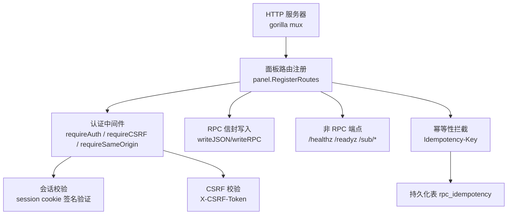
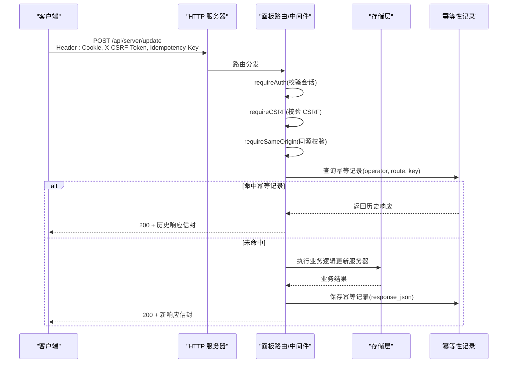
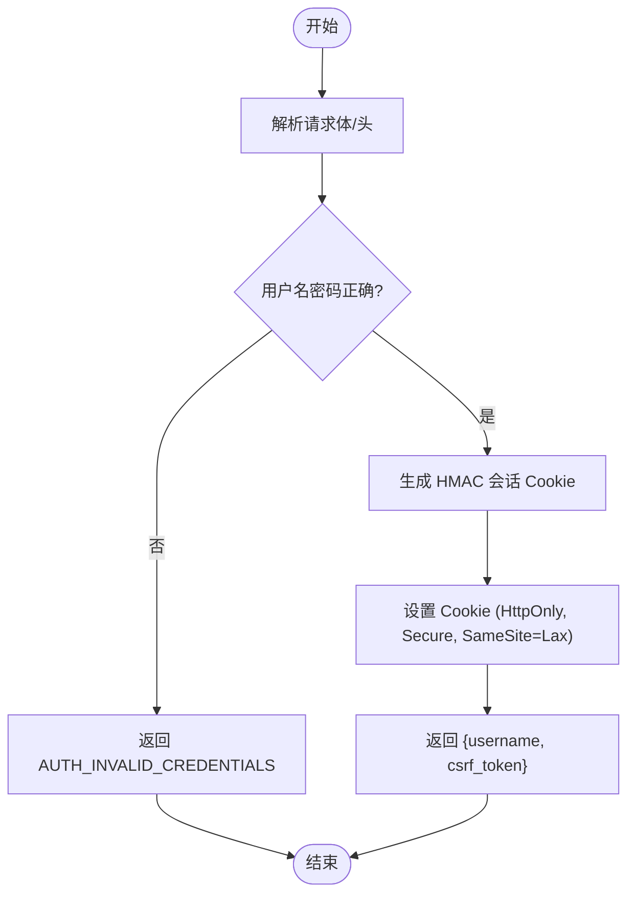
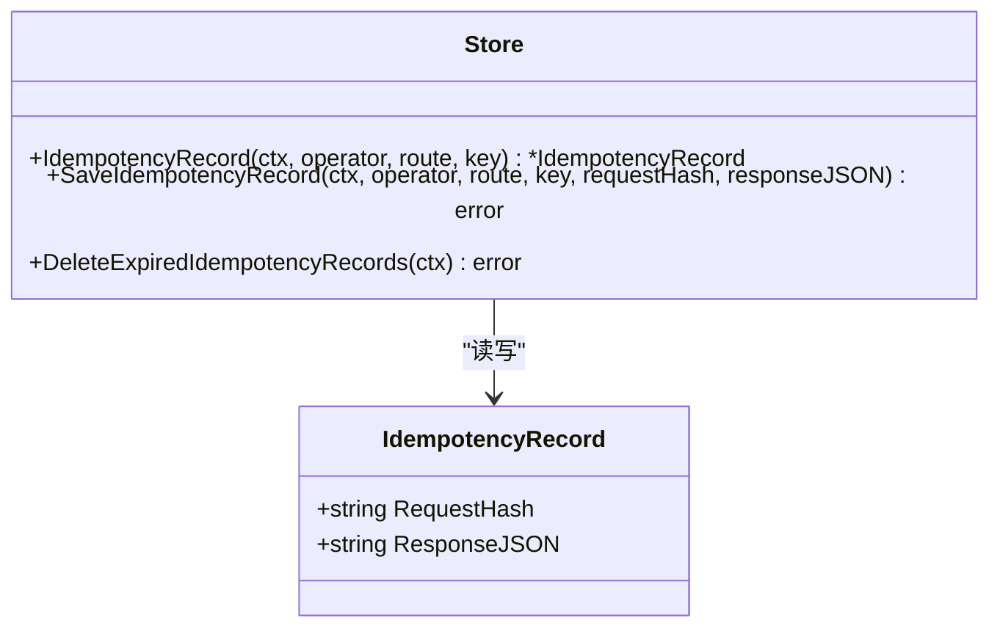
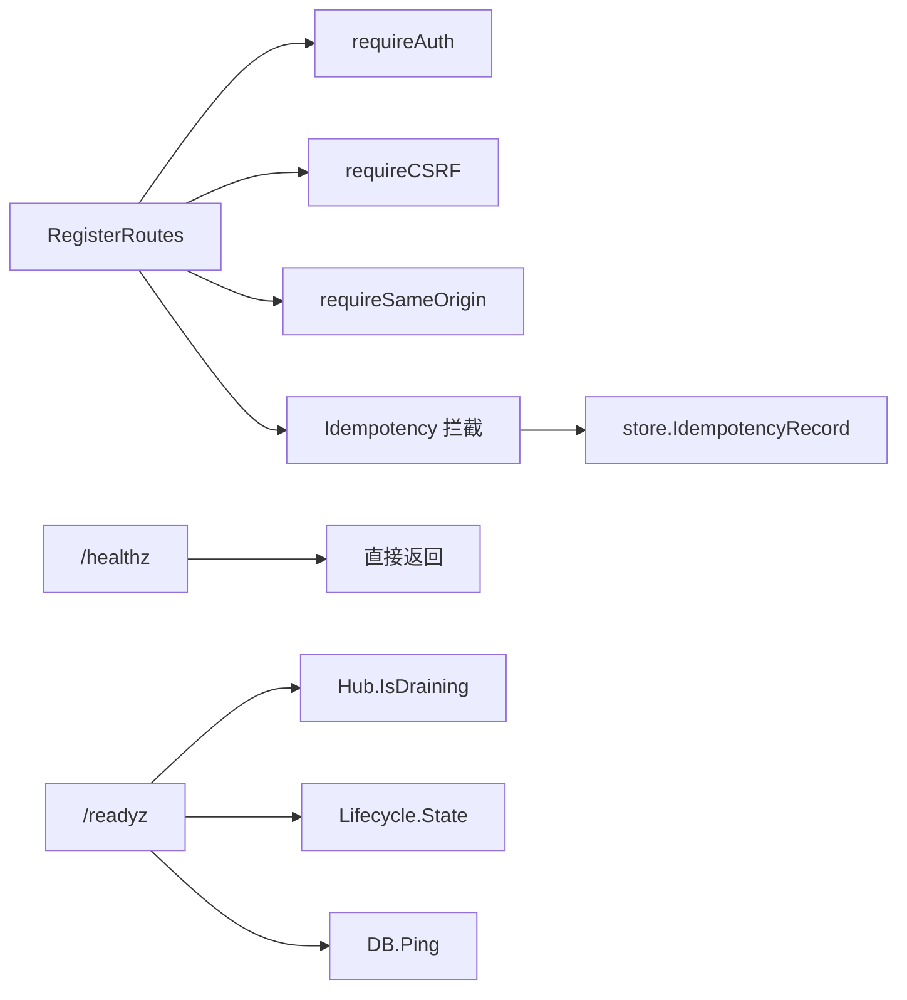

# RESTful API

<cite>
**本文引用的文件**   
- [main.go](file://src/backend/cmd/backend/main.go)
- [openapi.yaml](file://docs/openapi.yaml)
- [panel.go](file://src/backend/internal/panel/panel.go)
- [auth.go](file://src/backend/internal/panel/auth.go)
- [idempotency.go](file://src/backend/internal/store/idempotency.go)
- [dashboard.go](file://src/backend/internal/panel/dashboard.go)
- [servers.go](file://src/backend/internal/panel/servers.go)
- [chains.go](file://src/backend/internal/panel/chains.go)
- [users.go](file://src/backend/internal/panel/users.go)
- [settings.go](file://src/backend/internal/panel/settings.go)
</cite>

## 目录
1. [简介](#简介)
2. [项目结构](#项目结构)
3. [核心组件](#核心组件)
4. [架构总览](#架构总览)
5. [详细组件分析](#详细组件分析)
6. [依赖关系分析](#依赖关系分析)
7. [性能考量](#性能考量)
8. [故障排查指南](#故障排查指南)
9. [结论](#结论)
10. [附录：API 端点清单与示例](#附录api-端点清单与示例)

## 简介
本文件为 Lattix-codex 面板的 RESTful API 文档。该面板提供基于 HTTP + Cookie 会话的管理接口，统一使用 JSON 请求体与统一的 RPC 信封响应格式（HTTP 状态码固定 200，业务结果由 body.code 表达）。认证采用管理员账号密码登录、Cookie 会话、CSRF Token 校验与同源策略；幂等性通过 Idempotency-Key 支持。此外还提供健康检查、就绪检查、WebSocket 控制通道以及订阅与链接分享等非 RPC 端点。

## 项目结构
后端以 Go 实现，入口在 main.go，HTTP 路由注册在 panel.Server.RegisterRoutes，OpenAPI 定义在 docs/openapi.yaml。认证与安全逻辑集中在 panel/auth.go，幂等性存储位于 store/idempotency.go。各业务模块按功能拆分（dashboard、servers、chains、users、settings 等）。

**图表来源** 
- [main.go:364-441](file://src/backend/cmd/backend/main.go#L364-L441)
- [panel.go:158-276](file://src/backend/internal/panel/panel.go#L158-L276)
- [auth.go:146-204](file://src/backend/internal/panel/auth.go#L146-L204)
- [idempotency.go:1-60](file://src/backend/internal/store/idempotency.go#L1-L60)

**章节来源**
- [main.go:364-441](file://src/backend/cmd/backend/main.go#L364-L441)
- [panel.go:158-276](file://src/backend/internal/panel/panel.go#L158-L276)

## 核心组件
- 路由与中间件
  - 所有管理 API 均经过 requireAuth（会话校验），写操作额外 requireCSRF（CSRF 校验）与 Same-Origin 校验。
  - 幂等性拦截对标记为 Idempotent 的路由生效，依据 operator+route+Idempotency-Key 去重。
- 统一响应信封
  - 所有 RPC 成功响应 HTTP 200，body 包含 code/message/data/request_id/trace_id。
  - 协议错误返回 application/problem+json，HTTP 状态码反映协议层错误。
- 安全机制
  - 会话：HMAC-SHA256 签名 Cookie，有效期 7 天，HTTPS 下 Secure 标志启用。
  - CSRF：每次写操作需携带 X-CSRF-Token，值由服务端基于会话派生。
  - 同源：校验 Origin/Referer 与 Host 一致，HTTPS 下禁止 http 来源。
- 健康与就绪
  - /healthz 返回 ok；/readyz 检查 Hub 是否排空与生命周期状态，并 Ping 数据库。

**章节来源**
- [panel.go:309-405](file://src/backend/internal/panel/panel.go#L309-L405)
- [auth.go:19-108](file://src/backend/internal/panel/auth.go#L19-L108)
- [auth.go:146-204](file://src/backend/internal/panel/auth.go#L146-L204)
- [main.go:377-424](file://src/backend/cmd/backend/main.go#L377-L424)

## 架构总览
下图展示一次受保护的写请求从进入 HTTP 服务器到落库与幂等性判定的完整流程。

**图表来源** 
- [panel.go:158-276](file://src/backend/internal/panel/panel.go#L158-L276)
- [idempotency.go:15-49](file://src/backend/internal/store/idempotency.go#L15-L49)

**章节来源**
- [panel.go:158-276](file://src/backend/internal/panel/panel.go#L158-L276)
- [idempotency.go:15-49](file://src/backend/internal/store/idempotency.go#L15-L49)

## 详细组件分析

### 认证与会话（/api/auth/*）
- 登录 POST /api/auth/login
  - 请求体：{username, password}
  - 成功：设置 Cookie lattix_session，返回 {username, csrf_token}
  - 失败：code=AUTH_INVALID_CREDENTIALS
- 登出 POST /api/auth/logout
  - 需要会话与 CSRF；清除 Cookie 并返回 200
- 当前用户 GET /api/auth/me
  - 返回 {username, csrf_token}，用于前端判断登录态

**图表来源** 
- [auth.go:67-108](file://src/backend/internal/panel/auth.go#L67-L108)

**章节来源**
- [auth.go:67-108](file://src/backend/internal/panel/auth.go#L67-L108)

### 统一响应与错误处理
- 成功响应：HTTP 200，Content-Type: application/json; charset=utf-8
  - 字段：code, message, data, request_id, trace_id
- 协议错误：application/problem+json，HTTP 状态码表示协议层错误（如 400/401/404/500）
- 常见业务 code：OK, ACCEPTED, AUTH_REQUIRED, AUTH_INVALID_CREDENTIALS, INVALID_ARGUMENT, NOT_FOUND, CONFLICT, OPERATION_LOCKED, UNSUPPORTED_ACTION, INTERNAL_ERROR, UPSTREAM_ERROR, SERVICE_UNAVAILABLE, SERVER_OFFLINE, PORT_OUT_OF_RANGE, UPDATE_IN_PROGRESS

**章节来源**
- [panel.go:309-405](file://src/backend/internal/panel/panel.go#L309-L405)
- [openapi.yaml:495-523](file://docs/openapi.yaml#L495-L523)

### 幂等性（Idempotency-Key）
- 适用范围：路由配置中标记 Idempotent 的写操作（例如 server/update、server/delete、chain/edit 等）
- 判定键：operator（当前登录用户）+ route（路径）+ Idempotency-Key（客户端唯一键）
- 行为：首次执行后保存 response_json；相同键再次请求直接返回历史响应
- 清理：过期记录（创建时间超过 24 小时）会被定时任务清理

**图表来源** 
- [idempotency.go:10-49](file://src/backend/internal/store/idempotency.go#L10-L49)

**章节来源**
- [idempotency.go:10-49](file://src/backend/internal/store/idempotency.go#L10-L49)

### 仪表盘（/api/dashboard/get）
- 返回服务器数量、在线数、链路数、活跃/降级链路数、用户数等统计信息

**章节来源**
- [dashboard.go:19-73](file://src/backend/internal/panel/dashboard.go#L19-L73)

### 服务器管理（/api/server/*）
- 列表与指标采样：GET /api/server/list、/api/server/list-metric-samples、/api/server/get-metric-history
- 命令历史：GET /api/server/list-commands
- 增删改：POST /api/server/create、update、delete、rotate-token、repair、upgrade-xray、upgrade-agent
- 续费确认：POST /api/server/confirm-renewal
- 版本查询：GET /api/server/list-release-versions

**章节来源**
- [panel.go:173-212](file://src/backend/internal/panel/panel.go#L173-L212)
- [servers.go:164-200](file://src/backend/internal/panel/servers.go#L164-L200)

### 节点管理（/api/node/*）
- 列表：GET /api/node/list
- 创建：POST /api/node/create
- 重试：POST /api/node/retry（幂等）
- 删除：POST /api/node/delete（幂等）

**章节来源**
- [panel.go:214-221](file://src/backend/internal/panel/panel.go#L214-L221)

### 链路编排（/api/chain/*）
- 列表：GET /api/chain/list
- 创建/编辑：POST /api/chain/create、/api/chain/edit
- 强制发布：POST /api/chain/force-publish
- 流量倍数/重置：POST /api/chain/set-traffic-multiplier、/api/chain/reset-traffic
- 重试/删除：POST /api/chain/retry、/api/chain/delete
- 流量历史：GET /api/chain/get-traffic-history

**章节来源**
- [panel.go:223-237](file://src/backend/internal/panel/panel.go#L223-L237)
- [chains.go:154-171](file://src/backend/internal/panel/chains.go#L154-L171)

### 用户管理（/api/user/*）
- 列表：GET /api/user/list
- 创建：POST /api/user/create（可预选 node_ids）
- 更新：POST /api/user/update（expires_at/disabled）
- 分配节点：POST /api/user/set-nodes（幂等）
- 删除：POST /api/user/delete（幂等）

**章节来源**
- [panel.go:239-249](file://src/backend/internal/panel/panel.go#L239-L249)
- [users.go:50-156](file://src/backend/internal/panel/users.go#L50-L156)

### 设置与系统（/api/setting/*、/api/panel/*）
- 获取设置：GET /api/setting/get
- 更新设置：POST /api/setting/update（含 Agent 设置、TLS、告警、日志限制等）
- 修改密码：POST /api/setting/change-password
- 测试告警：POST /api/setting/test-alerts
- 重启面板：POST /api/panel/restart
- 面板状态/版本/更新：GET /api/panel/state、/api/panel/get-version、/api/panel/start-update、/api/panel/get-update-status

**章节来源**
- [panel.go:251-276](file://src/backend/internal/panel/panel.go#L251-L276)
- [settings.go:109-172](file://src/backend/internal/panel/settings.go#L109-L172)

### 备份与日志
- 备份下载：GET /api/backup/download（二进制或 RPC 信封）
- 操作日志：GET /api/log/list-operations、POST /api/log/clear-operations
- 请求日志：GET /api/log/list-requests、POST /api/log/clear-requests

**章节来源**
- [panel.go:264-276](file://src/backend/internal/panel/panel.go#L264-L276)

## 依赖关系分析
- 路由注册与中间件依赖
  - RegisterRoutes 集中声明所有端点及其访问策略（Auth/CSRF/SameOrigin/LogPolicy/AllowedQuery/Idempotent）
- 认证与安全依赖
  - requireAuth 依赖 session cookie 签名验证；requireCSRF 依赖 X-CSRF-Token；requireSameOrigin 依赖 Origin/Referer
- 幂等性依赖
  - 写操作经 store.IdempotencyRecord 查询与保存，避免重复执行
- 健康与就绪依赖
  - /healthz 直接返回；/readyz 依赖 Hub 状态、Lifecycle 状态与 DB Ping

**图表来源** 
- [panel.go:158-276](file://src/backend/internal/panel/panel.go#L158-L276)
- [idempotency.go:15-49](file://src/backend/internal/store/idempotency.go#L15-L49)
- [main.go:377-424](file://src/backend/cmd/backend/main.go#L377-L424)

**章节来源**
- [panel.go:158-276](file://src/backend/internal/panel/panel.go#L158-L276)
- [idempotency.go:15-49](file://src/backend/internal/store/idempotency.go#L15-L49)
- [main.go:377-424](file://src/backend/cmd/backend/main.go#L377-L424)

## 性能考量
- 请求日志与操作日志分离，高频读接口可关闭日志（LogNone）以减少 IO 开销
- 幂等性记录定期清理（24 小时），避免表膨胀
- 指标采样与历史查询支持 limit/hours/days 参数，防止大查询
- 就绪检查对 DB 进行轻量 Ping，避免阻塞

[本节为通用指导，不直接分析具体文件]

## 故障排查指南
- 常见错误码
  - AUTH_REQUIRED：未登录或会话过期
  - AUTH_INVALID_CREDENTIALS：用户名或密码错误
  - INVALID_ARGUMENT：请求体或参数校验失败
  - NOT_FOUND：资源不存在
  - CONFLICT：资源冲突（如端口占用）
  - OPERATION_LOCKED：操作被锁定（如更新进行中）
  - INTERNAL_ERROR：内部错误
  - SERVICE_UNAVAILABLE：服务不可用（重启中）
- 排查步骤
  - 检查 Cookie 与 X-CSRF-Token 是否正确
  - 查看 X-Request-ID/X-Trace-ID 定位请求
  - 检查 /readyz 与 /healthz 状态
  - 查看操作日志与请求日志过滤条件

**章节来源**
- [panel.go:309-405](file://src/backend/internal/panel/panel.go#L309-L405)
- [main.go:377-424](file://src/backend/cmd/backend/main.go#L377-L424)

## 结论
Lattix-codex 面板的 RESTful API 采用统一的 RPC 信封响应、严格的认证与 CSRF 保护、完善的幂等性支持与清晰的错误码体系。通过 OpenAPI 规范与集中式路由注册，便于前后端协作与自动化测试。建议调用方严格遵循请求体格式、查询参数校验与幂等性最佳实践，确保稳定可靠的集成体验。

[本节为总结，不直接分析具体文件]

## 附录：API 端点清单与示例

### 通用约定
- 内容类型：application/json（除二进制下载与问题详情）
- 成功响应：HTTP 200，body 为 {code,message,data,request_id,trace_id}
- 协议错误：application/problem+json，HTTP 状态码反映协议错误
- 认证：除登录与探活外均需有效会话 Cookie
- CSRF：写操作需 X-CSRF-Token
- 幂等性：写操作可传 Idempotency-Key 保证重复请求返回相同结果

### 认证相关
- POST /api/auth/login
  - 请求体：{username, password}
  - 成功：设置 Cookie，返回 {username, csrf_token}
  - 失败：code=AUTH_INVALID_CREDENTIALS
- POST /api/auth/logout
  - 需要会话与 CSRF；清除 Cookie
- GET /api/auth/me
  - 返回 {username, csrf_token}

### 仪表盘与服务器
- GET /api/dashboard/get
  - 返回统计对象
- GET /api/server/list
  - 返回服务器列表（含连接状态、遥测、计费、流量计划等）
- GET /api/server/list-metric-samples?limit=30
  - 返回主机指标采样
- GET /api/server/get-metric-history?server_id=1&hours=24
  - 返回指定服务器指标历史
- GET /api/server/list-commands?server_id=1&limit=200
  - 返回服务器命令历史
- POST /api/server/create
  - 创建服务器
- POST /api/server/update（幂等）
  - 更新服务器（SafeBodyFields: server_id）
- POST /api/server/delete（幂等）
  - 删除服务器（SafeBodyFields: server_id）
- POST /api/server/rotate-token（幂等）
  - 轮换令牌（SafeBodyFields: server_id）
- POST /api/server/repair（幂等）
  - 修复服务器（SafeBodyFields: server_id）
- POST /api/server/upgrade-xray（幂等）
  - 升级 Xray（SafeBodyFields: server_id, version）
- POST /api/server/upgrade-agent（幂等）
  - 升级 Agent（SafeBodyFields: server_id, version）
- POST /api/server/confirm-renewal
  - 确认续费（ConfirmRenewalRequest）
- GET /api/server/list-release-versions?kind=agent|xray
  - 列出可用版本

### 节点与链路
- GET /api/node/list
  - 列出节点
- POST /api/node/create
  - 创建节点
- POST /api/node/retry（幂等）
  - 重试节点（SafeBodyFields: node_id）
- POST /api/node/delete（幂等）
  - 删除节点（SafeBodyFields: node_id）
- GET /api/chain/list
  - 列出链路（含跳状态、任务、流量）
- POST /api/chain/create
  - 创建链路（entry/middle/exit + node）
- POST /api/chain/edit（幂等）
  - 编辑链路（SafeBodyFields: chain_id）
- POST /api/chain/force-publish
  - 强制发布期望修订
- POST /api/chain/set-traffic-multiplier
  - 设置流量倍数
- POST /api/chain/reset-traffic
  - 重置流量
- POST /api/chain/retry（幂等）
  - 重试链路（SafeBodyFields: chain_id）
- POST /api/chain/delete（幂等）
  - 删除链路（SafeBodyFields: chain_id）
- GET /api/chain/get-traffic-history?chain_id=1&hop_id=0&days=30
  - 获取链路流量历史

### 用户管理
- GET /api/user/list
  - 列出用户（含 sub_url/sub_links_url、节点分配、到期状态）
- POST /api/user/create
  - 创建用户（可选 node_ids）
- POST /api/user/update（幂等）
  - 更新用户（SafeBodyFields: user_id）
- POST /api/user/set-nodes（幂等）
  - 设置用户节点（SafeBodyFields: user_id）
- POST /api/user/delete（幂等）
  - 删除用户（SafeBodyFields: user_id）

### 设置与系统
- GET /api/setting/get
  - 获取面板设置（含 TLS、Agent、告警、日志限制等）
- POST /api/setting/update
  - 更新设置（SettingUpdateRequest）
- POST /api/setting/change-password
  - 修改管理员密码
- POST /api/setting/test-alerts
  - 测试告警
- POST /api/panel/restart
  - 重启面板
- GET /api/panel/state
  - 面板状态
- GET /api/panel/get-version
  - 面板版本
- POST /api/panel/start-update
  - 启动自更新
- GET /api/panel/get-update-status
  - 查询更新状态

### 备份与日志
- GET /api/backup/download
  - 下载备份（二进制或 RPC 信封）
- GET /api/log/list-operations
  - 查询操作日志（支持 severity/category/server_id/operator/q/from/to/limit/offset）
- POST /api/log/clear-operations
  - 清空操作日志
- GET /api/log/list-requests
  - 查询请求日志（limit 枚举 10/30/50/100）
- POST /api/log/clear-requests
  - 清空请求日志

### 其他端点
- GET /api/agent/ws
  - WebSocket 控制通道（Agent）
- GET /sub/{token}
  - 订阅 YAML（浏览器访问落地页）
- GET /sub/{token}/links
  - 分享链接集合
- GET /healthz
  - 存活检查
- GET /readyz
  - 就绪检查

### 请求与响应示例（成功与失败）
- 登录成功
  - 请求：POST /api/auth/login，{username:"admin", password:"..."}
  - 响应：HTTP 200，{code:"OK", message:"", data:{username:"admin", csrf_token:"..."}, request_id:"...", trace_id:"..."}
- 登录失败
  - 响应：HTTP 200，{code:"AUTH_INVALID_CREDENTIALS", message:"用户名或密码错误", data:null, ...}
- 未登录访问写接口
  - 响应：HTTP 200，{code:"AUTH_REQUIRED", message:"未登录或会话已过期", data:null, ...}
- CSRF 无效
  - 响应：HTTP 200，{code:"AUTH_REQUIRED", message:"CSRF token 无效", data:null, ...}
- 幂等重复请求
  - 第二次相同 Idempotency-Key 返回与第一次相同的 response_json

**章节来源**
- [openapi.yaml:14-337](file://docs/openapi.yaml#L14-L337)
- [panel.go:158-276](file://src/backend/internal/panel/panel.go#L158-L276)
- [auth.go:67-108](file://src/backend/internal/panel/auth.go#L67-L108)
- [idempotency.go:15-49](file://src/backend/internal/store/idempotency.go#L15-L49)