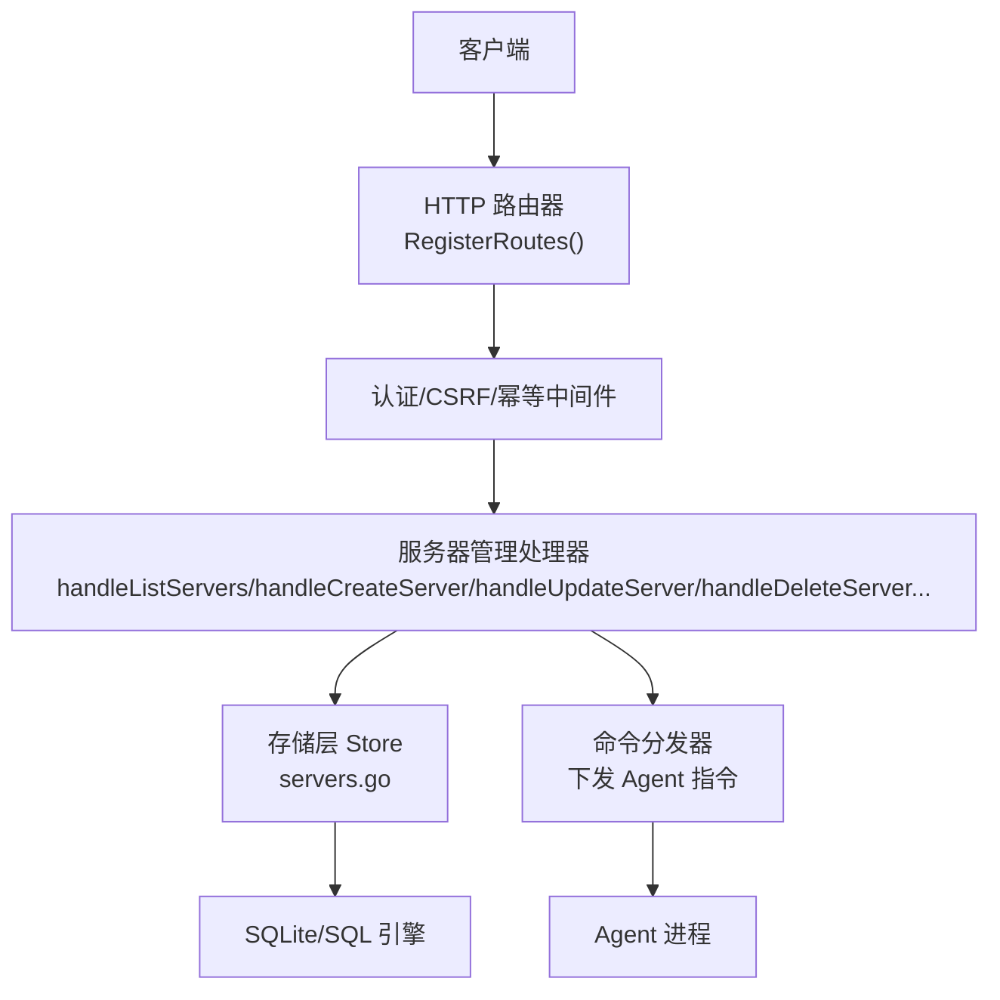
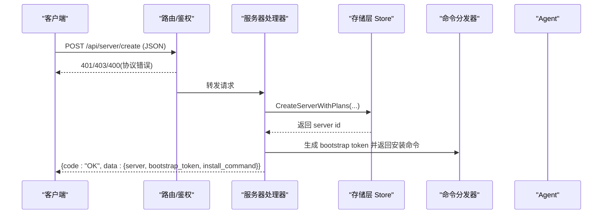
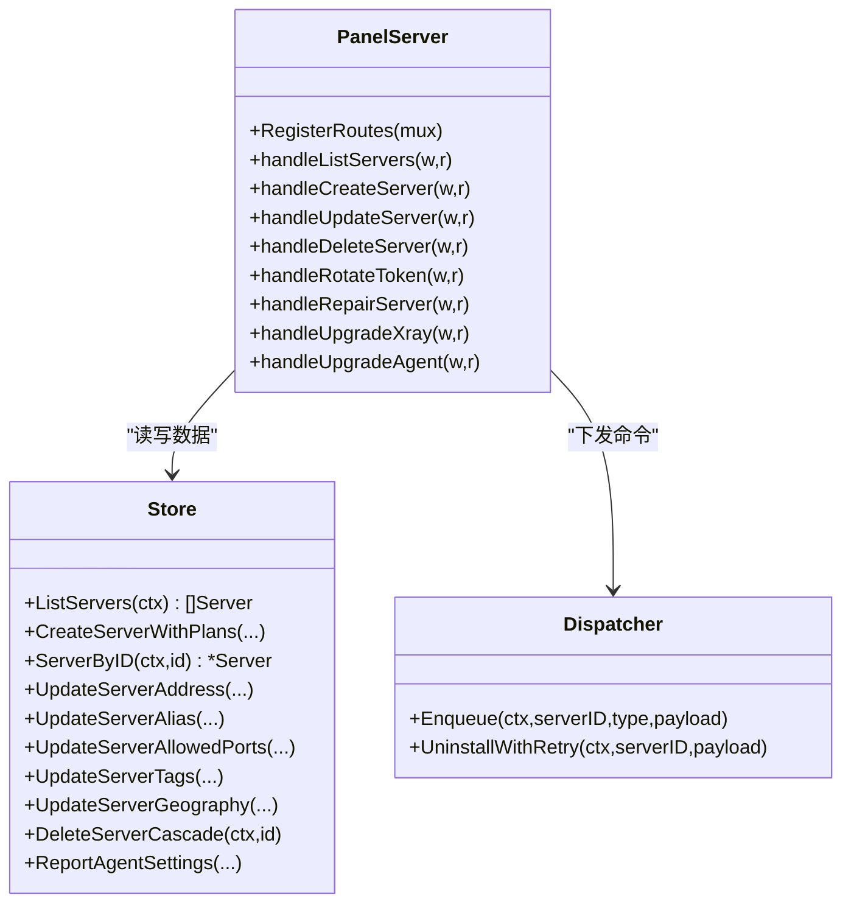

# 服务器管理 API

<cite>
**本文引用的文件**   
- [src/backend/internal/panel/panel.go](file://src/backend/internal/panel/panel.go)
- [src/backend/internal/panel/servers.go](file://src/backend/internal/panel/servers.go)
- [src/backend/internal/store/servers.go](file://src/backend/internal/store/servers.go)
- [docs/openapi.yaml](file://docs/openapi.yaml)
</cite>

## 目录
1. [简介](#简介)
2. [项目结构](#项目结构)
3. [核心组件](#核心组件)
4. [架构总览](#架构总览)
5. [详细接口说明](#详细接口说明)
6. [依赖关系分析](#依赖关系分析)
7. [性能与可用性](#性能与可用性)
8. [故障排查指南](#故障排查指南)
9. [结论](#结论)

## 简介
本文件为 Lattix-codex 项目的“服务器管理”RESTful API 文档，覆盖服务器的增删改查及高级功能（连接状态、健康检查、配置同步等）。需要特别说明的是：当前后端采用 RPC 风格的路由注册方式，所有服务器管理接口统一以 POST /api/server/* 形式暴露，请求体使用 JSON，响应统一包裹在业务信封中。前端或第三方系统可通过该接口完成服务器全生命周期管理与运维操作。

## 项目结构
- 路由注册与认证中间件位于 panel 包，集中定义所有 /api/* 路由与鉴权策略。
- 服务器管理的业务逻辑集中在 servers.go，包含列表、创建、更新、删除、升级、修复、令牌轮换等处理器。
- 数据持久化与实体模型在 store 包的 servers.go 中定义，包括 Server 结构体与数据库操作方法。
- OpenAPI 规范定义了统一的 RPC 信封、错误码与通用参数。

图表来源
- [src/backend/internal/panel/panel.go:162-279](file://src/backend/internal/panel/panel.go#L162-L279)
- [src/backend/internal/panel/servers.go:164-859](file://src/backend/internal/panel/servers.go#L164-L859)
- [src/backend/internal/store/servers.go:25-370](file://src/backend/internal/store/servers.go#L25-L370)

章节来源
- [src/backend/internal/panel/panel.go:162-279](file://src/backend/internal/panel/panel.go#L162-L279)
- [docs/openapi.yaml:1-712](file://docs/openapi.yaml#L1-L712)

## 核心组件
- HTTP 路由与中间件：统一处理认证、CSRF、幂等键、日志策略等。
- 服务器处理器：实现服务器 CRUD、升级、修复、令牌轮换等。
- 存储层：封装服务器实体、计费、流量计划、指标等数据的读写。
- 命令分发器：向在线 Agent 下发安装、卸载、升级、修复等指令。

章节来源
- [src/backend/internal/panel/panel.go:162-279](file://src/backend/internal/panel/panel.go#L162-L279)
- [src/backend/internal/panel/servers.go:164-859](file://src/backend/internal/panel/servers.go#L164-L859)
- [src/backend/internal/store/servers.go:25-370](file://src/backend/internal/store/servers.go#L25-L370)

## 架构总览
下图展示了服务器管理接口的调用链路：客户端通过 HTTP 访问面板，路由层进行鉴权后进入对应处理器；处理器读取/写入存储层，必要时通过分发器向 Agent 下发指令；最终返回统一信封的 JSON 响应。

图表来源
- [src/backend/internal/panel/panel.go:162-279](file://src/backend/internal/panel/panel.go#L162-L279)
- [src/backend/internal/panel/servers.go:208-322](file://src/backend/internal/panel/servers.go#L208-L322)
- [src/backend/internal/store/servers.go:121-150](file://src/backend/internal/store/servers.go#L121-L150)

## 详细接口说明

### 通用约定
- 内容类型：application/json
- 成功响应：HTTP 200，Body 为统一信封 {code, message, data, request_id, trace_id}
- 协议错误：HTTP 4xx/5xx，Body 为 application/problem+json 信封
- 鉴权：除登录接口外均需会话 Cookie 与 CSRF Token（写操作）
- 幂等：写操作支持 Idempotency-Key 头

章节来源
- [docs/openapi.yaml:449-712](file://docs/openapi.yaml#L449-L712)
- [src/backend/internal/panel/panel.go:325-391](file://src/backend/internal/panel/panel.go#L325-L391)

### GET /api/server/list（获取服务器列表）
- 方法：GET
- 路径：/api/server/list
- 鉴权：需要登录
- 请求体：无
- 响应字段：数组，元素为服务器 DTO，包含连接状态、版本、地址、标签、计费、流量计划、指标等
- 状态码：200 成功；401/403 未授权；500 内部错误

请求示例
- 无请求体

响应示例
- 200 OK
  - code: "OK"
  - data: [ {id, alias, connection_state, xray_version, agent_version, address, tags, billing, traffic_plan, metrics, ...}, ... ]

章节来源
- [src/backend/internal/panel/panel.go:176](file://src/backend/internal/panel/panel.go#L176)
- [src/backend/internal/panel/servers.go:164-206](file://src/backend/internal/panel/servers.go#L164-L206)

### POST /api/server/create（添加服务器）
- 方法：POST
- 路径：/api/server/create
- 鉴权：需要登录 + CSRF + 幂等键
- 请求体字段：
  - alias: 必填，服务器别名
  - address: 可选，公网地址；留空则自动学习；NAT 类型必填
  - xray_version: 兼容旧客户端，默认 latest
  - machine_type: direct 或 nat；默认 direct
  - allowed_ports: NAT 可用端口段（PortRange 数组），留空表示仅出口档
  - tags: 管理标签数组
  - country_code: ISO 3166-1 alpha-2
  - location: 城市或机房位置
  - billing: 计费信息（可选）
  - traffic_plan: 流量计划（可选，含配额、会计模式、重置锚点等）
- 响应字段：
  - server: 服务器 DTO
  - bootstrap_token: 一次性引导凭证
  - install_command: 一行安装命令
- 状态码：201/200（根据实现），400 参数错误，401/403 未授权，500 内部错误

请求示例
- {
  "alias": "node-1",
  "machine_type": "direct",
  "tags": ["prod"],
  "country_code": "CN",
  "location": "Beijing"
}

响应示例
- 201 Created
  - code: "OK"
  - data: {
      "server": {...},
      "bootstrap_token": "...",
      "install_command": "curl -fsSL https://raw.githubusercontent.com/... | bash -s -- agent --panel ... --token ..."
    }

章节来源
- [src/backend/internal/panel/panel.go:186](file://src/backend/internal/panel/panel.go#L186)
- [src/backend/internal/panel/servers.go:208-322](file://src/backend/internal/panel/servers.go#L208-L322)
- [src/backend/internal/store/servers.go:121-150](file://src/backend/internal/store/servers.go#L121-L150)

### POST /api/server/update（更新服务器）
- 方法：POST
- 路径：/api/server/update
- 鉴权：需要登录 + CSRF + 幂等键
- 请求体字段（均为可选，省略表示不变）：
  - server_id: 必填，目标服务器 ID
  - alias: 可选，别名（长度限制、非空校验）
  - address: 可选，公网地址；NAT 类型禁止置空
  - machine_type: 不允许建后互转（带不同值将报错）
  - allowed_ports: 可选，整体替换 NAT 可用端口段（收窄时校验存量节点与链跳端口不越界）
  - tags: 可选，整体替换标签
  - country_code/location: 必须同时提供或省略
  - billing/traffic_plan: 可选，分别校验计费与流量计划输入
- 响应字段：更新后的服务器 DTO
- 状态码：200 成功；400 参数错误；404 不存在；500 内部错误

请求示例
- {
  "server_id": 1,
  "alias": "node-1-updated",
  "allowed_ports": [{"start": 10000, "end": 20000}]
}

响应示例
- 200 OK
  - code: "OK"
  - data: { ... updated server DTO ... }

章节来源
- [src/backend/internal/panel/panel.go:187-189](file://src/backend/internal/panel/panel.go#L187-L189)
- [src/backend/internal/panel/servers.go:385-536](file://src/backend/internal/panel/servers.go#L385-L536)
- [src/backend/internal/store/servers.go:261-285](file://src/backend/internal/store/servers.go#L261-L285)

### POST /api/server/delete（删除服务器）
- 方法：POST
- 路径：/api/server/delete
- 鉴权：需要登录 + CSRF + 幂等键
- 请求体字段：
  - server_id: 必填
  - purge: 可选，xray（默认）或 agent；控制是否连同 xray 卸载
- 行为：
  - 在线：先下发 uninstall 命令（可重试），随后级联删除记录
  - 离线：仅删除记录（agent 需手动清理）
  - 受影响链路标记失效，并通知相关节点移除跳/服务节点
- 响应字段：无（data 为空）
- 状态码：200 成功；400/404/500 错误

请求示例
- {
  "server_id": 1,
  "purge": "xray"
}

响应示例
- 200 OK
  - code: "OK"
  - data: null

章节来源
- [src/backend/internal/panel/panel.go:190-192](file://src/backend/internal/panel/panel.go#L190-L192)
- [src/backend/internal/panel/servers.go:734-845](file://src/backend/internal/panel/servers.go#L734-L845)
- [src/backend/internal/store/servers.go:341-370](file://src/backend/internal/store/servers.go#L341-L370)

### 高级功能接口

#### POST /api/server/rotate-token（轮换引导凭证）
- 作用：换发新的 bootstrap token，重置回 bootstrap 状态，旧凭证立即失效
- 请求体：server_id
- 响应：server DTO、bootstrap_token、install_command

章节来源
- [src/backend/internal/panel/panel.go:193-195](file://src/backend/internal/panel/panel.go#L193-L195)
- [src/backend/internal/panel/servers.go:324-383](file://src/backend/internal/panel/servers.go#L324-L383)

#### POST /api/server/repair（配置漂移修复）
- 作用：重放该服务器全部 active 节点的 apply_node，重建配置并清除漂移标志
- 请求体：server_id
- 响应：reapplied（重新应用的节点数）

章节来源
- [src/backend/internal/panel/panel.go:196-198](file://src/backend/internal/panel/panel.go#L196-L198)
- [src/backend/internal/panel/servers.go:674-720](file://src/backend/internal/panel/servers.go#L674-L720)

#### POST /api/server/upgrade-xray（升级 Xray）
- 作用：下发 upgrade_xray 命令，离线服务器留队列补发
- 请求体：server_id, version（vX.Y.Z 或 latest）
- 响应：command_id, version

章节来源
- [src/backend/internal/panel/panel.go:199-201](file://src/backend/internal/panel/panel.go#L199-L201)
- [src/backend/internal/panel/servers.go:587-626](file://src/backend/internal/panel/servers.go#L587-L626)

#### POST /api/server/upgrade-agent（升级 Agent）
- 作用：下发 upgrade_agent 命令，从 GitHub release 下载二进制并原子自替换
- 请求体：server_id, version（vX.Y.Z 或 latest）
- 响应：command_id, version

章节来源
- [src/backend/internal/panel/panel.go:202-204](file://src/backend/internal/panel/panel.go#L202-L204)
- [src/backend/internal/panel/servers.go:628-672](file://src/backend/internal/panel/servers.go#L628-L672)

### 连接状态与健康检查
- 连接状态：服务器 DTO 中的 connection_state 字段反映在线/离线/从未连接等状态，来源于 WS Hub 快照或 IsOnline 判断
- 主机指标：metrics 字段包含 CPU、内存、磁盘、网络、延迟、运行时长等遥测数据
- 设置同步：agent_settings_status、agent_settings_revision/desired_revision/error/report_at 反映全局 Agent 设置的同步状态

章节来源
- [src/backend/internal/panel/servers.go:74-142](file://src/backend/internal/panel/servers.go#L74-L142)
- [src/backend/internal/store/servers.go:287-308](file://src/backend/internal/store/servers.go#L287-L308)

### 错误处理指南
- 协议错误：HTTP 4xx/5xx，Content-Type: application/problem+json，包含 code、message、request_id、trace_id
- 业务错误：HTTP 200，code 为非 OK 的业务码（如 INVALID_ARGUMENT、NOT_FOUND、INTERNAL_ERROR 等）
- 常见错误：
  - 参数缺失或非法（如 alias 为空、machine_type 非法、端口段收窄越界）
  - 服务器不存在（404）
  - 机器类型建后不允许互转（400）
  - 数据库/上游错误（500）

章节来源
- [src/backend/internal/panel/panel.go:352-419](file://src/backend/internal/panel/panel.go#L352-L419)
- [docs/openapi.yaml:666-712](file://docs/openapi.yaml#L666-L712)

## 依赖关系分析
- 路由注册：panel.RegisterRoutes 将所有 /api/server/* 路由映射到具体处理器
- 处理器依赖：
  - store.Store：服务器、节点、链路、计费、流量计划、指标等数据存取
  - dispatch.Dispatcher：向 Agent 下发命令（安装、卸载、升级、修复等）
  - ws.AgentRequester：在线状态查询、连接快照、关闭/遗忘 Agent 会话
- 数据模型：store.Server 包含别名、地址、版本、连接时间、漂移标志、NAT 端口段、标签、地理位置、凭证周期等

图表来源
- [src/backend/internal/panel/panel.go:162-279](file://src/backend/internal/panel/panel.go#L162-L279)
- [src/backend/internal/panel/servers.go:164-859](file://src/backend/internal/panel/servers.go#L164-L859)
- [src/backend/internal/store/servers.go:25-370](file://src/backend/internal/store/servers.go#L25-L370)

章节来源
- [src/backend/internal/panel/panel.go:162-279](file://src/backend/internal/panel/panel.go#L162-L279)
- [src/backend/internal/panel/servers.go:164-859](file://src/backend/internal/panel/servers.go#L164-L859)
- [src/backend/internal/store/servers.go:25-370](file://src/backend/internal/store/servers.go#L25-L370)

## 性能与可用性
- 列表接口会聚合指标、计费、流量计划与提供者信息，建议在高频轮询场景下缓存或分页（若后续扩展）
- 删除接口对在线服务器执行卸载重试，超时不影响最终一致性（删除仍生效）
- 升级/修复接口异步下发命令，结果通过 telemetry/审计日志追踪
- 建议客户端实现重试与退避策略，避免瞬时抖动导致频繁失败

[本节为通用指导，无需代码引用]

## 故障排查指南
- 确认鉴权：检查会话 Cookie 与 CSRF Token 是否正确携带
- 查看协议错误：HTTP 4xx/5xx 的 problem+json 响应中包含 code/message/request_id/trace_id
- 检查业务错误：HTTP 200 但 code 非 OK，按业务码定位问题
- 常见问题：
  - 参数校验失败：检查必填字段、枚举值、端口段合法性
  - 服务器不存在：确认 server_id 有效
  - 机器类型互转：确保不在 update 中改变 machine_type
  - 端口段收窄越界：检查存量节点与链跳端口是否在新范围内
- 日志与审计：通过操作日志与请求日志定位问题根因

章节来源
- [src/backend/internal/panel/panel.go:352-419](file://src/backend/internal/panel/panel.go#L352-L419)
- [docs/openapi.yaml:666-712](file://docs/openapi.yaml#L666-L712)

## 结论
Lattix-codex 的服务器管理 API 以统一的 RPC 信封与严格的鉴权机制为基础，提供了完整的服务器生命周期管理能力。通过清晰的请求/响应格式、完善的错误处理与丰富的高级功能（升级、修复、凭证轮换、连接状态与指标），能够满足生产环境下的多租户、高可用与可观测性需求。建议客户端严格遵循鉴权与幂等要求，并结合日志与审计信息进行排障与监控。