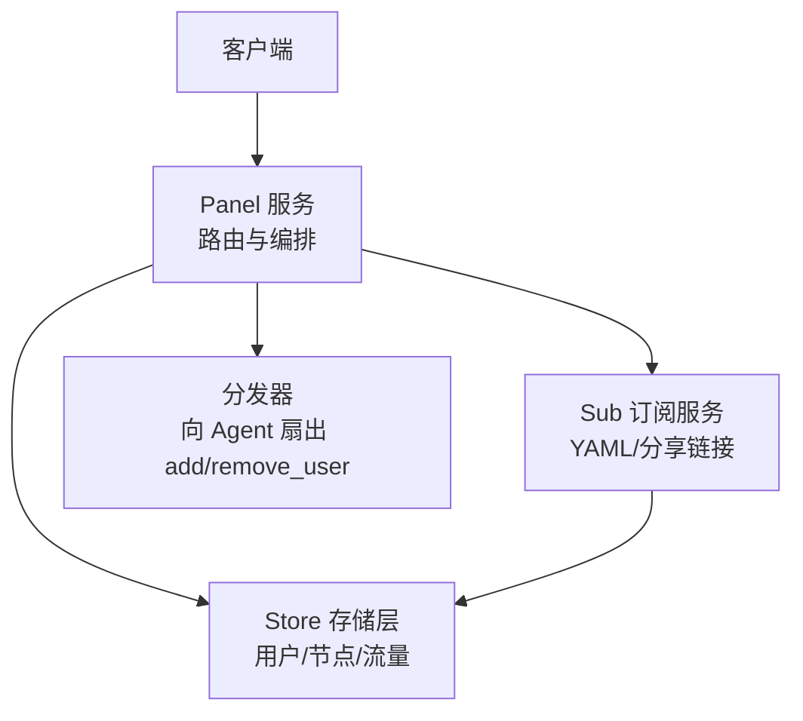
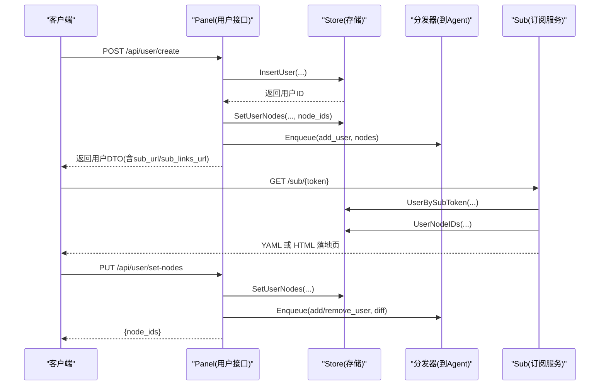
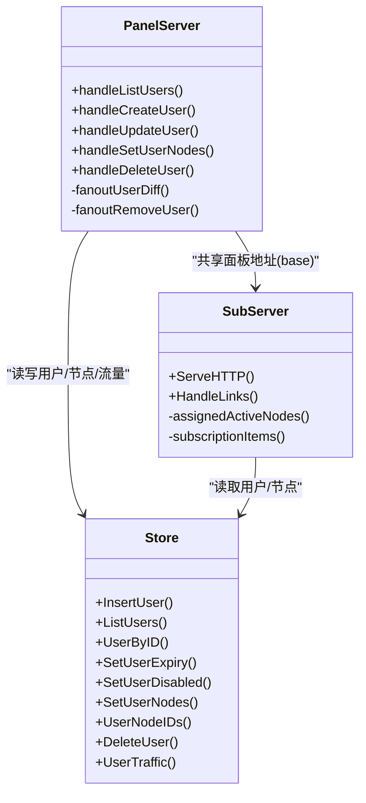

# 用户管理 API

<cite>
**本文引用的文件**   
- [panel.go](file://src/backend/internal/panel/panel.go)
- [users.go](file://src/backend/internal/panel/users.go)
- [users_store.go](file://src/backend/internal/store/users.go)
- [sub.go](file://src/backend/internal/sub/sub.go)
- [links.go](file://src/backend/internal/sub/links.go)
</cite>

## 目录
1. [简介](#简介)
2. [项目结构](#项目结构)
3. [核心组件](#核心组件)
4. [架构总览](#架构总览)
5. [详细组件分析](#详细组件分析)
6. [依赖关系分析](#依赖关系分析)
7. [性能考量](#性能考量)
8. [故障排查指南](#故障排查指南)
9. [结论](#结论)
10. [附录：接口规范与示例](#附录接口规范与示例)

## 简介
本文件为 Lattix-codex 项目的“用户管理”RESTful API 文档，覆盖用户的增删改查、角色权限（基于节点分配与停权状态）、订阅链接生成、配额与流量统计等高级能力。同时给出请求/响应示例与错误处理指引，帮助开发者快速集成与排障。

说明：
- 实际路由采用 RPC 风格注册，但语义等价于 RESTful 的 CRUD 操作。
- 用户订阅端点提供 mihomo YAML 与 vless/trojan/vmess/ss 分享链接集合两种形式。
- 用户状态由“到期停权”和“管理员停用”共同决定；任一成立即视为有效停权态。

## 项目结构
与用户管理相关的后端代码主要位于 panel 层（HTTP 路由与业务编排）与 store 层（数据持久化），以及 sub 层（订阅服务）。

图表来源
- [panel.go:238-249](file://src/backend/internal/panel/panel.go#L238-L249)
- [users.go:50-156](file://src/backend/internal/panel/users.go#L50-L156)
- [users_store.go:25-116](file://src/backend/internal/store/users.go#L25-L116)
- [sub.go:143-190](file://src/backend/internal/sub/sub.go#L143-L190)

章节来源
- [panel.go:238-249](file://src/backend/internal/panel/panel.go#L238-L249)
- [users.go:50-156](file://src/backend/internal/panel/users.go#L50-L156)

## 核心组件
- 用户 DTO：包含用户标识、UUID、订阅令牌、订阅链接、分配的节点 ID、流量合计、有效期与停权标记等。
- 用户控制器：实现创建、查询、更新、删除、节点分配等接口，并负责与存储层和分发器交互。
- 存储层：用户表、用户-节点关联表、流量统计聚合、到期扫描与停权标记更新。
- 订阅服务：按用户 UUID 生成 mihomo YAML 或分享链接集合，支持浏览器落地页。

章节来源
- [users.go:18-48](file://src/backend/internal/panel/users.go#L18-L48)
- [users_store.go:11-23](file://src/backend/internal/store/users.go#L11-L23)
- [sub.go:18-36](file://src/backend/internal/sub/sub.go#L18-L36)

## 架构总览
下图展示用户管理的整体调用链：客户端通过 Panel 路由发起请求，Panel 编排业务逻辑，必要时写入存储层，并通过分发器向 Agent 下发 add/remove_user 指令；订阅服务根据用户与节点配置生成订阅内容。

图表来源
- [panel.go:238-249](file://src/backend/internal/panel/panel.go#L238-L249)
- [users.go:82-156](file://src/backend/internal/panel/users.go#L82-L156)
- [users_store.go:25-116](file://src/backend/internal/store/users.go#L25-L116)
- [sub.go:143-190](file://src/backend/internal/sub/sub.go#L143-L190)

## 详细组件分析

### 用户接口（CRUD）
- 创建用户
  - 方法路径：POST /api/user/create
  - 功能：生成 UUID 与 sub_token；可选设置 expires_at（RFC3339）；可选预选 node_ids（校验存在后差量扇出 add_user）。
  - 成功响应：用户 DTO（含 sub_url、sub_links_url、node_ids、traffic、expires_at、expired、disabled 等）。
  - 错误：参数校验失败（如 name 为空、expires_at 格式错误或为过去时间）、节点不存在等。

- 获取用户列表
  - 方法路径：GET /api/user/list
  - 功能：返回全部用户及其流量合计、节点分配。
  - 成功响应：用户 DTO 数组。

- 更新用户
  - 方法路径：POST /api/user/update
  - 功能：修改/清除 expires_at（null 表示长期）；切换 disabled（显式停用/启用）。停权态跃迁时自动扇出 remove/add_user。
  - 成功响应：更新后的用户 DTO。
  - 错误：用户不存在、expires_at 格式无效或为过去时间等。

- 设置用户节点
  - 方法路径：POST /api/user/set-nodes
  - 功能：整体替换用户的节点分配，计算差量并扇出 add/remove_user。
  - 成功响应：{node_ids}。
  - 错误：节点不存在、参数非法等。

- 删除用户
  - 方法路径：POST /api/user/delete
  - 功能：先扇出 remove_user，再删除用户记录。
  - 成功响应：空对象。
  - 错误：用户不存在、内部错误等。

章节来源
- [users.go:50-156](file://src/backend/internal/panel/users.go#L50-L156)
- [users.go:170-278](file://src/backend/internal/panel/users.go#L170-L278)
- [users.go:287-345](file://src/backend/internal/panel/users.go#L287-L345)
- [users.go:381-412](file://src/backend/internal/panel/users.go#L381-L412)
- [panel.go:238-249](file://src/backend/internal/panel/panel.go#L238-L249)

### 用户状态与停权机制
- 停权态判定：expired（到期停权）或 disabled（管理员停用）任一为真即为有效停权态。
- 到期扫描：sweeper 定时将过期用户置 expired=1，并触发 remove_user 扇出。
- 恢复策略：当 expires_at 被清除或设置为未来时间时，expired 复位；若同时 disabled=false，则触发 add_user 扇出。

章节来源
- [users_store.go:118-192](file://src/backend/internal/store/users.go#L118-L192)
- [users.go:170-278](file://src/backend/internal/panel/users.go#L170-L278)

### 订阅链接与落地页
- mihomo YAML 订阅
  - 路径：GET /sub/{token}
  - 行为：按用户 UUID 生成各 active 节点的代理项；浏览器 Accept=text/html 时返回落地页 HTML；否则返回 YAML。
  - 头部：Subscription-Userinfo（upload/download/expire）、Profile-Update-Interval=24。

- 分享链接集合
  - 路径：GET /sub/{token}/links
  - 行为：返回 base64 编码的换行分隔分享链接（vless/trojan/vmess/ss），仅包含该用户已分配的 active 节点；有效停权态返回空集合。

章节来源
- [sub.go:143-190](file://src/backend/internal/sub/sub.go#L143-L190)
- [links.go:16-43](file://src/backend/internal/sub/links.go#L16-L43)

### 配额与流量统计
- 用户维度流量：订阅头中的 upload/download 来自 traffic 表用户维度的累计值（node_id=0 的累计）。
- 服务器维度配额：计费与流量计划属于服务器侧能力，用户接口不直接暴露配额字段；可通过服务器详情接口查看。

章节来源
- [sub.go:38-53](file://src/backend/internal/sub/sub.go#L38-L53)
- [billing.go:354-389](file://src/backend/internal/panel/billing.go#L354-L389)

### 批量操作与导入导出
- 当前未提供专门的批量用户导入/导出接口。可通过循环调用创建/更新/删除接口实现批量操作。
- 节点分配可使用 set-nodes 接口进行整批替换。

[本节为概念性说明，不直接分析具体文件]

## 依赖关系分析
- Panel 层依赖 Store 层完成用户、节点、流量的读写。
- Panel 层通过分发器向 Agent 下发 add/remove_user 指令，确保数据面与管控面一致。
- Sub 层依赖 Store 层获取用户与节点信息，生成订阅内容。

图表来源
- [users.go:50-156](file://src/backend/internal/panel/users.go#L50-L156)
- [users_store.go:25-116](file://src/backend/internal/store/users.go#L25-L116)
- [sub.go:143-190](file://src/backend/internal/sub/sub.go#L143-L190)

章节来源
- [users.go:347-379](file://src/backend/internal/panel/users.go#L347-L379)
- [users_store.go:194-253](file://src/backend/internal/store/users.go#L194-L253)
- [sub.go:205-247](file://src/backend/internal/sub/sub.go#L205-L247)

## 性能考量
- 列表接口会聚合用户与流量数据，注意在大规模用户场景下的查询开销。
- 节点分配变更会触发 fanoutUserDiff，按服务器分组下发 add/remove_user，避免全量重复下发。
- 订阅服务对每个请求都会查询用户与节点信息，建议配合缓存或限流策略。

[本节为通用指导，不直接分析具体文件]

## 故障排查指南
- 常见错误码与消息
  - 参数非法：400，message 描述具体问题（如 name 为空、expires_at 格式无效、节点不存在）。
  - 资源不存在：404，用户不存在。
  - 内部错误：500，数据库或分发器异常。
- 审计日志
  - 用户创建、更新、节点分配、删除均会记录审计事件，便于追踪变更。
- 订阅问题
  - 检查用户是否处于有效停权态（expired/disabled），此时订阅内容为空。
  - 确认节点状态为 active 且 realized_config 可用。

章节来源
- [panel.go:349-405](file://src/backend/internal/panel/panel.go#L349-L405)
- [users.go:152-156](file://src/backend/internal/panel/users.go#L152-L156)
- [users.go:269-278](file://src/backend/internal/panel/users.go#L269-L278)
- [users.go:410-412](file://src/backend/internal/panel/users.go#L410-L412)
- [sub.go:164-166](file://src/backend/internal/sub/sub.go#L164-L166)

## 结论
用户管理 API 提供了完整的 CRUD 能力，结合节点分配与停权机制，实现了细粒度的访问控制与生命周期管理。订阅服务支持多协议与落地页，满足多样化客户端需求。建议在大规模部署中关注查询与扇出的性能优化，并结合审计日志进行运维排障。

[本节为总结性内容，不直接分析具体文件]

## 附录：接口规范与示例

### 创建用户
- 方法路径：POST /api/user/create
- 请求体字段：
  - name: string（必填）
  - expires_at: string|null（RFC3339，省略/null 表示长期）
  - node_ids: int64[]（可选，预选链路对应的业务节点）
- 成功响应：用户 DTO
  - id: int64
  - name: string
  - uuid: string
  - sub_token: string
  - sub_url: string（mihomo 订阅链接）
  - sub_links_url: string（分享链接集合订阅）
  - node_ids: int64[]
  - traffic: object|null（up/down 累计）
  - expires_at: string|null
  - expired: bool
  - disabled: bool
  - created_at: string
- 错误示例：
  - 400: {"code":"invalid_argument","message":"name 不能为空"}
  - 400: {"code":"invalid_argument","message":"expires_at 格式无效（需 RFC3339）"}
  - 400: {"code":"invalid_argument","message":"链路对应节点 X 不存在"}

章节来源
- [users.go:82-156](file://src/backend/internal/panel/users.go#L82-L156)
- [panel.go:349-405](file://src/backend/internal/panel/panel.go#L349-L405)

### 获取用户列表
- 方法路径：GET /api/user/list
- 成功响应：用户 DTO 数组
- 错误示例：
  - 500: {"code":"internal_error","message":"..."}

章节来源
- [users.go:50-76](file://src/backend/internal/panel/users.go#L50-L76)
- [panel.go:349-405](file://src/backend/internal/panel/panel.go#L349-L405)

### 更新用户
- 方法路径：POST /api/user/update
- 请求体字段：
  - user_id: int64（必填）
  - expires_at: string|null（省略=不变；null=清除为长期）
  - disabled: bool（省略=不变）
- 成功响应：更新后的用户 DTO
- 错误示例：
  - 400: {"code":"invalid_argument","message":"expires_at 格式无效（需 RFC3339 或 null）"}
  - 404: {"code":"not_found","message":"用户不存在"}

章节来源
- [users.go:170-278](file://src/backend/internal/panel/users.go#L170-L278)
- [panel.go:349-405](file://src/backend/internal/panel/panel.go#L349-L405)

### 设置用户节点
- 方法路径：POST /api/user/set-nodes
- 请求体字段：
  - user_id: int64（必填）
  - node_ids: int64[]（必填）
- 成功响应：{"node_ids": [...]}
- 错误示例：
  - 400: {"code":"invalid_argument","message":"节点 X 不存在"}

章节来源
- [users.go:287-345](file://src/backend/internal/panel/users.go#L287-L345)
- [panel.go:349-405](file://src/backend/internal/panel/panel.go#L349-L405)

### 删除用户
- 方法路径：POST /api/user/delete
- 请求体字段：
  - user_id: int64（必填）
- 成功响应：{}
- 错误示例：
  - 404: {"code":"not_found","message":"用户不存在"}

章节来源
- [users.go:381-412](file://src/backend/internal/panel/users.go#L381-L412)
- [panel.go:349-405](file://src/backend/internal/panel/panel.go#L349-L405)

### 订阅链接
- mihomo YAML 订阅
  - 方法路径：GET /sub/{token}
  - 成功响应：YAML 文本或 HTML 落地页（浏览器）
  - 响应头：
    - Subscription-Userinfo: "upload=X; download=Y; expire=Z"（如有有效期）
    - Profile-Update-Interval: "24"

- 分享链接集合
  - 方法路径：GET /sub/{token}/links
  - 成功响应：base64 编码的换行分隔链接（vless/trojan/vmess/ss）
  - 有效停权态：返回空集合

章节来源
- [sub.go:143-190](file://src/backend/internal/sub/sub.go#L143-L190)
- [links.go:16-43](file://src/backend/internal/sub/links.go#L16-L43)

### 错误处理统一格式
- 所有错误响应遵循统一的 JSON 结构：
  - code: string（如 invalid_argument、not_found、internal_error）
  - message: string（人类可读的错误描述）
  - data: any（通常为 null）
  - request_id: string（请求追踪 ID）
  - trace_id: string（链路追踪 ID）

章节来源
- [panel.go:322-382](file://src/backend/internal/panel/panel.go#L322-L382)