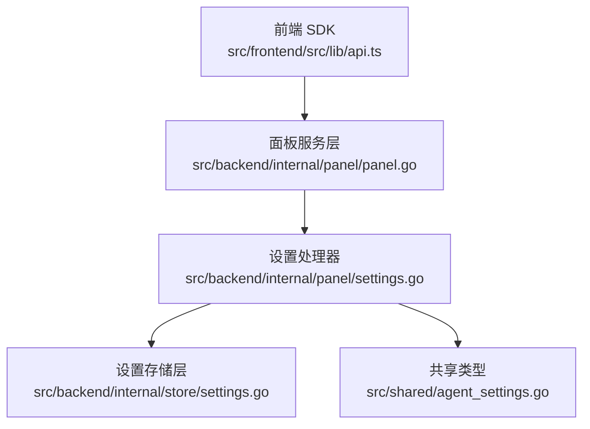
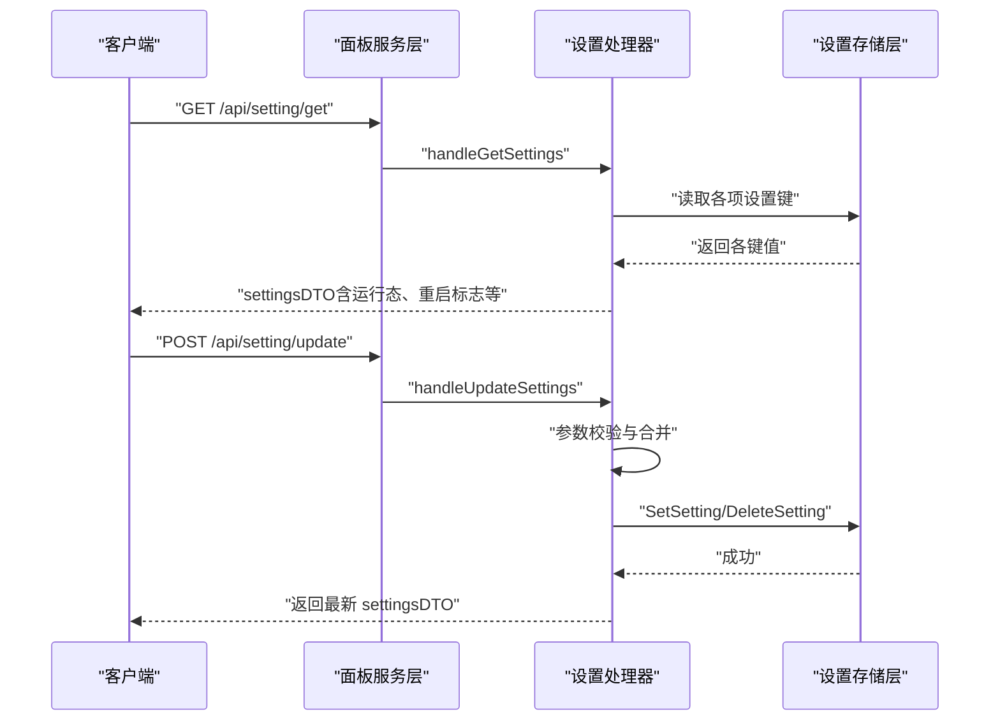
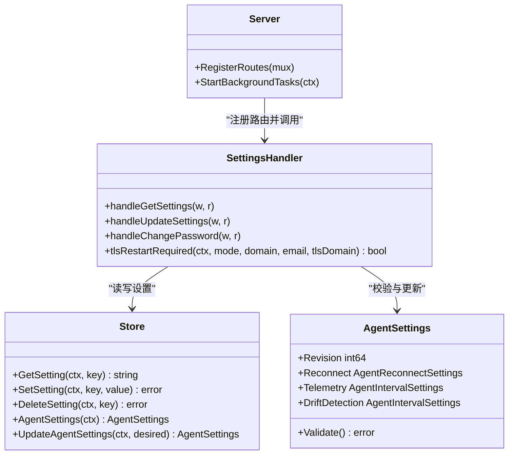

# 系统设置 API

<cite>
**本文引用的文件**   
- [src/backend/internal/panel/settings.go](file://src/backend/internal/panel/settings.go)
- [src/backend/internal/panel/panel.go](file://src/backend/internal/panel/panel.go)
- [src/backend/internal/store/settings.go](file://src/backend/internal/store/settings.go)
- [src/shared/agent_settings.go](file://src/shared/agent_settings.go)
- [src/frontend/src/lib/api.ts](file://src/frontend/src/lib/api.ts)
- [src/frontend/src/lib/api-contract.generated.ts](file://src/frontend/src/lib/api-contract.generated.ts)
</cite>

## 目录
1. [简介](#简介)
2. [项目结构](#项目结构)
3. [核心组件](#核心组件)
4. [架构总览](#架构总览)
5. [详细组件分析](#详细组件分析)
6. [依赖关系分析](#依赖关系分析)
7. [性能考虑](#性能考虑)
8. [故障排查指南](#故障排查指南)
9. [结论](#结论)
10. [附录：配置项与最佳实践](#附录配置项与最佳实践)

## 简介
本文件为 Lattix-codex 项目的“系统设置”RESTful API 文档，聚焦于系统配置的读取与修改接口。根据后端路由注册与处理器实现，实际对外暴露的接口路径为：
- GET /api/setting/get（获取系统设置）
- POST /api/setting/update（更新系统设置）
- POST /api/setting/change-password（修改管理员密码）
- POST /api/setting/test-alerts（测试告警通道）

前端调用封装亦使用上述路径。尽管需求描述中提及 GET /api/settings 与 PUT /api/settings，但代码实现以 /api/setting/get 与 /api/setting/update 为准。本文档以后端真实实现为准进行说明。

## 项目结构
系统设置相关能力由以下模块协作完成：
- 面板服务层：负责 HTTP 路由注册、鉴权、参数校验、审计记录、调度通知等
- 存储层：负责设置键值持久化、Agent 全局设置读写
- 共享类型：定义 Agent 设置结构与默认值、校验规则
- 前端 SDK：封装设置相关 API 调用

**图表来源** 
- [src/backend/internal/panel/panel.go:158-276](file://src/backend/internal/panel/panel.go#L158-L276)
- [src/backend/internal/panel/settings.go:109-172](file://src/backend/internal/panel/settings.go#L109-L172)
- [src/backend/internal/store/settings.go:42-73](file://src/backend/internal/store/settings.go#L42-L73)
- [src/shared/agent_settings.go:54-83](file://src/shared/agent_settings.go#L54-L83)
- [src/frontend/src/lib/api.ts:227-242](file://src/frontend/src/lib/api.ts#L227-L242)

**章节来源**
- [src/backend/internal/panel/panel.go:158-276](file://src/backend/internal/panel/panel.go#L158-L276)
- [src/backend/internal/panel/settings.go:109-172](file://src/backend/internal/panel/settings.go#L109-L172)
- [src/backend/internal/store/settings.go:42-73](file://src/backend/internal/store/settings.go#L42-L73)
- [src/shared/agent_settings.go:54-83](file://src/shared/agent_settings.go#L54-L83)
- [src/frontend/src/lib/api.ts:227-242](file://src/frontend/src/lib/api.ts#L227-L242)

## 核心组件
- 设置 DTO（GET 响应）：包含时区、对外地址、TLS 模式与证书摘要、ACME 信息、日志保留策略、Agent 设置、巡检计划、统计币种等
- 更新请求体（POST 入参）：支持对时区、流量统计时区、对外地址、TLS 模式与证书、ACME、告警 Webhook/Telegram、操作日志与请求日志容量、Agent 设置、发布巡检、计费巡检、汇率刷新、统计币种等进行更新
- 存储键：所有设置项均以 key-value 形式持久化，未设置则回退到启动参数或默认值
- 鉴权与审计：设置接口需登录；变更会生成审计记录（敏感字段仅标记“已变更”，不记录明文）

**章节来源**
- [src/backend/internal/panel/settings.go:75-107](file://src/backend/internal/panel/settings.go#L75-L107)
- [src/backend/internal/panel/settings.go:196-219](file://src/backend/internal/panel/settings.go#L196-L219)
- [src/backend/internal/store/settings.go:13-40](file://src/backend/internal/store/settings.go#L13-L40)
- [src/backend/internal/panel/panel.go:158-276](file://src/backend/internal/panel/panel.go#L158-L276)

## 架构总览
设置读取与更新的典型流程如下：

**图表来源** 
- [src/backend/internal/panel/panel.go:251-255](file://src/backend/internal/panel/panel.go#L251-L255)
- [src/backend/internal/panel/settings.go:109-172](file://src/backend/internal/panel/settings.go#L109-L172)
- [src/backend/internal/panel/settings.go:221-566](file://src/backend/internal/panel/settings.go#L221-L566)
- [src/backend/internal/store/settings.go:42-73](file://src/backend/internal/store/settings.go#L42-L73)

## 详细组件分析

### 接口一：获取系统设置
- 方法：GET
- 路径：/api/setting/get
- 鉴权：需要登录
- 功能：返回当前保存的设置、运行态快照、是否需要重启等信息

响应关键字段（节选）：
- timezone：面板显示时区（IANA），空表示浏览器本地
- traffic_timezone：流量日/月桶边界使用的 IANA 时区
- public_url：面板对外地址（空则从请求推断）
- tls_mode：保存的 TLS 模式（off/cert/acme/path），空表示跟随启动参数
- tls_cert：证书摘要（不含私钥）
- tls_key_set：是否已保存私钥
- tls_domain：path 模式域名
- tls_dir：证书根目录（绝对路径）
- acme_domain / acme_email：ACME 域名与邮箱
- running_tls_mode：当前进程实际生效的 TLS 模式
- restart_required：保存值与运行态不一致时需要重启
- admin_user / panel_version：管理员账号与面板版本
- password_override：密码是否已被设置页覆盖
- alert_webhook_url / alert_telegram_bot_token_set / alert_telegram_chat_id：事件告警配置
- operation_log_limit / request_log_max_mb / log_dir：日志保留策略与目录
- request_log_usage_bytes / request_log_dropped：请求日志用量与丢弃计数
- backup_includes_logs：备份是否包含日志（当前固定 false）
- agent：Agent 全局设置（含 revision、reconnect、telemetry、drift_detection）
- release_inspection / billing_inspection / exchange_rate_inspection：发布/计费/汇率巡检计划
- reporting_currency：统计币种（默认 CNY）

注意：
- 当 tls_mode 为空时，restart_required 始终为 false（跟随启动参数）
- path 模式下证书摘要取自目录内当前文件，便于外部 ACME 续期后即时反映

**章节来源**
- [src/backend/internal/panel/settings.go:75-107](file://src/backend/internal/panel/settings.go#L75-L107)
- [src/backend/internal/panel/settings.go:109-172](file://src/backend/internal/panel/settings.go#L109-L172)
- [src/backend/internal/panel/settings.go:174-194](file://src/backend/internal/panel/settings.go#L174-L194)

### 接口二：更新系统设置
- 方法：POST
- 路径：/api/setting/update
- 鉴权：需要登录 + CSRF
- 幂等：支持 Idempotency-Key
- 功能：校验并落库设置，部分立即生效，部分重启生效

请求体关键字段（节选）：
- timezone：IANA 时区名（可为空）
- traffic_timezone：流量统计时区（空则回退默认）
- public_url：形如 http(s)://域名[:端口]（可为空）
- tls_mode：off|cert|acme|path（空=跟随启动参数）
- tls_cert_pem / tls_key_pem：PEM 字符串（二者须同时提供或留空保持原值）
- tls_domain：path 模式域名
- acme_domain / acme_email：ACME 域名与邮箱
- alert_webhook_url：Webhook 地址（http(s)）
- alert_telegram_bot_token：Telegram Bot Token（留空保持不变）
- alert_telegram_chat_id：Telegram Chat ID
- operation_log_limit：操作日志条数（100–100000，默认 1000）
- request_log_max_mb：请求日志缓存 MB（1–1024，默认 10）
- agent：Agent 设置对象（服务端强制 revision=1，内部校验）
- release_inspection / billing_inspection / exchange_rate_inspection：巡检计划
- reporting_currency：统计币种（大写，默认 CNY，需受支持）

处理要点：
- 时区与流量时区必须为有效 IANA 名称
- public_url 必须为合法 URL（http/https）
- TLS 模式校验与完整性检查：
  - cert：需提供证书与私钥 PEM
  - acme：需提供域名
  - path：需提供域名且目录下存在可用证书/私钥配对
- 告警 Webhook 必须为 http(s)
- 日志限制范围校验
- 统计币种大小写规范化与白名单校验
- 巡检计划仅支持“每天指定时间执行”
- 更新成功后触发调度器通知（如巡检计划变更）
- 审计记录变更差异（敏感字段仅标记“已变更”，不记录明文）

**章节来源**
- [src/backend/internal/panel/settings.go:196-219](file://src/backend/internal/panel/settings.go#L196-L219)
- [src/backend/internal/panel/settings.go:221-566](file://src/backend/internal/panel/settings.go#L221-L566)

### 接口三：修改管理员密码
- 方法：POST
- 路径：/api/setting/change-password
- 鉴权：需要登录 + CSRF
- 功能：校验当前密码后写入 bcrypt 哈希（DB 覆盖启动参数；改密即全部会话失效）

请求体：
- current_password：当前密码
- new_password：新密码（至少 8 位）

行为：
- 若 DB 中存在 bcrypt 哈希则以之为准，否则比对启动参数
- 改密后凭据密钥派生源变化，导致全部会话失效

**章节来源**
- [src/backend/internal/panel/settings.go:568-614](file://src/backend/internal/panel/settings.go#L568-L614)

### 接口四：测试告警通道
- 方法：POST
- 路径：/api/setting/test-alerts
- 鉴权：需要登录 + CSRF
- 功能：触发一次告警测试，验证 Webhook/Telegram 配置有效性

**章节来源**
- [src/backend/internal/panel/panel.go:255](file://src/backend/internal/panel/panel.go#L255)

## 依赖关系分析
- 路由注册：面板服务统一注册 /api/setting/* 路由，并附加鉴权、CSRF、幂等、日志策略等中间件
- 设置存储：通过 store.Setting* 常量键管理，支持 Get/Set/Delete
- Agent 设置：独立 JSON 结构，带 schema version 与校验，首次使用创建默认值
- 前端 SDK：封装 settingGet、settingUpdate、settingChangePassword、settingTestAlerts

**图表来源** 
- [src/backend/internal/panel/panel.go:158-276](file://src/backend/internal/panel/panel.go#L158-L276)
- [src/backend/internal/panel/settings.go:109-172](file://src/backend/internal/panel/settings.go#L109-L172)
- [src/backend/internal/store/settings.go:42-166](file://src/backend/internal/store/settings.go#L42-L166)
- [src/shared/agent_settings.go:37-83](file://src/shared/agent_settings.go#L37-L83)

**章节来源**
- [src/backend/internal/panel/panel.go:158-276](file://src/backend/internal/panel/panel.go#L158-L276)
- [src/backend/internal/store/settings.go:42-166](file://src/backend/internal/store/settings.go#L42-L166)
- [src/shared/agent_settings.go:37-83](file://src/shared/agent_settings.go#L37-L83)
- [src/frontend/src/lib/api.ts:227-242](file://src/frontend/src/lib/api.ts#L227-L242)

## 性能考虑
- 设置读取为轻量级数据库查询，无复杂计算
- 更新设置涉及多次 Set/Delete 操作，建议批量调用时合理拆分
- 巡检计划变更会触发调度器通知，避免频繁变更
- 请求日志容量与操作日志条数调整会直接影响内存占用与磁盘 IO，建议按业务规模评估

[本节为通用指导，无需源码引用]

## 故障排查指南
常见问题与定位要点：
- 参数校验失败：
  - 时区非法、URL 格式错误、TLS 模式不完整、Webhook 非 http(s)、日志限制越界、统计币种不支持
  - 参考错误提示与校验逻辑
- TLS 重启标志：
  - 当保存的 TLS 模式与运行态不一致时，restart_required=true，需重启生效
- 密码修改后无法登录：
  - 改密会更换凭据密钥派生源，导致旧会话失效，需重新登录
- 告警测试失败：
  - 检查 Webhook/Telegram 配置是否正确，必要时使用测试接口验证

**章节来源**
- [src/backend/internal/panel/settings.go:221-566](file://src/backend/internal/panel/settings.go#L221-L566)
- [src/backend/internal/panel/settings.go:568-614](file://src/backend/internal/panel/settings.go#L568-L614)

## 结论
系统设置 API 提供了全面的运行时配置管理能力，涵盖基础环境（时区、对外地址）、安全（TLS/ACME/密码）、可观测性（日志策略）、运维（巡检计划、Agent 设置）与财务（统计币种）。通过严格的参数校验、审计记录与重启标志机制，确保配置变更的安全性与可控性。

[本节为总结，无需源码引用]

## 附录：配置项与最佳实践

### 配置项说明与默认值
- timezone：面板显示时区（IANA），空=浏览器本地
- traffic_timezone：流量统计时区（IANA），默认来自系统常量
- public_url：面板对外地址（http/https），空=从请求推断
- tls_mode：off/cert/acme/path，空=跟随启动参数
- tls_cert_pem / tls_key_pem：PEM 字符串（cert 模式必需）
- tls_domain：path 模式域名
- tls_dir：证书根目录（绝对路径）
- acme_domain / acme_email：ACME 域名与邮箱
- alert_webhook_url：Webhook 地址（http/https）
- alert_telegram_bot_token：Telegram Bot Token（留空不变）
- alert_telegram_chat_id：Telegram Chat ID
- operation_log_limit：操作日志条数（100–100000，默认 1000）
- request_log_max_mb：请求日志缓存 MB（1–1024，默认 10）
- log_dir：日志目录（只读）
- request_log_usage_bytes / request_log_dropped：请求日志用量与丢弃计数
- backup_includes_logs：备份是否包含日志（当前固定 false）
- agent：Agent 设置（revision、reconnect.mode/max_retries、telemetry.interval_seconds、drift_detection.interval_seconds）
- release_inspection / billing_inspection / exchange_rate_inspection：巡检计划（仅支持每天指定时间）
- reporting_currency：统计币种（默认 CNY，需受支持）

**章节来源**
- [src/backend/internal/panel/settings.go:75-107](file://src/backend/internal/panel/settings.go#L75-L107)
- [src/backend/internal/panel/settings.go:196-219](file://src/backend/internal/panel/settings.go#L196-L219)
- [src/backend/internal/store/settings.go:13-40](file://src/backend/internal/store/settings.go#L13-L40)
- [src/shared/agent_settings.go:54-83](file://src/shared/agent_settings.go#L54-L83)

### 取值范围与影响范围
- 时区：必须为有效 IANA 名称；影响面板时间与流量统计分桶
- public_url：影响安装命令与订阅链接生成
- TLS：
  - off：关闭 TLS
  - cert：内置证书，重启生效
  - acme：自动证书，重启生效
  - path：目录路径模式，热加载免重启续期（证书文件替换即可）
- 日志：
  - operation_log_limit：影响内存与审计回溯能力
  - request_log_max_mb：影响内存与磁盘占用
- 巡检计划：影响后台任务调度频率
- 统计币种：影响费用换算与报表展示

**章节来源**
- [src/backend/internal/panel/settings.go:221-566](file://src/backend/internal/panel/settings.go#L221-L566)
- [src/backend/internal/panel/settings.go:174-194](file://src/backend/internal/panel/settings.go#L174-L194)

### 完整配置示例（JSON 片段）
以下为更新设置的请求体示例（字段按需填写）：
- timezone: "Asia/Shanghai"
- traffic_timezone: "Asia/Shanghai"
- public_url: "https://panel.example.com"
- tls_mode: "cert"
- tls_cert_pem: "<PEM 证书>"
- tls_key_pem: "<PEM 私钥>"
- alert_webhook_url: "https://webhook.example.com/notify"
- alert_telegram_chat_id: "123456789"
- operation_log_limit: 5000
- request_log_max_mb: 50
- reporting_currency: "CNY"
- agent:
  - reconnect:
    - mode: "infinite"
    - max_retries: 10
  - telemetry:
    - interval_seconds: 60
  - drift_detection:
    - interval_seconds: 15
- release_inspection:
  - unit: "day"
  - every: 1
  - at: "03:00"
- billing_inspection:
  - unit: "day"
  - every: 1
  - at: "02:30"
- exchange_rate_inspection:
  - unit: "day"
  - every: 1
  - at: "02:30"

注意：
- 证书与私钥须成对提供或留空保持原值
- 巡检计划仅支持“每天指定时间执行”
- 统计币种需受支持（默认 CNY）

**章节来源**
- [src/backend/internal/panel/settings.go:196-219](file://src/backend/internal/panel/settings.go#L196-L219)
- [src/backend/internal/panel/settings.go:221-566](file://src/backend/internal/panel/settings.go#L221-L566)

### 最佳实践指南
- 优先使用 path 模式配合外部 ACME 工具，减少重启次数
- 定期轮换管理员密码，并确保新密码长度与复杂度要求
- 合理设置日志保留策略，平衡可观测性与资源占用
- 巡检计划避开业务高峰时段，降低对系统的影响
- 统计币种选择与业务结算货币一致，便于报表与分析
- 变更前先通过测试接口验证关键配置（如告警 Webhook/Telegram）

[本节为通用指导，无需源码引用]