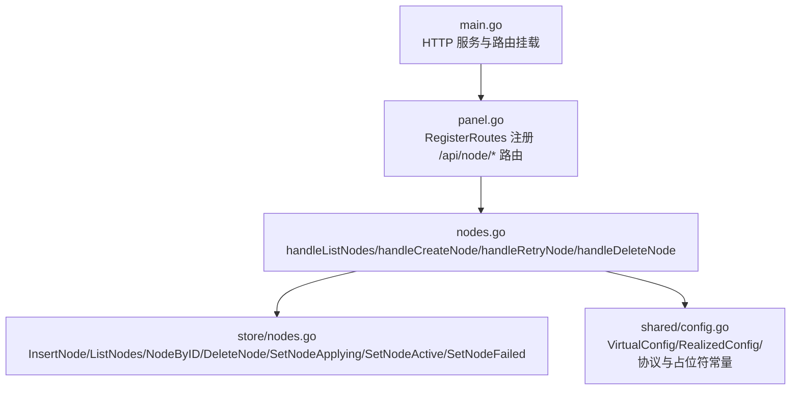
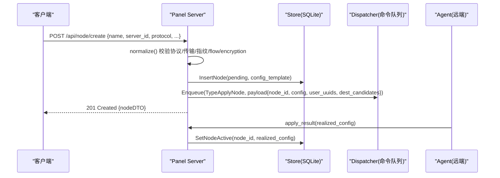
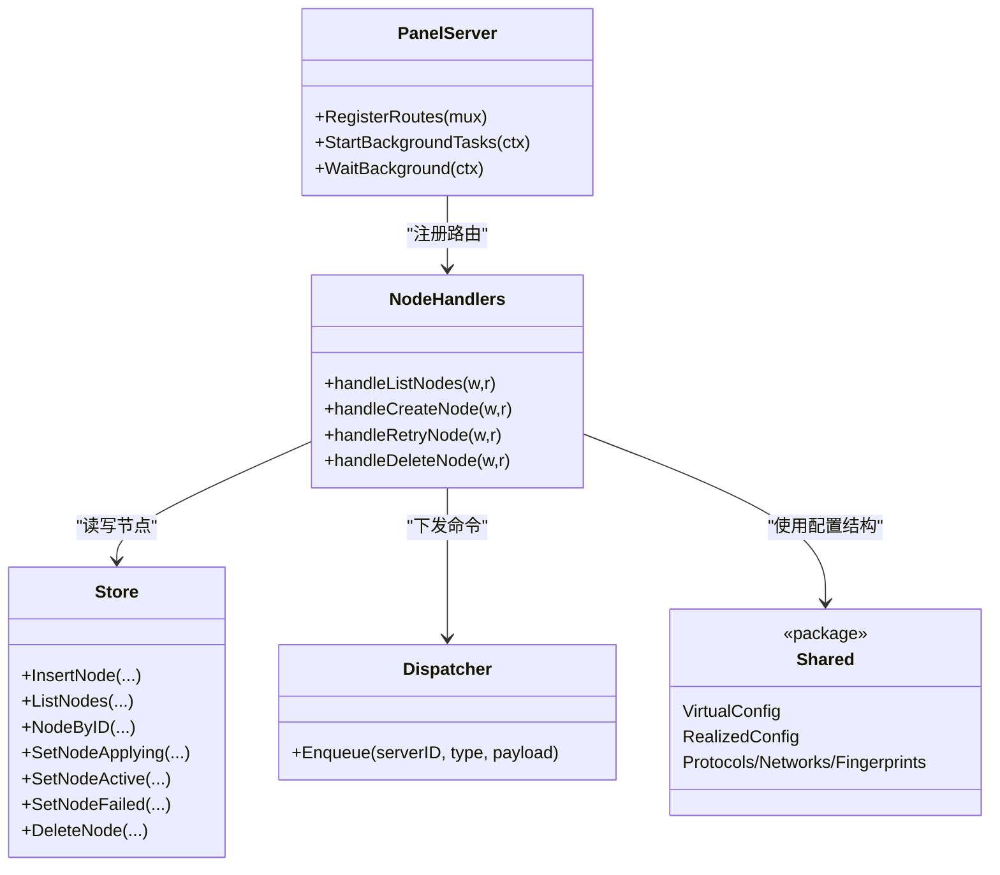

# 节点管理 API

<cite>
**本文引用的文件**   
- [src/backend/internal/panel/nodes.go](file://src/backend/internal/panel/nodes.go)
- [src/backend/internal/store/nodes.go](file://src/backend/internal/store/nodes.go)
- [src/backend/internal/panel/panel.go](file://src/backend/internal/panel/panel.go)
- [src/backend/cmd/backend/main.go](file://src/backend/cmd/backend/main.go)
- [src/shared/config.go](file://src/shared/config.go)
</cite>

## 目录
1. [简介](#简介)
2. [项目结构](#项目结构)
3. [核心组件](#核心组件)
4. [架构总览](#架构总览)
5. [详细接口说明](#详细接口说明)
6. [依赖关系分析](#依赖关系分析)
7. [性能与可用性](#性能与可用性)
8. [故障排查指南](#故障排查指南)
9. [结论](#结论)

## 简介
本文件为 Lattix-codex 项目的“节点管理”RESTful API 文档，覆盖节点的增删改查、状态监控、配置验证与重试等能力。API 采用统一的 RPC 信封响应格式，所有写操作支持幂等键（Idempotency-Key）与 CSRF 保护，读操作支持受限查询参数白名单。节点协议支持 VLESS、VMess、Trojan、Shadowsocks、SOCKS、HTTP、dokodemo-door；其中 vless/vmess/trojan 可启用 Reality 安全层，传输方式支持 tcp/grpc/xhttp，并包含指纹、短 ID、dest 白名单等高级选项。

## 项目结构
后端通过 HTTP 路由注册面板 API，节点相关的路由在 panel 包中集中注册，处理器实现于 nodes.go，数据持久化与状态机位于 store/nodes.go，共享协议与占位符定义在 shared/config.go。入口 main.go 负责启动 HTTP 服务与路由挂载。

**图表来源**
- [src/backend/cmd/backend/main.go:370-382](file://src/backend/cmd/backend/main.go#L370-L382)
- [src/backend/internal/panel/panel.go:217-224](file://src/backend/internal/panel/panel.go#L217-L224)
- [src/backend/internal/panel/nodes.go:53-250](file://src/backend/internal/panel/nodes.go#L53-L250)
- [src/backend/internal/store/nodes.go:59-141](file://src/backend/internal/store/nodes.go#L59-L141)
- [src/shared/config.go:170-206](file://src/shared/config.go#L170-L206)

**章节来源**
- [src/backend/cmd/backend/main.go:370-382](file://src/backend/cmd/backend/main.go#L370-L382)
- [src/backend/internal/panel/panel.go:162-279](file://src/backend/internal/panel/panel.go#L162-L279)

## 核心组件
- 节点 DTO：用于 API 请求/响应的数据结构，包含 id、name、server_id、server_alias、protocol、port、status、error、traffic、config_template、realized_config、created_at。
- 虚拟配置 VirtualConfig：面板侧生成的 xray inbound 模板，含协议参数与占位符（端口、客户端列表、私钥、tag 等）。
- 实际生效配置 RealizedConfig：Agent 上报的实际值，订阅生成依赖该字段。
- 节点状态机：pending → applying → active | failed。

**章节来源**
- [src/backend/internal/panel/nodes.go:21-51](file://src/backend/internal/panel/nodes.go#L21-L51)
- [src/shared/config.go:170-206](file://src/shared/config.go#L170-L206)
- [src/backend/internal/store/nodes.go:12-18](file://src/backend/internal/store/nodes.go#L12-L18)

## 架构总览
节点管理的整体流程如下：
- 创建节点：校验请求体 → 构建虚拟配置 → 落库 pending → 下发 apply_node → Agent 执行并上报 realized_config → 更新为 active。
- 删除节点：下发 remove_node → 清理用户关联 → 删除记录。
- 重试失败节点：重新下发 apply_node。
- 获取列表：联表查询节点 + 聚合流量统计。

**图表来源**
- [src/backend/internal/panel/nodes.go:196-250](file://src/backend/internal/panel/nodes.go#L196-L250)
- [src/backend/internal/panel/nodes.go:328-369](file://src/backend/internal/panel/nodes.go#L328-L369)
- [src/backend/internal/store/nodes.go:59-115](file://src/backend/internal/store/nodes.go#L59-L115)

## 详细接口说明

### 通用约定
- 内容类型：application/json
- 统一响应信封：
  - code：业务码（如 ok、invalid_argument、not_found、internal_error 等）
  - message：人类可读消息
  - data：业务数据或 null
  - request_id、trace_id：追踪标识
- 认证与防护：
  - 写操作需登录、CSRF、Idempotency-Key（幂等键）
  - 读操作仅鉴权，部分接口允许受限查询参数白名单

**章节来源**
- [src/backend/internal/panel/panel.go:312-350](file://src/backend/internal/panel/panel.go#L312-L350)
- [src/backend/internal/panel/rpc_routes.go:33-72](file://src/backend/internal/panel/rpc_routes.go#L33-L72)

### GET /api/node/list（获取节点列表）
- 方法：GET
- 鉴权：需要登录
- 功能：返回全部节点列表，附带各节点流量合计（up/down），无数据时为 null。
- 响应数据：数组，元素为 nodeDTO（id、name、server_id、server_alias、protocol、port、status、error、traffic、config_template、realized_config、created_at）。

错误处理：
- 数据库异常：返回 internal_error
- 其他异常：根据 HTTP 状态映射到对应 code

**章节来源**
- [src/backend/internal/panel/nodes.go:53-74](file://src/backend/internal/panel/nodes.go#L53-L74)
- [src/backend/internal/store/nodes.go:70-87](file://src/backend/internal/store/nodes.go#L70-L87)

### POST /api/node/create（创建节点）
- 方法：POST
- 鉴权：需要登录、CSRF、Idempotency-Key
- 请求体 createNodeRequest 字段：
  - name：节点名称（支持模板解析）
  - server_id：目标服务器 ID
  - protocol：vless/vmess/trojan/shadowsocks/socks/http/dokodemo-door（默认 vless）
  - port：可选，留空表示由 Agent 自动挑选空闲端口
  - short_id：Reality 短 ID（默认随机 8 字节 hex）
  - dest：Reality dest 目标（默认 dl.google.com:443）
  - server_names：Reality serverNames（默认 ["dl.google.com"]）
  - fingerprint：uTLS 指纹（默认 chrome）
  - network：tcp/grpc/xhttp（Reality 传输）
  - service_name：grpc 服务名（默认 grpc）
  - path：xhttp 路径（默认 "/"）
  - mode：xhttp 模式（auto/packet-up/stream-up）
  - host：xhttp host（可选）
  - flow：vless flow（tcp 时默认 vision；none 表示无 flow；grpc/xhttp 必须无 flow）
  - encryption：VLESS Encryption 认证方式（x25519/mlkem768，可与 vision 组合）
  - method：shadowsocks 加密方式（默认 2022-blake3-aes-128-gcm）
  - target_address/target_port：dokodemo-door 转发目标地址与端口
- 校验规则：
  - 协议合法性校验
  - Reality 传输限制（仅 tcp/grpc/xhttp）
  - xhttp mode 合法值校验
  - uTLS 指纹合法值校验
  - flow 与 network 组合约束（vision 仅 tcp）
  - shadowsocks 加密方式合法值校验
  - dokodemo-door 必填 target_address 与合法 target_port（1-65535）
  - NAT 受限直连场景下，若指定端口必须在 allowed_ports 范围内
- 处理流程：
  - 构建虚拟配置（VirtualConfig），填充占位符
  - 落库插入节点（pending）
  - 下发 apply_node（携带用户 UUID 列表与 dest 白名单）
  - 审计记录
- 响应：201 Created，返回 nodeDTO

错误处理：
- 请求体非法：invalid_argument
- 服务器不存在：bad_request
- 端口不在可用段：bad_request
- 内部错误：internal_error

**章节来源**
- [src/backend/internal/panel/nodes.go:76-194](file://src/backend/internal/panel/nodes.go#L76-L194)
- [src/backend/internal/panel/nodes.go:196-250](file://src/backend/internal/panel/nodes.go#L196-L250)
- [src/backend/internal/panel/nodes.go:390-462](file://src/backend/internal/panel/nodes.go#L390-L462)
- [src/shared/config.go:170-206](file://src/shared/config.go#L170-L206)

### POST /api/node/retry（重试失败节点）
- 方法：POST
- 鉴权：需要登录、CSRF、Idempotency-Key
- 请求体：{ node_id }
- 功能：对状态为 failed 的节点重新下发 apply_node
- 响应：200 OK，返回最新 nodeDTO

错误处理：
- node_id 无效：bad_request
- 节点不存在：not_found
- 内部错误：internal_error

**章节来源**
- [src/backend/internal/panel/nodes.go:252-287](file://src/backend/internal/panel/nodes.go#L252-L287)

### POST /api/node/delete（删除节点）
- 方法：POST
- 鉴权：需要登录、CSRF、Idempotency-Key
- 请求体：{ node_id }
- 功能：先下发 remove_node，再删除节点记录并清理用户关联
- 响应：200 OK，data 为 null

错误处理：
- node_id 无效：bad_request
- 节点不存在：not_found
- 内部错误：internal_error

**章节来源**
- [src/backend/internal/panel/nodes.go:289-326](file://src/backend/internal/panel/nodes.go#L289-L326)
- [src/backend/internal/store/nodes.go:124-141](file://src/backend/internal/store/nodes.go#L124-L141)

### 关于 GET /api/nodes/{id} 与 PUT /api/nodes/{id}
- 当前代码未提供 RESTful 风格的 /api/nodes/{id} 读取与更新端点。
- 如需按 ID 获取节点详情，可使用 GET /api/node/list 后在前端筛选。
- 如需更新节点，可通过“重试”机制触发重新应用配置，或结合链编辑接口进行编排变更。

[本节不直接分析具体文件，故不附“章节来源”]

## 依赖关系分析
- 路由注册：panel.RegisterRoutes 将 /api/node/* 路由绑定到对应处理器。
- 处理器依赖：
  - store.Store：节点 CRUD、状态迁移、流量聚合
  - dispatch.Dispatcher：命令入队（apply_node/remove_node）
  - shared.VirtualConfig/RealizedConfig：配置结构与占位符
- 中间件：
  - 鉴权、CSRF、幂等键、日志策略、查询参数白名单

**图表来源**
- [src/backend/internal/panel/panel.go:162-279](file://src/backend/internal/panel/panel.go#L162-L279)
- [src/backend/internal/panel/nodes.go:53-326](file://src/backend/internal/panel/nodes.go#L53-L326)
- [src/backend/internal/store/nodes.go:59-141](file://src/backend/internal/store/nodes.go#L59-L141)
- [src/shared/config.go:170-206](file://src/shared/config.go#L170-L206)

**章节来源**
- [src/backend/internal/panel/panel.go:162-279](file://src/backend/internal/panel/panel.go#L162-L279)
- [src/backend/internal/panel/nodes.go:53-326](file://src/backend/internal/panel/nodes.go#L53-L326)

## 性能与可用性
- 批量操作：当前节点 API 未暴露批量创建/更新端点，建议通过多次调用并配合 Idempotency-Key 保证幂等性。
- 自动端口：当 port 为空时，Agent 自动挑选空闲端口，并在 realized_config 中回显。
- 流量统计：列表接口聚合 up/down 流量，便于监控。
- 健康检查：/healthz 与 /readyz 可用于外部探针。

[本节为通用指导，不直接分析具体文件，故不附“章节来源”]

## 故障排查指南
- 常见错误码与含义：
  - invalid_argument：请求体非法或参数校验失败
  - not_found：资源不存在（如节点/服务器）
  - internal_error：内部异常（数据库/队列/序列化）
  - operation_locked：幂等键冲突或前次操作结果未知
- 排查步骤：
  - 检查请求体字段是否符合协议与传输约束
  - 确认服务器存在且端口在 allowed_ports 范围内（NAT 受限直连）
  - 查看节点状态是否为 failed，必要时调用 retry
  - 检查 realize_config 是否已上报（active 状态）
  - 关注审计日志与请求日志中的 trace_id

**章节来源**
- [src/backend/internal/panel/panel.go:398-419](file://src/backend/internal/panel/panel.go#L398-L419)
- [src/backend/internal/panel/nodes.go:196-250](file://src/backend/internal/panel/nodes.go#L196-L250)

## 结论
节点管理 API 提供了完整的节点生命周期管理能力，包括创建、重试、删除与列表查询。通过严格的参数校验、状态机与占位符机制，确保配置一致性与可观测性。对于缺失的 RESTful 风格单节点读取/更新接口，可通过现有列表与重试机制满足需求，或在后续迭代中补充。

[本节为总结，不直接分析具体文件，故不附“章节来源”]