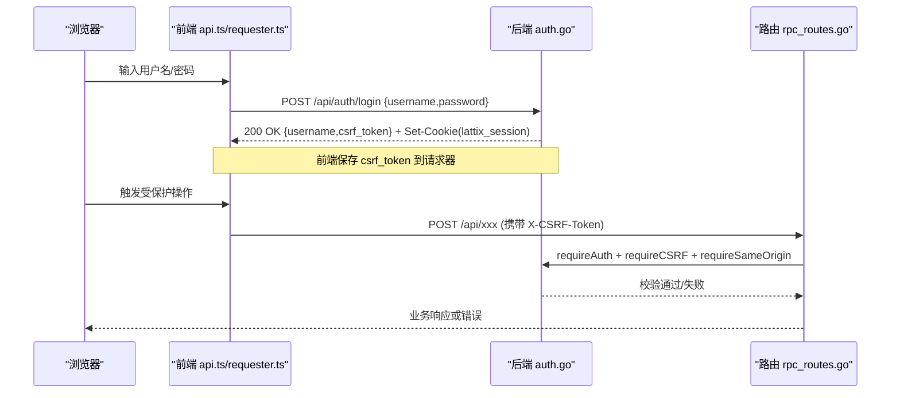
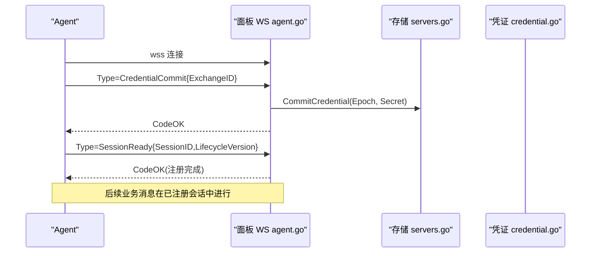
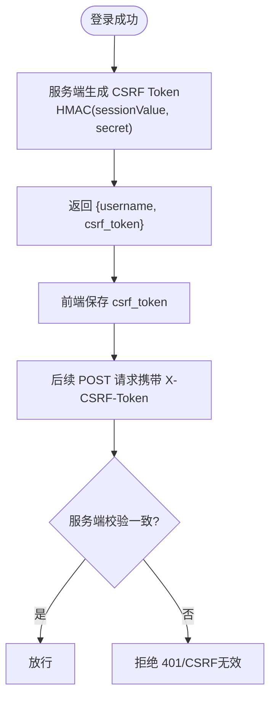
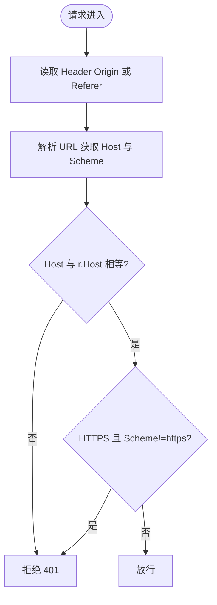
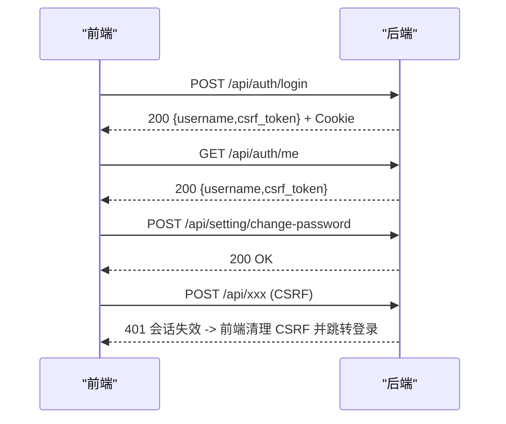
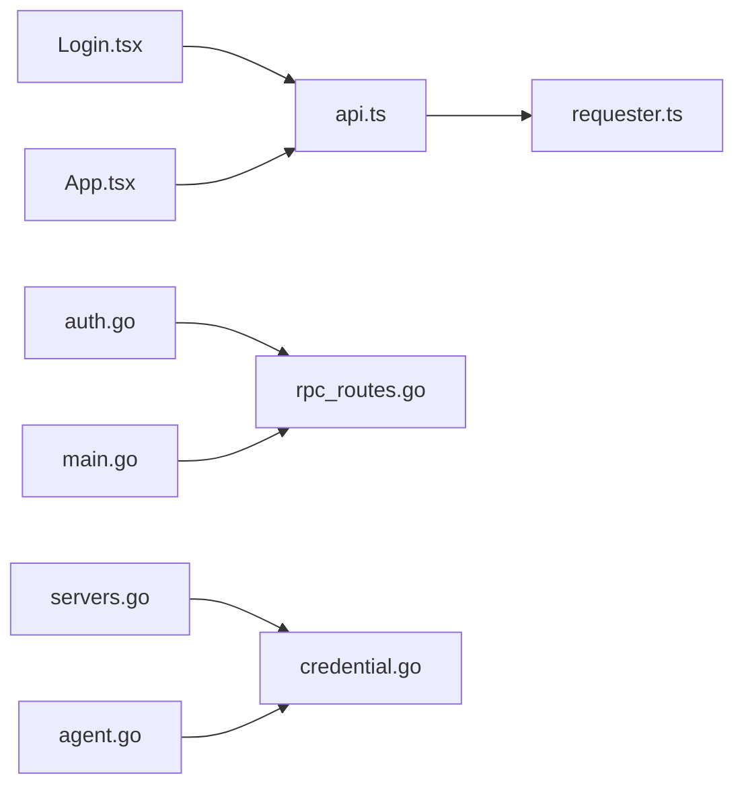

# 认证与授权

<cite>
**本文引用的文件**   
- [auth.go](file://src/backend/internal/panel/auth.go)
- [rpc_routes.go](file://src/backend/internal/panel/rpc_routes.go)
- [main.go](file://src/backend/cmd/backend/main.go)
- [api.ts](file://src/frontend/src/lib/api.ts)
- [requester.ts](file://src/frontend/src/lib/requester.ts)
- [Login.tsx](file://src/frontend/src/pages/Login.tsx)
- [App.tsx](file://src/frontend/src/App.tsx)
- [credential.go](file://src/shared/credential.go)
- [servers.go](file://src/backend/internal/panel/servers.go)
- [agent.go](file://src/backend/internal/ws/agent.go)
</cite>

## 目录
1. [简介](#简介)
2. [项目结构](#项目结构)
3. [核心组件](#核心组件)
4. [架构总览](#架构总览)
5. [详细组件分析](#详细组件分析)
6. [依赖关系分析](#依赖关系分析)
7. [性能与安全考量](#性能与安全考量)
8. [故障排查指南](#故障排查指南)
9. [结论](#结论)
10. [附录：API 参考与错误码](#附录api-参考与错误码)

## 简介
本文件面向 Lattix-codex 项目的认证与授权机制，覆盖管理员令牌（Admin Token）的获取、验证与使用；CSRF 保护机制的工作原理与配置；Same-Origin 策略的实现与安全考虑；完整的认证流程示例（登录、会话探活、权限检查、密码修改导致会话失效等）；以及常见错误处理与安全最佳实践。

## 项目结构
认证与授权相关代码主要分布在后端面板模块与前端请求层：
- 后端
  - 认证与会话：auth.go（登录、登出、会话校验、CSRF、同源校验）
  - 路由与中间件：rpc_routes.go（注册路由、鉴权/CSRF/SameOrigin 中间件组合）
  - HTTP/TLS 启动：main.go（监听端口、TLS 模式、最小版本限制）
  - Agent 引导凭证：servers.go（bootstrap token 轮换）、shared/credential.go（凭证格式）
  - Agent WebSocket 握手：agent.go（CredentialCommit、SessionReady）
- 前端
  - API 封装：api.ts（login/logout/me、CSRF Token 设置）
  - 请求器：requester.ts（自动携带 CSRF、Idempotency-Key、统一错误处理）
  - 页面与守卫：Login.tsx、App.tsx（未登录重定向）

```mermaid
graph TB
subgraph "前端"
UI["登录页 Login.tsx"]
API["API 封装 api.ts"]
REQ["请求器 requester.ts"]
end
subgraph "后端"
AUTH["认证 auth.go"]
ROUTE["路由 rpc_routes.go"]
MAIN["HTTP/TLS main.go"]
AGENT["Agent WS agent.go"]
CRED["凭证 shared/credential.go"]
SRV["服务器 tokens servers.go"]
end
UI --> API --> REQ
REQ --> |POST /api/auth/login| AUTH
REQ --> |GET /api/auth/me| AUTH
REQ --> |POST 业务接口(需CSRF)| ROUTE --> AUTH
AUTH --> ROUTE
MAIN --> ROUTE
SRV --> CRED
AGENT --> CRED
```

**图表来源** 
- [auth.go:81-145](file://src/backend/internal/panel/auth.go#L81-L145)
- [rpc_routes.go:33-72](file://src/backend/internal/panel/rpc_routes.go#L33-L72)
- [main.go:450-477](file://src/backend/cmd/backend/main.go#L450-L477)
- [api.ts:58-73](file://src/frontend/src/lib/api.ts#L58-L73)
- [requester.ts:157-220](file://src/frontend/src/lib/requester.ts#L157-L220)
- [servers.go:324-383](file://src/backend/internal/panel/servers.go#L324-L383)
- [credential.go:28-56](file://src/shared/credential.go#L28-L56)
- [agent.go:157-197](file://src/backend/internal/ws/agent.go#L157-L197)

**章节来源**
- [auth.go:81-145](file://src/backend/internal/panel/auth.go#L81-L145)
- [rpc_routes.go:33-72](file://src/backend/internal/panel/rpc_routes.go#L33-L72)
- [main.go:450-477](file://src/backend/cmd/backend/main.go#L450-L477)
- [api.ts:58-73](file://src/frontend/src/lib/api.ts#L58-L73)
- [requester.ts:157-220](file://src/frontend/src/lib/requester.ts#L157-L220)
- [servers.go:324-383](file://src/backend/internal/panel/servers.go#L324-L383)
- [credential.go:28-56](file://src/shared/credential.go#L28-L56)
- [agent.go:157-197](file://src/backend/internal/ws/agent.go#L157-L197)

## 核心组件
- 会话与会话密钥
  - 会话 Cookie：名称固定，HttpOnly、SameSite=Lax，HTTPS 下 Secure 仅加密通道回传，有效期约 7 天。
  - 会话值：base64url(user|exp).base64url(hmac)，由管理员凭据派生的密钥签名。
  - 会话密钥：由管理员凭据（bcrypt 哈希）派生，改密即全部会话失效。
- 登录与登出
  - 登录：POST /api/auth/login，校验用户名/密码，返回 username 与 csrf_token，并下发会话 Cookie。
  - 登出：POST /api/auth/logout，清除会话 Cookie。
  - 会话探活：GET /api/auth/me，返回当前用户与新的 csrf_token。
- CSRF 保护
  - 服务端为每个会话生成 HMAC 签名的 CSRF Token，客户端需在后续 POST 请求中通过 X-CSRF-Token 头携带。
  - 所有需要写操作的 API 均强制 requireCSRF。
- Same-Origin 校验
  - 对 Origin 或 Referer 进行 Host 匹配，HTTPS 模式下要求 Scheme 为 https。
- 幂等性
  - 可选 Idempotency-Key 保证重复提交安全，服务端缓存成功响应。

**章节来源**
- [auth.go:21-79](file://src/backend/internal/panel/auth.go#L21-L79)
- [auth.go:81-145](file://src/backend/internal/panel/auth.go#L81-L145)
- [auth.go:147-181](file://src/backend/internal/panel/auth.go#L147-L181)
- [auth.go:215-249](file://src/backend/internal/panel/auth.go#L215-L249)
- [auth.go:251-268](file://src/backend/internal/panel/auth.go#L251-L268)
- [rpc_routes.go:157-242](file://src/backend/internal/panel/rpc_routes.go#L157-L242)

## 架构总览
下图展示从浏览器到后端的认证与授权关键路径，包括登录、CSRF 校验、同源校验与会话校验。



**图表来源** 
- [api.ts:58-73](file://src/frontend/src/lib/api.ts#L58-L73)
- [requester.ts:157-220](file://src/frontend/src/lib/requester.ts#L157-L220)
- [auth.go:81-145](file://src/backend/internal/panel/auth.go#L81-L145)
- [rpc_routes.go:33-72](file://src/backend/internal/panel/rpc_routes.go#L33-L72)

## 详细组件分析

### 管理员令牌（Admin Token）说明
- 本项目采用单管理员账号（admin），通过用户名+密码登录获得会话 Cookie 与 CSRF Token，不存在独立的“管理员令牌”概念。
- 若指 Agent 引导令牌（bootstrap token），其用于 Agent 首次连接面板完成认证，属于另一套认证体系（见下一小节）。

**章节来源**
- [main.go:83-94](file://src/backend/cmd/backend/main.go#L83-L94)
- [auth.go:81-145](file://src/backend/internal/panel/auth.go#L81-L145)

### Agent 引导令牌（Bootstrap Token）获取、验证与刷新
- 获取：管理员登录后调用服务器管理接口旋转/创建 bootstrap token，返回新 token 及安装命令。
- 验证：Agent 通过 WebSocket 首连，发送 CredentialCommit（包含 ExchangeID）与 SessionReady（含生命周期版本），面板校验通过后建立会话。
- 刷新：管理员可主动轮换 token，旧 token 立即失效，已连接的 Agent 会被断开并重连。



**图表来源** 
- [agent.go:157-197](file://src/backend/internal/ws/agent.go#L157-L197)
- [servers.go:324-383](file://src/backend/internal/panel/servers.go#L324-L383)
- [credential.go:28-56](file://src/shared/credential.go#L28-L56)

**章节来源**
- [servers.go:324-383](file://src/backend/internal/panel/servers.go#L324-L383)
- [agent.go:157-197](file://src/backend/internal/ws/agent.go#L157-L197)
- [credential.go:28-56](file://src/shared/credential.go#L28-L56)

### CSRF 保护机制与配置
- 生成：登录成功后，服务端基于会话值与会话密钥计算 HMAC，返回 csrf_token。
- 传递：前端在后续 POST 请求中自动附加 X-CSRF-Token 头。
- 校验：requireCSRF 中间件比较请求头与服务端预期值，不一致则拒绝。
- 失效：修改密码会重新派生会话密钥，所有旧会话失效，需重新登录。



**图表来源** 
- [auth.go:142-145](file://src/backend/internal/panel/auth.go#L142-L145)
- [auth.go:215-249](file://src/backend/internal/panel/auth.go#L215-L249)
- [requester.ts:175-183](file://src/frontend/src/lib/requester.ts#L175-L183)

**章节来源**
- [auth.go:142-145](file://src/backend/internal/panel/auth.go#L142-L145)
- [auth.go:215-249](file://src/backend/internal/panel/auth.go#L215-L249)
- [requester.ts:175-183](file://src/frontend/src/lib/requester.ts#L175-L183)

### Same-Origin 策略实现与安全考虑
- 校验来源：优先读取 Origin，否则回退 Referer；解析 Host 并与 r.Host 比较。
- HTTPS 强化：当服务处于 HTTPS 时，要求来源 Scheme 必须为 https。
- 作用范围：对需要 SameOrigin 的路由启用 requireSameOrigin 中间件。



**图表来源** 
- [auth.go:251-268](file://src/backend/internal/panel/auth.go#L251-L268)

**章节来源**
- [auth.go:251-268](file://src/backend/internal/panel/auth.go#L251-L268)

### 完整认证流程示例
- 登录
  - 前端调用 login(username, password)，后端校验成功返回 csrf_token 并设置会话 Cookie。
- 会话探活
  - 前端定时或按需调用 me，刷新 csrf_token 并确认登录态。
- 权限检查
  - 所有写操作需经过 requireAuth + requireCSRF；更新进行中部分接口被拒（423）。
- 密码修改与会话失效
  - 修改密码后，会话密钥派生变化，旧会话失效，前端收到 401 后清空 CSRF Token 并跳转登录。



**图表来源** 
- [api.ts:58-73](file://src/frontend/src/lib/api.ts#L58-L73)
- [auth.go:81-145](file://src/backend/internal/panel/auth.go#L81-L145)
- [auth.go:147-181](file://src/backend/internal/panel/auth.go#L147-L181)
- [requester.ts:202-206](file://src/frontend/src/lib/requester.ts#L202-L206)

**章节来源**
- [api.ts:58-73](file://src/frontend/src/lib/api.ts#L58-L73)
- [auth.go:81-145](file://src/backend/internal/panel/auth.go#L81-L145)
- [auth.go:147-181](file://src/backend/internal/panel/auth.go#L147-L181)
- [requester.ts:202-206](file://src/frontend/src/lib/requester.ts#L202-L206)

### 错误处理指南
- 认证失败
  - 用户名/密码错误：返回特定业务码与提示；支持速率限制防止暴力破解。
  - 会话过期或未登录：返回 AUTH_REQUIRED，前端触发未授权回调并跳转登录。
- CSRF 无效
  - 缺少或错误的 X-CSRF-Token：返回 AUTH_REQUIRED，提示 CSRF token 无效。
- 同源校验失败
  - Origin/Referer 不匹配或 HTTPS 非 https：返回 AUTH_REQUIRED。
- 更新进行中
  - 除轮询与探活接口外，其他 API 返回更新锁定状态，等待完成。

**章节来源**
- [auth.go:92-121](file://src/backend/internal/panel/auth.go#L92-L121)
- [auth.go:197-213](file://src/backend/internal/panel/auth.go#L197-L213)
- [auth.go:229-249](file://src/backend/internal/panel/auth.go#L229-L249)
- [auth.go:251-268](file://src/backend/internal/panel/auth.go#L251-L268)
- [requester.ts:202-206](file://src/frontend/src/lib/requester.ts#L202-L206)

## 依赖关系分析
- 前端依赖
  - api.ts 依赖 requester.ts 发起请求，并在登录/登出/改密后维护 CSRF Token。
  - Login.tsx 与 App.tsx 负责登录界面与路由守卫。
- 后端依赖
  - auth.go 提供认证、CSRF、同源校验与中间件。
  - rpc_routes.go 将中间件组合到具体路由，并支持幂等性。
  - main.go 负责 HTTP/TLS 启动与最小版本限制。
  - servers.go 与 shared/credential.go 协作管理 Agent 引导凭证。
  - agent.go 实现 Agent 首次认证的握手流程。



**图表来源** 
- [api.ts:58-73](file://src/frontend/src/lib/api.ts#L58-L73)
- [requester.ts:157-220](file://src/frontend/src/lib/requester.ts#L157-L220)
- [Login.tsx:1-108](file://src/frontend/src/pages/Login.tsx#L1-L108)
- [App.tsx:45-89](file://src/frontend/src/App.tsx#L45-L89)
- [auth.go:81-145](file://src/backend/internal/panel/auth.go#L81-L145)
- [rpc_routes.go:33-72](file://src/backend/internal/panel/rpc_routes.go#L33-L72)
- [main.go:450-477](file://src/backend/cmd/backend/main.go#L450-L477)
- [servers.go:324-383](file://src/backend/internal/panel/servers.go#L324-L383)
- [credential.go:28-56](file://src/shared/credential.go#L28-L56)
- [agent.go:157-197](file://src/backend/internal/ws/agent.go#L157-L197)

**章节来源**
- [api.ts:58-73](file://src/frontend/src/lib/api.ts#L58-L73)
- [requester.ts:157-220](file://src/frontend/src/lib/requester.ts#L157-L220)
- [Login.tsx:1-108](file://src/frontend/src/pages/Login.tsx#L1-L108)
- [App.tsx:45-89](file://src/frontend/src/App.tsx#L45-L89)
- [auth.go:81-145](file://src/backend/internal/panel/auth.go#L81-L145)
- [rpc_routes.go:33-72](file://src/backend/internal/panel/rpc_routes.go#L33-L72)
- [main.go:450-477](file://src/backend/cmd/backend/main.go#L450-L477)
- [servers.go:324-383](file://src/backend/internal/panel/servers.go#L324-L383)
- [credential.go:28-56](file://src/shared/credential.go#L28-L56)
- [agent.go:157-197](file://src/backend/internal/ws/agent.go#L157-L197)

## 性能与安全考量
- 性能
  - 会话校验为轻量 HMAC 计算，开销极低。
  - 幂等性记录写入数据库，注意在高并发场景下的锁竞争与清理策略。
- 安全
  - 会话 Cookie 设置 HttpOnly、SameSite=Lax，HTTPS 下 Secure。
  - 密码使用 bcrypt 哈希，改密即会话失效。
  - TLS 最小版本限制为 TLS1.2，支持 ACME/自签证书/域名路径热加载。
  - CSRF 与 Same-Origin 双重防护，降低跨站攻击面。
  - 登录失败速率限制，防暴力破解。

**章节来源**
- [auth.go:21-79](file://src/backend/internal/panel/auth.go#L21-L79)
- [auth.go:92-121](file://src/backend/internal/panel/auth.go#L92-L121)
- [main.go:450-477](file://src/backend/cmd/backend/main.go#L450-L477)
- [rpc_routes.go:157-242](file://src/backend/internal/panel/rpc_routes.go#L157-L242)

## 故障排查指南
- 现象：登录后仍报未登录
  - 检查是否设置了正确的 Cookie（lattix_session）与 CSRF Token。
  - 确认是否修改了密码导致会话失效。
- 现象：CSRF 无效
  - 确认请求头 X-CSRF-Token 是否存在且与登录返回一致。
  - 检查是否跨域访问导致同源校验失败。
- 现象：更新进行中无法操作
  - 等待更新完成，仅允许轮询与探活接口。
- 现象：Agent 无法连接
  - 检查 bootstrap token 是否有效、生命周期版本是否一致。

**章节来源**
- [auth.go:197-213](file://src/backend/internal/panel/auth.go#L197-L213)
- [auth.go:229-249](file://src/backend/internal/panel/auth.go#L229-L249)
- [agent.go:157-197](file://src/backend/internal/ws/agent.go#L157-L197)

## 结论
Lattix-codex 的认证与授权以管理员账号会话为核心，结合 CSRF 与 Same-Origin 双重防护，确保 Web 管理界面的安全性。Agent 侧采用独立的引导凭证与握手流程，保障设备接入安全。通过幂等性与速率限制提升鲁棒性，配合严格的 TLS 策略与密码哈希机制，形成完整的安全闭环。

## 附录：API 参考与错误码
- 认证相关
  - POST /api/auth/login：登录，返回 {username, csrf_token}，设置会话 Cookie。
  - POST /api/auth/logout：登出，清除会话 Cookie。
  - GET /api/auth/me：会话探活，返回 {username, csrf_token}。
- 服务器与 Agent
  - POST /api/servers/{id}/rotate-token：轮换 bootstrap token，返回新 token 与安装命令。
  - Agent WS：CredentialCommit、SessionReady 完成认证。
- 常见错误码
  - AUTH_REQUIRED：未登录或会话过期。
  - UPDATE_IN_PROGRESS：更新进行中。
  - INVALID_ARGUMENT：参数无效。
  - CONFLICT：幂等键冲突或资源冲突。
  - OPERATION_LOCKED：幂等操作结果未知，禁止重试。

**章节来源**
- [auth.go:81-145](file://src/backend/internal/panel/auth.go#L81-L145)
- [auth.go:147-181](file://src/backend/internal/panel/auth.go#L147-L181)
- [servers.go:324-383](file://src/backend/internal/panel/servers.go#L324-L383)
- [rpc_routes.go:157-242](file://src/backend/internal/panel/rpc_routes.go#L157-L242)