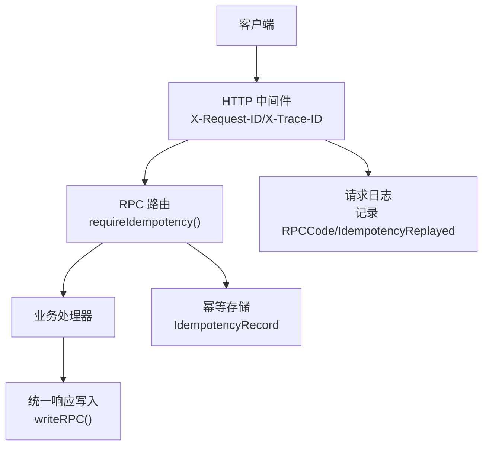
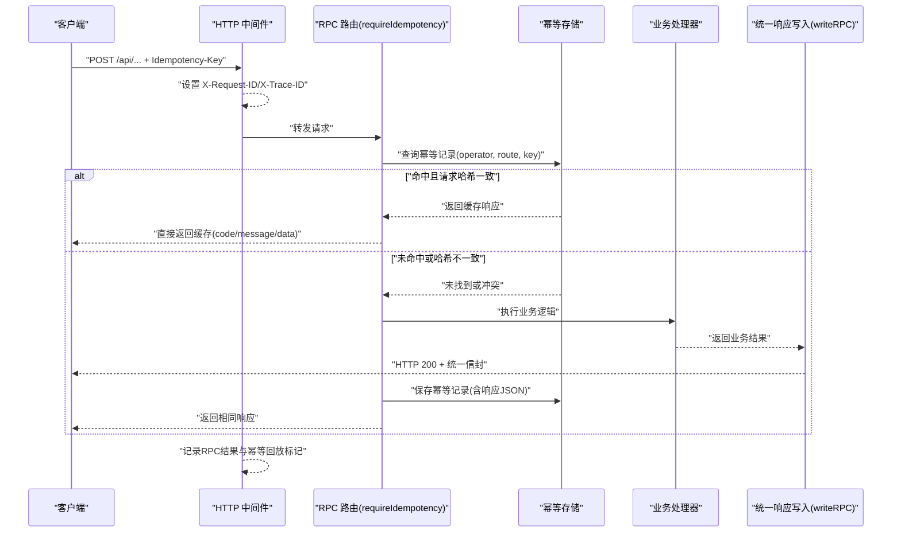
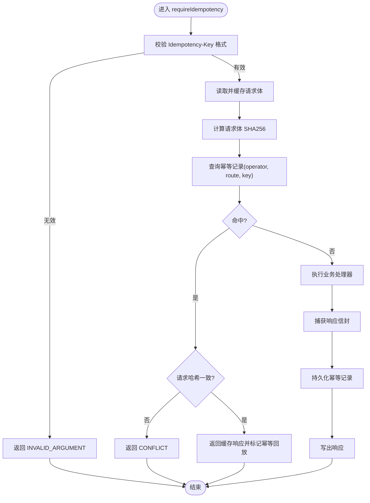
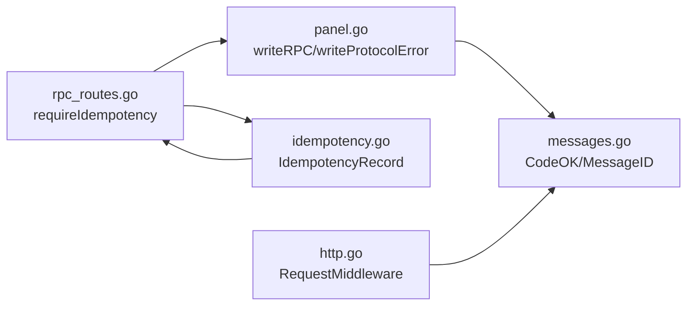

# 通用功能

<cite>
**本文引用的文件**   
- [openapi.yaml](file://docs/openapi.yaml)
- [panel.go](file://src/backend/internal/panel/panel.go)
- [rpc_routes.go](file://src/backend/internal/panel/rpc_routes.go)
- [idempotency.go](file://src/backend/internal/store/idempotency.go)
- [http.go](file://src/backend/internal/logging/http.go)
- [messages.go](file://src/shared/messages.go)
</cite>

## 目录
1. [简介](#简介)
2. [项目结构](#项目结构)
3. [核心组件](#核心组件)
4. [架构总览](#架构总览)
5. [详细组件分析](#详细组件分析)
6. [依赖关系分析](#依赖关系分析)
7. [性能考虑](#性能考虑)
8. [故障排查指南](#故障排查指南)
9. [结论](#结论)
10. [附录](#附录)

## 简介
本章节面向 Lattix-codex 的通用 API 能力，统一说明以下规范：
- 统一的响应信封格式与字段语义（code、message、data、request_id、trace_id）
- 幂等性支持（Idempotency-Key）的请求去重、重试机制与状态缓存策略
- 错误处理标准、HTTP 状态码映射与异常处理方式
- 通用请求规则：请求体大小限制、内容类型校验、查询参数校验
- 完整错误代码表及处理建议

该文档旨在帮助前端、集成方与运维人员快速理解并正确调用 RPC API。

## 项目结构
Lattix-codex 的通用 API 由后端 HTTP 层、RPC 路由与中间件、存储层以及共享协议定义共同构成：
- OpenAPI 描述统一响应信封与业务码枚举
- 面板层负责写回统一信封、错误映射与协议错误
- 路由层实现 Idempotency-Key 幂等拦截与结果缓存
- 存储层持久化幂等记录并清理过期数据
- 日志中间件注入 request_id/trace_id、记录 RPC 结果与幂等回放标记
- 共享包定义消息 ID 生成与校验、RPC 业务码常量

图表来源 
- [openapi.yaml:358-368](file://docs/openapi.yaml#L358-L368)
- [panel.go:329-347](file://src/backend/internal/panel/panel.go#L329-L347)
- [rpc_routes.go:157-226](file://src/backend/internal/panel/rpc_routes.go#L157-L226)
- [idempotency.go:15-49](file://src/backend/internal/store/idempotency.go#L15-L49)
- [http.go:43-82](file://src/backend/internal/logging/http.go#L43-L82)

章节来源
- [openapi.yaml:1-12](file://docs/openapi.yaml#L1-L12)
- [panel.go:309-347](file://src/backend/internal/panel/panel.go#L309-L347)
- [rpc_routes.go:157-226](file://src/backend/internal/panel/rpc_routes.go#L157-L226)
- [idempotency.go:15-59](file://src/backend/internal/store/idempotency.go#L15-L59)
- [http.go:43-82](file://src/backend/internal/logging/http.go#L43-L82)

## 核心组件
- 统一响应信封：所有成功或失败的 RPC 响应均返回 HTTP 200，并在 body 中通过 code/message/data/request_id/trace_id 表达业务结果与追踪信息。
- 幂等性拦截器：对需要幂等的接口强制要求 Idempotency-Key，基于 operator+route+key 进行去重与结果缓存。
- 错误映射：将传统 HTTP 状态码映射为统一的 RPC 业务码，保证客户端一致的错误处理逻辑。
- 日志与追踪：中间件自动注入 request_id/trace_id，记录 RPC 结果与是否被幂等回放。

章节来源
- [openapi.yaml:358-368](file://docs/openapi.yaml#L358-L368)
- [panel.go:329-347](file://src/backend/internal/panel/panel.go#L329-L347)
- [rpc_routes.go:157-226](file://src/backend/internal/panel/rpc_routes.go#L157-L226)
- [http.go:43-82](file://src/backend/internal/logging/http.go#L43-L82)

## 架构总览
下图展示了典型的一次带幂等性的 RPC 请求流程：客户端携带 Idempotency-Key 发起请求，路由层校验并尝试命中缓存；若未命中则执行业务逻辑并将结果持久化；日志中间件记录最终结果与幂等回放标记。

图表来源 
- [rpc_routes.go:157-226](file://src/backend/internal/panel/rpc_routes.go#L157-L226)
- [idempotency.go:15-49](file://src/backend/internal/store/idempotency.go#L15-L49)
- [panel.go:329-347](file://src/backend/internal/panel/panel.go#L329-L347)
- [http.go:43-82](file://src/backend/internal/logging/http.go#L43-L82)

## 详细组件分析

### 统一响应信封与字段规范
- HTTP 状态码：所有业务响应均为 200，业务结果由 body.code 表达。
- 响应体字段：
  - code：字符串，表示业务结果码（见“错误代码表”）。
  - message：字符串，人类可读的错误或提示信息。
  - data：任意 JSON，具体接口的业务数据。
  - request_id：32位十六进制字符串，唯一请求标识。
  - trace_id：32位十六进制字符串，链路追踪标识（默认与 request_id 相同）。
- 头部字段：
  - X-Request-ID：请求ID（可由客户端传入，否则自动生成）。
  - X-Trace-ID：追踪ID（可为空时复用 request_id）。

章节来源
- [openapi.yaml:358-368](file://docs/openapi.yaml#L358-L368)
- [panel.go:329-347](file://src/backend/internal/panel/panel.go#L329-L347)
- [http.go:43-82](file://src/backend/internal/logging/http.go#L43-L82)
- [messages.go:94-109](file://src/shared/messages.go#L94-L109)

### 幂等性支持（Idempotency-Key）
- 适用场景：所有需要幂等保障的写操作接口（如创建、更新、删除、升级等），需在请求头携带 Idempotency-Key。
- 键值约束：长度 8~128，仅允许字母、数字与 . _ : - 字符。
- 去重策略：
  - 以 operator（当前用户）、route（接口路径模式）、idempotency_key 作为唯一键。
  - 计算请求体 SHA256 作为 request_hash，确保相同 key 对应相同请求体。
  - 若 key 已存在但 request_hash 不同，返回冲突错误。
- 重试机制：
  - 同一 key 重复请求且请求体一致时，直接返回之前缓存的结果。
  - 服务端在首次成功后持久化响应 JSON，后续请求命中即返回。
- 生命周期：
  - 幂等记录保留 24 小时，定时清理过期记录。
- 日志标记：
  - 若响应来自缓存，日志中标记 IdempotencyReplayed=true。

图表来源 
- [rpc_routes.go:157-226](file://src/backend/internal/panel/rpc_routes.go#L157-L226)
- [idempotency.go:15-59](file://src/backend/internal/store/idempotency.go#L15-L59)

章节来源
- [rpc_routes.go:157-240](file://src/backend/internal/panel/rpc_routes.go#L157-L240)
- [idempotency.go:15-59](file://src/backend/internal/store/idempotency.go#L15-L59)

### 错误处理标准与 HTTP 状态码映射
- 业务错误：统一通过 writeRPC 返回 HTTP 200，并在 code/message 中表达错误原因。
- 协议错误：当请求体解析失败、方法不允许等底层问题时，使用 writeProtocolError 返回非 200 的状态码，并以 application/problem+json 形式返回信封。
- 状态码到业务码映射：
  - 401 -> AUTH_REQUIRED
  - 403 -> AUTH_INVALID_CREDENTIALS
  - 404 -> NOT_FOUND
  - 409 -> CONFLICT
  - 423 -> OPERATION_LOCKED
  - 502 -> UPSTREAM_ERROR
  - 503 -> SERVICE_UNAVAILABLE
  - 500 -> INTERNAL_ERROR
  - 其他 -> INVALID_ARGUMENT

章节来源
- [panel.go:329-405](file://src/backend/internal/panel/panel.go#L329-L405)
- [openapi.yaml:495-512](file://docs/openapi.yaml#L495-L512)

### 请求体大小限制与内容类型验证
- 内容类型：
  - RPCBody 定义为 application/json，且 additionalProperties 允许扩展字段。
  - 严格 JSON 解码：禁止未知字段，避免歧义。
- 请求体大小：
  - 幂等拦截器会读取整个请求体用于哈希计算，需确保客户端合理控制请求体大小。
  - 日志记录中对响应体捕获上限为 4096 字节，避免大响应影响日志体积。
- 查询参数：
  - OpenAPI 定义了各接口的查询参数与范围限制（如 limit、hours、days 等），客户端应遵循最小/最大范围与枚举值。

章节来源
- [openapi.yaml:350-357](file://docs/openapi.yaml#L350-L357)
- [panel.go:353-366](file://src/backend/internal/panel/panel.go#L353-L366)
- [http.go:21-24](file://src/backend/internal/logging/http.go#L21-L24)
- [openapi.yaml:40-53](file://docs/openapi.yaml#L40-L53)

### 查询参数校验与分页规则
- 常见参数示例：
  - limit：整数，通常有最小/最大值限制（如 1~60、1~200、固定枚举值）。
  - hours/days：时间范围参数，受最小/最大值限制。
  - server_id/chain_id：必填整数，最小值为 1。
- 校验策略：
  - 由 OpenAPI schema 定义，后端按 schema 解析并返回 INVALID_ARGUMENT 或协议错误。

章节来源
- [openapi.yaml:40-53](file://docs/openapi.yaml#L40-L53)
- [openapi.yaml:345-349](file://docs/openapi.yaml#L345-L349)

### 完整错误代码表与处理建议
- OK：请求成功，data 包含业务数据。
- ACCEPTED：请求已接受处理（异步任务），可轮询状态。
- AUTH_REQUIRED：未登录或会话失效，需重新认证。
- AUTH_INVALID_CREDENTIALS：凭证无效，检查用户名/密码或 Token。
- INVALID_ARGUMENT：参数校验失败，检查请求体结构与参数范围。
- NOT_FOUND：资源不存在，检查 ID 或路径。
- CONFLICT：资源冲突（如 Idempotency-Key 与历史请求体不一致），检查幂等键与请求体。
- OPERATION_LOCKED：操作被锁定（如并发更新），稍后重试。
- UNSUPPORTED_ACTION：不支持的操作，检查接口与方法。
- INTERNAL_ERROR：内部错误，联系运维查看日志。
- UPSTREAM_ERROR：上游服务错误，检查下游依赖。
- SERVICE_UNAVAILABLE：服务不可用，稍后重试。
- SERVER_OFFLINE：目标服务器离线，检查 Agent 连接。
- PORT_OUT_OF_RANGE：端口超出范围，检查配置。
- UPDATE_IN_PROGRESS：更新进行中，等待完成。

章节来源
- [openapi.yaml:495-512](file://docs/openapi.yaml#L495-L512)
- [messages.go:54-70](file://src/shared/messages.go#L54-L70)

## 依赖关系分析
- 路由层依赖存储层进行幂等记录的读写与清理。
- 日志中间件依赖共享包的消息 ID 生成与校验。
- 面板层统一封装响应写入与错误映射，供各业务处理器调用。

图表来源 
- [panel.go:329-405](file://src/backend/internal/panel/panel.go#L329-L405)
- [rpc_routes.go:157-226](file://src/backend/internal/panel/rpc_routes.go#L157-L226)
- [idempotency.go:15-59](file://src/backend/internal/store/idempotency.go#L15-L59)
- [http.go:43-82](file://src/backend/internal/logging/http.go#L43-L82)
- [messages.go:94-109](file://src/shared/messages.go#L94-L109)

章节来源
- [panel.go:329-405](file://src/backend/internal/panel/panel.go#L329-L405)
- [rpc_routes.go:157-226](file://src/backend/internal/panel/rpc_routes.go#L157-L226)
- [idempotency.go:15-59](file://src/backend/internal/store/idempotency.go#L15-L59)
- [http.go:43-82](file://src/backend/internal/logging/http.go#L43-L82)
- [messages.go:94-109](file://src/shared/messages.go#L94-L109)

## 性能考虑
- 幂等记录查询与写入为轻量级数据库操作，建议在高频接口启用幂等以提升可靠性。
- 日志捕获响应体上限为 4096 字节，避免大响应影响性能。
- 查询参数限制（limit/hours/days）防止过度查询导致负载升高。
- 建议客户端合理设置超时与重试间隔，配合幂等键避免重复执行。

## 故障排查指南
- 问题：请求返回 CONFLICT
  - 原因：Idempotency-Key 已存在但与当前请求体不一致。
  - 处理：检查幂等键生成逻辑与请求体一致性。
- 问题：请求返回 INVALID_ARGUMENT
  - 原因：参数校验失败或请求体格式错误。
  - 处理：对照 OpenAPI schema 校验参数与 JSON 结构。
- 问题：请求返回 AUTH_REQUIRED/AUTH_INVALID_CREDENTIALS
  - 原因：未登录或凭证无效。
  - 处理：检查会话 Cookie 或 Token 是否正确传递。
- 问题：请求返回 INTERNAL_ERROR/UPSTREAM_ERROR/SERVICE_UNAVAILABLE
  - 原因：内部错误或下游服务异常。
  - 处理：查看日志中的 error_summary 与 RPCCode，定位依赖服务状态。

章节来源
- [rpc_routes.go:157-226](file://src/backend/internal/panel/rpc_routes.go#L157-L226)
- [panel.go:329-405](file://src/backend/internal/panel/panel.go#L329-L405)
- [http.go:114-183](file://src/backend/internal/logging/http.go#L114-L183)

## 结论
Lattix-codex 的通用 API 通过统一信封、幂等支持与标准化错误处理，提供了稳定可靠的 RPC 接口。客户端应遵循 OpenAPI 规范，正确使用 Idempotency-Key，并依据 code/message 进行错误处理。日志与追踪字段便于问题定位与性能监控。

## 附录
- 最佳实践：
  - 为所有写操作提供幂等键，确保重试安全。
  - 客户端实现指数退避重试，结合幂等键避免重复执行。
  - 严格校验请求体与查询参数，减少 INVALID_ARGUMENT 错误。
  - 利用 request_id/trace_id 进行跨系统追踪。