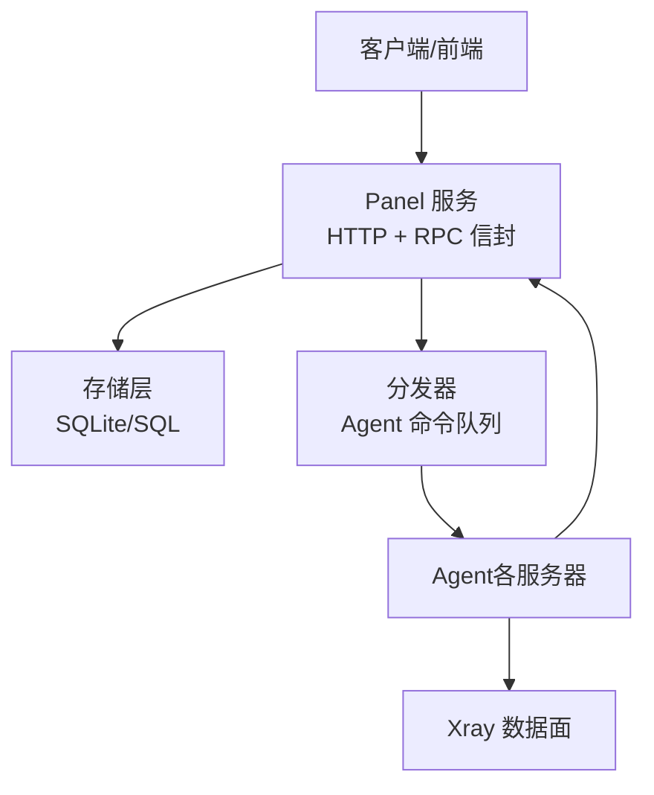
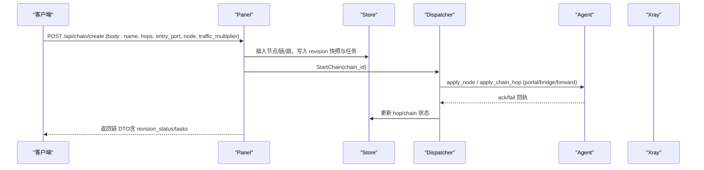
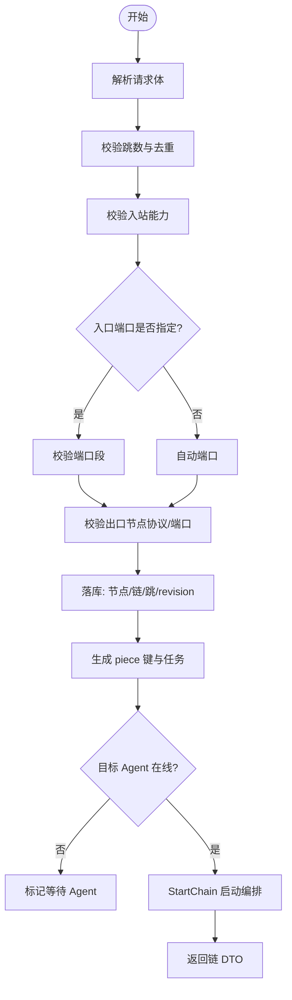
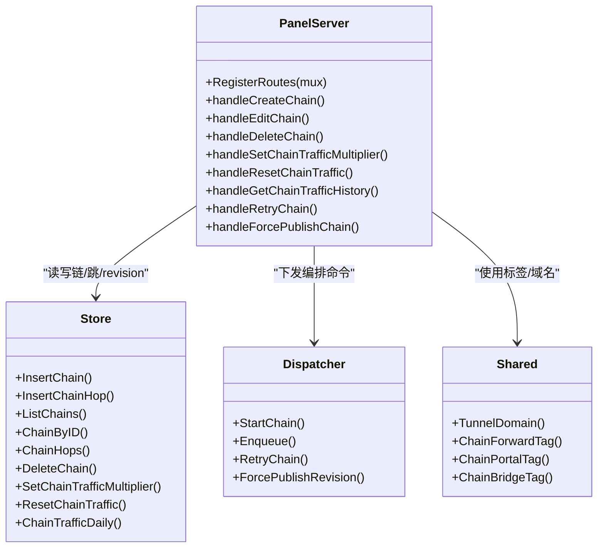

# 链路管理 API

<cite>
**本文引用的文件**   
- [openapi.yaml](file://docs/openapi.yaml)
- [chains.go](file://src/backend/internal/panel/chains.go)
- [panel.go](file://src/backend/internal/panel/panel.go)
- [chains.go](file://src/backend/internal/store/chains.go)
- [chain-revisions-traffic-design.md](file://docs/chain-revisions-traffic-design.md)
- [chain.go](file://src/shared/chain.go)
- [telemetry.go](file://src/agent/cmd/agent/telemetry.go)
- [api-contract.generated.ts](file://src/frontend/src/lib/api-contract.generated.ts)
</cite>

## 目录
1. [简介](#简介)
2. [项目结构](#项目结构)
3. [核心组件](#核心组件)
4. [架构总览](#架构总览)
5. [详细组件分析](#详细组件分析)
6. [依赖关系分析](#依赖关系分析)
7. [性能与监控](#性能与监控)
8. [故障转移与状态机](#故障转移与状态机)
9. [请求与响应规范](#请求与响应规范)
10. [错误处理指南](#错误处理指南)
11. [结论](#结论)
12. [附录：接口清单与示例](#附录接口清单与示例)

## 简介
本文件为 Lattix-codex 项目的“链路管理”RESTful API 文档，覆盖链路的创建、查询、编辑（更新）、删除以及流量倍率设置、流量历史查询、重试与强制发布等高级能力。同时说明链路拓扑配置、节点编排、流量分配、状态监控、性能指标与故障转移机制，并提供完整的请求/响应约定与错误处理指南。

注意：当前 Panel 对外暴露的是 RPC 风格 HTTP 接口（统一信封），并非传统 RESTful URL 路径。例如“获取链路列表”实际调用 /api/chain/list，“创建链路”调用 /api/chain/create。为便于理解，本文在描述时既给出业务语义（如“POST /api/chains”）也标注实际路由（如“POST /api/chain/create”）。

## 项目结构
- 面板服务（Panel）负责 HTTP 路由注册、鉴权、日志、RPC 信封封装与业务编排调度。
- 存储层（Store）提供链、跳、修订版本、任务、流量统计等持久化能力。
- 分发器（Dispatcher）负责将编排任务下发到 Agent，并推进状态机。
- Agent 上报遥测数据（含 Xray 计数器绝对值），用于链路流量统计与展示。
- OpenAPI 定义统一 RPC 信封与通用参数/响应格式。

图表来源
- [panel.go:158-276](file://src/backend/internal/panel/panel.go#L158-L276)
- [chains.go](file://src/backend/internal/panel/chains.go)
- [chains.go](file://src/backend/internal/store/chains.go)
- [chain-revisions-traffic-design.md](file://docs/chain-revisions-traffic-design.md)

章节来源
- [panel.go:158-276](file://src/backend/internal/panel/panel.go#L158-L276)
- [openapi.yaml](file://docs/openapi.yaml)

## 核心组件
- 链路 DTO 与 DTO 组装：包含链基本信息、逐跳状态、流量汇总、修订版本信息、任务进度与服务配置快照。
- 链路创建/编辑：校验拓扑（1-4 跳）、端口段、协议与传输策略；生成 revision 快照与幂等任务图；从出口向入口顺序部署。
- 链路删除：反向逐跳下发 remove_chain_hop，出口业务节点走现有删除流程，最后软删除链记录。
- 流量倍率：支持 0.001～1000.000，千分整数存储，原始与有效流量分别累计。
- 流量历史：按日桶聚合，支持 chain/hop 维度与天数范围查询。
- 重试与强制发布：仅重放失败 piece；或立即提升未确认 revision 并发布。

章节来源
- [chains.go](file://src/backend/internal/panel/chains.go)
- [chains.go](file://src/backend/internal/store/chains.go)
- [chain-revisions-traffic-design.md](file://docs/chain-revisions-traffic-design.md)

## 架构总览
链路管理的控制流遵循“make-before-break”的发布策略：先持久化 desired revision 与任务图，再按 piece 类型从出口向入口部署，入口最后切换，随后提升 published revision 并清理旧 piece。

图表来源
- [chains.go](file://src/backend/internal/panel/chains.go)
- [chain-revisions-traffic-design.md](file://docs/chain-revisions-traffic-design.md)

## 详细组件分析

### 链路创建（POST /api/chain/create）
- 功能：创建一条 1-4 跳链路，支持自动/指定入口端口、出口业务节点协议与参数、流量倍率。
- 校验要点：
  - 跳数 1-4，同链内服务器不可重复。
  - 非出口跳需具备入站能力（直连或 NAT 受限直连）。
  - 入口端口需在可用段内（NAT 场景）。
  - 出口节点若为 dokodemo 且多跳则不允许。
- 编排：
  - 生成 service/forward/portal/bridge 等 piece 键，创建 revision 快照与任务。
  - 检查 Agent 在线性，必要时进入 waiting_for_agent。
  - 启动编排器，按阶段下发命令。
- 响应：返回链 DTO（含 hops、revision_status、revision_tasks、service_config 等）。

图表来源
- [chains.go](file://src/backend/internal/panel/chains.go)

章节来源
- [chains.go](file://src/backend/internal/panel/chains.go)

### 链路列表（GET /api/chain/list）
- 功能：列出全部链路，附带逐跳状态、流量汇总、revision 信息与任务进度。
- 实现：遍历 chains，组装 toChainDTO，加载 hops、traffic totals、revision 快照与 tasks。

章节来源
- [chains.go](file://src/backend/internal/panel/chains.go)

### 获取单个链路（GET /api/chain/{id}）
- 说明：当前 Panel 未直接暴露 GET /api/chain/{id} 路由，可通过列表接口筛选或结合订阅/详情页面使用。如需精确单条查询，可在上层通过列表过滤实现。

章节来源
- [panel.go:223-237](file://src/backend/internal/panel/panel.go#L223-L237)

### 链路编辑（POST /api/chain/edit）
- 功能：对已发布链进行编辑，生成新的 desired revision，差分 planner 计算变更集，按 make-before-break 顺序部署。
- 关键点：
  - 同一链仅允许一个编辑进行中。
  - 支持修改名称、跳序列、入口端口、协议与完整协议参数、流量倍率。
  - 内部传输由 planner 自动选择 direct/encrypted/reverse。
- 响应：返回新 revision 的 DTO（含 tasks、status）。

章节来源
- [chains.go](file://src/backend/internal/panel/chains.go)
- [chain-revisions-traffic-design.md](file://docs/chain-revisions-traffic-design.md)

### 强制发布（POST /api/chain/force-publish）
- 功能：立即将 desired revision 提升为 unconfirmed 并发布，跳过等待 Agent 的约束，继续排队未确认命令。
- 适用场景：管理员确认风险后快速生效。

章节来源
- [chains.go](file://src/backend/internal/panel/chains.go)

### 流量倍率设置（POST /api/chain/set-traffic-multiplier）
- 功能：设置链级流量倍率（0.001～1000.000），影响新增流量的 effective 统计。
- 存储：以千分整数保存，API 以字符串形式往返。

章节来源
- [chains.go](file://src/backend/internal/panel/chains.go)

### 重置流量（POST /api/chain/reset-traffic）
- 功能：为链创建 checkpoint，重置展示累计（raw/effective 展示归零），不影响底层计数器与历史日桶。

章节来源
- [chains.go](file://src/backend/internal/panel/chains.go)

### 流量历史（GET /api/chain/get-traffic-history）
- 参数：chain_id（必填）、hop_id（可选）、days（1-730，默认 30）。
- 输出：按日桶聚合的 raw/effective 上下行数据。

章节来源
- [chains.go](file://src/backend/internal/panel/chains.go)

### 重试（POST /api/chain/retry）
- 功能：仅重放失败的 piece，恢复编排进度。

章节来源
- [chains.go](file://src/backend/internal/panel/chains.go)

### 删除链路（POST /api/chain/delete）
- 功能：反向逐跳下发 remove_chain_hop，出口业务节点走现有删除流程，最后软删除链记录。
- 审计：保留 revision、任务与流量历史。

章节来源
- [chains.go](file://src/backend/internal/panel/chains.go)
- [chains.go](file://src/backend/internal/store/chains.go)

## 依赖关系分析
- Panel 路由注册集中在 panel.go，所有链相关路由均在此注册。
- 业务逻辑集中在 panel/chains.go，数据访问在 store/chains.go。
- 共享常量与标签定义在 shared/chain.go。
- 遥测采集在 agent/telemetry.go，用于流量计数器聚合。

图表来源
- [panel.go:223-237](file://src/backend/internal/panel/panel.go#L223-L237)
- [chains.go](file://src/backend/internal/panel/chains.go)
- [chains.go](file://src/backend/internal/store/chains.go)
- [chain.go](file://src/shared/chain.go)

章节来源
- [panel.go:223-237](file://src/backend/internal/panel/panel.go#L223-L237)
- [chains.go](file://src/backend/internal/panel/chains.go)
- [chains.go](file://src/backend/internal/store/chains.go)
- [chain.go](file://src/shared/chain.go)

## 性能与监控
- 流量口径：
  - 出口 service inbound 为权威总量；入口 forward inbound 用于对账；中间 hop 仅展示。
  - 上下行以客户端视角定义，各 hop 流量不得相加。
- 离线补报：
  - Agent→Panel 控制通道断开不中断 Xray 绝对计数器；重连首帧补差。
  - 出口离线时链路权威总量暂停，重连后补差。
- 统计粒度：
  - 每日桶持久化，月统计动态汇总；支持 chain/hop 维度与 days 范围查询。
- 指标来源：
  - Agent 上报 Xray 计数器绝对快照，后端去重与增量计算。

章节来源
- [chain-revisions-traffic-design.md](file://docs/chain-revisions-traffic-design.md)
- [telemetry.go](file://src/agent/cmd/agent/telemetry.go)

## 故障转移与状态机
- 链状态机：pending → applying → active | failed；任一跳 server 离线推导 degraded；全部恢复后 active。
- 跳状态机：pending → applying → active | failed。
- 特殊状态：waiting_for_agent、active_unconfirmed、active_failed、cleanup_pending、invalid、deleted。
- 失效处理：
  - 服务器删除时，引用链立即 invalid 并从订阅移除，取消未发布 revision，清理其余服务器上的相关 piece。
  - 删除链时软删除，保留历史。

章节来源
- [chains.go](file://src/backend/internal/store/chains.go)
- [chain-revisions-traffic-design.md](file://docs/chain-revisions-traffic-design.md)

## 请求与响应规范
- 认证与安全：
  - 所有管理 API 需要登录会话（sessionCookie）。
  - 写操作启用 CSRF 保护与幂等性（Idempotent）。
- 统一信封：
  - 成功响应 HTTP 200，body 为 RPCEnvelope，code 表达业务结果。
  - 常见 code：OK、ACCEPTED、AUTH_REQUIRED、INVALID_ARGUMENT、NOT_FOUND、CONFLICT、OPERATION_LOCKED、INTERNAL_ERROR、UPSTREAM_ERROR、SERVICE_UNAVAILABLE、SERVER_OFFLINE、PORT_OUT_OF_RANGE、UPDATE_IN_PROGRESS。
- 请求体：
  - 多数接口使用 application/json 的 RPCBody（任意对象），字段由各接口定义。
- 响应头：
  - X-Request-ID、X-Trace-ID 用于追踪。

章节来源
- [openapi.yaml](file://docs/openapi.yaml)
- [panel.go:322-382](file://src/backend/internal/panel/panel.go#L322-L382)

## 错误处理指南
- 参数错误：返回 INVALID_ARGUMENT 或 HTTP 4xx 映射码（如 PORT_OUT_OF_RANGE）。
- 资源不存在：NOT_FOUND。
- 冲突：CONFLICT（如已有编辑进行中）。
- 上游错误：UPSTREAM_ERROR（Agent/外部依赖）。
- 服务不可用：SERVICE_UNAVAILABLE。
- 服务器离线：SERVER_OFFLINE。
- 处理建议：
  - 检查请求体字段与取值范围（端口、倍率、跳数）。
  - 关注 revision_status 与 revision_tasks 中的错误定位。
  - 使用 retry 接口重放失败 piece。
  - 必要时使用 force-publish 强制生效（不可回滚）。

章节来源
- [openapi.yaml](file://docs/openapi.yaml)
- [chains.go](file://src/backend/internal/panel/chains.go)

## 结论
Lattix 的链路管理以统一的 RPC 信封暴露能力，通过严格的拓扑校验、幂等任务图与 make-before-break 的发布策略，确保多跳链路的稳定编排与可观测性。流量统计基于绝对计数器与日桶聚合，支持离线补差与倍率调整。状态机与故障转移机制保障在 Agent 离线、服务器删除等异常场景下的可控性与可恢复性。

## 附录：接口清单与示例

### 接口清单（Panel RPC 路由）
- 列表：GET /api/chain/list
- 创建：POST /api/chain/create
- 编辑：POST /api/chain/edit
- 强制发布：POST /api/chain/force-publish
- 设置流量倍率：POST /api/chain/set-traffic-multiplier
- 重置流量：POST /api/chain/reset-traffic
- 流量历史：GET /api/chain/get-traffic-history
- 重试：POST /api/chain/retry
- 删除：POST /api/chain/delete

章节来源
- [panel.go:223-237](file://src/backend/internal/panel/panel.go#L223-L237)
- [api-contract.generated.ts:59-67](file://src/frontend/src/lib/api-contract.generated.ts#L59-L67)

### 典型请求/响应示例（描述性）
- 创建链路
  - 请求体关键字段：name、hops（server_id 数组）、entry_port（可选）、node（协议与参数）、traffic_multiplier（可选）。
  - 响应：链 DTO，包含 id、name、status、hops[]、traffic、revision_status、revision_tasks、service_config。
- 编辑链路
  - 请求体关键字段：chain_id、name、hops、entry_port（可选）、node、traffic_multiplier。
  - 响应：新 revision 的链 DTO（含任务与状态）。
- 设置流量倍率
  - 请求体：chain_id、traffic_multiplier（0.001～1000.000）。
  - 响应：{ traffic_multiplier: "x.yyy" }。
- 重置流量
  - 请求体：chain_id。
  - 响应：空对象。
- 流量历史
  - 查询参数：chain_id（必填）、hop_id（可选）、days（1-730）。
  - 响应：按日桶聚合的 raw/effective 上下行数组。
- 重试
  - 请求体：chain_id。
  - 响应：链 DTO（状态可能回到 applying）。
- 删除
  - 请求体：chain_id。
  - 响应：空对象。

章节来源
- [chains.go](file://src/backend/internal/panel/chains.go)
- [openapi.yaml](file://docs/openapi.yaml)