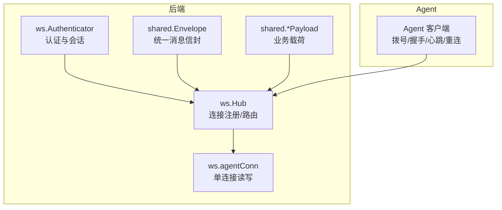
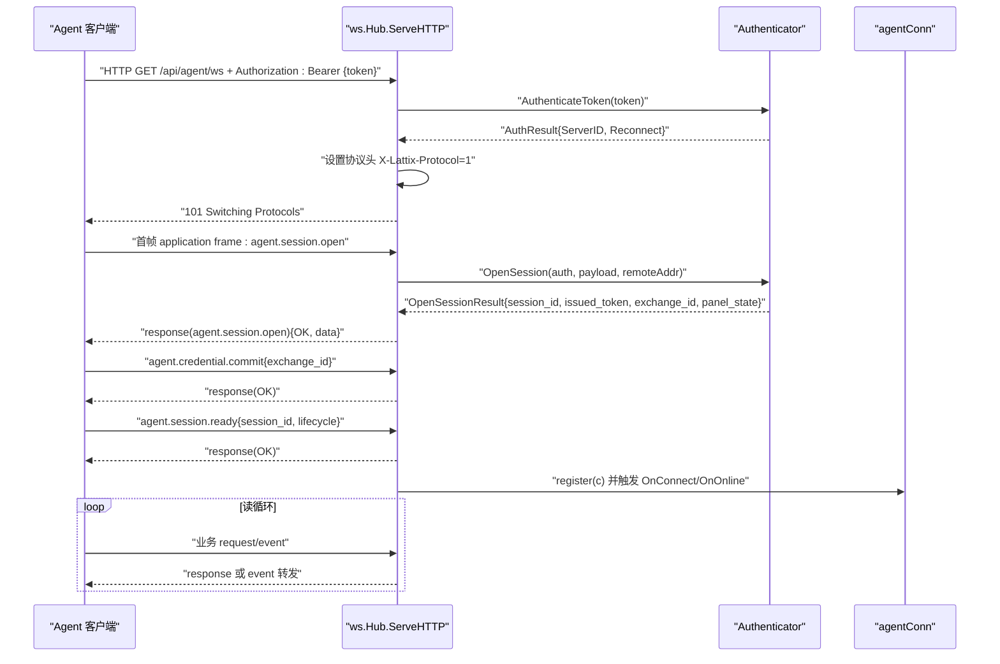
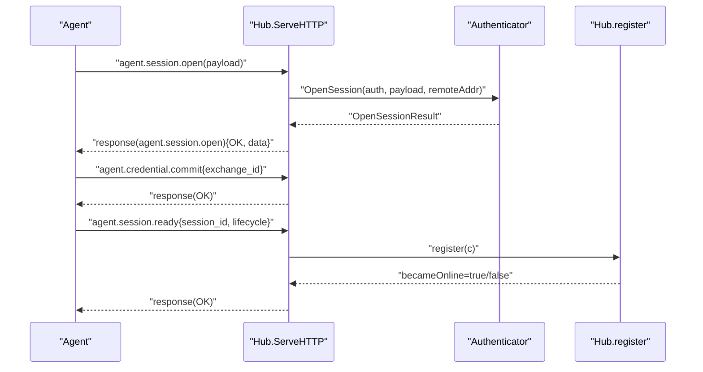
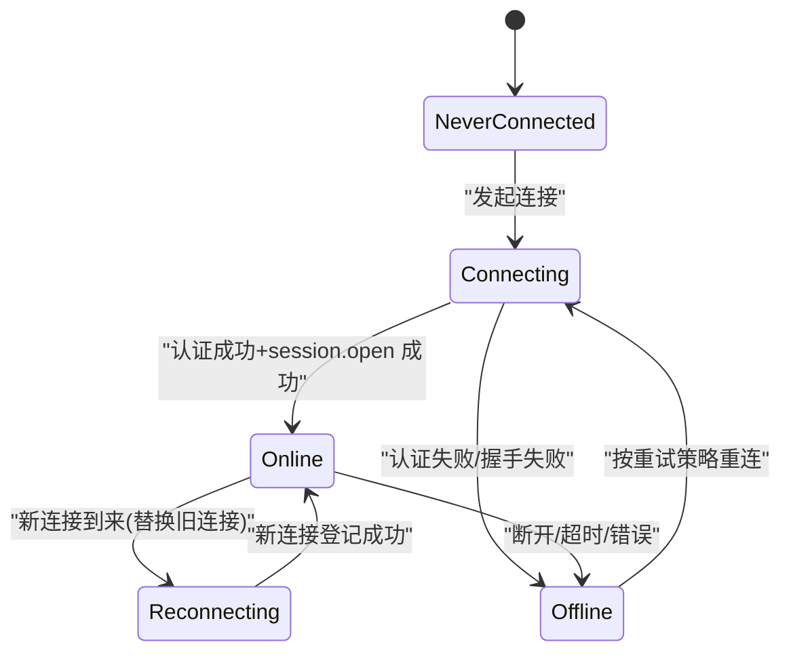
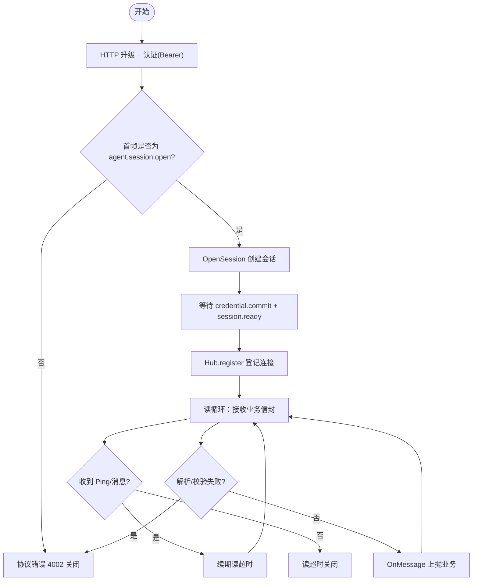

# WebSocket API

<cite>
**本文引用的文件**   
- [agent.go](file://src/backend/internal/ws/agent.go)
- [hub.go](file://src/backend/internal/ws/hub.go)
- [requester.go](file://src/backend/internal/ws/requester.go)
- [messages.go](file://src/shared/messages.go)
- [lifecycle.go](file://src/shared/lifecycle.go)
- [config.go](file://src/shared/config.go)
- [ws-protocol.schema.json](file://docs/ws-protocol.schema.json)
</cite>

## 目录
1. [简介](#简介)
2. [项目结构](#项目结构)
3. [核心组件](#核心组件)
4. [架构总览](#架构总览)
5. [详细组件分析](#详细组件分析)
6. [依赖关系分析](#依赖关系分析)
7. [性能考量](#性能考量)
8. [故障排查指南](#故障排查指南)
9. [结论](#结论)
10. [附录](#附录)

## 简介
本文件为 Lattix-codex 项目的 WebSocket API 完整文档，面向 Agent 与后端（Panel）之间的控制通道。内容涵盖：
- 连接建立与握手协议、请求头与参数
- 消息信封格式与 JSON Schema 约束
- 双向通信机制（心跳、重连、错误处理）
- 事件类型与回调机制（状态变更、配置更新、遥测上报等）
- 连接生命周期管理（建立、交换、异常断开、自动重连）
- 安全考虑（认证、访问控制、关闭码语义）
- 客户端集成要点与调试建议

## 项目结构
WebSocket 相关实现位于后端 ws 包与 shared 协议定义中：
- 后端 ws 包：Hub、Agent 连接处理、发送队列、生命周期同步、错误与超时控制
- shared 包：统一信封 Envelope、常量（kind/type/code）、业务载荷结构、生命周期快照
- docs/ws-protocol.schema.json：JSON Schema 对信封与数据体的强约束



**图表来源** 
- [hub.go:25-62](file://src/backend/internal/ws/hub.go#L25-L62)
- [agent.go:32-98](file://src/backend/internal/ws/agent.go#L32-L98)
- [messages.go:14-51](file://src/shared/messages.go#L14-L51)
- [lifecycle.go:32-45](file://src/shared/lifecycle.go#L32-L45)

**章节来源**
- [agent.go:32-98](file://src/backend/internal/ws/agent.go#L32-L98)
- [hub.go:25-62](file://src/backend/internal/ws/hub.go#L25-L62)
- [messages.go:14-51](file://src/shared/messages.go#L14-L51)
- [lifecycle.go:32-45](file://src/shared/lifecycle.go#L32-L45)

## 核心组件
- Hub：维护 Agent 连接表、在线状态、发送缓冲、优雅停机（drain）、生命周期同步广播
- agentConn：单条 WS 连接的封装，负责写泵串行写出、关闭码、生命周期 ACK 等待
- Authenticator：HTTP Upgrade 阶段凭据校验与应用层会话打开（由 dispatcher 注入）
- shared.Envelope：统一 RPC 信封，包含 kind、type、request_id、trace_id、code/message、data
- shared 业务载荷：SessionOpen/Payload、LifecycleChanged、Telemetry、Drift、ChainHop 等

关键职责边界：
- 认证与会话：Authenticator 接口在 HTTP 升级后完成应用层会话建立
- 传输与可靠性：Hub 提供 Send/IsOnline；agentConn 保证串行写出与超时
- 协议一致性：Envelope.Validate() 与 JSON Schema 双重约束

**章节来源**
- [hub.go:25-62](file://src/backend/internal/ws/hub.go#L25-L62)
- [hub.go:110-138](file://src/backend/internal/ws/hub.go#L110-L138)
- [requester.go:18-43](file://src/backend/internal/ws/requester.go#L18-L43)
- [messages.go:14-51](file://src/shared/messages.go#L14-L51)
- [messages.go:112-137](file://src/shared/messages.go#L112-L137)

## 架构总览
Agent 主动拨号至后端 /api/agent/ws，携带 Bearer Token 进行 HTTP Upgrade。握手成功后进入应用层会话建立流程，随后进入稳定的双向消息通道。



**图表来源** 
- [agent.go:32-98](file://src/backend/internal/ws/agent.go#L32-L98)
- [agent.go:120-154](file://src/backend/internal/ws/agent.go#L120-L154)
- [agent.go:156-195](file://src/backend/internal/ws/agent.go#L156-L195)
- [hub.go:229-248](file://src/backend/internal/ws/hub.go#L229-L248)

## 详细组件分析

### 连接建立与握手协议
- 端点：/api/agent/ws
- 认证：Authorization: Bearer {token}
- 协议头：X-Lattix-Protocol=1（响应头返回）
- 首次应用帧：必须是 agent.session.open（kind=request），否则以 CloseMessage(4002) 关闭
- 会话打开结果：response(kind=response, type=agent.session.open)，code=OK，data 包含 server_id、session_id、session_kind、issued_token、credential_exchange_id、panel_state
- 前置限制：在 session.ready 之前仅接受 credential.commit 与 session.ready，其他请求返回 UNSUPPORTED_ACTION

关键行为：
- 读超时：首帧 10s 超时；之后每收到任意消息续期 pongTimeout（默认 90s）
- Ping/Pong：Agent 主动 Ping，Panel 原样 Pong 并续期读超时
- 关闭码：协议错误使用 4002；服务重启使用 1012；会话不可用使用 1013

**章节来源**
- [agent.go:32-77](file://src/backend/internal/ws/agent.go#L32-L77)
- [agent.go:86-98](file://src/backend/internal/ws/agent.go#L86-L98)
- [agent.go:100-119](file://src/backend/internal/ws/agent.go#L100-L119)
- [agent.go:156-195](file://src/backend/internal/ws/agent.go#L156-L195)
- [hub.go:15-22](file://src/backend/internal/ws/hub.go#L15-L22)

### 消息信封与 JSON Schema
- 统一信封 Envelope：
  - kind：request/response/event
  - type：domain.action 命名空间
  - request_id/trace_id：32 位十六进制随机 ID
  - code/message：仅 response 携带
  - data：具体动作的 JSON 载荷
- 校验：Envelope.Validate() 严格检查必填字段与格式；strictUnmarshal 禁止未知字段
- JSON Schema：docs/ws-protocol.schema.json 定义了 envelope 及各类 data 的结构与约束

常用类型与常量：
- KindRequest/KindResponse/KindEvent
- TypeSessionOpen/TypeSessionReady/TypeCredentialCommit/TypeLifecycleChanged/TypeSettingsSync/TypeSettingsChanged/TypeTelemetry/TypeApplyNode/TypeRemoveNode/TypeAddUser/TypeRemoveUser/TypeUninstall/TypeUpgradeXray/TypeUpgradeAgent/TypeApplyChainHop/TypeRemoveChainHop

**章节来源**
- [messages.go:14-51](file://src/shared/messages.go#L14-L51)
- [messages.go:112-137](file://src/shared/messages.go#L112-L137)
- [ws-protocol.schema.json:106-132](file://docs/ws-protocol.schema.json#L106-L132)

### 会话建立序列图（含认证与就绪）


**图表来源** 
- [agent.go:120-154](file://src/backend/internal/ws/agent.go#L120-L154)
- [agent.go:156-195](file://src/backend/internal/ws/agent.go#L156-L195)
- [hub.go:229-248](file://src/backend/internal/ws/hub.go#L229-L248)

### 心跳与保活
- 心跳方向：Agent 主动发送 Ping；Panel 原样回 Pong
- 保活策略：每次收到任何消息（包括 Ping）均续期读超时（默认 90s）
- 写超时：单次写操作 10s 超时，失败即判定连接死亡

**章节来源**
- [agent.go:100-109](file://src/backend/internal/ws/agent.go#L100-L109)
- [hub.go:15-22](file://src/backend/internal/ws/hub.go#L15-L22)

### 重连策略与连接状态
- SessionKind：initial/reconnect
- Panel 生命周期快照：state(epoch, revision, entered_at, retry_policy, latency_resume_window_ms)
- 重连提示：若 auth.Reconnect=true，则 session_kind=reconnect，连接状态标记为 reconnecting
- 连接状态机：never_connected → connecting → online/offline；reconnect 场景保持 online→online 替换旧连接



**图表来源** 
- [lifecycle.go:5-20](file://src/shared/lifecycle.go#L5-L20)
- [agent.go:59-66](file://src/backend/internal/ws/agent.go#L59-L66)
- [hub.go:229-248](file://src/backend/internal/ws/hub.go#L229-L248)

**章节来源**
- [lifecycle.go:32-45](file://src/shared/lifecycle.go#L32-L45)
- [agent.go:59-66](file://src/backend/internal/ws/agent.go#L59-L66)
- [hub.go:229-248](file://src/backend/internal/ws/hub.go#L229-L248)

### 错误处理与关闭码
- 协议错误：CloseMessage(4002, "invalid protocol message")
- 会话不可用：CloseMessage(1013, "session unavailable")
- 服务重启：CloseMessage(1012, "service restart")
- 认证失败：HTTP 403 返回结构化 Envelope(response, type=agent.session.open, code=AUTH_INVALID_CREDENTIALS)

**章节来源**
- [agent.go:93-97](file://src/backend/internal/ws/agent.go#L93-L97)
- [agent.go:124-126](file://src/backend/internal/ws/agent.go#L124-L126)
- [hub.go:157-172](file://src/backend/internal/ws/hub.go#L157-L172)
- [agent.go:262-272](file://src/backend/internal/ws/agent.go#L262-L272)

### 事件与回调机制
- OnUpgrade：HTTP 升级为 WS 后立即调用（记录 101 握手）
- OnConnect：session.ready 完成后、连接登记时调用（用于离线命令补发）
- OnOnline/OnReconnect：服务器从 offline→online 或已有连接被替换时调用
- OnMessage：认证后所有业务信封上抛（apply_result 等）
- OnProtocolError：仅记录无正常业务响应的协议错误（遥测/ping/pong 不触发）
- OnDisconnect：实际移除连接且非 draining 时触发（offline↔online 跃迁）

**章节来源**
- [hub.go:29-46](file://src/backend/internal/ws/hub.go#L29-L46)
- [agent.go:205-210](file://src/backend/internal/ws/agent.go#L205-L210)
- [hub.go:250-260](file://src/backend/internal/ws/hub.go#L250-L260)
- [hub.go:264-278](file://src/backend/internal/ws/hub.go#L264-L278)

### 配置同步与变更推送
- agent.settings.sync：请求面板当前 settingsDocument（schema_version=1），包含 panel.instance_id/version/public_url/ws_url 与 agent.revision/reconnect/telemetry/drift_detection
- agent.settings.changed：事件通知面板侧 settings 版本变更（revision≥1）
- 面板可下发 panel.lifecycle.changed 事件驱动 Agent 刷新生命周期感知

**章节来源**
- [ws-protocol.schema.json:36-55](file://docs/ws-protocol.schema.json#L36-L55)
- [ws-protocol.schema.json:256-296](file://docs/ws-protocol.schema.json#L256-L296)
- [ws-protocol.schema.json:300-315](file://docs/ws-protocol.schema.json#L300-L315)
- [messages.go:77-79](file://src/shared/messages.go#L77-L79)

### 遥测与漂移检测
- telemetry.report：周期上报（无需回执），包含 xray_instance_id、traffic[]（up/down 绝对计数器）
- config.drift：配置文件被外部修改时上报 drifted=true，修复后上报 false（仅状态变化时）

**章节来源**
- [ws-protocol.schema.json:318-333](file://docs/ws-protocol.schema.json#L318-L333)
- [messages.go:195-232](file://src/shared/messages.go#L195-L232)
- [messages.go:234-238](file://src/shared/messages.go#L234-L238)

### 链跳配置下发与回执
- chain-hop.apply：下发 hop 配置（portal/bridge/forward），Agent 渲染入受管 config.json
- chain-hop.remove：逐跳反向下发删除
- ApplyResultPayload：回执包含 node_id、realized_config、hop_id、kind（port/public_key 等生效值）

**章节来源**
- [ws-protocol.schema.json:336-353](file://docs/ws-protocol.schema.json#L336-L353)
- [messages.go:255-312](file://src/shared/messages.go#L255-L312)
- [messages.go:185-194](file://src/shared/messages.go#L185-L194)

### 连接生命周期管理流程


**图表来源** 
- [agent.go:32-98](file://src/backend/internal/ws/agent.go#L32-L98)
- [agent.go:100-119](file://src/backend/internal/ws/agent.go#L100-L119)
- [agent.go:156-195](file://src/backend/internal/ws/agent.go#L156-L195)
- [hub.go:229-248](file://src/backend/internal/ws/hub.go#L229-L248)

**章节来源**
- [agent.go:32-98](file://src/backend/internal/ws/agent.go#L32-L98)
- [hub.go:229-248](file://src/backend/internal/ws/hub.go#L229-L248)

## 依赖关系分析
- ws.Hub 依赖 shared.Envelope 与 shared 业务载荷类型
- ws.agentConn 依赖 Hub 的 Send/LifecycleProvider 与 websocket.Conn
- Authenticator 接口由 dispatcher 实现，注入到 Hub 中完成认证与会话打开
- JSON Schema 与 Envelope.Validate() 共同保障协议一致性

```mermaid
classDiagram
class Hub {
+Send(ctx, serverID, env) error
+IsOnline(serverID) bool
+BeginDrain()
+SyncLifecycle(ctx, snapshot) []int64
-conns map[int64]*agentConn
-states map[int64]ConnectionSnapshot
}
class agentConn {
-ws *websocket.Conn
-send chan Envelope
-done chan struct{}
+close()
+closeWithCode(code, reason)
}
class Envelope {
+string kind
+string type
+string request_id
+string trace_id
+string code
+string message
+json.RawMessage data
+Validate() error
}
class Authenticator {
+AuthenticateToken(ctx, token) (AuthResult, error)
+OpenSession(ctx, auth, payload, addr) (OpenSessionResult, error)
+CommitCredential(ctx, serverID, exchangeID) error
}
Hub --> agentConn : "管理"
Hub --> Envelope : "发送/接收"
Hub --> Authenticator : "依赖"
```

**图表来源** 
- [hub.go:25-62](file://src/backend/internal/ws/hub.go#L25-L62)
- [hub.go:280-292](file://src/backend/internal/ws/hub.go#L280-L292)
- [messages.go:14-51](file://src/shared/messages.go#L14-L51)
- [requester.go:36-43](file://src/backend/internal/ws/requester.go#L36-L43)

**章节来源**
- [hub.go:25-62](file://src/backend/internal/ws/hub.go#L25-L62)
- [messages.go:14-51](file://src/shared/messages.go#L14-L51)
- [requester.go:36-43](file://src/backend/internal/ws/requester.go#L36-L43)

## 性能考量
- 写缓冲：每连接 sendBuffer=256，写满视为慢连接并断开（重连后补发）
- 写超时：writeTimeout=10s，超时即判定连接死亡
- 读超时：pongTimeoutDefault=90s，未收到任何字节即断开
- 串行写：writePump 串行消费发送队列，避免并发写冲突
- 批量同步：SyncLifecycle 向所有在线 Agent 广播生命周期变更并等待 ACK

**章节来源**
- [hub.go:15-22](file://src/backend/internal/ws/hub.go#L15-L22)
- [hub.go:380-395](file://src/backend/internal/ws/hub.go#L380-L395)
- [hub.go:321-360](file://src/backend/internal/ws/hub.go#L321-L360)

## 故障排查指南
- 握手失败：检查 Authorization 头是否携带有效 Bearer Token；确认 X-Lattix-Protocol 响应头为 1
- 首帧错误：确保首个应用帧为 agent.session.open，且 data.protocol_version=1
- 协议错误：关注 CloseMessage(4002) 与 OnProtocolError 回调，定位非法信封或缺失字段
- 连接断开：检查 read/write 超时、网络抖动、代理配置（X-Forwarded-For 仅在回环代理可信）
- 重连问题：观察 session_kind=reconnect 与 Panel 生命周期快照中的 retry_policy

**章节来源**
- [agent.go:262-272](file://src/backend/internal/ws/agent.go#L262-L272)
- [agent.go:86-98](file://src/backend/internal/ws/agent.go#L86-L98)
- [agent.go:285-298](file://src/backend/internal/ws/agent.go#L285-L298)
- [agent.go:332-348](file://src/backend/internal/ws/agent.go#L332-L348)

## 结论
Lattix-codex 的 WebSocket API 通过严格的信封结构与 JSON Schema 约束，结合明确的认证与会话流程，实现了稳定可靠的 Agent-Panel 控制通道。心跳保活、重连策略、错误码语义与回调机制共同保障了连接生命周期管理与业务指令的高效传递。

## 附录

### 安全考虑
- 认证：HTTP 升级阶段基于 Bearer Token 认证，失败返回 403 与结构化错误信封
- 访问控制：仅在认证通过后允许业务信封；未就绪前仅接受 credential.commit 与 session.ready
- 关闭码语义：4002（协议错误）、1012（服务重启）、1013（会话不可用）便于客户端区分处理
- 地址学习：直连取 RemoteAddr；回环代理信任 XFF 首个 IP，非回环不信任以防伪造

**章节来源**
- [agent.go:44-58](file://src/backend/internal/ws/agent.go#L44-L58)
- [agent.go:156-195](file://src/backend/internal/ws/agent.go#L156-L195)
- [agent.go:332-348](file://src/backend/internal/ws/agent.go#L332-L348)

### 客户端集成示例（步骤）
- 建立连接：GET /api/agent/ws，Header: Authorization: Bearer {token}
- 握手响应：检查 101 与 X-Lattix-Protocol=1
- 首帧发送：agent.session.open（payload 包含 protocol_version=1、agent_version、xray_version、xray_running、nic_addresses、last_lifecycle）
- 凭证提交：agent.credential.commit{exchange_id}
- 就绪通知：agent.session.ready{session_id, lifecycle}
- 心跳保活：定期发送 Ping；Panel 原样 Pong
- 监听事件：panel.lifecycle.changed、agent.settings.changed、telemetry.report（上行）
- 重连策略：依据 panel_state.retry_policy 与 session_kind=reconnect 执行指数退避

**章节来源**
- [agent.go:32-98](file://src/backend/internal/ws/agent.go#L32-L98)
- [agent.go:120-154](file://src/backend/internal/ws/agent.go#L120-L154)
- [lifecycle.go:32-45](file://src/shared/lifecycle.go#L32-L45)

### 调试工具使用建议
- 抓包：捕获 WS 握手与文本帧，验证 Envelope 字段与 JSON Schema
- 日志：启用 OnProtocolError 与 OnDisconnect 回调，定位协议错误与断连原因
- 状态查询：通过 Hub.ConnectionState(serverID) 查看连接状态与最近会话信息
- 压力测试：模拟慢连接（写缓冲满）与服务重启（1012）场景，验证重连与补发逻辑

**章节来源**
- [hub.go:75-91](file://src/backend/internal/ws/hub.go#L75-L91)
- [agent.go:285-298](file://src/backend/internal/ws/agent.go#L285-L298)
- [hub.go:157-172](file://src/backend/internal/ws/hub.go#L157-L172)