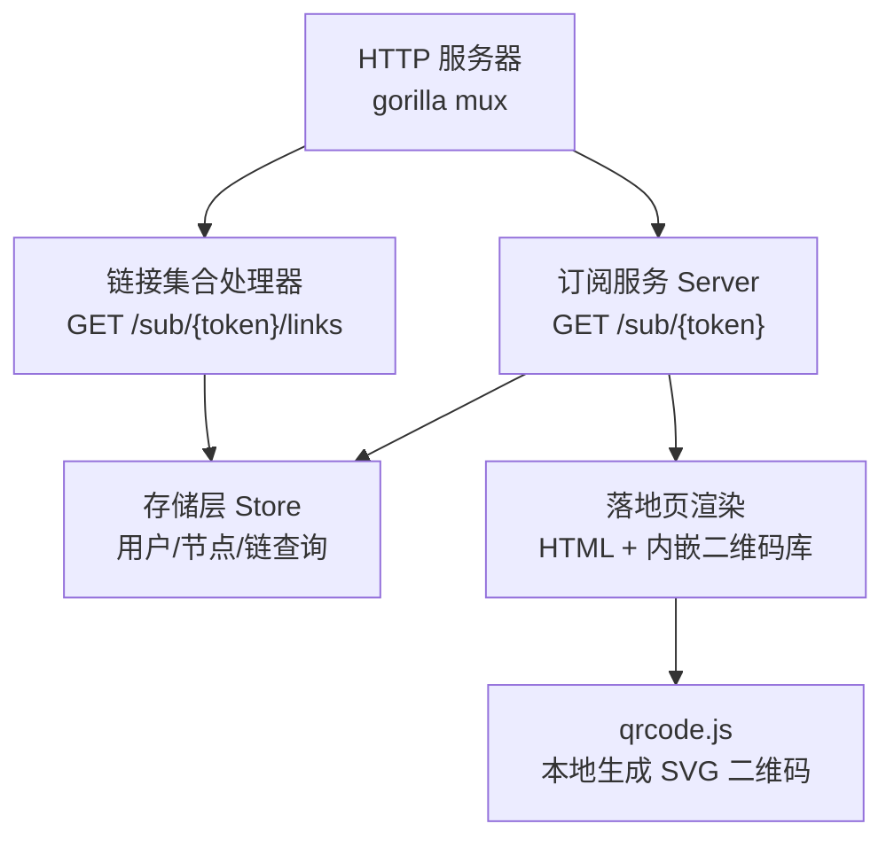
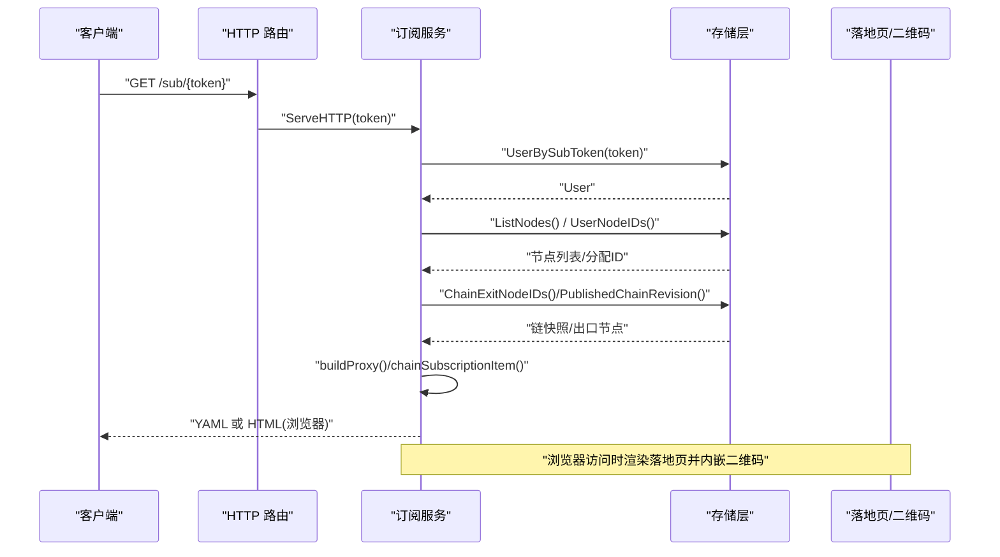
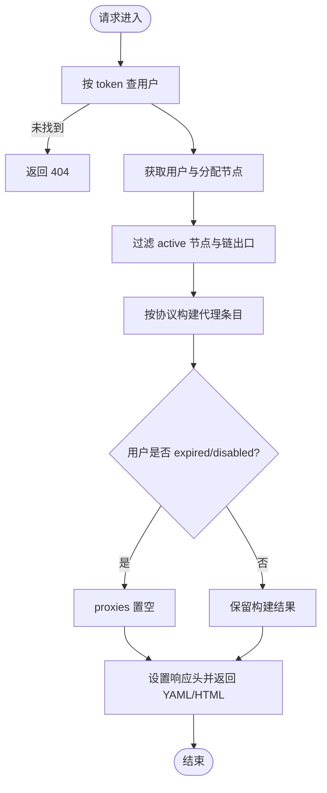
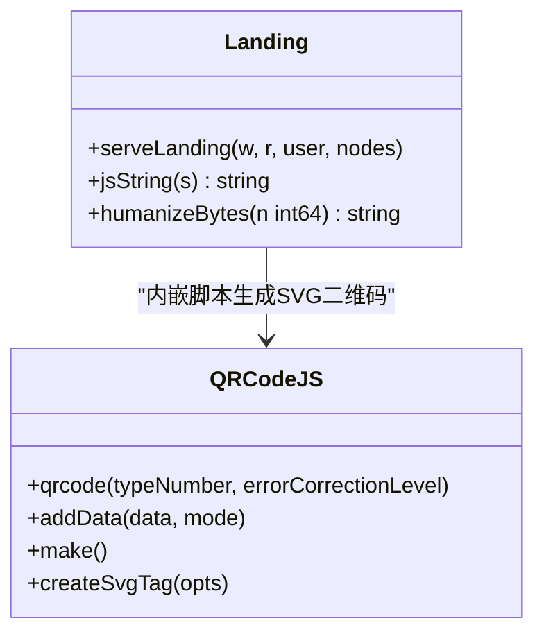
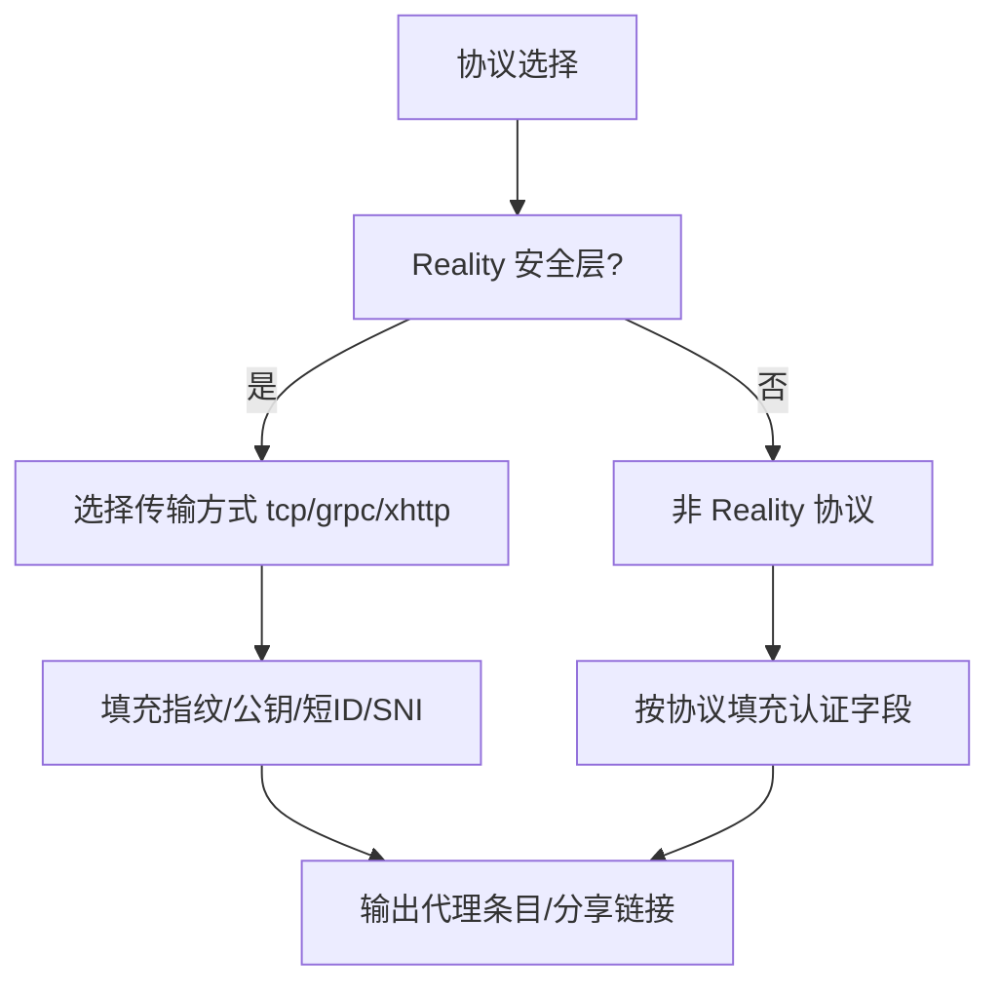
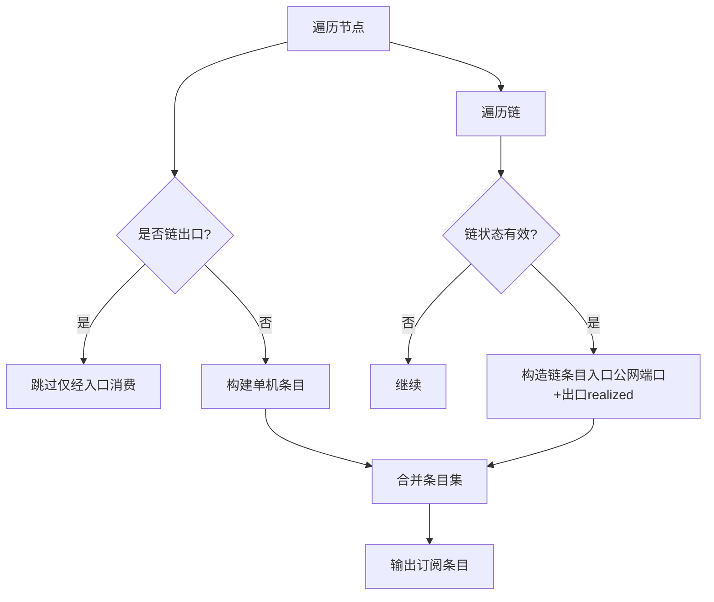
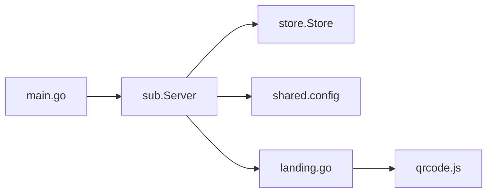

# 订阅接口

<cite>
**本文引用的文件**   
- [main.go](file://src/backend/cmd/backend/main.go)
- [sub.go](file://src/backend/internal/sub/sub.go)
- [links.go](file://src/backend/internal/sub/links.go)
- [landing.go](file://src/backend/internal/sub/landing.go)
- [qrcode.js](file://src/backend/internal/sub/qrcode.js)
- [users.go](file://src/backend/internal/store/users.go)
- [config.go](file://src/shared/config.go)
- [panel_users.go](file://src/backend/internal/panel/users.go)
</cite>

## 目录
1. [简介](#简介)
2. [项目结构](#项目结构)
3. [核心组件](#核心组件)
4. [架构总览](#架构总览)
5. [详细组件分析](#详细组件分析)
6. [依赖关系分析](#依赖关系分析)
7. [性能考虑](#性能考虑)
8. [故障排查指南](#故障排查指南)
9. [结论](#结论)
10. [附录](#附录)

## 简介
本文件为 Lattix-codex 项目的“订阅接口”技术文档，面向开发者与运维人员，覆盖以下主题：
- 订阅链接生成机制：令牌管理、权限控制、过期时间等
- 支持的订阅格式：mihomo（Clash.Meta）YAML、v2ray/trojan/shadowsocks 分享链接集合
- 二维码生成功能：内容格式、尺寸配置、样式定制
- 订阅生命周期管理：创建、更新、删除、禁用等操作
- 数据实时更新机制：增量更新、全量同步策略
- 安全考虑：令牌验证、访问频率限制、防滥用机制
- 客户端集成示例与配置指南：Clash、mihomo、Shadowrocket 等

## 项目结构
订阅能力由后端 HTTP 服务暴露两个端点：
- GET /sub/{token}：返回 mihomo YAML；浏览器访问时返回落地页 HTML（含二维码与一键导入链接）
- GET /sub/{token}/links：返回 base64 编码的换行分隔分享链接集合（vless/trojan/vmess/ss）

路由注册位于主进程入口，订阅服务通过面板对外地址构造绝对链接。



**图表来源** 
- [main.go:434-437](file://src/backend/cmd/backend/main.go#L434-L437)
- [sub.go:18-36](file://src/backend/internal/sub/sub.go#L18-L36)
- [landing.go:14-20](file://src/backend/internal/sub/landing.go#L14-L20)

**章节来源**
- [main.go:434-437](file://src/backend/cmd/backend/main.go#L434-L437)
- [sub.go:18-36](file://src/backend/internal/sub/sub.go#L18-L36)

## 核心组件
- 订阅服务 Server：负责鉴权、流量统计头设置、协议适配、YAML 构建、落地页渲染
- 链接集合处理器：按协议生成 v2ray/trojan/vmess/ss 分享链接并 base64 编码输出
- 存储层 Store：用户查询（sub_token）、用户分配节点、链快照读取、节点状态过滤
- 共享配置 shared：协议常量、传输方式、指纹、SS 密码派生、RealizedConfig/VirtualConfig 定义
- 落地页与二维码：自包含 HTML，内嵌 qrcode.js 在浏览器侧生成 SVG 二维码

**章节来源**
- [sub.go:18-36](file://src/backend/internal/sub/sub.go#L18-L36)
- [links.go:16-43](file://src/backend/internal/sub/links.go#L16-L43)
- [users.go:11-23](file://src/backend/internal/store/users.go#L11-L23)
- [config.go:13-24](file://src/shared/config.go#L13-L24)
- [landing.go:14-20](file://src/backend/internal/sub/landing.go#L14-L20)

## 架构总览
订阅接口的请求处理流程如下：
- 客户端发起 GET /sub/{token} 或 /sub/{token}/links
- 服务端根据 token 查找用户，校验是否存在
- 获取用户已分配的 active 节点与链快照，过滤不可用项
- 按协议构建代理条目或分享链接
- 返回 YAML 或 base64 文本；浏览器访问则返回落地页 HTML



**图表来源** 
- [main.go:434-437](file://src/backend/cmd/backend/main.go#L434-L437)
- [sub.go:147-190](file://src/backend/internal/sub/sub.go#L147-L190)
- [users.go:88-98](file://src/backend/internal/store/users.go#L88-L98)

## 详细组件分析

### 订阅端点 GET /sub/{token}
- 功能：按当前用户的 UUID 为每个 active 节点生成一条代理条目，输出 mihomo YAML；浏览器访问时返回落地页 HTML
- 鉴权：通过 sub_token 查用户，不存在返回 404
- 权限控制：仅包含分配给该用户的 active 节点；dokodemo-door 不入订阅
- 停权态处理：expired=1 或 disabled=1 的用户仍返回响应，但 proxies 为空
- 响应头：
  - Subscription-Userinfo：upload/download 累计值（用户维度 node_id=0），expire（若设置）
  - Profile-Update-Interval：24（小时），客户端按天自动刷新



**图表来源** 
- [sub.go:147-190](file://src/backend/internal/sub/sub.go#L147-L190)
- [sub.go:205-247](file://src/backend/internal/sub/sub.go#L205-L247)

**章节来源**
- [sub.go:147-190](file://src/backend/internal/sub/sub.go#L147-L190)
- [sub.go:205-247](file://src/backend/internal/sub/sub.go#L205-L247)
- [users.go:11-23](file://src/backend/internal/store/users.go#L11-L23)

### 链接集合端点 GET /sub/{token}/links
- 功能：返回 base64 编码的换行分隔分享链接集合（vless/trojan/vmess/ss）
- 权限控制：仅包含分配给该用户的 active 节点；dokodemo/socks/http 无标准分享链接，跳过
- 停权态处理：expired=1 或 disabled=1 的用户返回空集合
- 输出：text/plain; charset=utf-8，内容为 base64 字符串

```mermaid
sequenceDiagram
participant Client as "客户端"
participant Links as "HandleLinks"
participant Store as "存储层"
participant Builder as "buildShareLink"
Client->>Links : "GET /sub/{token}/links"
Links->>Store : "UserBySubToken(token)/ListNodes/UserNodeIDs"
Store-->>Links : "用户与节点信息"
Links->>Builder : "按协议生成分享链接"
Builder-->>Links : "vless/trojan/vmess/ss 链接"
Links-->>Client : "base64(换行分隔链接)"
```

**图表来源** 
- [links.go:16-43](file://src/backend/internal/sub/links.go#L16-L43)
- [links.go:46-109](file://src/backend/internal/sub/links.go#L46-L109)

**章节来源**
- [links.go:16-43](file://src/backend/internal/sub/links.go#L16-L43)
- [links.go:46-109](file://src/backend/internal/sub/links.go#L46-L109)

### 落地页与二维码
- 落地页：展示已用流量、有效期、节点数量、订阅地址与链接集合地址、二维码、一键导入链接（clash://install-config 与 mihomo://install-config）
- 二维码：使用内嵌 qrcode-generator（MIT 许可）在浏览器侧生成 SVG 二维码，内容为 YAML 订阅地址；支持 cellSize、margin、scalable 等参数
- 复制按钮：优先使用 Clipboard API，回退到 execCommand



**图表来源** 
- [landing.go:21-111](file://src/backend/internal/sub/landing.go#L21-L111)
- [qrcode.js:18-55](file://src/backend/internal/sub/qrcode.js#L18-L55)

**章节来源**
- [landing.go:21-111](file://src/backend/internal/sub/landing.go#L21-L111)
- [qrcode.js:18-55](file://src/backend/internal/sub/qrcode.js#L18-L55)

### 协议与配置映射
- 支持的协议：vless、vmess、trojan、shadowsocks、socks、http、dokodemo-door（后者不入订阅）
- 传输方式：tcp、grpc、xhttp；reality 仅与上述三种组合
- 指纹：chrome/firefox/safari/edge/ios/android/360/qq/random/randomized
- SS 密码派生：旧式 cipher 使用 UUID 原文；2022-blake3 系列使用定长 base64 密钥（PSK:用户密钥）
- VLESS Encryption：x25519/mlkem768，客户端字符串随 realized_config 上报



**图表来源** 
- [config.go:13-24](file://src/shared/config.go#L13-L24)
- [config.go:32-40](file://src/shared/config.go#L32-L40)
- [config.go:60-63](file://src/shared/config.go#L60-L63)
- [config.go:127-144](file://src/shared/config.go#L127-L144)

**章节来源**
- [config.go:13-24](file://src/shared/config.go#L13-L24)
- [config.go:32-40](file://src/shared/config.go#L32-L40)
- [config.go:60-63](file://src/shared/config.go#L60-L63)
- [config.go:127-144](file://src/shared/config.go#L127-L144)

### 订阅数据构建与链处理
- 单机节点：server/port 取 realized_config；名称优先管理员设置名，否则回退别名-协议-端口
- 链条目：server/port 取入口公网侧（端口段换算），reality-opts/uuid/flow 等取出口 realized_config；命名优先链路名称
- 只输出 active/degraded 链；failed/pending/applying 不出；degraded 不剔除以允许客户端测速规避
- 用户维度经 user_nodes 判出口节点分配



**图表来源** 
- [sub.go:205-247](file://src/backend/internal/sub/sub.go#L205-L247)
- [sub.go:249-299](file://src/backend/internal/sub/sub.go#L249-L299)

**章节来源**
- [sub.go:205-247](file://src/backend/internal/sub/sub.go#L205-L247)
- [sub.go:249-299](file://src/backend/internal/sub/sub.go#L249-L299)

## 依赖关系分析
- 路由注册：主进程将 /sub/{token} 与 /sub/{token}/links 绑定到订阅服务
- 存储依赖：用户查询、节点列表、用户分配节点、链快照、出口节点 ID
- 共享模块：协议常量、传输方式、指纹、SS 密码派生、RealizedConfig/VirtualConfig
- 前端嵌入：qrcode.js 内嵌于二进制，落地页无需外部资源



**图表来源** 
- [main.go:434-437](file://src/backend/cmd/backend/main.go#L434-L437)
- [sub.go:18-36](file://src/backend/internal/sub/sub.go#L18-L36)
- [landing.go:14-20](file://src/backend/internal/sub/landing.go#L14-L20)

**章节来源**
- [main.go:434-437](file://src/backend/cmd/backend/main.go#L434-L437)
- [sub.go:18-36](file://src/backend/internal/sub/sub.go#L18-L36)

## 性能考虑
- 订阅响应头设置中流量统计失败不阻断订阅，降级为默认统计
- 链快照与节点查询失败时，调用方跳过异常项，保证订阅可用性
- 落地页二维码在浏览器侧生成，避免服务端渲染开销
- 客户端按 Profile-Update-Interval=24 小时自动刷新，降低频繁拉取压力

[本节为通用指导，不直接分析具体文件]

## 故障排查指南
- 404 错误：token 无效或用户不存在
- 空 proxies：用户处于 expired/disabled 状态
- 缺少端口：节点 realized_config 缺失 port 字段导致条目被跳过
- 未知协议：不支持的协议类型会报错并跳过
- 二维码生成失败：浏览器侧脚本执行异常，页面提示手动复制

**章节来源**
- [sub.go:147-190](file://src/backend/internal/sub/sub.go#L147-L190)
- [links.go:46-109](file://src/backend/internal/sub/links.go#L46-L109)
- [landing.go:84-111](file://src/backend/internal/sub/landing.go#L84-L111)

## 结论
Lattix-codex 的订阅接口提供稳定、安全的订阅能力，支持多种协议与客户端格式，具备完善的权限控制与停权态处理。落地页与二维码功能提升用户体验，链与节点的动态构建确保订阅数据的实时性与准确性。建议在生产环境中结合反向代理进行访问频率限制与审计日志记录，进一步提升安全性与可观测性。

[本节为总结性内容，不直接分析具体文件]

## 附录

### 订阅接口规范
- 端点
  - GET /sub/{token}：返回 mihomo YAML 或落地页 HTML
  - GET /sub/{token}/links：返回 base64 编码的分享链接集合
- 响应头
  - Subscription-Userinfo：upload/download; expire（可选）
  - Profile-Update-Interval：24（小时）
- 内容类型
  - YAML：text/yaml; charset=utf-8
  - 链接集合：text/plain; charset=utf-8
  - 落地页：text/html; charset=utf-8

**章节来源**
- [sub.go:38-53](file://src/backend/internal/sub/sub.go#L38-L53)
- [links.go:40-43](file://src/backend/internal/sub/links.go#L40-L43)
- [landing.go:109-111](file://src/backend/internal/sub/landing.go#L109-L111)

### 令牌管理与权限控制
- 令牌生成：创建用户时随机生成 sub_token（16字节十六进制）
- 权限控制：仅返回分配给用户的 active 节点；链出口需经用户分配
- 停权态：expired/disabled 任一成立即为有效停权态，订阅返回空 proxies 或空链接集合

**章节来源**
- [panel_users.go:78-110](file://src/backend/internal/panel/users.go#L78-L110)
- [users.go:11-23](file://src/backend/internal/store/users.go#L11-L23)
- [sub.go:164-166](file://src/backend/internal/sub/sub.go#L164-L166)

### 客户端集成示例
- Clash/mihomo：直接导入 YAML 订阅地址；或通过 landing 页的一键导入链接
- Shadowrocket：使用 /sub/{token}/links 的 base64 解码结果，逐行导入分享链接
- v2rayN：vmess 分享链接为 base64(JSON)，reality 扩展字段按惯例携带

**章节来源**
- [landing.go:49-53](file://src/backend/internal/sub/landing.go#L49-L53)
- [links.go:87-98](file://src/backend/internal/sub/links.go#L87-L98)

### 安全考虑
- 令牌验证：基于 sub_token 的唯一性校验，不存在返回 404
- 访问频率限制：建议在反向代理层实现（如 Nginx rate-limit）
- 防滥用机制：订阅响应头包含流量统计，便于监控异常；Profile-Update-Interval 降低频繁拉取
- TLS 支持：服务支持 ACME、路径模式与自定义证书，确保传输安全

**章节来源**
- [users.go:88-98](file://src/backend/internal/store/users.go#L88-L98)
- [main.go:454-477](file://src/backend/cmd/backend/main.go#L454-L477)