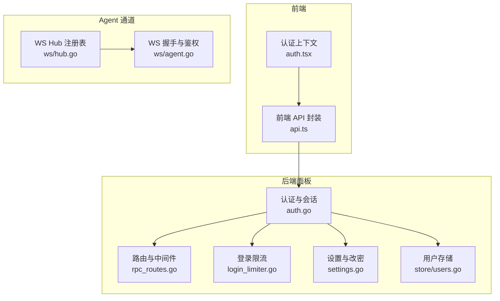
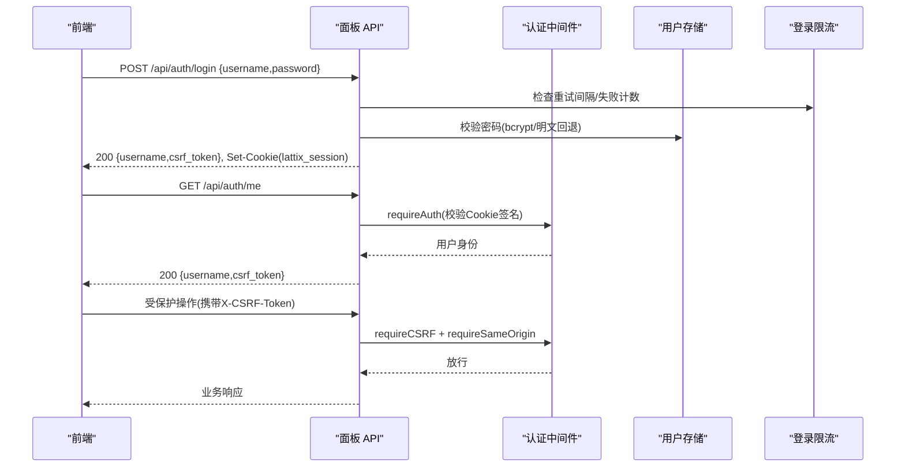
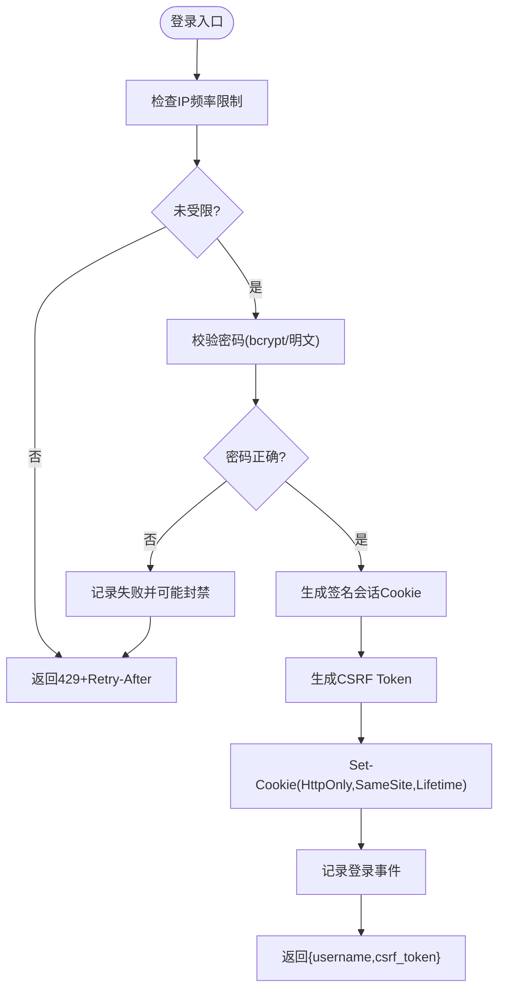
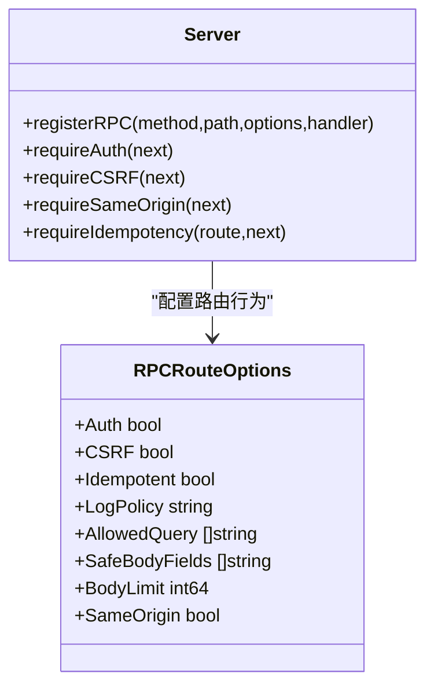
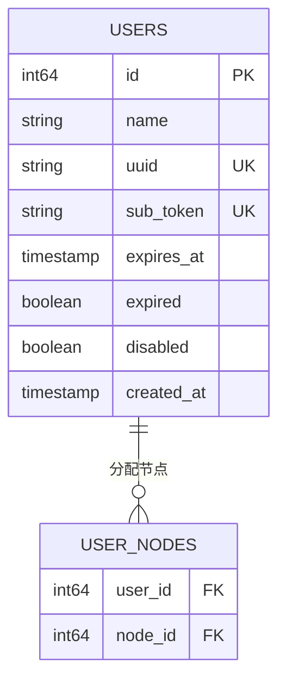
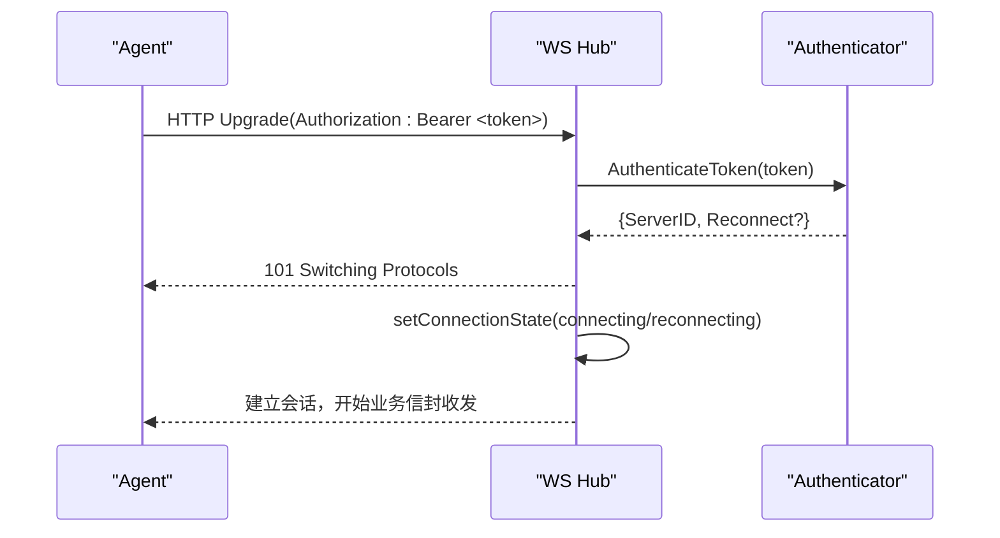
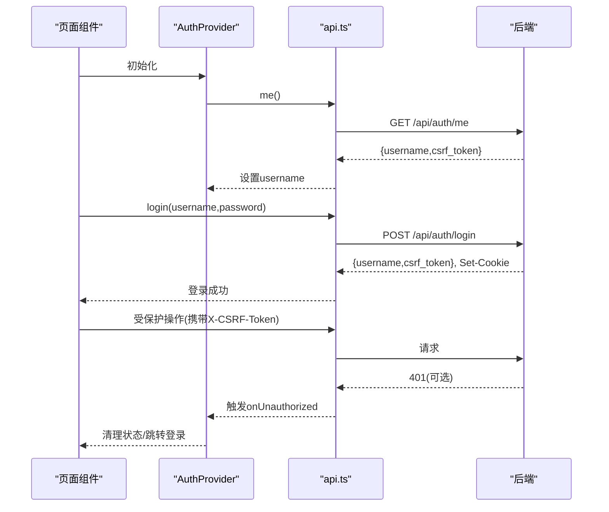
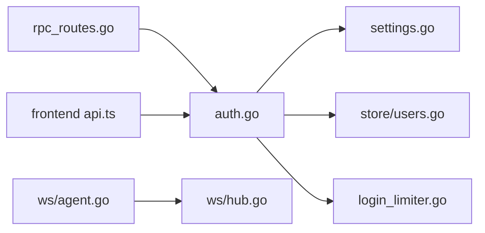

# 认证授权

<cite>
**本文引用的文件**   
- [src/backend/internal/panel/auth.go](file://src/backend/internal/panel/auth.go)
- [src/backend/internal/panel/rpc_routes.go](file://src/backend/internal/panel/rpc_routes.go)
- [src/backend/internal/panel/login_limiter.go](file://src/backend/internal/panel/login_limiter.go)
- [src/backend/internal/panel/settings.go](file://src/backend/internal/panel/settings.go)
- [src/backend/internal/store/users.go](file://src/backend/internal/store/users.go)
- [src/backend/internal/ws/hub.go](file://src/backend/internal/ws/hub.go)
- [src/backend/internal/ws/agent.go](file://src/backend/internal/ws/agent.go)
- [src/frontend/src/lib/api.ts](file://src/frontend/src/lib/api.ts)
- [src/frontend/src/lib/auth.tsx](file://src/frontend/src/lib/auth.tsx)
</cite>

## 目录
1. [简介](#简介)
2. [项目结构](#项目结构)
3. [核心组件](#核心组件)
4. [架构总览](#架构总览)
5. [详细组件分析](#详细组件分析)
6. [依赖关系分析](#依赖关系分析)
7. [性能考虑](#性能考虑)
8. [故障排查指南](#故障排查指南)
9. [结论](#结论)
10. [附录：API 参考与集成示例](#附录api-参考与集成示例)

## 简介
本文件为 Lattix-codex 项目的认证授权 API 文档，覆盖管理员认证、会话管理、CSRF 防护、权限模型与会话安全策略。重点说明登录接口、令牌（会话 Cookie）生成与校验、登出流程、前端认证状态管理与错误处理；并给出中间件使用方式、路由保护与 API 访问控制实践，以及密码加密、令牌安全与常见攻击防护建议。

## 项目结构
认证相关代码主要分布在后端面板模块与前端库中：
- 后端认证与会话：auth.go、rpc_routes.go、login_limiter.go、settings.go
- 用户数据与权限：store/users.go
- Agent 连接鉴权：ws/hub.go、ws/agent.go
- 前端认证状态与请求封装：frontend/src/lib/auth.tsx、frontend/src/lib/api.ts

图表来源
- [src/backend/internal/panel/auth.go:1-269](file://src/backend/internal/panel/auth.go#L1-L269)
- [src/backend/internal/panel/rpc_routes.go:1-308](file://src/backend/internal/panel/rpc_routes.go#L1-L308)
- [src/backend/internal/panel/login_limiter.go:1-142](file://src/backend/internal/panel/login_limiter.go#L1-L142)
- [src/backend/internal/panel/settings.go:540-619](file://src/backend/internal/panel/settings.go#L540-L619)
- [src/backend/internal/store/users.go:1-276](file://src/backend/internal/store/users.go#L1-L276)
- [src/backend/internal/ws/hub.go:25-46](file://src/backend/internal/ws/hub.go#L25-L46)
- [src/backend/internal/ws/agent.go:31-79](file://src/backend/internal/ws/agent.go#L31-L79)
- [src/frontend/src/lib/api.ts:1-294](file://src/frontend/src/lib/api.ts#L1-L294)
- [src/frontend/src/lib/auth.tsx:1-52](file://src/frontend/src/lib/auth.tsx#L1-L52)

章节来源
- [src/backend/internal/panel/auth.go:1-269](file://src/backend/internal/panel/auth.go#L1-L269)
- [src/backend/internal/panel/rpc_routes.go:1-308](file://src/backend/internal/panel/rpc_routes.go#L1-L308)
- [src/backend/internal/panel/login_limiter.go:1-142](file://src/backend/internal/panel/login_limiter.go#L1-L142)
- [src/backend/internal/panel/settings.go:540-619](file://src/backend/internal/panel/settings.go#L540-L619)
- [src/backend/internal/store/users.go:1-276](file://src/backend/internal/store/users.go#L1-L276)
- [src/backend/internal/ws/hub.go:25-46](file://src/backend/internal/ws/hub.go#L25-L46)
- [src/backend/internal/ws/agent.go:31-79](file://src/backend/internal/ws/agent.go#L31-L79)
- [src/frontend/src/lib/api.ts:1-294](file://src/frontend/src/lib/api.ts#L1-L294)
- [src/frontend/src/lib/auth.tsx:1-52](file://src/frontend/src/lib/auth.tsx#L1-L52)

## 核心组件
- 管理员认证与会话
  - 登录接口：POST /api/auth/login，返回 username 与 csrf_token，并下发会话 Cookie。
  - 会话校验：requireAuth 中间件基于签名 Cookie 校验当前用户。
  - CSRF 防护：requireCSRF 中间件校验 X-CSRF-Token 头。
  - 同源校验：requireSameOrigin 校验 Origin/Referer 与 Host 一致，HTTPS 下强制 https。
  - 登出接口：POST /api/auth/logout，清除会话 Cookie。
  - 探活接口：GET /api/auth/me，返回当前用户名与最新 csrf_token。
- 密码与密钥
  - 密码校验：优先读取数据库中的 bcrypt 哈希，否则回退到启动参数明文对比。
  - 会话密钥派生：由管理员凭证派生 HMAC 密钥，改密即所有旧会话失效。
- 登录限流与并发保护
  - 按 IP 记录失败次数与窗口，超限后阻塞一段时间。
  - bcrypt 并发限制，避免 CPU 被大量哈希占用。
- 用户与权限
  - 用户模型包含 UUID、sub_token、有效期、停权标记等。
  - 节点分配与用户关联，支持增删节点与差量扇出。
- Agent 连接鉴权
  - WS 握手通过 Authorization Bearer Token 鉴权，区分初始与重连会话。

章节来源
- [src/backend/internal/panel/auth.go:81-181](file://src/backend/internal/panel/auth.go#L81-L181)
- [src/backend/internal/panel/auth.go:197-269](file://src/backend/internal/panel/auth.go#L197-L269)
- [src/backend/internal/panel/settings.go:540-619](file://src/backend/internal/panel/settings.go#L540-L619)
- [src/backend/internal/panel/login_limiter.go:1-142](file://src/backend/internal/panel/login_limiter.go#L1-L142)
- [src/backend/internal/store/users.go:1-276](file://src/backend/internal/store/users.go#L1-L276)
- [src/backend/internal/ws/agent.go:31-79](file://src/backend/internal/ws/agent.go#L31-L79)

## 架构总览
认证授权整体流程如下：
- 前端调用 api.login 完成登录，服务端签发带签名的会话 Cookie 与 CSRF token。
- 后续受保护路由需携带有效 Cookie 并通过 requireAuth、requireCSRF、requireSameOrigin 中间件。
- 密码变更会改变会话密钥派生源，导致旧会话全部失效。
- Agent 侧通过独立的 Bearer Token 进行 WS 握手鉴权，与面板会话解耦。

图表来源
- [src/backend/internal/panel/auth.go:81-181](file://src/backend/internal/panel/auth.go#L81-L181)
- [src/backend/internal/panel/auth.go:197-269](file://src/backend/internal/panel/auth.go#L197-L269)
- [src/backend/internal/panel/rpc_routes.go:33-72](file://src/backend/internal/panel/rpc_routes.go#L33-L72)
- [src/backend/internal/panel/login_limiter.go:74-142](file://src/backend/internal/panel/login_limiter.go#L74-L142)
- [src/backend/internal/panel/settings.go:588-619](file://src/backend/internal/panel/settings.go#L588-L619)

## 详细组件分析

### 管理员认证与会话
- 登录流程
  - 输入校验与速率限制：按 IP 检查是否处于冷却期或失败过多。
  - 密码校验：优先 DB 的 bcrypt 哈希，否则回退到启动参数明文。
  - 会话签发：基于管理员凭证派生的密钥对 payload(user|exp) 做 HMAC 签名，写入 HttpOnly Cookie，同时返回 csrf_token。
  - 审计：成功/失败均记录操作日志。
- 会话校验
  - requireAuth 解析 Cookie，验证签名与过期时间，返回用户身份。
  - 更新进行中拒绝非允许路径（如 /api/panel/get-update-status 与 /api/auth/me）。
- CSRF 与同源
  - requireCSRF 校验 X-CSRF-Token 头，值由 session 与密钥派生。
  - requireSameOrigin 校验 Origin/Referer 与 Host 一致，HTTPS 下要求 https。
- 登出与会话失效
  - 登出接口清空 Cookie。
  - 修改密码会改变会话密钥派生源，旧会话自动失效。

图表来源
- [src/backend/internal/panel/auth.go:81-145](file://src/backend/internal/panel/auth.go#L81-L145)
- [src/backend/internal/panel/login_limiter.go:74-142](file://src/backend/internal/panel/login_limiter.go#L74-L142)
- [src/backend/internal/panel/settings.go:588-619](file://src/backend/internal/panel/settings.go#L588-L619)

章节来源
- [src/backend/internal/panel/auth.go:81-181](file://src/backend/internal/panel/auth.go#L81-L181)
- [src/backend/internal/panel/auth.go:197-269](file://src/backend/internal/panel/auth.go#L197-L269)
- [src/backend/internal/panel/login_limiter.go:1-142](file://src/backend/internal/panel/login_limiter.go#L1-L142)
- [src/backend/internal/panel/settings.go:540-619](file://src/backend/internal/panel/settings.go#L540-L619)

### 路由与中间件
- 路由注册
  - registerRPC 支持组合中间件：Idempotency、CSRF、Auth、SameOrigin、JSON/Query 校验。
  - 默认 JSON Body 大小限制与白名单字段注入日志属性。
- 幂等性
  - Idempotency-Key 配合请求体哈希实现重复请求去重与结果缓存。
- 查询参数校验
  - 仅允许声明的查询键，且每个键只能出现一次。

图表来源
- [src/backend/internal/panel/rpc_routes.go:33-72](file://src/backend/internal/panel/rpc_routes.go#L33-L72)
- [src/backend/internal/panel/rpc_routes.go:157-242](file://src/backend/internal/panel/rpc_routes.go#L157-L242)
- [src/backend/internal/panel/rpc_routes.go:82-123](file://src/backend/internal/panel/rpc_routes.go#L82-L123)

章节来源
- [src/backend/internal/panel/rpc_routes.go:1-308](file://src/backend/internal/panel/rpc_routes.go#L1-L308)

### 用户与权限模型
- 用户实体
  - 字段包括 id、name、uuid、sub_token、expires_at、expired、disabled、created_at。
  - expired 与 disabled 任一成立即为有效停权态。
- 节点分配
  - user_nodes 多对多映射，支持整体替换与差量计算。
  - 根据协议类型过滤无用户概念的节点（如 dokodemo）。
- 生命周期与扇出
  - 停权/恢复时向相关服务器扇出 remove_user/add_user。
  - 删除用户前统一扇出 remove_user。

图表来源
- [src/backend/internal/store/users.go:14-54](file://src/backend/internal/store/users.go#L14-L54)
- [src/backend/internal/store/users.go:194-253](file://src/backend/internal/store/users.go#L194-L253)

章节来源
- [src/backend/internal/store/users.go:1-276](file://src/backend/internal/store/users.go#L1-L276)

### Agent 连接鉴权
- WS 握手
  - 从 Authorization 头提取 Bearer Token。
  - 通过 Authenticator 校验并区分初始/重连会话。
  - 升级成功后设置消息读限制与协议版本头。
- 连接状态
  - Hub 维护连接注册表与在线状态跃迁回调。

图表来源
- [src/backend/internal/ws/agent.go:31-79](file://src/backend/internal/ws/agent.go#L31-L79)
- [src/backend/internal/ws/hub.go:25-46](file://src/backend/internal/ws/hub.go#L25-L46)

章节来源
- [src/backend/internal/ws/agent.go:31-79](file://src/backend/internal/ws/agent.go#L31-L79)
- [src/backend/internal/ws/hub.go:25-46](file://src/backend/internal/ws/hub.go#L25-L46)

### 前端认证流程
- 状态管理
  - AuthProvider 在挂载时调用 me() 探测登录态，设置 onUnauthorized 回调以清理状态。
  - login/logout 分别调用后端接口并维护本地 username。
- 请求封装
  - api.ts 暴露 login/logout/me 等方法，登录后保存 csrf_token 并在后续请求中携带。
  - 401 时触发 onUnauthorized 回调，清空 CSRF token 并重置登录态。

图表来源
- [src/frontend/src/lib/auth.tsx:14-43](file://src/frontend/src/lib/auth.tsx#L14-L43)
- [src/frontend/src/lib/api.ts:58-73](file://src/frontend/src/lib/api.ts#L58-L73)

章节来源
- [src/frontend/src/lib/auth.tsx:1-52](file://src/frontend/src/lib/auth.tsx#L1-L52)
- [src/frontend/src/lib/api.ts:1-294](file://src/frontend/src/lib/api.ts#L1-L294)

## 依赖关系分析
- 组件耦合
  - auth.go 依赖 settings.go 的密码校验与哈希生成，依赖 store/users.go 的用户数据。
  - rpc_routes.go 提供通用中间件链，auth.go 在其上叠加认证与 CSRF。
  - login_limiter.go 提供登录限流与 bcrypt 并发槽。
  - ws/agent.go 与 ws/hub.go 独立于面板会话，使用 Bearer Token 鉴权。
- 外部依赖
  - 数据库用于持久化用户与设置。
  - 浏览器 Cookie 与 Header 用于会话与 CSRF 传递。

图表来源
- [src/backend/internal/panel/auth.go:1-269](file://src/backend/internal/panel/auth.go#L1-L269)
- [src/backend/internal/panel/rpc_routes.go:1-308](file://src/backend/internal/panel/rpc_routes.go#L1-L308)
- [src/backend/internal/panel/login_limiter.go:1-142](file://src/backend/internal/panel/login_limiter.go#L1-L142)
- [src/backend/internal/panel/settings.go:540-619](file://src/backend/internal/panel/settings.go#L540-L619)
- [src/backend/internal/store/users.go:1-276](file://src/backend/internal/store/users.go#L1-L276)
- [src/backend/internal/ws/agent.go:31-79](file://src/backend/internal/ws/agent.go#L31-L79)
- [src/backend/internal/ws/hub.go:25-46](file://src/backend/internal/ws/hub.go#L25-L46)
- [src/frontend/src/lib/api.ts:1-294](file://src/frontend/src/lib/api.ts#L1-L294)

章节来源
- [src/backend/internal/panel/auth.go:1-269](file://src/backend/internal/panel/auth.go#L1-L269)
- [src/backend/internal/panel/rpc_routes.go:1-308](file://src/backend/internal/panel/rpc_routes.go#L1-L308)
- [src/backend/internal/panel/login_limiter.go:1-142](file://src/backend/internal/panel/login_limiter.go#L1-L142)
- [src/backend/internal/panel/settings.go:540-619](file://src/backend/internal/panel/settings.go#L540-L619)
- [src/backend/internal/store/users.go:1-276](file://src/backend/internal/store/users.go#L1-L276)
- [src/backend/internal/ws/agent.go:31-79](file://src/backend/internal/ws/agent.go#L31-L79)
- [src/backend/internal/ws/hub.go:25-46](file://src/backend/internal/ws/hub.go#L25-L46)
- [src/frontend/src/lib/api.ts:1-294](file://src/frontend/src/lib/api.ts#L1-L294)

## 性能考虑
- 登录限流与 bcrypt 并发
  - 通过失败计数与窗口控制暴力破解风险，避免频繁哈希运算。
  - bcrypt 并发槽限制防止 CPU 饱和。
- 会话校验开销
  - 每次请求进行 HMAC 校验与过期判断，复杂度 O(1)，开销低。
- 幂等性与缓存
  - Idempotency-Key 减少重复请求对后端压力，但需权衡存储成本。
- 前端轮询与节流
  - 建议对敏感操作进行防抖与节流，避免高频请求。

[本节为通用指导，不直接分析具体文件]

## 故障排查指南
- 登录失败
  - 检查 IP 是否被限流（429），查看 Retry-After 头。
  - 确认密码是否正确，注意 DB 哈希与启动参数优先级。
- 会话无效
  - 检查 Cookie 是否存在且未过期，确保 SameSite 与 Secure 设置符合部署环境。
  - 若修改过密码，旧会话将失效，需重新登录。
- CSRF 错误
  - 确保请求头 X-CSRF-Token 存在且与后端计算的期望值一致。
  - 首次登录后需保存 csrf_token，后续请求携带。
- 同源校验失败
  - 检查 Origin/Referer 与 Host 一致，HTTPS 环境下必须 https。
- Agent 连接失败
  - 检查 Authorization 头是否包含有效的 Bearer Token。
  - 查看 Hub 的连接状态与错误回调。

章节来源
- [src/backend/internal/panel/login_limiter.go:74-142](file://src/backend/internal/panel/login_limiter.go#L74-L142)
- [src/backend/internal/panel/auth.go:197-269](file://src/backend/internal/panel/auth.go#L197-L269)
- [src/backend/internal/panel/settings.go:540-619](file://src/backend/internal/panel/settings.go#L540-L619)
- [src/backend/internal/ws/agent.go:31-79](file://src/backend/internal/ws/agent.go#L31-L79)

## 结论
本项目采用基于签名 Cookie 的会话机制与严格的中间件链（Auth、CSRF、SameOrigin）保障面板认证安全。密码采用 bcrypt 哈希并支持回退至启动参数，改密即全局会话失效。用户权限通过用户实体与节点分配实现，停权与恢复通过扇出命令同步至各节点。Agent 侧使用独立的 Bearer Token 鉴权，与面板会话解耦。前端通过统一的 API 封装与上下文管理简化认证流程。建议在部署时启用 HTTPS、合理配置 SameSite/Secure，并结合限流与审计提升安全性。

[本节为总结，不直接分析具体文件]

## 附录：API 参考与集成示例

### 管理员认证 API
- POST /api/auth/login
  - 请求体：{username, password}
  - 响应：{username, csrf_token}
  - 行为：校验密码、签发会话 Cookie、返回 csrf_token
- POST /api/auth/logout
  - 请求体：{}
  - 响应：空
  - 行为：清除会话 Cookie
- GET /api/auth/me
  - 响应：{username, csrf_token}
  - 行为：校验会话并返回最新 csrf_token

章节来源
- [src/backend/internal/panel/auth.go:81-181](file://src/backend/internal/panel/auth.go#L81-L181)
- [src/frontend/src/lib/api.ts:58-73](file://src/frontend/src/lib/api.ts#L58-L73)

### 中间件与路由保护
- requireAuth：校验会话 Cookie，未登录返回 401。
- requireCSRF：校验 X-CSRF-Token，无效返回 401。
- requireSameOrigin：校验来源域名，不一致返回 401。
- requireIdempotency：幂等性保护，需 Idempotency-Key。

章节来源
- [src/backend/internal/panel/rpc_routes.go:33-72](file://src/backend/internal/panel/rpc_routes.go#L33-L72)
- [src/backend/internal/panel/rpc_routes.go:157-242](file://src/backend/internal/panel/rpc_routes.go#L157-L242)

### 用户与权限 API
- GET /api/user/list
- POST /api/user/create
- PATCH /api/user/update
- POST /api/user/set-nodes
- POST /api/user/delete

章节来源
- [src/backend/internal/store/users.go:1-276](file://src/backend/internal/store/users.go#L1-L276)

### 前端集成要点
- 登录后保存 csrf_token，并在后续请求中设置 X-CSRF-Token。
- 监听 401 响应，触发 onUnauthorized 回调清理状态并重定向登录。
- 使用 AuthProvider 管理登录态，避免手动维护 Cookie。

章节来源
- [src/frontend/src/lib/auth.tsx:14-43](file://src/frontend/src/lib/auth.tsx#L14-L43)
- [src/frontend/src/lib/api.ts:38-47](file://src/frontend/src/lib/api.ts#L38-L47)

### 安全最佳实践
- 密码加密：使用 bcrypt 哈希，禁止明文存储。
- 令牌安全：HttpOnly、Secure、SameSite=Lax，HTTPS 下强制 Secure。
- 防暴力破解：登录限流与失败计数，必要时临时封禁。
- 防 CSRF：严格校验 X-CSRF-Token 与来源域名。
- 防重放：幂等性 Key 与请求体哈希校验。
- 最小权限：仅开放必要路由，敏感操作加审计。

[本节为通用指导，不直接分析具体文件]