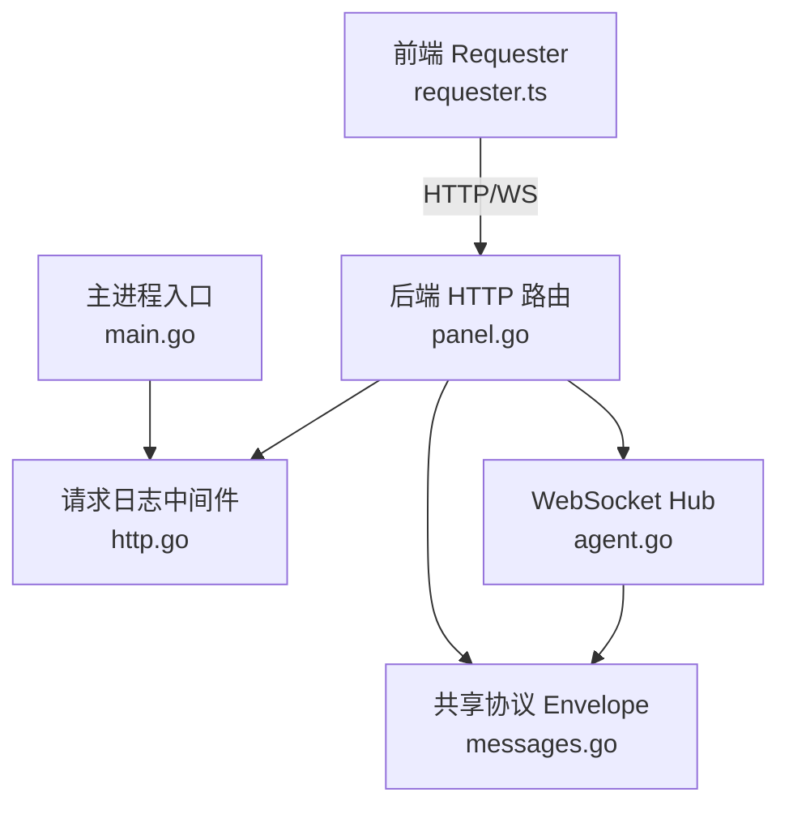
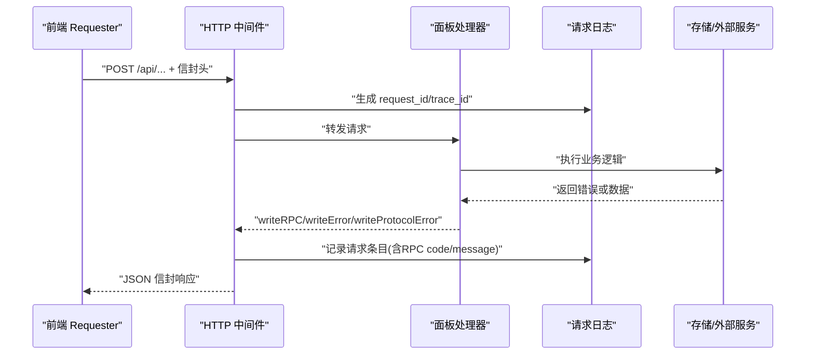
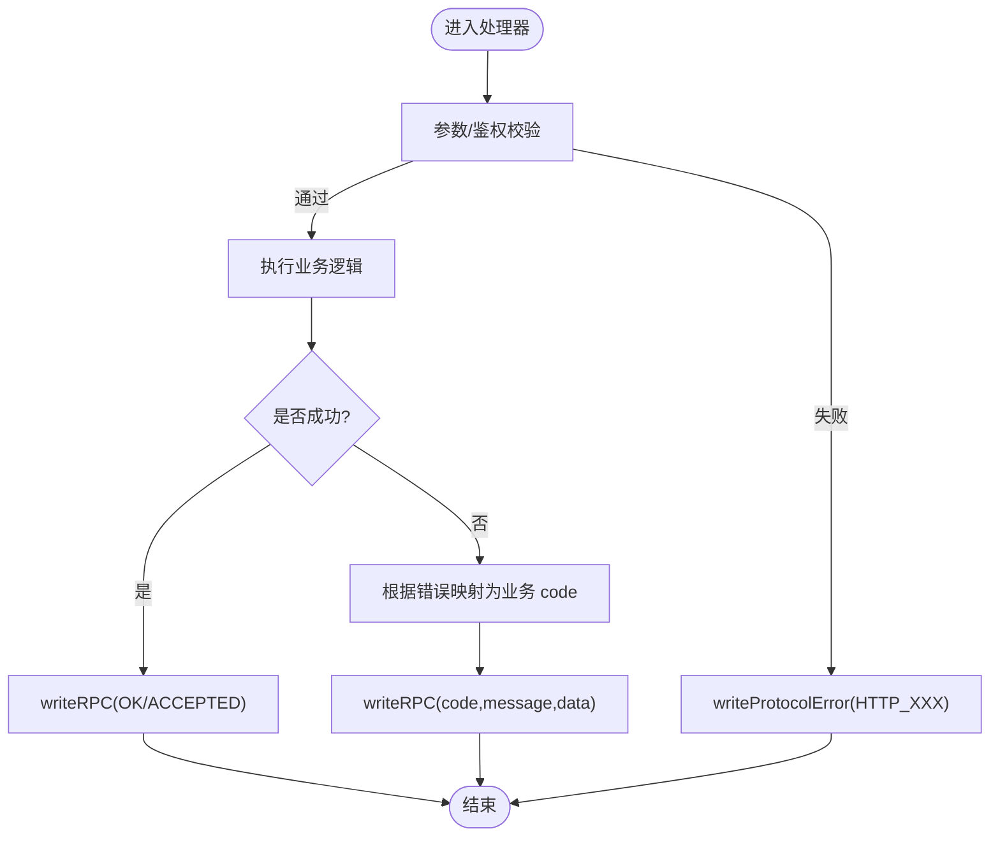
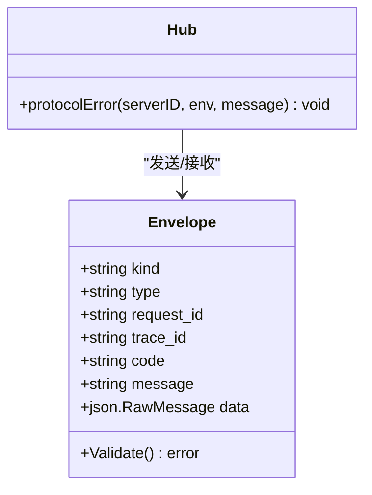
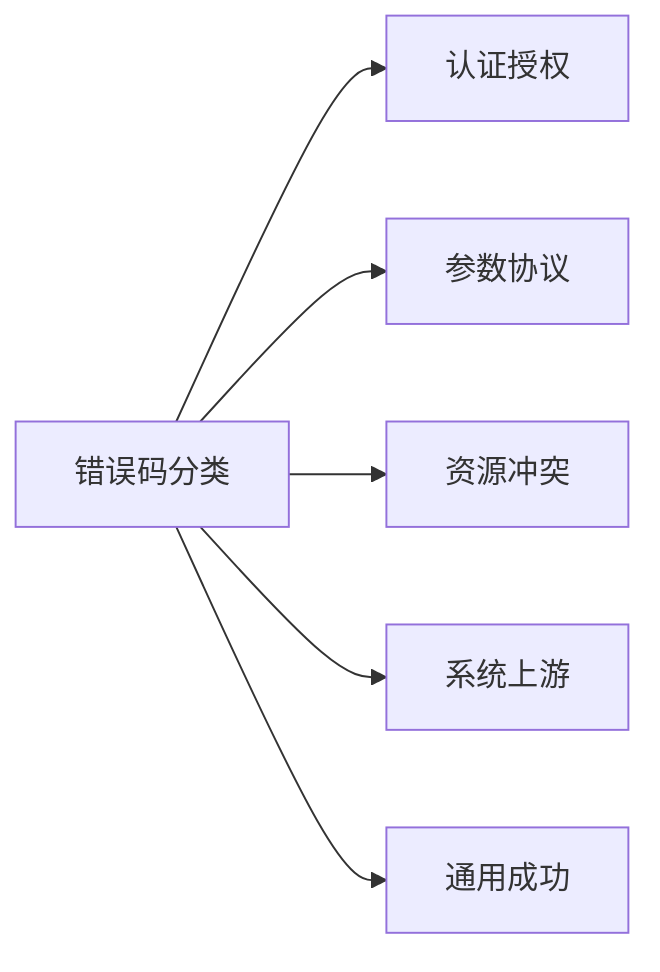
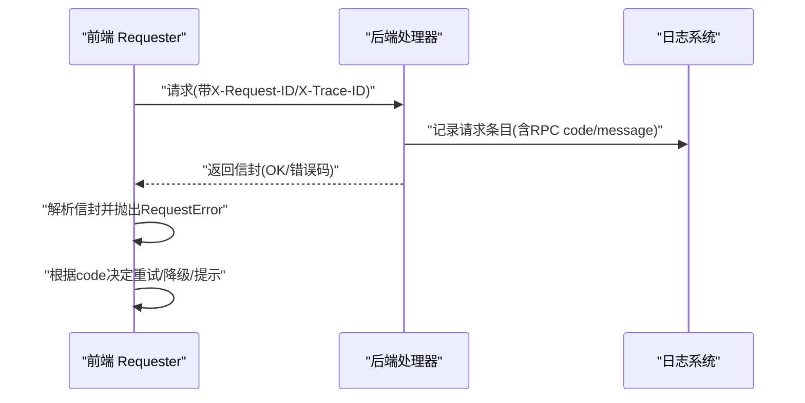
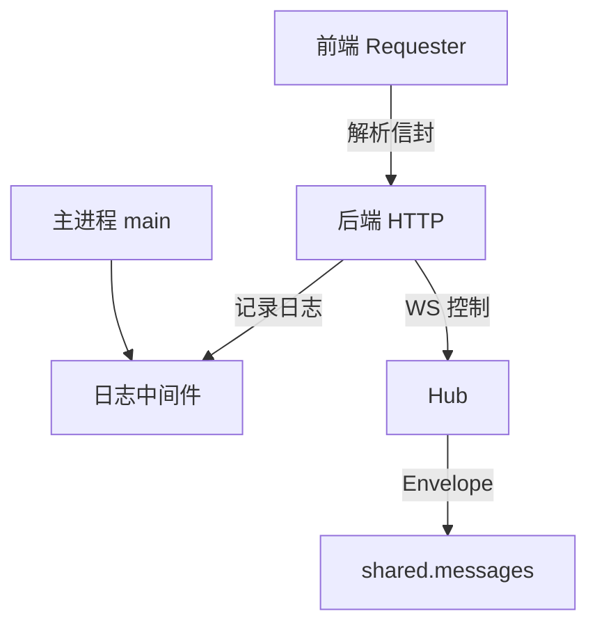

# 错误处理

<cite>
**本文引用的文件**
- [src/backend/internal/panel/panel.go](file://src/backend/internal/panel/panel.go)
- [src/backend/internal/logging/http.go](file://src/backend/internal/logging/http.go)
- [src/shared/messages.go](file://src/shared/messages.go)
- [src/backend/internal/panel/auth.go](file://src/backend/internal/panel/auth.go)
- [src/backend/internal/ws/agent.go](file://src/backend/internal/ws/agent.go)
- [src/backend/cmd/backend/main.go](file://src/backend/cmd/backend/main.go)
- [src/frontend/src/lib/requester.ts](file://src/frontend/src/lib/requester.ts)
- [src/frontend/src/pages/Chains.tsx](file://src/frontend/src/pages/Chains.tsx)
</cite>

## 目录
1. [简介](#简介)
2. [项目结构](#项目结构)
3. [核心组件](#核心组件)
4. [架构总览](#架构总览)
5. [详细组件分析](#详细组件分析)
6. [依赖关系分析](#依赖关系分析)
7. [性能考虑](#性能考虑)
8. [故障排查指南](#故障排查指南)
9. [结论](#结论)
10. [附录](#附录)

## 简介
本文件为 Lattix-codex 项目的统一错误处理规范与实现指南，覆盖后端 HTTP API、WebSocket 控制通道、前端请求库以及日志与监控。文档明确统一的错误响应格式、错误码命名与分类体系、常见错误类型（参数校验失败、权限不足、资源不存在、内部错误等）、错误捕获与记录模式、客户端重试与降级策略，并提供调试技巧与告警配置建议。

## 项目结构
错误处理贯穿以下关键位置：
- 后端 HTTP 层：统一 RPC 信封响应、HTTP 协议错误封装、状态码到业务错误码映射、请求日志与追踪 ID 注入。
- 后端 WebSocket 层：控制通道信封 Envelope、严格解析与校验、协议级错误上报。
- 前端请求层：统一解析服务端信封、区分业务/传输/协议错误、自动重试与取消、未授权回调。
- 日志与监控：请求级别日志、操作日志、WebSocket RPC 日志、严重级别判定。

**图表来源**
- [src/frontend/src/lib/requester.ts:157-220](file://src/frontend/src/lib/requester.ts#L157-L220)
- [src/backend/internal/panel/panel.go:325-391](file://src/backend/internal/panel/panel.go#L325-L391)
- [src/backend/internal/logging/http.go:43-82](file://src/backend/internal/logging/http.go#L43-L82)
- [src/backend/internal/ws/agent.go:287-332](file://src/backend/internal/ws/agent.go#L287-L332)
- [src/shared/messages.go:13-22](file://src/shared/messages.go#L13-L22)
- [src/backend/cmd/backend/main.go:479-527](file://src/backend/cmd/backend/main.go#L479-L527)

**章节来源**
- [src/backend/internal/panel/panel.go:325-391](file://src/backend/internal/panel/panel.go#L325-L391)
- [src/backend/internal/logging/http.go:43-82](file://src/backend/internal/logging/http.go#L43-L82)
- [src/shared/messages.go:13-22](file://src/shared/messages.go#L13-L22)
- [src/backend/internal/ws/agent.go:287-332](file://src/backend/internal/ws/agent.go#L287-L332)
- [src/backend/cmd/backend/main.go:479-527](file://src/backend/cmd/backend/main.go#L479-L527)
- [src/frontend/src/lib/requester.ts:157-220](file://src/frontend/src/lib/requester.ts#L157-L220)

## 核心组件
- 统一 RPC 信封（HTTP）
  - 响应体包含 code、message、data、request_id、trace_id；成功时 code 为 OK 或 ACCEPTED。
  - 非 JSON 或协议不合法时返回 application/problem+json 的 HTTP 协议错误。
- 统一 RPC 信封（WebSocket）
  - Envelope 包含 kind、type、request_id、trace_id、code、message、data；响应必须携带 code 与 message。
- 日志与追踪
  - 请求中间件注入 X-Request-ID/X-Trace-ID，记录请求/响应摘要、RPC 结果码、严重级别。
  - WebSocket RPC 完成时记录一条请求条目。
- 前端请求器
  - 解析信封并抛出结构化错误，区分 business/transport/protocol/cancelled。
  - 对网络错误自动重试，支持超时与取消信号，未授权触发回调。

**章节来源**
- [src/backend/internal/panel/panel.go:325-391](file://src/backend/internal/panel/panel.go#L325-L391)
- [src/shared/messages.go:13-22](file://src/shared/messages.go#L13-L22)
- [src/backend/internal/logging/http.go:43-82](file://src/backend/internal/logging/http.go#L43-L82)
- [src/frontend/src/lib/requester.ts:227-299](file://src/frontend/src/lib/requester.ts#L227-L299)

## 架构总览
下图展示一次典型 HTTP 请求的错误处理流程：前端发起请求，后端中间件注入追踪信息，处理器返回统一信封或协议错误，日志中间件记录请求详情与严重级别。

**图表来源**
- [src/backend/internal/logging/http.go:43-82](file://src/backend/internal/logging/http.go#L43-L82)
- [src/backend/internal/panel/panel.go:325-391](file://src/backend/internal/panel/panel.go#L325-L391)
- [src/frontend/src/lib/requester.ts:157-220](file://src/frontend/src/lib/requester.ts#L157-L220)

## 详细组件分析

### 统一错误响应格式（HTTP）
- 成功响应
  - 字段：code、message、data、request_id、trace_id
  - code 取值：OK、ACCEPTED
- 业务错误
  - 使用 writeRPC(code, message, data)，HTTP 状态码固定为 200，由 code 表达语义
- 协议错误
  - 使用 writeProtocolError(status, message)，Content-Type 为 application/problem+json，code 形如 HTTP_XXX
- 状态码到错误码映射
  - 401→AUTH_REQUIRED，403→AUTH_INVALID_CREDENTIALS，404→NOT_FOUND，409→CONFLICT，423→OPERATION_LOCKED，502→UPSTREAM_ERROR，503→SERVICE_UNAVAILABLE，500→INTERNAL_ERROR，其他→INVALID_ARGUMENT

**图表来源**
- [src/backend/internal/panel/panel.go:325-391](file://src/backend/internal/panel/panel.go#L325-L391)
- [src/backend/internal/panel/panel.go:398-419](file://src/backend/internal/panel/panel.go#L398-L419)

**章节来源**
- [src/backend/internal/panel/panel.go:325-391](file://src/backend/internal/panel/panel.go#L325-L391)
- [src/backend/internal/panel/panel.go:398-419](file://src/backend/internal/panel/panel.go#L398-L419)

### 统一错误响应格式（WebSocket）
- 信封 Envelope
  - 字段：kind、type、request_id、trace_id、code、message、data
  - 响应必须包含 code 与 message；请求/事件不得包含
- 严格解析
  - 仅允许文本帧、禁止未知字段、强制 JSON 有效、校验 request_id/trace_id 格式
- 协议错误上报
  - Hub.protocolError 将 serverID、requestID、traceID、type、message 上抛给上层处理

**图表来源**
- [src/shared/messages.go:13-22](file://src/shared/messages.go#L13-L22)
- [src/shared/messages.go:112-137](file://src/shared/messages.go#L112-L137)
- [src/backend/internal/ws/agent.go:287-332](file://src/backend/internal/ws/agent.go#L287-L332)

**章节来源**
- [src/shared/messages.go:13-22](file://src/shared/messages.go#L13-L22)
- [src/shared/messages.go:112-137](file://src/shared/messages.go#L112-L137)
- [src/backend/internal/ws/agent.go:287-332](file://src/backend/internal/ws/agent.go#L287-L332)

### 错误码命名规范与分类体系
- 命名规范
  - 全大写英文单词，下划线分隔，语义清晰，避免缩写歧义
- 分类体系
  - 认证与授权：AUTH_REQUIRED、AUTH_INVALID_CREDENTIALS
  - 参数与协议：INVALID_ARGUMENT
  - 资源与冲突：NOT_FOUND、CONFLICT、OPERATION_LOCKED
  - 能力与动作：UNSUPPORTED_ACTION
  - 系统与上游：INTERNAL_ERROR、UPSTREAM_ERROR、SERVICE_UNAVAILABLE、SERVER_OFFLINE、PORT_OUT_OF_RANGE、UPDATE_IN_PROGRESS
  - 通用成功：OK、ACCEPTED

**图表来源**
- [src/shared/messages.go:54-70](file://src/shared/messages.go#L54-L70)

**章节来源**
- [src/shared/messages.go:54-70](file://src/shared/messages.go#L54-L70)

### 常见错误类型与处理模式
- 参数验证错误
  - 使用 writeProtocolError(HTTP_400) 或 writeRPC(INVALID_ARGUMENT)
  - 示例路径：服务器创建/更新时的参数校验失败
- 权限不足
  - 未登录或会话过期：AUTH_REQUIRED；CSRF 无效：AUTH_REQUIRED；来源校验失败：AUTH_REQUIRED
  - 示例路径：鉴权中间件 requireAuth/requireCSRF/requireSameOrigin
- 资源不存在
  - NOT_FOUND；示例路径：按 ID 查询资源失败且为缺失
- 内部错误
  - INTERNAL_ERROR；示例路径：数据库/存储/序列化异常
- 上游/服务不可用
  - UPSTREAM_ERROR/SERVICE_UNAVAILABLE；示例路径：第三方调用失败或服务重启中

**章节来源**
- [src/backend/internal/panel/auth.go:164-213](file://src/backend/internal/panel/auth.go#L164-L213)
- [src/backend/internal/panel/auth.go:229-249](file://src/backend/internal/panel/auth.go#L229-L249)
- [src/backend/internal/panel/panel.go:398-419](file://src/backend/internal/panel/panel.go#L398-L419)

### 错误捕获、日志记录与用户友好提示
- 后端
  - 请求中间件记录请求/响应摘要、RPC 结果码、严重级别；panic 恢复后记录错误
  - WebSocket RPC 完成后记录条目；协议错误通过 OnProtocolError 上报
  - 主进程启动失败/服务错误记录操作日志
- 前端
  - Requester 统一包装错误为 RequestError，区分 kind 与 code
  - 未授权触发回调，可跳转登录页或刷新会话
  - 网络错误自动重试（最多 N 次），支持超时与取消

**图表来源**
- [src/backend/internal/logging/http.go:43-82](file://src/backend/internal/logging/http.go#L43-L82)
- [src/backend/internal/logging/http.go:154-164](file://src/backend/internal/logging/http.go#L154-L164)
- [src/backend/cmd/backend/main.go:515-527](file://src/backend/cmd/backend/main.go#L515-L527)
- [src/frontend/src/lib/requester.ts:157-220](file://src/frontend/src/lib/requester.ts#L157-L220)

**章节来源**
- [src/backend/internal/logging/http.go:43-82](file://src/backend/internal/logging/http.go#L43-L82)
- [src/backend/internal/logging/http.go:154-164](file://src/backend/internal/logging/http.go#L154-L164)
- [src/backend/cmd/backend/main.go:515-527](file://src/backend/cmd/backend/main.go#L515-L527)
- [src/frontend/src/lib/requester.ts:157-220](file://src/frontend/src/lib/requester.ts#L157-L220)

### 客户端错误处理最佳实践
- 重试机制
  - 仅对幂等 GET 或带 Idempotency-Key 的 POST 进行有限次数重试
  - 针对 transport 错误（网络不可达）重试，business/protocol 错误不重试
- 降级处理
  - AUTH_REQUIRED 时触发未授权回调（跳转登录/刷新会话）
  - SERVICE_UNAVAILABLE/UPSTREAM_ERROR 显示“稍后再试”并延迟轮询
- 用户体验优化
  - 提供友好的中文消息（来自 envelope.message），隐藏技术细节
  - 在长耗时操作中显示进度/取消按钮，支持 AbortSignal 取消

**章节来源**
- [src/frontend/src/lib/requester.ts:157-220](file://src/frontend/src/lib/requester.ts#L157-L220)
- [src/frontend/src/pages/Chains.tsx:710-763](file://src/frontend/src/pages/Chains.tsx#L710-L763)

### 常见错误场景的处理示例与调试技巧
- 参数校验失败
  - 现象：HTTP_400 或 INVALID_ARGUMENT
  - 处理：检查请求体字段与约束，查看日志中的 ErrorSummary
- 权限不足
  - 现象：AUTH_REQUIRED/AUTH_INVALID_CREDENTIALS
  - 处理：确认 Cookie/CSRF Token/Origin 正确；必要时重新登录
- 资源不存在
  - 现象：NOT_FOUND
  - 处理：核对 ID 是否存在于后端存储
- 内部错误
  - 现象：INTERNAL_ERROR
  - 处理：查看后端日志与操作日志，定位堆栈与上下文
- 调试技巧
  - 使用 request_id/trace_id 关联前后端日志
  - 开启请求日志 full/failures_only/none 策略
  - 观察 WebSocket 握手与 RPC 条目

**章节来源**
- [src/backend/internal/logging/http.go:107-152](file://src/backend/internal/logging/http.go#L107-L152)
- [src/backend/internal/logging/http.go:166-183](file://src/backend/internal/logging/http.go#L166-L183)
- [src/backend/internal/ws/agent.go:287-332](file://src/backend/internal/ws/agent.go#L287-L332)

## 依赖关系分析
- 前端 Requester 依赖后端统一信封格式与错误码定义
- 后端 HTTP 处理器依赖日志中间件注入追踪信息与记录
- WebSocket Hub 依赖 shared.Envelope 进行严格解析与校验
- 主进程负责全局错误记录与生命周期同步

**图表来源**
- [src/frontend/src/lib/requester.ts:227-299](file://src/frontend/src/lib/requester.ts#L227-L299)
- [src/backend/internal/logging/http.go:43-82](file://src/backend/internal/logging/http.go#L43-L82)
- [src/backend/internal/ws/agent.go:287-332](file://src/backend/internal/ws/agent.go#L287-L332)
- [src/shared/messages.go:13-22](file://src/shared/messages.go#L13-L22)
- [src/backend/cmd/backend/main.go:479-527](file://src/backend/cmd/backend/main.go#L479-L527)

**章节来源**
- [src/frontend/src/lib/requester.ts:227-299](file://src/frontend/src/lib/requester.ts#L227-L299)
- [src/backend/internal/logging/http.go:43-82](file://src/backend/internal/logging/http.go#L43-L82)
- [src/backend/internal/ws/agent.go:287-332](file://src/backend/internal/ws/agent.go#L287-L332)
- [src/shared/messages.go:13-22](file://src/shared/messages.go#L13-L22)
- [src/backend/cmd/backend/main.go:479-527](file://src/backend/cmd/backend/main.go#L479-L527)

## 性能考虑
- 日志裁剪
  - 限制响应体捕获长度、参数大小与敏感字段脱敏，避免大对象写入
- 严重级别判定
  - 基于 status/rpcCode/duration/panic 动态设置 Severity，减少低价值日志
- 重试与超时
  - 前端默认超时与最大重试次数，避免雪崩；GET 优先重试
- WebSocket 高频事件
  - 通过 LogPolicy 在进入前过滤，降低写入压力

[本节为通用指导，无需特定文件引用]

## 故障排查指南
- 快速定位
  - 从前端 RequestError 获取 request_id/traceId，在后端日志中检索
- 常见问题
  - 参数错误：检查请求体结构与约束
  - 鉴权失败：确认 Cookie/CSRF/Origin 与登录态
  - 资源缺失：核对 ID 与存储一致性
  - 内部错误：查看操作日志与堆栈
- 日志策略
  - 按需切换 LogFull/LogFailuresOnly/LogNone
  - 关注 ErrorSummary 与 RPCCode

**章节来源**
- [src/backend/internal/logging/http.go:107-152](file://src/backend/internal/logging/http.go#L107-L152)
- [src/backend/internal/logging/http.go:166-183](file://src/backend/internal/logging/http.go#L166-L183)
- [src/backend/cmd/backend/main.go:515-527](file://src/backend/cmd/backend/main.go#L515-L527)

## 结论
本项目采用统一的信封式错误响应与严格的协议校验，结合完善的日志与追踪机制，实现了端到端的错误可观测性与一致的客户端体验。通过明确的错误码分类与命名规范，配合前端的重试、降级与用户友好提示，能够有效提升系统的稳定性与可维护性。

[本节为总结，无需特定文件引用]

## 附录

### 错误码清单与含义
- OK：成功
- ACCEPTED：已接受（异步处理）
- AUTH_REQUIRED：需要认证
- AUTH_INVALID_CREDENTIALS：凭证无效
- INVALID_ARGUMENT：参数非法
- NOT_FOUND：资源不存在
- CONFLICT：冲突
- OPERATION_LOCKED：操作被锁定
- UNSUPPORTED_ACTION：不支持的动作
- INTERNAL_ERROR：内部错误
- UPSTREAM_ERROR：上游错误
- SERVICE_UNAVAILABLE：服务不可用
- SERVER_OFFLINE：服务器离线
- PORT_OUT_OF_RANGE：端口越界
- UPDATE_IN_PROGRESS：更新进行中

**章节来源**
- [src/shared/messages.go:54-70](file://src/shared/messages.go#L54-L70)

### 前端错误类型与处理建议
- business：业务错误，依据 code 提示用户或执行特定流程
- transport：网络错误，可重试（限次数）
- protocol：协议错误，不应重试，提示用户或回退
- cancelled：取消/超时，静默处理或提示

**章节来源**
- [src/frontend/src/lib/requester.ts:10-41](file://src/frontend/src/lib/requester.ts#L10-L41)
- [src/frontend/src/lib/requester.ts:290-319](file://src/frontend/src/lib/requester.ts#L290-L319)