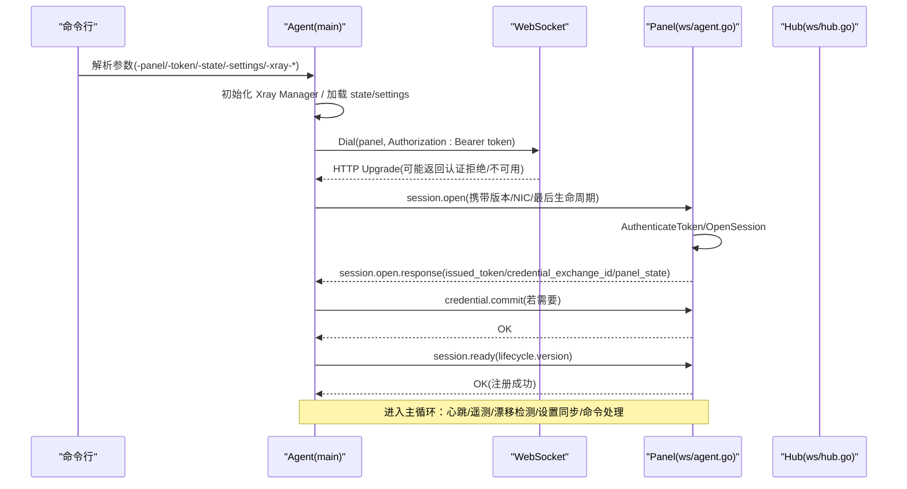
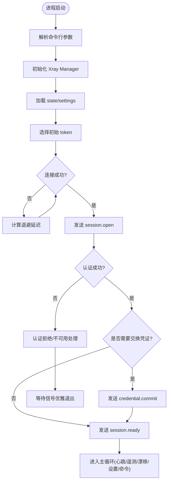
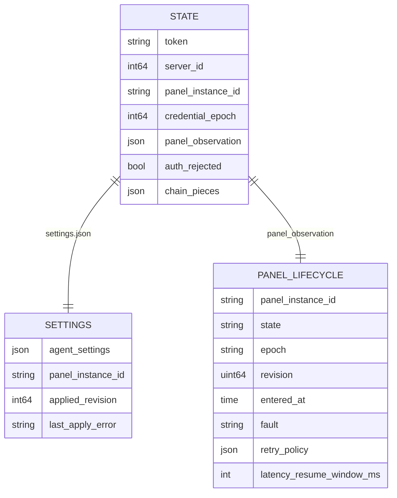
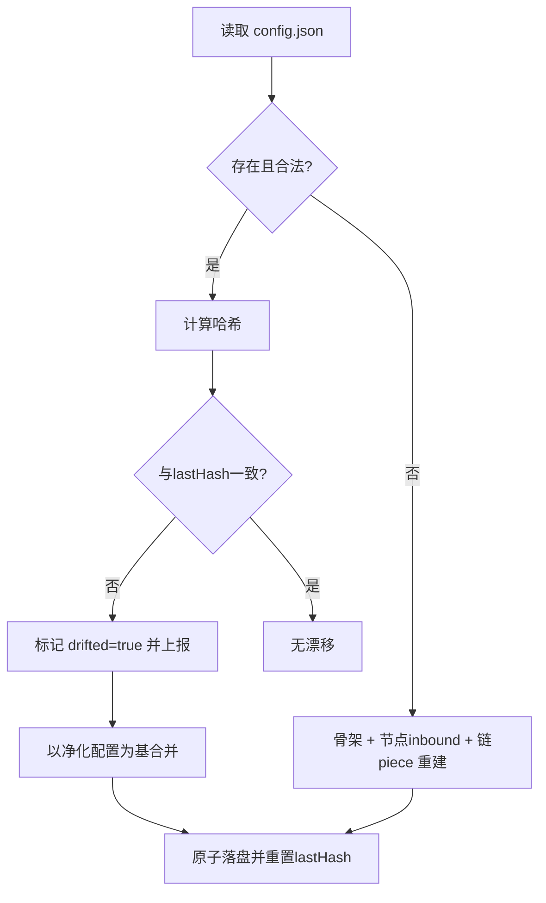
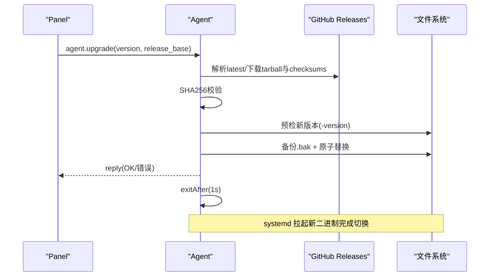
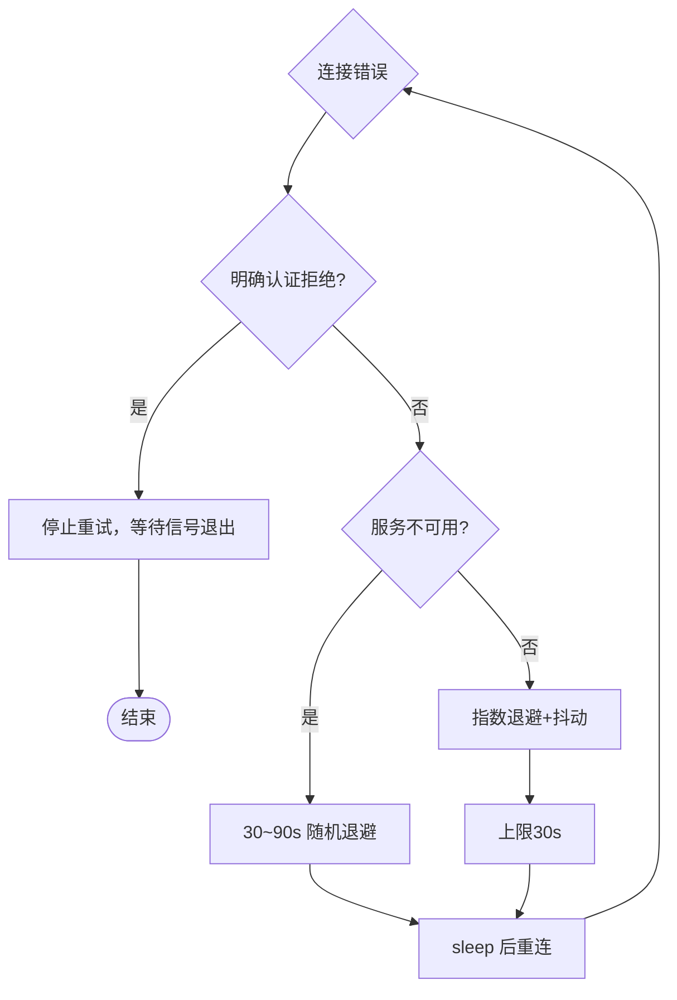
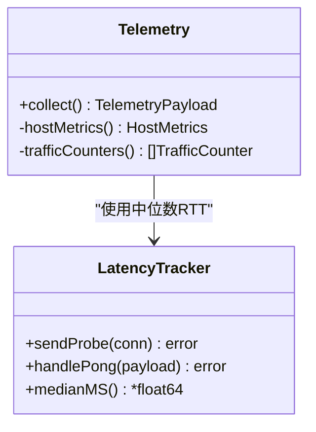
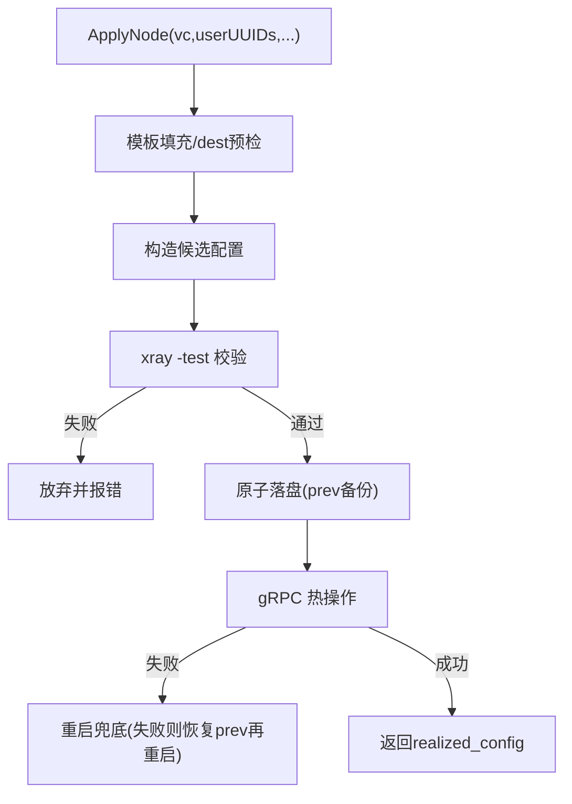
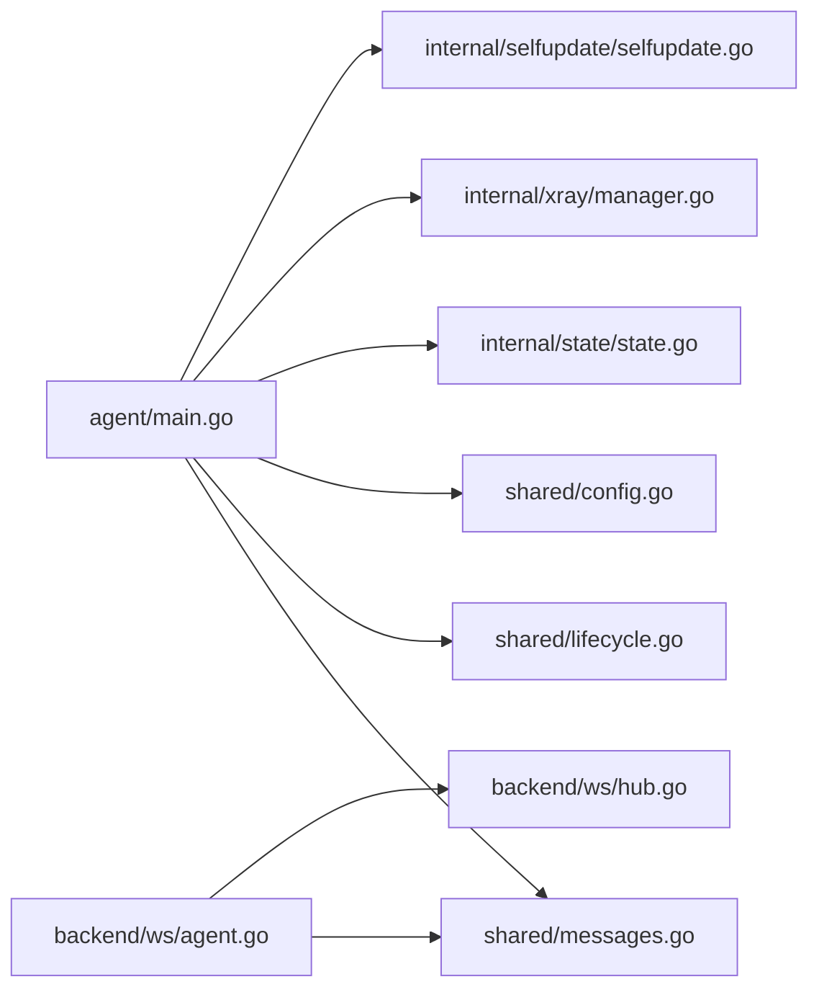

# Agent 架构设计

<cite>
**本文引用的文件**   
- [src/agent/cmd/agent/main.go](file://src/agent/cmd/agent/main.go)
- [src/agent/cmd/agent/runtime_settings.go](file://src/agent/cmd/agent/runtime_settings.go)
- [src/agent/cmd/agent/panel_state.go](file://src/agent/cmd/agent/panel_state.go)
- [src/agent/cmd/agent/telemetry.go](file://src/agent/cmd/agent/telemetry.go)
- [src/agent/cmd/agent/latency.go](file://src/agent/cmd/agent/latency.go)
- [src/agent/cmd/agent/uninstall.go](file://src/agent/cmd/agent/uninstall.go)
- [src/agent/internal/selfupdate/selfupdate.go](file://src/agent/internal/selfupdate/selfupdate.go)
- [src/agent/internal/state/state.go](file://src/agent/internal/state/state.go)
- [src/agent/internal/xray/manager.go](file://src/agent/internal/xray/manager.go)
- [src/backend/internal/ws/agent.go](file://src/backend/internal/ws/agent.go)
- [src/backend/internal/ws/hub.go](file://src/backend/internal/ws/hub.go)
- [src/shared/messages.go](file://src/shared/messages.go)
- [src/shared/lifecycle.go](file://src/shared/lifecycle.go)
- [src/shared/config.go](file://src/shared/config.go)
</cite>

## 目录
1. [简介](#简介)
2. [项目结构](#项目结构)
3. [核心组件](#核心组件)
4. [架构总览](#架构总览)
5. [详细组件分析](#详细组件分析)
6. [依赖关系分析](#依赖关系分析)
7. [性能考量](#性能考量)
8. [故障排查指南](#故障排查指南)
9. [结论](#结论)
10. [附录](#附录)

## 简介
本文件面向 Lattix-codex Agent 程序的架构设计与实现细节，重点覆盖：
- 主程序启动流程、命令行参数解析与初始化顺序
- WebSocket 连接管理（建立、认证、心跳、重连）
- 状态管理机制（本地持久化、面板生命周期同步、配置漂移检测）
- 自更新机制（版本检查、下载校验、原子替换）
- 错误处理与恢复策略（认证失败、连接异常、优雅关闭）
- 架构图与时序图，帮助开发者理解整体思路与关键流程

## 项目结构
Agent 位于 src/agent，后端 WS 端点位于 src/backend/internal/ws，协议与共享类型在 src/shared。Agent 以独立二进制运行，通过一条 WebSocket 长连接承担全部双向通信。

```mermaid
graph TB
subgraph "Agent"
A_main["main.go<br/>启动/WS循环/命令分发"]
A_runtime["runtime_settings.go<br/>运行时设置/退避策略"]
A_panelstate["panel_state.go<br/>面板生命周期跟踪"]
A_telemetry["telemetry.go<br/>遥测采集上报"]
A_latency["latency.go<br/>延迟探测/心跳"]
A_selfupdate["selfupdate/selfupdate.go<br/>自升级"]
A_state["state/state.go<br/>本地状态持久化"]
A_xray["xray/manager.go<br/>Xray配置/热操作/重启"]
end
subgraph "Backend"
B_ws["ws/agent.go<br/>WS握手/会话建立/认证"]
B_hub["ws/hub.go<br/>连接注册/发送队列/生命周期同步"]
end
subgraph "Shared"
S_msgs["messages.go<br/>信封/消息类型/载荷"]
S_lifecycle["lifecycle.go<br/>面板生命周期/重试策略"]
S_config["config.go<br/>虚拟配置/占位符/协议常量"]
end
A_main --> A_runtime
A_main --> A_panelstate
A_main --> A_telemetry
A_main --> A_latency
A_main --> A_selfupdate
A_main --> A_state
A_main --> A_xray
A_main < --> B_ws
B_ws --> B_hub
A_main --- S_msgs
A_main --- S_lifecycle
A_main --- S_config
```

**图表来源** 
- [src/agent/cmd/agent/main.go:1-120](file://src/agent/cmd/agent/main.go#L1-L120)
- [src/backend/internal/ws/agent.go:1-120](file://src/backend/internal/ws/agent.go#L1-L120)
- [src/backend/internal/ws/hub.go:1-120](file://src/backend/internal/ws/hub.go#L1-L120)
- [src/shared/messages.go:1-120](file://src/shared/messages.go#L1-L120)
- [src/shared/lifecycle.go:1-86](file://src/shared/lifecycle.go#L1-L86)
- [src/shared/config.go:1-120](file://src/shared/config.go#L1-L120)

**章节来源**
- [src/agent/cmd/agent/main.go:1-120](file://src/agent/cmd/agent/main.go#L1-L120)
- [src/backend/internal/ws/agent.go:1-120](file://src/backend/internal/ws/agent.go#L1-L120)
- [src/backend/internal/ws/hub.go:1-120](file://src/backend/internal/ws/hub.go#L1-L120)
- [src/shared/messages.go:1-120](file://src/shared/messages.go#L1-L120)
- [src/shared/lifecycle.go:1-86](file://src/shared/lifecycle.go#L1-L86)
- [src/shared/config.go:1-120](file://src/shared/config.go#L1-L120)

## 核心组件
- 主程序与 WS 循环：负责参数解析、初始化 Xray 管理器、加载本地状态与设置、建立并维护 WS 连接、分发业务命令、周期性任务（心跳、遥测、漂移检测、设置同步）。
- 运行时设置与重连策略：集中管理 AgentSettings，提供指数退避、服务重启快速重试、面板生命周期感知的动态退避。
- 面板生命周期跟踪：维护 PanelLifecycleSnapshot，支持 epoch/revision 一致性校验与变更通知。
- 遥测与延迟探测：周期上报主机指标、Xray 流量计数器；基于 Ping/Pong 的 RTT 中位数统计。
- 自更新：从 ReleaseBase 下载 tarball，校验 checksums.txt，原子替换自身二进制，退出由 systemd 拉起完成切换。
- 本地状态持久化：原子写入 state.json/settings.json，保存长期凭证、面板观察、链 piece 记录等。
- Xray 管理：模板填充、校验、原子落盘、gRPC 热操作、失败回滚与重启兜底。

**章节来源**
- [src/agent/cmd/agent/main.go:1-120](file://src/agent/cmd/agent/main.go#L1-L120)
- [src/agent/cmd/agent/runtime_settings.go:1-120](file://src/agent/cmd/agent/runtime_settings.go#L1-L120)
- [src/agent/cmd/agent/panel_state.go:1-52](file://src/agent/cmd/agent/panel_state.go#L1-L52)
- [src/agent/cmd/agent/telemetry.go:1-120](file://src/agent/cmd/agent/telemetry.go#L1-L120)
- [src/agent/cmd/agent/latency.go:1-114](file://src/agent/cmd/agent/latency.go#L1-L114)
- [src/agent/internal/selfupdate/selfupdate.go:1-120](file://src/agent/internal/selfupdate/selfupdate.go#L1-L120)
- [src/agent/internal/state/state.go:1-110](file://src/agent/internal/state/state.go#L1-L110)
- [src/agent/internal/xray/manager.go:1-120](file://src/agent/internal/xray/manager.go#L1-L120)

## 架构总览
Agent 与 Backend 通过单一 WS 通道交互，采用统一信封 Envelope 承载请求/响应/事件。Agent 侧串行写帧避免 gorilla 并发写限制；Panel 侧 Hub 维护连接注册表与发送队列，保证幂等与有序。



**图表来源** 
- [src/agent/cmd/agent/main.go:137-260](file://src/agent/cmd/agent/main.go#L137-L260)
- [src/backend/internal/ws/agent.go:30-120](file://src/backend/internal/ws/agent.go#L30-L120)
- [src/backend/internal/ws/hub.go:100-200](file://src/backend/internal/ws/hub.go#L100-L200)
- [src/shared/messages.go:70-120](file://src/shared/messages.go#L70-L120)

## 详细组件分析

### 主程序启动与 WS 循环
- 参数解析：-panel、-token、-state、-settings、-xray-bin、-xray-config、-xray-api、-xray-runner、-xray-release-base、-version。
- 初始化顺序：创建 Xray Manager → 加载 state/settings → 选择初始 token → 进入重连循环 run()。
- WS 建立：带 Authorization 头拨出，处理认证拒绝/服务不可用。
- 首帧会话：发送 session.open，接收包含 issued_token、credential_exchange_id、panel_state 的响应。
- 认证交换：必要时执行 credential.commit。
- 会话就绪：发送 session.ready，三次尝试应对生命周期冲突。
- 后台协程：心跳（Ping）、延迟探测、遥测上报、配置漂移检测、设置同步拉取。
- 主循环：按类型分发 handle()，包括节点/用户/链跳/升级/卸载等。



**图表来源** 
- [src/agent/cmd/agent/main.go:33-98](file://src/agent/cmd/agent/main.go#L33-L98)
- [src/agent/cmd/agent/main.go:137-260](file://src/agent/cmd/agent/main.go#L137-L260)
- [src/agent/cmd/agent/runtime_settings.go:101-176](file://src/agent/cmd/agent/runtime_settings.go#L101-L176)

**章节来源**
- [src/agent/cmd/agent/main.go:33-98](file://src/agent/cmd/agent/main.go#L33-L98)
- [src/agent/cmd/agent/main.go:137-260](file://src/agent/cmd/agent/main.go#L137-L260)
- [src/agent/cmd/agent/runtime_settings.go:101-176](file://src/agent/cmd/agent/runtime_settings.go#L101-L176)

### WebSocket 连接管理与心跳
- 安全写封装 safeConn：互斥串行化 WriteJSON/WriteControl，避免并发写。
- 应用层心跳：Agent 每 30s 发 Ping，Panel 原样 Pong；读超时续期 wsReadTimeout=90s。
- 延迟探测：自定义 Ping payload（kind+sequence），Pong 回调计算 RTT，维护最近 3 次样本中位数。
- 重连策略：指数退避 + ±20% 抖动；服务重启码走快速路径；面板生命周期感知动态调整最小/最大退避。

```mermaid
classDiagram
class SafeConn {
+writeJSON(v) error
+writeControl(type,data) error
}
class LatencyTracker {
+sendProbe(conn) error
+handlePong(payload) error
+medianMS() *float64
+setEnabled(enabled) void
}
class RuntimeSettings {
+snapshot() (AgentSettings,string,int64,string)
+apply(document) void
+waitInterval(done,fn) bool
}
class PanelStateTracker {
+snapshot() (PanelLifecycleSnapshot,<chan struct{})
+apply(next,newSession) bool
}
SafeConn --> LatencyTracker : "用于Ping/Pong"
RuntimeSettings --> PanelStateTracker : "读取重试策略"
```

**图表来源** 
- [src/agent/cmd/agent/main.go:112-136](file://src/agent/cmd/agent/main.go#L112-L136)
- [src/agent/cmd/agent/latency.go:1-114](file://src/agent/cmd/agent/latency.go#L1-L114)
- [src/agent/cmd/agent/runtime_settings.go:1-120](file://src/agent/cmd/agent/runtime_settings.go#L1-L120)
- [src/agent/cmd/agent/panel_state.go:1-52](file://src/agent/cmd/agent/panel_state.go#L1-L52)

**章节来源**
- [src/agent/cmd/agent/main.go:112-136](file://src/agent/cmd/agent/main.go#L112-L136)
- [src/agent/cmd/agent/latency.go:1-114](file://src/agent/cmd/agent/latency.go#L1-L114)
- [src/agent/cmd/agent/runtime_settings.go:1-120](file://src/agent/cmd/agent/runtime_settings.go#L1-L120)
- [src/agent/cmd/agent/panel_state.go:1-52](file://src/agent/cmd/agent/panel_state.go#L1-L52)

### 状态管理与面板生命周期同步
- 本地状态 State：token、server_id、panel_instance_id、credential_epoch、panel_observation、auth_rejected、chain_pieces。
- 设置文档 Settings：AgentSettings 与 Panel.InstanceID，持久化 settings.json。
- 面板生命周期快照：epoch/revision/state/fault/retry_policy/latency_resume_window_ms。
- 同步流程：session.open 返回 panel_state → apply() 校验 epoch/revision → 保存并启用延迟探测 → lifecycle.changed 事件驱动更新。



**图表来源** 
- [src/agent/internal/state/state.go:14-39](file://src/agent/internal/state/state.go#L14-L39)
- [src/shared/lifecycle.go:32-46](file://src/shared/lifecycle.go#L32-L46)

**章节来源**
- [src/agent/internal/state/state.go:1-110](file://src/agent/internal/state/state.go#L1-L110)
- [src/shared/lifecycle.go:1-86](file://src/shared/lifecycle.go#L1-L86)
- [src/agent/cmd/agent/panel_state.go:1-52](file://src/agent/cmd/agent/panel_state.go#L1-L52)

### 配置漂移检测与自愈
- 基线哈希：每次 commitConfig 后记录 lastHash，首次调用以当前文件为基线。
- 漂移判定：读取 config.json 计算哈希对比；文件不存在视为漂移。
- 净化修复：drifted=true 时以骨架 + 受管 inbound + 链 piece 重建，丢弃外部改动其他内容。
- 上报：仅状态变化时上报 drift_report，供面板决策是否重放 apply。



**图表来源** 
- [src/agent/internal/xray/manager.go:275-351](file://src/agent/internal/xray/manager.go#L275-L351)

**章节来源**
- [src/agent/internal/xray/manager.go:275-351](file://src/agent/internal/xray/manager.go#L275-L351)

### 自更新机制
- 版本解析：latest 经 GitHub API 解析；镜像基址不支持 latest。
- 下载与校验：下载 tarball 与 checksums.txt，SHA256 校验。
- 预检：新二进制 -version 自检通过。
- 原子替换：备份 .bak → 临时文件写入 → rename 原子替换。
- 退出策略：回执后退出，systemd 拉起新二进制完成升级。



**图表来源** 
- [src/agent/internal/selfupdate/selfupdate.go:27-114](file://src/agent/internal/selfupdate/selfupdate.go#L27-L114)
- [src/agent/cmd/agent/main.go:637-651](file://src/agent/cmd/agent/main.go#L637-L651)

**章节来源**
- [src/agent/internal/selfupdate/selfupdate.go:1-242](file://src/agent/internal/selfupdate/selfupdate.go#L1-L242)
- [src/agent/cmd/agent/main.go:637-651](file://src/agent/cmd/agent/main.go#L637-L651)

### 错误处理与恢复策略
- 认证失败：HTTP 403 + 协议头识别明确拒绝，停止自动重试，等待 SIGTERM/SIGINT 优雅退出。
- 服务不可用：HTTP 503 或 Panel 生命周期为 updating/faulted，使用 unavailableRetryDelay。
- 连接异常：根据 CloseCode 区分服务重启快速重试；指数退避上限 30s，±20% 抖动。
- 生命周期冲突：session.ready 返回 CONFLICT 时重新获取最新 snapshot 并重试，最多 3 次。
- 优雅关闭：waitForShutdown 监听信号，防止 systemd Restart=always 导致无限重试。



**图表来源** 
- [src/agent/cmd/agent/runtime_settings.go:121-176](file://src/agent/cmd/agent/runtime_settings.go#L121-L176)
- [src/agent/cmd/agent/main.go:69-98](file://src/agent/cmd/agent/main.go#L69-L98)

**章节来源**
- [src/agent/cmd/agent/runtime_settings.go:121-176](file://src/agent/cmd/agent/runtime_settings.go#L121-L176)
- [src/agent/cmd/agent/main.go:69-98](file://src/agent/cmd/agent/main.go#L69-L98)

### 遥测与延迟探测
- 遥测载荷：Xray 版本/运行状态/实例ID、主机负载/CPU/内存/磁盘/网络接口/uptime、各维度流量计数器。
- 采集源：/proc/loadavg、/proc/meminfo、/proc/stat、/proc/net/route、/sys/class/net/*/statistics、xstats gRPC。
- 延迟探测：Ping payload 含 sequence，Pong 回调记录 RTT，维护最近 3 次中位数上报。



**图表来源** 
- [src/agent/cmd/agent/telemetry.go:1-120](file://src/agent/cmd/agent/telemetry.go#L1-L120)
- [src/agent/cmd/agent/latency.go:1-114](file://src/agent/cmd/agent/latency.go#L1-L114)

**章节来源**
- [src/agent/cmd/agent/telemetry.go:1-326](file://src/agent/cmd/agent/telemetry.go#L1-L326)
- [src/agent/cmd/agent/latency.go:1-114](file://src/agent/cmd/agent/latency.go#L1-L114)

### Xray 管理与配置流水线
- ApplyNode：模板填充 → 候选配置组装 → xray -test 校验 → 原子落盘 → gRPC 热操作 → 失败回滚重启。
- RemoveNode/AddUser/RemoveUser：同路径，支持逐 tag 热操作，失败回退重启。
- 链跳配置件：persistChainPieces 落盘，重启重建 config.json 的依据，保障幂等。



**图表来源** 
- [src/agent/internal/xray/manager.go:106-139](file://src/agent/internal/xray/manager.go#L106-L139)
- [src/agent/internal/xray/manager.go:232-273](file://src/agent/internal/xray/manager.go#L232-L273)

**章节来源**
- [src/agent/internal/xray/manager.go:1-435](file://src/agent/internal/xray/manager.go#L1-L435)

### 卸载与自毁
- scheduleUninstall：区分 install.sh 安装与非安装场景；purge_xray=true 时清理 xray 与配置，否则仅移除 agent。
- 脚本执行：脱离进程组执行卸载脚本，确保 agent 退出后仍可继续清理。

**章节来源**
- [src/agent/cmd/agent/uninstall.go:1-80](file://src/agent/cmd/agent/uninstall.go#L1-L80)

## 依赖关系分析
- Agent 对 shared.messages 强依赖（Envelope、Type、Code、Payload）。
- Agent 对 internal/state 与 internal/xray 有内部依赖。
- Backend ws/agent.go 与 hub.go 共同实现 WS 接入、认证、会话与连接管理。
- 共享生命周期与配置常量在 shared.lifecycle.go 与 shared.config.go。



**图表来源** 
- [src/agent/cmd/agent/main.go:1-120](file://src/agent/cmd/agent/main.go#L1-L120)
- [src/backend/internal/ws/agent.go:1-120](file://src/backend/internal/ws/agent.go#L1-L120)
- [src/backend/internal/ws/hub.go:1-120](file://src/backend/internal/ws/hub.go#L1-L120)
- [src/shared/messages.go:1-120](file://src/shared/messages.go#L1-L120)
- [src/shared/lifecycle.go:1-86](file://src/shared/lifecycle.go#L1-L86)
- [src/shared/config.go:1-120](file://src/shared/config.go#L1-L120)

**章节来源**
- [src/agent/cmd/agent/main.go:1-120](file://src/agent/cmd/agent/main.go#L1-L120)
- [src/backend/internal/ws/agent.go:1-120](file://src/backend/internal/ws/agent.go#L1-L120)
- [src/backend/internal/ws/hub.go:1-120](file://src/backend/internal/ws/hub.go#L1-L120)
- [src/shared/messages.go:1-120](file://src/shared/messages.go#L1-L120)
- [src/shared/lifecycle.go:1-86](file://src/shared/lifecycle.go#L1-L86)
- [src/shared/config.go:1-120](file://src/shared/config.go#L1-L120)

## 性能考量
- WS 写串行化：safeConn 互斥写，避免 gorilla 并发写崩溃。
- 发送队列：Hub 每连接 sendBuffer=256，满即断线，重连补发。
- 心跳与读超时：90s 读超时保活，30s 心跳降低无效连接占用。
- 配置落盘：原子写入 tmp+rename，减少损坏风险。
- 热操作优先：gRPC 热操作失败才重启，降低中断影响。
- 遥测采样：CPU/网络速率基于两次采样区间计算，避免高频 IO。

[本节为通用指导，不直接分析具体文件]

## 故障排查指南
- 认证失败：检查 -token 与 state.json 中的 token 是否匹配；确认面板未重建或凭证已替换；查看 HTTP 403 响应体是否包含协议头与 Code。
- 连接频繁断开：检查网络连通性与防火墙；观察 CloseCode 是否为服务重启码；查看面板生命周期状态是否为 updating/faulted。
- 配置漂移：确认是否有外部修改 config.json；查看 drift_report 上报；必要时让面板重放 apply。
- 自升级失败：检查 release_base 与版本号格式；确认 checksums.txt 可访问；验证新二进制 -version 自检。
- 卸载不生效：确认运行路径是否为 install.sh 安装路径；检查脚本执行权限与 systemd 单元状态。

**章节来源**
- [src/agent/cmd/agent/runtime_settings.go:121-176](file://src/agent/cmd/agent/runtime_settings.go#L121-L176)
- [src/agent/internal/selfupdate/selfupdate.go:116-161](file://src/agent/internal/selfupdate/selfupdate.go#L116-L161)
- [src/agent/internal/xray/manager.go:275-351](file://src/agent/internal/xray/manager.go#L275-L351)
- [src/agent/cmd/agent/uninstall.go:1-80](file://src/agent/cmd/agent/uninstall.go#L1-L80)

## 结论
Agent 以单 WS 通道为核心，结合严格的信封协议、原子落盘、热操作与回滚、生命周期一致的同步机制，实现了高可靠、可观测、可自更新的边缘控制面。其重连策略、漂移检测与自升级能力保障了生产环境的稳定性与可运维性。

[本节为总结，不直接分析具体文件]

## 附录
- 关键消息类型与代码：参见 shared/messages.go 的 Type* 与 Code* 常量。
- 面板生命周期状态：startup/active/updating/faulted，以及连接状态 never_connected/connecting/reconnecting/online/offline/auth_rejected。
- 虚拟配置与占位符：PORT/CLIENTS/PRIVATE_KEY/TAG/DECRYPTION 等，详见 shared/config.go。

**章节来源**
- [src/shared/messages.go:70-120](file://src/shared/messages.go#L70-L120)
- [src/shared/lifecycle.go:1-86](file://src/shared/lifecycle.go#L1-L86)
- [src/shared/config.go:150-206](file://src/shared/config.go#L150-L206)