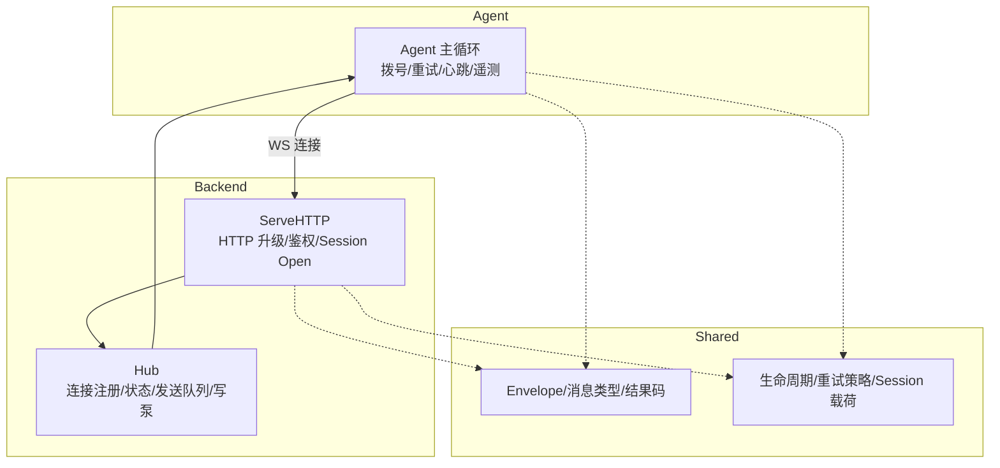
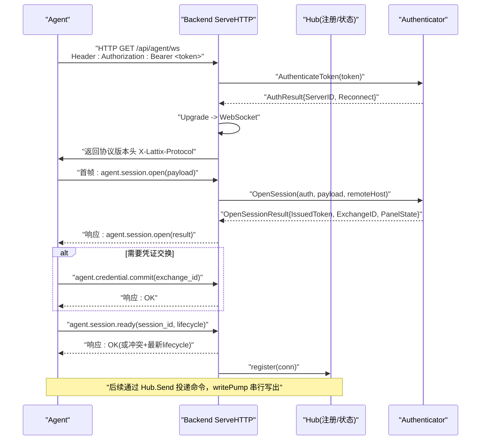
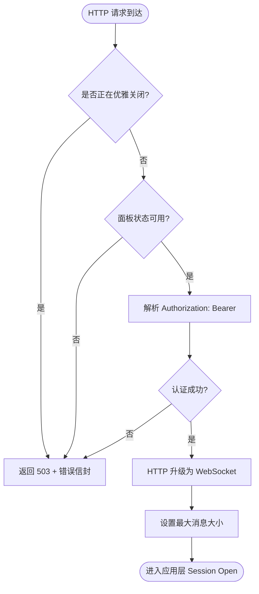
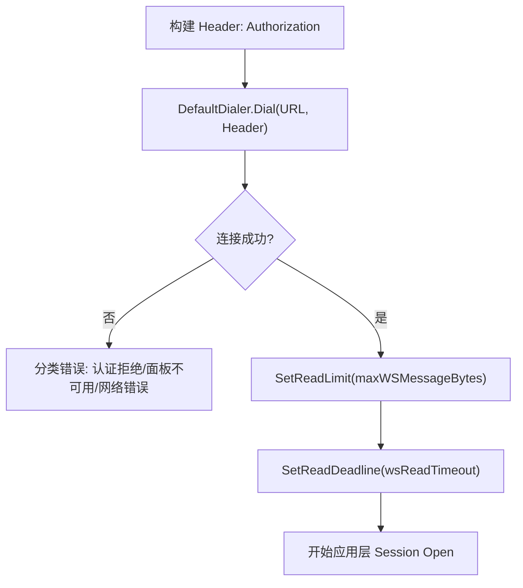
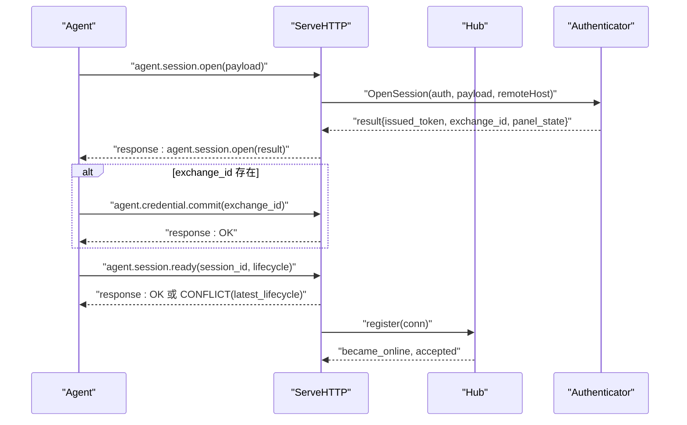
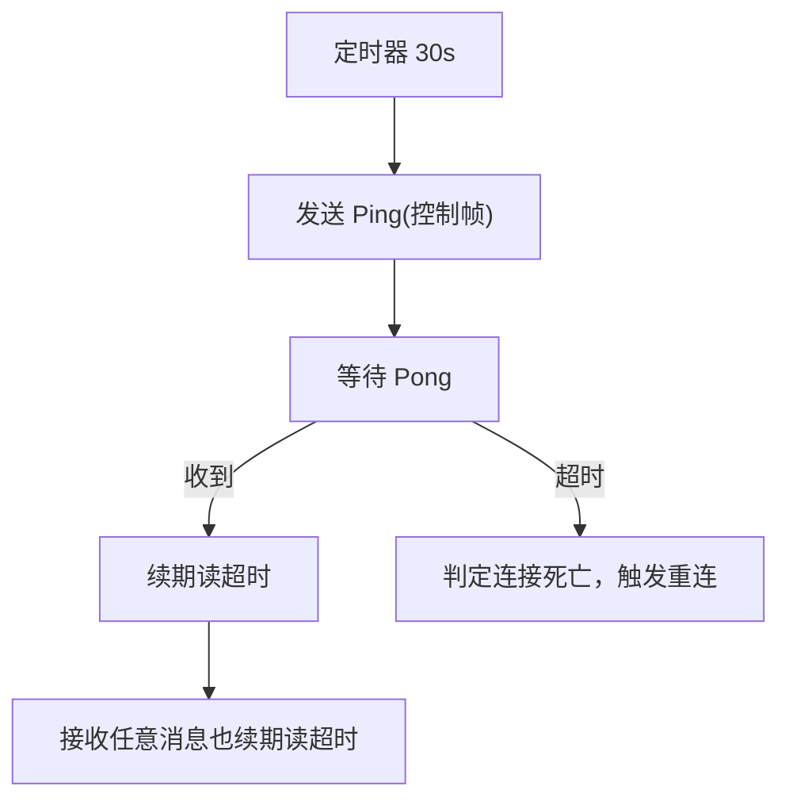
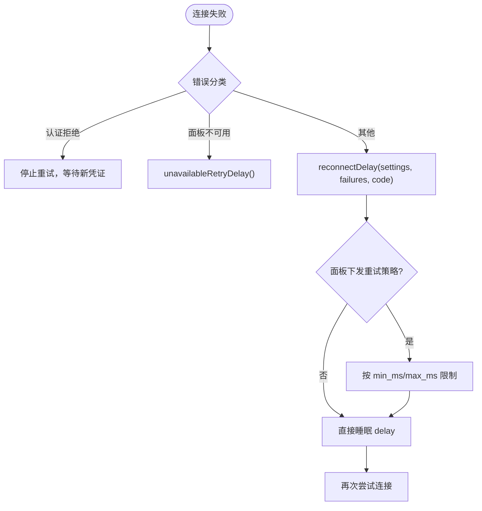
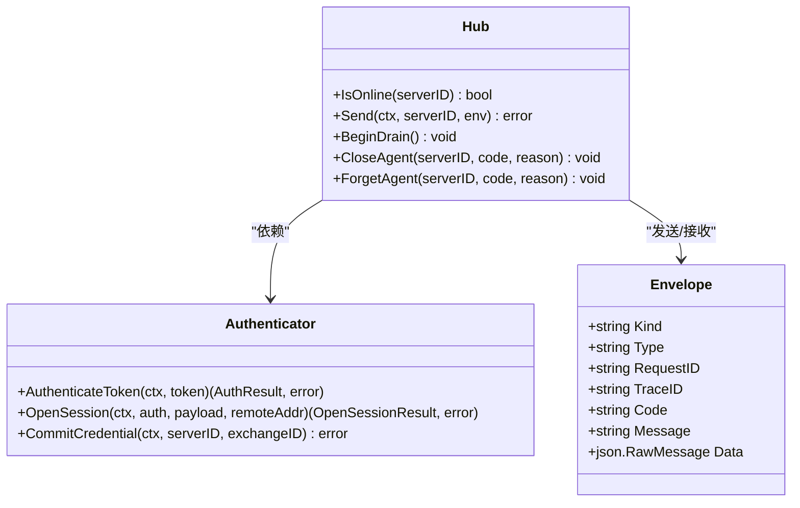
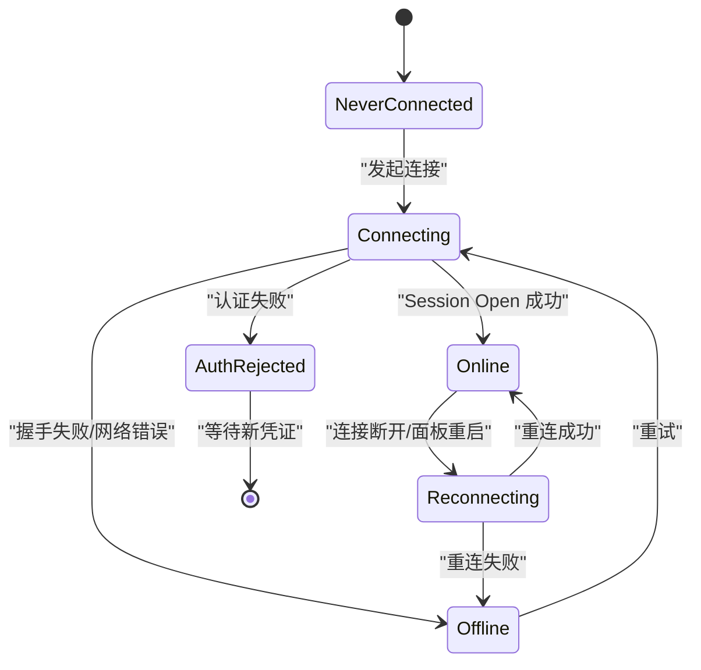
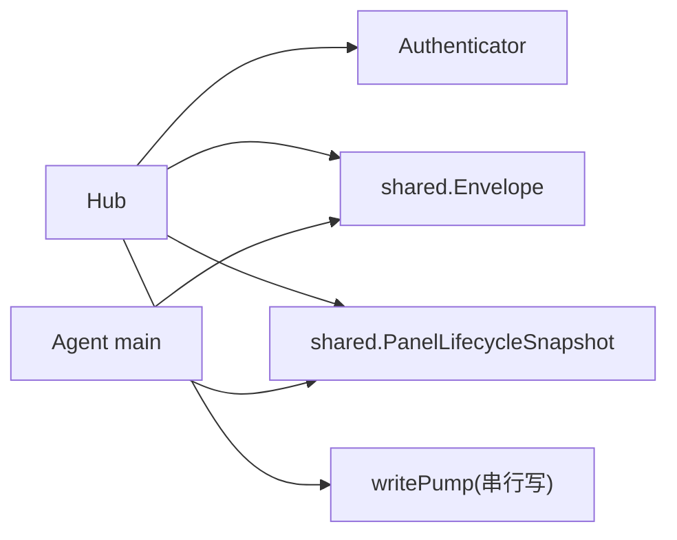

# WebSocket 连接管理

<cite>
**本文引用的文件**   
- [agent.go](file://src/backend/internal/ws/agent.go)
- [hub.go](file://src/backend/internal/ws/hub.go)
- [requester.go](file://src/backend/internal/ws/requester.go)
- [messages.go](file://src/shared/messages.go)
- [lifecycle.go](file://src/shared/lifecycle.go)
- [main.go](file://src/agent/cmd/agent/main.go)
</cite>

## 目录
1. [简介](#简介)
2. [项目结构](#项目结构)
3. [核心组件](#核心组件)
4. [架构总览](#架构总览)
5. [详细组件分析](#详细组件分析)
6. [依赖关系分析](#依赖关系分析)
7. [性能考量](#性能考量)
8. [故障排查指南](#故障排查指南)
9. [结论](#结论)
10. [附录](#附录)

## 简介
本文件面向 Lattix Agent 的 WebSocket 连接管理机制，系统性阐述从 HTTP 升级、握手认证到应用层 Session Open、心跳保活、重连策略与安全机制的完整流程。文档同时提供连接状态图与消息交互时序图，帮助开发者快速理解并正确实现或排障。

## 项目结构
WebSocket 相关代码主要分布在后端 Hub（连接管理与协议处理）、共享协议类型定义、以及 Agent 端拨号与连接生命周期管理：
- 后端 Hub：负责 HTTP 升级、鉴权、Session Open、注册表、发送队列、写泵、生命周期同步等
- 共享协议：Envelope、消息类型、结果码、生命周期快照、Session Open 载荷与结果等
- Agent 端：拨号、首帧 session.open、凭证交换、会话就绪、心跳与延迟探测、设置同步、遥测上报、配置漂移检测等

**图示来源** 
- [agent.go:33-239](file://src/backend/internal/ws/agent.go#L33-L239)
- [hub.go:26-139](file://src/backend/internal/ws/hub.go#L26-L139)
- [messages.go:14-137](file://src/shared/messages.go#L14-L137)
- [lifecycle.go:56-86](file://src/shared/lifecycle.go#L56-L86)
- [main.go:141-386](file://src/agent/cmd/agent/main.go#L141-L386)

**章节来源**
- [agent.go:33-239](file://src/backend/internal/ws/agent.go#L33-L239)
- [hub.go:26-139](file://src/backend/internal/ws/hub.go#L26-L139)
- [messages.go:14-137](file://src/shared/messages.go#L14-L137)
- [lifecycle.go:56-86](file://src/shared/lifecycle.go#L56-L86)
- [main.go:141-386](file://src/agent/cmd/agent/main.go#L141-L386)

## 核心组件
- Hub：维护 Agent 连接注册表、连接状态快照、发送缓冲、写泵、生命周期同步与优雅关闭（Drain）
- ServeHTTP：HTTP 升级入口，Bearer Token 鉴权、Session Open 校验、注册与业务信封路由
- Authenticator：外部注入的鉴权与会话打开能力（Token 校验、OpenSession、CommitCredential）
- Envelope：统一 RPC 信封，包含 kind/type/request_id/trace_id/code/message/data
- Agent 主循环：拨号、首帧 session.open、凭证交换、会话 ready、心跳与延迟探测、设置同步、遥测与漂移检测

**章节来源**
- [hub.go:26-139](file://src/backend/internal/ws/hub.go#L26-L139)
- [agent.go:33-239](file://src/backend/internal/ws/agent.go#L33-L239)
- [requester.go:18-43](file://src/backend/internal/ws/requester.go#L18-L43)
- [messages.go:14-137](file://src/shared/messages.go#L14-L137)
- [main.go:141-386](file://src/agent/cmd/agent/main.go#L141-L386)

## 架构总览
下图展示 Agent 与 Backend 之间的端到端交互：Agent 主动拨号至 /api/agent/ws，携带 Authorization 头；后端进行 Upgrade 与鉴权，随后进入应用层 Session Open 流程，完成令牌交换与面板生命周期同步，建立稳定控制通道。

**图示来源** 
- [agent.go:33-239](file://src/backend/internal/ws/agent.go#L33-L239)
- [requester.go:18-43](file://src/backend/internal/ws/requester.go#L18-L43)
- [lifecycle.go:56-86](file://src/shared/lifecycle.go#L56-L86)
- [main.go:141-386](file://src/agent/cmd/agent/main.go#L141-L386)

## 详细组件分析

### 连接建立与 HTTP 头部认证
- 客户端在 HTTP 请求中携带 Authorization: Bearer <token>
- 服务端解析 Bearer Token，调用 AuthenticateToken 校验
- 若处于 Draining 或面板不可用，直接拒绝握手
- 成功则执行 Upgrader.Upgrade，设置读限制与协议头

**图示来源** 
- [agent.go:33-79](file://src/backend/internal/ws/agent.go#L33-L79)
- [hub.go:156-173](file://src/backend/internal/ws/hub.go#L156-L173)

**章节来源**
- [agent.go:33-79](file://src/backend/internal/ws/agent.go#L33-L79)
- [hub.go:156-173](file://src/backend/internal/ws/hub.go#L156-L173)

### Dialer 配置与连接超时
- Agent 使用默认 Dialer 拨号，设置 Authorization 头
- 首次连接成功后设置读超时（wsReadTimeout），用于 Ping/Pong 保活判定
- 控制帧写入设置单次写超时（wsWriteTimeout）
- 连接失败时根据错误分类决定重试策略

**图示来源** 
- [main.go:141-167](file://src/agent/cmd/agent/main.go#L141-L167)

**章节来源**
- [main.go:141-167](file://src/agent/cmd/agent/main.go#L141-L167)

### Session Open 协议与生命周期同步
- 首帧必须为 agent.session.open，包含协议版本、Agent/Xray 版本、网卡地址、上次生命周期版本等
- 后端返回 session.open 响应，包含 ServerID、SessionID、SessionKind、可选 IssuedToken、CredentialExchangeID、PanelState
- 如需凭证交换，Agent 发送 agent.credential.commit，完成后继续
- Agent 发送 agent.session.ready，携带当前 SessionID 与本地观察到的生命周期版本；后端校验一致性后返回 OK 或冲突（附带最新生命周期）
- 成功后 Hub.register 登记连接，触发 OnConnect/OnOnline/OnReconnect 回调

**图示来源** 
- [agent.go:88-197](file://src/backend/internal/ws/agent.go#L88-L197)
- [main.go:168-261](file://src/agent/cmd/agent/main.go#L168-L261)
- [lifecycle.go:56-86](file://src/shared/lifecycle.go#L56-L86)

**章节来源**
- [agent.go:88-197](file://src/backend/internal/ws/agent.go#L88-L197)
- [main.go:168-261](file://src/agent/cmd/agent/main.go#L168-L261)
- [lifecycle.go:56-86](file://src/shared/lifecycle.go#L56-L86)

### 心跳机制与连接健康检查
- Agent 每 30s 发送一次 Ping（控制帧），Panel 原样回 Pong
- 任一侧在 pongTimeoutDefault（90s）内未收到任何字节即判定连接死亡
- 每次收到消息（包括控制帧）都会续期读超时
- writePump 串行写出，避免并发写导致崩溃

**图示来源** 
- [agent.go:102-111](file://src/backend/internal/ws/agent.go#L102-L111)
- [hub.go:16-23](file://src/backend/internal/ws/hub.go#L16-L23)
- [main.go:118-127](file://src/agent/cmd/agent/main.go#L118-L127)

**章节来源**
- [agent.go:102-111](file://src/backend/internal/ws/agent.go#L102-L111)
- [hub.go:16-23](file://src/backend/internal/ws/hub.go#L16-L23)
- [main.go:118-127](file://src/agent/cmd/agent/main.go#L118-L127)

### 重连策略与指数退避
- Agent 外层循环维护 failures 计数，计算 reconnectDelay
- 根据 websocketCloseCode(err) 区分连接关闭原因
- 当面板明确拒绝认证时停止自动重试，需重新绑定
- 当面板暂时不可用时采用 unavailableRetryDelay
- 结合面板下发的 RetryPolicy（min_ms/max_ms）与 LatencyResumeWindowMS 动态调整

**图示来源** 
- [main.go:69-98](file://src/agent/cmd/agent/main.go#L69-L98)
- [lifecycle.go:22-41](file://src/shared/lifecycle.go#L22-L41)

**章节来源**
- [main.go:69-98](file://src/agent/cmd/agent/main.go#L69-L98)
- [lifecycle.go:22-41](file://src/shared/lifecycle.go#L22-L41)

### 安全机制
- 传输加密：建议通过 HTTPS/TLS 暴露后端服务，Agent 拨号 ws/wss
- 认证：Authorization: Bearer <token>，后端 AuthenticateToken 校验
- 证书验证：Agent 侧可通过自定义 Dialer 配置 CA 证书
- 连接隔离：Hub 基于 serverID 维护连接与状态，支持 CloseAgent/ForgetAgent 强制下线
- 优雅关闭：BeginDrain 关闭所有连接，促使 Agent 走快速重启路径

**图示来源** 
- [hub.go:26-139](file://src/backend/internal/ws/hub.go#L26-L139)
- [requester.go:18-43](file://src/backend/internal/ws/requester.go#L18-L43)
- [messages.go:14-45](file://src/shared/messages.go#L14-L45)

**章节来源**
- [hub.go:26-139](file://src/backend/internal/ws/hub.go#L26-L139)
- [requester.go:18-43](file://src/backend/internal/ws/requester.go#L18-L43)
- [messages.go:14-45](file://src/shared/messages.go#L14-L45)

### 连接状态图

**图示来源** 
- [lifecycle.go:11-20](file://src/shared/lifecycle.go#L11-L20)
- [hub.go:94-100](file://src/backend/internal/ws/hub.go#L94-L100)

**章节来源**
- [lifecycle.go:11-20](file://src/shared/lifecycle.go#L11-L20)
- [hub.go:94-100](file://src/backend/internal/ws/hub.go#L94-L100)

## 依赖关系分析
- Hub 依赖 Authenticator 接口完成鉴权与会话打开
- Hub 依赖 shared.Envelope 与生命周期类型进行消息编解码与状态同步
- Agent 依赖 shared 包中的消息类型与生命周期快照
- 写泵 writePump 保证串行写出，避免 gorilla 并发写限制

**图示来源** 
- [hub.go:26-139](file://src/backend/internal/ws/hub.go#L26-L139)
- [messages.go:14-45](file://src/shared/messages.go#L14-L45)
- [lifecycle.go:32-45](file://src/shared/lifecycle.go#L32-L45)
- [main.go:141-386](file://src/agent/cmd/agent/main.go#L141-L386)

**章节来源**
- [hub.go:26-139](file://src/backend/internal/ws/hub.go#L26-L139)
- [messages.go:14-45](file://src/shared/messages.go#L14-L45)
- [lifecycle.go:32-45](file://src/shared/lifecycle.go#L32-L45)
- [main.go:141-386](file://src/agent/cmd/agent/main.go#L141-L386)

## 性能考量
- 发送缓冲：每连接 sendBuffer=256，满则视为慢连接并断开，重连后补发
- 写超时：单次写超时 writeTimeout=10s，超时即判死
- 读超时：pongTimeoutDefault=90s，无字节即断
- 串行写：writePump 串行消费队列，避免并发写问题
- 生命周期同步：批量 SyncLifecycle 等待 ACK，缺失节点排序返回

**章节来源**
- [hub.go:16-23](file://src/backend/internal/ws/hub.go#L16-L23)
- [hub.go:398-412](file://src/backend/internal/ws/hub.go#L398-L412)
- [hub.go:320-378](file://src/backend/internal/ws/hub.go#L320-L378)

## 故障排查指南
- 认证失败：检查 Authorization 头格式与 Token 有效性；后端会返回 AUTH_INVALID_CREDENTIALS
- 面板不可用：后端处于 Draining/Faulted 状态将拒绝握手；Agent 侧使用 unavailableRetryDelay
- 协议错误：首帧非 session.open 或 data 非法，将返回 4002 Close 码
- 连接断开：writePump 写失败或读超时，Agent 侧触发重连
- 生命周期冲突：session.ready 返回 CONFLICT，需拉取最新生命周期并重试

**章节来源**
- [agent.go:45-59](file://src/backend/internal/ws/agent.go#L45-L59)
- [agent.go:88-121](file://src/backend/internal/ws/agent.go#L88-L121)
- [hub.go:156-173](file://src/backend/internal/ws/hub.go#L156-L173)
- [main.go:69-98](file://src/agent/cmd/agent/main.go#L69-L98)

## 结论
Lattix Agent 的 WebSocket 连接管理以 Hub 为核心，结合严格的握手鉴权、Session Open 协议、Ping/Pong 心跳与指数退避重连，构建了高可靠的双向控制通道。通过共享协议类型与生命周期快照，两端保持一致的状态视图，确保配置下发、遥测与运维操作的稳定性与可观测性。

## 附录
- 关键常量与类型参考：
  - 消息类型：TypeSessionOpen、TypeSessionReady、TypeCredentialCommit、TypeLifecycleChanged 等
  - 结果码：CodeOK、CodeConflict、CodeServiceUnavailable、CodeAuthInvalidCredentials 等
  - 生命周期状态：PanelStateActive/Startup/Updating/Faulted，ConnectionState* 系列
- 调试建议：
  - 开启日志记录 OnProtocolError、OnDisconnect、OnOnline/OnReconnect
  - 监控 Hub ConnectionState 快照变化
  - 使用 SyncLifecycle 定位未 ACK 的节点

**章节来源**
- [messages.go:47-91](file://src/shared/messages.go#L47-91)
- [lifecycle.go:5-20](file://src/shared/lifecycle.go#L5-20)
- [hub.go:76-92](file://src/backend/internal/ws/hub.go#L76-L92)