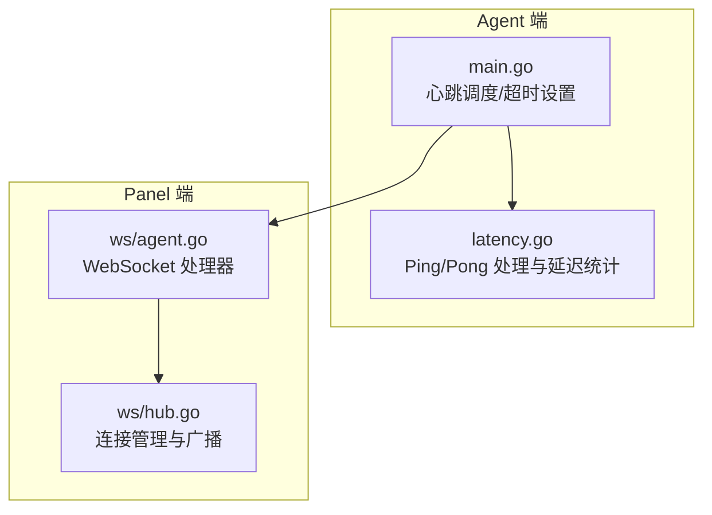
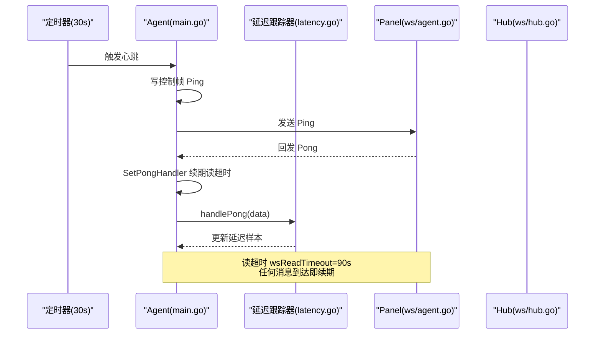
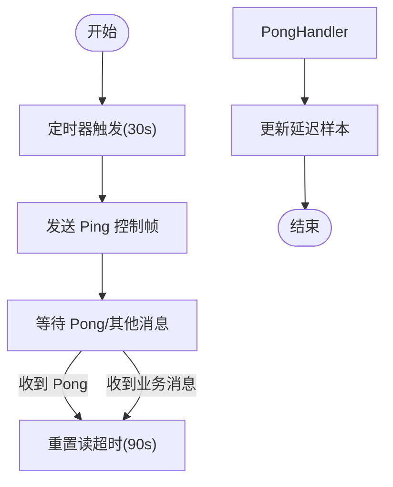
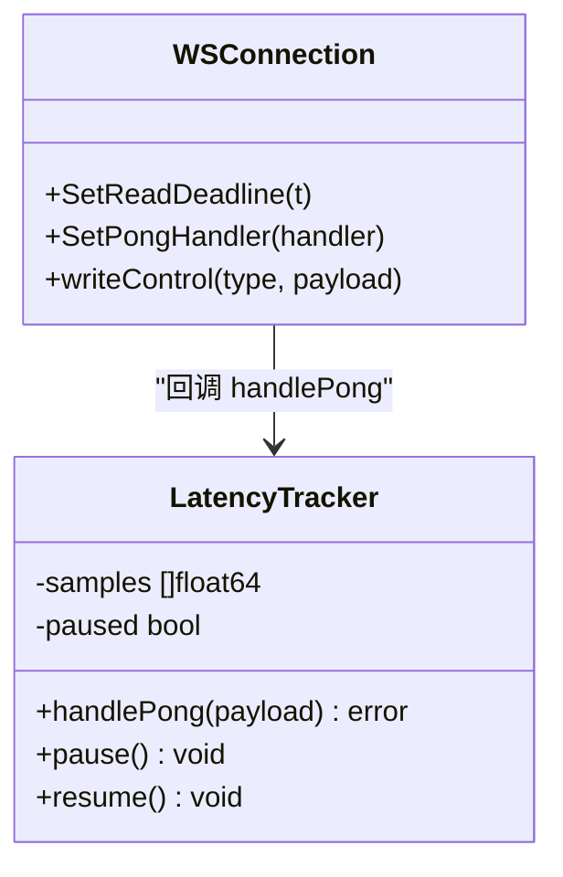
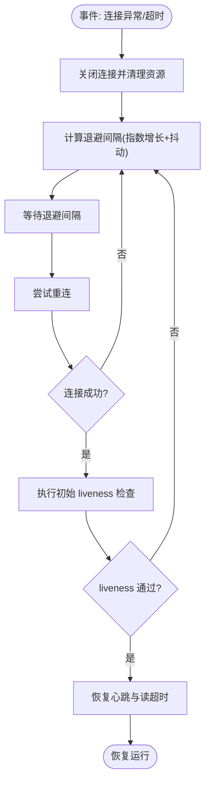
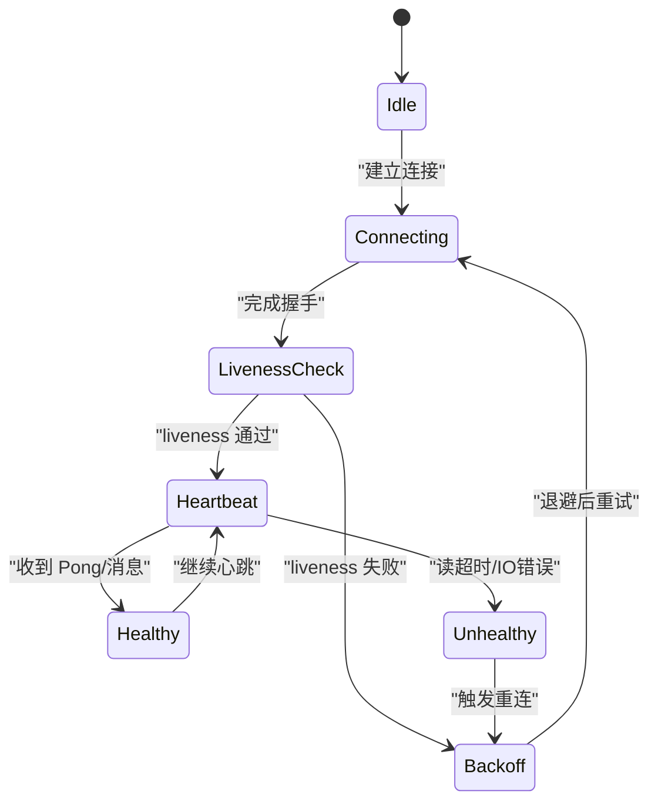
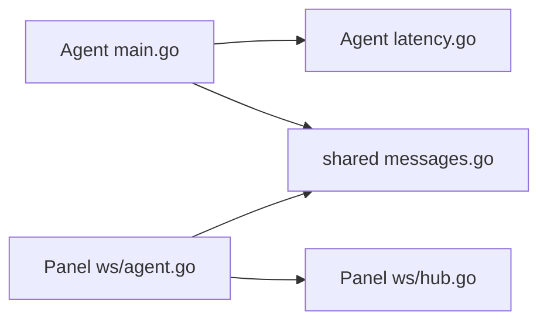

# 心跳与保活机制

<cite>
**本文引用的文件**   
- [src/agent/cmd/agent/main.go](file://src/agent/cmd/agent/main.go)
- [src/agent/cmd/agent/latency.go](file://src/agent/cmd/agent/latency.go)
- [src/backend/internal/ws/agent.go](file://src/backend/internal/ws/agent.go)
- [src/backend/internal/ws/hub.go](file://src/backend/internal/ws/hub.go)
- [src/shared/messages.go](file://src/shared/messages.go)
</cite>

## 目录
1. [简介](#简介)
2. [项目结构](#项目结构)
3. [核心组件](#核心组件)
4. [架构总览](#架构总览)
5. [详细组件分析](#详细组件分析)
6. [依赖关系分析](#依赖关系分析)
7. [性能考量](#性能考量)
8. [故障排查指南](#故障排查指南)
9. [结论](#结论)
10. [附录](#附录)

## 简介
本文件聚焦 Lattix Agent 的 WebSocket 心跳与连接保活机制，系统性阐述应用层心跳实现、健康检查策略、超时协同、失败处理与重连退避，以及 liveness 消息在初始检查、周期心跳与连接质量监控中的作用。文档同时提供状态转换图与故障恢复流程图，帮助读者快速理解并正确维护该机制。

## 项目结构
围绕心跳与保活的关键代码分布在 Agent 端与 Panel（后端）端：
- Agent 端负责每 30 秒发送 Ping 控制帧，设置读超时 wsReadTimeout=90s，并在收到 Pong 时更新延迟统计与续期读超时。
- Panel 端作为服务端对 Ping/Pong 进行响应，并通过 Hub 管理连接生命周期。
- 共享消息定义用于业务层面的 liveness 检测与状态同步。

图表来源
- [src/agent/cmd/agent/main.go](file://src/agent/cmd/agent/main.go)
- [src/agent/cmd/agent/latency.go](file://src/agent/cmd/agent/latency.go)
- [src/backend/internal/ws/agent.go](file://src/backend/internal/ws/agent.go)
- [src/backend/internal/ws/hub.go](file://src/backend/internal/ws/hub.go)

章节来源
- [src/agent/cmd/agent/main.go](file://src/agent/cmd/agent/main.go)
- [src/agent/cmd/agent/latency.go](file://src/agent/cmd/agent/latency.go)
- [src/backend/internal/ws/agent.go](file://src/backend/internal/ws/agent.go)
- [src/backend/internal/ws/hub.go](file://src/backend/internal/ws/hub.go)

## 核心组件
- 心跳调度器（Agent）
  - 周期性触发 Ping 控制帧，间隔为 30 秒。
  - 设置读超时 wsReadTimeout=90 秒；任何消息到达即续期读超时。
- PongHandler（Agent）
  - 收到 Pong 后重置读超时，并交由延迟跟踪器处理，记录往返时延。
- 延迟跟踪器（Agent）
  - 维护样本集合，支持暂停/恢复，忽略过期样本，计算平均/分位延迟。
- Panel 端 WebSocket 处理器
  - 接收并响应 Ping/Pong，转发业务消息，维护连接上下文。
- Hub（Panel）
  - 管理连接集合、广播消息、清理离线连接。

章节来源
- [src/agent/cmd/agent/main.go](file://src/agent/cmd/agent/main.go)
- [src/agent/cmd/agent/latency.go](file://src/agent/cmd/agent/latency.go)
- [src/backend/internal/ws/agent.go](file://src/backend/internal/ws/agent.go)
- [src/backend/internal/ws/hub.go](file://src/backend/internal/ws/hub.go)

## 架构总览
下图展示 Agent 与 Panel 之间的心跳与保活交互流程，包括控制帧与应用层 liveness 消息的协同。

图表来源
- [src/agent/cmd/agent/main.go](file://src/agent/cmd/agent/main.go)
- [src/agent/cmd/agent/latency.go](file://src/agent/cmd/agent/latency.go)
- [src/backend/internal/ws/agent.go](file://src/backend/internal/ws/agent.go)
- [src/backend/internal/ws/hub.go](file://src/backend/internal/ws/hub.go)

## 详细组件分析

### 应用层心跳实现（每 30 秒 Ping + Pong 响应）
- 心跳频率
  - 使用定时器以 30 秒为周期触发 Ping 控制帧。
- 控制帧发送
  - 通过底层连接写入 Ping 控制帧，确保协议级保活。
- Panel 响应
  - Panel 侧按 WebSocket 规范自动或显式回发 Pong。
- 读超时续期
  - 每次收到 Pong 或其他消息时，将读超时重新设置为当前时间 + 90 秒。

图表来源
- [src/agent/cmd/agent/main.go](file://src/agent/cmd/agent/main.go)
- [src/agent/cmd/agent/latency.go](file://src/agent/cmd/agent/latency.go)

章节来源
- [src/agent/cmd/agent/main.go](file://src/agent/cmd/agent/main.go)
- [src/agent/cmd/agent/latency.go](file://src/agent/cmd/agent/latency.go)

### 连接健康检查策略（PongHandler 与超时协同）
- PongHandler 职责
  - 重置读超时，避免误判连接死亡。
  - 调用延迟跟踪器的 handlePong，记录有效样本。
- 读超时策略
  - 初始设置读超时为 90 秒。
  - 任何消息到达（含 Pong 与业务消息）均续期读超时。
- 存活判断
  - 若在 90 秒内无任何字节到达，则判定连接不可用，触发关闭与重连流程。

图表来源
- [src/agent/cmd/agent/latency.go](file://src/agent/cmd/agent/latency.go)
- [src/agent/cmd/agent/main.go](file://src/agent/cmd/agent/main.go)

章节来源
- [src/agent/cmd/agent/main.go](file://src/agent/cmd/agent/main.go)
- [src/agent/cmd/agent/latency.go](file://src/agent/cmd/agent/latency.go)

### 心跳失败处理流程（连接关闭、重连与指数退避）
- 失败触发
  - 读超时达到 90 秒无数据到达，或底层 IO 错误导致连接关闭。
- 关闭动作
  - 释放资源、停止定时器、清理上下文。
- 重连策略
  - 采用指数退避算法，逐步增加重连间隔，避免雪崩。
  - 首次重连前加入随机抖动，降低集中重试概率。
- 恢复条件
  - 成功建立新连接并完成初始 liveness 检查后，恢复正常心跳循环。

图表来源
- [src/agent/cmd/agent/main.go](file://src/agent/cmd/agent/main.go)

章节来源
- [src/agent/cmd/agent/main.go](file://src/agent/cmd/agent/main.go)

### liveness 消息的作用（初始检查、周期心跳、连接质量监控）
- 初始 liveness 检查
  - 连接建立后立即进行一次 liveness 探测，确保对端可用后再进入正常心跳循环。
- 周期心跳
  - 每 30 秒发送 Ping，结合 Pong 响应维持连接活跃。
- 连接质量监控
  - 基于 Pong 往返时延统计，评估链路质量，必要时触发告警或调整策略。

图表来源
- [src/agent/cmd/agent/main.go](file://src/agent/cmd/agent/main.go)
- [src/shared/messages.go](file://src/shared/messages.go)

章节来源
- [src/agent/cmd/agent/main.go](file://src/agent/cmd/agent/main.go)
- [src/shared/messages.go](file://src/shared/messages.go)

## 依赖关系分析
- Agent 内部依赖
  - main.go 依赖 latency.go 的延迟跟踪能力，用于处理 Pong 与统计。
- Panel 内部依赖
  - ws/agent.go 依赖 ws/hub.go 进行连接管理与消息分发。
- 跨模块依赖
  - shared/messages.go 定义应用层消息结构，供 liveness 与业务逻辑使用。

图表来源
- [src/agent/cmd/agent/main.go](file://src/agent/cmd/agent/main.go)
- [src/agent/cmd/agent/latency.go](file://src/agent/cmd/agent/latency.go)
- [src/backend/internal/ws/agent.go](file://src/backend/internal/ws/agent.go)
- [src/backend/internal/ws/hub.go](file://src/backend/internal/ws/hub.go)
- [src/shared/messages.go](file://src/shared/messages.go)

章节来源
- [src/agent/cmd/agent/main.go](file://src/agent/cmd/agent/main.go)
- [src/agent/cmd/agent/latency.go](file://src/agent/cmd/agent/latency.go)
- [src/backend/internal/ws/agent.go](file://src/backend/internal/ws/agent.go)
- [src/backend/internal/ws/hub.go](file://src/backend/internal/ws/hub.go)
- [src/shared/messages.go](file://src/shared/messages.go)

## 性能考量
- 控制帧开销
  - Ping/Pong 为轻量控制帧，开销极低，适合高频保活。
- 读超时权衡
  - 90 秒读超时需兼顾网络抖动与故障检测速度，过长会延迟故障发现，过短易误判。
- 延迟统计精度
  - 延迟跟踪器应合理采样与丢弃过期样本，避免内存膨胀与统计失真。
- 重连退避
  - 指数退避配合随机抖动可有效缓解重连风暴，提升系统稳定性。

## 故障排查指南
- 常见问题定位
  - 读超时频繁触发：检查网络连通性、防火墙策略、Panel 是否正常运行。
  - Pong 未到达：确认 Panel 是否正确响应 Ping，查看 Hub 连接状态。
  - 延迟异常升高：观察样本分布，排查网络拥塞或远端负载过高。
- 日志与指标
  - 关注心跳定时器触发、PongHandler 调用次数、读超时事件、重连次数与退避间隔。
- 恢复步骤
  - 重启 Panel 服务、检查证书与端口配置、验证负载均衡与健康检查探针。

章节来源
- [src/agent/cmd/agent/main.go](file://src/agent/cmd/agent/main.go)
- [src/backend/internal/ws/hub.go](file://src/backend/internal/ws/hub.go)

## 结论
Lattix Agent 的心跳与保活机制通过“控制帧 Ping/Pong + 应用层 liveness + 读超时”的多层保障，实现了高可靠的长连接维护。合理的超时设置、稳健的重连退避与精确的延迟统计共同确保了连接的健康与可观测性。建议在生产环境中持续监控关键指标，并根据实际网络状况微调超时与退避参数。

## 附录
- 术语说明
  - Ping/Pong：WebSocket 控制帧，用于保活与延迟测量。
  - liveness：应用层健康检查消息，用于连接可用性验证。
  - 指数退避：重连间隔按指数增长，减少重试冲突。
- 参考实现路径
  - 心跳调度与超时设置：[src/agent/cmd/agent/main.go](file://src/agent/cmd/agent/main.go)
  - Pong 处理与延迟统计：[src/agent/cmd/agent/latency.go](file://src/agent/cmd/agent/latency.go)
  - Panel WebSocket 处理器：[src/backend/internal/ws/agent.go](file://src/backend/internal/ws/agent.go)
  - Panel 连接管理 Hub：[src/backend/internal/ws/hub.go](file://src/backend/internal/ws/hub.go)
  - 共享消息定义：[src/shared/messages.go](file://src/shared/messages.go)