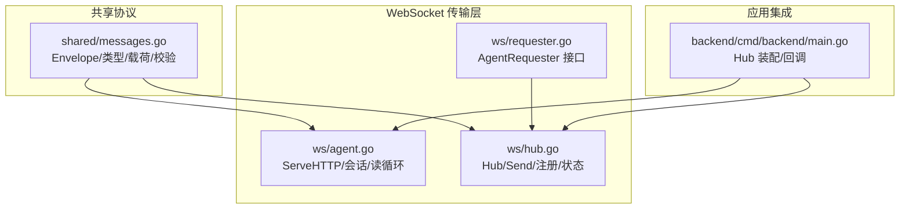
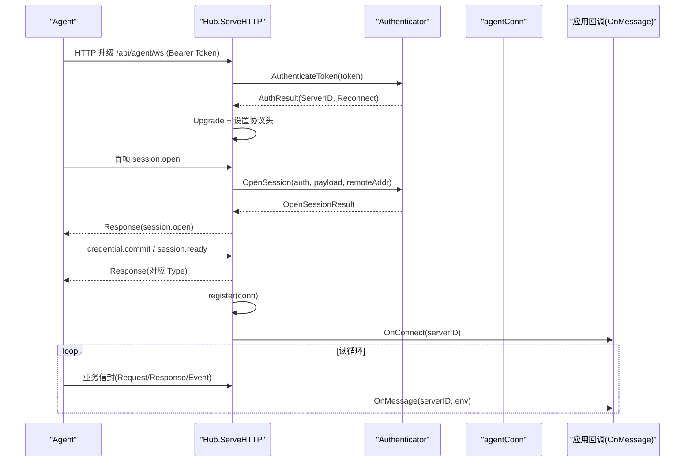
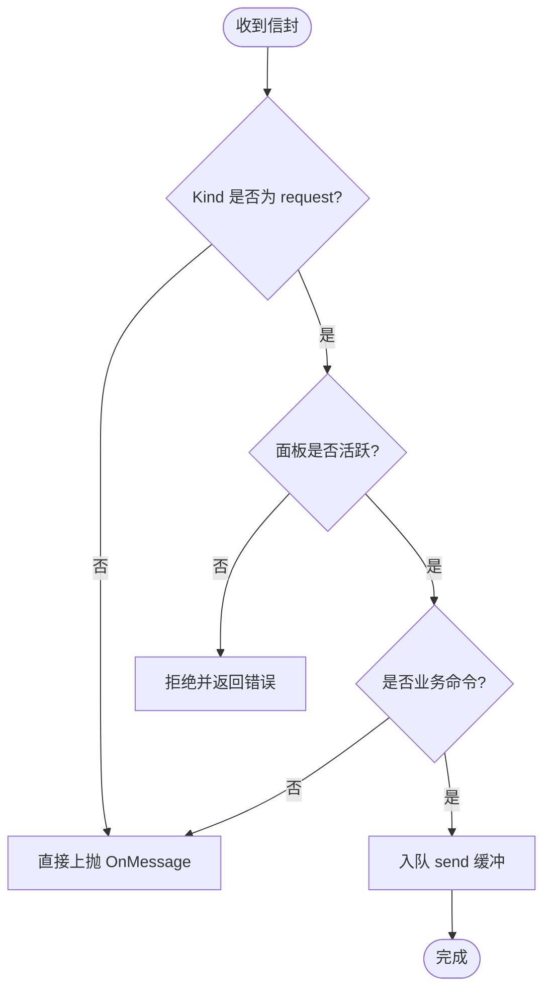
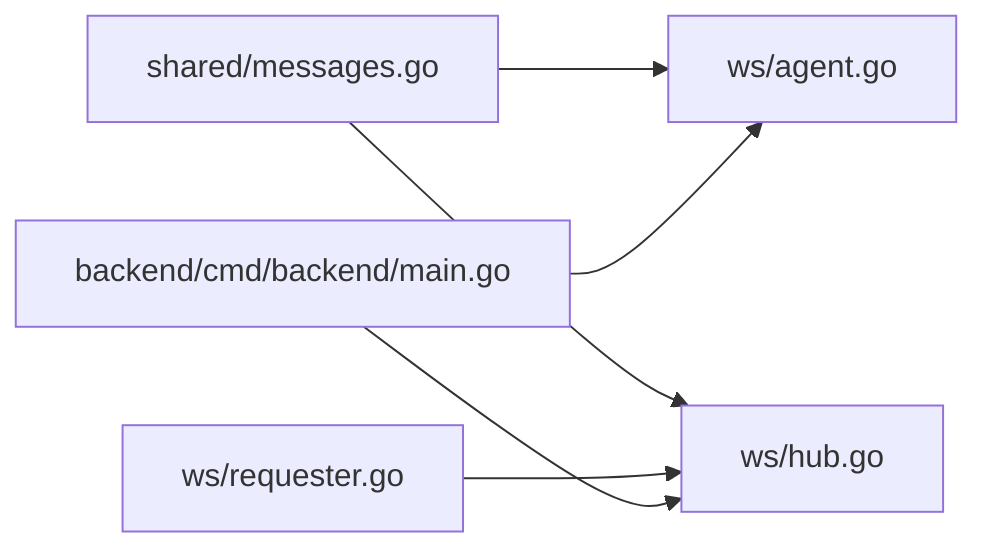

# 消息路由与分发

<cite>
**本文引用的文件**   
- [messages.go](file://src/shared/messages.go)
- [hub.go](file://src/backend/internal/ws/hub.go)
- [agent.go](file://src/backend/internal/ws/agent.go)
- [requester.go](file://src/backend/internal/ws/requester.go)
- [main.go](file://src/backend/cmd/backend/main.go)
</cite>

## 目录
1. [简介](#简介)
2. [项目结构](#项目结构)
3. [核心组件](#核心组件)
4. [架构总览](#架构总览)
5. [详细组件分析](#详细组件分析)
6. [依赖关系分析](#依赖关系分析)
7. [性能考量](#性能考量)
8. [故障排查指南](#故障排查指南)
9. [结论](#结论)
10. [附录](#附录)

## 简介
本文面向 Lattix Agent 的 WebSocket 控制通道，聚焦于后端 Hub 对 Agent 消息的路由与分发机制。重点说明：
- handle 函数的消息分发逻辑（请求、响应、事件三类 Kind）
- 请求-响应匹配机制（RequestID、TraceID）
- 各类命令处理流程（节点管理、用户管理、链路操作、系统操作）
- 异步任务处理（goroutine 并发、错误处理策略、结果回执）
- 消息验证与统一错误响应格式
- 消息流转图与处理器注册扩展指南

## 项目结构
围绕 WebSocket 控制通道的关键代码位于 backend/internal/ws 包与 shared 协议定义中：
- shared/messages.go：统一信封 Envelope、消息类型常量、载荷结构与校验
- ws/hub.go：连接注册表、发送队列、生命周期回调、业务命令拦截
- ws/agent.go：HTTP 升级、会话握手、读循环、协议错误上报
- ws/requester.go：AgentRequester 接口与错误定义
- backend/cmd/backend/main.go：Hub 装配与 OnConnect/OnOnline 等回调绑定

**图表来源** 
- [messages.go:14-137](file://src/shared/messages.go#L14-L137)
- [agent.go:33-239](file://src/backend/internal/ws/agent.go#L33-L239)
- [hub.go:26-139](file://src/backend/internal/ws/hub.go#L26-L139)
- [requester.go:18-43](file://src/backend/internal/ws/requester.go#L18-L43)
- [main.go:252-281](file://src/backend/cmd/backend/main.go#L252-L281)

**章节来源**
- [messages.go:14-137](file://src/shared/messages.go#L14-L137)
- [agent.go:33-239](file://src/backend/internal/ws/agent.go#L33-L239)
- [hub.go:26-139](file://src/backend/internal/ws/hub.go#L26-L139)
- [requester.go:18-43](file://src/backend/internal/ws/requester.go#L18-L43)
- [main.go:252-281](file://src/backend/cmd/backend/main.go#L252-L281)

## 核心组件
- 统一信封 Envelope：包含 Kind、Type、RequestID、TraceID、Code、Message、Data；响应时强制携带 Code 与 Message，请求/事件不携带
- 消息类型常量：KindRequest/KindResponse/KindEvent；Type* 系列（如 node.apply、user.add、chain-hop.apply 等）
- Hub：维护 Agent 连接映射、发送缓冲、生命周期回调、在线状态、优雅停机
- agentConn：单连接封装，串行写 pump、生命周期 ACK 等待
- AgentRequester：对外暴露 Send/IsOnline 能力，供调度器使用

**章节来源**
- [messages.go:14-137](file://src/shared/messages.go#L14-L137)
- [hub.go:26-139](file://src/backend/internal/ws/hub.go#L26-L139)
- [requester.go:18-43](file://src/backend/internal/ws/requester.go#L18-L43)

## 架构总览
下图展示从 HTTP 升级到 WS 会话建立、再到业务消息路由的关键路径。

**图表来源** 
- [agent.go:33-239](file://src/backend/internal/ws/agent.go#L33-L239)
- [hub.go:232-279](file://src/backend/internal/ws/hub.go#L232-L279)
- [requester.go:36-43](file://src/backend/internal/ws/requester.go#L36-L43)

## 详细组件分析

### 消息信封与类型识别
- 信封字段：
  - Kind：区分 request/response/event
  - Type：具体动作（如 node.apply、user.add、chain-hop.apply 等）
  - RequestID/TraceID：32 位十六进制随机 ID，用于请求-响应匹配与追踪
  - Code/Message：仅 response 携带，用于统一错误码与消息
  - Data：JSON 载荷
- 校验规则：
  - Kind 必须为三者之一
  - Type 必填
  - RequestID/TraceID 必须为 32 位十六进制
  - Data 必须为非空且合法 JSON
  - response 必须带 Code；非 response 不得带 Code/Message

**章节来源**
- [messages.go:14-137](file://src/shared/messages.go#L14-L137)

### 请求-响应匹配机制（RequestID、TraceID）
- 每个请求生成唯一 RequestID，并复制为 TraceID 作为链路追踪根
- 响应信封复用请求的 RequestID/TraceID，确保一一对应
- 对于生命周期同步（lifecycle.changed），Hub 通过 agentConn.registerLifecycleAck 以 RequestID 为键等待 ACK

**章节来源**
- [messages.go:93-109](file://src/shared/messages.go#L93-L109)
- [hub.go:295-318](file://src/backend/internal/ws/hub.go#L295-L318)
- [hub.go:322-378](file://src/backend/internal/ws/hub.go#L322-L378)

### 会话建立与认证流程
- HTTP 升级前校验 Authorization 头中的 Bearer Token
- 首次应用帧必须是 agent.session.open，随后接受 credential.commit 与 session.ready
- session.ready 成功后登记连接，触发 OnConnect 回调，进入业务消息阶段

**章节来源**
- [agent.go:33-239](file://src/backend/internal/ws/agent.go#L33-L239)

### 消息分发与命令拦截
- Hub.Send 在投递前进行“面板活跃性”检查，阻止在启动/故障态下发业务命令
- isBusinessCommand 白名单拦截：node.apply/remove、user.add/remove、chain-hop.apply/remove、uninstall、xray.upgrade、agent.upgrade
- 读循环将收到的所有业务信封上抛至 OnMessage，由上层 dispatcher 根据 Type 分派到具体处理器

**图表来源** 
- [hub.go:111-154](file://src/backend/internal/ws/hub.go#L111-L154)

**章节来源**
- [hub.go:111-154](file://src/backend/internal/ws/hub.go#L111-L154)

### 命令类型处理流程概览
- 节点管理
  - ApplyNode：下发虚拟配置模板、用户 UUID 列表、dest/port 候选；Agent 执行后回传 ApplyResultPayload
  - RemoveNode：按 NodeID 移除节点
- 用户管理
  - AddUser/RemoveUser：按节点 tag 与协议参数构造 account，支持热更新或重启兜底
- 链路操作
  - ApplyChainHop/RemoveChainHop：按 HopID/Kind 渲染链跳配置，回传 realized_config 端口/公钥等生效值
- 系统操作
  - UpgradeXray/UpgradeAgent/Uninstall：版本升级与卸载，可能异步执行并通过 telemetry/drift 回报状态

上述命令均由上层 dispatcher 根据 Type 路由到具体处理器，Hub 仅负责传输与基础拦截。

**章节来源**
- [messages.go:73-91](file://src/shared/messages.go#L73-L91)
- [messages.go:139-313](file://src/shared/messages.go#L139-L313)
- [hub.go:141-154](file://src/backend/internal/ws/hub.go#L141-L154)

### 异步任务处理与回执机制
- goroutine 并发：writePump 串行写出；SyncLifecycle 为每个连接起协程等待 ACK
- 错误处理策略：
  - 写入超时即判定连接死亡并关闭
  - 发送缓冲满视为慢连接，主动断开并重连补发
  - 面板处于启动/故障态时拒绝业务命令
- 回执机制：
  - lifecycle.changed 通过 RequestID 等待 ACK
  - 遥测与 drift 为单向事件，无需回执

**章节来源**
- [hub.go:398-413](file://src/backend/internal/ws/hub.go#L398-L413)
- [hub.go:322-378](file://src/backend/internal/ws/hub.go#L322-L378)
- [messages.go:195-238](file://src/shared/messages.go#L195-L238)

### 消息验证与统一错误响应
- readEnvelope 严格解析 JSON 文本帧，调用 Validate 校验信封结构
- strictUnmarshal 禁止未知字段，防止畸形报文
- 协议错误通过 protocolError 上报，附带规范化 request_id/trace_id
- 握手失败与不支持的动作通过 writeHandshakeError/replyDirect 返回统一信封

**章节来源**
- [agent.go:302-329](file://src/backend/internal/ws/agent.go#L302-L329)
- [agent.go:264-285](file://src/backend/internal/ws/agent.go#L264-L285)
- [agent.go:287-300](file://src/backend/internal/ws/agent.go#L287-L300)

### 处理器注册与扩展指南
- Hub.OnMessage 回调：所有业务信封经此回调上抛，上层 dispatcher 在此处按 Type 分派
- 新增命令类型步骤：
  1) 在 shared/messages.go 增加 Type* 常量
  2) 如需拦截，在 hub.isBusinessCommand 白名单中添加
  3) 在 dispatcher 中实现对应处理器，读取 Data 并执行业务逻辑
  4) 通过 Hub.Send 下发命令，并在 Agent 侧回执对应 Type 的 response
- 生命周期同步扩展：参考 SyncLifecycle 模式，基于 RequestID 等待 ACK

**章节来源**
- [messages.go:73-91](file://src/shared/messages.go#L73-L91)
- [hub.go:141-154](file://src/backend/internal/ws/hub.go#L141-L154)
- [hub.go:322-378](file://src/backend/internal/ws/hub.go#L322-L378)

## 依赖关系分析
- ws 包依赖 shared 协议定义
- agent.go 依赖 hub.go 提供的 Hub 方法与回调
- main.go 装配 Hub、Authenticator、LifecycleProvider，并注入 OnProtocolError/OnConnect/OnOnline 等回调

**图表来源** 
- [messages.go:1-12](file://src/shared/messages.go#L1-12)
- [agent.go:1-17](file://src/backend/internal/ws/agent.go#L1-L17)
- [hub.go:1-14](file://src/backend/internal/ws/hub.go#L1-L14)
- [requester.go:1-10](file://src/backend/internal/ws/requester.go#L1-L10)
- [main.go:252-281](file://src/backend/cmd/backend/main.go#L252-L281)

**章节来源**
- [messages.go:1-12](file://src/shared/messages.go#L1-12)
- [agent.go:1-17](file://src/backend/internal/ws/agent.go#L1-L17)
- [hub.go:1-14](file://src/backend/internal/ws/hub.go#L1-L14)
- [requester.go:1-10](file://src/backend/internal/ws/requester.go#L1-L10)
- [main.go:252-281](file://src/backend/cmd/backend/main.go#L252-L281)

## 性能考量
- 写缓冲限制：每连接 256 条，满则断连重连，避免阻塞主循环
- 写超时：单次写 10s 超时，快速失败
- 心跳与存活：Agent 主动 Ping，Panel 原样 Pong；90s 无字节判定离线
- 串行写出：writePump 保证 gorilla 并发安全
- 面板状态保护：启动/故障态拒绝业务命令，降低无效负载

[本节为通用指导，不直接分析具体文件]

## 故障排查指南
- 握手失败：检查 Authorization 头与 Token 有效性；查看 writeHandshakeError 返回的 code/message
- 首帧错误：确认首个应用帧为 agent.session.open，且 data 符合 SessionOpenPayload
- 协议错误：通过 OnProtocolError 回调获取规范化 request_id/trace_id/rpc_type 与错误摘要
- 离线/掉线：检查 IsOnline、ErrOffline、连接状态快照；关注 BeginDrain/CloseAllAgents 的影响
- 慢连接：观察 send buffer 满日志，必要时扩容或优化下游处理

**章节来源**
- [agent.go:264-285](file://src/backend/internal/ws/agent.go#L264-L285)
- [agent.go:287-300](file://src/backend/internal/ws/agent.go#L287-L300)
- [hub.go:156-173](file://src/backend/internal/ws/hub.go#L156-L173)
- [hub.go:103-108](file://src/backend/internal/ws/hub.go#L103-L108)

## 结论
Lattix Agent 的 WebSocket 控制通道采用统一信封与严格的协议校验，结合 Hub 的连接管理与发送队列，实现了稳定可靠的消息路由与分发。通过 RequestID/TraceID 实现精确的请求-响应匹配与可观测性，配合面板状态保护与优雅停机机制，保障系统在异常场景下的健壮性。新增命令类型只需在协议与拦截白名单中扩展，并在上层 dispatcher 中实现处理器即可无缝接入。

[本节为总结，不直接分析具体文件]

## 附录
- 常用消息类型与载荷：见 shared/messages.go 的 Type* 常量与 Payload 结构
- 错误码语义：见 shared/messages.go 的 Code* 常量
- 连接状态快照：见 hub.ConnectionSnapshot 与 ConnectionState 方法

**章节来源**
- [messages.go:47-91](file://src/shared/messages.go#L47-L91)
- [messages.go:139-313](file://src/shared/messages.go#L139-L313)
- [hub.go:69-92](file://src/backend/internal/ws/hub.go#L69-L92)