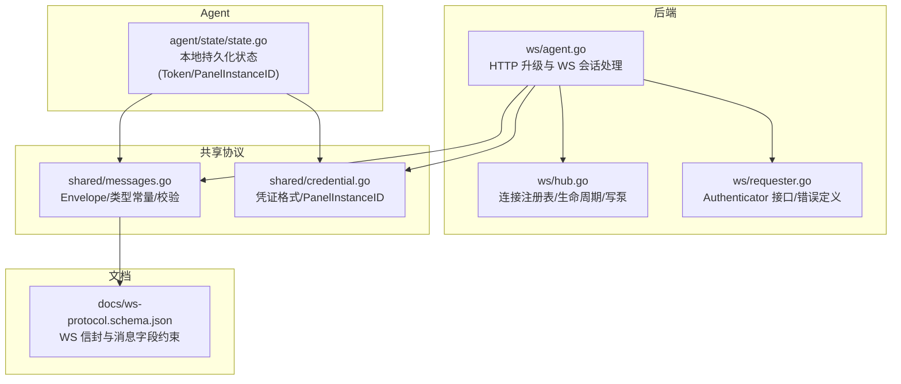
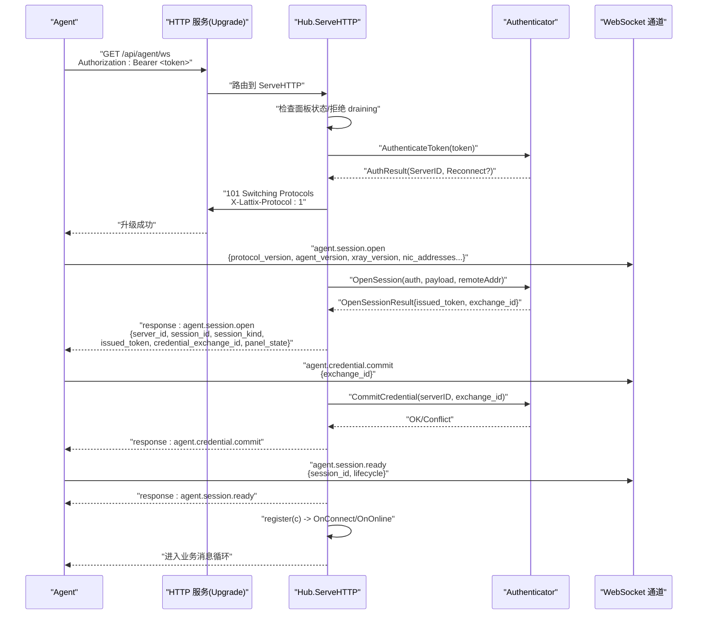
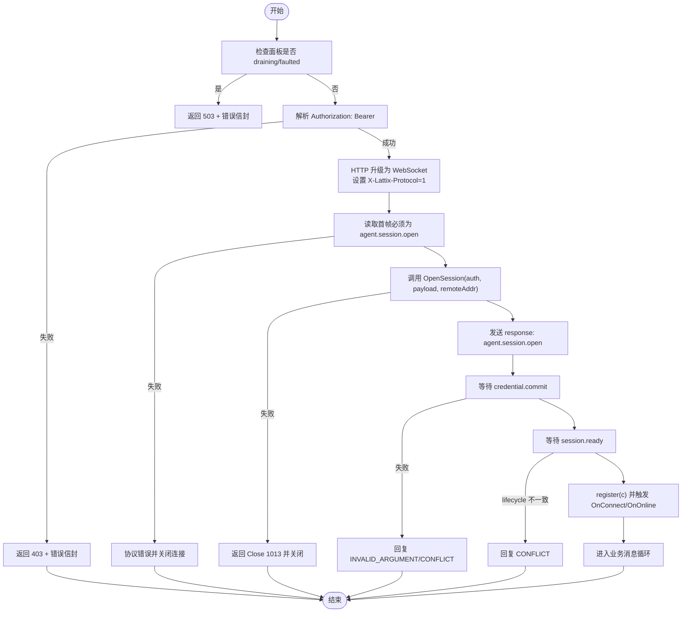
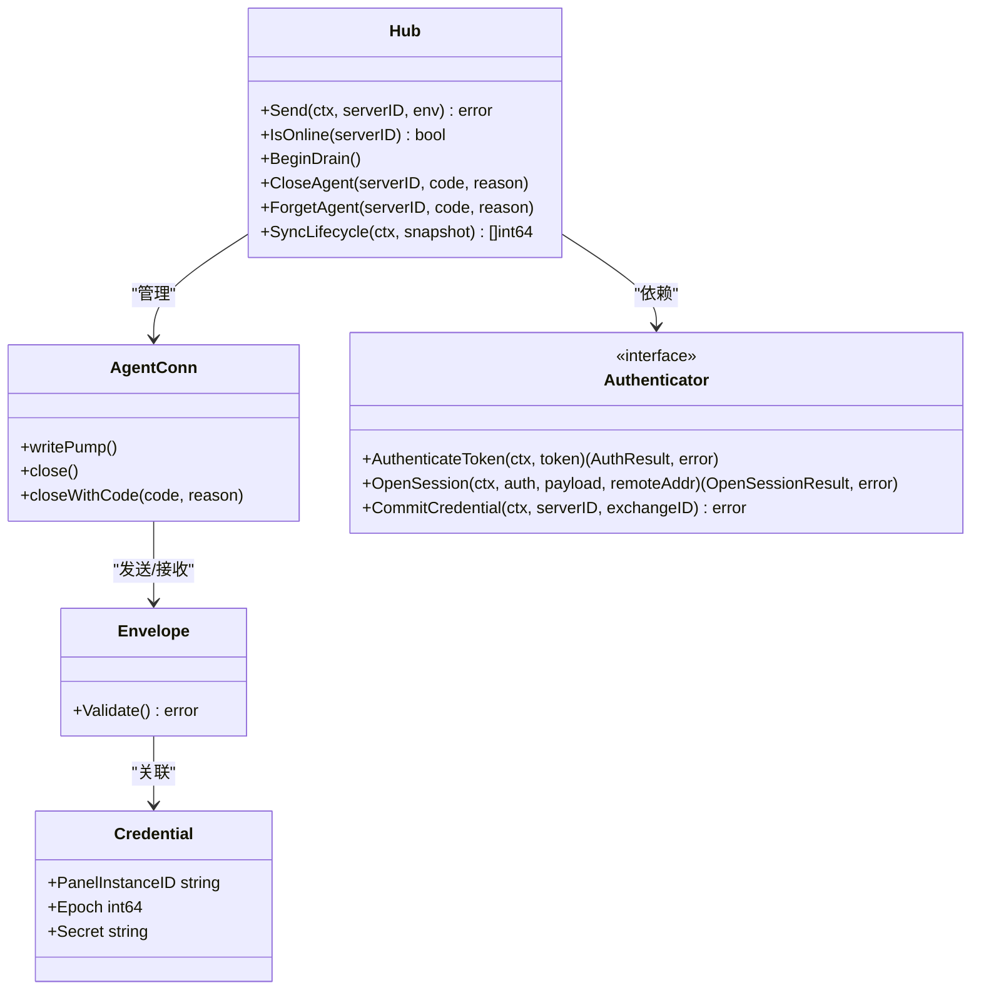

# 连接建立与认证

<cite>
**本文引用的文件**
- [src/backend/internal/ws/agent.go](file://src/backend/internal/ws/agent.go)
- [src/backend/internal/ws/hub.go](file://src/backend/internal/ws/hub.go)
- [src/backend/internal/ws/requester.go](file://src/backend/internal/ws/requester.go)
- [src/shared/messages.go](file://src/shared/messages.go)
- [src/shared/credential.go](file://src/shared/credential.go)
- [src/agent/internal/state/state.go](file://src/agent/internal/state/state.go)
- [docs/ws-protocol.schema.json](file://docs/ws-protocol.schema.json)
</cite>

## 目录
1. [简介](#简介)
2. [项目结构](#项目结构)
3. [核心组件](#核心组件)
4. [架构总览](#架构总览)
5. [详细组件分析](#详细组件分析)
6. [依赖关系分析](#依赖关系分析)
7. [性能考虑](#性能考虑)
8. [故障排查指南](#故障排查指南)
9. [结论](#结论)
10. [附录](#附录)

## 简介
本文面向 Lattix Agent 的 WebSocket 连接建立与认证机制，覆盖以下关键点：
- HTTP 握手与 Bearer Token 认证（Authorization 头部）
- Dialer 配置参数、连接超时设置（服务端侧）
- Session Open 协议的首次连接流程（Agent 发送 SessionOpenPayload，面板返回 SessionOpenResult）
- 凭证交换机制（CredentialExchangeID、CredentialCommit 提交流程、Token 刷新策略）
- 跨面板重新绑定（PanelInstanceID 变更检测与状态重置）
- 完整的连接建立时序图与错误处理策略

## 项目结构
与连接建立和认证相关的代码主要分布在后端 WebSocket 模块、共享协议定义、Agent 本地状态管理以及协议 Schema 中。

**图表来源**
- [src/backend/internal/ws/agent.go:1-120](file://src/backend/internal/ws/agent.go#L1-L120)
- [src/backend/internal/ws/hub.go:1-120](file://src/backend/internal/ws/hub.go#L1-L120)
- [src/backend/internal/ws/requester.go:1-43](file://src/backend/internal/ws/requester.go#L1-L43)
- [src/shared/messages.go:1-140](file://src/shared/messages.go#L1-L140)
- [src/shared/credential.go:1-65](file://src/shared/credential.go#L1-L65)
- [src/agent/internal/state/state.go:1-40](file://src/agent/internal/state/state.go#L1-L40)
- [docs/ws-protocol.schema.json:1-120](file://docs/ws-protocol.schema.json#L1-L120)

**章节来源**
- [src/backend/internal/ws/agent.go:1-120](file://src/backend/internal/ws/agent.go#L1-L120)
- [src/backend/internal/ws/hub.go:1-120](file://src/backend/internal/ws/hub.go#L1-L120)
- [src/shared/messages.go:1-140](file://src/shared/messages.go#L1-L140)
- [src/shared/credential.go:1-65](file://src/shared/credential.go#L1-L65)
- [src/agent/internal/state/state.go:1-40](file://src/agent/internal/state/state.go#L1-L40)
- [docs/ws-protocol.schema.json:1-120](file://docs/ws-protocol.schema.json#L1-L120)

## 核心组件
- Hub（连接中心）
  - 维护 Agent 连接映射、连接状态快照、发送缓冲、心跳超时、优雅关闭等。
- agentConn（单连接封装）
  - 负责串行写出、生命周期 ACK、关闭控制码等。
- Authenticator（认证抽象）
  - AuthenticateToken/OpenSession/CommitCredential 三个方法贯穿握手与会话打开。
- shared.Envelope 与消息类型
  - 统一信封结构、RPC 结果码、消息类型常量、严格 JSON 解析与校验。
- shared.Credential 与 PanelInstanceID
  - 长期凭证结构与面板实例标识生成/解析。
- Agent State（本地持久化）
  - 存储 Token、ServerID、PanelInstanceID、CredentialEpoch、链跳片段等。

**章节来源**
- [src/backend/internal/ws/hub.go:1-120](file://src/backend/internal/ws/hub.go#L1-L120)
- [src/backend/internal/ws/requester.go:1-43](file://src/backend/internal/ws/requester.go#L1-L43)
- [src/shared/messages.go:1-140](file://src/shared/messages.go#L1-L140)
- [src/shared/credential.go:1-65](file://src/shared/credential.go#L1-L65)
- [src/agent/internal/state/state.go:1-40](file://src/agent/internal/state/state.go#L1-L40)

## 架构总览
下图展示从 HTTP 升级到 WS 会话建立、认证、首次 Session Open、凭证提交到就绪注册的完整流程。

**图表来源**
- [src/backend/internal/ws/agent.go:30-210](file://src/backend/internal/ws/agent.go#L30-L210)
- [src/backend/internal/ws/hub.go:229-278](file://src/backend/internal/ws/hub.go#L229-L278)
- [src/backend/internal/ws/requester.go:26-43](file://src/backend/internal/ws/requester.go#L26-L43)
- [src/shared/messages.go:72-91](file://src/shared/messages.go#L72-L91)
- [docs/ws-protocol.schema.json:136-214](file://docs/ws-protocol.schema.json#L136-L214)

## 详细组件分析

### HTTP 握手与 Bearer Token 认证
- Authorization 头部要求为 "Bearer <token>"，服务端通过前缀匹配与去空白提取 token。
- 若缺失或无效，直接返回 403 并附带协议头 X-Lattix-Protocol=1 的响应信封。
- 认证成功时，根据是否重连决定 sessionKind（initial/reconnect）与连接状态（connecting/reconnecting）。
- 升级成功后，在响应头中写入协议版本，供客户端校验。

关键实现点：
- 读取与校验 Bearer Token
- 调用 Authenticator.AuthenticateToken
- 设置协议头与 Upgrade 响应
- 失败路径统一写回错误信封

**章节来源**
- [src/backend/internal/ws/agent.go:44-77](file://src/backend/internal/ws/agent.go#L44-L77)
- [src/backend/internal/ws/agent.go:253-272](file://src/backend/internal/ws/agent.go#L253-L272)

### Dialer 配置参数与连接超时（服务端侧）
- 读超时：首次 session.open 帧等待 10 秒；之后以 pongTimeout（默认 90 秒）作为空闲判定。
- 写超时：单次写操作 10 秒，超时即断开。
- 发送缓冲：每连接 256 条，写满视为慢连接并断开（重连后补发）。
- Ping/Pong：由 Agent 主动 Ping，Panel 原样 Pong 并续期读超时。

这些参数直接影响连接稳定性与资源占用，建议在部署时根据网络质量调整。

**章节来源**
- [src/backend/internal/ws/agent.go:19-23](file://src/backend/internal/ws/agent.go#L19-L23)
- [src/backend/internal/ws/hub.go:15-22](file://src/backend/internal/ws/hub.go#L15-L22)
- [src/backend/internal/ws/agent.go:87-109](file://src/backend/internal/ws/agent.go#L87-L109)

### Session Open 协议与 Payload/Result
- Agent 首帧必须为 agent.session.open，包含：
  - protocol_version（固定为 1）
  - agent_version
  - xray_version
  - xray_running
  - nic_addresses（可选）
  - last_lifecycle（可选）
- 面板返回 response: agent.session.open，包含：
  - server_id
  - session_id
  - session_kind（initial/reconnect）
  - issued_token（用于后续认证）
  - credential_exchange_id（用于凭证交换）
  - panel_state（面板生命周期快照）

校验与错误：
- 非 request 或类型不匹配将触发协议错误并关闭连接。
- data 字段严格反序列化，未知字段将被拒绝。

**章节来源**
- [src/backend/internal/ws/agent.go:86-127](file://src/backend/internal/ws/agent.go#L86-L127)
- [src/shared/messages.go:72-91](file://src/shared/messages.go#L72-L91)
- [docs/ws-protocol.schema.json:136-179](file://docs/ws-protocol.schema.json#L136-L179)

### 凭证交换机制（CredentialExchangeID 与 Commit）
- 首次 session.open 成功后，面板下发 credential_exchange_id。
- Agent 必须在 session.ready 之前发送 agent.credential.commit，携带 exchange_id。
- 面板调用 CommitCredential 完成提交；冲突时返回 CONFLICT。
- 成功后，Agent 再发送 agent.session.ready（含 session_id 与 lifecycle），面板校验 lifecycle 版本一致后登记连接。

设计要点：
- exchange_id 是一次性交换令牌，确保凭证一致性。
- commit 与 ready 的顺序保证幂等与一致性。

**章节来源**
- [src/backend/internal/ws/agent.go:155-195](file://src/backend/internal/ws/agent.go#L155-L195)
- [src/backend/internal/ws/requester.go:36-43](file://src/backend/internal/ws/requester.go#L36-L43)
- [docs/ws-protocol.schema.json:182-214](file://docs/ws-protocol.schema.json#L182-L214)

### Token 刷新策略
- 面板在 session.open 响应中下发 issued_token，Agent 应保存并在后续连接中使用。
- Agent 本地状态持久化 Token、ServerID、PanelInstanceID、CredentialEpoch 等，重启后可恢复。
- 当 PanelInstanceID 变化时，Agent 应触发重新绑定流程（见下一节）。

注意：
- Token 刷新需结合面板生命周期与连接状态，避免频繁切换导致抖动。

**章节来源**
- [src/backend/internal/ws/agent.go:141-153](file://src/backend/internal/ws/agent.go#L141-L153)
- [src/agent/internal/state/state.go:14-23](file://src/agent/internal/state/state.go#L14-L23)

### 跨面板重新绑定（PanelInstanceID 变更检测与状态重置）
- PanelInstanceID 是面板唯一标识，Agent 本地持久化该值。
- 当检测到 PanelInstanceID 变化时，Agent 应：
  - 重置本地状态（包括 Token、CredentialEpoch、链跳片段等）
  - 使用新面板下发的 issued_token 重新建立连接
  - 重新执行 session.open → credential.commit → session.ready 流程

实现建议：
- 在 Agent 启动或收到面板生命周期事件时比对 PanelInstanceID。
- 变更时强制断开旧连接并重建，确保一致性。

**章节来源**
- [src/agent/internal/state/state.go:14-23](file://src/agent/internal/state/state.go#L14-L23)
- [src/shared/credential.go:14-26](file://src/shared/credential.go#L14-L26)

### 连接建立时序图（含错误处理）

**图表来源**
- [src/backend/internal/ws/agent.go:30-210](file://src/backend/internal/ws/agent.go#L30-L210)
- [src/backend/internal/ws/hub.go:229-278](file://src/backend/internal/ws/hub.go#L229-L278)

## 依赖关系分析
- Hub 依赖 Authenticator 接口进行认证与会话打开。
- agent.go 依赖 shared 包中的 Envelope、消息类型常量与校验逻辑。
- Agent 本地状态依赖 shared.Credential 与 PanelInstanceID 生成/解析。
- 协议 Schema 定义了所有信封与数据字段的约束，两端保持一致。

**图表来源**
- [src/backend/internal/ws/hub.go:25-54](file://src/backend/internal/ws/hub.go#L25-L54)
- [src/backend/internal/ws/hub.go:280-318](file://src/backend/internal/ws/hub.go#L280-L318)
- [src/backend/internal/ws/requester.go:18-43](file://src/backend/internal/ws/requester.go#L18-L43)
- [src/shared/messages.go:13-45](file://src/shared/messages.go#L13-L45)
- [src/shared/credential.go:14-18](file://src/shared/credential.go#L14-L18)

**章节来源**
- [src/backend/internal/ws/hub.go:25-54](file://src/backend/internal/ws/hub.go#L25-L54)
- [src/backend/internal/ws/requester.go:18-43](file://src/backend/internal/ws/requester.go#L18-L43)
- [src/shared/messages.go:13-45](file://src/shared/messages.go#L13-L45)
- [src/shared/credential.go:14-18](file://src/shared/credential.go#L14-L18)

## 性能考虑
- 发送缓冲限制（256）可防止慢连接拖垮进程；写满即断开，重连后补发。
- 写超时（10s）与读超时（90s）平衡了延迟与资源占用。
- Ping/Pong 由 Agent 驱动，减少 Panel 额外开销。
- 严格 JSON 解析与校验避免异常报文影响性能。

[本节为通用指导，无需特定文件引用]

## 故障排查指南
常见错误与处理：
- 认证失败（403）：检查 Authorization 头部是否为 "Bearer <token>"，确认 token 有效。
- 协议错误（4002）：首帧必须为 agent.session.open，且 data 字段符合 schema。
- 会话不可用（1013）：OpenSession 失败，检查面板状态与上游依赖。
- 生命周期冲突（CONFLICT）：session.ready 中的 lifecycle 与面板当前不一致，需重试。
- 服务不可用（503）：面板处于 draining 或 faulted 状态，等待恢复。

定位建议：
- 查看 Hub 的 OnProtocolError 回调记录。
- 检查 Agent 本地状态（Token、PanelInstanceID、CredentialEpoch）是否一致。
- 核对 ws-protocol.schema.json 中的字段约束。

**章节来源**
- [src/backend/internal/ws/agent.go:262-272](file://src/backend/internal/ws/agent.go#L262-L272)
- [src/backend/internal/ws/agent.go:285-298](file://src/backend/internal/ws/agent.go#L285-L298)
- [docs/ws-protocol.schema.json:106-132](file://docs/ws-protocol.schema.json#L106-L132)

## 结论
Lattix Agent 的 WebSocket 连接建立与认证机制通过严格的 HTTP 升级、Bearer Token 认证、Session Open 协议与凭证交换流程，确保了连接的安全性与一致性。Hub 与 AgentConn 提供了可靠的连接管理与生命周期控制，shared 包定义了统一的协议与数据结构，Agent 本地状态则保障了重启后的可恢复性。通过合理的超时、缓冲与错误处理策略，系统在高负载与不稳定网络下仍能保持稳定。

[本节为总结，无需特定文件引用]

## 附录
- 协议 Schema 参考：docs/ws-protocol.schema.json
- 消息类型与结果码：src/shared/messages.go
- 凭证结构与面板实例 ID：src/shared/credential.go
- Agent 本地状态：src/agent/internal/state/state.go

[本节为参考信息，无需特定文件引用]