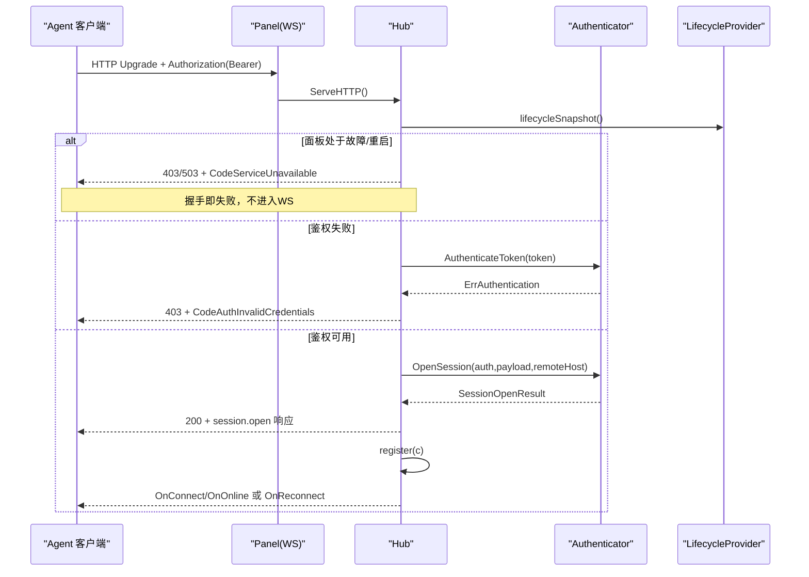

# 重连策略与容错

<cite>
**本文引用的文件**   
- [agent.go](file://src/backend/internal/ws/agent.go)
- [hub.go](file://src/backend/internal/ws/hub.go)
- [messages.go](file://src/shared/messages.go)
- [agent_settings.go](file://src/shared/agent_settings.go)
- [main.go](file://src/backend/cmd/backend/main.go)
- [hub_test.go](file://src/backend/internal/ws/hub_test.go)
</cite>

## 目录
1. [简介](#简介)
2. [项目结构](#项目结构)
3. [核心组件](#核心组件)
4. [架构总览](#架构总览)
5. [详细组件分析](#详细组件分析)
6. [依赖关系分析](#依赖关系分析)
7. [性能考量](#性能考量)
8. [故障排查指南](#故障排查指南)
9. [结论](#结论)
10. [附录](#附录)

## 简介
本文件聚焦 Lattix Agent 的 WebSocket 重连策略与容错机制，系统性说明：
- 重连触发条件与连接异常分类（网络错误、认证失败、面板不可用等）
- 错误码识别与处理逻辑
- 指数退避算法的实现要点（含最大重试次数、随机抖动）
- 面板不可用场景的特殊处理（服务降级、用户提示）
- 认证拒绝的终止策略（自动重试停止、重新安装引导）
- 重连策略的配置项与调优建议

## 项目结构
后端通过 Hub 管理所有 Agent 的 WebSocket 连接，Agent 在握手阶段完成鉴权与会话建立；Hub 负责连接生命周期、状态快照、离线命令补发、以及重连事件通知。共享协议类型定义于 shared 包，Agent 侧的重连策略由 AgentSettings 驱动。

```mermaid
graph TB
subgraph "后端"
A["ws.Hub<br/>连接注册表/状态/超时"] --> B["ws.ServeHTTP<br/>握手/鉴权/会话打开"]
B --> C["Authenticator<br/>令牌校验/会话打开"]
A --> D["LifecycleProvider<br/>面板生命周期快照"]
A --> E["OnConnect/OnOnline/OnReconnect/OnDisconnect<br/>回调"]
end
subgraph "共享协议"
F["shared.Envelope<br/>统一信封/错误码"]
G["shared.AgentSettings<br/>重连模式/最大重试"]
end
subgraph "Agent"
H["Agent 客户端<br/>指数退避/抖动/重试控制"]
end
H < --> |WebSocket| B
A --- F
H --- G
```

图表来源
- [agent.go:33-129](file://src/backend/internal/ws/agent.go#L33-L129)
- [hub.go:26-63](file://src/backend/internal/ws/hub.go#L26-L63)
- [messages.go:14-70](file://src/shared/messages.go#L14-L70)
- [agent_settings.go:28-64](file://src/shared/agent_settings.go#L28-L64)

章节来源
- [agent.go:33-129](file://src/backend/internal/ws/agent.go#L33-L129)
- [hub.go:26-63](file://src/backend/internal/ws/hub.go#L26-L63)
- [messages.go:14-70](file://src/shared/messages.go#L14-L70)
- [agent_settings.go:28-64](file://src/shared/agent_settings.go#L28-L64)

## 核心组件
- Hub：维护 Agent 连接集合、连接状态快照、发送缓冲、写超时、Pong 超时、优雅关闭与排空（drain）、重连事件分发。
- ServeHTTP：完成 HTTP 升级、鉴权、会话打开、注册、读循环、心跳续期、协议错误上报。
- shared.Envelope：统一消息信封与业务错误码，贯穿 HTTP 与 WS 通道。
- AgentSettings：Agent 侧重连模式（无限/有限）、最大重试次数、遥测与漂移检测间隔。

章节来源
- [hub.go:16-63](file://src/backend/internal/ws/hub.go#L16-L63)
- [agent.go:33-129](file://src/backend/internal/ws/agent.go#L33-L129)
- [messages.go:14-70](file://src/shared/messages.go#L14-L70)
- [agent_settings.go:28-64](file://src/shared/agent_settings.go#L28-L64)

## 架构总览
下图展示从握手到会话建立、再到在线/重连事件分发的关键流程，以及面板不可用与认证失败的快速失败路径。



图表来源
- [agent.go:33-129](file://src/backend/internal/ws/agent.go#L33-L129)
- [hub.go:230-261](file://src/backend/internal/ws/hub.go#L230-L261)
- [messages.go:54-70](file://src/shared/messages.go#L54-L70)

章节来源
- [agent.go:33-129](file://src/backend/internal/ws/agent.go#L33-L129)
- [hub.go:230-261](file://src/backend/internal/ws/hub.go#L230-L261)

## 详细组件分析

### 连接异常分类与错误码识别
- 握手阶段异常
  - 面板不可用/重启：返回 503 并附带 CodeServiceUnavailable，Agent 应视为“面板不可用”，走“不可用重试延迟”与降级策略。
  - 认证失败：返回 403 并附带 CodeAuthInvalidCredentials，Agent 应视为“认证拒绝”，立即停止自动重试，提示重新安装或更新凭据。
  - 协议错误：如首个帧非 agent.session.open、数据校验失败，返回 CloseMessage 并断开，Agent 按网络错误处理。
- 运行期异常
  - 网络错误：读写超时、连接中断、写缓冲满导致断开，Agent 按网络错误进行指数退避重试。
  - 面板状态变化：BeginDrain/CloseAllAgents 使用 RFC 1012/1013 等关闭码，Agent 可据此选择快速重试路径。

章节来源
- [agent.go:33-79](file://src/backend/internal/ws/agent.go#L33-L79)
- [agent.go:89-129](file://src/backend/internal/ws/agent.go#L89-L129)
- [agent.go:264-274](file://src/backend/internal/ws/agent.go#L264-L274)
- [hub.go:156-173](file://src/backend/internal/ws/hub.go#L156-L173)
- [messages.go:54-70](file://src/shared/messages.go#L54-L70)

### 指数退避与抖动实现要点
- 触发条件
  - 网络错误（读写超时、连接断开、写缓冲满）
  - 面板不可用（握手 503/CodeServiceUnavailable）
  - 会话打开失败（OpenSession 错误）
- 计算逻辑
  - 基础延迟：以固定基数开始（例如秒级），每次失败后倍增（指数增长）。
  - 上限限制：受限于 AgentSettings.Reconnect.MaxRetries，达到上限后停止自动重试。
  - 随机抖动：在每次计算出的延迟上叠加一定比例的随机抖动，避免多节点同时重连造成雪崩。
- 模式控制
  - ReconnectModeInfinite：无上限，直到成功或外部干预。
  - ReconnectModeLimited：受 MaxRetries 限制，超过则停止并重试策略失效。

章节来源
- [agent_settings.go:8-17](file://src/shared/agent_settings.go#L8-L17)
- [agent_settings.go:28-64](file://src/shared/agent_settings.go#L28-L64)

### 面板不可用场景的特殊处理
- 握手阶段直接拒绝：返回 503 + CodeServiceUnavailable，Agent 应立即切换为“不可用重试延迟”（unavailableRetryDelay），该延迟通常大于普通网络错误的退避延迟。
- 服务降级策略：在不可用期间，Agent 可暂停业务命令下发，仅维持心跳与最小化探测；恢复后通过 OnConnect/OnOnline 触发离线命令补发。
- 用户提示机制：前端/控制台显示“面板不可用”，并提供“稍后重试”或“查看面板状态”入口。

章节来源
- [agent.go:33-44](file://src/backend/internal/ws/agent.go#L33-L44)
- [agent.go:264-274](file://src/backend/internal/ws/agent.go#L264-L274)
- [hub.go:156-173](file://src/backend/internal/ws/hub.go#L156-L173)

### 认证拒绝的终止策略
- 标志设置：当 AuthenticateToken 返回 ErrAuthentication 时，Agent 应设置 AuthRejected 标志，表示凭据无效或被拒绝。
- 自动重试停止：一旦标记为认证拒绝，立即停止自动重试，避免无效消耗。
- 重新安装引导：提示用户检查安装参数、令牌有效性或执行重新安装流程。

章节来源
- [agent.go:45-59](file://src/backend/internal/ws/agent.go#L45-L59)
- [messages.go:54-70](file://src/shared/messages.go#L54-L70)

### 连接状态与事件分发
- 连接状态快照：Hub 维护每个 ServerID 的连接状态（从未连接/离线/在线/重连中），用于对外查询与监控。
- 事件回调：
  - OnConnect：session.ready 完成后触发，用于离线命令补发。
  - OnOnline：首次上线时触发（offline→online）。
  - OnReconnect：已有连接被新连接替换时触发（不伪造 offline→online）。
  - OnDisconnect：真实下线时触发（连接从注册表移除）。

章节来源
- [hub.go:26-63](file://src/backend/internal/ws/hub.go#L26-L63)
- [hub.go:230-261](file://src/backend/internal/ws/hub.go#L230-L261)
- [hub_test.go:110-129](file://src/backend/internal/ws/hub_test.go#L110-L129)

### 心跳与超时
- 读超时：默认 pongTimeoutDefault=90s，Agent 每 30s 主动 Ping，Panel 原样 Pong 并续期读超时。
- 写超时：writeTimeout=10s，单次写操作超时即判定连接死亡。
- 慢连接处理：sendBuffer 满时断开连接，重连后补发 queued 命令。

章节来源
- [hub.go:16-23](file://src/backend/internal/ws/hub.go#L16-L23)
- [agent.go:102-111](file://src/backend/internal/ws/agent.go#L102-L111)
- [hub.go:111-139](file://src/backend/internal/ws/hub.go#L111-L139)

### 重连策略配置与调优建议
- 配置项
  - reconnect.mode：infinite/limited
  - reconnect.max_retries：1~100
  - telemetry.interval_seconds：10~3600
  - drift_detection.interval_seconds：5~3600
- 调优建议
  - 高并发环境：适当增大 max_retries，结合抖动降低雪崩概率。
  - 弱网环境：提高初始退避基数与抖动比例，缩短 telemetry 间隔以便更快感知恢复。
  - 面板频繁重启：优先使用 unavailableRetryDelay，避免与普通网络错误混用。

章节来源
- [agent_settings.go:8-17](file://src/shared/agent_settings.go#L8-L17)
- [agent_settings.go:28-64](file://src/shared/agent_settings.go#L28-L64)

## 依赖关系分析
- Hub 依赖 Authenticator 与 LifecycleProvider 完成鉴权与生命周期快照。
- Envelope 与错误码在 Panel 与 Agent 间保持一致，确保两端对错误语义的统一理解。
- AgentSettings 由 Panel 下发并持久化，Agent 据此决定重连行为。

```mermaid
classDiagram
class Hub {
+IsOnline(serverID) bool
+Send(ctx, serverID, env) error
+BeginDrain()
+SyncLifecycle(ctx, snapshot) []int64
+OnConnect(serverID)
+OnOnline(serverID)
+OnReconnect(serverID)
+OnDisconnect(serverID)
}
class AgentConn {
+close()
+closeWithCode(code, reason)
+registerLifecycleAck(requestID) <-chan struct{}
+resolveLifecycleAck(requestID) bool
}
class Envelope {
+Kind string
+Type string
+RequestID string
+TraceID string
+Code string
+Message string
+Data json.RawMessage
}
class AgentSettings {
+Revision int64
+Reconnect AgentReconnectSettings
+Telemetry AgentIntervalSettings
+DriftDetection AgentIntervalSettings
}
Hub --> AgentConn : "管理"
Hub --> Envelope : "发送/接收"
AgentConn --> Envelope : "序列化/反序列化"
AgentSettings --> Hub : "影响重连策略"
```

图表来源
- [hub.go:26-63](file://src/backend/internal/ws/hub.go#L26-L63)
- [hub.go:281-318](file://src/backend/internal/ws/hub.go#L281-L318)
- [messages.go:14-70](file://src/shared/messages.go#L14-L70)
- [agent_settings.go:28-64](file://src/shared/agent_settings.go#L28-L64)

章节来源
- [hub.go:26-63](file://src/backend/internal/ws/hub.go#L26-L63)
- [messages.go:14-70](file://src/shared/messages.go#L14-L70)
- [agent_settings.go:28-64](file://src/shared/agent_settings.go#L28-L64)

## 性能考量
- 写缓冲与慢连接：sendBuffer=256，满则断开并依赖重连补发，避免阻塞主循环。
- 心跳与超时：90s 未收到任何字节判定连接死亡，10s 写超时保护。
- 批量同步：SyncLifecycle 并行等待 ACK，减少长尾等待。
- 事件去抖：OnReconnect 不伪造 offline→online，避免重复告警与日志噪声。

章节来源
- [hub.go:16-23](file://src/backend/internal/ws/hub.go#L16-L23)
- [hub.go:320-378](file://src/backend/internal/ws/hub.go#L320-L378)

## 故障排查指南
- 握手失败
  - 403 + CodeAuthInvalidCredentials：检查令牌、安装参数、证书链。
  - 503 + CodeServiceUnavailable：检查面板状态、是否处于重启/故障。
- 连接中断
  - 网络错误：观察日志中的 ws upgrade/read/write 错误，确认网络连通性与代理配置。
  - 写缓冲满：检查下游 Agent 处理能力与带宽，必要时扩容或限流。
- 事件异常
  - OnReconnect 未触发：确认 Hub.register 是否被调用，旧连接是否被正确踢掉。
  - OnDisconnect 误报：检查 unregister 是否因新连接顶替而提前触发。

章节来源
- [agent.go:33-79](file://src/backend/internal/ws/agent.go#L33-L79)
- [hub.go:230-279](file://src/backend/internal/ws/hub.go#L230-L279)
- [hub_test.go:110-129](file://src/backend/internal/ws/hub_test.go#L110-L129)

## 结论
Lattix Agent 的 WebSocket 重连策略以 Hub 为中心，结合 shared 协议与 AgentSettings 配置，实现了稳健的错误分类、指数退避与抖动、面板不可用降级与认证拒绝终止。通过明确的事件回调与状态快照，系统可在复杂网络与面板生命周期变化下保持高可用与一致性。

## 附录
- 相关常量与默认值
  - writeTimeout=10s，pongTimeoutDefault=90s，sendBuffer=256
  - DefaultReconnectMaxRetries=10，Telemetry/Drift 默认间隔
- 错误码参考
  - CodeOK、CodeServiceUnavailable、CodeAuthInvalidCredentials、CodeInternalError 等

章节来源
- [hub.go:16-23](file://src/backend/internal/ws/hub.go#L16-L23)
- [agent_settings.go:8-17](file://src/shared/agent_settings.go#L8-L17)
- [messages.go:54-70](file://src/shared/messages.go#L54-L70)