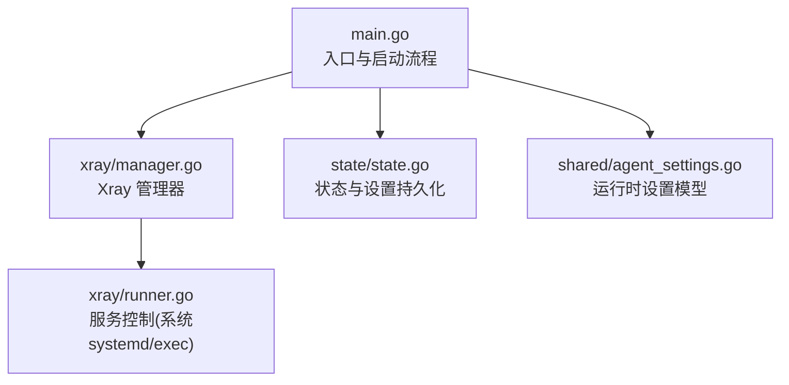
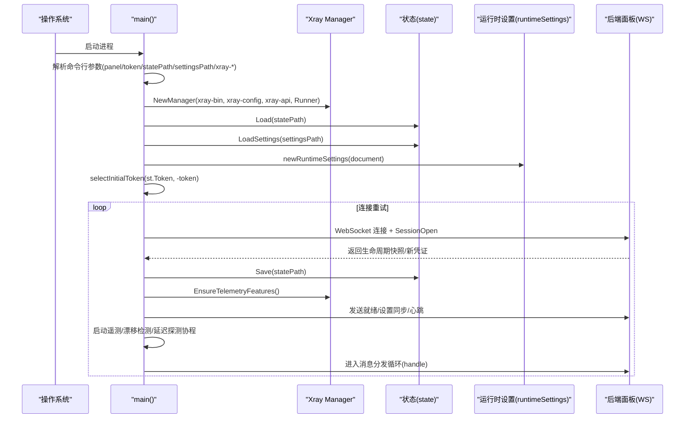
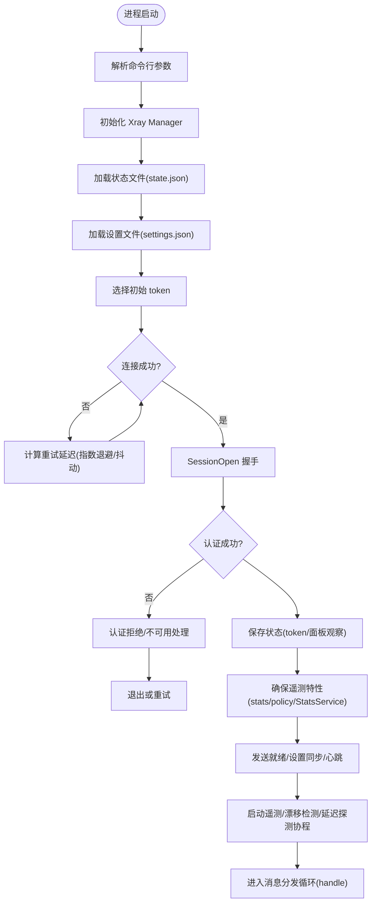
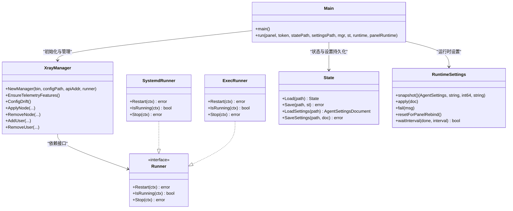

# 主程序启动流程

<cite>
**本文引用的文件**   
- [src/agent/cmd/agent/main.go](file://src/agent/cmd/agent/main.go)
- [src/agent/internal/xray/manager.go](file://src/agent/internal/xray/manager.go)
- [src/agent/internal/xray/runner.go](file://src/agent/internal/xray/runner.go)
- [src/agent/internal/state/state.go](file://src/agent/internal/state/state.go)
- [src/shared/agent_settings.go](file://src/shared/agent_settings.go)
</cite>

## 目录
1. [简介](#简介)
2. [项目结构](#项目结构)
3. [核心组件](#核心组件)
4. [架构总览](#架构总览)
5. [详细组件分析](#详细组件分析)
6. [依赖关系分析](#依赖关系分析)
7. [性能考量](#性能考量)
8. [故障排查指南](#故障排查指南)
9. [结论](#结论)

## 简介
本文面向 Lattix Agent 主程序的启动流程，聚焦 main() 函数的执行路径与关键初始化步骤：命令行参数解析（panel、token、statePath、settingsPath、xray-bin 等）、Xray Manager 初始化、状态文件加载、运行时设置配置、首次连接与认证、以及错误处理策略。文档同时给出启动流程图和关键代码片段路径，帮助开发者快速理解 Agent 的启动逻辑与模块协作顺序。

## 项目结构
Agent 主程序位于 src/agent/cmd/agent，核心启动逻辑在 main.go；Xray 管理在 internal/xray；本地状态在 internal/state；共享配置模型在 shared。

图表来源
- [src/agent/cmd/agent/main.go:33-98](file://src/agent/cmd/agent/main.go#L33-L98)
- [src/agent/internal/xray/manager.go:46-55](file://src/agent/internal/xray/manager.go#L46-L55)
- [src/agent/internal/state/state.go:40-73](file://src/agent/internal/state/state.go#L40-L73)
- [src/shared/agent_settings.go:54-64](file://src/shared/agent_settings.go#L54-L64)
- [src/agent/internal/xray/runner.go:28-33](file://src/agent/internal/xray/runner.go#L28-L33)

章节来源
- [src/agent/cmd/agent/main.go:33-98](file://src/agent/cmd/agent/main.go#L33-L98)

## 核心组件
- 命令行参数与入口：解析 panel、token、statePath、settingsPath、xray-bin、xray-config、xray-api、xray-runner、releaseBase、version 等参数，并进入主循环建立 WS 连接。
- Xray 管理器：负责模板填充、校验、原子落盘、gRPC 热操作、重启兜底与回滚、漂移检测、遥测特性保障。
- 状态存储：持久化 token、面板实例信息、链 piece 记录、面板观察快照等。
- 运行时设置：从 settings.json 加载并维护 Agent 行为（重连策略、遥测间隔、漂移检测间隔）。

章节来源
- [src/agent/cmd/agent/main.go:33-98](file://src/agent/cmd/agent/main.go#L33-L98)
- [src/agent/internal/xray/manager.go:24-40](file://src/agent/internal/xray/manager.go#L24-L40)
- [src/agent/internal/state/state.go:14-23](file://src/agent/internal/state/state.go#L14-L23)
- [src/shared/agent_settings.go:37-52](file://src/shared/agent_settings.go#L37-L52)

## 架构总览
下图展示 Agent 启动时的关键交互：参数解析 → 初始化 Xray 管理器 → 加载状态与设置 → 选择初始 token → 进入连接循环 → 首次会话打开与认证 → 启动心跳、遥测、漂移检测等后台协程。

图表来源
- [src/agent/cmd/agent/main.go:33-98](file://src/agent/cmd/agent/main.go#L33-L98)
- [src/agent/cmd/agent/main.go:141-261](file://src/agent/cmd/agent/main.go#L141-L261)
- [src/agent/internal/xray/manager.go:404-458](file://src/agent/internal/xray/manager.go#L404-L458)
- [src/agent/internal/state/state.go:40-73](file://src/agent/internal/state/state.go#L40-L73)
- [src/shared/agent_settings.go:54-64](file://src/shared/agent_settings.go#L54-L64)

## 详细组件分析

### 命令行参数解析与入口流程
- 支持的参数包括：
  - panel：后端 WS 地址
  - token：首次引导令牌（若 state 已有长期凭证则忽略）
  - state：长期凭证状态文件路径
  - settings：面板同步设置文件路径
  - xray-bin：xray 二进制路径
  - xray-config：xray 配置文件路径（agent 独占管理）
  - xray-api：xray gRPC API 地址
  - xray-runner：xray 服务控制方式（systemd | exec）
  - xray-release-base：xray release 下载基址（可指向镜像）
  - version：打印版本并退出
- 解析后创建 Xray Manager，必要时设置 releaseBase；加载状态与设置；选择初始 token；进入连接循环。

章节来源
- [src/agent/cmd/agent/main.go:33-48](file://src/agent/cmd/agent/main.go#L33-L48)
- [src/agent/cmd/agent/main.go:50-68](file://src/agent/cmd/agent/main.go#L50-L68)

### Xray 管理器初始化与职责
- 构造函数接收二进制路径、配置文件路径、API 地址与 Runner（systemd 或 exec），内部初始化 HotClient 用于 gRPC 热操作。
- 支持覆盖 releaseBase（镜像/代理场景）。
- 提供版本查询、运行状态检查、配置漂移检测、遥测特性保障、节点/用户增删、链跳 piece 管理等能力。

章节来源
- [src/agent/internal/xray/manager.go:46-55](file://src/agent/internal/xray/manager.go#L46-L55)
- [src/agent/internal/xray/manager.go:57-61](file://src/agent/internal/xray/manager.go#L57-L61)
- [src/agent/internal/xray/manager.go:86-96](file://src/agent/internal/xray/manager.go#L86-L96)
- [src/agent/internal/xray/manager.go:289-311](file://src/agent/internal/xray/manager.go#L289-L311)
- [src/agent/internal/xray/manager.go:404-458](file://src/agent/internal/xray/manager.go#L404-L458)

### 状态文件加载与持久化
- 状态文件包含：长期 token、服务器 ID、面板实例 ID、凭证 epoch、面板观察快照、认证拒绝标记、链 piece 记录。
- 读取失败或缺失时返回零值 State；保存采用 tmp+rename 原子写入，权限 0600。
- 设置文件按 schema 验证后持久化，同样采用原子写入。

章节来源
- [src/agent/internal/state/state.go:14-23](file://src/agent/internal/state/state.go#L14-L23)
- [src/agent/internal/state/state.go:40-57](file://src/agent/internal/state/state.go#L40-L57)
- [src/agent/internal/state/state.go:59-73](file://src/agent/internal/state/state.go#L59-L73)
- [src/agent/internal/state/state.go:75-91](file://src/agent/internal/state/state.go#L75-L91)
- [src/agent/internal/state/state.go:93-109](file://src/agent/internal/state/state.go#L93-L109)

### 运行时设置配置
- 从 settings.json 加载 AgentSettingsDocument，默认使用内置默认值。
- 运行时通过 snapshot/fail/resetForPanelRebind/waitInterval 等方法暴露当前设置、错误信息与等待间隔。
- 重连策略支持无限/有限模式，带抖动与指数退避；面板生命周期状态影响重试延迟。

章节来源
- [src/agent/cmd/agent/runtime_settings.go:29-40](file://src/agent/cmd/agent/runtime_settings.go#L29-L40)
- [src/agent/cmd/agent/runtime_settings.go:42-99](file://src/agent/cmd/agent/runtime_settings.go#L42-L99)
- [src/agent/cmd/agent/runtime_settings.go:101-119](file://src/agent/cmd/agent/runtime_settings.go#L101-L119)
- [src/shared/agent_settings.go:54-64](file://src/shared/agent_settings.go#L54-L64)
- [src/shared/agent_settings.go:66-83](file://src/shared/agent_settings.go#L66-L83)

### 首次连接与会话建立
- 使用 Bearer token 发起 WS 连接，设置读超时与最大消息大小。
- 发送 SessionOpen，携带 Agent 版本、Xray 版本与运行状态、网卡地址、面板生命周期版本。
- 解析响应，必要时换发新 token，跨面板重新绑定时重置 Xray 配置与状态。
- 保存状态（token、serverID、面板实例 ID、凭证 epoch、面板观察快照），确保幂等与一致性。
- 启用遥测特性（stats/policy/StatsService），必要时重启 Xray。
- 可选凭证交换流程、发送 liveness、标记 session ready、发送设置同步。
- 启动心跳、延迟探测、遥测上报、漂移检测、周期性设置拉取等协程。

章节来源
- [src/agent/cmd/agent/main.go:141-261](file://src/agent/cmd/agent/main.go#L141-L261)
- [src/agent/cmd/agent/main.go:238-240](file://src/agent/cmd/agent/main.go#L238-L240)
- [src/agent/cmd/agent/main.go:247-261](file://src/agent/cmd/agent/main.go#L247-L261)
- [src/agent/cmd/agent/main.go:262-386](file://src/agent/cmd/agent/main.go#L262-L386)

### 错误处理机制
- 认证被拒绝：当面板明确拒绝凭证（HTTP 403 + 协议头 + 特定信封），停止自动重试，等待外部信号终止进程，避免无限重试。
- 面板不可用：识别 503 状态码，使用更长重试间隔。
- 连接失败：根据关闭码与设置进行指数退避与抖动；受面板生命周期状态影响的最小/最大重试延迟。
- 状态/设置加载失败：记录日志并继续以默认值运行；状态落盘失败由内存兜底，但重启前未落盘需凭证刷新。
- Xray 配置损坏：备份为 .broken，重建骨架配置并合并链 piece 记录；漂移修复以净化配置为基。

章节来源
- [src/agent/cmd/agent/main.go:69-97](file://src/agent/cmd/agent/main.go#L69-L97)
- [src/agent/cmd/agent/runtime_settings.go:121-155](file://src/agent/cmd/agent/runtime_settings.go#L121-L155)
- [src/agent/internal/xray/manager.go:336-375](file://src/agent/internal/xray/manager.go#L336-L375)

### 启动流程图

图表来源
- [src/agent/cmd/agent/main.go:33-98](file://src/agent/cmd/agent/main.go#L33-L98)
- [src/agent/cmd/agent/main.go:141-261](file://src/agent/cmd/agent/main.go#L141-L261)
- [src/agent/cmd/agent/runtime_settings.go:101-119](file://src/agent/cmd/agent/runtime_settings.go#L101-L119)

## 依赖关系分析
- main.go 依赖：
  - xray.Manager：管理与控制 xray 进程与配置
  - state.Load/Save：持久化状态与设置
  - runtimeSettings：运行时设置与重连策略
  - shared 包：消息信封、设置模型、生命周期快照等
- xray.Manager 依赖：
  - Runner：systemd 或 exec 两种实现，负责重启/停止/运行状态查询
  - HotClient：gRPC 热操作客户端（替换 inbound、添加/删除用户、查询统计）
- 状态与设置：
  - state.State：持久化 token、面板实例、链 piece 等
  - shared.AgentSettingsDocument：面板下发的 Agent 设置文档

图表来源
- [src/agent/cmd/agent/main.go:33-98](file://src/agent/cmd/agent/main.go#L33-L98)
- [src/agent/internal/xray/manager.go:24-40](file://src/agent/internal/xray/manager.go#L24-L40)
- [src/agent/internal/xray/runner.go:16-33](file://src/agent/internal/xray/runner.go#L16-L33)
- [src/agent/internal/state/state.go:14-23](file://src/agent/internal/state/state.go#L14-L23)
- [src/agent/cmd/agent/runtime_settings.go:20-40](file://src/agent/cmd/agent/runtime_settings.go#L20-L40)

章节来源
- [src/agent/cmd/agent/main.go:33-98](file://src/agent/cmd/agent/main.go#L33-L98)
- [src/agent/internal/xray/manager.go:24-40](file://src/agent/internal/xray/manager.go#L24-L40)
- [src/agent/internal/xray/runner.go:16-33](file://src/agent/internal/xray/runner.go#L16-L33)
- [src/agent/internal/state/state.go:14-23](file://src/agent/internal/state/state.go#L14-L23)
- [src/agent/cmd/agent/runtime_settings.go:20-40](file://src/agent/cmd/agent/runtime_settings.go#L20-L40)

## 性能考量
- WS 读写超时与心跳：读超时 90s，写控制帧超时 10s，单条消息上限 1MB，避免资源耗尽。
- 指数退避与抖动：重连延迟指数增长，上限 30s，附加 ±20% 抖动，降低风暴风险。
- 面板生命周期影响重试：更新/故障态下使用最小/最大重试区间随机化。
- Xray 配置变更原子性：临时文件 + 校验 + 备份 + 原子替换，减少停机与不一致。
- 漂移检测周期：默认 15s，避免频繁 IO 与网络开销。

章节来源
- [src/agent/cmd/agent/main.go:118-127](file://src/agent/cmd/agent/main.go#L118-L127)
- [src/agent/cmd/agent/runtime_settings.go:101-119](file://src/agent/cmd/agent/runtime_settings.go#L101-L119)
- [src/agent/internal/xray/manager.go:235-287](file://src/agent/internal/xray/manager.go#L235-L287)
- [src/shared/agent_settings.go:15-17](file://src/shared/agent_settings.go#L15-L17)

## 故障排查指南
- 认证被拒绝：
  - 现象：连接后立即收到 403 + 协议头 + 特定信封，Agent 停止自动重试。
  - 处理：使用新的面板安装命令重新绑定，然后重启 Agent。
- 面板不可用：
  - 现象：503 响应，触发较长重试间隔。
  - 处理：检查后端健康与网络连通性。
- 状态/设置加载失败：
  - 现象：日志提示 load state/settings 失败，使用默认值继续。
  - 处理：检查文件权限与内容格式，必要时恢复备份。
- Xray 配置损坏：
  - 现象：config.json 解析失败，备份为 .broken 并重建骨架。
  - 处理：检查外部修改，确认链 piece 记录是否完整。
- 漂移检测：
  - 现象：检测到 config.json 被外部修改，上报漂移事件。
  - 处理：避免外部直接编辑，使用 Agent 提供的 API 变更配置。

章节来源
- [src/agent/cmd/agent/main.go:69-97](file://src/agent/cmd/agent/main.go#L69-L97)
- [src/agent/cmd/agent/runtime_settings.go:121-155](file://src/agent/cmd/agent/runtime_settings.go#L121-L155)
- [src/agent/internal/xray/manager.go:336-375](file://src/agent/internal/xray/manager.go#L336-L375)

## 结论
Lattix Agent 的启动流程围绕“参数解析 → Xray 管理器初始化 → 状态与设置加载 → 首次连接与认证 → 后台协程启动”展开，具备完善的错误处理与重试机制。Xray 管理器保证配置的原子性与可回滚，状态与设置持久化确保重启一致性与幂等。通过心跳、遥测、漂移检测与延迟探测，Agent 能够稳定地与面板协同工作，并在异常情况下优雅降级与恢复。