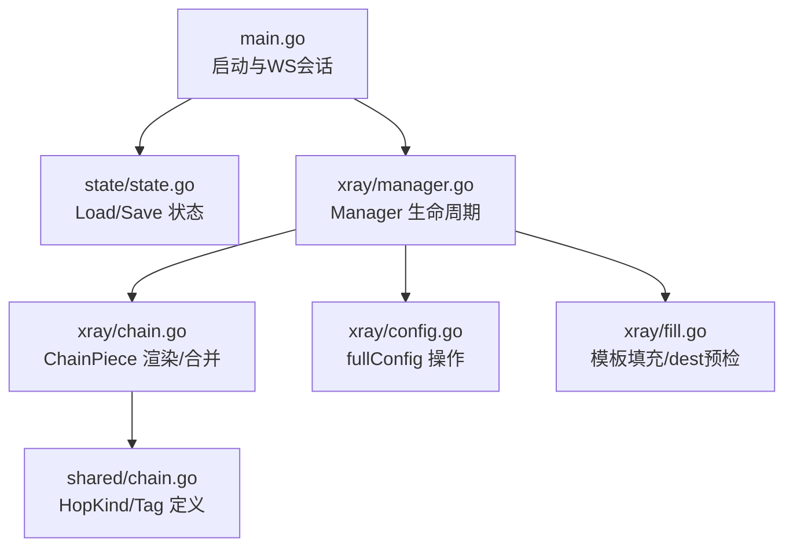
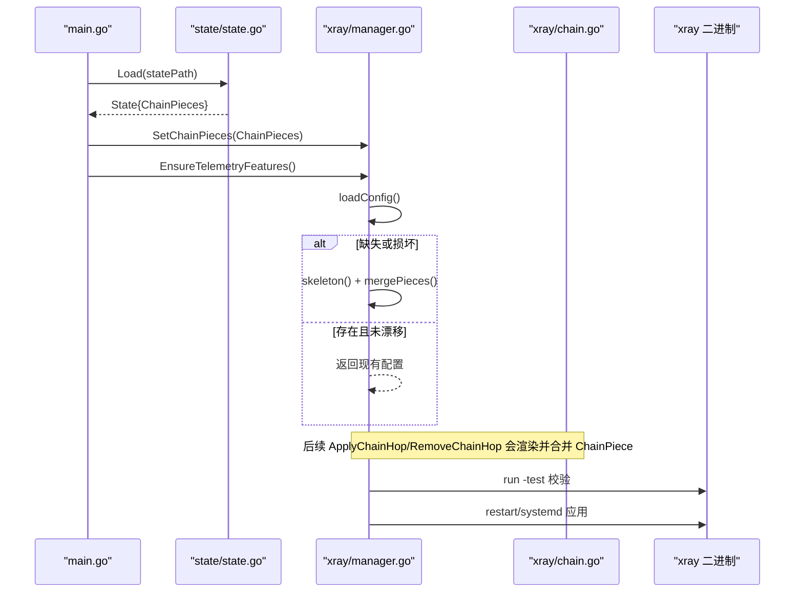
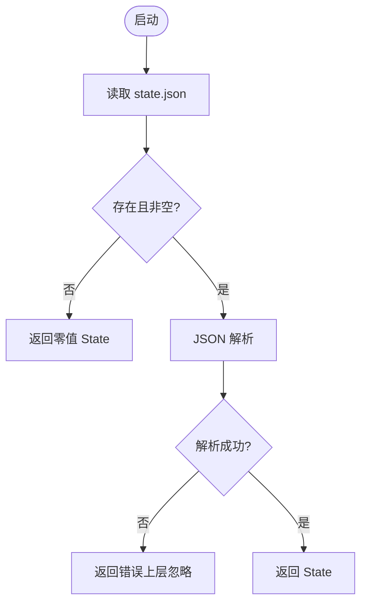
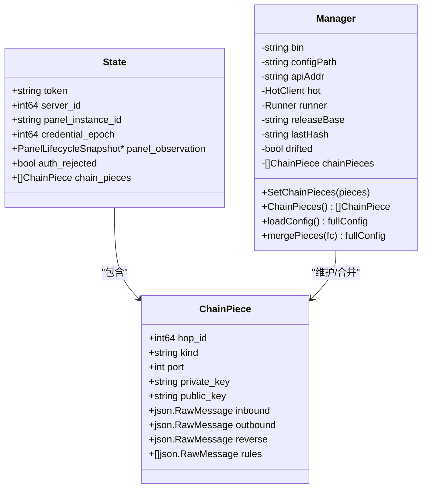
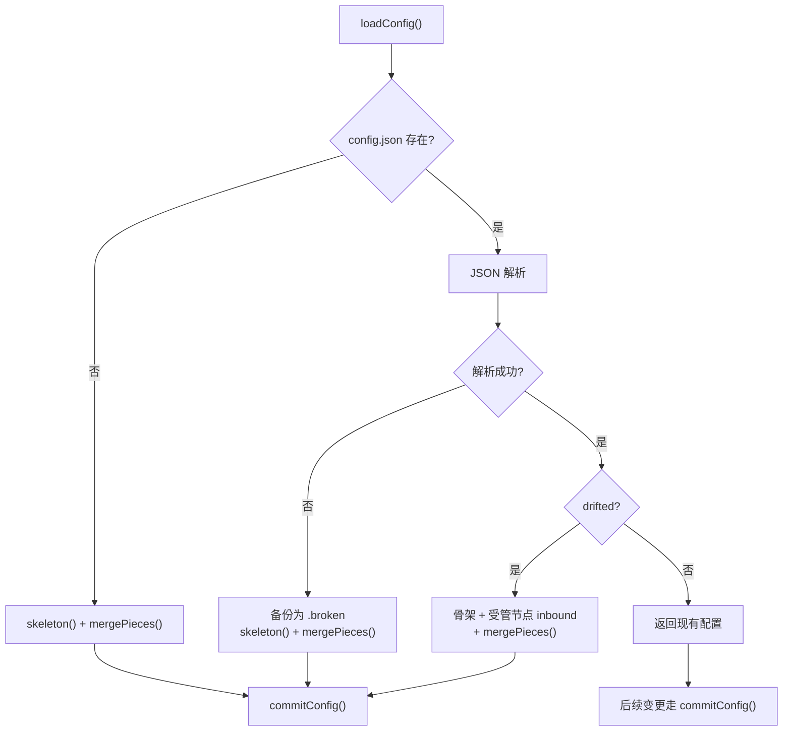
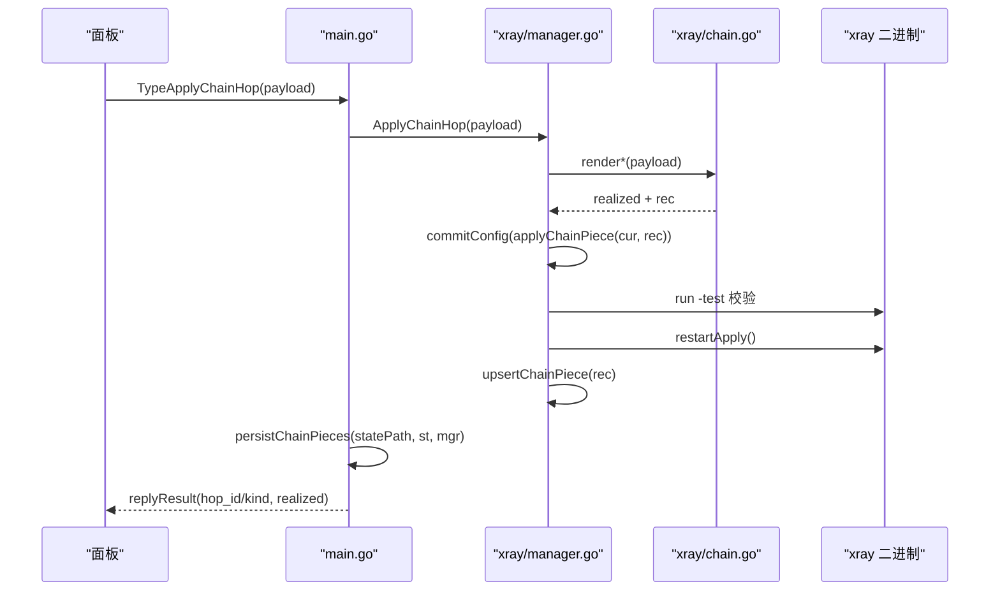
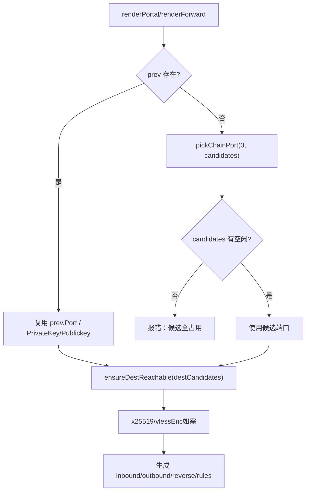
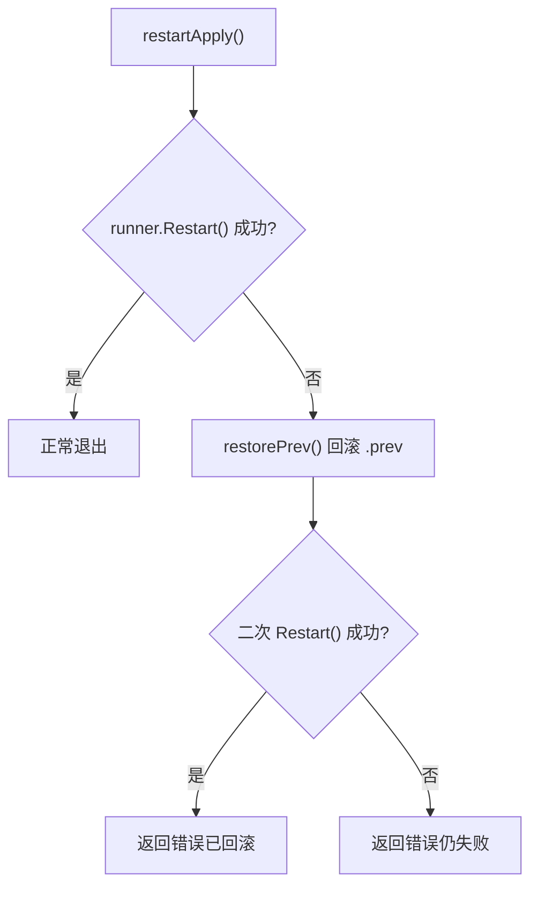
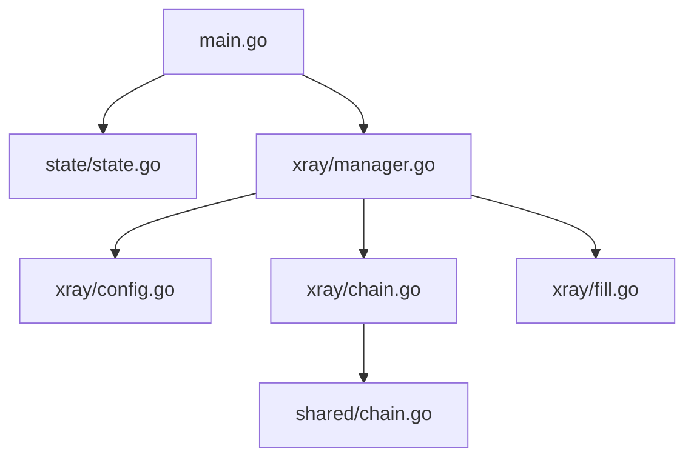

# 状态恢复机制

<cite>
**本文引用的文件**
- [src/agent/cmd/agent/main.go](file://src/agent/cmd/agent/main.go)
- [src/agent/internal/state/state.go](file://src/agent/internal/state/state.go)
- [src/agent/internal/xray/manager.go](file://src/agent/internal/xray/manager.go)
- [src/agent/internal/xray/chain.go](file://src/agent/internal/xray/chain.go)
- [src/agent/internal/xray/config.go](file://src/agent/internal/xray/config.go)
- [src/agent/internal/xray/fill.go](file://src/agent/internal/xray/fill.go)
- [src/shared/chain.go](file://src/shared/chain.go)
</cite>

## 目录
1. [简介](#简介)
2. [项目结构](#项目结构)
3. [核心组件](#核心组件)
4. [架构总览](#架构总览)
5. [详细组件分析](#详细组件分析)
6. [依赖关系分析](#依赖关系分析)
7. [性能考量](#性能考量)
8. [故障排查指南](#故障排查指南)
9. [结论](#结论)

## 简介
本文件面向 Lattix Agent 的状态恢复机制，聚焦进程重启后的状态重建流程与高可用容错设计。内容涵盖：
- state.json 加载与持久化策略
- ChainPieces 的恢复与合并逻辑（hop_id 匹配、端口复用、密钥保持、配置合并）
- Xray 配置重建（骨架生成、损坏修复、漂移净化）
- 幂等性保证、冲突解决与数据完整性验证
- 异常恢复策略（损坏状态文件处理、部分恢复、降级运行）
- 时序图与流程图，帮助理解 Agent 的高可用性与容错能力

## 项目结构
Agent 侧与状态恢复相关的代码主要分布在以下模块：
- agent 启动与生命周期管理：main.go
- 本地状态持久化：state/state.go
- xray 管理器与配置落盘：xray/manager.go
- 链跳 piece 渲染与恢复：xray/chain.go
- 配置结构与操作：xray/config.go
- 模板填充与预检：xray/fill.go
- 共享类型与标签定义：shared/chain.go

**图表来源**
- [src/agent/cmd/agent/main.go:33-98](file://src/agent/cmd/agent/main.go#L33-L98)
- [src/agent/internal/state/state.go:40-73](file://src/agent/internal/state/state.go#L40-L73)
- [src/agent/internal/xray/manager.go:336-375](file://src/agent/internal/xray/manager.go#L336-L375)
- [src/agent/internal/xray/chain.go:25-80](file://src/agent/internal/xray/chain.go#L25-L80)
- [src/agent/internal/xray/config.go:10-20](file://src/agent/internal/xray/config.go#L10-L20)
- [src/agent/internal/xray/fill.go:20-40](file://src/agent/internal/xray/fill.go#L20-L40)
- [src/shared/chain.go:5-24](file://src/shared/chain.go#L5-L24)

**章节来源**
- [src/agent/cmd/agent/main.go:33-98](file://src/agent/cmd/agent/main.go#L33-L98)
- [src/agent/internal/state/state.go:14-38](file://src/agent/internal/state/state.go#L14-L38)
- [src/agent/internal/xray/manager.go:24-40](file://src/agent/internal/xray/manager.go#L24-L40)
- [src/agent/internal/xray/chain.go:1-15](file://src/agent/internal/xray/chain.go#L1-L15)
- [src/agent/internal/xray/config.go:10-20](file://src/agent/internal/xray/config.go#L10-L20)
- [src/agent/internal/xray/fill.go:17-23](file://src/agent/internal/xray/fill.go#L17-L23)
- [src/shared/chain.go:5-24](file://src/shared/chain.go#L5-L24)

## 核心组件
- State 与 ChainPiece
  - State 保存长期凭证、面板实例ID、观测快照、认证拒绝标记以及 ChainPieces 列表。
  - ChainPiece 记录每个 hop 的配置片段（inbound/outbound/reverse/routing），并保留端口与密钥用于重发幂等。
- Manager
  - 负责 xray 配置加载、校验、落盘、热操作与重启；维护 lastHash/drifted 以检测配置漂移。
  - SetChainPieces/ChainPieces 暴露链 piece 记录的读写接口。
- chain.go
  - 实现 ApplyChainHop/RemoveChainHop，按 kind 渲染 portal/bridge/forward 配置片段，合并进 config.json 并重启生效。
  - mergePieces 在重建路径中把 ChainPieces 并入骨架配置。
- config.go
  - fullConfig 对 inbounds/outbounds/reverse/routing 进行增删改查，支持幂等 upsert/remove。
- fill.go
  - 模板填充、端口挑选、dest 可达性预检、vlessenc/x25519 调用，确保最终配置合法且可运行。

**章节来源**
- [src/agent/internal/state/state.go:14-38](file://src/agent/internal/state/state.go#L14-L38)
- [src/agent/internal/xray/manager.go:24-40](file://src/agent/internal/xray/manager.go#L24-L40)
- [src/agent/internal/xray/chain.go:25-80](file://src/agent/internal/xray/chain.go#L25-L80)
- [src/agent/internal/xray/config.go:10-20](file://src/agent/internal/xray/config.go#L10-L20)
- [src/agent/internal/xray/fill.go:20-40](file://src/agent/internal/xray/fill.go#L20-L40)

## 架构总览
下图展示 Agent 重启后从 state.json 到 Xray 配置重建的关键路径与交互。

**图表来源**
- [src/agent/cmd/agent/main.go:54-64](file://src/agent/cmd/agent/main.go#L54-L64)
- [src/agent/internal/state/state.go:40-57](file://src/agent/internal/state/state.go#L40-L57)
- [src/agent/internal/xray/manager.go:336-375](file://src/agent/internal/xray/manager.go#L336-L375)
- [src/agent/internal/xray/chain.go:74-80](file://src/agent/internal/xray/chain.go#L74-L80)

## 详细组件分析

### 状态文件加载与持久化（state.json）
- 加载策略
  - 不存在或为空时返回零值 State（首次启动）。
  - JSON 解析失败直接返回错误，上层忽略错误继续运行（健壮性）。
- 持久化策略
  - 原子写入：先写 .tmp 再 rename，权限 0600，避免半写状态。
  - 设置文件同样采用原子写入与校验。

**图表来源**
- [src/agent/internal/state/state.go:40-57](file://src/agent/internal/state/state.go#L40-L57)

**章节来源**
- [src/agent/internal/state/state.go:40-73](file://src/agent/internal/state/state.go#L40-L73)

### ChainPieces 恢复与合并
- 恢复入口
  - main 启动时 Load(state) 获取 ChainPieces，并通过 mgr.SetChainPieces 注入 Manager。
- 合并逻辑
  - mergePieces 遍历 ChainPieces，逐个 applyChainPiece 合并入 fullConfig。
  - applyChainPiece 先移除同 hop_id+kind 的旧件，再追加新 inbound/outbound/reverse/rules，保证幂等。
- 端口与密钥策略
  - pickChainPort：优先复用已记录端口（重发幂等），被占用则从候选段挑选；指定端口则校验占用。
  - portal 的私钥/公钥：若 prev 存在则复用，否则重新生成，保证下游 bridge 凭证不失效。

**图表来源**
- [src/agent/internal/state/state.go:14-38](file://src/agent/internal/state/state.go#L14-L38)
- [src/agent/internal/xray/manager.go:24-40](file://src/agent/internal/xray/manager.go#L24-L40)
- [src/agent/internal/xray/chain.go:74-80](file://src/agent/internal/xray/chain.go#L74-L80)

**章节来源**
- [src/agent/cmd/agent/main.go:54-58](file://src/agent/cmd/agent/main.go#L54-L58)
- [src/agent/internal/xray/chain.go:74-80](file://src/agent/internal/xray/chain.go#L74-L80)
- [src/agent/internal/xray/chain.go:362-374](file://src/agent/internal/xray/chain.go#L362-L374)
- [src/agent/internal/xray/chain.go:159-218](file://src/agent/internal/xray/chain.go#L159-L218)

### Xray 配置重建与一致性保证
- 配置加载与重建
  - loadConfig：不存在则用 skeleton + mergePieces 重建；损坏则备份为 .broken 并重建；检测到 drifted 则以骨架为基，仅保留受管节点 inbound，丢弃外部改动。
  - commitConfig：写临时文件 → xray run -test 校验 → 备份上一份 .prev → 原子替换 → 更新 lastHash 并清除 drifted。
- 漂移检测与修复
  - ConfigDrift：与 lastHash 比较，首次调用以当前文件为基线；文件删除视为漂移。
  - 漂移修复：以骨架 + 受管节点 inbound + ChainPieces 为基，丢弃其他外部修改。
- 幂等性与冲突解决
  - applyChainPiece：先 removeChainPieceItems 再追加，避免重复项。
  - removeChainPieceItems：按 tag 精确移除 inbound/outbound/reverse/rules，无变化即幂等。
  - 用户级操作 mutateClients/mutateUserList：按 email/user 匹配键增删，重复添加跳过。

**图表来源**
- [src/agent/internal/xray/manager.go:336-375](file://src/agent/internal/xray/manager.go#L336-L375)
- [src/agent/internal/xray/manager.go:235-287](file://src/agent/internal/xray/manager.go#L235-L287)
- [src/agent/internal/xray/manager.go:289-311](file://src/agent/internal/xray/manager.go#L289-L311)

**章节来源**
- [src/agent/internal/xray/manager.go:336-375](file://src/agent/internal/xray/manager.go#L336-L375)
- [src/agent/internal/xray/manager.go:235-287](file://src/agent/internal/xray/manager.go#L235-L287)
- [src/agent/internal/xray/manager.go:289-311](file://src/agent/internal/xray/manager.go#L289-L311)
- [src/agent/internal/xray/config.go:83-114](file://src/agent/internal/xray/config.go#L83-L114)
- [src/agent/internal/xray/config.go:169-201](file://src/agent/internal/xray/config.go#L169-L201)

### 链 piece 渲染与恢复流程
- ApplyChainHop
  - 根据 kind 选择 renderPortal/renderBridge/renderForward。
  - 渲染后 commitConfig → restartApply → upsertChainPiece。
  - realized_config 上报字段由渲染函数提取（port/public_key/server_name/short_id 等）。
- RemoveChainHop
  - removeChainPieceItems 清理 inbound/outbound/reverse/rules，若无变化仅清记录。
  - commitConfig → restartApply → deleteChainPiece。

**图表来源**
- [src/agent/cmd/agent/main.go:574-584](file://src/agent/cmd/agent/main.go#L574-L584)
- [src/agent/internal/xray/chain.go:82-119](file://src/agent/internal/xray/chain.go#L82-L119)
- [src/agent/internal/xray/chain.go:632-664](file://src/agent/internal/xray/chain.go#L632-L664)

**章节来源**
- [src/agent/cmd/agent/main.go:574-584](file://src/agent/cmd/agent/main.go#L574-L584)
- [src/agent/internal/xray/chain.go:82-119](file://src/agent/internal/xray/chain.go#L82-L119)
- [src/agent/internal/xray/chain.go:121-144](file://src/agent/internal/xray/chain.go#L121-L144)
- [src/agent/internal/xray/chain.go:632-664](file://src/agent/internal/xray/chain.go#L632-L664)

### 端口复用与密钥保持策略
- 端口复用
  - pickChainPort：优先复用 prev.Port；若被占用则从 candidates 挑选；若 preferred != 0 则校验占用。
- 密钥保持
  - portal 渲染：若 prev.PrivateKey 存在则复用，否则调用 x25519 生成；公钥随回执上报，bridge 侧凭此不变。
- 模板填充与预检
  - fillTemplate：PORT/TAG/CLIENTS 占位符替换；reality dest 不可达时按白名单候选重试；vlessenc 生成加密对。

**图表来源**
- [src/agent/internal/xray/chain.go:362-374](file://src/agent/internal/xray/chain.go#L362-L374)
- [src/agent/internal/xray/chain.go:159-218](file://src/agent/internal/xray/chain.go#L159-L218)
- [src/agent/internal/xray/fill.go:20-40](file://src/agent/internal/xray/fill.go#L20-L40)
- [src/agent/internal/xray/fill.go:170-223](file://src/agent/internal/xray/fill.go#L170-L223)

**章节来源**
- [src/agent/internal/xray/chain.go:362-374](file://src/agent/internal/xray/chain.go#L362-L374)
- [src/agent/internal/xray/chain.go:159-218](file://src/agent/internal/xray/chain.go#L159-L218)
- [src/agent/internal/xray/fill.go:20-40](file://src/agent/internal/xray/fill.go#L20-L40)
- [src/agent/internal/xray/fill.go:170-223](file://src/agent/internal/xray/fill.go#L170-L223)

### 配置一致性保证机制
- 幂等性保证
  - applyChainPiece：先移除同 hop_id+kind 的旧件，再追加新件，避免重复。
  - removeChainPieceItems：无变化即幂等。
  - mutateUserList：按 email/user 匹配键，重复添加跳过。
- 冲突解决
  - pickPort/pickChainPort：指定端口冲突时报错；候选全占用时报错。
  - ensureDestReachable：dest 不可达时按白名单候选重试，全部失败报错。
- 数据完整性验证
  - commitConfig：xray run -test 校验配置合法性；失败丢弃临时文件。
  - state.Save：原子写入 + 权限控制；settings 保存前 Validate。

**章节来源**
- [src/agent/internal/xray/chain.go:632-664](file://src/agent/internal/xray/chain.go#L632-L664)
- [src/agent/internal/xray/config.go:169-201](file://src/agent/internal/xray/config.go#L169-L201)
- [src/agent/internal/xray/fill.go:247-276](file://src/agent/internal/xray/fill.go#L247-L276)
- [src/agent/internal/xray/fill.go:170-223](file://src/agent/internal/xray/fill.go#L170-L223)
- [src/agent/internal/xray/manager.go:235-287](file://src/agent/internal/xray/manager.go#L235-L287)
- [src/agent/internal/state/state.go:59-73](file://src/agent/internal/state/state.go#L59-L73)

### 异常恢复策略
- 损坏状态文件处理
  - state.Load：解析失败返回错误，上层忽略并继续运行（健壮性）。
  - xray config 损坏：备份为 .broken，重建骨架并合并 ChainPieces。
- 部分恢复
  - loadConfig 漂移修复：仅保留受管节点 inbound，丢弃外部改动；骨架 + ChainPieces 作为基。
- 降级运行
  - restartApply：重启失败回滚 .prev 并再次尝试重启；失败返回错误但保留可用配置。
  - EnsureTelemetryFeatures：缺失 stats/policy/services 时自动补齐并重启，尽力而为。

**图表来源**
- [src/agent/internal/xray/chain.go:146-154](file://src/agent/internal/xray/chain.go#L146-L154)
- [src/agent/internal/xray/manager.go:319-334](file://src/agent/internal/xray/manager.go#L319-L334)
- [src/agent/internal/xray/manager.go:404-458](file://src/agent/internal/xray/manager.go#L404-L458)

**章节来源**
- [src/agent/internal/state/state.go:40-57](file://src/agent/internal/state/state.go#L40-L57)
- [src/agent/internal/xray/manager.go:336-375](file://src/agent/internal/xray/manager.go#L336-L375)
- [src/agent/internal/xray/chain.go:146-154](file://src/agent/internal/xray/chain.go#L146-L154)
- [src/agent/internal/xray/manager.go:319-334](file://src/agent/internal/xray/manager.go#L319-L334)
- [src/agent/internal/xray/manager.go:404-458](file://src/agent/internal/xray/manager.go#L404-L458)

## 依赖关系分析
- main.go 依赖 state 与 xray.Manager，负责启动、WS 会话与命令分发。
- state/state.go 提供 Load/Save 原子持久化。
- xray/manager.go 依赖 config.go（fullConfig 操作）、chain.go（链 piece 渲染）、fill.go（模板填充与预检）。
- shared/chain.go 提供 HopKind 与 Tag 常量，贯穿渲染与匹配逻辑。

**图表来源**
- [src/agent/cmd/agent/main.go:22-26](file://src/agent/cmd/agent/main.go#L22-L26)
- [src/agent/internal/state/state.go:5-12](file://src/agent/internal/state/state.go#L5-L12)
- [src/agent/internal/xray/manager.go:6-22](file://src/agent/internal/xray/manager.go#L6-L22)
- [src/agent/internal/xray/chain.go:7-14](file://src/agent/internal/xray/chain.go#L7-L14)
- [src/agent/internal/xray/config.go:3-8](file://src/agent/internal/xray/config.go#L3-L8)
- [src/agent/internal/xray/fill.go:3-15](file://src/agent/internal/xray/fill.go#L3-L15)
- [src/shared/chain.go:1-10](file://src/shared/chain.go#L1-L10)

**章节来源**
- [src/agent/cmd/agent/main.go:22-26](file://src/agent/cmd/agent/main.go#L22-L26)
- [src/agent/internal/state/state.go:5-12](file://src/agent/internal/state/state.go#L5-L12)
- [src/agent/internal/xray/manager.go:6-22](file://src/agent/internal/xray/manager.go#L6-L22)
- [src/agent/internal/xray/chain.go:7-14](file://src/agent/internal/xray/chain.go#L7-L14)
- [src/agent/internal/xray/config.go:3-8](file://src/agent/internal/xray/config.go#L3-L8)
- [src/agent/internal/xray/fill.go:3-15](file://src/agent/internal/xray/fill.go#L3-L15)
- [src/shared/chain.go:1-10](file://src/shared/chain.go#L1-L10)

## 性能考量
- 原子写入与最小锁粒度：state.Save 与 commitConfig 使用 tmp+rename，减少竞争。
- 热操作优先：Manager 优先 gRPC 热操作，失败才回退重启，降低服务中断时间。
- 配置校验前置：xray run -test 提前发现配置错误，避免无效重启。
- 漂移检测哈希：lastHash 快速比对，避免频繁全量解析。

[本节为通用指导，无需特定文件引用]

## 故障排查指南
- 状态文件损坏
  - 现象：state.Load 解析失败，上层忽略并继续运行。
  - 处理：检查 state.json 格式，必要时清空重建。
- Xray 配置损坏
  - 现象：loadConfig 解析失败，备份为 .broken 并重建骨架。
  - 处理：查看 .broken 文件定位问题，确认 ChainPieces 是否完整。
- 重启失败
  - 现象：restartApply 失败，回滚 .prev 并再次尝试。
  - 处理：检查 xray 日志与配置文件，确认端口占用与 dest 可达性。
- 端口冲突
  - 现象：pickPort/pickChainPort 报错“端口被占用”或“候选全占用”。
  - 处理：释放端口或调整候选段，确保唯一性。
- dest 不可达
  - 现象：ensureDestReachable 失败，白名单候选全部不可达。
  - 处理：检查网络连通性与证书 SNI，调整 destCandidates。

**章节来源**
- [src/agent/internal/state/state.go:40-57](file://src/agent/internal/state/state.go#L40-L57)
- [src/agent/internal/xray/manager.go:336-375](file://src/agent/internal/xray/manager.go#L336-L375)
- [src/agent/internal/xray/chain.go:146-154](file://src/agent/internal/xray/chain.go#L146-L154)
- [src/agent/internal/xray/fill.go:170-223](file://src/agent/internal/xray/fill.go#L170-L223)
- [src/agent/internal/xray/fill.go:247-276](file://src/agent/internal/xray/fill.go#L247-L276)

## 结论
Lattix Agent 的状态恢复机制通过 state.json 持久化与 ChainPieces 记录，实现了进程重启后的稳定重建。其核心优势包括：
- 幂等性保障：基于 hop_id+kind 的精确匹配与去重合并，避免重复配置。
- 配置一致性：骨架重建、漂移净化与 xray 校验确保配置合法可用。
- 高可用容错：损坏文件处理、部分恢复与降级运行策略提升系统韧性。
- 资源复用：端口与密钥复用降低对外部依赖的影响，保障链路稳定性。

通过这些设计，Agent 能够在复杂环境下保持高可用性与强一致性，为反向链的稳定运行提供坚实基础。