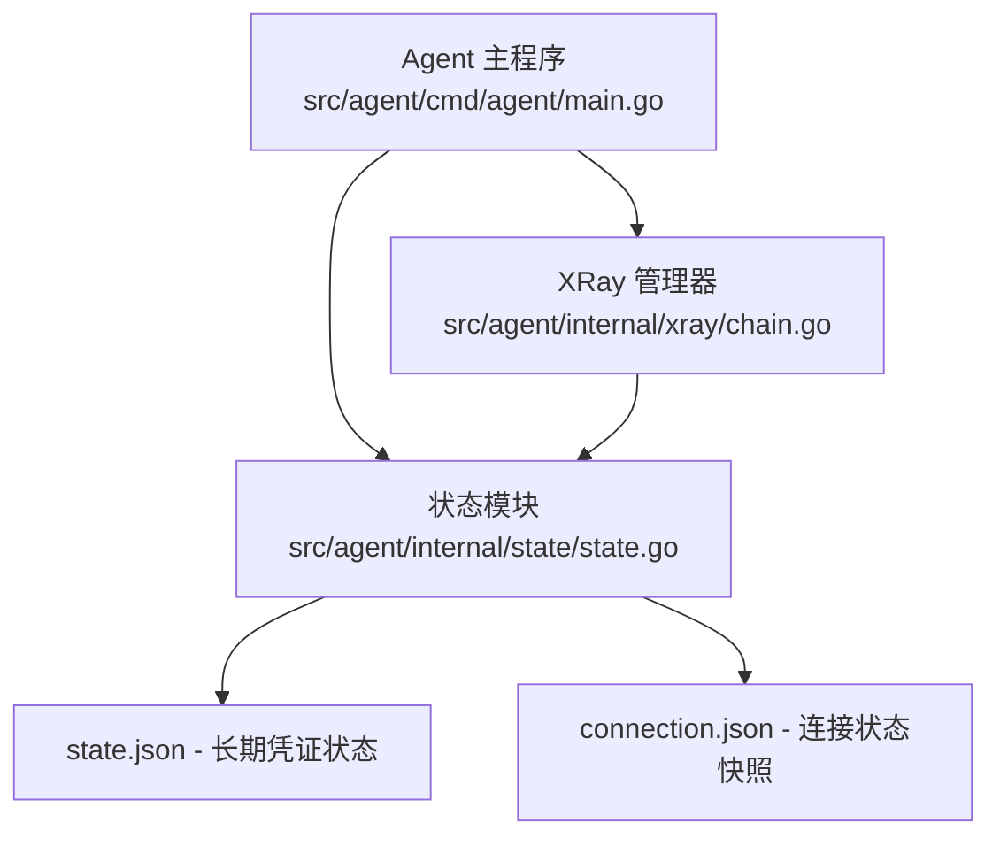
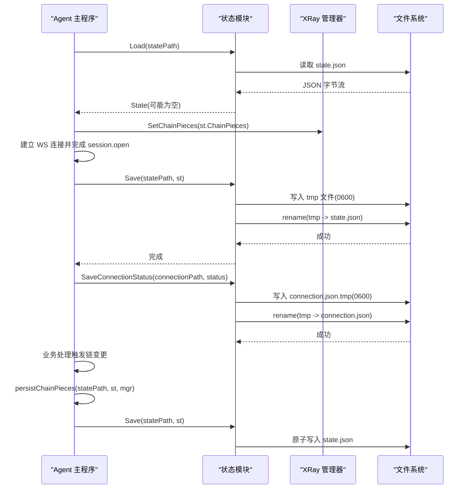
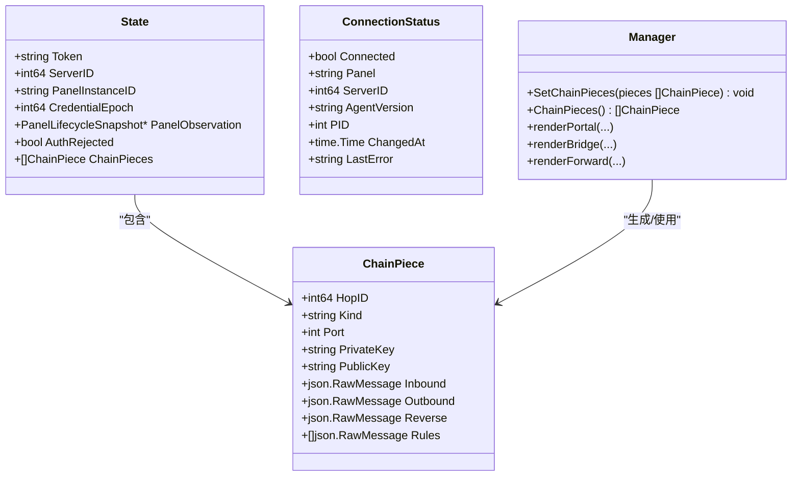

# 状态持久化机制

<cite>
**本文引用的文件**   
- [state.go](file://src/agent/internal/state/state.go)
- [main.go](file://src/agent/cmd/agent/main.go)
- [chain.go](file://src/agent/internal/xray/chain.go)
</cite>

## 更新摘要
**所做更改**   
- 新增 ConnectionStatus 结构体及其字段说明
- 新增 SaveConnectionStatus 函数的详细实现原理
- 更新连接状态文件的存储位置和用途说明
- 增强状态持久化机制的完整流程图
- 补充连接状态监控和故障排查指南

## 目录
1. [简介](#简介)
2. [项目结构](#项目结构)
3. [核心组件](#核心组件)
4. [架构总览](#架构总览)
5. [详细组件分析](#详细组件分析)
6. [依赖关系分析](#依赖关系分析)
7. [性能考量](#性能考量)
8. [故障排查指南](#故障排查指南)
9. [结论](#结论)
10. [附录：状态文件示例与字段说明](#附录状态文件示例与字段说明)

## 简介
本文件面向 Lattix Agent 的状态持久化机制，聚焦本地状态文件的结构与读写流程。内容涵盖 State 结构体设计、ConnectionStatus 连接状态结构、ChainPieces 数组的组成与作用、Load/Save/SaveConnectionStatus 的实现细节（文件读取、JSON 解析、原子写入、权限控制），以及 state.json 和 connection.json 的默认路径与访问权限策略。同时给出完整的状态文件示例与字段说明，帮助开发者快速理解并正确使用本地状态。

## 项目结构
与状态持久化直接相关的代码位于 agent 子模块中：
- 状态定义与读写：src/agent/internal/state/state.go
- 启动与运行期调用：src/agent/cmd/agent/main.go
- 链配置件渲染与落盘记录：src/agent/internal/xray/chain.go



**图表来源** 
- [main.go:33-70](file://src/agent/cmd/agent/main.go#L33-L70)
- [state.go:14-38](file://src/agent/internal/state/state.go#L14-L38)
- [chain.go:150-349](file://src/agent/internal/xray/chain.go#L150-L349)

**章节来源**
- [state.go:14-38](file://src/agent/internal/state/state.go#L14-L38)
- [main.go:33-70](file://src/agent/cmd/agent/main.go#L33-L70)
- [chain.go:150-349](file://src/agent/internal/xray/chain.go#L150-L349)

## 核心组件
- State：Agent 本地状态的根结构，包含认证令牌、服务器标识、面板实例标识、凭证纪元、面板生命周期快照、鉴权拒绝标记以及链配置件片段集合。
- ConnectionStatus：连接状态快照，提供无凭据的运行时状态供 latx-ag 消费，包含连接状态、面板信息、服务器ID、代理版本、进程ID、变更时间和最后错误信息。
- ChainPiece：单个链跳配置件的落盘记录，用于重启后重建 xray 配置与重发幂等。
- Load/Save：状态文件的加载与原子保存实现，确保并发安全与一致性。
- SaveConnectionStatus：连接状态的原子写入实现，用于实时监控和故障诊断。
- persistChainPieces：在运行过程中将当前链 piece 集合同步到状态文件中，作为重启重建的依据。

**章节来源**
- [state.go:14-38](file://src/agent/internal/state/state.go#L14-L38)
- [state.go:15-24](file://src/agent/internal/state/state.go#L15-L24)
- [state.go:40-73](file://src/agent/internal/state/state.go#L40-L73)
- [state.go:87-100](file://src/agent/internal/state/state.go#L87-L100)
- [main.go:735-740](file://src/agent/cmd/agent/main.go#L735-L740)

## 架构总览
状态持久化的整体流程如下：
- 启动时从 state.json 加载状态，若不存在则返回零值；随后将 ChainPieces 注入 XRay 管理器以支持重启重建。
- 首次连接成功后，根据会话结果更新 Token、ServerID、PanelInstanceID、CredentialEpoch、PanelObservation 等字段，并原子写入 state.json。
- 运行期间，当链配置发生变更或需要持久化时，通过 persistChainPieces 将最新的 ChainPieces 写回 state.json。
- 所有写操作采用"临时文件 + rename"的原子替换方式，并以 0600 权限创建，避免部分写入和未授权访问。
- 连接状态通过 SaveConnectionStatus 实时写入 connection.json，提供无凭据的连接监控能力。



**图表来源** 
- [main.go:54-58](file://src/agent/cmd/agent/main.go#L54-L58)
- [main.go:223-231](file://src/agent/cmd/agent/main.go#L223-L231)
- [main.go:735-740](file://src/agent/cmd/agent/main.go#L735-L740)
- [state.go:40-73](file://src/agent/internal/state/state.go#L40-L73)
- [state.go:87-100](file://src/agent/internal/state/state.go#L87-L100)

## 详细组件分析

### State 结构体设计
- Token：长期服务器令牌，用于 session.open 换发与后续鉴权。
- ServerID：面板分配的服务器标识，用于区分不同受控节点。
- PanelInstanceID：面板实例标识，用于跨面板绑定检测与重置。
- CredentialEpoch：凭证纪元，配合 PanelInstanceID 判断凭证是否被替换或面板重建。
- PanelObservation：最近一次面板生命周期快照，用于重试策略与生命周期一致性校验。
- AuthRejected：明确鉴权拒绝标志，遇到面板拒绝时停止自动重试。
- ChainPieces：链配置件片段集合，用于重启重建 xray 配置与重发幂等。

**章节来源**
- [state.go:26-35](file://src/agent/internal/state/state.go#L26-L35)

### ConnectionStatus 结构体设计
ConnectionStatus 是一个无凭据的运行时快照，供 latx-ag 工具消费，关键字段如下：
- Connected：连接状态布尔值，表示当前是否与面板建立连接。
- Panel：面板 WebSocket 地址，用于显示连接目标。
- ServerID：连接的服务器ID，用于识别具体受控节点。
- AgentVersion：Agent 版本号，用于版本管理和兼容性检查。
- PID：进程ID，用于进程监控和管理。
- ChangedAt：状态变更时间戳，UTC格式，用于状态同步和监控。
- LastError：最后错误信息，截断至512字符，用于故障诊断。

该结构体不包含任何敏感凭据信息，可安全暴露给外部监控工具使用。

**章节来源**
- [state.go:15-24](file://src/agent/internal/state/state.go#L15-L24)

### ChainPieces 数组结构
每个 ChainPiece 表示一个链跳配置件的完整落盘记录，关键字段如下：
- HopID：链跳唯一标识，用于定位与去重。
- Kind：类型，portal|bridge|forward，决定渲染逻辑与用途。
- Port：已分配端口（portal/forward 使用），用于重发幂等复用。
- PrivateKey：portal 的 Reality 私钥（不出本机），用于生成公钥与隧道认证。
- PublicKey：portal 的对应公钥（回执值），供下游 bridge 使用。
- Inbound：portal/forward 的 inbound 配置片段。
- Outbound：bridge 的 interconn outbound 配置片段。
- Reverse：reverse.portals/bridges 条目，用于反向隧道路由。
- Rules：routing 规则片段，描述入站/出站转发策略。

这些字段保证重启后可重建 config.json，并在重发场景下保持端口与公钥不变，从而避免下游 bridge 凭证失效。

**章节来源**
- [state.go:37-50](file://src/agent/internal/state/state.go#L37-L50)
- [chain.go:150-349](file://src/agent/internal/xray/chain.go#L150-L349)

### Load 函数实现原理
- 读取 state.json 文件，若不存在或为空则返回零值 State（首次启动）。
- 对非空内容进行 JSON 解析，失败则返回错误。
- 不修改权限或目录，仅负责读取与解析。

该实现确保首次启动无状态时能正常初始化，且对损坏文件提供明确的错误反馈。

**章节来源**
- [state.go:52-69](file://src/agent/internal/state/state.go#L52-L69)

### Save 函数实现原理
- 将 State 序列化为缩进 JSON 字符串。
- 确保目标目录存在（权限 0755）。
- 先写入临时文件（权限 0600），再原子 rename 为目标文件，避免部分写入。
- 最终 state.json 的权限为 0600，仅所有者可读写。

该实现保证了并发写入的安全性与数据一致性，同时限制敏感信息（如 Token、私钥）的访问权限。

**章节来源**
- [state.go:71-85](file://src/agent/internal/state/state.go#L71-L85)

### SaveConnectionStatus 函数实现原理
- 将 ConnectionStatus 序列化为缩进 JSON 字符串。
- 确保目标目录存在（权限 0755）。
- 先写入临时文件（权限 0600），再原子 rename 为目标文件，避免部分写入。
- 最终 connection.json 的权限为 0600，仅所有者可读写。

该实现与 Save 函数保持一致的原子写入模式，但专门用于连接状态的实时监控，不包含敏感凭据信息。

**章节来源**
- [state.go:87-100](file://src/agent/internal/state/state.go#L87-L100)

### persistChainPieces 与运行期持久化
- 在链配置变更或需要持久化时，调用 persistChainPieces 将当前 ChainPieces 同步到 state.json。
- 该过程由主程序在关键路径触发，确保重启后能恢复正确的链配置。

**章节来源**
- [main.go:735-740](file://src/agent/cmd/agent/main.go#L735-L740)

## 依赖关系分析
- main.go 依赖 state 模块进行状态加载与保存，并在首次连接成功后更新状态。
- chain.go 依赖 state.ChainPiece 作为配置片段的载体，并在渲染 portal/bridge/forward 时生成对应的记录。
- state.go 是纯 I/O 与数据结构层，无外部网络依赖。
- connection.json 文件独立于 state.json，提供无凭据的连接监控能力。



**图表来源** 
- [state.go:14-38](file://src/agent/internal/state/state.go#L14-L38)
- [state.go:15-24](file://src/agent/internal/state/state.go#L15-L24)
- [chain.go:150-349](file://src/agent/internal/xray/chain.go#L150-L349)

**章节来源**
- [main.go:54-58](file://src/agent/cmd/agent/main.go#L54-L58)
- [chain.go:150-349](file://src/agent/internal/xray/chain.go#L150-L349)

## 性能考量
- 序列化开销：Save 和 SaveConnectionStatus 都使用 json.MarshalIndent，适合小体积状态文件；对于频繁更新场景可考虑批量合并或增量更新。
- 磁盘 I/O：原子写入通过 tmp + rename 实现，减少锁竞争与部分写入风险；在高并发写入时需关注磁盘延迟。
- 权限设置：0600 权限确保最小暴露面，但可能影响调试与备份流程，建议通过运维脚本统一处理。
- 连接状态监控：connection.json 文件独立于 state.json，避免频繁的连接状态更新影响核心状态文件的性能。

## 故障排查指南
- 首次启动无状态：Load 返回零值 State，需通过命令行参数 -token 提供初始凭证。
- 鉴权拒绝：AuthRejected 置位后停止自动重试，需重新安装或更换新面板命令。
- 状态文件损坏：Load 解析失败会返回错误，检查 state.json 完整性与权限。
- 权限问题：state.json 权限应为 0600，若非预期权限，使用 chmod 修正。
- 连接状态异常：检查 connection.json 文件是否存在且可读，查看 LastError 字段获取错误信息。
- 连接状态文件损坏：connection.json 解析失败不影响核心功能，系统会自动重新生成。

**章节来源**
- [main.go:66-68](file://src/agent/cmd/agent/main.go#L66-L68)
- [main.go:79-84](file://src/agent/cmd/agent/main.go#L79-L84)
- [state.go:52-69](file://src/agent/internal/state/state.go#L52-L69)

## 结论
Lattix Agent 的状态持久化机制通过简洁的数据结构与安全的 I/O 实现，确保了认证令牌、面板信息与链配置的可靠存储与恢复。Load/Save/SaveConnectionStatus 的原子写入与严格权限控制保障了数据安全与一致性，ChainPieces 的设计则为重启重建与重发幂等提供了坚实基础。新增的 ConnectionStatus 结构体和 SaveConnectionStatus 函数为连接状态监控提供了无凭据的接口，增强了系统的可观测性和故障诊断能力。开发者应遵循既定流程与权限规范，确保系统稳定运行。

## 附录：状态文件示例与字段说明
以下为 state.json 的完整示例（字段含义见下方说明）：

```json
{
  "token": "eyJhbGciOiJIUzI1NiIsInR5cCI6IkpXVCJ9...",
  "server_id": 1234567890,
  "panel_instance_id": "p_00000000000000000000000000000000",
  "credential_epoch": 1,
  "panel_observation": {
    "panel_instance_id": "p_00000000000000000000000000000000",
    "state": "active",
    "epoch": "epoch-a",
    "revision": 1,
    "entered_at": "2024-01-01T00:00:00Z"
  },
  "auth_rejected": false,
  "chain_pieces": [
    {
      "hop_id": 1,
      "kind": "portal",
      "port": 443,
      "private_key": "xxxxx",
      "public_key": "yyyyy",
      "inbound": {"tag":"portal_1","listen":"0.0.0.0","port":443,"protocol":"vless","settings":{"clients":[{"id":"uuid"}],"decryption":"none"},"streamSettings":{"network":"tcp","security":"reality","realitySettings":{"show":false,"dest":"example.com","xver":0,"serverNames":["example.com"],"privateKey":"xxxxx","shortIds":["short"]}}},
      "outbound": null,
      "reverse": {"tag":"reverse_portal_1","domain":"tunnel.example.com"},
      "rules": [{"type":"field","inboundTag":["portal_1"],"outboundTag":"reverse_portal_1"}]
    },
    {
      "hop_id": 2,
      "kind": "bridge",
      "port": null,
      "private_key": null,
      "public_key": null,
      "inbound": null,
      "outbound": {"tag":"bridge_2","protocol":"vless","settings":{"vnext":[{"address":"portal.example.com","port":443,"users":[{"id":"uuid","encryption":"none"}]}]},"streamSettings":{"network":"tcp","security":"reality","realitySettings":{"serverName":"example.com","publicKey":"yyyyy","shortId":"short","fingerprint":"chrome"}}},
      "reverse": {"tag":"reverse_bridge_2","domain":"tunnel.example.com"},
      "rules": [
        {"type":"field","domain":["full:tunnel.example.com"],"outboundTag":"bridge_2"},
        {"type":"field","inboundTag":["reverse_bridge_2"],"outboundTag":"direct"}
      ]
    },
    {
      "hop_id": 3,
      "kind": "forward",
      "port": 8080,
      "private_key": null,
      "public_key": null,
      "inbound": {"tag":"forward_3","listen":"0.0.0.0","port":8080,"protocol":"dokodemo-door","settings":{"network":"tcp","followRedirect":true}},
      "outbound": null,
      "reverse": null,
      "rules": [{"type":"field","inboundTag":["forward_3"],"outboundTag":"reverse_portal_1"}]
    }
  ]
}
```

以下为 connection.json 的完整示例（连接状态快照）：

```json
{
  "connected": true,
  "panel": "ws://127.0.0.1:8080/api/agent/ws",
  "server_id": 1234567890,
  "agent_version": "dev",
  "pid": 12345,
  "changed_at": "2024-01-01T00:00:00Z",
  "last_error": ""
}
```

字段说明：
- token：长期服务器令牌，用于 session.open 换发与鉴权。
- server_id：面板分配的服务器标识。
- panel_instance_id：面板实例标识，用于跨面板绑定检测。
- credential_epoch：凭证纪元，配合 panel_instance_id 判断凭证是否被替换。
- panel_observation：面板生命周期快照，包含状态、纪元、版本等信息。
- auth_rejected：鉴权拒绝标志，遇面板拒绝时停止自动重试。
- chain_pieces：链配置件片段集合，包含 hop_id、kind、port、密钥、inbound/outbound/reverse/rules 等。
- connected：连接状态布尔值，表示当前是否与面板建立连接。
- panel：面板 WebSocket 地址，用于显示连接目标。
- agent_version：Agent 版本号，用于版本管理和兼容性检查。
- pid：进程ID，用于进程监控和管理。
- changed_at：状态变更时间戳，UTC格式，用于状态同步和监控。
- last_error：最后错误信息，截断至512字符，用于故障诊断。

**章节来源**
- [state.go:26-35](file://src/agent/internal/state/state.go#L26-L35)
- [state.go:15-24](file://src/agent/internal/state/state.go#L15-L24)
- [chain.go:150-349](file://src/agent/internal/xray/chain.go#L150-L349)