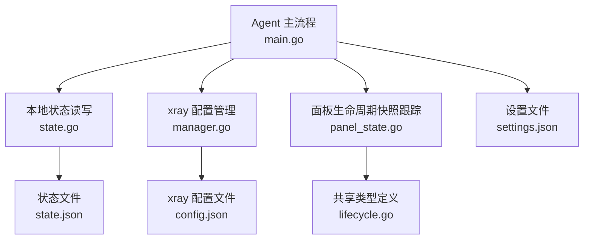
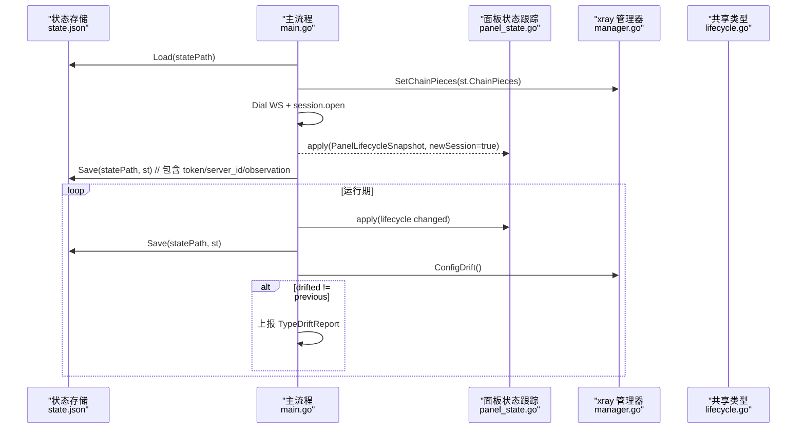
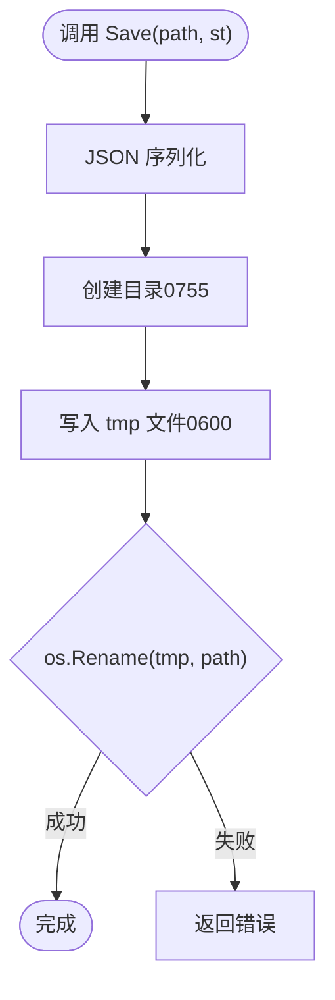
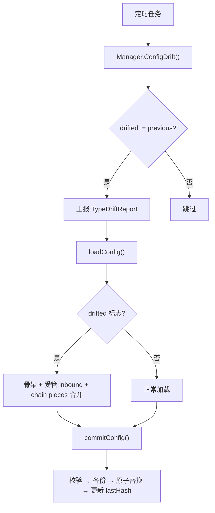
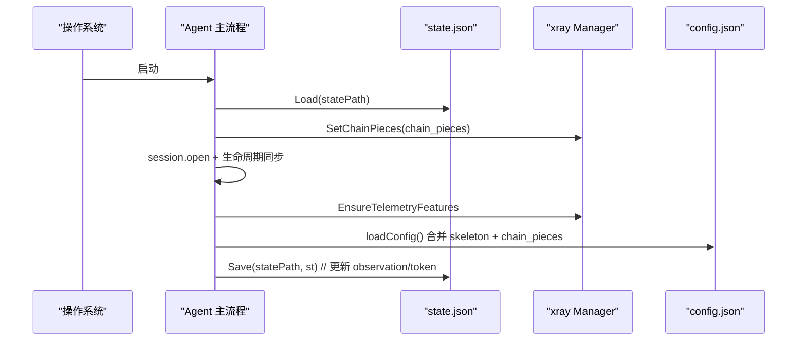
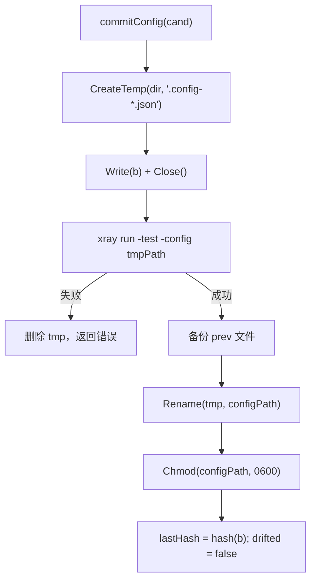
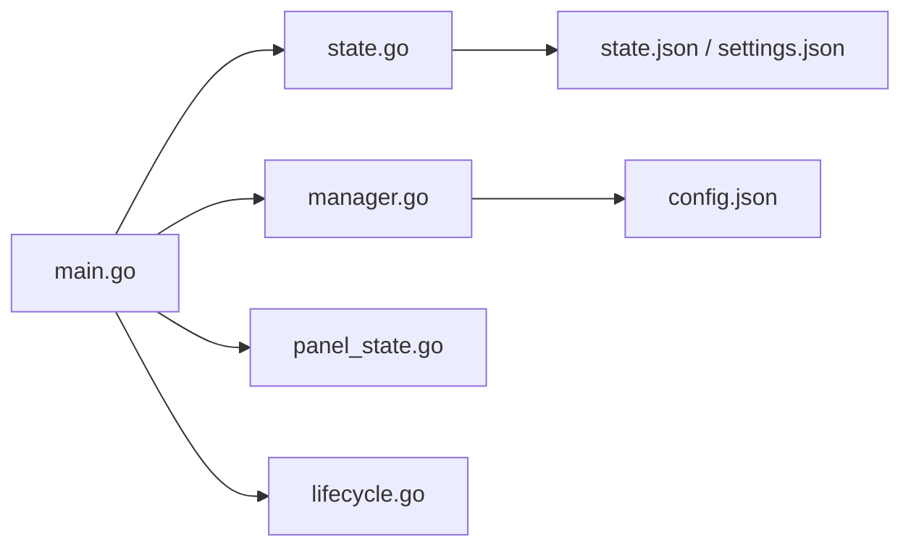

# 状态管理机制

<cite>
**本文引用的文件**   
- [state.go](file://src/agent/internal/state/state.go)
- [panel_state.go](file://src/agent/cmd/agent/panel_state.go)
- [lifecycle.go](file://src/shared/lifecycle.go)
- [main.go](file://src/agent/cmd/agent/main.go)
- [manager.go](file://src/agent/internal/xray/manager.go)
- [panel-lifecycle-state-machine-design.md](file://docs/panel-lifecycle-state-machine-design.md)
</cite>

## 目录
1. [引言](#引言)
2. [项目结构](#项目结构)
3. [核心组件](#核心组件)
4. [架构总览](#架构总览)
5. [详细组件分析](#详细组件分析)
6. [依赖关系分析](#依赖关系分析)
7. [性能考量](#性能考量)
8. [故障排查指南](#故障排查指南)
9. [结论](#结论)
10. [附录](#附录)

## 引言
本文件面向 Lattix Agent 的状态管理机制，聚焦以下目标：
- 本地状态持久化设计：state.json 的结构、字段含义与版本兼容性策略。
- 面板生命周期同步机制：PanelState 快照、生命周期版本管理（epoch/revision）、状态变更检测与幂等应用。
- 配置漂移检测：config.json 监控、外部修改检测、漂移状态上报与自动修复。
- 状态恢复机制：进程重启后的状态重建、链 piece 记录恢复、配置一致性保证。
- 原子更新策略：临时文件写入、原子替换与回滚机制。
- 通过流程图与类图帮助开发者理解状态管理的完整闭环。

## 项目结构
Agent 的状态管理涉及三个关键层次：
- 持久化层：state.go 提供 state.json 的加载与原子保存，以及 settings.json 的读写。
- 运行时层：main.go 负责连接建立、会话初始化、生命周期同步、漂移检测与设置同步。
- 配置管理层：manager.go 负责 xray 配置生成、校验、原子替换、漂移检测与净化恢复。



图表来源
- [main.go:141-386](file://src/agent/cmd/agent/main.go#L141-L386)
- [state.go:40-110](file://src/agent/internal/state/state.go#L40-L110)
- [manager.go:235-371](file://src/agent/internal/xray/manager.go#L235-L371)
- [panel_state.go:9-52](file://src/agent/cmd/agent/panel_state.go#L9-L52)
- [lifecycle.go:27-86](file://src/shared/lifecycle.go#L27-L86)

章节来源
- [main.go:141-386](file://src/agent/cmd/agent/main.go#L141-L386)
- [state.go:40-110](file://src/agent/internal/state/state.go#L40-L110)
- [manager.go:235-371](file://src/agent/internal/xray/manager.go#L235-L371)
- [panel_state.go:9-52](file://src/agent/cmd/agent/panel_state.go#L9-L52)
- [lifecycle.go:27-86](file://src/shared/lifecycle.go#L27-L86)

## 核心组件
- 本地状态 State（state.json）
  - token：长期服务器凭证（session.open 换发后落盘）。
  - server_id：面板分配的服务器标识。
  - panel_instance_id：面板实例标识，用于跨面板重绑定判断。
  - credential_epoch：凭据 epoch，配合面板生命周期版本使用。
  - panel_observation：最近一次面板生命周期快照（含 epoch/revision/state/retry_policy 等）。
  - auth_rejected：是否被面板明确拒绝认证。
  - chain_pieces：链跳配置件落盘记录，用于重启重建 config.json 与重发幂等。
- 面板生命周期快照 PanelLifecycleSnapshot（shared）
  - epoch/revision：进程级随机 epoch + 进程内单调 revision，确保幂等与顺序性。
  - state：startup/active/updating/faulted。
  - retry_policy/latency_resume_window_ms：重试策略与延迟恢复窗口。
- 面板状态跟踪器 panelStateTracker
  - 内存中维护当前快照与变更通道，支持新会话与重连场景的版本比较与幂等应用。
- xray 配置管理器 Manager
  - 负责 config.json 的生成、校验、原子替换、漂移检测与净化恢复。
  - 维护 lastHash 作为漂移基线，drifted 标志位控制净化路径。

章节来源
- [state.go:14-38](file://src/agent/internal/state/state.go#L14-L38)
- [lifecycle.go:27-86](file://src/shared/lifecycle.go#L27-L86)
- [panel_state.go:9-52](file://src/agent/cmd/agent/panel_state.go#L9-L52)
- [manager.go:36-62](file://src/agent/internal/xray/manager.go#L36-L62)

## 架构总览
Agent 启动后加载 state.json 与 settings.json，建立到面板的 WebSocket 长连接，完成 session.open 并获取初始生命周期快照。随后进入消息循环，处理生命周期变更、设置同步、链路操作与遥测。同时后台协程周期性检测配置漂移并上报。所有状态与配置写盘均采用原子替换策略，确保崩溃安全。



图表来源
- [main.go:141-386](file://src/agent/cmd/agent/main.go#L141-L386)
- [panel_state.go:23-52](file://src/agent/cmd/agent/panel_state.go#L23-L52)
- [state.go:40-110](file://src/agent/internal/state/state.go#L40-L110)
- [manager.go:289-334](file://src/agent/internal/xray/manager.go#L289-L334)
- [lifecycle.go:27-86](file://src/shared/lifecycle.go#L27-L86)

## 详细组件分析

### 本地状态持久化（state.json）
- 数据结构
  - State：token、server_id、panel_instance_id、credential_epoch、panel_observation、auth_rejected、chain_pieces。
  - ChainPiece：hop_id、kind、port、private_key、public_key、inbound、outbound、reverse、rules。
- 读取与保存
  - Load：不存在或空文件返回零值；解析失败返回错误。
  - Save：JSON 缩进序列化，创建 .tmp 临时文件，权限 0600，最后 os.Rename 原子替换。
- 设置文件
  - LoadSettings/SaveSettings：同样采用原子写入与校验。



图表来源
- [state.go:59-73](file://src/agent/internal/state/state.go#L59-L73)
- [state.go:93-110](file://src/agent/internal/state/state.go#L93-L110)

章节来源
- [state.go:14-38](file://src/agent/internal/state/state.go#L14-L38)
- [state.go:40-110](file://src/agent/internal/state/state.go#L40-L110)

### 面板生命周期同步机制
- 版本管理
  - epoch：每次面板进程启动生成随机 ID。
  - revision：进程内每次状态变化递增。
  - Agent 对同一 epoch 只接受更大 revision；重复 revision 幂等确认；更小 revision 忽略。
- 快照应用
  - panelStateTracker.apply：校验有效状态、epoch/revision 规则，必要时丢弃无效更新。
  - 新会话首次应用由 session.open 响应携带；后续由 lifecycle.changed 推送。
- 就绪与延迟测量
  - markSessionReady：在随机等待后发送 session.ready，结合 liveness Ping/Pong 判定上线。
  - latency 仅在 active 状态下运行，updating/faulted 暂停。

```mermaid
classDiagram
class PanelLifecycleSnapshot {
+string panel_instance_id
+string state
+string epoch
+uint64 revision
+time entered_at
+string fault
+RetryPolicy retry_policy
+int latency_resume_window_ms
}
class LifecycleVersion {
+string epoch
+uint64 revision
}
class panelStateTracker {
-RWMutex mu
-PanelLifecycleSnapshot value
-chan changed
+snapshot() (PanelLifecycleSnapshot, <-chan struct{})
+apply(next, newSession) bool
}
PanelLifecycleSnapshot --> LifecycleVersion : "Version()"
panelStateTracker --> PanelLifecycleSnapshot : "维护与比较"
```

图表来源
- [lifecycle.go:27-86](file://src/shared/lifecycle.go#L27-L86)
- [panel_state.go:9-52](file://src/agent/cmd/agent/panel_state.go#L9-L52)

章节来源
- [panel-lifecycle-state-machine-design.md:50-100](file://docs/panel-lifecycle-state-machine-design.md#L50-L100)
- [panel_state.go:23-52](file://src/agent/cmd/agent/panel_state.go#L23-L52)
- [main.go:388-453](file://src/agent/cmd/agent/main.go#L388-L453)

### 配置漂移检测与修复
- 漂移检测
  - Manager.ConfigDrift：读取 config.json 计算哈希，与 lastHash 对比；文件缺失视为漂移。
  - main.go 周期性调用 drift check，当状态变化时上报 TypeDriftReport。
- 漂移修复
  - loadConfig：若检测到 drifted，以骨架 + 受管节点 inbound + 链 piece 为基，丢弃外部改动内容。
  - commitConfig：写临时文件 → xray run -test 校验 → 备份 prev → 原子替换 → 更新 lastHash 并清除 drifted。



图表来源
- [manager.go:289-371](file://src/agent/internal/xray/manager.go#L289-L371)
- [main.go:316-358](file://src/agent/cmd/agent/main.go#L316-L358)

章节来源
- [manager.go:289-371](file://src/agent/internal/xray/manager.go#L289-L371)
- [main.go:316-358](file://src/agent/cmd/agent/main.go#L316-L358)

### 状态恢复机制（进程重启）
- 启动阶段
  - Load(statePath) 恢复 token、server_id、panel_instance_id、panel_observation、chain_pieces。
  - SetChainPieces 注入 manager，以便重建 config.json。
- 重建 config.json
  - loadConfig：缺失/损坏/漂移净化均合并 chain_pieces 与 skeleton，保证一致。
- 幂等与一致性
  - chain_pieces 持久化随 ApplyChainHop/RemoveChainHop 后更新，确保重发幂等复用端口与密钥。
  - 跨面板重绑定：ResetForPanelRebind 清理旧配置并重置 runtime。



图表来源
- [main.go:54-68](file://src/agent/cmd/agent/main.go#L54-L68)
- [manager.go:336-371](file://src/agent/internal/xray/manager.go#L336-L371)
- [state.go:40-73](file://src/agent/internal/state/state.go#L40-L73)

章节来源
- [main.go:54-68](file://src/agent/cmd/agent/main.go#L54-L68)
- [manager.go:336-371](file://src/agent/internal/xray/manager.go#L336-L371)
- [state.go:40-73](file://src/agent/internal/state/state.go#L40-L73)

### 原子更新策略（状态与配置）
- 状态文件
  - Save：写入 .tmp 文件（0600），然后 os.Rename 原子替换。
- 配置文件
  - commitConfig：CreateTemp → Write → Close → xrun -test 校验 → 备份 prev → Rename → Chmod → 更新 lastHash。
  - 热更新失败时回滚：先尝试 hot reload，失败则 Restart 并 restorePrev。



图表来源
- [manager.go:235-287](file://src/agent/internal/xray/manager.go#L235-L287)
- [state.go:59-73](file://src/agent/internal/state/state.go#L59-L73)

章节来源
- [manager.go:235-287](file://src/agent/internal/xray/manager.go#L235-L287)
- [state.go:59-73](file://src/agent/internal/state/state.go#L59-L73)

## 依赖关系分析
- Agent 主流程依赖：
  - state 包：Load/Save state.json、LoadSettings/SaveSettings settings.json。
  - xray.Manager：SetChainPieces、ApplyChainHop、RemoveChainHop、ConfigDrift、CommitConfig。
  - shared.lifecycle：PanelLifecycleSnapshot、LifecycleVersion、消息类型与载荷。
  - panelStateTracker：内存快照与变更通知。
- 面板侧契约：
  - session.open 响应携带 PanelLifecycleSnapshot 与可选 IssuedToken/CredentialExchangeID。
  - lifecycle.changed 推送最新快照，Agent 应用后 ACK。



图表来源
- [main.go:141-386](file://src/agent/cmd/agent/main.go#L141-L386)
- [state.go:40-110](file://src/agent/internal/state/state.go#L40-L110)
- [manager.go:235-371](file://src/agent/internal/xray/manager.go#L235-L371)
- [panel_state.go:9-52](file://src/agent/cmd/agent/panel_state.go#L9-L52)
- [lifecycle.go:27-86](file://src/shared/lifecycle.go#L27-L86)

章节来源
- [main.go:141-386](file://src/agent/cmd/agent/main.go#L141-L386)
- [state.go:40-110](file://src/agent/internal/state/state.go#L40-L110)
- [manager.go:235-371](file://src/agent/internal/xray/manager.go#L235-L371)
- [panel_state.go:9-52](file://src/agent/cmd/agent/panel_state.go#L9-L52)
- [lifecycle.go:27-86](file://src/shared/lifecycle.go#L27-L86)

## 性能考量
- 状态与配置写盘均为原子操作，避免部分写入导致的不一致。
- 漂移检测周期由 settings.DriftDetection.IntervalSeconds 控制，避免频繁 IO。
- 延迟测量仅在 active 状态运行，减少 updating/faulted 期间的开销。
- 心跳与 liveness 独立调度，避免业务消息阻塞保活。

[本节为通用指导，不直接分析具体文件]

## 故障排查指南
- 认证被拒绝
  - 现象：AuthRejected 置位，停止自动重试。
  - 处理：使用新面板安装命令重新绑定后重启。
- 配置漂移
  - 现象：drifted 标志位触发，上报漂移事件；loadConfig 执行净化。
  - 处理：检查外部修改源，确认受管 inbound 保留正确。
- 状态落盘失败
  - 现象：日志提示 save state failed，但内存 token 兜底可重连。
  - 处理：检查磁盘权限与空间，确保 .tmp 写入成功。
- 生命周期版本冲突
  - 现象：session.ready 返回 conflict，携带当前生命周期快照。
  - 处理：应用新的 snapshot，重试最多三次。

章节来源
- [main.go:78-97](file://src/agent/cmd/agent/main.go#L78-L97)
- [main.go:416-453](file://src/agent/cmd/agent/main.go#L416-L453)
- [manager.go:289-334](file://src/agent/internal/xray/manager.go#L289-L334)

## 结论
Lattix Agent 的状态管理机制围绕“原子写盘 + 版本化快照 + 漂移检测 + 幂等恢复”构建，确保在进程重启、外部修改、面板更新等场景下仍能保持一致性与可用性。通过 state.json 与 chain_pieces 的持久化、PanelLifecycleSnapshot 的版本控制、以及 xray 配置的原子替换与净化，Agent 能够在复杂环境中稳健运行。

[本节为总结，不直接分析具体文件]

## 附录
- 状态文件字段说明
  - token：长期凭证，session.open 换发后落盘。
  - server_id：服务器标识，首次 session.open 响应分配。
  - panel_instance_id：面板实例标识，用于跨面板重绑定判断。
  - credential_epoch：凭据 epoch，与面板生命周期版本协同。
  - panel_observation：最近面板生命周期快照。
  - auth_rejected：认证拒绝标志。
  - chain_pieces：链跳配置件记录，重启重建与幂等依据。
- 生命周期状态
  - startup/active/updating/faulted，对应不同的 WS 与业务行为。
- 重试策略
  - retry_policy.min_ms/max_ms 与 latency_resume_window_ms 控制重连与恢复窗口。

[本节为概念性说明，不直接分析具体文件]