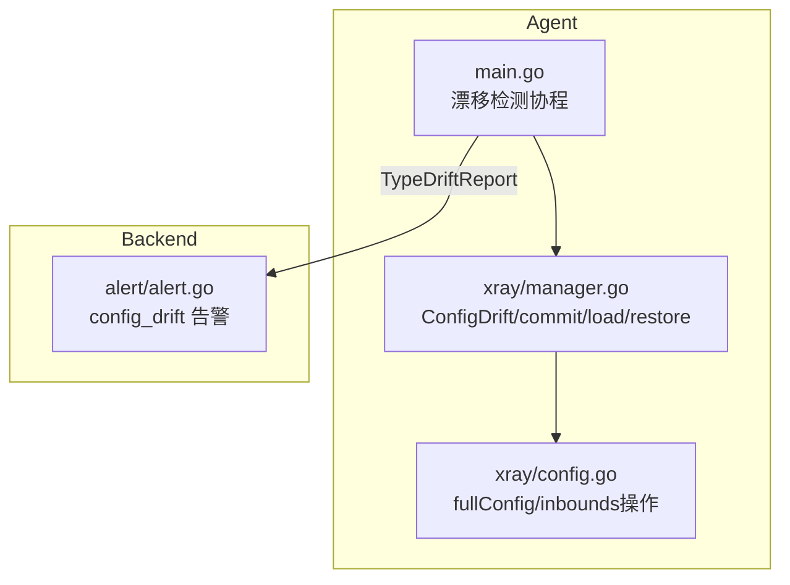
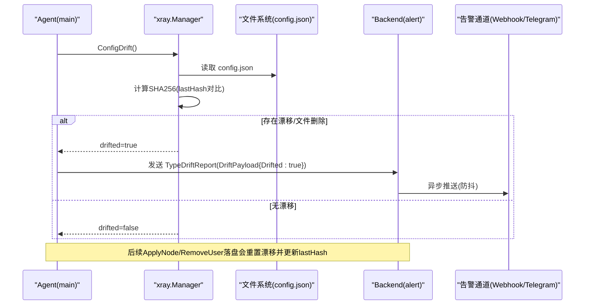
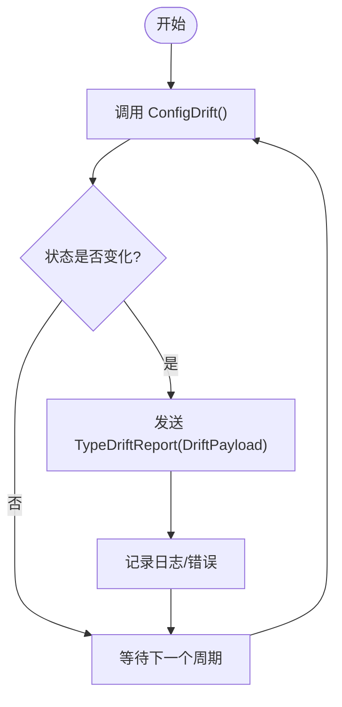
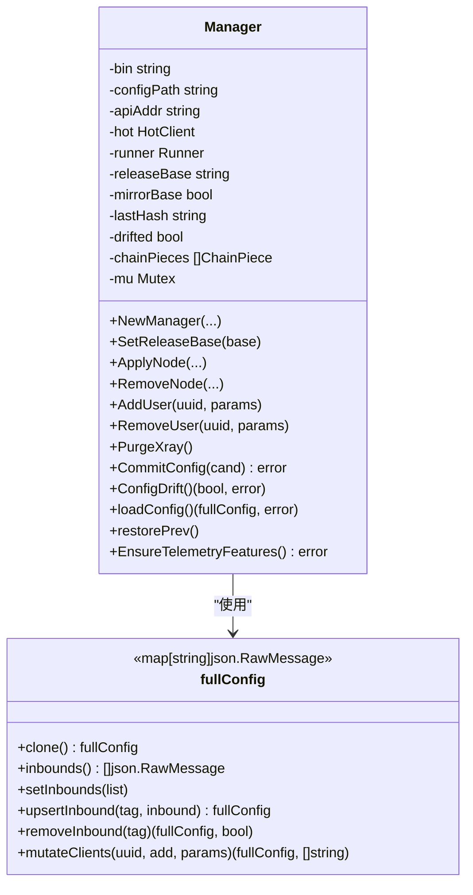
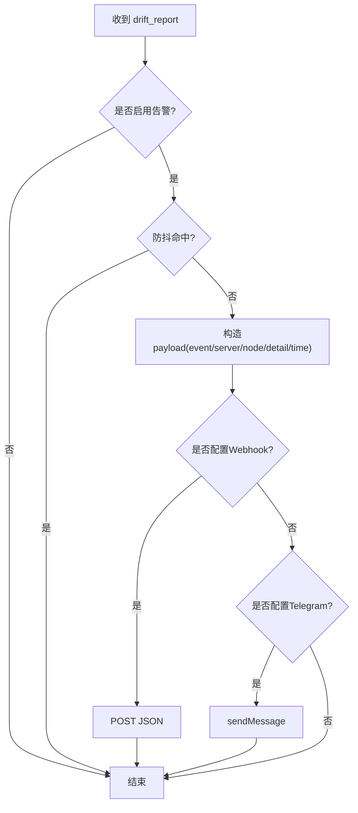
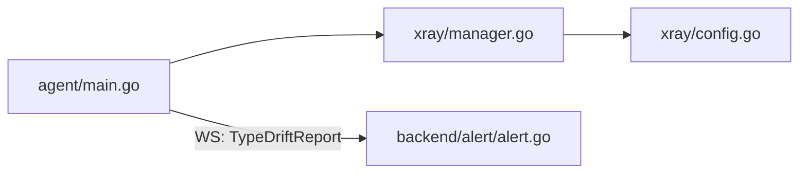

# 配置漂移检测

<cite>
**本文引用的文件**   
- [src/agent/cmd/agent/main.go](file://src/agent/cmd/agent/main.go)
- [src/agent/internal/xray/manager.go](file://src/agent/internal/xray/manager.go)
- [src/agent/internal/xray/config.go](file://src/agent/internal/xray/config.go)
- [src/backend/internal/alert/alert.go](file://src/backend/internal/alert/alert.go)
- [docs/openapi.yaml](file://docs/openapi.yaml)
</cite>

## 目录
1. [简介](#简介)
2. [项目结构](#项目结构)
3. [核心组件](#核心组件)
4. [架构总览](#架构总览)
5. [详细组件分析](#详细组件分析)
6. [依赖关系分析](#依赖关系分析)
7. [性能考量](#性能考量)
8. [故障排查指南](#故障排查指南)
9. [结论](#结论)
10. [附录](#附录)

## 简介
本文件面向运维与研发人员，系统化阐述 Lattix Agent 的“配置漂移检测”能力。重点覆盖：
- config.json 监控机制：文件读取、变更检测、差异计算策略
- 外部修改检测实现：哈希校验、首次基线建立、删除即漂移等
- 漂移状态识别与上报：漂移类型分类、严重程度评估、告警触发条件
- 一致性保证策略：自动修复（净化）、回滚（.prev）、手动确认与审计
- 工作流程图与常见漂移场景处理方案

## 项目结构
围绕配置漂移检测的关键代码分布在 Agent 侧 xray 管理器与主循环、以及后端告警子系统：
- Agent 侧
  - 主循环启动漂移检测协程，按设置周期调用 ConfigDrift() 并上报 TypeDriftReport
  - xray.Manager 负责 config.json 的落盘、校验、回滚、漂移检测与净化
  - fullConfig 对 inbounds 进行原样保留与精准操作
- 后端侧
  - alert.Notifier 接收 drift_report 事件，按防抖窗口推送 Webhook/Telegram

**图表来源** 
- [src/agent/cmd/agent/main.go:316-358](file://src/agent/cmd/agent/main.go#L316-L358)
- [src/agent/internal/xray/manager.go:289-317](file://src/agent/internal/xray/manager.go#L289-L317)
- [src/agent/internal/xray/config.go:10-48](file://src/agent/internal/xray/config.go#L10-L48)
- [src/backend/internal/alert/alert.go:19-25](file://src/backend/internal/alert/alert.go#L19-L25)

**章节来源**
- [src/agent/cmd/agent/main.go:316-358](file://src/agent/cmd/agent/main.go#L316-L358)
- [src/agent/internal/xray/manager.go:289-317](file://src/agent/internal/xray/manager.go#L289-L317)
- [src/agent/internal/xray/config.go:10-48](file://src/agent/internal/xray/config.go#L10-L48)
- [src/backend/internal/alert/alert.go:19-25](file://src/backend/internal/alert/alert.go#L19-L25)

## 核心组件
- 漂移检测调度器（Agent main）
  - 周期性调用 ConfigDrift()，仅在状态变化时上报 TypeDriftReport
  - 间隔由 AgentSettings.drift_detection.interval_seconds 控制
- 配置管理器（xray.Manager）
  - commitConfig：原子落盘 + xray run -test 校验 + 备份 .prev + 更新 lastHash
  - ConfigDrift：SHA256 比对 lastHash；首次以当前文件为基线；文件不存在视为漂移
  - loadConfig：缺失/损坏重建骨架；drifted=true 时执行“净化”，仅保留 node_* inbound
  - restorePrev：回滚到 .prev 并同步 lastHash
- 配置模型（fullConfig）
  - 浅层 map[string]json.RawMessage，inbounds 元素原样保留，支持 upsert/remove/mutateClients
- 告警通知（alert.Notifier）
  - 事件类型 EventConfigDrift = "config_drift"
  - 防抖窗口默认 5 分钟，支持环境变量覆盖
  - 双通道：Webhook JSON 与 Telegram sendMessage

**章节来源**
- [src/agent/cmd/agent/main.go:316-358](file://src/agent/cmd/agent/main.go#L316-L358)
- [src/agent/internal/xray/manager.go:235-317](file://src/agent/internal/xray/manager.go#L235-L317)
- [src/agent/internal/xray/config.go:10-114](file://src/agent/internal/xray/config.go#L10-L114)
- [src/backend/internal/alert/alert.go:19-144](file://src/backend/internal/alert/alert.go#L19-L144)

## 架构总览
配置漂移检测的整体流程如下：
- Agent 启动后，在 WS 会话中开启漂移检测协程
- 每 interval_seconds 秒读取 config.json，计算 SHA256 并与 lastHash 比较
- 若检测到漂移或文件被删，则记录 drifted=true，并通过 TypeDriftReport 上报
- 后端收到 drift_report 事件后，经 Notifier 推送告警（Webhook/Telegram），并做防抖
- 下一次 Agent 落盘（如 ApplyNode/RemoveUser）会重置 drifted=false 并更新 lastHash
- 若需要恢复，可回滚 .prev 并重新生效

**图表来源** 
- [src/agent/cmd/agent/main.go:316-358](file://src/agent/cmd/agent/main.go#L316-L358)
- [src/agent/internal/xray/manager.go:289-317](file://src/agent/internal/xray/manager.go#L289-L317)
- [src/backend/internal/alert/alert.go:106-144](file://src/backend/internal/alert/alert.go#L106-L144)

## 详细组件分析

### 组件A：漂移检测与上报（Agent main）
- 协程职责
  - 每次检查前调用 mgr.ConfigDrift()
  - 当结果从 false→true 或 true→false 时才上报 TypeDriftReport
  - 间隔由 settings.DriftDetection.IntervalSeconds 决定
- 上报载荷
  - shared.DriftPayload{Drifted: bool}
- 日志与错误
  - 检查失败仅记录日志，不中断主循环
  - 写入失败记录日志并继续下次周期

**图表来源** 
- [src/agent/cmd/agent/main.go:316-358](file://src/agent/cmd/agent/main.go#L316-L358)

**章节来源**
- [src/agent/cmd/agent/main.go:316-358](file://src/agent/cmd/agent/main.go#L316-L358)

### 组件B：配置管理器（xray.Manager）
- commitConfig
  - 写临时文件 → xray run -test 校验 → 备份 .prev → 原子 rename → 权限 0600 → 更新 lastHash 并重置 drifted
- ConfigDrift
  - 读取 config.json，不存在则 drifted=true（若 lastHash 非空）
  - 首次调用以当前内容哈希作为 lastHash（基线）
  - 后续通过 SHA256 比对判断是否漂移
- loadConfig
  - 缺失/损坏：重建骨架 skeleton() 并合并链 piece
  - drifted=true：以 skeleton 为基础，仅保留 tag 前缀为 node_ 的 inbound，丢弃其他外部改动
- restorePrev
  - 将 .prev 重命名为 config.json，并重新计算 lastHash，避免误报

**图表来源** 
- [src/agent/internal/xray/manager.go:25-40](file://src/agent/internal/xray/manager.go#L25-L40)
- [src/agent/internal/xray/config.go:10-114](file://src/agent/internal/xray/config.go#L10-L114)

**章节来源**
- [src/agent/internal/xray/manager.go:235-375](file://src/agent/internal/xray/manager.go#L235-L375)
- [src/agent/internal/xray/config.go:10-114](file://src/agent/internal/xray/config.go#L10-L114)

### 组件C：告警通知（alert.Notifier）
- 事件类型
  - EventConfigDrift = "config_drift"
- 防抖策略
  - 同一 serverID+event 在 debounceDefault（默认 5 分钟）内不重复发送
  - 可通过环境变量 LATTIX_ALERT_DEBOUNCE 覆盖
- 通道
  - Webhook：POST JSON payload
  - Telegram：sendMessage，纯文本渲染
- payload 字段
  - event/server/node/detail/time

**图表来源** 
- [src/backend/internal/alert/alert.go:19-25](file://src/backend/internal/alert/alert.go#L19-L25)
- [src/backend/internal/alert/alert.go:106-144](file://src/backend/internal/alert/alert.go#L106-L144)

**章节来源**
- [src/backend/internal/alert/alert.go:19-144](file://src/backend/internal/alert/alert.go#L19-L144)

## 依赖关系分析
- Agent main 依赖 xray.Manager 提供 ConfigDrift/落盘/回滚能力
- xray.Manager 依赖 fullConfig 对 inbounds 进行精确操作
- Agent main 通过 WS 向 Backend 发送 TypeDriftReport
- Backend alert.Notifier 依赖 store 获取告警配置，并调用外部 Webhook/Telegram API

**图表来源** 
- [src/agent/cmd/agent/main.go:316-358](file://src/agent/cmd/agent/main.go#L316-L358)
- [src/agent/internal/xray/manager.go:289-317](file://src/agent/internal/xray/manager.go#L289-L317)
- [src/agent/internal/xray/config.go:10-48](file://src/agent/internal/xray/config.go#L10-L48)
- [src/backend/internal/alert/alert.go:106-144](file://src/backend/internal/alert/alert.go#L106-L144)

**章节来源**
- [src/agent/cmd/agent/main.go:316-358](file://src/agent/cmd/agent/main.go#L316-L358)
- [src/agent/internal/xray/manager.go:289-317](file://src/agent/internal/xray/manager.go#L289-L317)
- [src/agent/internal/xray/config.go:10-48](file://src/agent/internal/xray/config.go#L10-L48)
- [src/backend/internal/alert/alert.go:106-144](file://src/backend/internal/alert/alert.go#L106-L144)

## 性能考量
- 检测频率
  - drift_detection.interval_seconds 默认 15s，范围 5~3600s
  - 建议根据服务器规模与磁盘 IO 调整，避免频繁 I/O
- 哈希计算
  - 使用 SHA256，开销与配置文件大小线性相关，通常很小
- 文件 I/O
  - commitConfig 使用临时文件 + 原子 rename，减少锁竞争与部分写入风险
- 告警防抖
  - 默认 5 分钟防抖，避免风暴式通知

[本节为通用指导，无需源码引用]

## 故障排查指南
- 现象：频繁出现 config_drift 告警
  - 排查点：是否存在外部脚本/工具直接编辑 config.json
  - 处理：停止外部修改，必要时限制文件权限（0600）
- 现象：漂移后服务异常
  - 排查点：查看 .broken 与 .prev 文件，确认是否因非法配置导致
  - 处理：使用 .prev 回滚，或让 Agent 下一次落盘自动净化
- 现象：未收到漂移告警
  - 排查点：检查后端告警配置（webhook/telegram token/chat_id）
  - 排查点：确认防抖窗口是否过短导致重复丢弃
- 现象：漂移检测间隔过长
  - 排查点：settings.agent.drift_detection.interval_seconds 设置
  - 处理：适当缩短间隔，提高感知速度

**章节来源**
- [src/agent/internal/xray/manager.go:336-375](file://src/agent/internal/xray/manager.go#L336-L375)
- [src/backend/internal/alert/alert.go:106-144](file://src/backend/internal/alert/alert.go#L106-L144)

## 结论
Lattix Agent 的配置漂移检测以“哈希基线 + 周期轮询 + 净化回滚”为核心，确保 config.json 始终处于受管状态。结合后端告警与防抖机制，既能及时发现问题，又避免告警风暴。运维人员可通过合理设置检测间隔、权限与告警通道，构建稳定可靠的配置一致性保障体系。

[本节为总结性内容，无需源码引用]

## 附录

### 配置项说明（Agent Settings）
- agent.telemetry.interval_seconds：遥测上报间隔（默认 60，范围 10~3600）
- agent.drift_detection.interval_seconds：漂移检测间隔（默认 15，范围 5~3600）

**章节来源**
- [docs/openapi.yaml:581-593](file://docs/openapi.yaml#L581-L593)

### 常见漂移场景与处理方案
- 场景一：管理员手工修改了 config.json
  - 行为：ConfigDrift 返回 drifted=true，上报 drift_report
  - 处理：Agent 下一次落盘（ApplyNode/RemoveUser）会重置 drifted=false 并覆盖外部修改；如需保留节点 inbound，将被保留
- 场景二：config.json 被删除
  - 行为：ConfigDrift 认为 drifted=true（若 lastHash 非空）
  - 处理：下一次 loadConfig 将以 skeleton + chain pieces 重建；同时上报漂移
- 场景三：config.json 损坏
  - 行为：loadConfig 解析失败，移动到 .broken 并重建 skeleton
  - 处理：重建后并入 chain pieces；若曾发生漂移，仍按净化逻辑处理
- 场景四：热操作失败且重启失败
  - 行为：restorePrev 回滚到 .prev，再次尝试重启
  - 处理：检查 .prev 有效性，必要时人工介入

**章节来源**
- [src/agent/internal/xray/manager.go:289-375](file://src/agent/internal/xray/manager.go#L289-L375)