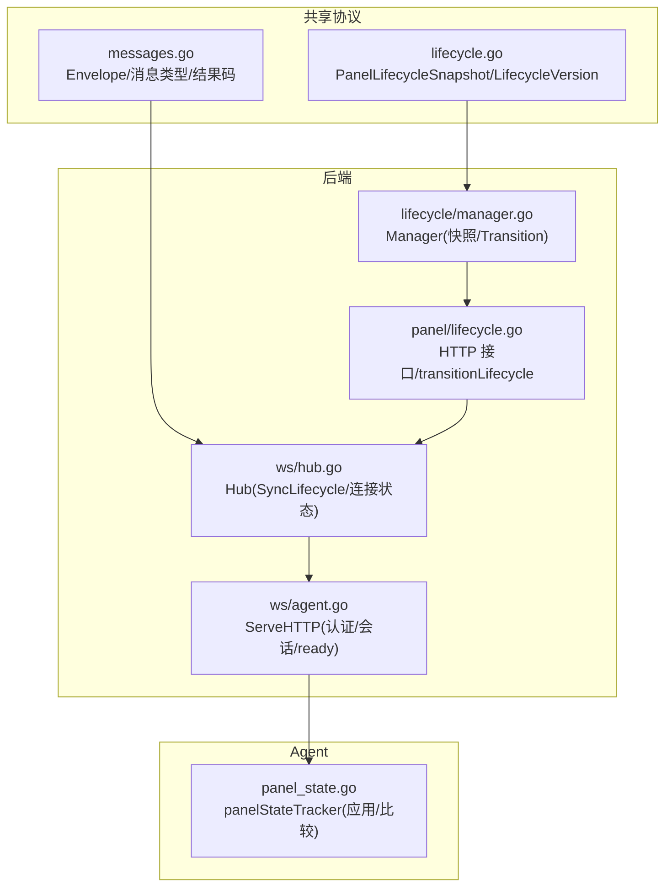
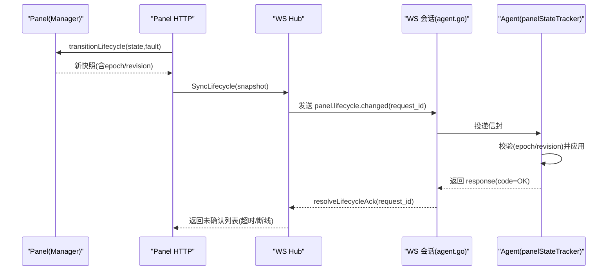
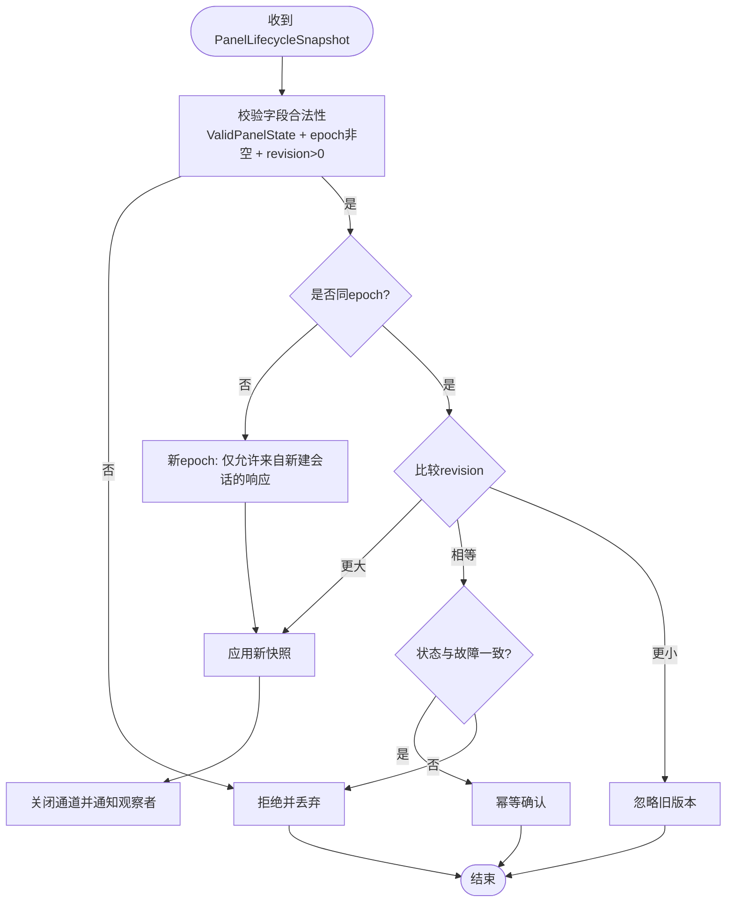
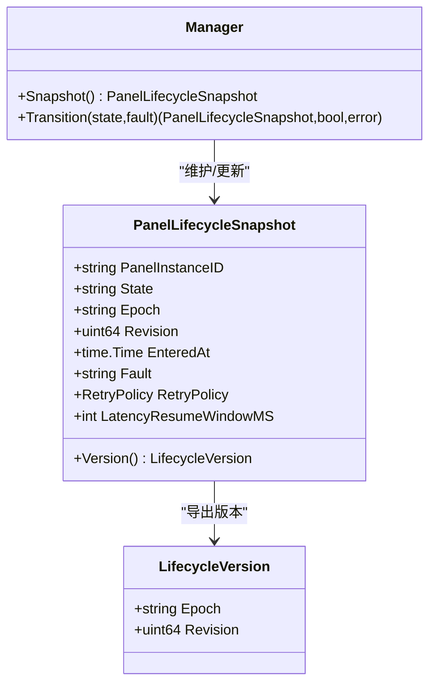
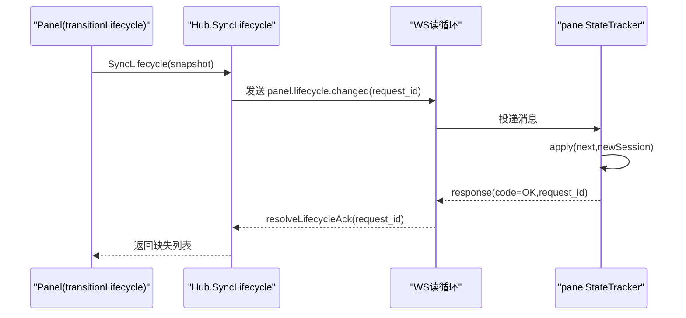
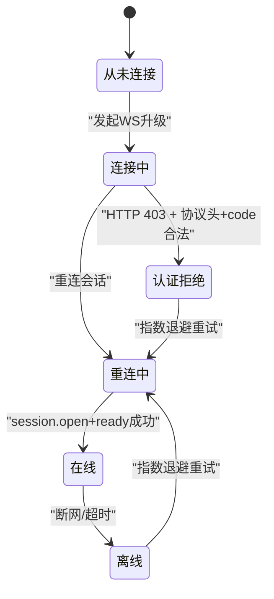
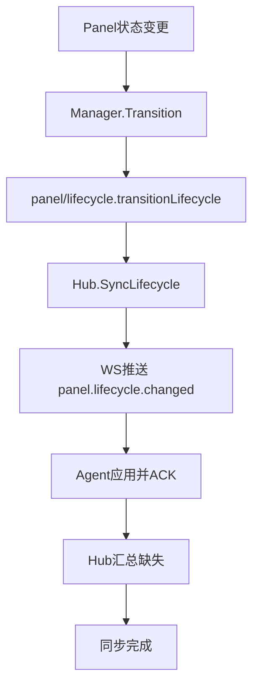
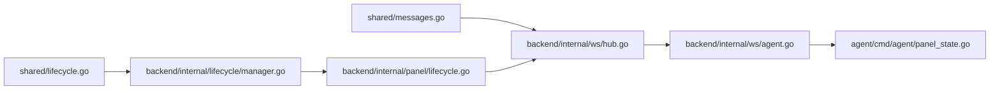

# 面板生命周期同步

<cite>
**本文引用的文件**   
- [src/shared/lifecycle.go](file://src/shared/lifecycle.go)
- [src/shared/messages.go](file://src/shared/messages.go)
- [src/backend/internal/lifecycle/manager.go](file://src/backend/internal/lifecycle/manager.go)
- [src/backend/internal/panel/lifecycle.go](file://src/backend/internal/panel/lifecycle.go)
- [src/backend/internal/ws/hub.go](file://src/backend/internal/ws/hub.go)
- [src/backend/internal/ws/agent.go](file://src/backend/internal/ws/agent.go)
- [src/agent/cmd/agent/panel_state.go](file://src/agent/cmd/agent/panel_state.go)
- [docs/panel-lifecycle-state-machine-design.md](file://docs/panel-lifecycle-state-machine-design.md)
</cite>

## 目录
1. [简介](#简介)
2. [项目结构](#项目结构)
3. [核心组件](#核心组件)
4. [架构总览](#架构总览)
5. [详细组件分析](#详细组件分析)
6. [依赖关系分析](#依赖关系分析)
7. [性能考量](#性能考量)
8. [故障排查指南](#故障排查指南)
9. [结论](#结论)
10. [附录](#附录)

## 简介
本文件面向 Lattix Agent 与 Panel（后端）之间的“面板生命周期同步机制”，围绕 PanelLifecycleSnapshot 的结构设计、版本管理、观察点记录、状态变更检测、生命周期版本递增规则、冲突处理策略、面板观察机制（注册、监听、上报）、以及 AuthRejected 标志的作用与使用场景进行系统化说明。文档同时提供流程图与状态转换图，帮助开发者理解 Panel 与 Agent 之间的状态同步过程与边界条件。

## 项目结构
与面板生命周期同步相关的代码分布在共享协议定义、后端生命周期管理器、WebSocket 会话与广播、以及 Agent 端状态跟踪等模块中：
- 共享协议与数据结构：src/shared/lifecycle.go、src/shared/messages.go
- 后端生命周期管理器：src/backend/internal/lifecycle/manager.go
- 后端 HTTP 接口与生命周期过渡：src/backend/internal/panel/lifecycle.go
- WebSocket Hub 与会话处理：src/backend/internal/ws/hub.go、src/backend/internal/ws/agent.go
- Agent 端面板状态跟踪器：src/agent/cmd/agent/panel_state.go
- 设计文档：docs/panel-lifecycle-state-machine-design.md

**图表来源** 
- [src/shared/lifecycle.go:27-45](file://src/shared/lifecycle.go#L27-L45)
- [src/shared/messages.go:72-91](file://src/shared/messages.go#L72-L91)
- [src/backend/internal/lifecycle/manager.go:13-51](file://src/backend/internal/lifecycle/manager.go#L13-L51)
- [src/backend/internal/panel/lifecycle.go:15-43](file://src/backend/internal/panel/lifecycle.go#L15-L43)
- [src/backend/internal/ws/hub.go:26-74](file://src/backend/internal/ws/hub.go#L26-L74)
- [src/backend/internal/ws/agent.go:31-120](file://src/backend/internal/ws/agent.go#L31-L120)
- [src/agent/cmd/agent/panel_state.go:9-51](file://src/agent/cmd/agent/panel_state.go#L9-L51)

**章节来源**
- [src/shared/lifecycle.go:1-86](file://src/shared/lifecycle.go#L1-L86)
- [src/shared/messages.go:1-137](file://src/shared/messages.go#L1-L137)
- [src/backend/internal/lifecycle/manager.go:1-63](file://src/backend/internal/lifecycle/manager.go#L1-L63)
- [src/backend/internal/panel/lifecycle.go:1-44](file://src/backend/internal/panel/lifecycle.go#L1-L44)
- [src/backend/internal/ws/hub.go:1-120](file://src/backend/internal/ws/hub.go#L1-L120)
- [src/backend/internal/ws/agent.go:1-120](file://src/backend/internal/ws/agent.go#L1-L120)
- [src/agent/cmd/agent/panel_state.go:1-52](file://src/agent/cmd/agent/panel_state.go#L1-L52)
- [docs/panel-lifecycle-state-machine-design.md:1-133](file://docs/panel-lifecycle-state-machine-design.md#L1-L133)

## 核心组件
- PanelLifecycleSnapshot：承载面板实例 ID、当前状态、epoch、revision、进入时间、故障摘要、重试策略、延迟恢复窗口等字段，并提供 Version() 方法返回 LifecycleVersion。
- LifecycleVersion：由 epoch 与 revision 组成，用于幂等与顺序控制。
- Manager：维护进程内权威快照，支持 Transition(state, fault) 原子更新并递增 revision，生成新的 RetryPolicy 与 EnteredAt。
- panelStateTracker（Agent 侧）：对收到的 PanelLifecycleSnapshot 进行校验与比较（epoch/revision），仅在合法且非回退时应用，并通过 channel 通知观察者。
- Hub（WS 层）：负责向所有在线 Agent 广播 lifecycle.changed 请求，收集 ACK，并在 session.open/ready 阶段参与生命周期一致性检查。
- agent.go（WS 握手与会话）：完成鉴权、session.open 响应（携带当前 PanelLifecycleSnapshot）、session.ready 的版本比对与冲突处理。

**章节来源**
- [src/shared/lifecycle.go:27-45](file://src/shared/lifecycle.go#L27-L45)
- [src/backend/internal/lifecycle/manager.go:18-51](file://src/backend/internal/lifecycle/manager.go#L18-L51)
- [src/agent/cmd/agent/panel_state.go:15-51](file://src/agent/cmd/agent/panel_state.go#L15-L51)
- [src/backend/internal/ws/hub.go:320-378](file://src/backend/internal/ws/hub.go#L320-L378)
- [src/backend/internal/ws/agent.go:113-197](file://src/backend/internal/ws/agent.go#L113-L197)

## 架构总览
Panel 作为期望状态的权威源，通过 Manager 维护生命周期快照；当状态变化时，通过 panel/lifecycle.transitionLifecycle 触发广播；Hub 将 panel.lifecycle.changed 请求发送至所有在线 Agent，等待 ACK；Agent 的 panelStateTracker 按版本规则应用新状态并通知上层。

**图表来源** 
- [src/backend/internal/panel/lifecycle.go:23-43](file://src/backend/internal/panel/lifecycle.go#L23-L43)
- [src/backend/internal/ws/hub.go:320-378](file://src/backend/internal/ws/hub.go#L320-L378)
- [src/backend/internal/ws/agent.go:230-238](file://src/backend/internal/ws/agent.go#L230-L238)
- [src/agent/cmd/agent/panel_state.go:29-51](file://src/agent/cmd/agent/panel_state.go#L29-L51)

## 详细组件分析

### PanelLifecycleSnapshot 与版本管理
- 字段职责：
  - PanelInstanceID：标识面板实例
  - State：面板全局状态（startup/active/updating/faulted）
  - Epoch：进程级随机标识，保证跨重启隔离
  - Revision：进程内单调递增，表示状态变化次数
  - EnteredAt：进入当前状态的时间
  - Fault：安全相关故障摘要
  - RetryPolicy：提示 Agent 的重试间隔范围
  - LatencyResumeWindowMS：延迟恢复窗口（毫秒）
- 版本生成与比较：
  - 每次 Transition 成功即递增 Revision，并更新时间与重试策略
  - Agent 仅接受相同 epoch 下更大的 revision；相同 revision 视为幂等确认；更小 revision 直接忽略
  - 新 epoch 仅从新建且已鉴权的 session.open 响应中接受

**图表来源** 
- [src/shared/lifecycle.go:47-54](file://src/shared/lifecycle.go#L47-L54)
- [src/backend/internal/lifecycle/manager.go:36-51](file://src/backend/internal/lifecycle/manager.go#L36-L51)
- [src/agent/cmd/agent/panel_state.go:29-51](file://src/agent/cmd/agent/panel_state.go#L29-L51)

**章节来源**
- [src/shared/lifecycle.go:27-45](file://src/shared/lifecycle.go#L27-L45)
- [src/backend/internal/lifecycle/manager.go:18-51](file://src/backend/internal/lifecycle/manager.go#L18-L51)
- [src/agent/cmd/agent/panel_state.go:29-51](file://src/agent/cmd/agent/panel_state.go#L29-L51)

### 生命周期版本递增与冲突处理
- 递增机制：
  - Manager.Transition 在状态或故障变化时递增 Revision，并设置 EnteredAt 与 RetryPolicy
  - 若状态与故障均未变化，则不变更快照且不触发广播
- 冲突处理：
  - Agent 侧对相同 epoch 下的 revision 严格比较，拒绝回退
  - 新 epoch 仅在新建且已鉴权会话的 session.open 响应中接受，避免备份恢复导致的倒退歧义
  - session.ready 时，Panel 会校验 Agent 上报的生命周期版本是否与当前一致，不一致则返回冲突

**图表来源** 
- [src/backend/internal/lifecycle/manager.go:13-51](file://src/backend/internal/lifecycle/manager.go#L13-L51)
- [src/shared/lifecycle.go:27-45](file://src/shared/lifecycle.go#L27-L45)

**章节来源**
- [src/backend/internal/lifecycle/manager.go:36-51](file://src/backend/internal/lifecycle/manager.go#L36-L51)
- [src/backend/internal/ws/agent.go:181-197](file://src/backend/internal/ws/agent.go#L181-L197)

### 面板观察机制（注册、监听、事件上报）
- 注册：
  - Panel 通过 panel/lifecycle.transitionLifecycle 调用 Manager.Transition，成功后根据 wait 参数选择同步或异步广播
- 监听：
  - Hub.SyncLifecycle 遍历在线连接，为每个连接分配 request_id 并注册 ACK 通道
  - 发送 panel.lifecycle.changed 请求，等待 ACK 或连接断开/上下文超时
- 事件上报：
  - Agent 的 panelStateTracker.apply 在应用成功后关闭通道以通知观察者
  - WS 读循环在收到 lifecycle.changed 的 response 且 code=OK 时，resolveLifecycleAck 完成等待

**图表来源** 
- [src/backend/internal/panel/lifecycle.go:23-43](file://src/backend/internal/panel/lifecycle.go#L23-L43)
- [src/backend/internal/ws/hub.go:320-378](file://src/backend/internal/ws/hub.go#L320-L378)
- [src/backend/internal/ws/agent.go:230-238](file://src/backend/internal/ws/agent.go#L230-L238)
- [src/agent/cmd/agent/panel_state.go:29-51](file://src/agent/cmd/agent/panel_state.go#L29-L51)

**章节来源**
- [src/backend/internal/panel/lifecycle.go:23-43](file://src/backend/internal/panel/lifecycle.go#L23-L43)
- [src/backend/internal/ws/hub.go:320-378](file://src/backend/internal/ws/hub.go#L320-L378)
- [src/backend/internal/ws/agent.go:230-238](file://src/backend/internal/ws/agent.go#L230-L238)
- [src/agent/cmd/agent/panel_state.go:29-51](file://src/agent/cmd/agent/panel_state.go#L29-L51)

### AuthRejected 标志的作用与使用场景
- 作用：
  - 区分“凭据明确无效”和“暂时不可用/网络问题”。当 Panel 无法读取身份数据或处于 faulted 时，返回 HTTP 503；当凭据明确无效时，返回 HTTP 403 并携带统一 RPC body 与协议头 X-Lattix-Protocol
  - Agent 只有在状态、协议标记、RPC code 与 ID 均合法时才进入 auth_rejected，否则按暂时网络故障重试
- 使用场景：
  - 首次 bootstrap 换发长期凭据失败或后续重连凭据无效时，进入 auth_rejected，停止业务命令投递
  - 删除服务器后残留 Agent 连接会得到明确 HTTP 403 并进入 auth_rejected，由管理员决定是否手工卸载
- 错误恢复：
  - Agent 在 auth_rejected 状态下遵循指数退避与最小/最大重试限制；Panel 可提供重试策略提示
  - 修复凭据或恢复服务后，Agent 重新建立 WS 并完成 session.open/ready 流程

**图表来源** 
- [src/backend/internal/ws/agent.go:31-75](file://src/backend/internal/ws/agent.go#L31-L75)
- [docs/panel-lifecycle-state-machine-design.md:65-89](file://docs/panel-lifecycle-state-machine-design.md#L65-L89)

**章节来源**
- [src/backend/internal/ws/agent.go:31-75](file://src/backend/internal/ws/agent.go#L31-L75)
- [docs/panel-lifecycle-state-machine-design.md:65-89](file://docs/panel-lifecycle-state-machine-design.md#L65-L89)

### 生命周期同步流程图与状态转换图
- 同步流程：
  - Panel 状态变化 -> Manager 更新快照 -> panel/lifecycle.transitionLifecycle 触发广播 -> Hub.SyncLifecycle 发送请求 -> Agent 应用并 ACK -> Hub 汇总缺失
- 状态转换：
  - startup/active/updating/faulted 四种全局状态，不同状态对 WS、业务命令、liveness、latency probe 的影响不同
  - Agent 连接状态 never_connected/connecting/reconnecting/online/offline/auth_rejected，反映连接与鉴权情况

**图表来源** 
- [src/backend/internal/lifecycle/manager.go:36-51](file://src/backend/internal/lifecycle/manager.go#L36-L51)
- [src/backend/internal/panel/lifecycle.go:23-43](file://src/backend/internal/panel/lifecycle.go#L23-L43)
- [src/backend/internal/ws/hub.go:320-378](file://src/backend/internal/ws/hub.go#L320-L378)
- [src/agent/cmd/agent/panel_state.go:29-51](file://src/agent/cmd/agent/panel_state.go#L29-L51)

**章节来源**
- [docs/panel-lifecycle-state-machine-design.md:18-49](file://docs/panel-lifecycle-state-machine-design.md#L18-L49)
- [docs/panel-lifecycle-state-machine-design.md:90-118](file://docs/panel-lifecycle-state-machine-design.md#L90-L118)

## 依赖关系分析
- shared/lifecycle.go 定义了 PanelLifecycleSnapshot、LifecycleVersion、RetryPolicy 等核心结构与常量
- shared/messages.go 定义了 Envelope、消息类型（如 panel.lifecycle.changed、agent.session.open/ready）与结果码
- backend/internal/lifecycle/manager.go 实现 Manager，提供 Snapshot 与 Transition
- backend/internal/panel/lifecycle.go 暴露 HTTP 接口与 transitionLifecycle，协调广播
- backend/internal/ws/hub.go 实现 Hub，负责连接管理与生命周期广播
- backend/internal/ws/agent.go 实现 WS 握手与会话流程，包含认证、session.open/ready、协议错误处理
- agent/cmd/agent/panel_state.go 实现 panelStateTracker，负责应用与比较生命周期快照

**图表来源** 
- [src/shared/lifecycle.go:27-45](file://src/shared/lifecycle.go#L27-L45)
- [src/shared/messages.go:72-91](file://src/shared/messages.go#L72-L91)
- [src/backend/internal/lifecycle/manager.go:13-51](file://src/backend/internal/lifecycle/manager.go#L13-L51)
- [src/backend/internal/panel/lifecycle.go:15-43](file://src/backend/internal/panel/lifecycle.go#L15-L43)
- [src/backend/internal/ws/hub.go:26-74](file://src/backend/internal/ws/hub.go#L26-L74)
- [src/backend/internal/ws/agent.go:31-120](file://src/backend/internal/ws/agent.go#L31-L120)
- [src/agent/cmd/agent/panel_state.go:9-51](file://src/agent/cmd/agent/panel_state.go#L9-L51)

**章节来源**
- [src/shared/lifecycle.go:1-86](file://src/shared/lifecycle.go#L1-L86)
- [src/shared/messages.go:1-137](file://src/shared/messages.go#L1-L137)
- [src/backend/internal/lifecycle/manager.go:1-63](file://src/backend/internal/lifecycle/manager.go#L1-L63)
- [src/backend/internal/panel/lifecycle.go:1-44](file://src/backend/internal/panel/lifecycle.go#L1-L44)
- [src/backend/internal/ws/hub.go:1-120](file://src/backend/internal/ws/hub.go#L1-L120)
- [src/backend/internal/ws/agent.go:1-120](file://src/backend/internal/ws/agent.go#L1-L120)
- [src/agent/cmd/agent/panel_state.go:1-52](file://src/agent/cmd/agent/panel_state.go#L1-L52)

## 性能考量
- 广播与 ACK：
  - Hub.SyncLifecycle 为每个在线连接分配 request_id 并注册 ACK 通道，超时或断线时移除 ACK 并计入缺失列表
  - 发送队列满视为慢连接并断开，重连后补发 queued 命令
- 心跳与超时：
  - Agent 每 30s 主动 Ping，Panel 90s 未收到任何字节判定连接死亡
  - writeTimeout 单次写超时，readDeadline 基于 Ping/Pong 续期
- 重试策略：
  - Panel 根据状态提供 RetryPolicy（updating/faulted/default），Agent 限制重试范围（1秒至5分钟）
  - latency 恢复窗口默认 0-30 秒，之后恢复正常测量

[本节为通用指导，不直接分析具体文件]

## 故障排查指南
- 常见问题定位：
  - 认证失败：检查 HTTP 403 响应是否携带协议头 X-Lattix-Protocol 与统一 RPC body；Agent 仅在此条件下进入 auth_rejected
  - 生命周期不一致：session.ready 时若版本不一致，Panel 返回冲突；检查 Agent 上报的 LifecycleVersion 与 Panel 当前版本
  - 广播未确认：Hub.SyncLifecycle 返回缺失列表，检查连接状态与日志中的协议错误
- 调试建议：
  - 查看 WS 读循环与 writePump 的日志，确认消息收发与超时
  - 检查 panelStateTracker.apply 的比较逻辑，确保 epoch/revision 正确
  - 关注 Manager.Transition 的状态与故障变化，确认是否触发广播

**章节来源**
- [src/backend/internal/ws/agent.go:264-274](file://src/backend/internal/ws/agent.go#L264-L274)
- [src/backend/internal/ws/hub.go:320-378](file://src/backend/internal/ws/hub.go#L320-L378)
- [src/agent/cmd/agent/panel_state.go:29-51](file://src/agent/cmd/agent/panel_state.go#L29-L51)

## 结论
PanelLifecycleSnapshot 与生命周期版本机制为 Panel 与 Agent 的状态同步提供了强一致性与幂等性保障。通过 Manager 的原子更新、Hub 的可靠广播与 ACK、Agent 的严格版本比较，系统能够在启动、更新、故障等复杂场景下保持状态一致。AuthRejected 标志明确了凭据失效与暂时不可用的边界，配合指数退避与重试策略，提升了系统的鲁棒性与可恢复性。

[本节为总结，不直接分析具体文件]

## 附录
- 关键常量与类型：
  - PanelStateStartup/Active/Updating/Faulted
  - ConnectionStateNeverConnected/Connecting/Reconnecting/Online/Offline/AuthRejected
  - SessionKindInitial/Reconnect
  - TypeSessionOpen/TypeSessionReady/TypeLifecycleChanged
- 设计要点：
  - 每次 Panel 进程启动生成随机 epoch，进程内每次状态变化递增 revision
  - 新 epoch 仅从新建且已鉴权会话的 session.open 响应中接受
  - session.ready 时校验生命周期版本，不一致则冲突

**章节来源**
- [src/shared/lifecycle.go:5-20](file://src/shared/lifecycle.go#L5-L20)
- [src/shared/messages.go:72-91](file://src/shared/messages.go#L72-L91)
- [docs/panel-lifecycle-state-machine-design.md:50-64](file://docs/panel-lifecycle-state-machine-design.md#L50-L64)