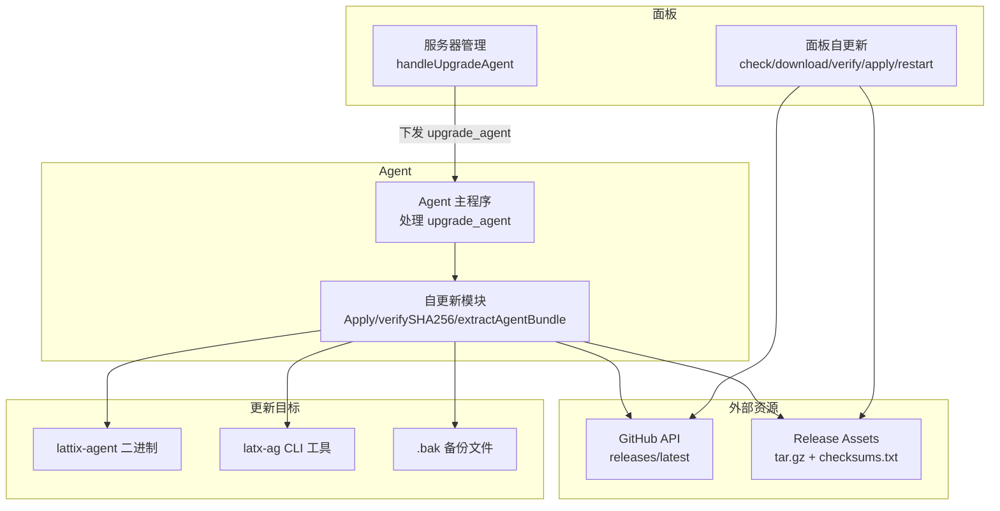
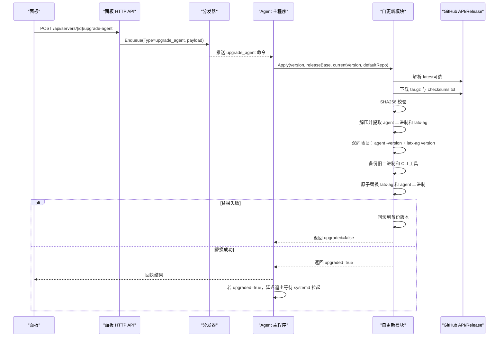
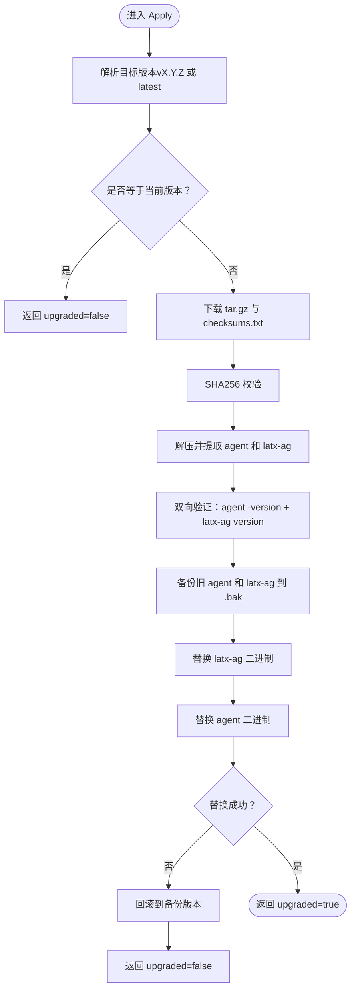
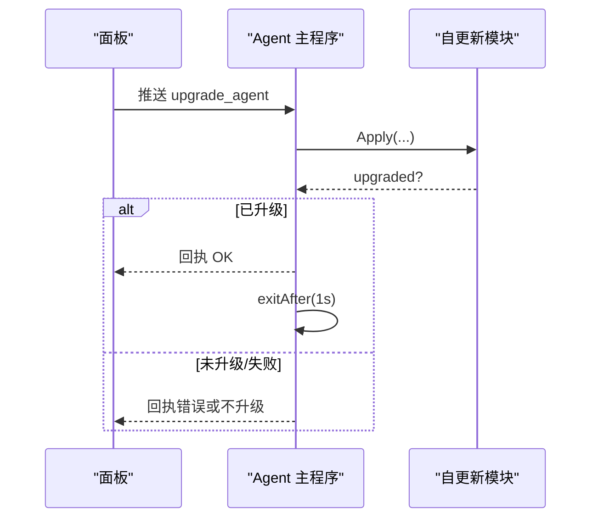
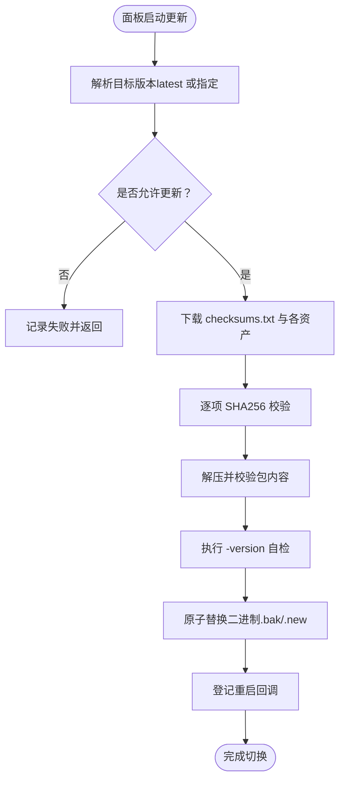
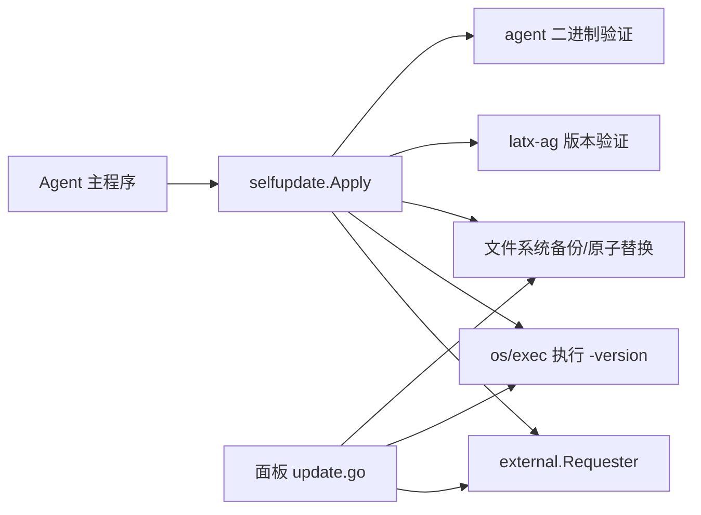
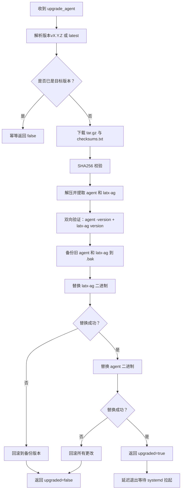

# 自更新机制

<cite>
**本文引用的文件**   
- [selfupdate.go](file://src/agent/internal/selfupdate/selfupdate.go)
- [selfupdate_test.go](file://src/agent/internal/selfupdate/selfupdate_test.go)
- [main.go（Agent）](file://src/agent/cmd/agent/main.go)
- [update.go（面板自更新）](file://src/backend/internal/panel/update.go)
- [servers.go（面板服务器管理）](file://src/backend/internal/panel/servers.go)
- [messages.go（共享消息定义）](file://src/shared/messages.go)
- [latx-ag.sh](file://scripts/latx-ag.sh)
</cite>

## 更新摘要
**所做更改**   
- 更新了自更新模块以支持双向验证机制，同时处理 agent 二进制和 latx-ag CLI 工具
- 增强了回滚机制，确保在替换过程中任何步骤失败都能恢复到原始状态
- 新增了两件套更新策略，确保 agent 和 latx-ag 始终来自同一个已校验的发布包
- 更新了流程图和架构图以反映新的双向验证和回滚逻辑

## 目录
1. [简介](#简介)
2. [项目结构](#项目结构)
3. [核心组件](#核心组件)
4. [架构总览](#架构总览)
5. [详细组件分析](#详细组件分析)
6. [依赖关系分析](#依赖关系分析)
7. [性能考虑](#性能考虑)
8. [故障排查指南](#故障排查指南)
9. [结论](#结论)
10. [附录](#附录)

## 简介
本文件系统性阐述 Lattix Agent 的自更新机制，覆盖版本检查、下载与完整性校验、原子替换、升级触发与失败处理等关键环节。新版本增强了双向验证机制，同时处理 agent 二进制和 latx-ag CLI 工具，并提供完善的回滚保障。同时给出与面板侧自更新的对照说明，帮助开发者理解从"面板下发命令"到"Agent 完成二进制替换并退出由 systemd 拉起"的完整闭环流程。

## 项目结构
与 Agent 自更新直接相关的代码主要分布在以下位置：
- Agent 端自更新实现：src/agent/internal/selfupdate/selfupdate.go
- Agent 主程序对升级命令的处理：src/agent/cmd/agent/main.go
- 面板端自更新实现（用于对比参考）：src/backend/internal/panel/update.go
- 面板端下发 Agent 升级命令：src/backend/internal/panel/servers.go
- 共享消息类型定义（含 UpgradeAgentPayload）：src/shared/messages.go
- latx-ag CLI 工具脚本：scripts/latx-ag.sh

**图表来源**
- [main.go（Agent）:640-670](file://src/agent/cmd/agent/main.go#L640-L670)
- [selfupdate.go:27-114](file://src/agent/internal/selfupdate/selfupdate.go#L27-L114)
- [servers.go（面板服务器管理）:628-672](file://src/backend/internal/panel/servers.go#L628-L672)
- [update.go（面板自更新）:137-159](file://src/backend/internal/panel/update.go#L137-L159)

## 核心组件
- **Agent 自更新模块（selfupdate.Apply）**
  - 负责解析目标版本（支持 vX.Y.Z 或 latest）、下载 tarball 与 checksums.txt、SHA256 校验、解压提取二进制、预检可执行性、备份旧二进制并原子替换、返回 upgraded 标志供调用方决定是否退出进程。
  - **增强功能**：现在同时处理 agent 二进制和 latx-ag CLI 工具，提供双向验证和完整的回滚机制。
- **Agent 主程序（upgrade_agent 路由）**
  - 接收面板下发的 upgrade_agent 命令，调用 selfupdate.Apply，成功后回执并延迟退出，交由 systemd 拉起新二进制。
- **面板自更新（update.go）**
  - 提供版本检测、下载、校验、解压、原子替换与重启流程，作为面板自身升级的实现参考。
- **面板服务器管理（servers.go）**
  - 暴露 /api/servers/{id}/upgrade-agent 接口，构造 UpgradeAgentPayload 并通过分发器下发至 Agent。
- **共享消息（messages.go）**
  - 定义 UpgradeAgentPayload（version、release_base），明确 Agent 自更新载荷字段语义。

**章节来源**
- [selfupdate.go:27-114](file://src/agent/internal/selfupdate/selfupdate.go#L27-L114)
- [main.go（Agent）:640-670](file://src/agent/cmd/agent/main.go#L640-L670)
- [update.go（面板自更新）:137-159](file://src/backend/internal/panel/update.go#L137-L159)
- [servers.go（面板服务器管理）:628-672](file://src/backend/internal/panel/servers.go#L628-L672)
- [messages.go（共享消息定义）:246-253](file://src/shared/messages.go#L246-L253)

## 架构总览
下图展示从面板发起升级到 Agent 完成替换的整体时序，包括新的双向验证和回滚机制。

**图表来源**
- [servers.go（面板服务器管理）:628-672](file://src/backend/internal/panel/servers.go#L628-L672)
- [main.go（Agent）:640-670](file://src/agent/cmd/agent/main.go#L640-L670)
- [selfupdate.go:27-114](file://src/agent/internal/selfupdate/selfupdate.go#L27-L114)

## 详细组件分析

### Agent 自更新模块（selfupdate.Apply）
- **版本解析**
  - 支持 vX.Y.Z 或 latest；latest 通过 GitHub API 解析 tag_name。
  - 当使用镜像基址时不支持 latest，必须显式指定版本号。
- **下载与校验**
  - 下载对应架构的 tar.gz 资产与 checksums.txt。
  - 解析 checksums.txt（sha256sum 标准格式），计算实际哈希比对。
- **解压与双向验证**
  - 仅提取 lattix-agent/lattix-agent 和 lattix-agent/latx-ag 两个二进制文件，防路径越界（tar slip）。
  - 设置可执行权限后执行 -version 自检，验证 agent 二进制可用性。
  - **新增**：同时验证 latx-ag CLI 工具的版本一致性。
- **原子替换与回滚**
  - 复制当前二进制为 .bak，写入新二进制到原路径（同文件系统 rename 保证原子性）。
  - **增强**：先备份两件套（agent 和 latx-ag），再替换管理命令和 agent。
  - **增强**：任一步失败都恢复到同一旧版本，确保系统一致性。
  - 返回 upgraded=true 表示已替换，调用方应退出进程由 systemd 拉起。

**图表来源**
- [selfupdate.go:27-114](file://src/agent/internal/selfupdate/selfupdate.go#L27-L114)

**章节来源**
- [selfupdate.go:27-114](file://src/agent/internal/selfupdate/selfupdate.go#L27-L114)
- [selfupdate_test.go:58-122](file://src/agent/internal/selfupdate/selfupdate_test.go#L58-L122)

### Agent 主程序（upgrade_agent 路由）
- 接收 Type=upgrade_agent 的命令，解析 Payload（version、release_base）。
- 调用 selfupdate.Apply，根据返回值决定后续行为：
  - 失败或未升级：直接返回。
  - 已升级：回执成功后延迟退出，等待 systemd 拉起新二进制。

**图表来源**
- [main.go（Agent）:640-670](file://src/agent/cmd/agent/main.go#L640-L670)
- [selfupdate.go:27-114](file://src/agent/internal/selfupdate/selfupdate.go#L27-L114)

**章节来源**
- [main.go（Agent）:640-670](file://src/agent/cmd/agent/main.go#L640-L670)

### 面板自更新（update.go）
- **版本检测**
  - 优先读取环境变量 LATX_RELEASE_BASE（镜像模式），否则走 GitHub API releases/latest。
  - dev 构建且无镜像基址时不可更新。
- **下载与校验**
  - 先下载 checksums.txt，再按阶段带进度下载各资产。
  - 逐资产进行 SHA256 校验。
- **解压与预检**
  - 解压 tar.gz，校验包内包含 lattix-backend。
  - 执行 -version 自检，确保输出为目标版本。
- **原子替换与重启**
  - replaceExecutable 将新二进制以 .new 写入，rename 旧二进制为 .bak，再 rename .new 就位。
  - 登记重启回调，由生命周期管理器或容器运行时拉起新版本。

**图表来源**
- [update.go（面板自更新）:137-159](file://src/backend/internal/panel/update.go#L137-L159)
- [update.go（面板自更新）:258-426](file://src/backend/internal/panel/update.go#L258-L426)

**章节来源**
- [update.go（面板自更新）:1-159](file://src/backend/internal/panel/update.go#L1-L159)
- [update.go（面板自更新）:258-426](file://src/backend/internal/panel/update.go#L258-L426)

### 面板下发 Agent 升级命令（servers.go）
- 暴露 /api/servers/{id}/upgrade-agent 接口。
- 校验 server_id 与 version（支持 latest 或 vX.Y.Z）。
- 构造 UpgradeAgentPayload（version、release_base），通过分发器下发至 Agent。

**章节来源**
- [servers.go（面板服务器管理）:628-672](file://src/backend/internal/panel/servers.go#L628-L672)
- [messages.go（共享消息定义）:246-253](file://src/shared/messages.go#L246-L253)

## 依赖关系分析
- Agent 自更新模块依赖外部网络请求器（external.ExternalFileRequester/ExternalJSONRequester）拉取 Release 资产与 API。
- Agent 主程序依赖 shared 消息类型定义，解析 upgrade_agent 载荷。
- 面板自更新与 Agent 自更新在流程上高度一致（check→download→verify→extract→apply→restart），但面板侧具备更完善的进度上报与生命周期状态机。
- **新增依赖**：现在需要同时处理两个二进制文件的验证和替换操作。

**图表来源**
- [selfupdate.go:163-167](file://src/agent/internal/selfupdate/selfupdate.go#L163-L167)
- [update.go（面板自更新）:428-443](file://src/backend/internal/panel/update.go#L428-L443)

**章节来源**
- [selfupdate.go:163-167](file://src/agent/internal/selfupdate/selfupdate.go#L163-L167)
- [update.go（面板自更新）:428-443](file://src/backend/internal/panel/update.go#L428-L443)

## 性能考虑
- **网络超时**
  - Agent 自更新默认 HTTP 超时 120 秒；面板自更新下载超时 10 分钟，适合大文件下载。
- **校验开销**
  - SHA256 校验需全量读取文件，建议在 SSD 环境执行以减少 I/O 瓶颈。
  - **新增**：双向验证增加了额外的版本检查开销，但确保了一致性。
- **解压与预检**
  - 仅提取必要二进制，避免多余 I/O；-version 自检快速验证二进制可用性。
  - **新增**：需要验证两个二进制文件，但仍在合理范围内。
- **原子替换**
  - 使用同文件系统 rename 保证原子性，避免跨文件系统回退导致的额外复制开销。
  - **新增**：回滚机制增加了额外的文件操作，但保证了数据一致性。

## 故障排查指南
- **下载失败**
  - 检查网络连通性与 Release 地址是否正确；确认 checksums.txt 是否存在。
- **校验失败**
  - 核对 checksums.txt 中期望值与实际文件哈希是否一致；检查下载过程是否被篡改。
- **二进制自检失败**
  - 确认新二进制可执行且 -version 输出非空；检查权限与运行环境。
  - **新增**：检查 latx-ag CLI 工具版本是否与 agent 版本匹配。
- **替换失败**
  - 检查目标路径权限与磁盘空间；确认 .bak 备份生成情况。
  - **新增**：检查回滚机制是否正确执行，确保系统恢复到原始状态。
- **升级中断恢复**
  - Agent 侧：若 upgraded=true，进程会延迟退出并由 systemd 拉起；如未拉起，检查 systemd 服务状态。
  - 面板侧：失败停留在 failed 状态，可通过 /api/panel/update/status 轮询查看错误信息。

**章节来源**
- [selfupdate_test.go:91-122](file://src/agent/internal/selfupdate/selfupdate_test.go#L91-L122)
- [update.go（面板自更新）:240-256](file://src/backend/internal/panel/update.go#L240-L256)

## 结论
Lattix Agent 的自更新机制围绕"安全下载—严格校验—原子替换—可控退出"展开，新版本增强了双向验证机制，同时处理 agent 二进制和 latx-ag CLI 工具，并提供完善的回滚保障。结合面板端的统一命令下发与状态上报，形成可靠的升级闭环。面板自更新提供了更丰富的进度与生命周期管理能力，可作为 Agent 自更新的演进参考。建议在生产环境中启用镜像基址以提升稳定性与可控性，并确保 checksums.txt 与 Release 资产的一致性。

## 附录

### 升级流程图（Agent 自更新 - 增强版）

**图表来源**
- [selfupdate.go:27-114](file://src/agent/internal/selfupdate/selfupdate.go#L27-L114)
- [main.go（Agent）:640-670](file://src/agent/cmd/agent/main.go#L640-L670)

### 安全考虑说明
- **版本来源可信**
  - 优先使用官方 GitHub Releases；镜像模式下通过 latest.txt 或固定版本控制。
- **完整性校验**
  - 强制校验 checksums.txt 中的 SHA256，缺失或失败即中止升级。
- **二进制可信**
  - 执行 -version 自检，确保新二进制可运行且版本匹配。
  - **新增**：双向验证确保 agent 和 latx-ag 版本一致性。
- **原子性与回滚**
  - 使用 .bak 备份与同文件系统 rename 保证原子替换；失败时保留旧版本可用。
  - **增强**：完整的回滚机制确保任何步骤失败都能恢复到原始状态。
- **最小权限与路径限制**
  - 解压时限制目标路径，防止 tar slip；仅提取必要二进制。
  - **新增**：同时处理两个二进制文件的安全验证。

**章节来源**
- [selfupdate.go:131-161](file://src/agent/internal/selfupdate/selfupdate.go#L131-L161)
- [update.go（面板自更新）:445-475](file://src/backend/internal/panel/update.go#L445-L475)