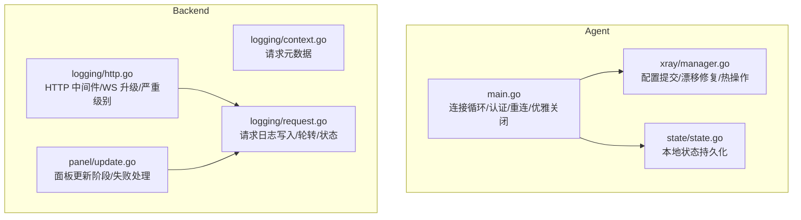
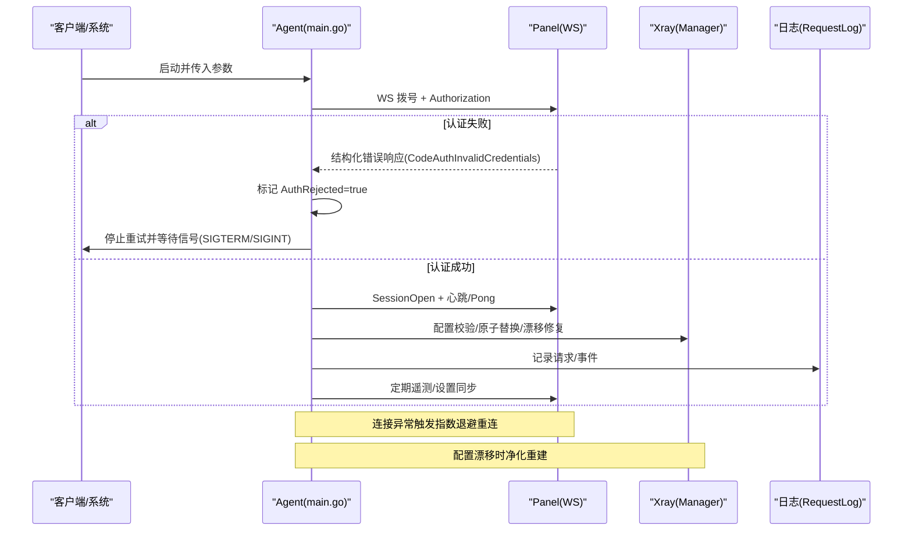
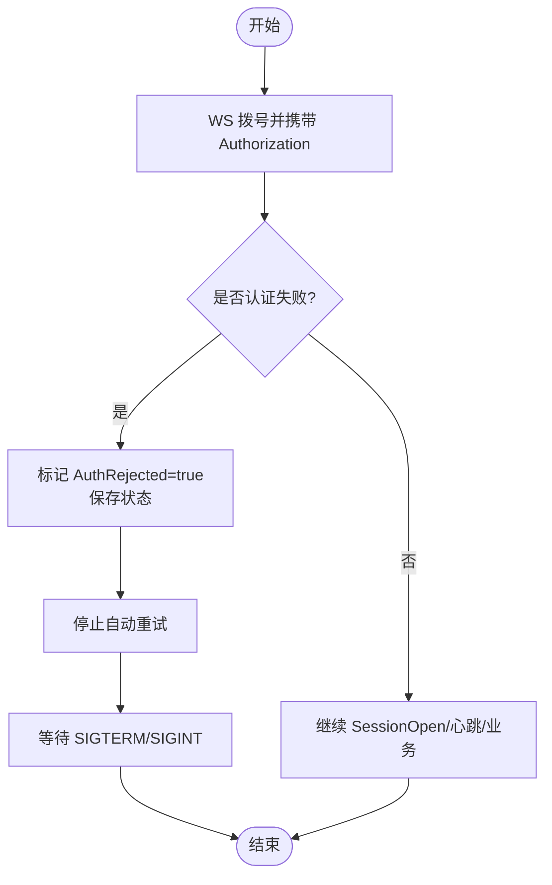
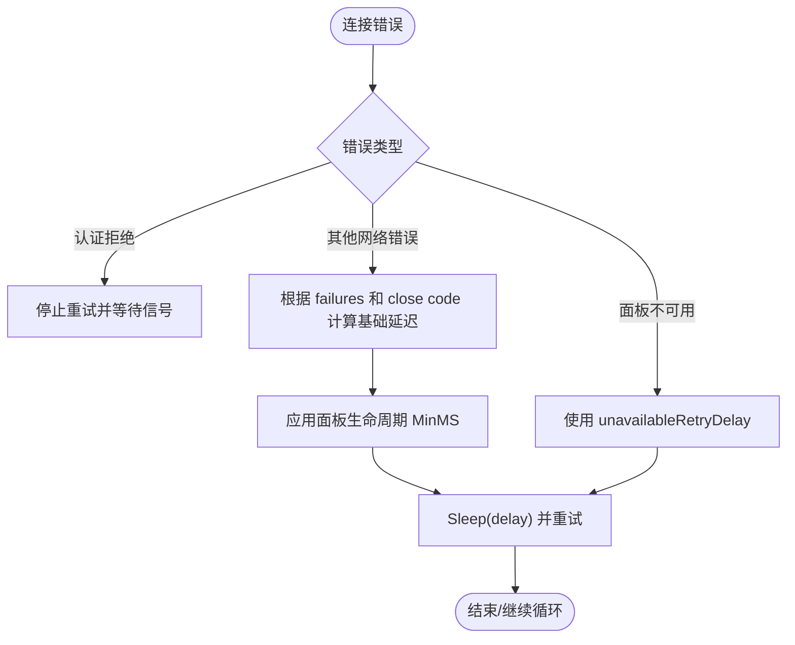
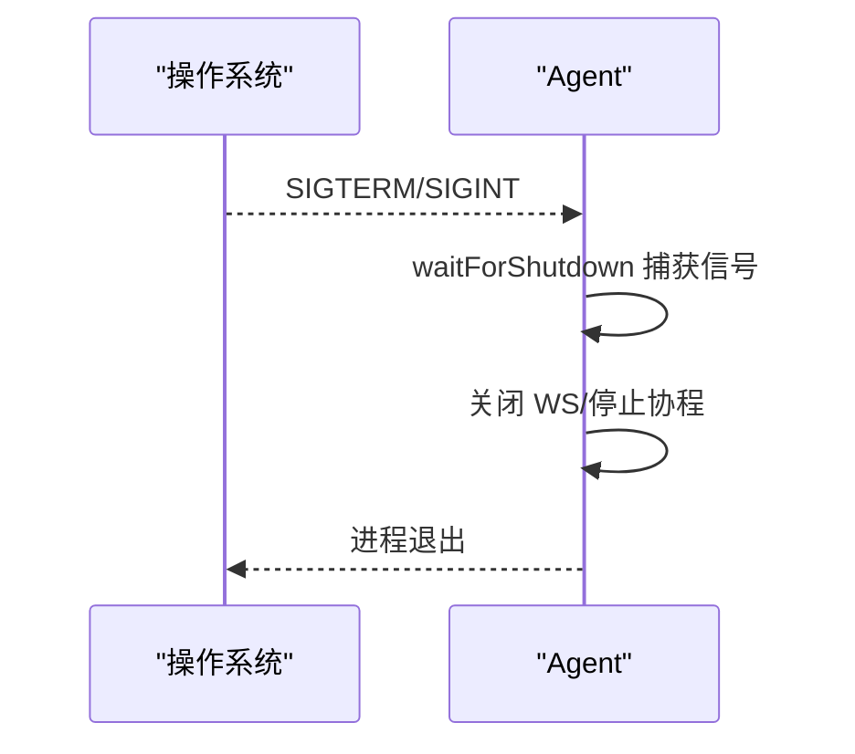
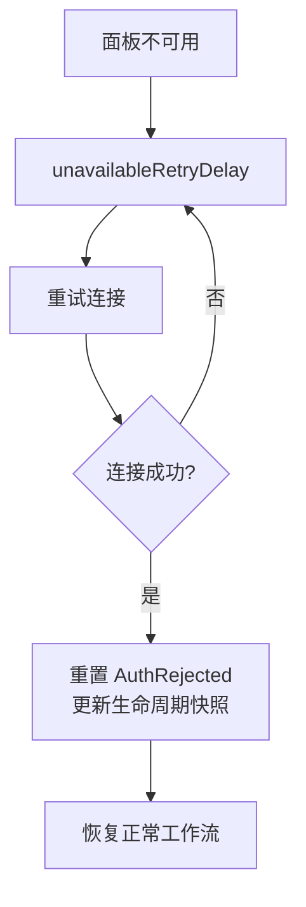
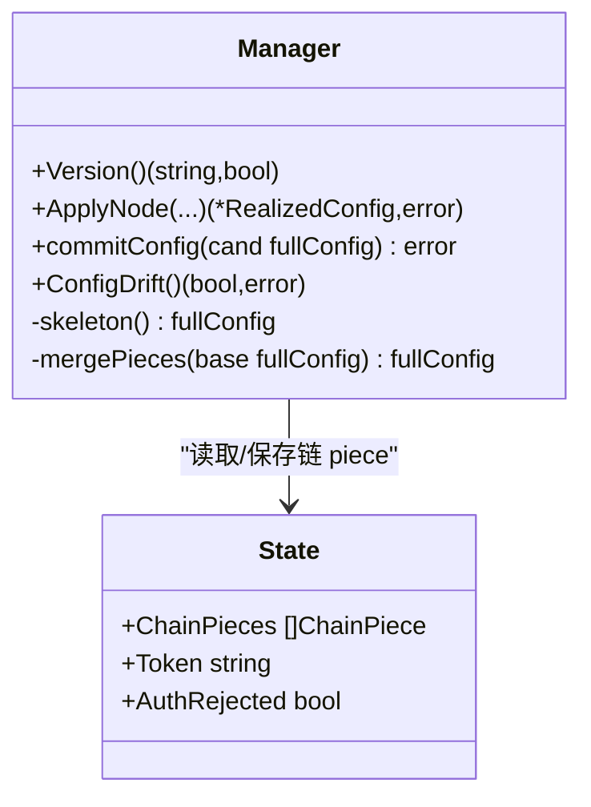
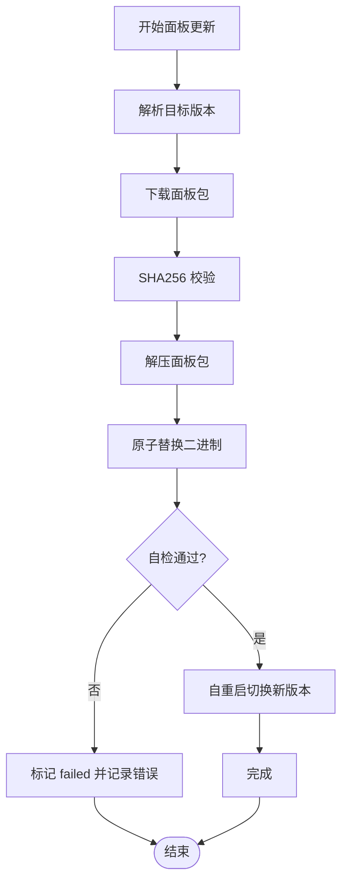
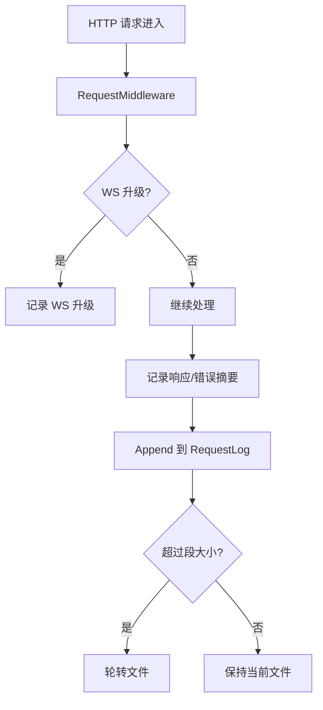
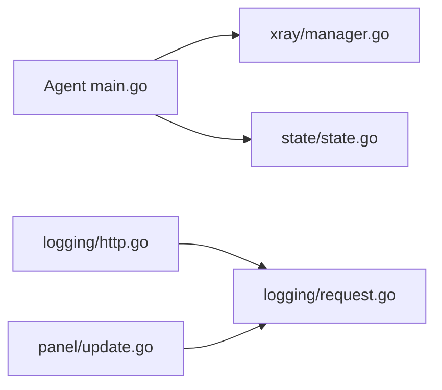

# 错误处理和恢复

<cite>
**本文引用的文件**   
- [src/agent/cmd/agent/main.go](file://src/agent/cmd/agent/main.go)
- [src/backend/internal/logging/context.go](file://src/backend/internal/logging/context.go)
- [src/backend/internal/logging/http.go](file://src/backend/internal/logging/http.go)
- [src/backend/internal/logging/request.go](file://src/backend/internal/logging/request.go)
- [src/agent/internal/xray/manager.go](file://src/agent/internal/xray/manager.go)
- [src/backend/internal/panel/update.go](file://src/backend/internal/panel/update.go)
- [src/backend/internal/ws/agent_test.go](file://src/backend/internal/ws/agent_test.go)
- [src/agent/internal/state/state.go](file://src/agent/internal/state/state.go)
</cite>

## 目录
1. [引言](#引言)
2. [项目结构](#项目结构)
3. [核心组件](#核心组件)
4. [架构总览](#架构总览)
5. [详细组件分析](#详细组件分析)
6. [依赖关系分析](#依赖关系分析)
7. [性能考量](#性能考量)
8. [故障排查指南](#故障排查指南)
9. [结论](#结论)
10. [附录](#附录)

## 引言
本文件面向 Lattix Agent 的错误处理与恢复机制，聚焦以下主题：
- 认证失败处理：凭证拒绝检测、自动停止重试、用户提示
- 连接异常恢复：网络错误分类、重连延迟计算、指数退避策略
- 优雅关闭机制：信号监听、资源清理、进程退出码设置
- 面板不可用处理：服务降级策略、本地缓存使用、恢复检测
- 日志记录规范：错误级别分类、上下文信息记录、调试信息输出
并提供流程图与最佳实践建议，帮助开发者实现健壮的错误处理。

## 项目结构
围绕错误处理与恢复的关键代码主要分布在：
- Agent 主循环与重连逻辑（认证、退避、优雅关闭）
- Xray 配置管理与漂移修复
- 后端请求日志与 HTTP 中间件（错误级别、上下文）
- 面板更新流程（原子替换、失败回退）
- Agent 状态持久化（认证拒绝标记、链 piece 落盘）

**图表来源** 
- [src/agent/cmd/agent/main.go:1-120](file://src/agent/cmd/agent/main.go#L1-L120)
- [src/agent/internal/xray/manager.go:232-371](file://src/agent/internal/xray/manager.go#L232-L371)
- [src/agent/internal/state/state.go:1-29](file://src/agent/internal/state/state.go#L1-L29)
- [src/backend/internal/logging/context.go:1-67](file://src/backend/internal/logging/context.go#L1-L67)
- [src/backend/internal/logging/http.go:1-120](file://src/backend/internal/logging/http.go#L1-L120)
- [src/backend/internal/logging/request.go:1-120](file://src/backend/internal/logging/request.go#L1-L120)
- [src/backend/internal/panel/update.go:33-120](file://src/backend/internal/panel/update.go#L33-L120)

**章节来源**
- [src/agent/cmd/agent/main.go:1-120](file://src/agent/cmd/agent/main.go#L1-L120)
- [src/backend/internal/logging/http.go:1-120](file://src/backend/internal/logging/http.go#L1-L120)

## 核心组件
- Agent 主循环与重连策略：负责 WS 握手、认证、会话建立、心跳保活、指数退避重连、认证拒绝终止重试、优雅关闭等待信号。
- Xray 管理器：负责配置校验、原子替换、漂移检测与修复、热操作失败回滚。
- 日志子系统：HTTP 中间件、WebSocket 升级记录、请求日志持久化、错误级别判定、上下文传播。
- 面板更新器：多阶段更新、原子替换、失败回退、重启切换。
- Agent 状态：持久化 token、面板实例 ID、认证拒绝标志、链 piece 记录。

**章节来源**
- [src/agent/cmd/agent/main.go:60-120](file://src/agent/cmd/agent/main.go#L60-L120)
- [src/agent/internal/xray/manager.go:232-371](file://src/agent/internal/xray/manager.go#L232-L371)
- [src/backend/internal/logging/http.go:120-200](file://src/backend/internal/logging/http.go#L120-L200)
- [src/backend/internal/panel/update.go:200-260](file://src/backend/internal/panel/update.go#L200-L260)
- [src/agent/internal/state/state.go:1-29](file://src/agent/internal/state/state.go#L1-L29)

## 架构总览
下图展示 Agent 与 Backend 在错误处理与恢复中的交互路径：认证失败、连接异常、面板不可用、配置漂移、更新失败等关键路径。

**图表来源** 
- [src/agent/cmd/agent/main.go:138-198](file://src/agent/cmd/agent/main.go#L138-L198)
- [src/backend/internal/ws/agent_test.go:42-64](file://src/backend/internal/ws/agent_test.go#L42-L64)
- [src/agent/internal/xray/manager.go:232-371](file://src/agent/internal/xray/manager.go#L232-L371)
- [src/backend/internal/logging/request.go:100-160](file://src/backend/internal/logging/request.go#L100-L160)

## 详细组件分析

### 认证失败处理
- 握手阶段的结构化错误：当 WS 握手返回认证失败时，后端以结构化 Envelope 返回 CodeAuthInvalidCredentials，Agent 识别为明确拒绝。
- 凭证拒绝检测：Agent 将 AuthRejected 标志写入本地状态，避免无限重试；同时记录日志提示需重新绑定。
- 自动停止重试：检测到认证拒绝后，进入 waitForShutdown 等待 SIGTERM/SIGINT 信号，由外部进程管理器或用户干预重启。
- 用户提示：日志中明确说明“面板可能已重建或凭证已替换”，指导用户使用新安装命令重新绑定。

**图表来源** 
- [src/agent/cmd/agent/main.go:138-154](file://src/agent/cmd/agent/main.go#L138-L154)
- [src/agent/cmd/agent/main.go:69-98](file://src/agent/cmd/agent/main.go#L69-L98)
- [src/backend/internal/ws/agent_test.go:42-64](file://src/backend/internal/ws/agent_test.go#L42-L64)
- [src/agent/internal/state/state.go:14-23](file://src/agent/internal/state/state.go#L14-L23)

**章节来源**
- [src/agent/cmd/agent/main.go:69-110](file://src/agent/cmd/agent/main.go#L69-L110)
- [src/backend/internal/ws/agent_test.go:42-64](file://src/backend/internal/ws/agent_test.go#L42-L64)
- [src/agent/internal/state/state.go:14-23](file://src/agent/internal/state/state.go#L14-L23)

### 连接异常恢复
- 网络错误分类：区分普通网络错误与面板暂时不可用（如 5xx/超时），以及认证拒绝。
- 重连延迟计算：基于失败次数与 WebSocket 关闭码计算基础延迟，结合面板生命周期观察的 MinMS 进行修正。
- 指数退避策略：外层循环对 failures 计数，按指数增长退避；面板不可用时采用专用 unavailableRetryDelay。
- 心跳与保活：Pong 回调重置读超时，任何消息到达续期；心跳协程周期性发送 liveness。

**图表来源** 
- [src/agent/cmd/agent/main.go:78-96](file://src/agent/cmd/agent/main.go#L78-L96)
- [src/agent/cmd/agent/main.go:118-136](file://src/agent/cmd/agent/main.go#L118-L136)
- [src/agent/cmd/agent/main.go:238-252](file://src/agent/cmd/agent/main.go#L238-L252)

**章节来源**
- [src/agent/cmd/agent/main.go:78-96](file://src/agent/cmd/agent/main.go#L78-L96)
- [src/agent/cmd/agent/main.go:118-136](file://src/agent/cmd/agent/main.go#L118-L136)
- [src/agent/cmd/agent/main.go:238-252](file://src/agent/cmd/agent/main.go#L238-L252)

### 优雅关闭机制
- 信号监听：waitForShutdown 注册 SIGTERM/SIGINT，收到信号后退出，避免 systemd Restart=always 导致无限重试。
- 资源清理：WS 连接在 defer 中关闭；心跳与遥测协程通过 done channel 退出；配置漂移检测协程同样受控退出。
- 进程退出码设置：正常退出无显式设置；认证拒绝场景下由外部进程管理器决定退出码（通常 0 或 1 取决于实现）。

**图表来源** 
- [src/agent/cmd/agent/main.go:105-110](file://src/agent/cmd/agent/main.go#L105-L110)
- [src/agent/cmd/agent/main.go:258-276](file://src/agent/cmd/agent/main.go#L258-L276)

**章节来源**
- [src/agent/cmd/agent/main.go:105-110](file://src/agent/cmd/agent/main.go#L105-L110)
- [src/agent/cmd/agent/main.go:258-276](file://src/agent/cmd/agent/main.go#L258-L276)

### 面板不可用处理
- 服务降级策略：当面板暂时不可用时，Agent 使用 unavailableRetryDelay 进行重连，避免频繁重试造成雪崩。
- 本地缓存使用：Agent 本地 state.json 保留 token、面板实例 ID、链 piece 等信息，用于重启后快速重建配置。
- 恢复检测：SessionOpen 成功后重置 AuthRejected，并更新面板生命周期快照；心跳与遥测确保链路健康。

**图表来源** 
- [src/agent/cmd/agent/main.go:88-96](file://src/agent/cmd/agent/main.go#L88-L96)
- [src/agent/internal/state/state.go:14-23](file://src/agent/internal/state/state.go#L14-L23)
- [src/agent/cmd/agent/main.go:223-232](file://src/agent/cmd/agent/main.go#L223-L232)

**章节来源**
- [src/agent/cmd/agent/main.go:88-96](file://src/agent/cmd/agent/main.go#L88-L96)
- [src/agent/internal/state/state.go:14-23](file://src/agent/internal/state/state.go#L14-L23)
- [src/agent/cmd/agent/main.go:223-232](file://src/agent/cmd/agent/main.go#L223-L232)

### 配置漂移与恢复
- 漂移检测：对比当前配置文件哈希与上次受管落盘的哈希，若不一致则视为漂移。
- 净化重建：以骨架配置为基础，合并受管节点 inbound 与链 piece，丢弃外部改动内容。
- 热操作失败回滚：热操作失败且重启失败时，回滚到上一份可用配置并再次尝试重启。

**图表来源** 
- [src/agent/internal/xray/manager.go:232-371](file://src/agent/internal/xray/manager.go#L232-L371)
- [src/agent/internal/state/state.go:14-29](file://src/agent/internal/state/state.go#L14-L29)

**章节来源**
- [src/agent/internal/xray/manager.go:232-371](file://src/agent/internal/xray/manager.go#L232-L371)
- [src/agent/internal/state/state.go:14-29](file://src/agent/internal/state/state.go#L14-L29)

### 面板更新失败处理
- 阶段化更新：check/download/verify/extract/apply/restart/done/failed。
- 原子替换：先写临时文件，校验通过后原子替换二进制；失败则清理临时文件并记录错误。
- 失败回退：更新失败时标记 failed，记录操作日志，必要时回滚生命周期状态。

**图表来源** 
- [src/backend/internal/panel/update.go:33-120](file://src/backend/internal/panel/update.go#L33-L120)
- [src/backend/internal/panel/update.go:389-421](file://src/backend/internal/panel/update.go#L389-L421)

**章节来源**
- [src/backend/internal/panel/update.go:33-120](file://src/backend/internal/panel/update.go#L33-L120)
- [src/backend/internal/panel/update.go:389-421](file://src/backend/internal/panel/update.go#L389-L421)

### 日志记录规范
- 错误级别分类：根据 HTTP 状态码、RPC 代码、耗时、panic 情况判定 Severity（Info/Warning/Error）。
- 上下文信息记录：RequestID、TraceID、RPCCode、SafeMessage、Attributes（白名单字段）、Operator、IP、UserAgent。
- 调试信息输出：WebSocket 升级立即记录；高频 event 由调用方过滤；请求日志支持 Tail/Clear/SetMaxBytes/Status。

**图表来源** 
- [src/backend/internal/logging/http.go:43-105](file://src/backend/internal/logging/http.go#L43-L105)
- [src/backend/internal/logging/http.go:107-152](file://src/backend/internal/logging/http.go#L107-L152)
- [src/backend/internal/logging/request.go:112-150](file://src/backend/internal/logging/request.go#L112-L150)

**章节来源**
- [src/backend/internal/logging/http.go:43-105](file://src/backend/internal/logging/http.go#L43-L105)
- [src/backend/internal/logging/http.go:107-152](file://src/backend/internal/logging/http.go#L107-L152)
- [src/backend/internal/logging/request.go:112-150](file://src/backend/internal/logging/request.go#L112-L150)

## 依赖关系分析
- Agent 主循环依赖 xray.Manager 进行配置管理，依赖 state.State 进行持久化。
- 后端日志模块依赖 shared 协议定义（RPC 代码、Envelope 结构）。
- 面板更新器依赖文件系统操作与进程管理（systemd 或自派生）。

**图表来源** 
- [src/agent/cmd/agent/main.go:1-120](file://src/agent/cmd/agent/main.go#L1-L120)
- [src/agent/internal/xray/manager.go:232-371](file://src/agent/internal/xray/manager.go#L232-L371)
- [src/agent/internal/state/state.go:1-29](file://src/agent/internal/state/state.go#L1-L29)
- [src/backend/internal/logging/http.go:1-120](file://src/backend/internal/logging/http.go#L1-L120)
- [src/backend/internal/logging/request.go:1-120](file://src/backend/internal/logging/request.go#L1-L120)
- [src/backend/internal/panel/update.go:33-120](file://src/backend/internal/panel/update.go#L33-L120)

**章节来源**
- [src/agent/cmd/agent/main.go:1-120](file://src/agent/cmd/agent/main.go#L1-L120)
- [src/backend/internal/logging/http.go:1-120](file://src/backend/internal/logging/http.go#L1-L120)

## 性能考量
- 指数退避重连：避免风暴式重试，降低后端压力。
- 心跳与保活：Pong 回调与读超时控制，减少无效连接占用。
- 日志轮转：按段大小轮转，限制磁盘占用，Tail 接口高效读取尾部行。
- 配置漂移检测：哈希比对轻量级，仅在变化时上报。

[本节为通用指导，不直接分析具体文件]

## 故障排查指南
- 认证失败：检查 WS 握手返回的 CodeAuthInvalidCredentials，确认 token 是否过期或被替换；查看 Agent 日志中的“面板明确拒绝当前凭证”提示。
- 连接异常：观察重连延迟与失败次数，确认网络连通性与面板可用性；检查心跳与 Pong 是否正常。
- 配置漂移：查看 xray 配置哈希变化，确认是否有外部修改；关注净化重建日志。
- 面板更新失败：检查更新阶段与错误信息，确认二进制自检是否通过；查看操作日志记录。
- 日志问题：确认 RequestLog 目录权限与大小限制；使用 Tail/Status 接口检查状态。

**章节来源**
- [src/agent/cmd/agent/main.go:69-98](file://src/agent/cmd/agent/main.go#L69-L98)
- [src/agent/internal/xray/manager.go:275-303](file://src/agent/internal/xray/manager.go#L275-L303)
- [src/backend/internal/panel/update.go:240-260](file://src/backend/internal/panel/update.go#L240-L260)
- [src/backend/internal/logging/request.go:128-156](file://src/backend/internal/logging/request.go#L128-L156)

## 结论
Lattix Agent 的错误处理与恢复机制围绕认证拒绝、连接异常、面板不可用、配置漂移与更新失败等关键场景设计，具备明确的错误分类、指数退避、优雅关闭、本地缓存与日志追踪能力。通过结构化错误响应、上下文传播与阶段化更新，系统在异常情况下仍能保持稳定与可观测性。

[本节为总结，不直接分析具体文件]

## 附录
- 最佳实践建议：
  - 始终使用结构化错误响应与 RPC 代码，便于上层统一处理。
  - 重连策略应结合失败次数与外部约束（如面板生命周期 MinMS）。
  - 配置变更必须经过校验与原子替换，失败时回滚到已知良好状态。
  - 日志记录应包含必要上下文（RequestID、TraceID、RPCCode），并控制敏感信息泄露。
  - 优雅关闭需确保所有协程与资源正确释放，避免僵尸进程或资源泄漏。

[本节为通用建议，不直接分析具体文件]