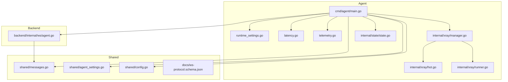
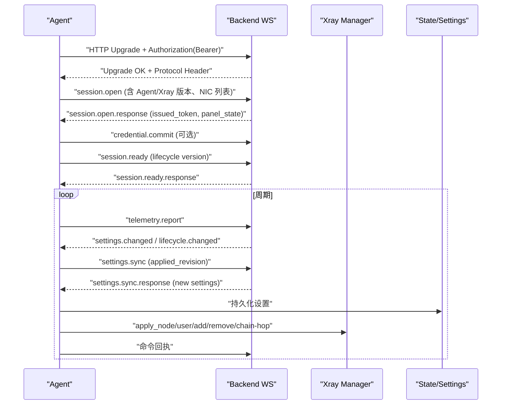
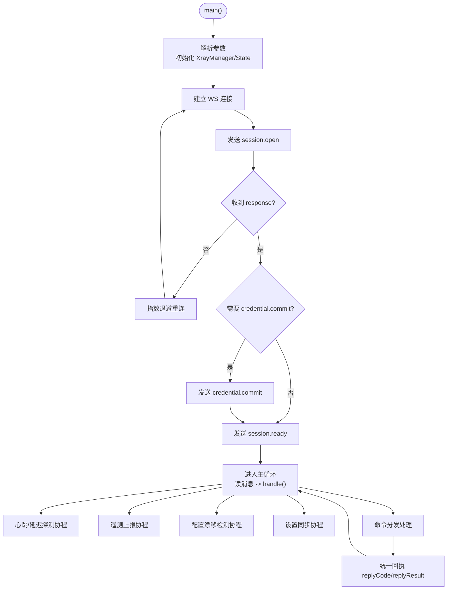
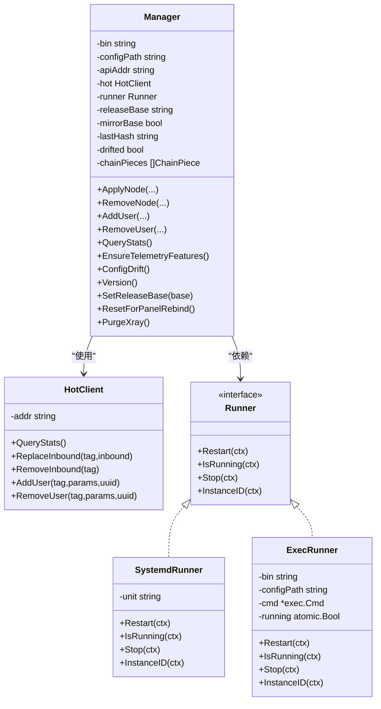
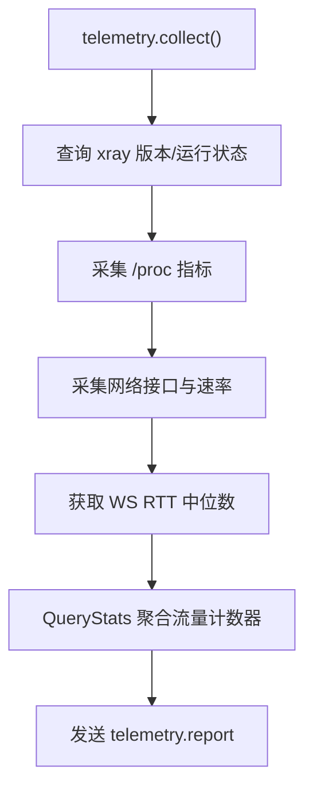
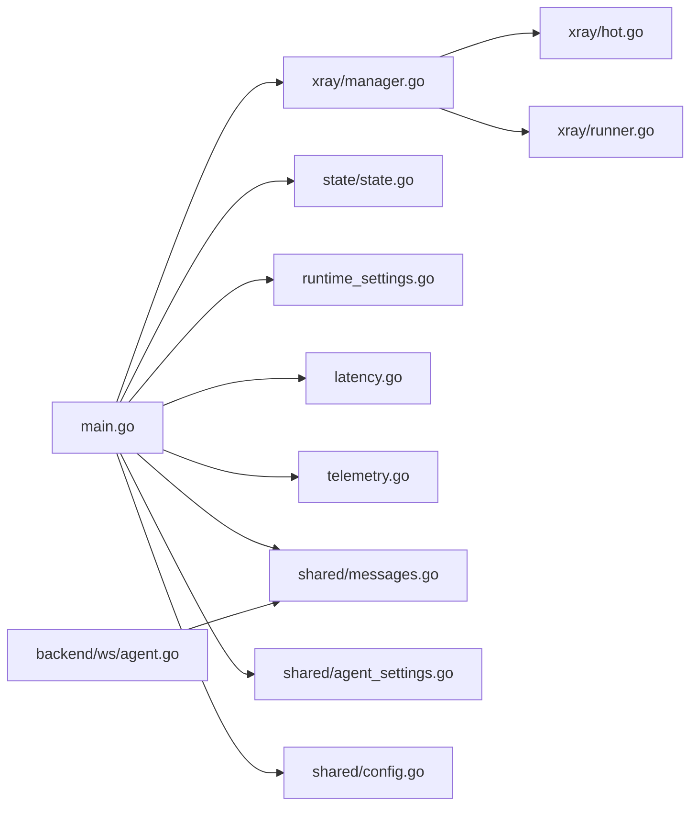

# Agent 程序

<cite>
**本文引用的文件**   
- [src/agent/cmd/agent/main.go](file://src/agent/cmd/agent/main.go)
- [src/agent/cmd/agent/runtime_settings.go](file://src/agent/cmd/agent/runtime_settings.go)
- [src/agent/cmd/agent/latency.go](file://src/agent/cmd/agent/latency.go)
- [src/agent/cmd/agent/telemetry.go](file://src/agent/cmd/agent/telemetry.go)
- [src/agent/internal/xray/manager.go](file://src/agent/internal/xray/manager.go)
- [src/agent/internal/xray/hot.go](file://src/agent/internal/xray/hot.go)
- [src/agent/internal/xray/runner.go](file://src/agent/internal/xray/runner.go)
- [src/agent/internal/state/state.go](file://src/agent/internal/state/state.go)
- [src/backend/internal/ws/agent.go](file://src/backend/internal/ws/agent.go)
- [src/shared/messages.go](file://src/shared/messages.go)
- [src/shared/agent_settings.go](file://src/shared/agent_settings.go)
- [src/shared/config.go](file://src/shared/config.go)
- [docs/ws-protocol.schema.json](file://docs/ws-protocol.schema.json)
</cite>

## 目录
1. [简介](#简介)
2. [项目结构](#项目结构)
3. [核心组件](#核心组件)
4. [架构总览](#架构总览)
5. [详细组件分析](#详细组件分析)
6. [依赖关系分析](#依赖关系分析)
7. [性能考量](#性能考量)
8. [故障排查指南](#故障排查指南)
9. [结论](#结论)
10. [附录：配置示例与协议要点](#附录配置示例与协议要点)

## 简介
本技术文档面向运维与研发人员，系统性阐述 Lattix-codex Agent 程序的架构设计与实现细节。内容覆盖：
- 主程序启动流程、WebSocket 连接管理、心跳与重连机制
- Xray 进程管理（生命周期控制、配置热更新、版本升级）
- 遥测系统（指标采集、流量统计、健康检查）
- 状态管理（本地持久化、状态同步、冲突解决）
- 与后端的通信协议（消息格式、命令处理、响应机制）
- 实际配置示例与故障排查建议

Agent 作为受控服务器上的独立二进制，通过一条 WebSocket 长连接与后端面板进行双向通信，承担节点配置下发、用户增删、链式转发编排、Xray 运行态管理与遥测上报等职责。

## 项目结构
Agent 代码位于 src/agent，核心入口为 cmd/agent，内部模块包括：
- internal/xray：Xray 进程与配置管理（模板填充、校验、原子落盘、gRPC 热操作、systemd/exec 兜底重启）
- internal/state：本地状态与设置持久化（token、面板观察、链 piece 记录）
- cmd/agent：主程序、运行时设置、延迟探测、遥测采集、卸载与自升级逻辑

**图表来源** 
- [src/agent/cmd/agent/main.go](file://src/agent/cmd/agent/main.go)
- [src/agent/internal/xray/manager.go](file://src/agent/internal/xray/manager.go)
- [src/agent/internal/xray/hot.go](file://src/agent/internal/xray/hot.go)
- [src/agent/internal/xray/runner.go](file://src/agent/internal/xray/runner.go)
- [src/agent/internal/state/state.go](file://src/agent/internal/state/state.go)
- [src/backend/internal/ws/agent.go](file://src/backend/internal/ws/agent.go)
- [src/shared/messages.go](file://src/shared/messages.go)
- [src/shared/agent_settings.go](file://src/shared/agent_settings.go)
- [src/shared/config.go](file://src/shared/config.go)
- [docs/ws-protocol.schema.json](file://docs/ws-protocol.schema.json)

**章节来源**
- [src/agent/cmd/agent/main.go:33-98](file://src/agent/cmd/agent/main.go#L33-L98)
- [src/agent/internal/xray/manager.go:24-55](file://src/agent/internal/xray/manager.go#L24-L55)
- [src/agent/internal/state/state.go:14-23](file://src/agent/internal/state/state.go#L14-L23)
- [src/backend/internal/ws/agent.go:32-74](file://src/backend/internal/ws/agent.go#L32-L74)

## 核心组件
- 主程序与 WS 会话：负责参数解析、初始化 Xray 管理器、加载本地状态、建立并维护与后端的 WebSocket 会话，处理心跳、延迟探测、遥测上报、配置漂移检测、设置同步与命令分发。
- Xray 管理器：封装 xray 二进制路径、配置文件路径、gRPC API 地址与服务控制器；提供节点应用、用户增删、配置漂移检测、遥测能力保障、版本升级等能力。
- 状态与设置持久化：持久化长期凭证、面板观察快照、链跳 piece 记录；以原子写入保证一致性。
- 后端 WS 处理器：认证、握手、会话打开、就绪确认、注册与会话生命周期管理。
- 共享协议与类型：统一信封、消息类型、结果码、遥测载荷、设置文档、虚拟配置与生效配置等。

**章节来源**
- [src/agent/cmd/agent/main.go:137-381](file://src/agent/cmd/agent/main.go#L137-L381)
- [src/agent/internal/xray/manager.go:106-167](file://src/agent/internal/xray/manager.go#L106-L167)
- [src/agent/internal/state/state.go:40-73](file://src/agent/internal/state/state.go#L40-L73)
- [src/backend/internal/ws/agent.go:86-195](file://src/backend/internal/ws/agent.go#L86-L195)
- [src/shared/messages.go:13-137](file://src/shared/messages.go#L13-L137)

## 架构总览
Agent 与 Backend 通过 WebSocket 建立一条可靠的双向通道。Agent 主动拨出，携带 Bearer Token 完成认证；随后以 session.open 交换会话信息，session.ready 完成就绪确认。连接期间：
- 应用层 Ping/Pong 保活与 RTT 测量
- 周期性遥测上报（主机指标、xray 流量计数器）
- 配置漂移检测与设置同步
- 业务命令分发（节点/用户/链跳/升级/卸载）

**图表来源** 
- [src/agent/cmd/agent/main.go:160-256](file://src/agent/cmd/agent/main.go#L160-L256)
- [src/backend/internal/ws/agent.go:86-195](file://src/backend/internal/ws/agent.go#L86-L195)
- [src/shared/messages.go:73-91](file://src/shared/messages.go#L73-L91)

## 详细组件分析

### 主程序与 WS 连接管理
- 启动流程：解析命令行参数（面板地址、token、state/settings 路径、xray 相关路径与模式），初始化 Xray 管理器与状态加载，选择初始 token，进入重连循环。
- WS 连接：使用 gorilla/websocket 建立连接，设置读超时与写超时，安全写封装避免并发写帧。
- 会话建立：发送 session.open，接收 response，必要时执行 credential.commit，再发送 session.ready 并处理冲突重试。
- 心跳与延迟：每 30s 发送 Ping（带探针负载），PongHandler 续期读超时并计算 RTT，支持按面板策略启用/暂停延迟探测。
- 遥测上报：后台协程按设置间隔收集主机指标与 xray 流量计数器，发送 telemetry.report。
- 配置漂移检测：定时读取 config.json 哈希并与上次落盘哈希比较，变化时上报 drift 事件。
- 设置同步：定期拉取或被动响应 settings.changed，应用新设置并持久化，回传 applied_revision。
- 命令分发：根据 type 分派到 ApplyNode、RemoveNode、AddUser、RemoveUser、UpgradeXray、UpgradeAgent、Uninstall 等处理函数，统一回执。

**图表来源** 
- [src/agent/cmd/agent/main.go:33-98](file://src/agent/cmd/agent/main.go#L33-L98)
- [src/agent/cmd/agent/main.go:137-381](file://src/agent/cmd/agent/main.go#L137-L381)
- [src/agent/cmd/agent/latency.go:12-62](file://src/agent/cmd/agent/latency.go#L12-L62)
- [src/agent/cmd/agent/telemetry.go:35-45](file://src/agent/cmd/agent/telemetry.go#L35-L45)

**章节来源**
- [src/agent/cmd/agent/main.go:137-381](file://src/agent/cmd/agent/main.go#L137-L381)
- [src/agent/cmd/agent/runtime_settings.go:101-176](file://src/agent/cmd/agent/runtime_settings.go#L101-L176)
- [src/agent/cmd/agent/latency.go:36-85](file://src/agent/cmd/agent/latency.go#L36-L85)
- [src/agent/cmd/agent/telemetry.go:35-45](file://src/agent/cmd/agent/telemetry.go#L35-L45)

### Xray 进程管理
- 配置流水线：模板填充 → xray run -test 校验 → 原子落盘（临时文件 + rename）→ gRPC 热操作（ReplaceInbound/AddUser/RemoveUser）→ 失败则 systemctl/exec 重启兜底 → 回滚 .prev 配置。
- 热操作客户端：通过 xray gRPC API（HandlerService/StatsService）实现零重启的 inbound 替换与用户增删，仅部分协议支持热操作用户。
- Runner 抽象：生产环境使用 systemd（systemctl restart/stop/is-active），开发环境使用 exec（子进程拉起与监控）。
- 漂移检测：记录 lastHash，首次调用以当前文件为基线；外部修改视为漂移，下次 loadConfig 以骨架+受管 inbound+链 piece 净化重建。
- 遥测能力保障：EnsureTelemetryFeatures 确保 stats/policy/StatsService 存在，缺失则落盘并重启生效。
- 版本升级：支持 UpgradeXray（下载 release、校验、替换二进制），Agent 自升级（下载校验、原子替换自身二进制并退出由 systemd 拉起）。

**图表来源** 
- [src/agent/internal/xray/manager.go:24-55](file://src/agent/internal/xray/manager.go#L24-L55)
- [src/agent/internal/xray/hot.go:30-48](file://src/agent/internal/xray/hot.go#L30-L48)
- [src/agent/internal/xray/runner.go:18-33](file://src/agent/internal/xray/runner.go#L18-L33)

**章节来源**
- [src/agent/internal/xray/manager.go:106-167](file://src/agent/internal/xray/manager.go#L106-L167)
- [src/agent/internal/xray/manager.go:232-273](file://src/agent/internal/xray/manager.go#L232-L273)
- [src/agent/internal/xray/manager.go:275-316](file://src/agent/internal/xray/manager.go#L275-L316)
- [src/agent/internal/xray/hot.go:56-90](file://src/agent/internal/xray/hot.go#L56-L90)
- [src/agent/internal/xray/runner.go:40-65](file://src/agent/internal/xray/runner.go#L40-L65)

### 遥测系统
- 采集项：xray 版本与运行状态、实例 ID；主机负载、内存、CPU 使用率、磁盘用量、网络接口与速率、系统 Uptime、WS RTT 中位数。
- 流量统计：通过 xray StatsService 拉取绝对计数器，聚合 node/hop/user 维度 up/down 字节数，随 telemetry.report 上报。
- 上报频率：由 AgentSettings.telemetry.interval_seconds 控制，默认 60s。
- 健康检查：基于 PongHandler 续期读超时与心跳探针，结合面板生命周期状态决定是否启用延迟探测。

**图表来源** 
- [src/agent/cmd/agent/telemetry.go:35-45](file://src/agent/cmd/agent/telemetry.go#L35-L45)
- [src/agent/cmd/agent/telemetry.go:47-101](file://src/agent/cmd/agent/telemetry.go#L47-L101)
- [src/agent/cmd/agent/telemetry.go:103-155](file://src/agent/cmd/agent/telemetry.go#L103-L155)

**章节来源**
- [src/agent/cmd/agent/telemetry.go:35-155](file://src/agent/cmd/agent/telemetry.go#L35-L155)
- [src/shared/messages.go:195-232](file://src/shared/messages.go#L195-L232)

### 状态管理机制
- 本地状态 State：包含 token、server_id、panel_instance_id、credential_epoch、panel_observation、auth_rejected、chain_pieces。
- 设置文档 AgentSettingsDocument：schema_version、panel 元数据、agent 设置（reconnect/telemetry/drift_detection），每次同步刷新 panel 元数据。
- 持久化策略：Save/SafeSettings 采用 tmp+rename 原子写入，权限 0600；Load 忽略不存在或空文件。
- 链 piece 记录：用于重启重建 config.json 与重发幂等，保存 hop_id/kind/port/private_key/public_key/inbound/outbound/reverse/rules。
- 跨面板重新绑定：当 PanelInstanceID 变化时，清理旧配置备份并重置状态。

**章节来源**
- [src/agent/internal/state/state.go:14-38](file://src/agent/internal/state/state.go#L14-L38)
- [src/agent/internal/state/state.go:40-73](file://src/agent/internal/state/state.go#L40-L73)
- [src/shared/agent_settings.go:46-93](file://src/shared/agent_settings.go#L46-93)
- [src/agent/cmd/agent/main.go:211-231](file://src/agent/cmd/agent/main.go#L211-L231)

### 与后端的通信协议
- 统一信封 Envelope：kind/type/request_id/trace_id/data，响应包含 code/message。
- 消息类型：session.open/ready、credential.commit、lifecycle.changed、settings.sync/changed、node.apply/remove、user.add/remove、upgrade_xray/agent、uninstall、telemetry.report、config.drift、chain-hop.apply/remove。
- 结果码：OK/ACCEPTED/AUTH_REQUIRED/INVALID_ARGUMENT/CONFLICT/UNSUPPORTED_ACTION/INTERNAL_ERROR/UPSTREAM_ERROR/SERVICE_UNAVAILABLE/SERVER_OFFLINE/PORT_OUT_OF_RANGE/UPDATE_IN_PROGRESS。
- 协议约束：ws-protocol.schema.json 定义字段校验规则、枚举值、必填项与长度限制。

**章节来源**
- [src/shared/messages.go:13-137](file://src/shared/messages.go#L13-L137)
- [src/shared/messages.go:73-91](file://src/shared/messages.go#L73-L91)
- [docs/ws-protocol.schema.json:106-132](file://docs/ws-protocol.schema.json#L106-L132)

## 依赖关系分析
- Agent 主程序依赖：
  - xray.Manager：配置与进程管理
  - state.State：本地状态与设置持久化
  - runtimeSettings：动态设置与重连策略
  - latencyTracker：心跳与延迟探测
  - telemetry：遥测采集
- Xray 管理器依赖：
  - HotClient：gRPC 热操作与流量查询
  - Runner：systemd/exec 服务控制
- 后端 WS 处理器依赖：
  - shared.Envelope 与消息类型
  - Auth 认证与会话管理（在 ws 包内引用）

**图表来源** 
- [src/agent/cmd/agent/main.go](file://src/agent/cmd/agent/main.go)
- [src/agent/internal/xray/manager.go](file://src/agent/internal/xray/manager.go)
- [src/agent/internal/xray/hot.go](file://src/agent/internal/xray/hot.go)
- [src/agent/internal/xray/runner.go](file://src/agent/internal/xray/runner.go)
- [src/agent/internal/state/state.go](file://src/agent/internal/state/state.go)
- [src/backend/internal/ws/agent.go](file://src/backend/internal/ws/agent.go)
- [src/shared/messages.go](file://src/shared/messages.go)
- [src/shared/agent_settings.go](file://src/shared/agent_settings.go)
- [src/shared/config.go](file://src/shared/config.go)

**章节来源**
- [src/agent/cmd/agent/main.go:22-26](file://src/agent/cmd/agent/main.go#L22-L26)
- [src/agent/internal/xray/manager.go:20-22](file://src/agent/internal/xray/manager.go#L20-L22)
- [src/backend/internal/ws/agent.go:3-17](file://src/backend/internal/ws/agent.go#L3-L17)

## 性能考量
- WS 写串行化：safeConn 加锁避免 gorilla 并发写帧导致崩溃。
- 读超时与心跳：wsReadTimeout=90s，wsWriteTimeout=10s，PongHandler 续期读超时，降低假存活。
- 指数退避重连：失败次数递增退避，最大 30s，附加 ±20% jitter；面板不可用场景使用更长退避。
- 配置校验前置：commitConfig 先 xray run -test 校验，失败丢弃临时文件，避免无效配置生效。
- 热操作优先：gRPC 热操作失败才重启，减少业务中断时间。
- 遥测采样：CPU 使用率两次采样区间计算，网络速率基于 /sys/class/net 差值，首帧 CPU 为 0。

[本节为通用性能指导，不直接分析具体文件]

## 故障排查指南
- 认证被拒绝：
  - 现象：首次连接返回 CodeAuthInvalidCredentials，Agent 停止自动重试并等待 SIGTERM/SIGINT。
  - 排查：检查 bootstrap token 是否与面板一致，面板是否重建或凭证已替换。
  - 参考：认证拒绝判断与等待关闭逻辑。
- 面板不可用：
  - 现象：HTTP 503 且带协议头，Agent 使用 unavailableRetryDelay 延长重试。
  - 排查：检查面板服务状态与网络连通性。
- 配置漂移：
  - 现象：config.json 被外部修改，Agent 检测到漂移并上报 drift 事件。
  - 排查：恢复受管配置或允许 Agent 净化重建；查看日志中的漂移修复提示。
- 热操作失败：
  - 现象：gRPC 热操作报错，触发重启兜底；若重启失败则回滚 .prev 配置。
  - 排查：检查 xray gRPC API 端口与权限，确认 inbound tag 与协议支持。
- 遥测无流量：
  - 现象：telemetry.report 中 traffic 为空。
  - 排查：确认 EnsureTelemetryFeatures 成功，stats/policy/StatsService 已启用；检查 xray 运行状态。

**章节来源**
- [src/agent/cmd/agent/main.go:78-96](file://src/agent/cmd/agent/main.go#L78-L96)
- [src/agent/cmd/agent/runtime_settings.go:121-155](file://src/agent/cmd/agent/runtime_settings.go#L121-L155)
- [src/agent/internal/xray/manager.go:275-316](file://src/agent/internal/xray/manager.go#L275-L316)
- [src/agent/internal/xray/manager.go:232-273](file://src/agent/internal/xray/manager.go#L232-L273)
- [src/agent/cmd/agent/telemetry.go:35-45](file://src/agent/cmd/agent/telemetry.go#L35-L45)

## 结论
Agent 程序通过简洁可靠的 WebSocket 通道与后端协作，实现了高可用的节点与用户管理、Xray 进程热更新与降级恢复、完善的遥测与健康检查、以及稳健的状态持久化与同步。其设计强调幂等、回滚与可观测性，适合大规模受控服务器的自动化运维。

[本节为总结性内容，不直接分析具体文件]

## 附录：配置示例与协议要点
- 启动参数示例：
  - --panel: 后端 WS 地址
  - --token: 首次连接的 bootstrap token
  - --state: 状态文件路径
  - --settings: 设置文件路径
  - --xray-bin: xray 二进制路径
  - --xray-config: xray 配置文件路径
  - --xray-api: xray gRPC API 地址
  - --xray-runner: systemd 或 exec
  - --xray-release-base: xray release 下载基址
  - --version: 打印版本并退出
- 设置文档结构：
  - schema_version: 固定值
  - panel.instance_id/version/public_url/ws_url
  - agent.reconnect.mode/max_retries
  - agent.telemetry.interval_seconds
  - agent.drift_detection.interval_seconds
- 协议要点：
  - Envelope 字段校验严格，未知字段将被拒绝
  - 所有请求/事件必须包含 request_id/trace_id（32 位十六进制）
  - 响应必须包含 code/message
  - 消息类型遵循 domain.action 命名规范

**章节来源**
- [src/agent/cmd/agent/main.go:33-48](file://src/agent/cmd/agent/main.go#L33-L48)
- [src/shared/agent_settings.go:46-93](file://src/shared/agent_settings.go#L46-93)
- [docs/ws-protocol.schema.json:106-132](file://docs/ws-protocol.schema.json#L106-L132)