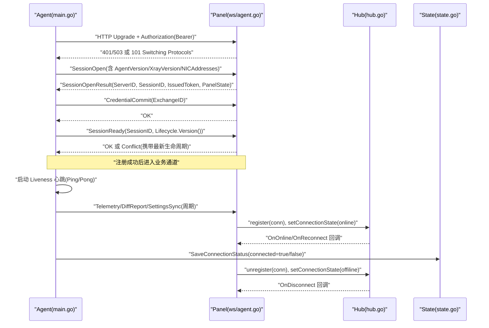
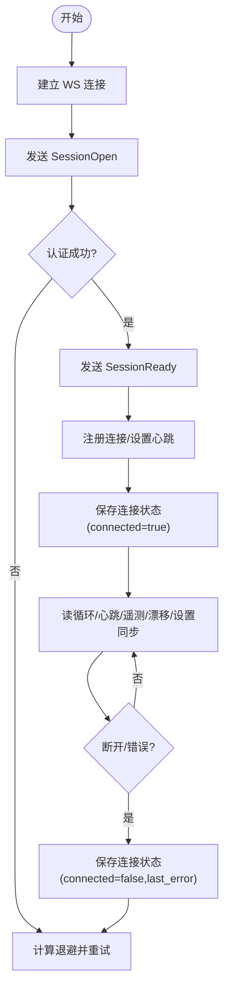
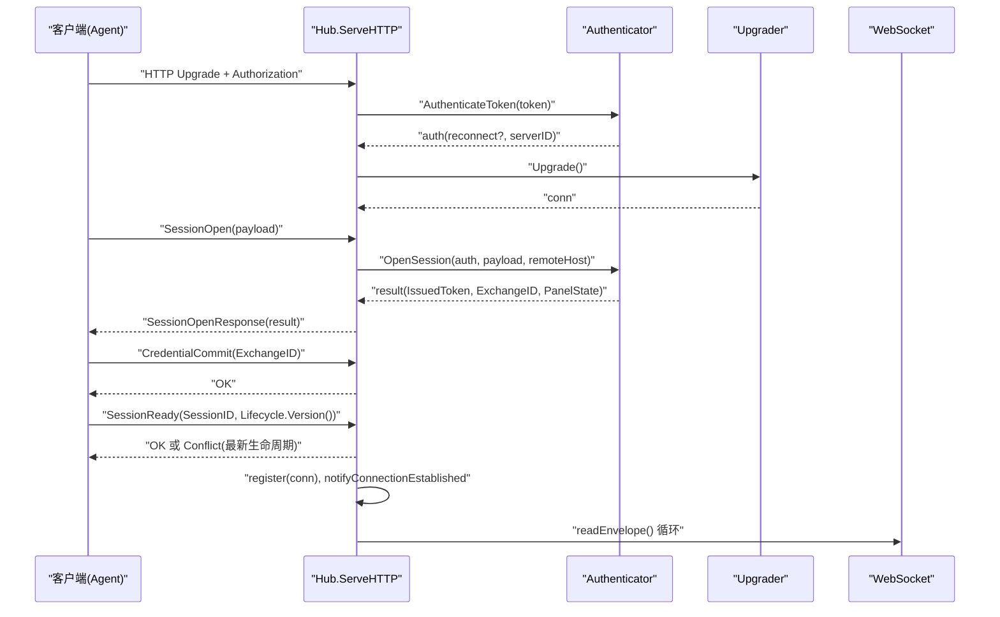
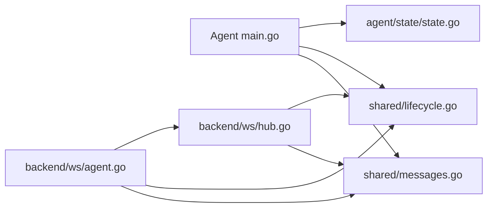

# Agent连接状态跟踪

<cite>
**本文引用的文件**   
- [src/agent/cmd/agent/main.go](file://src/agent/cmd/agent/main.go)
- [src/agent/cmd/agent/panel_state.go](file://src/agent/cmd/agent/panel_state.go)
- [src/backend/internal/ws/hub.go](file://src/backend/internal/ws/hub.go)
- [src/backend/internal/ws/agent.go](file://src/backend/internal/ws/agent.go)
- [src/shared/lifecycle.go](file://src/shared/lifecycle.go)
- [src/shared/messages.go](file://src/shared/messages.go)
- [src/agent/internal/state/state.go](file://src/agent/internal/state/state.go)
</cite>

## 目录
1. [简介](#简介)
2. [项目结构](#项目结构)
3. [核心组件](#核心组件)
4. [架构总览](#架构总览)
5. [详细组件分析](#详细组件分析)
6. [依赖关系分析](#依赖关系分析)
7. [性能考量](#性能考量)
8. [故障排查指南](#故障排查指南)
9. [结论](#结论)

## 简介
本文件聚焦于“Agent 连接状态跟踪”的实现与运行机制，覆盖从 Agent 侧到 Backend（面板）侧的连接建立、心跳保活、生命周期同步、在线/离线状态判定、重连策略以及状态持久化等关键环节。通过 WebSocket 长连接承载控制面双向通信，系统对连接健康度进行端到端观测，并在两端分别维护连接快照与本地状态文件，为上层监控、告警与运维工具提供可靠依据。

## 项目结构
围绕 Agent 连接状态跟踪的关键代码分布在以下模块：
- Agent 主流程与连接循环：负责拨号、认证、会话建立、心跳与遥测、配置漂移检测、设置同步等。
- Agent 面板生命周期追踪器：维护面板生命周期快照的有序更新与变更通知。
- Backend WS Hub：管理所有 Agent 连接注册表、发送队列、连接状态快照、优雅停机与断线回调。
- Backend WS 处理器：HTTP 升级、鉴权、Session Open/Ready 握手、协议错误上报、读循环与消息分发。
- Shared 协议定义：统一的消息信封、RPC 类型、生命周期快照与重试策略等。
- Agent 本地状态持久化：保存长期凭证、链 piece 记录与连接状态快照。

```mermaid
graph TB
subgraph "Agent"
A_main["main.go<br/>连接循环/心跳/遥测/漂移"]
A_panelstate["panel_state.go<br/>面板生命周期追踪器"]
A_state["state.go<br/>本地状态持久化"]
end
subgraph "Backend"
B_hub["hub.go<br/>连接注册表/状态快照/发送队列"]
B_agent["agent.go<br/>WS 处理器/握手/读循环"]
end
subgraph "Shared"
S_lifecycle["lifecycle.go<br/>生命周期/重试策略"]
S_messages["messages.go<br/>消息信封/RPC 类型"]
end
A_main --> S_messages
A_main --> S_lifecycle
A_main --> A_panelstate
A_main --> A_state
B_agent --> S_messages
B_agent --> S_lifecycle
B_agent --> B_hub
A_main < --> B_agent
B_hub --> A_main
```

**图表来源** 
- [src/agent/cmd/agent/main.go:160-411](file://src/agent/cmd/agent/main.go#L160-L411)
- [src/agent/cmd/agent/panel_state.go:9-52](file://src/agent/cmd/agent/panel_state.go#L9-L52)
- [src/backend/internal/ws/hub.go:26-100](file://src/backend/internal/ws/hub.go#L26-L100)
- [src/backend/internal/ws/agent.go:33-120](file://src/backend/internal/ws/agent.go#L33-L120)
- [src/shared/lifecycle.go:5-45](file://src/shared/lifecycle.go#L5-L45)
- [src/shared/messages.go:13-91](file://src/shared/messages.go#L13-L91)

**章节来源**
- [src/agent/cmd/agent/main.go:1-117](file://src/agent/cmd/agent/main.go#L1-L117)
- [src/backend/internal/ws/hub.go:1-100](file://src/backend/internal/ws/hub.go#L1-L100)
- [src/backend/internal/ws/agent.go:1-120](file://src/backend/internal/ws/agent.go#L1-L120)
- [src/shared/lifecycle.go:1-45](file://src/shared/lifecycle.go#L1-L45)
- [src/shared/messages.go:1-91](file://src/shared/messages.go#L1-L91)
- [src/agent/internal/state/state.go:15-100](file://src/agent/internal/state/state.go#L15-L100)

## 核心组件
- Agent 连接循环与保活
  - 建立 WS 连接并发送 SessionOpen，接收面板生命周期快照；随后完成 CredentialCommit 与 SessionReady 握手。
  - 启动 Liveness 心跳（周期性 Ping），Pong 处理用于续期读超时与延迟采样。
  - 周期上报 Telemetry、配置漂移报告、设置同步回执。
  - 失败时按策略退避重连，支持面板不可用时的特殊退避。
- Agent 面板生命周期追踪器
  - 维护 PanelLifecycleSnapshot，基于 Epoch/Revision 严格排序，避免乱序与回退。
  - 变更时通过 channel 通知下游（如延迟探针开关）。
- Backend WS Hub
  - 维护每个 ServerID 的连接对象与连接快照（online/offline/reconnecting/never_connected）。
  - 提供 Send 接口（带缓冲队列）、BeginDrain（优雅停机）、SyncLifecycle（广播生命周期并等待 ACK）。
  - 在连接注册/注销时触发 OnOnline/OnReconnect/OnDisconnect 回调。
- Backend WS 处理器
  - HTTP 升级后校验 Token 并打开 Session，返回 SessionOpenResult（含面板生命周期快照）。
  - 在 session.ready 前仅接受 credential.commit 与 session.ready。
  - 读循环中续期 pongTimeout，任何消息到达即刷新超时。
- Shared 协议与生命周期
  - 统一 Envelope 信封、RPC 类型常量、生命周期状态枚举、重试策略与快照结构。
- Agent 本地状态持久化
  - 保存长期凭证、ServerID、面板观察快照、认证拒绝标记、链 piece 记录。
  - 独立 connection.json 保存连接状态（connected、last_error、changed_at 等）。

**章节来源**
- [src/agent/cmd/agent/main.go:160-411](file://src/agent/cmd/agent/main.go#L160-L411)
- [src/agent/cmd/agent/panel_state.go:9-52](file://src/agent/cmd/agent/panel_state.go#L9-L52)
- [src/backend/internal/ws/hub.go:26-100](file://src/backend/internal/ws/hub.go#L26-L100)
- [src/backend/internal/ws/agent.go:33-120](file://src/backend/internal/ws/agent.go#L33-L120)
- [src/shared/lifecycle.go:5-45](file://src/shared/lifecycle.go#L5-L45)
- [src/shared/messages.go:13-91](file://src/shared/messages.go#L13-L91)
- [src/agent/internal/state/state.go:15-100](file://src/agent/internal/state/state.go#L15-L100)

## 架构总览
下图展示了 Agent 与 Backend 之间的连接状态跟踪关键交互：握手、心跳、生命周期同步、状态快照与持久化。



**图表来源** 
- [src/agent/cmd/agent/main.go:160-286](file://src/agent/cmd/agent/main.go#L160-L286)
- [src/backend/internal/ws/agent.go:33-197](file://src/backend/internal/ws/agent.go#L33-L197)
- [src/backend/internal/ws/hub.go:230-279](file://src/backend/internal/ws/hub.go#L230-L279)
- [src/agent/internal/state/state.go:86-100](file://src/agent/internal/state/state.go#L86-L100)

## 详细组件分析

### Agent 连接循环与状态持久化
- 连接建立与认证
  - 使用 Bearer Token 发起 WS 连接，首帧发送 SessionOpen，接收包含面板生命周期快照的结果。
  - 若存在 IssuedToken，则更新内存 token 并落盘；跨面板重新绑定时重置本地状态。
- 心跳与延迟探测
  - 独立的 Liveness 协程周期性发送 Ping；Pong 处理刷新读超时并更新延迟统计。
  - 仅在面板处于 active 状态时启用延迟探针，受生命周期快照控制。
- 设置同步与漂移检测
  - 周期拉取设置并应用，失败时记录 LastApplyError；外部修改 config.json 时上报 DriftReport。
- 连接状态持久化
  - 每次连接成功/失败均写入 connection.json，包含 connected、panel、server_id、agent_version、pid、changed_at、last_error。
  - 认证被明确拒绝时停止自动重试，等待外部干预（新安装命令重启）。



**图表来源** 
- [src/agent/cmd/agent/main.go:160-286](file://src/agent/cmd/agent/main.go#L160-L286)
- [src/agent/cmd/agent/main.go:280-311](file://src/agent/cmd/agent/main.go#L280-L311)
- [src/agent/cmd/agent/main.go:341-383](file://src/agent/cmd/agent/main.go#L341-L383)
- [src/agent/cmd/agent/main.go:385-411](file://src/agent/cmd/agent/main.go#L385-L411)
- [src/agent/internal/state/state.go:86-100](file://src/agent/internal/state/state.go#L86-L100)

**章节来源**
- [src/agent/cmd/agent/main.go:160-411](file://src/agent/cmd/agent/main.go#L160-L411)
- [src/agent/internal/state/state.go:15-100](file://src/agent/internal/state/state.go#L15-L100)

### Agent 面板生命周期追踪器
- 数据结构与并发安全
  - 使用 RWMutex 保护当前快照与变更 channel，snapshot() 返回只读快照与变更通道。
- 版本与顺序控制
  - apply(next, newSession) 校验 state/epoch/revision，确保同 session 内不跨 epoch 更新，且 revision 单调递增。
  - 新 session 允许切换 epoch；同一 epoch 内旧 revision 直接丢弃。
- 变更通知
  - 每次成功 apply 关闭旧 channel 并创建新 channel，下游协程据此感知变化（如延迟探针启停）。

```mermaid
classDiagram
class panelStateTracker {
-mu : RWMutex
-value : PanelLifecycleSnapshot
-changed : chan struct{}
+snapshot() (PanelLifecycleSnapshot, <-chan struct{})
+apply(next PanelLifecycleSnapshot, newSession bool) bool
}
```

**图表来源** 
- [src/agent/cmd/agent/panel_state.go:9-52](file://src/agent/cmd/agent/panel_state.go#L9-L52)

**章节来源**
- [src/agent/cmd/agent/panel_state.go:9-52](file://src/agent/cmd/agent/panel_state.go#L9-L52)

### Backend WS Hub（连接注册表与状态快照）
- 连接注册与去重
  - register(c) 将新连接登记，若已有旧连接则关闭旧连接；根据是否首次上线决定 becameOnline。
  - unregister(c) 仅当注册表中仍为同一连接时才视为 offline→offline 跃迁，触发 OnDisconnect。
- 发送与缓冲
  - Send(ctx, serverID, env) 投递到连接发送队列；队列满视为慢连接主动断开，重连后补发。
  - BeginDrain() 拒绝新工作并关闭所有连接（RFC 1012），促使 Agent 走快速重启路径。
- 生命周期同步
  - SyncLifecycle(snapshot) 向所有在线 Agent 广播生命周期变更，等待 ACK 或超时，返回缺失列表。
- 连接状态快照
  - ConnectionState(serverID, everConnected) 返回 never_connected/connecting/reconnecting/online/offline。
  - setConnectionState 更新 states 映射中的快照（state/session_id/session_kind/changed_at）。

```mermaid
classDiagram
class Hub {
-Auth : Authenticator
-Lifecycle : LifecycleProvider
-conns : map[int64]*agentConn
-states : map[int64]ConnectionSnapshot
-draining : bool
+Send(ctx, serverID, env) error
+IsOnline(serverID) bool
+BeginDrain() void
+SyncLifecycle(ctx, snapshot) []int64
+ConnectionState(serverID, everConnected) ConnectionSnapshot
-register(c *agentConn) (bool, bool)
-unregister(c *agentConn) void
}
class agentConn {
-hub : *Hub
-serverID : int64
-sessionID : string
-sessionKind : string
-ws : *websocket.Conn
-send : chan Envelope
-done : chan struct{}
-ackMu : Mutex
-lifecycleAcks : map[string]chan struct{}
+writePump() void
+close() void
+closeWithCode(code, reason) void
}
Hub --> agentConn : "管理多个连接"
```

**图表来源** 
- [src/backend/internal/ws/hub.go:26-100](file://src/backend/internal/ws/hub.go#L26-L100)
- [src/backend/internal/ws/hub.go:230-279](file://src/backend/internal/ws/hub.go#L230-L279)
- [src/backend/internal/ws/hub.go:380-413](file://src/backend/internal/ws/hub.go#L380-L413)

**章节来源**
- [src/backend/internal/ws/hub.go:26-100](file://src/backend/internal/ws/hub.go#L26-L100)
- [src/backend/internal/ws/hub.go:230-279](file://src/backend/internal/ws/hub.go#L230-L279)
- [src/backend/internal/ws/hub.go:380-413](file://src/backend/internal/ws/hub.go#L380-L413)

### Backend WS 处理器（握手与读循环）
- HTTP 升级与鉴权
  - 校验 Authorization 头，调用 Auth.AuthenticateToken；失败返回 401/503 并附带 Envelope。
  - 升级成功后设置 ReadLimit 与 ProtocolHeader。
- Session 握手
  - 首帧必须为 SessionOpen，解析 payload 并调用 OpenSession；返回 SessionOpenResult（含面板生命周期快照）。
  - 在 session.ready 前仅接受 credential.commit 与 session.ready；冲突时返回最新生命周期供 Agent 对齐。
- 心跳与读循环
  - 设置 PingHandler 原样 Pong 并续期 pongTimeout；任何消息到达即刷新超时。
  - 读循环中识别 lifecycle.changed ACK，其他消息上抛至 OnMessage。



**图表来源** 
- [src/backend/internal/ws/agent.go:33-197](file://src/backend/internal/ws/agent.go#L33-L197)
- [src/backend/internal/ws/agent.go:200-239](file://src/backend/internal/ws/agent.go#L200-L239)

**章节来源**
- [src/backend/internal/ws/agent.go:33-197](file://src/backend/internal/ws/agent.go#L33-L197)
- [src/backend/internal/ws/agent.go:200-239](file://src/backend/internal/ws/agent.go#L200-L239)

### Shared 协议与生命周期
- 生命周期状态
  - 面板状态：startup/active/updating/faulted
  - 连接状态：never_connected/connecting/reconnecting/online/offline/auth_rejected
  - 会话种类：initial/reconnect
- 重试策略
  - RetryPolicy(min_ms, max_ms) 由面板下发，Agent 结合指数退避与面板不可用策略综合计算。
- 消息信封
  - Envelope(kind/type/request_id/trace_id/code/message/data)，响应强制携带 code/message，请求/事件禁止携带。
  - RPC 类型包括 session.open/ready、credential.commit、lifecycle.changed、settings.sync/changed、telemetry/report、config.drift 等。

**章节来源**
- [src/shared/lifecycle.go:5-45](file://src/shared/lifecycle.go#L5-L45)
- [src/shared/messages.go:13-91](file://src/shared/messages.go#L13-L91)

## 依赖关系分析
- Agent 依赖 shared 协议与生命周期定义，使用 state 包持久化本地状态。
- Backend WS 处理器依赖 Hub 进行连接管理与状态快照，同时依赖 Authenticator/LifecycleProvider 注入。
- Hub 与 agentConn 之间通过 send 通道解耦写操作，保证 gorilla 不允许并发写的约束。
- 连接状态快照在 Hub.states 中集中维护，对外暴露 ConnectionState 查询接口。



**图表来源** 
- [src/agent/cmd/agent/main.go:160-411](file://src/agent/cmd/agent/main.go#L160-L411)
- [src/backend/internal/ws/agent.go:33-197](file://src/backend/internal/ws/agent.go#L33-L197)
- [src/backend/internal/ws/hub.go:26-100](file://src/backend/internal/ws/hub.go#L26-L100)
- [src/shared/messages.go:13-91](file://src/shared/messages.go#L13-L91)
- [src/shared/lifecycle.go:5-45](file://src/shared/lifecycle.go#L5-L45)
- [src/agent/internal/state/state.go:15-100](file://src/agent/internal/state/state.go#L15-L100)

**章节来源**
- [src/agent/cmd/agent/main.go:160-411](file://src/agent/cmd/agent/main.go#L160-L411)
- [src/backend/internal/ws/agent.go:33-197](file://src/backend/internal/ws/agent.go#L33-L197)
- [src/backend/internal/ws/hub.go:26-100](file://src/backend/internal/ws/hub.go#L26-L100)
- [src/shared/messages.go:13-91](file://src/shared/messages.go#L13-L91)
- [src/shared/lifecycle.go:5-45](file://src/shared/lifecycle.go#L5-L45)
- [src/agent/internal/state/state.go:15-100](file://src/agent/internal/state/state.go#L15-L100)

## 性能考量
- 写串行化
  - Agent 侧 safeConn 通过互斥锁串行化 JSON 写帧；Backend 侧 writePump 串行消费发送队列，避免 gorilla 并发写限制。
- 超时与心跳
  - wsReadTimeout=90s 作为连接存活判据；wsWriteTimeout=10s 控制单次写超时；Ping/Pong 机制维持链路活性。
- 缓冲与慢连接处理
  - Hub 每连接发送队列长度固定（MVP 场景较小），写满即断开，重连后补发，避免背压扩散。
- 生命周期同步
  - SyncLifecycle 使用并发等待 ACK，超时返回缺失列表，便于上层补偿。
- 状态落盘
  - 原子写入（tmp+rename）保障一致性，权限 0600 保护敏感数据。

[本节为通用指导，无需特定文件引用]

## 故障排查指南
- 认证被拒绝
  - Agent 检测到面板明确拒绝凭证时停止自动重试，需使用新面板安装命令重新绑定后重启。
  - 检查 Token 有效性、面板实例 ID 与凭证 Epoch 是否一致。
- 面板不可用
  - 连接失败时区分 errPanelUnavailable，采用 unavailableRetryDelay 进行退避。
  - 检查面板生命周期状态是否为 faulted 或 startup。
- 连接频繁断开
  - 检查 wsReadTimeout 与 Ping/Pong 是否正常；确认网络代理与防火墙策略。
  - 查看 Hub 发送队列是否经常满，必要时优化上游处理速度。
- 配置漂移
  - 若 config.json 被外部修改，Agent 会上报 drift report；恢复后应重新应用配置。
- 状态文件异常
  - 检查 connection.json 与 state.json 的权限与内容完整性；必要时清理临时文件并重试。

**章节来源**
- [src/agent/cmd/agent/main.go:97-116](file://src/agent/cmd/agent/main.go#L97-L116)
- [src/backend/internal/ws/agent.go:45-59](file://src/backend/internal/ws/agent.go#L45-L59)
- [src/backend/internal/ws/hub.go:111-139](file://src/backend/internal/ws/hub.go#L111-L139)
- [src/agent/internal/state/state.go:71-100](file://src/agent/internal/state/state.go#L71-L100)

## 结论
Agent 连接状态跟踪通过严格的握手流程、心跳保活、生命周期同步与状态快照机制，实现了端到端的连接健康观测与可靠的重连策略。Agent 侧的本地状态持久化与面板侧的连接注册表共同支撑了在线/离线状态的准确判定，为上层监控、告警与自动化运维提供了坚实基础。建议在部署中关注超时参数、缓冲大小与状态文件权限，并结合漂移检测与设置同步机制确保配置一致性。