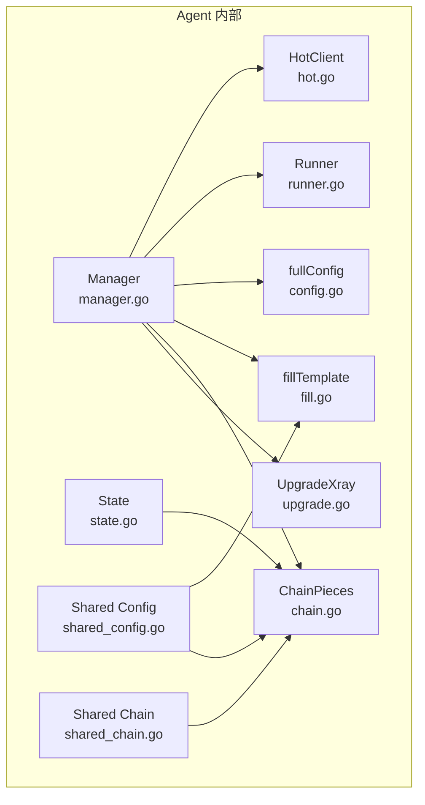
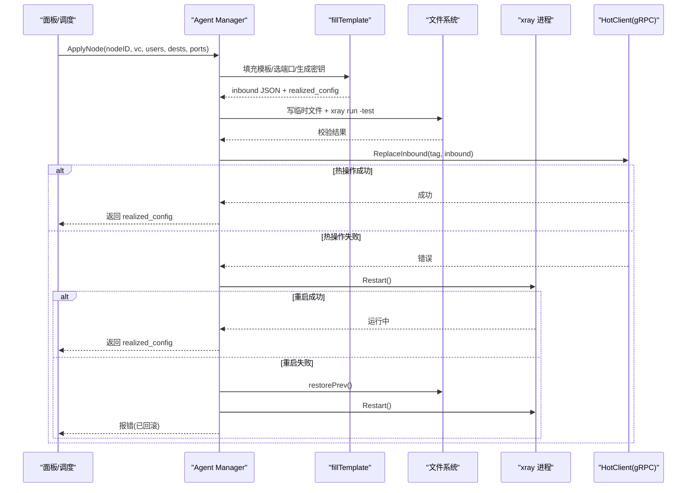
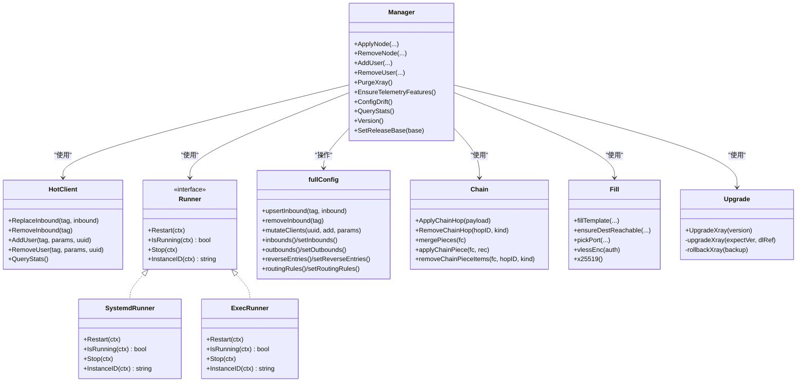

# Xray 进程管理

<cite>
**本文引用的文件**   
- [manager.go](file://src/agent/internal/xray/manager.go)
- [config.go](file://src/agent/internal/xray/config.go)
- [chain.go](file://src/agent/internal/xray/chain.go)
- [fill.go](file://src/agent/internal/xray/fill.go)
- [hot.go](file://src/agent/internal/xray/hot.go)
- [runner.go](file://src/agent/internal/xray/runner.go)
- [upgrade.go](file://src/agent/internal/xray/upgrade.go)
- [state.go](file://src/agent/internal/state/state.go)
- [shared_config.go](file://src/shared/config.go)
- [shared_chain.go](file://src/shared/chain.go)
- [dev-e2e-xray.sh](file://scripts/dev-e2e-xray.sh)
</cite>

## 目录
1. [简介](#简介)
2. [项目结构](#项目结构)
3. [核心组件](#核心组件)
4. [架构总览](#架构总览)
5. [详细组件分析](#详细组件分析)
6. [依赖关系分析](#依赖关系分析)
7. [性能与可靠性](#性能与可靠性)
8. [故障排查指南](#故障排查指南)
9. [结论](#结论)
10. [附录：配置示例与最佳实践](#附录配置示例与最佳实践)

## 简介
本文件面向 Lattix-codex Agent 中的 Xray 进程管理子系统，系统性阐述以下能力：
- 进程生命周期控制（启动、停止、重启、运行态检测）
- 服务热操作（gRPC 热更新 inbound、用户增删、流量统计查询）
- 配置文件生成与管理（模板填充、校验、原子落盘、漂移修复与回滚）
- 不同运行模式（systemd 与 exec）的实现差异
- 节点配置应用（端口分配、用户关联、RealizedConfig 上报）
- 链式代理配置生成（portal/bridge/forward 三种角色编排、链路拓扑管理）
- 升级与回滚（二进制版本升级、校验、失败回滚）
- 运维配置示例与排障建议

## 项目结构
Xray 管理相关代码集中在 agent 内部模块 internal/xray，配合 shared 包定义协议、占位符、链跳类型等共享常量与数据结构；state 包负责本地状态持久化（含链 piece 记录）。

**图表来源** 
- [manager.go:1-120](file://src/agent/internal/xray/manager.go#L1-L120)
- [hot.go:1-60](file://src/agent/internal/xray/hot.go#L1-L60)
- [runner.go:1-60](file://src/agent/internal/xray/runner.go#L1-L60)
- [config.go:1-60](file://src/agent/internal/xray/config.go#L1-L60)
- [fill.go:1-60](file://src/agent/internal/xray/fill.go#L1-L60)
- [chain.go:1-60](file://src/agent/internal/xray/chain.go#L1-L60)
- [upgrade.go:1-60](file://src/agent/internal/xray/upgrade.go#L1-L60)
- [state.go:1-40](file://src/agent/internal/state/state.go#L1-L40)
- [shared_config.go:1-60](file://src/shared/config.go#L1-L60)
- [shared_chain.go:1-24](file://src/shared/chain.go#L1-L24)

**章节来源**
- [manager.go:1-120](file://src/agent/internal/xray/manager.go#L1-L120)
- [state.go:1-40](file://src/agent/internal/state/state.go#L1-L40)
- [shared_config.go:1-60](file://src/shared/config.go#L1-L60)
- [shared_chain.go:1-24](file://src/shared/chain.go#L1-L24)

## 核心组件
- Manager：Xray 管理器，统一入口，协调配置生成、热操作、服务重启与回滚。
- HotClient：通过 gRPC 调用 xray 的 HandlerService/StatsService，实现零重启热更新与遥测。
- Runner：抽象进程控制器，支持 systemd/systemctl 与 exec（子进程）两种模式。
- fullConfig：对 config.json 的浅层表示，保留原始 JSON，便于原样写入与精准修改。
- fill：模板填充、端口选择、dest 预检、VLESS Encryption 与 Reality 密钥生成。
- chain：链跳 piece 渲染与合并（portal/bridge/forward），reverse/routing/inbounds/outbounds 管理。
- upgrade：xray 二进制升级流程（下载、校验、替换、重启、回滚）。
- state：本地状态持久化，包含链 piece 记录，用于重启重建与幂等重发。

**章节来源**
- [manager.go:24-140](file://src/agent/internal/xray/manager.go#L24-L140)
- [hot.go:24-148](file://src/agent/internal/xray/hot.go#L24-L148)
- [runner.go:16-159](file://src/agent/internal/xray/runner.go#L16-L159)
- [config.go:10-114](file://src/agent/internal/xray/config.go#L10-L114)
- [fill.go:20-142](file://src/agent/internal/xray/fill.go#L20-L142)
- [chain.go:25-145](file://src/agent/internal/xray/chain.go#L25-L145)
- [upgrade.go:24-113](file://src/agent/internal/xray/upgrade.go#L24-L113)
- [state.go:14-38](file://src/agent/internal/state/state.go#L14-L38)

## 架构总览
Xray 管理的整体工作流如下：
- 节点应用 ApplyNode：模板填充 → 候选配置组装 → xray -test 校验 → 原子落盘 → gRPC 热操作（优先）→ 失败则重启兜底 → 失败再回滚。
- 用户变更 AddUser/RemoveUser：增量扇出到指定 tag，尝试热操作，失败则重启并一次性生效。
- 链跳 ApplyChainHop：渲染 portal/bridge/forward 配置件，合并入配置，落盘校验后重启生效。
- 配置漂移 ConfigDrift：对比哈希，必要时以骨架+受管项净化配置。
- 遥测 QueryStats：通过 StatsService 拉取计数器。
- 升级 UpgradeXray：解析版本、下载、校验、替换、重启、校验实际版本。

**图表来源** 
- [manager.go:106-139](file://src/agent/internal/xray/manager.go#L106-L139)
- [fill.go:20-142](file://src/agent/internal/xray/fill.go#L20-L142)
- [hot.go:72-90](file://src/agent/internal/xray/hot.go#L72-L90)
- [runner.go:77-114](file://src/agent/internal/xray/runner.go#L77-L114)

## 详细组件分析

### Manager：Xray 管理器
职责：
- 维护二进制路径、配置文件路径、API 地址、热客户端、Runner、releaseBase/mirrorBase。
- 提供 ApplyNode/RemoveNode/AddUser/RemoveUser/PurgeXray/EnsureTelemetryFeatures 等方法。
- 配置落盘 commitConfig：写临时文件 → xray -test 校验 → 备份 .prev → 原子替换 → 更新 lastHash/drifted。
- 配置加载 loadConfig：不存在或损坏时重建骨架；漂移时净化为骨架+受管 inbound+链 piece。
- 漂移检测 ConfigDrift：比较哈希，首次调用建立基线，删除视为漂移。
- 回滚 restorePrev：恢复 .prev 并同步 lastHash。

关键流程要点：
- 并发安全：所有配置变更加互斥锁。
- 幂等性：ReplaceInbound 先删后加；mutateClients 按 uuid/email/user 匹配键幂等增删。
- 回退策略：热操作失败 → 重启 → 仍失败 → 回滚上一份可用配置并重试一次。

**章节来源**
- [manager.go:24-140](file://src/agent/internal/xray/manager.go#L24-L140)
- [manager.go:232-316](file://src/agent/internal/xray/manager.go#L232-L316)
- [manager.go:318-351](file://src/agent/internal/xray/manager.go#L318-L351)
- [manager.go:375-434](file://src/agent/internal/xray/manager.go#L375-L434)

### fullConfig：配置结构与操作
- 浅层 map[string]json.RawMessage，inbounds/outbounds/reverse/routing 等段均保持原始 JSON。
- upsertInbound/removeInbound：按 tag 增删 inbound。
- mutateClients：按协议在 settings.clients/accounts 中增删用户条目，支持 socks/http 使用 accounts。
- reverseEntries/setReverseEntries：维护 reverse.portals/bridges，空列表时移除 reverse 段。
- routingRules/setRoutingRules：维护 routing.rules，空列表时移除 routing 段。

复杂度与影响：
- 操作均为 O(n) 遍历数组，n 为 inbounds/outbounds/rules 数量，通常较小。
- 原样保留 JSON，避免二次序列化带来的字段丢失或顺序变化。

**章节来源**
- [config.go:10-114](file://src/agent/internal/xray/config.go#L10-L114)
- [config.go:116-202](file://src/agent/internal/xray/config.go#L116-L202)

### fill：模板填充与端口/密钥/dest 处理
- fillTemplate：
  - 端口选择 pickPort：优先指定端口（检查占用），否则从 portCandidates 挑选空闲，最后随机。
  - 占位符替换：PORT/TAG/CLIENTS/PRIVATE_KEY/DECRYPTION。
  - VLESS Encryption：执行 vlessenc 生成 decryption/encryption，vision flow 强制 1-RTT。
  - Reality 私钥：执行 x25519 生成公私钥对。
  - dest 预检 ensureDestReachable：TCP+TLS1.3 探测可达性，不可达则按白名单逐个尝试改写 dest/serverNames。
  - 提取 RealizedConfig：port/public_key/short_id/server_name/flow/fingerprint/network/service_name/path/mode/host/method/psk/encryption。
- clientEntry：按协议构造用户条目（clients 或 accounts），ss 2022-blake3 多用户密码派生。

异常与健壮性：
- 模板非法或非 JSON 直接失败。
- dest 不可达且候选全部失败时报错。
- vlessenc 输出格式变化会显式失败，避免产出不可用配置。

**章节来源**
- [fill.go:20-142](file://src/agent/internal/xray/fill.go#L20-L142)
- [fill.go:170-237](file://src/agent/internal/xray/fill.go#L170-L237)
- [fill.go:247-355](file://src/agent/internal/xray/fill.go#L247-L355)

### hot：gRPC 热操作客户端
- ReplaceInbound：先 RemoveInbound 再 AddInbound，确保幂等。
- RemoveInbound：直接删除 inbound。
- AddUser/RemoveUser：仅 vless/vmess/trojan 支持热操作，其余协议由 Manager 回退重启。
- QueryStats：通过 StatsService 拉取计数器。

超时与错误：
- 单次 gRPC 调用超时 5s。
- AlterInbound 失败时返回错误，上层捕获并触发重启兜底。

**章节来源**
- [hot.go:24-148](file://src/agent/internal/xray/hot.go#L24-L148)

### runner：进程控制器（systemd/exec）
- SystemdRunner：通过 systemctl restart/is-active/stop 管理 xray.service。
- ExecRunner：直接拉起子进程，输出并入 agent 日志；启动后立即观察退出；InstanceID 基于 /proc/pid/stat。
- NewRunner(kind, bin, configPath)：kind=exec 走 ExecRunner，默认 systemd。

开发/生产差异：
- 开发联调用 exec 模式快速迭代；生产环境用 systemd 保证服务管理与自启。

**章节来源**
- [runner.go:16-159](file://src/agent/internal/xray/runner.go#L16-L159)

### chain：链式代理配置件（portal/bridge/forward）
- ApplyChainHop：渲染 portal/bridge/forward 配置件，合并入配置，落盘校验后重启生效；幂等复用端口与公钥。
- RemoveChainHop：移除对应 inbound/outbound/routing/reverse 条目，不存在视为成功。
- renderPortal/renderBridge/renderForward：分别生成 interconn inbound/outbound、reverse 条目、routing 规则。
- mergePieces/applyChainPiece/removeChainPieceItems：按 hop_id+kind 精确增删，避免重复与残留。
- pickChainPort：优先 spec.Port，其次复用 prev.Port，最后从 candidates 挑选空闲。

拓扑与路由：
- reverse.portals/bridges 按 domain 区分隧道。
- forward 经 via_tunnel_domain 查找上游 portal reverse 的 tag 作为出站目标。

**章节来源**
- [chain.go:25-145](file://src/agent/internal/xray/chain.go#L25-L145)
- [chain.go:156-349](file://src/agent/internal/xray/chain.go#L156-L349)
- [chain.go:419-665](file://src/agent/internal/xray/chain.go#L419-L665)

### upgrade：二进制升级与回滚
- UpgradeXray：latest 或 vX.Y.Z；镜像基址跳过 GitHub API 走 latest/download 约定。
- 下载 zip 与 .dgst，校验 SHA2-256；解压二进制；备份旧版 .bak；原子替换；重启；校验运行版本。
- rollbackXray：恢复 .bak 并尽力重启。

**章节来源**
- [upgrade.go:24-113](file://src/agent/internal/xray/upgrade.go#L24-L113)
- [upgrade.go:115-124](file://src/agent/internal/xray/upgrade.go#L115-L124)
- [upgrade.go:126-140](file://src/agent/internal/xray/upgrade.go#L126-L140)
- [upgrade.go:148-178](file://src/agent/internal/xray/upgrade.go#L148-L178)

### state：本地状态与链 piece 记录
- State：token、server_id、panel_instance_id、credential_epoch、panel_observation、auth_rejected、chain_pieces。
- ChainPiece：hop_id、kind、port、private_key、public_key、inbound、outbound、reverse、rules。
- Load/Save：原子写入（tmp+rename，权限 0600）。
- Settings：AgentSettingsDocument 读写与校验。

作用：
- 重启后重建 config.json（骨架+节点 inbound+链 piece）。
- 重发幂等：同 hop_id+kind 复用端口与公钥，下游 bridge 凭证不失效。

**章节来源**
- [state.go:14-38](file://src/agent/internal/state/state.go#L14-L38)
- [state.go:40-73](file://src/agent/internal/state/state.go#L40-L73)
- [state.go:75-110](file://src/agent/internal/state/state.go#L75-L110)

### shared：协议、占位符与链类型
- 协议常量：vless/vmess/trojan/shadowsocks/socks/http/dokodemo-door。
- 传输方式：tcp/grpc/xhttp；Reality 仅支持这三种。
- VLESS Encryption：x25519/mlkem768。
- 模板占位符：PORT/TAG/CLIENTS/PRIVATE_KEY/DECRYPTION。
- VirtualConfig/RealizedConfig：虚拟配置与实际生效值。
- 链类型：portal/bridge/forward；TunnelDomain/Chain*Tag 命名约定。

**章节来源**
- [shared_config.go:13-206](file://src/shared/config.go#L13-L206)
- [shared_chain.go:1-24](file://src/shared/chain.go#L1-L24)

## 依赖关系分析
- Manager 依赖 HotClient（gRPC）、Runner（systemd/exec）、fullConfig（配置操作）、fill（模板填充）、chain（链 piece 渲染）、upgrade（升级）。
- fullConfig 依赖 json.RawMessage 原样保留，避免二次序列化。
- chain 依赖 shared.ChainPiece 与 shared 命名约定。
- runner 依赖系统命令（systemctl、pkill、pgrep）与 /proc 接口。
- upgrade 依赖 HTTP 下载器、zip 解压器、SHA256 校验。

**图表来源** 
- [manager.go:24-140](file://src/agent/internal/xray/manager.go#L24-L140)
- [hot.go:24-148](file://src/agent/internal/xray/hot.go#L24-L148)
- [runner.go:16-159](file://src/agent/internal/xray/runner.go#L16-L159)
- [config.go:10-114](file://src/agent/internal/xray/config.go#L10-L114)
- [chain.go:25-145](file://src/agent/internal/xray/chain.go#L25-L145)
- [fill.go:20-142](file://src/agent/internal/xray/fill.go#L20-L142)
- [upgrade.go:24-113](file://src/agent/internal/xray/upgrade.go#L24-L113)

**章节来源**
- [manager.go:24-140](file://src/agent/internal/xray/manager.go#L24-L140)
- [runner.go:16-159](file://src/agent/internal/xray/runner.go#L16-L159)
- [config.go:10-114](file://src/agent/internal/xray/config.go#L10-L114)
- [chain.go:25-145](file://src/agent/internal/xray/chain.go#L25-L145)
- [fill.go:20-142](file://src/agent/internal/xray/fill.go#L20-L142)
- [upgrade.go:24-113](file://src/agent/internal/xray/upgrade.go#L24-L113)

## 性能与可靠性
- 配置落盘采用“临时文件 + xray -test 校验 + 原子替换”，避免部分写入导致的不一致。
- 热操作优先，减少重启开销；失败自动回退至重启，再次失败回滚配置并重试一次。
- 端口分配策略兼顾指定端口、候选段与随机分配，避免冲突。
- dest 预检使用 TCP+TLS1.3 握手，快速判断可达性，失败时按白名单回退。
- 漂移检测基于 SHA256 哈希，首次调用建立基线，外部修改可被识别并净化。
- 升级流程包含官方 .dgst 校验与版本比对，失败自动回滚二进制并重启。

[本节为通用指导，无需具体文件引用]

## 故障排查指南
常见问题与定位方法：
- 热操作失败：查看日志中 “xray: hot apply ... failed” 提示，确认是否触发重启；若重启失败，检查 .prev 回滚是否生效。
- 配置校验失败：xray -test 输出包含具体错误信息，检查模板占位符是否正确替换、JSON 是否合法。
- 端口冲突：pickPort 报错“端口被占用”，检查是否有其他进程占用该端口或候选段全占用。
- dest 不可达：ensureDestReachable 失败，检查白名单候选是否可达、DNS 解析是否正常。
- 漂移检测报警：ConfigDrift 返回 true，说明外部修改了 config.json；检查是否需要恢复受管状态。
- 升级失败：verifyDgst 校验失败或重启后版本不符，检查网络连通性与镜像基址设置。

定位步骤建议：
- 查看 agent 日志与 xray 子进程日志（exec 模式）。
- 检查 config.json 是否存在 .prev/.broken 文件，必要时手动恢复。
- 使用 xray version 与 stats 查询验证运行状态与计数器。
- 针对链跳问题，检查 reverse.portals/bridges 与 routing.rules 是否完整。

**章节来源**
- [manager.go:232-316](file://src/agent/internal/xray/manager.go#L232-L316)
- [fill.go:170-237](file://src/agent/internal/xray/fill.go#L170-L237)
- [runner.go:77-114](file://src/agent/internal/xray/runner.go#L77-L114)
- [upgrade.go:148-178](file://src/agent/internal/xray/upgrade.go#L148-L178)

## 结论
Xray 进程管理子系统通过模板填充、原子落盘、热操作与回滚机制，实现了高可靠、低中断的配置下发与节点管理。链式代理支持 portal/bridge/forward 三种角色，满足复杂拓扑编排需求。systemd/exec 双模式适配开发与生产环境。升级流程具备完整性校验与自动回滚能力。整体设计强调幂等性、可观测性与可恢复性，适合大规模运维场景。

[本节为总结，无需具体文件引用]

## 附录：配置示例与最佳实践
- 节点模板示例：参考 dev-e2e-xray.sh 中的 TMPL，包含 PORT/TAG/CLIENTS/PRIVATE_KEY 占位符与 realitySettings。
- 链跳配置示例：portal 需指定 TunnelDomain/TunnelUUID/ShortID/Dest/ServerNames；bridge 需 PortalAddress/PortalPort/PublicKey；forward 需 TargetAddress/TargetPort。
- 端口分配建议：受限 NAT 环境提供 portCandidates，优先复用历史端口，避免频繁变更。
- 用户管理建议：add_user/remove_user 尽量使用热操作，减少重启；不支持协议的节点将自动回退重启。
- 漂移修复建议：定期巡检 ConfigDrift，确保 config.json 未被外部修改；必要时重置面板绑定 ResetForPanelRebind。
- 升级建议：使用 latest 或明确版本号；镜像基址场景下跳过 GitHub API，依赖 latest/download 约定。

**章节来源**
- [dev-e2e-xray.sh:73-91](file://scripts/dev-e2e-xray.sh#L73-L91)
- [chain.go:156-349](file://src/agent/internal/xray/chain.go#L156-L349)
- [fill.go:247-355](file://src/agent/internal/xray/fill.go#L247-L355)
- [manager.go:63-81](file://src/agent/internal/xray/manager.go#L63-L81)
- [upgrade.go:24-113](file://src/agent/internal/xray/upgrade.go#L24-L113)