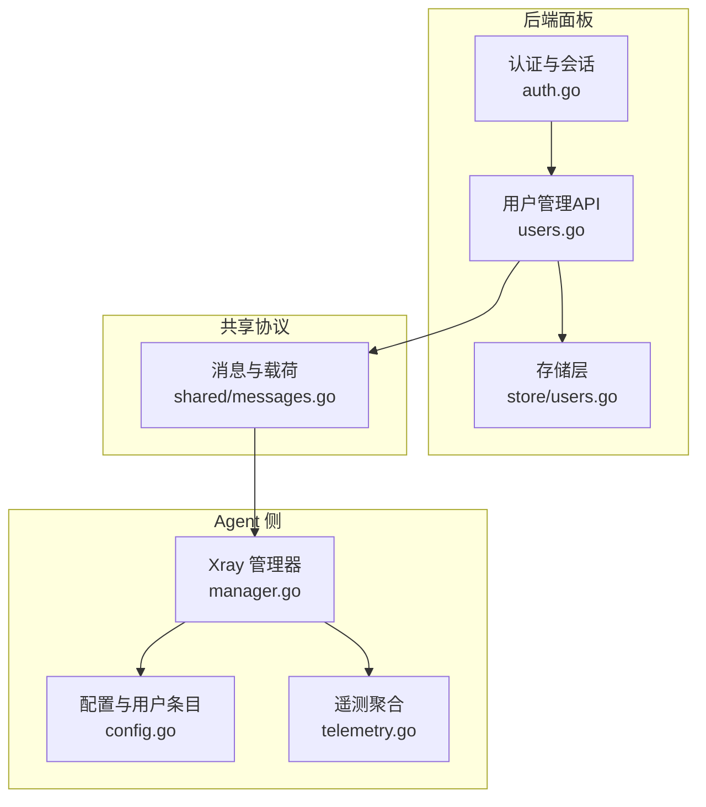
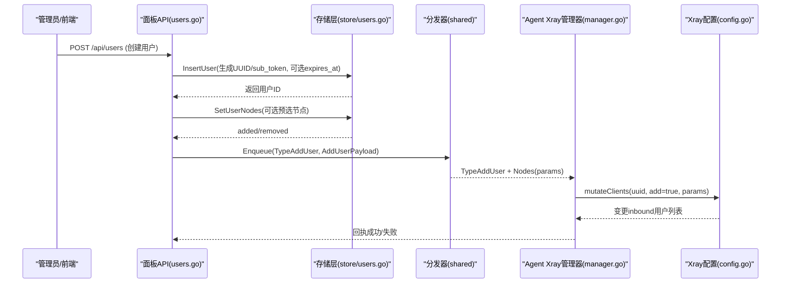
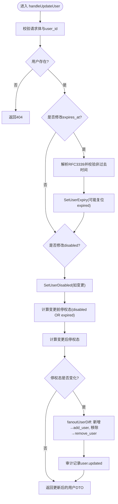
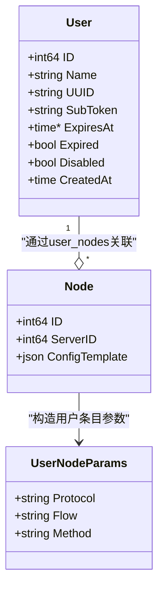
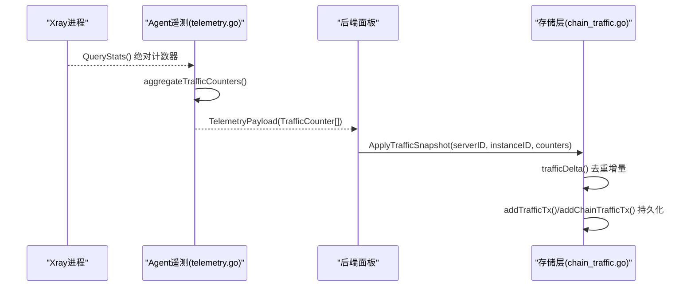
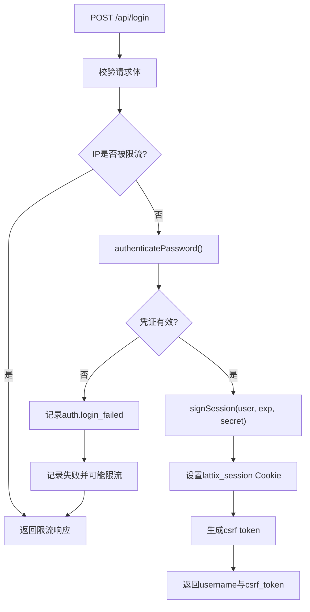
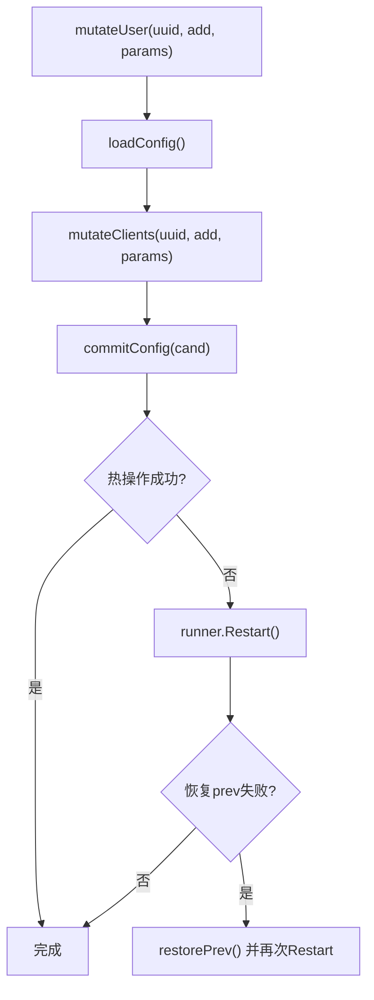
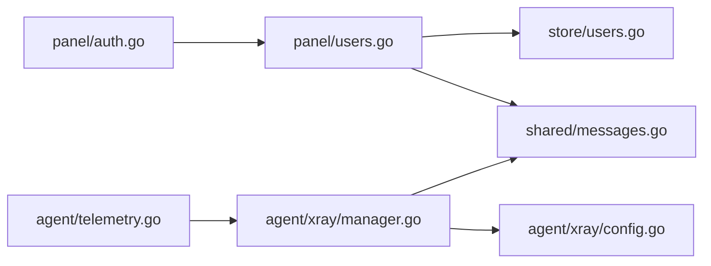

# 用户管理

<cite>
**本文引用的文件**   
- [src/backend/internal/panel/users.go](file://src/backend/internal/panel/users.go)
- [src/backend/internal/store/users.go](file://src/backend/internal/store/users.go)
- [src/agent/internal/xray/config.go](file://src/agent/internal/xray/config.go)
- [src/agent/internal/xray/manager.go](file://src/agent/internal/xray/manager.go)
- [src/shared/messages.go](file://src/shared/messages.go)
- [src/backend/internal/panel/auth.go](file://src/backend/internal/panel/auth.go)
- [src/agent/cmd/agent/telemetry.go](file://src/agent/cmd/agent/telemetry.go)
- [src/backend/internal/store/chain_traffic.go](file://src/backend/internal/store/chain_traffic.go)
</cite>

## 目录
1. [简介](#简介)
2. [项目结构](#项目结构)
3. [核心组件](#核心组件)
4. [架构总览](#架构总览)
5. [详细组件分析](#详细组件分析)
6. [依赖关系分析](#依赖关系分析)
7. [性能考量](#性能考量)
8. [故障排查指南](#故障排查指南)
9. [结论](#结论)
10. [附录](#附录)

## 简介
本技术文档聚焦 Lattix-codex Agent 中的 Xray 用户管理功能，覆盖用户的增删改、UUID 与订阅令牌生成、权限与配额设置、用户与节点的多对多关联与热更新、用户级流量统计与计费数据收集、认证机制（密码、会话、CSRF）、以及配置热更新的增量同步与事务处理。同时提供最佳实践与安全建议，包括密码策略、访问审计与合规要求。

## 项目结构
围绕用户管理的代码主要分布在后端面板、存储层、Agent 侧 Xray 管理与共享协议定义中：
- 后端面板 API：用户创建、更新、分配节点、删除等 HTTP 接口实现
- 存储层：用户模型、有效期与停权标记、用户-节点关联、到期扫描与停权
- Agent 侧 Xray 管理：用户条目在 inbound 的增删、热操作与重启兜底、漂移检测与回滚
- 共享协议：AddUser/RemoveUser 载荷、遥测计数器、消息信封
- 认证与会话：登录、会话签名、CSRF、来源校验

图表来源
- [src/backend/internal/panel/users.go:1-461](file://src/backend/internal/panel/users.go#L1-L461)
- [src/backend/internal/store/users.go:1-276](file://src/backend/internal/store/users.go#L1-L276)
- [src/agent/internal/xray/manager.go:1-459](file://src/agent/internal/xray/manager.go#L1-L459)
- [src/agent/internal/xray/config.go:1-202](file://src/agent/internal/xray/config.go#L1-L202)
- [src/shared/messages.go:1-313](file://src/shared/messages.go#L1-L313)
- [src/backend/internal/panel/auth.go:1-269](file://src/backend/internal/panel/auth.go#L1-L269)

章节来源
- [src/backend/internal/panel/users.go:1-461](file://src/backend/internal/panel/users.go#L1-L461)
- [src/backend/internal/store/users.go:1-276](file://src/backend/internal/store/users.go#L1-L276)
- [src/agent/internal/xray/manager.go:1-459](file://src/agent/internal/xray/manager.go#L1-L459)
- [src/agent/internal/xray/config.go:1-202](file://src/agent/internal/xray/config.go#L1-L202)
- [src/shared/messages.go:1-313](file://src/shared/messages.go#L1-L313)
- [src/backend/internal/panel/auth.go:1-269](file://src/backend/internal/panel/auth.go#L1-L269)

## 核心组件
- 用户模型与生命周期
  - 用户包含独立 UUID、sub_token、可选有效期、到期停权标记、管理员显式停用标记、创建时间
  - 有效停权态 = expired OR disabled；任一成立即视为停权
- 用户与节点关联
  - 多对多关系，支持整体替换分配；按差量计算新增/移除集合进行增量扇出
  - 节点模板决定协议类型与构造参数（flow/method）
- 用户级流量统计
  - Agent 上报 xray 绝对计数器，后端去重并累计为增量，持久化到用户维度表
  - 支持链路级与跳级统计、乘数折算、周期重置
- 认证与会话
  - 基于 HMAC-SHA256 的会话签名与 CSRF 保护，登录失败限流与审计记录

章节来源
- [src/backend/internal/store/users.go:11-23](file://src/backend/internal/store/users.go#L11-L23)
- [src/backend/internal/store/users.go:118-192](file://src/backend/internal/store/users.go#L118-L192)
- [src/backend/internal/panel/users.go:18-48](file://src/backend/internal/panel/users.go#L18-L48)
- [src/backend/internal/panel/auth.go:21-79](file://src/backend/internal/panel/auth.go#L21-L79)

## 架构总览
用户管理涉及“面板 API → 存储层 → 分发器 → Agent Xray 管理器 → Xray 配置”的完整链路，并在 Agent 侧完成热操作或重启兜底。遥测数据从 Agent 上报至后端，用于用户级流量统计与计费展示。

图表来源
- [src/backend/internal/panel/users.go:78-156](file://src/backend/internal/panel/users.go#L78-L156)
- [src/backend/internal/store/users.go:25-38](file://src/backend/internal/store/users.go#L25-L38)
- [src/shared/messages.go:156-178](file://src/shared/messages.go#L156-L178)
- [src/agent/internal/xray/manager.go:172-181](file://src/agent/internal/xray/manager.go#L172-L181)
- [src/agent/internal/xray/config.go:87-114](file://src/agent/internal/xray/config.go#L87-L114)

## 详细组件分析

### 用户创建与修改
- 创建用户
  - 生成 UUID 与随机 sub_token；可设置 expires_at（RFC3339），省略/null 表示长期
  - 可选预选 node_ids（业务节点 ID），校验存在性后执行 SetUserNodes，并增量扇出 add_user
  - 审计记录 user.create，包含用户 ID、名称、节点数量
- 更新用户
  - 支持修改 expires_at（可为 null 清除）与 disabled 开关
  - 若有效停权态发生跃迁（expired/disabled 变化），则根据当前分配节点集扇出 remove_user/add_user
  - 审计记录 user.updated，包含变更字段快照

图表来源
- [src/backend/internal/panel/users.go:170-278](file://src/backend/internal/panel/users.go#L170-L278)
- [src/backend/internal/store/users.go:170-192](file://src/backend/internal/store/users.go#L170-L192)

章节来源
- [src/backend/internal/panel/users.go:78-156](file://src/backend/internal/panel/users.go#L78-L156)
- [src/backend/internal/panel/users.go:170-278](file://src/backend/internal/panel/users.go#L170-L278)
- [src/backend/internal/store/users.go:25-38](file://src/backend/internal/store/users.go#L25-L38)
- [src/backend/internal/store/users.go:170-192](file://src/backend/internal/store/users.go#L170-L192)

### 用户与节点的关联与热更新
- 整体替换用户节点分配
  - 校验节点存在性，计算 added/removed 差量，原子写入 user_nodes
  - 按服务器分组节点参数，调用 fanoutUserDiff 向相关服务器下发 add_user/remove_user
- 删除用户
  - 先扇出 remove_user（仅含有用户节点的服务器），再删除用户及关联
  - 审计记录 user.delete，保留 name 快照

图表来源
- [src/backend/internal/store/users.go:14-23](file://src/backend/internal/store/users.go#L14-L23)
- [src/shared/messages.go:166-171](file://src/shared/messages.go#L166-L171)

章节来源
- [src/backend/internal/panel/users.go:287-345](file://src/backend/internal/panel/users.go#L287-L345)
- [src/backend/internal/panel/users.go:347-379](file://src/backend/internal/panel/users.go#L347-L379)
- [src/backend/internal/panel/users.go:381-412](file://src/backend/internal/panel/users.go#L381-L412)
- [src/backend/internal/store/users.go:194-253](file://src/backend/internal/store/users.go#L194-L253)

### 用户级流量统计与计费数据
- 遥测上报
  - Agent 聚合 xray StatsService 的绝对计数器，按 user/node/hop 维度汇总 up/down
  - 上报 shared.TrafficCounter，包含 user UUID、nodeID、hopID、up、down
- 后端持久化
  - 使用 traffic_cursors 去重与增量计算，避免丢帧重复
  - 用户维度直接写入 traffic 表；节点维度映射到链路与跳，应用乘数折算
- 计费与周期
  - 服务器级流量计费与重置周期由 billing 模块维护，用户维度统计用于展示与审计

图表来源
- [src/agent/cmd/agent/telemetry.go:48-102](file://src/agent/cmd/agent/telemetry.go#L48-L102)
- [src/backend/internal/store/chain_traffic.go:39-104](file://src/backend/internal/store/chain_traffic.go#L39-L104)
- [src/backend/internal/store/chain_traffic.go:119-148](file://src/backend/internal/store/chain_traffic.go#L119-L148)

章节来源
- [src/agent/cmd/agent/telemetry.go:48-102](file://src/agent/cmd/agent/telemetry.go#L48-L102)
- [src/backend/internal/store/chain_traffic.go:39-148](file://src/backend/internal/store/chain_traffic.go#L39-L148)

### 用户认证机制
- 登录与会话
  - 用户名密码登录，HMAC-SHA256 签名会话值，Cookie 携带 sessionTTL
  - 登录失败限流与审计记录；成功后签发 CSRF Token
- 访问控制
  - requireAuth 中间件校验会话；requireCSRF 校验请求头 X-CSRF-Token
  - requireSameOrigin 校验 Origin/Referer 与 Host 一致，HTTPS 下强制安全来源

图表来源
- [src/backend/internal/panel/auth.go:81-145](file://src/backend/internal/panel/auth.go#L81-L145)
- [src/backend/internal/panel/auth.go:197-269](file://src/backend/internal/panel/auth.go#L197-L269)

章节来源
- [src/backend/internal/panel/auth.go:21-79](file://src/backend/internal/panel/auth.go#L21-L79)
- [src/backend/internal/panel/auth.go:81-145](file://src/backend/internal/panel/auth.go#L81-L145)
- [src/backend/internal/panel/auth.go:197-269](file://src/backend/internal/panel/auth.go#L197-L269)

### 用户配置的热更新与事务处理
- 热更新路径
  - Agent Manager 优先尝试 gRPC 热操作（AddUser/RemoveUser），失败则重启 Xray 兜底
  - 配置落盘采用临时文件 → xrun -test 校验 → 备份 prev → 原子 rename
  - 漂移检测：对比 lastHash，外部修改时以骨架+受管 inbound 净化重建
- 事务处理
  - SetUserNodes 使用事务原子替换 user_nodes，并返回 added/removed 差量
  - DeleteUser 事务内删除 user_nodes 与 users，保证一致性

图表来源
- [src/agent/internal/xray/manager.go:196-233](file://src/agent/internal/xray/manager.go#L196-L233)
- [src/agent/internal/xray/manager.go:235-287](file://src/agent/internal/xray/manager.go#L235-L287)
- [src/agent/internal/xray/manager.go:289-334](file://src/agent/internal/xray/manager.go#L289-L334)
- [src/backend/internal/store/users.go:214-253](file://src/backend/internal/store/users.go#L214-L253)

章节来源
- [src/agent/internal/xray/manager.go:196-233](file://src/agent/internal/xray/manager.go#L196-L233)
- [src/agent/internal/xray/manager.go:235-287](file://src/agent/internal/xray/manager.go#L235-L287)
- [src/agent/internal/xray/manager.go:289-334](file://src/agent/internal/xray/manager.go#L289-L334)
- [src/backend/internal/store/users.go:214-253](file://src/backend/internal/store/users.go#L214-L253)

## 依赖关系分析
- 面板 API 依赖存储层与共享协议
- Agent 管理器依赖共享协议与 Xray 配置模块
- 遥测模块依赖 Agent 管理器查询 StatsService
- 认证模块依赖会话签名与 CSRF 工具函数

图表来源
- [src/backend/internal/panel/users.go:1-461](file://src/backend/internal/panel/users.go#L1-L461)
- [src/backend/internal/store/users.go:1-276](file://src/backend/internal/store/users.go#L1-L276)
- [src/agent/internal/xray/manager.go:1-459](file://src/agent/internal/xray/manager.go#L1-L459)
- [src/agent/internal/xray/config.go:1-202](file://src/agent/internal/xray/config.go#L1-L202)
- [src/shared/messages.go:1-313](file://src/shared/messages.go#L1-L313)
- [src/backend/internal/panel/auth.go:1-269](file://src/backend/internal/panel/auth.go#L1-L269)
- [src/agent/cmd/agent/telemetry.go:48-102](file://src/agent/cmd/agent/telemetry.go#L48-L102)

章节来源
- [src/backend/internal/panel/users.go:1-461](file://src/backend/internal/panel/users.go#L1-L461)
- [src/backend/internal/store/users.go:1-276](file://src/backend/internal/store/users.go#L1-L276)
- [src/agent/internal/xray/manager.go:1-459](file://src/agent/internal/xray/manager.go#L1-L459)
- [src/agent/internal/xray/config.go:1-202](file://src/agent/internal/xray/config.go#L1-L202)
- [src/shared/messages.go:1-313](file://src/shared/messages.go#L1-L313)
- [src/backend/internal/panel/auth.go:1-269](file://src/backend/internal/panel/auth.go#L1-L269)
- [src/agent/cmd/agent/telemetry.go:48-102](file://src/agent/cmd/agent/telemetry.go#L48-L102)

## 性能考量
- 增量扇出：仅在节点分配差量上广播 add_user/remove_user，减少不必要操作
- 幂等与去重：traffic_cursors 保证绝对计数器的增量计算幂等，避免重复累计
- 配置落盘原子性：临时文件 + 校验 + 原子 rename，降低损坏风险
- 热操作优先：gRPC 热操作失败才重启，缩短影响窗口

[本节为通用指导，不直接分析具体文件]

## 故障排查指南
- 用户无法生效
  - 检查 fanoutUserDiff 日志，确认 add_user/remove_user 是否成功下发
  - 查看 Agent 侧热操作失败日志，必要时重启 Xray 并验证配置
- 流量统计异常
  - 核对 telemetry 上报的 TrafficCounter 是否包含 user UUID
  - 检查 traffic_cursors 实例 ID 与上次值，确保增量计算正确
- 认证失败
  - 检查会话签名与 CSRF Token 是否匹配
  - 查看登录失败审计记录与限流状态

章节来源
- [src/backend/internal/panel/users.go:347-379](file://src/backend/internal/panel/users.go#L347-L379)
- [src/agent/internal/xray/manager.go:196-233](file://src/agent/internal/xray/manager.go#L196-L233)
- [src/backend/internal/store/chain_traffic.go:119-148](file://src/backend/internal/store/chain_traffic.go#L119-L148)
- [src/backend/internal/panel/auth.go:81-145](file://src/backend/internal/panel/auth.go#L81-L145)

## 结论
用户管理功能通过面板 API 与存储层协作，结合 Agent 侧 Xray 管理器的热更新能力，实现了高效、可靠的用户生命周期管理。用户与节点的多对多关联支持增量扇出，用户级流量统计与计费数据收集完善，认证与会话机制保障安全性。建议在部署中遵循密码策略、访问审计与合规要求，确保系统稳定与安全。

[本节为总结，不直接分析具体文件]

## 附录
- 最佳实践
  - 密码策略：强密码、定期更换、失败限流
  - 访问审计：记录所有用户管理操作与认证事件
  - 合规要求：数据最小化、加密传输、审计留存
- 常见问题
  - 节点模板损坏：跳过该节点，修复模板后重试
  - 漂移检测：外部修改导致配置不一致，自动净化重建

[本节为通用指导，不直接分析具体文件]