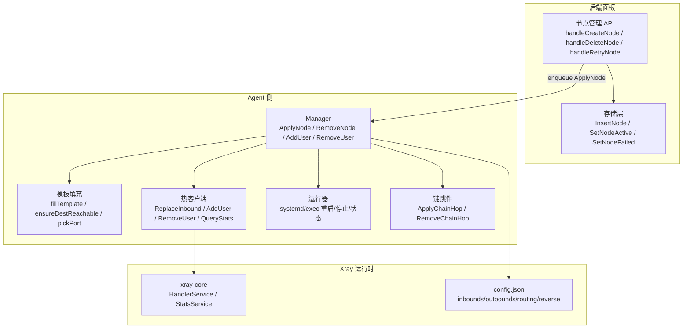
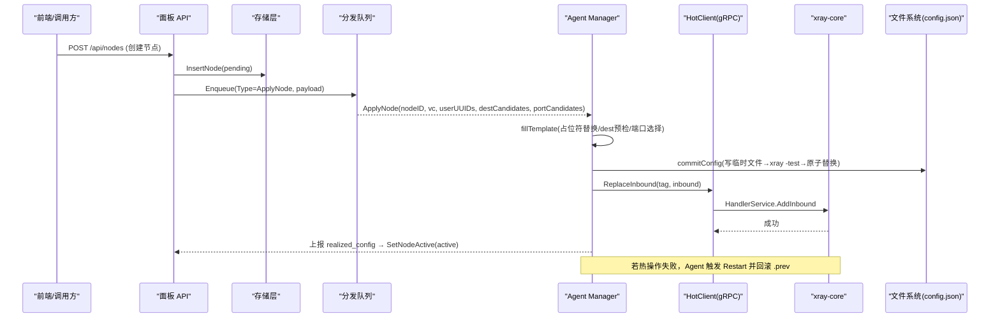
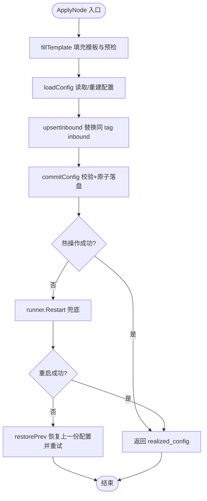
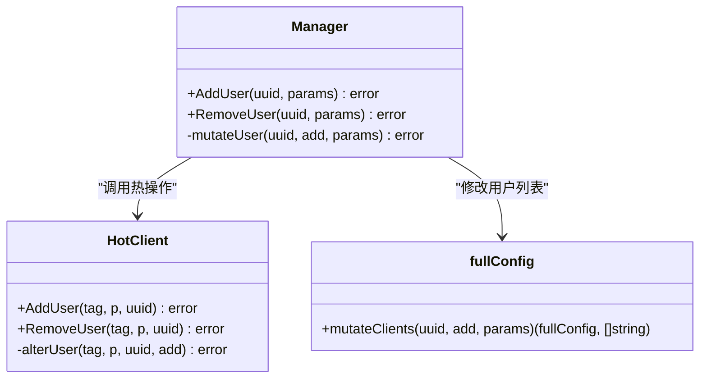
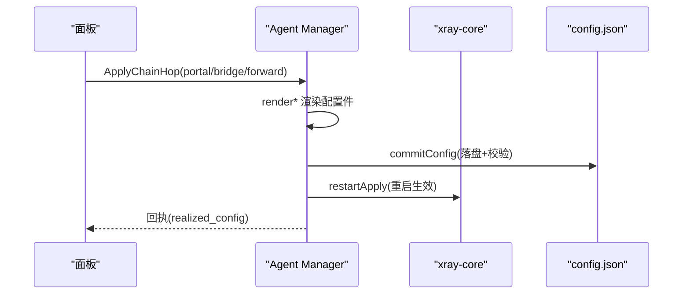
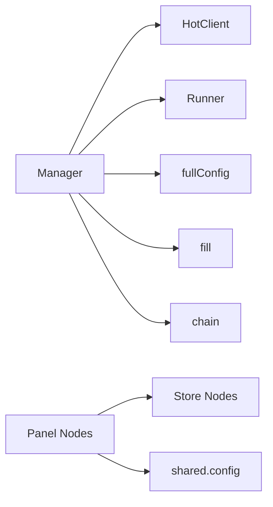

# 节点管理

<cite>
**本文引用的文件**   
- [manager.go](file://src/agent/internal/xray/manager.go)
- [config.go](file://src/agent/internal/xray/config.go)
- [fill.go](file://src/agent/internal/xray/fill.go)
- [hot.go](file://src/agent/internal/xray/hot.go)
- [chain.go](file://src/agent/internal/xray/chain.go)
- [runner.go](file://src/agent/internal/xray/runner.go)
- [config.go](file://src/shared/config.go)
- [nodes.go](file://src/backend/internal/panel/nodes.go)
- [nodes.go](file://src/backend/internal/store/nodes.go)
</cite>

## 目录
1. [简介](#简介)
2. [项目结构](#项目结构)
3. [核心组件](#核心组件)
4. [架构总览](#架构总览)
5. [详细组件分析](#详细组件分析)
6. [依赖关系分析](#依赖关系分析)
7. [性能考量](#性能考量)
8. [故障排查指南](#故障排查指南)
9. [结论](#结论)
10. [附录](#附录)

## 简介
本技术文档聚焦 Lattix-codex Agent 中的 Xray 节点管理功能，系统性阐述节点的创建、删除、更新流程，入站监听器配置与用户关联、端口分配策略；覆盖支持的节点类型（VLESS、Reality、TCP、UDP、VMess、Trojan、Shadowsocks、Socks、HTTP、Dokodemo）及其配置生成规则；说明节点状态管理与流量统计、性能指标采集；解释链式转发与上下游依赖关系（Portal/Bridge/Forward）；详述热更新机制（gRPC 热操作、增量用户变更、回滚与一致性保证），并提供 API 使用示例与常见问题解决方案。

## 项目结构
Xray 节点管理由后端面板编排、Agent 侧执行与 Xray 运行时三部分组成：
- 后端面板负责节点定义、模板构建、队列下发与状态持久化。
- Agent 侧 Manager 负责模板填充、配置校验、原子落盘、热操作与兜底重启、漂移检测与修复。
- Xray 通过 gRPC API 提供热操作与统计查询能力。

**图表来源** 
- [manager.go:109-142](file://src/agent/internal/xray/manager.go#L109-L142)
- [fill.go:23-142](file://src/agent/internal/xray/fill.go#L23-L142)
- [hot.go:72-100](file://src/agent/internal/xray/hot.go#L72-L100)
- [runner.go:28-53](file://src/agent/internal/xray/runner.go#L28-L53)
- [chain.go:82-119](file://src/agent/internal/xray/chain.go#L82-L119)
- [nodes.go:196-250](file://src/backend/internal/panel/nodes.go#L196-L250)
- [nodes.go:102-122](file://src/backend/internal/store/nodes.go#L102-L122)

**章节来源**
- [manager.go:1-459](file://src/agent/internal/xray/manager.go#L1-L459)
- [config.go:1-202](file://src/agent/internal/xray/config.go#L1-L202)
- [fill.go:1-355](file://src/agent/internal/xray/fill.go#L1-L355)
- [hot.go:1-148](file://src/agent/internal/xray/hot.go#L1-L148)
- [chain.go:1-665](file://src/agent/internal/xray/chain.go#L1-L665)
- [runner.go:1-159](file://src/agent/internal/xray/runner.go#L1-L159)
- [config.go:1-206](file://src/shared/config.go#L1-L206)
- [nodes.go:1-490](file://src/backend/internal/panel/nodes.go#L1-L490)
- [nodes.go:1-141](file://src/backend/internal/store/nodes.go#L1-L141)

## 核心组件
- Manager：单实例管理一台服务器上的 xray，负责配置生命周期、热操作、服务重启、漂移检测与链 piece 合并。
- HotClient：通过 xray gRPC API 实现零重启的 inbound 增删改与用户级操作、流量统计查询。
- fill 模块：模板占位符替换、dest 可达性预检、端口选择、VLESS Encryption 与 Reality 密钥对生成。
- chain 模块：链跳配置件（portal/bridge/forward）渲染、合并、幂等应用与清理。
- runner：抽象 xray 进程控制（systemd/systemctl 或 exec 子进程）。
- shared.config：协议常量、传输方式、模板占位符、虚拟配置与实际生效值结构体。
- 后端 nodes：节点 CRUD、模板构建、队列下发、状态机流转与审计。

**章节来源**
- [manager.go:24-40](file://src/agent/internal/xray/manager.go#L24-L40)
- [hot.go:27-37](file://src/agent/internal/xray/hot.go#L27-L37)
- [fill.go:20-23](file://src/agent/internal/xray/fill.go#L20-L23)
- [chain.go:1-14](file://src/agent/internal/xray/chain.go#L1-L14)
- [runner.go:16-25](file://src/agent/internal/xray/runner.go#L16-L25)
- [config.go:13-24](file://src/shared/config.go#L13-L24)
- [nodes.go:15-35](file://src/backend/internal/panel/nodes.go#L15-L35)

## 架构总览
节点管理的端到端流程如下：
- 面板接收创建请求，构建 VirtualConfig 模板并持久化，进入 pending/applying 状态。
- Agent 收到 apply_node 后，填充模板、校验配置、原子落盘，优先走 gRPC 热操作；失败则重启兜底并回滚。
- 用户级变更通过 AlterInbound/AddUserOperation 或 RemoveUserOperation 热更新；不支持的协议回退重启。
- 链跳配置件通过落盘+重启路径应用，确保 reverse/routing 等无法热更新的段生效。
- 遥测通过 StatsService 拉取累计计数器，结合 policy/stats 启用用户级与入站级统计。

**图表来源** 
- [nodes.go:196-250](file://src/backend/internal/panel/nodes.go#L196-L250)
- [nodes.go:328-369](file://src/backend/internal/panel/nodes.go#L328-L369)
- [manager.go:109-142](file://src/agent/internal/xray/manager.go#L109-L142)
- [fill.go:23-142](file://src/agent/internal/xray/fill.go#L23-L142)
- [hot.go:72-90](file://src/agent/internal/xray/hot.go#L72-L90)
- [manager.go:235-287](file://src/agent/internal/xray/manager.go#L235-L287)

## 详细组件分析

### 节点创建与更新（ApplyNode）
- 入口：Manager.ApplyNode 串行化执行，避免并发写坏 config.json。
- 步骤：
  1) fillTemplate 填充 PORT/TAG/CLIENTS/PRIVATE_KEY/DECRYPTION 等占位符，进行 dest 预检与端口选择。
  2) loadConfig 读取现有配置（缺失/损坏/漂移净化时重建骨架 + 受管 inbound + 链 piece）。
  3) upsertInbound 替换同 tag 的 inbound，commitConfig 写临时文件、xray run -test 校验、备份 .prev、原子 rename。
  4) hot.ReplaceInbound 先删后加，幂等；失败则 runner.Restart 兜底，再次失败恢复 .prev 并重试一次。
  5) 返回 RealizedConfig（port/public_key/short_id/server_name/network/service_name/path/mode/host/method/psk/encryption）。

**图表来源** 
- [manager.go:109-142](file://src/agent/internal/xray/manager.go#L109-L142)
- [fill.go:23-142](file://src/agent/internal/xray/fill.go#L23-L142)
- [manager.go:235-287](file://src/agent/internal/xray/manager.go#L235-L287)

**章节来源**
- [manager.go:109-142](file://src/agent/internal/xray/manager.go#L109-L142)
- [fill.go:23-142](file://src/agent/internal/xray/fill.go#L23-L142)
- [manager.go:235-287](file://src/agent/internal/xray/manager.go#L235-L287)

### 节点删除（RemoveNode）
- 幂等：不存在即视为成功。
- 流程：loadConfig → removeInbound → commitConfig → hot.RemoveInbound；失败则 restart 兜底并回滚。

**章节来源**
- [manager.go:144-170](file://src/agent/internal/xray/manager.go#L144-L170)
- [config.go:64-81](file://src/agent/internal/xray/config.go#L64-L81)

### 用户关联与热更新（AddUser/RemoveUser）
- 支持协议：vless/vmess/trojan 可通过 AlterInbound 热操作；其他协议（如 socks/http/shadowsocks/dokodemo）将回退到重启。
- 匹配键：clients 按 email，accounts 按 user；SS 2022-blake3 多用户以确定性派生密码。
- 流程：mutateClients 修改 inbound settings.clients/accounts → commitConfig → 逐 tag 热操作；任一失败则 restart 兜底并回滚。

**图表来源** 
- [manager.go:172-233](file://src/agent/internal/xray/manager.go#L172-L233)
- [hot.go:102-135](file://src/agent/internal/xray/hot.go#L102-L135)
- [config.go:83-114](file://src/agent/internal/xray/config.go#L83-L114)

**章节来源**
- [manager.go:172-233](file://src/agent/internal/xray/manager.go#L172-L233)
- [hot.go:102-135](file://src/agent/internal/xray/hot.go#L102-L135)
- [config.go:83-114](file://src/agent/internal/xray/config.go#L83-L114)

### 端口分配策略（pickPort/pickChainPort）
- 指定端口：检查占用，冲突报错。
- 候选端口：受限直连 NAT 场景下，从 port_candidates 中挑选空闲端口。
- 无候选：随机分配空闲端口。
- 链 piece 端口：优先复用已记录端口，被占用再按候选挑选。

**章节来源**
- [fill.go:247-276](file://src/agent/internal/xray/fill.go#L247-L276)
- [chain.go:362-374](file://src/agent/internal/xray/chain.go#L362-L374)

### 节点类型与配置生成
- 支持协议：VLESS、VMess、Trojan、Shadowsocks、Socks、HTTP、Dokodemo。
- Reality 安全层：仅与 tcp/grpc/xhttp 组合；自动生成 privateKey（不出服务器），publicKey/shortId/serverName 随 realized_config 上报。
- VLESS Encryption：执行 vlessenc 生成 decryption/encryption 对；vision+Encryption 强制 1-RTT 模式。
- Shadowsocks 2022-blake3：节点级 PSK 与用户密码确定性派生。
- Dokodemo：端口转发，无用户概念。

**章节来源**
- [config.go:13-24](file://src/shared/config.go#L13-L24)
- [fill.go:278-347](file://src/agent/internal/xray/fill.go#L278-L347)
- [nodes.go:393-462](file://src/backend/internal/panel/nodes.go#L393-L462)

### 节点状态管理与遥测
- 状态机：pending → applying → active | failed。
- 遥测：policy.statsUserUplink/Downlink 与 system stats 开启；StatsService.QueryStats 拉取累计计数器。
- 实例标识：InstanceID 用于跨重启稳定追踪绝对计数器。

**章节来源**
- [nodes.go:12-18](file://src/backend/internal/store/nodes.go#L12-L18)
- [manager.go:377-397](file://src/agent/internal/xray/manager.go#L377-L397)
- [hot.go:56-70](file://src/agent/internal/xray/hot.go#L56-L70)
- [manager.go:98-107](file://src/agent/internal/xray/manager.go#L98-L107)

### 链式依赖与转发（Portal/Bridge/Forward）
- Portal：反向链上游机，VLESS+Reality interconn inbound + reverse portal + routing。
- Bridge：下游机，reverse bridge + VLESS+Reality outbound + routing。
- Forward：入口/中间跳，dokodemo-door 透传 inbound + routing（经隧道或直连下一跳）。
- 幂等：重发复用端口与密钥，避免凭证失效。

**图表来源** 
- [chain.go:82-119](file://src/agent/internal/xray/chain.go#L82-L119)
- [chain.go:156-218](file://src/agent/internal/xray/chain.go#L156-L218)
- [chain.go:241-286](file://src/agent/internal/xray/chain.go#L241-L286)
- [chain.go:310-349](file://src/agent/internal/xray/chain.go#L310-L349)

**章节来源**
- [chain.go:82-119](file://src/agent/internal/xray/chain.go#L82-L119)
- [chain.go:156-218](file://src/agent/internal/xray/chain.go#L156-L218)
- [chain.go:241-286](file://src/agent/internal/xray/chain.go#L241-L286)
- [chain.go:310-349](file://src/agent/internal/xray/chain.go#L310-L349)

### 热更新机制与一致性保证
- 主路径：gRPC 热操作（ReplaceInbound/AddUser/RemoveUser），零重启。
- 兜底路径：restartApply 重启 xray，失败则 restorePrev 回滚并再次尝试。
- 一致性：
  - 原子落盘：临时文件 + xray -test 校验 + rename。
  - 漂移检测：ConfigDrift 比较哈希，首次以当前为基线；drifted=true 时净化外部改动，保留受管 inbound。
  - 幂等：RemoveNode/RemoveChainHop 不存在即成功；ApplyChainHop 重发复用端口与密钥。

**章节来源**
- [manager.go:235-287](file://src/agent/internal/xray/manager.go#L235-L287)
- [manager.go:289-334](file://src/agent/internal/xray/manager.go#L289-L334)
- [chain.go:146-154](file://src/agent/internal/xray/chain.go#L146-L154)

## 依赖关系分析
- Manager 依赖：
  - HotClient：gRPC 热操作与统计查询。
  - Runner：systemd/exec 进程控制。
  - fullConfig：配置拼装与用户列表修改。
  - fill/chain：模板填充与链 piece 渲染。
- 后端依赖：
  - store：节点状态机与数据持久化。
  - shared：协议常量、模板占位符、数据结构。

**图表来源** 
- [manager.go:24-40](file://src/agent/internal/xray/manager.go#L24-L40)
- [hot.go:27-37](file://src/agent/internal/xray/hot.go#L27-L37)
- [runner.go:16-25](file://src/agent/internal/xray/runner.go#L16-L25)
- [config.go:10-20](file://src/agent/internal/xray/config.go#L10-L20)
- [nodes.go:15-35](file://src/backend/internal/panel/nodes.go#L15-L35)
- [nodes.go:1-141](file://src/backend/internal/store/nodes.go#L1-141)
- [config.go:13-24](file://src/shared/config.go#L13-L24)

**章节来源**
- [manager.go:24-40](file://src/agent/internal/xray/manager.go#L24-L40)
- [hot.go:27-37](file://src/agent/internal/xray/hot.go#L27-L37)
- [runner.go:16-25](file://src/agent/internal/xray/runner.go#L16-L25)
- [config.go:10-20](file://src/agent/internal/xray/config.go#L10-L20)
- [nodes.go:15-35](file://src/backend/internal/panel/nodes.go#L15-L35)
- [nodes.go:1-141](file://src/backend/internal/store/nodes.go#L1-141)
- [config.go:13-24](file://src/shared/config.go#L13-L24)

## 性能考量
- 热操作优先：减少重启开销，提升用户体验。
- 原子落盘与校验：避免脏配置导致启动失败。
- 端口冲突检测：在分配阶段尽早失败，避免后续重试成本。
- 遥测计数器：基于 StatsService 的累计计数，注意跨重启稳定性（InstanceID）。
- 链 piece 幂等：复用端口与密钥，降低资源竞争与证书失效风险。

[本节为通用指导，不直接分析具体文件]

## 故障排查指南
- 热操作失败：查看日志“热操作失败...且重启失败”，确认 xray gRPC 连通性与配置合法性。
- 配置校验失败：检查模板占位符是否完整替换、JSON 合法性、dest 可达性。
- 端口占用：确认端口是否在 allowed_ports 范围内或被其他进程占用。
- 漂移检测：若外部修改 config.json，Agent 会净化并保留受管 inbound；必要时手动恢复 .prev。
- 用户热更新不支持：非 vless/vmess/trojan 协议将回退重启，检查协议类型。

**章节来源**
- [manager.go:131-141](file://src/agent/internal/xray/manager.go#L131-L141)
- [manager.go:262-265](file://src/agent/internal/xray/manager.go#L262-L265)
- [fill.go:247-276](file://src/agent/internal/xray/fill.go#L247-L276)
- [manager.go:289-334](file://src/agent/internal/xray/manager.go#L289-L334)
- [hot.go:113-117](file://src/agent/internal/xray/hot.go#L113-L117)

## 结论
Xray 节点管理通过“模板填充 + 原子落盘 + 热操作 + 兜底重启 + 回滚”的流水线，实现了高可靠、可观测、可扩展的节点生命周期管理。配合链式转发与漂移检测，系统在复杂网络环境下仍能保持一致性与可用性。建议在生产环境中严格限制端口范围、启用遥测与审计，并定期验证 dest 白名单与证书有效性。

[本节为总结，不直接分析具体文件]

## 附录

### API 使用示例
- 创建节点：POST /api/nodes，body 包含 name、server_id、protocol、port（可选）、reality 参数（short_id/dest/server_names/fingerprint/network 及 grpc/xhttp 子选项）、flow（vless）、method（shadowsocks）、target_address/target_port（dokodemo）。
- 删除节点：DELETE /api/nodes/{id}，body 包含 node_id。
- 重试节点：POST /api/nodes/{id}/retry，body 包含 node_id。

**章节来源**
- [nodes.go:76-99](file://src/backend/internal/panel/nodes.go#L76-L99)
- [nodes.go:196-250](file://src/backend/internal/panel/nodes.go#L196-L250)
- [nodes.go:289-326](file://src/backend/internal/panel/nodes.go#L289-L326)
- [nodes.go:252-287](file://src/backend/internal/panel/nodes.go#L252-L287)

### 常见问题解决方案
- 端口不在可用段：检查服务器 allowed_ports 配置，确保端口在范围内。
- Reality dest 不可达：调整 dest 或依赖内置白名单候选。
- VLESS Encryption 输出格式变化：确认 xray 版本与 vlessenc 输出解析逻辑。
- SS 2022-blake3 订阅拼接：PSK 与用户密码需按规范拼接。

**章节来源**
- [nodes.go:216-223](file://src/backend/internal/panel/nodes.go#L216-L223)
- [fill.go:170-223](file://src/agent/internal/xray/fill.go#L170-L223)
- [fill.go:278-311](file://src/agent/internal/xray/fill.go#L278-L311)
- [config.go:127-144](file://src/shared/config.go#L127-L144)