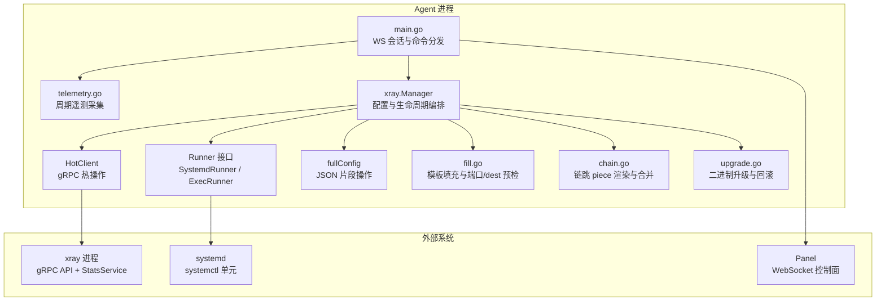
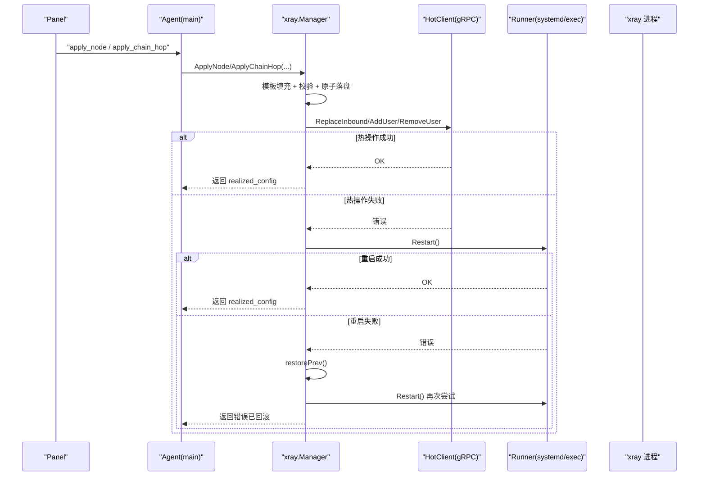
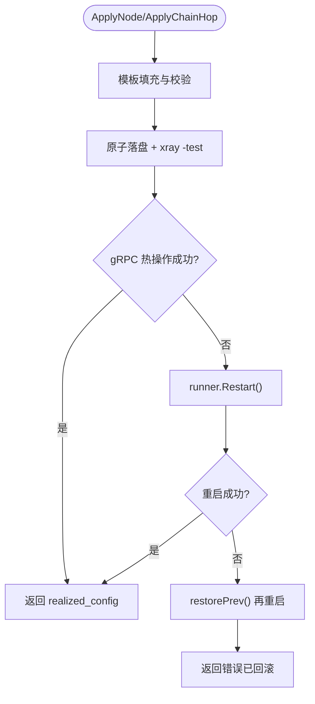
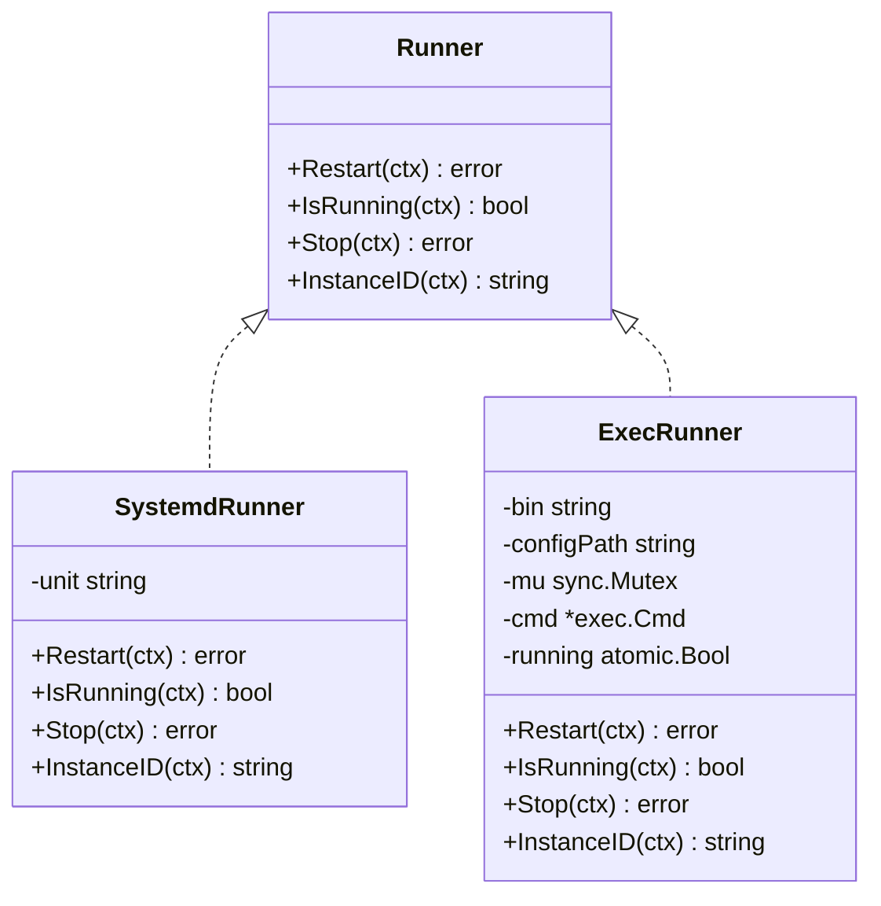
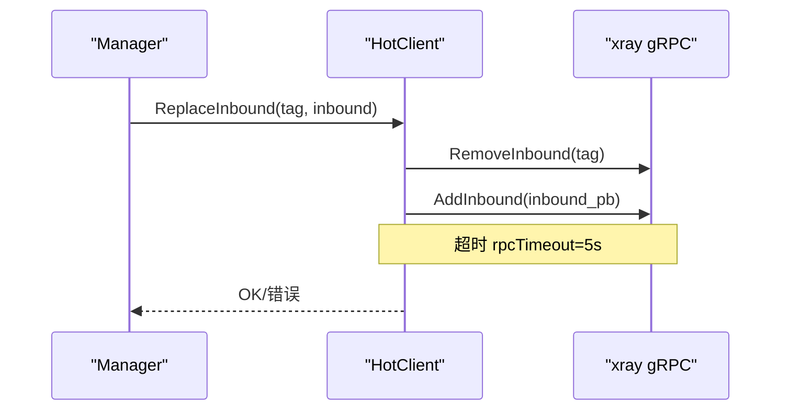
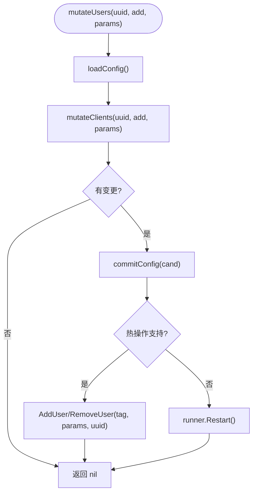
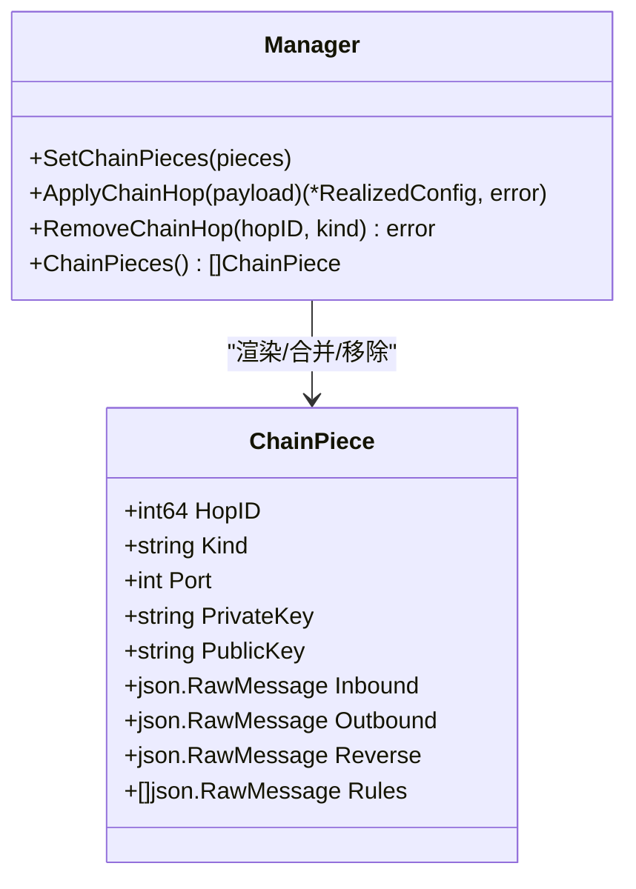
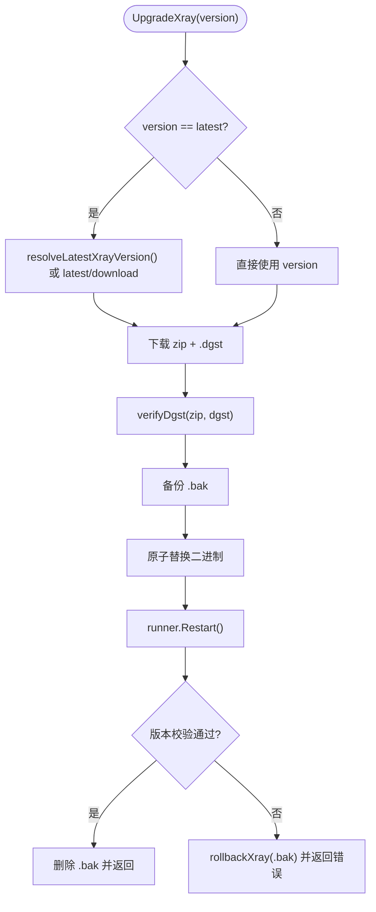
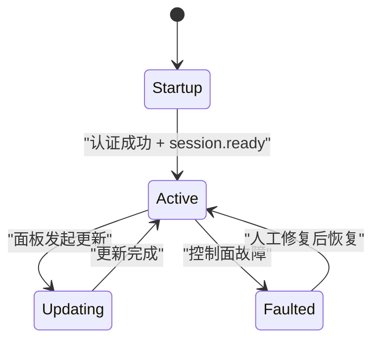
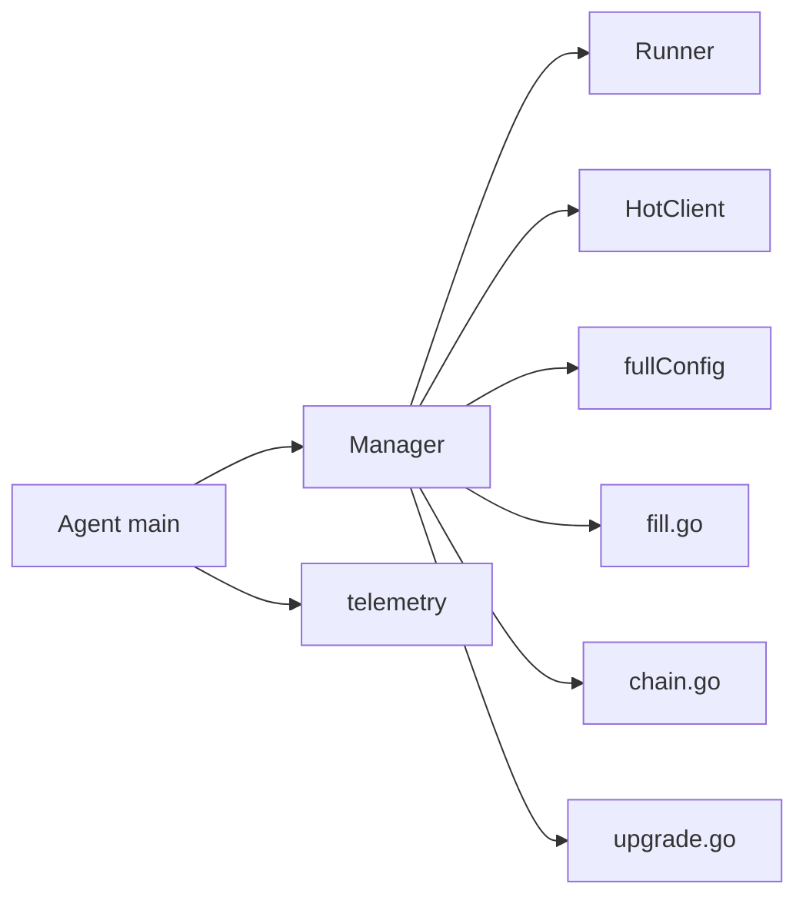

# 进程生命周期管理

<cite>
**本文引用的文件**   
- [manager.go](file://src/agent/internal/xray/manager.go)
- [runner.go](file://src/agent/internal/xray/runner.go)
- [hot.go](file://src/agent/internal/xray/hot.go)
- [config.go](file://src/agent/internal/xray/config.go)
- [fill.go](file://src/agent/internal/xray/fill.go)
- [chain.go](file://src/agent/internal/xray/chain.go)
- [upgrade.go](file://src/agent/internal/xray/upgrade.go)
- [main.go](file://src/agent/cmd/agent/main.go)
- [telemetry.go](file://src/agent/cmd/agent/telemetry.go)
- [lifecycle.go](file://src/shared/lifecycle.go)
- [panel-lifecycle-state-machine-design.md](file://docs/panel-lifecycle-state-machine-design.md)
- [server-probe-monitoring-design.md](file://docs/server-probe-monitoring-design.md)
</cite>

## 目录
1. [简介](#简介)
2. [项目结构](#项目结构)
3. [核心组件](#核心组件)
4. [架构总览](#架构总览)
5. [详细组件分析](#详细组件分析)
6. [依赖关系分析](#依赖关系分析)
7. [性能考量](#性能考量)
8. [故障排查指南](#故障排查指南)
9. [结论](#结论)
10. [附录](#附录)

## 简介
本文件面向 Lattix-codex Agent 中的 Xray 进程生命周期管理，系统性阐述进程启动、停止、重启的完整流程，覆盖 systemd 与 exec 两种 Runner 模式的差异；深入解释进程状态监控机制（健康检查、心跳检测、异常恢复）；描述进程间通信方式（gRPC API 热操作、WebSocket 控制面、配置热更新）；说明资源管理（内存、文件句柄、端口占用）；并提供故障排查与调优建议。文档以代码级实现为依据，辅以可视化图示，帮助读者快速理解并安全运维。

## 项目结构
Xray 生命周期管理位于 agent 内部 xray 包，由 Manager 统一编排：模板填充、配置校验、原子落盘、gRPC 热操作、systemd/exec 兜底重启、回滚与漂移修复。Runner 抽象了服务控制接口，HotClient 封装 gRPC 调用，链跳 piece 渲染与合并逻辑独立在 chain.go 中。Agent 主进程通过 WebSocket 接收面板指令，触发上述流程。

**图表来源** 
- [main.go:1-800](file://src/agent/cmd/agent/main.go#L1-L800)
- [manager.go:1-459](file://src/agent/internal/xray/manager.go#L1-L459)
- [runner.go:1-159](file://src/agent/internal/xray/runner.go#L1-L159)
- [hot.go:1-148](file://src/agent/internal/xray/hot.go#L1-L148)
- [config.go:1-202](file://src/agent/internal/xray/config.go#L1-L202)
- [fill.go:1-355](file://src/agent/internal/xray/fill.go#L1-L355)
- [chain.go:1-665](file://src/agent/internal/xray/chain.go#L1-L665)
- [upgrade.go:1-230](file://src/agent/internal/xray/upgrade.go#L1-L230)

**章节来源**
- [manager.go:1-459](file://src/agent/internal/xray/manager.go#L1-L459)
- [runner.go:1-159](file://src/agent/internal/xray/runner.go#L1-L159)
- [hot.go:1-148](file://src/agent/internal/xray/hot.go#L1-L148)
- [config.go:1-202](file://src/agent/internal/xray/config.go#L1-L202)
- [fill.go:1-355](file://src/agent/internal/xray/fill.go#L1-L355)
- [chain.go:1-665](file://src/agent/internal/xray/chain.go#L1-L665)
- [upgrade.go:1-230](file://src/agent/internal/xray/upgrade.go#L1-L230)
- [main.go:1-800](file://src/agent/cmd/agent/main.go#L1-L800)

## 核心组件
- Manager：Xray 配置与生命周期编排中心，负责模板填充、配置校验、原子落盘、gRPC 热操作、重启与回滚、漂移检测与修复、遥测能力保障。
- Runner：抽象服务控制接口，提供 Restart/IsRunning/Stop/InstanceID；生产使用 SystemdRunner（systemctl），开发使用 ExecRunner（子进程）。
- HotClient：封装 xray gRPC API（HandlerService/StatsService），支持 ReplaceInbound/RemoveInbound/AddUser/RemoveUser/QueryStats。
- fullConfig：对 config.json 进行浅层表示与片段操作，保留 inbound/outbounds/reverse/routing 等原始 JSON 片段，确保“原样写入”。
- fill.go：模板占位符替换、端口挑选、dest 可达性预检、VLESS Encryption 生成、Reality 密钥对生成。
- chain.go：链跳 piece（portal/bridge/forward）渲染与合并，幂等应用与移除，路由与 reverse 段维护。
- upgrade.go：xray 二进制升级（下载、校验、备份、原子替换、重启、版本校验、失败回滚）。

**章节来源**
- [manager.go:1-459](file://src/agent/internal/xray/manager.go#L1-L459)
- [runner.go:1-159](file://src/agent/internal/xray/runner.go#L1-L159)
- [hot.go:1-148](file://src/agent/internal/xray/hot.go#L1-L148)
- [config.go:1-202](file://src/agent/internal/xray/config.go#L1-L202)
- [fill.go:1-355](file://src/agent/internal/xray/fill.go#L1-L355)
- [chain.go:1-665](file://src/agent/internal/xray/chain.go#L1-L665)
- [upgrade.go:1-230](file://src/agent/internal/xray/upgrade.go#L1-L230)

## 架构总览
Xray 生命周期管理的核心路径为：
- 配置变更：Manager.ApplyNode/ApplyChainHop → 模板填充与校验 → 原子落盘 → gRPC 热操作（成功则不重启）→ 失败则 fallback 到 runner.Restart → 失败回滚上一份配置再试一次。
- 用户增删：Manager.AddUser/RemoveUser → 修改 clients/accounts → 热操作（仅 vless/vmess/trojan）→ 不支持协议或失败时回退重启。
- 遥测：telemetry 周期上报 xray 版本/运行状态/实例 ID、主机指标、流量计数器（StatsService）。
- 升级：UpgradeXray 下载 release、校验 dgst、备份旧二进制、原子替换、重启、版本校验、失败回滚。

**图表来源** 
- [manager.go:109-142](file://src/agent/internal/xray/manager.go#L109-L142)
- [manager.go:196-233](file://src/agent/internal/xray/manager.go#L196-L233)
- [hot.go:72-135](file://src/agent/internal/xray/hot.go#L72-L135)
- [runner.go:40-65](file://src/agent/internal/xray/runner.go#L40-L65)

**章节来源**
- [manager.go:109-142](file://src/agent/internal/xray/manager.go#L109-L142)
- [manager.go:196-233](file://src/agent/internal/xray/manager.go#L196-L233)
- [hot.go:72-135](file://src/agent/internal/xray/hot.go#L72-L135)
- [runner.go:40-65](file://src/agent/internal/xray/runner.go#L40-L65)

## 详细组件分析

### Manager：配置与生命周期编排
- 关键职责
  - 模板填充与校验：fillTemplate 完成占位符替换、端口挑选、dest 可达性预检、VLESS Encryption 与 Reality 密钥对生成。
  - 配置落盘：commitConfig 写临时文件 → xray run -test 校验 → 备份 .prev → 原子 rename → 权限设置 → 更新 lastHash/drifted。
  - 热操作：HotClient.ReplaceInbound/AddUser/RemoveUser/QueryStats；失败回退 runner.Restart。
  - 漂移检测：ConfigDrift 比较哈希，首次调用建立基线；drifted=true 时 loadConfig 净化配置（仅保留 node_* inbound）。
  - 遥测保障：EnsureTelemetryFeatures 补齐 stats/policy/StatsService 并重启生效。
  - 链跳 piece：SetChainPieces/ApplyChainHop/RemoveChainHop，渲染 portal/bridge/forward，合并/移除 inbound/outbounds/reverse/routing。
  - 升级：UpgradeXray 下载、dgst 校验、备份、原子替换、重启、版本校验、失败回滚。
- 并发与一致性
  - 所有配置变更通过 mu 互斥串行化，避免并发写坏 config.json。
  - 链 piece 记录持久化于 state，重启重建 config.json 时按 piece 合并，保证幂等与可恢复。

**图表来源** 
- [manager.go:109-142](file://src/agent/internal/xray/manager.go#L109-L142)
- [manager.go:235-287](file://src/agent/internal/xray/manager.go#L235-L287)
- [manager.go:289-311](file://src/agent/internal/xray/manager.go#L289-L311)
- [manager.go:319-334](file://src/agent/internal/xray/manager.go#L319-L334)

**章节来源**
- [manager.go:109-142](file://src/agent/internal/xray/manager.go#L109-L142)
- [manager.go:235-287](file://src/agent/internal/xray/manager.go#L235-L287)
- [manager.go:289-311](file://src/agent/internal/xray/manager.go#L289-L311)
- [manager.go:319-334](file://src/agent/internal/xray/manager.go#L319-L334)
- [manager.go:404-459](file://src/agent/internal/xray/manager.go#L404-L459)

### Runner：systemd 与 exec 模式差异
- SystemdRunner
  - Restart/Stop 通过 systemctl 调用；IsRunning 查询 active；InstanceID 读取 MainPID 并计算稳定标识。
  - 适合生产环境，受 systemd 托管与自动重启策略保护。
- ExecRunner
  - 直接拉起 xray 子进程，输出并入 agent 日志；Restart 会先 Kill+Wait 旧进程，清理残留进程后重新拉起；IsRunning 基于 atomic.Bool；Stop 直接 Kill。
  - 适合开发联调，便于观察进程行为与快速迭代。

**图表来源** 
- [runner.go:16-33](file://src/agent/internal/xray/runner.go#L16-L33)
- [runner.go:35-65](file://src/agent/internal/xray/runner.go#L35-L65)
- [runner.go:67-140](file://src/agent/internal/xray/runner.go#L67-L140)

**章节来源**
- [runner.go:16-33](file://src/agent/internal/xray/runner.go#L16-L33)
- [runner.go:35-65](file://src/agent/internal/xray/runner.go#L35-L65)
- [runner.go:67-140](file://src/agent/internal/xray/runner.go#L67-L140)

### HotClient：gRPC 热操作与统计
- ReplaceInbound：先 RemoveInbound（幂等）再 AddInbound，inbound JSON 经 infra/conf.Build 转为 protobuf。
- RemoveInbound：按 tag 删除 inbound。
- AddUser/RemoveUser：仅支持 vless/vmess/trojan；构造 AlterInbound Operation（AddUserOperation/RemoveUserOperation）。
- QueryStats：拉取 StatsService 全部计数器（自启动累计值）。

**图表来源** 
- [hot.go:39-48](file://src/agent/internal/xray/hot.go#L39-L48)
- [hot.go:72-90](file://src/agent/internal/xray/hot.go#L72-L90)
- [hot.go:102-135](file://src/agent/internal/xray/hot.go#L102-L135)
- [hot.go:56-70](file://src/agent/internal/xray/hot.go#L56-L70)

**章节来源**
- [hot.go:39-48](file://src/agent/internal/xray/hot.go#L39-L48)
- [hot.go:72-90](file://src/agent/internal/xray/hot.go#L72-L90)
- [hot.go:102-135](file://src/agent/internal/xray/hot.go#L102-L135)
- [hot.go:56-70](file://src/agent/internal/xray/hot.go#L56-L70)

### Config 片段操作与用户增删
- fullConfig 保留 inbound/outbounds/reverse/routing 原始 JSON 片段，提供 upsert/remove/mutate 方法。
- mutateClients：按 tag 前缀 node_ 匹配节点 inbound，根据协议选择 clients 或 accounts 列表，增删指定 uuid 的用户条目。
- clientEntry：按协议构造用户条目（含 level:0 启用用户级统计）。

**图表来源** 
- [config.go:83-114](file://src/agent/internal/xray/config.go#L83-L114)
- [config.go:116-167](file://src/agent/internal/xray/config.go#L116-L167)
- [config.go:169-202](file://src/agent/internal/xray/config.go#L169-L202)
- [manager.go:196-233](file://src/agent/internal/xray/manager.go#L196-L233)

**章节来源**
- [config.go:83-114](file://src/agent/internal/xray/config.go#L83-L114)
- [config.go:116-167](file://src/agent/internal/xray/config.go#L116-L167)
- [config.go:169-202](file://src/agent/internal/xray/config.go#L169-L202)
- [manager.go:196-233](file://src/agent/internal/xray/manager.go#L196-L233)

### Chain Piece：反向链与透传
- Portal：VLESS+Reality interconn inbound + reverse.portal + routing（interconn → portal），回执包含 port/public_key/server_name。
- Bridge：reverse.bridge + VLESS+Reality outbound + routing（tunnel_domain → interconn；bridge → freedom），无回执字段。
- Forward：dokodemo-door 透传 inbound + routing（via_tunnel_domain 非空走 reverse portal，否则直连下一跳），回执包含 port。
- 幂等合并与移除：applyChainPiece/removeChainPieceItems 精确匹配 tag，避免重复与误删。

**图表来源** 
- [chain.go:25-80](file://src/agent/internal/xray/chain.go#L25-L80)
- [chain.go:82-144](file://src/agent/internal/xray/chain.go#L82-L144)
- [chain.go:156-218](file://src/agent/internal/xray/chain.go#L156-L218)
- [chain.go:244-286](file://src/agent/internal/xray/chain.go#L244-L286)
- [chain.go:310-349](file://src/agent/internal/xray/chain.go#L310-L349)
- [chain.go:551-613](file://src/agent/internal/xray/chain.go#L551-L613)

**章节来源**
- [chain.go:25-80](file://src/agent/internal/xray/chain.go#L25-L80)
- [chain.go:82-144](file://src/agent/internal/xray/chain.go#L82-L144)
- [chain.go:156-218](file://src/agent/internal/xray/chain.go#L156-L218)
- [chain.go:244-286](file://src/agent/internal/xray/chain.go#L244-L286)
- [chain.go:310-349](file://src/agent/internal/xray/chain.go#L310-L349)
- [chain.go:551-613](file://src/agent/internal/xray/chain.go#L551-L613)

### Upgrade：二进制升级与回滚
- 解析 latest（GitHub API 或镜像 base）→ 下载 zip 与 .dgst → 校验 SHA2-256 → 备份旧二进制 → 原子替换 → 重启 → 版本校验 → 失败回滚。
- 支持自定义 releaseBase（镜像/代理场景），latest 模式下跳过 GitHub API。

**图表来源** 
- [upgrade.go:28-46](file://src/agent/internal/xray/upgrade.go#L28-L46)
- [upgrade.go:50-113](file://src/agent/internal/xray/upgrade.go#L50-L113)
- [upgrade.go:115-124](file://src/agent/internal/xray/upgrade.go#L115-L124)
- [upgrade.go:126-140](file://src/agent/internal/xray/upgrade.go#L126-L140)
- [upgrade.go:148-178](file://src/agent/internal/xray/upgrade.go#L148-L178)

**章节来源**
- [upgrade.go:28-46](file://src/agent/internal/xray/upgrade.go#L28-L46)
- [upgrade.go:50-113](file://src/agent/internal/xray/upgrade.go#L50-L113)
- [upgrade.go:115-124](file://src/agent/internal/xray/upgrade.go#L115-L124)
- [upgrade.go:126-140](file://src/agent/internal/xray/upgrade.go#L126-L140)
- [upgrade.go:148-178](file://src/agent/internal/xray/upgrade.go#L148-L178)

### 进程状态监控与心跳
- Agent 侧
  - telemetry 周期上报 xray 版本/运行状态/实例 ID、主机指标（CPU/负载/内存/磁盘/网卡/uptime）、xray 绝对流量计数器（StatsService）。
  - WebSocket 心跳：每 30s Ping/Pong，初始化 10s 无响应关闭连接；最近三次 RTT 中位数作为延迟。
  - 连接失效：连续 90s 无有效数据判定断开，进入指数退避重连。
- Panel 侧
  - lifecycle 状态机：startup/active/updating/faulted；Agent 同步 panel.lifecycle.changed 并应用效果。
  - readyz/healthz：独立存活/就绪检查，readyz 要求 PanelState=active 且数据库 Ping 成功。

**图表来源** 
- [telemetry.go:17-54](file://src/agent/cmd/agent/telemetry.go#L17-L54)
- [main.go:118-127](file://src/agent/cmd/agent/main.go#L118-L127)
- [main.go:470-530](file://src/agent/cmd/agent/main.go#L470-L530)
- [lifecycle.go:1-86](file://src/shared/lifecycle.go#L1-L86)
- [panel-lifecycle-state-machine-design.md:1-133](file://docs/panel-lifecycle-state-machine-design.md#L1-L133)

**章节来源**
- [telemetry.go:17-54](file://src/agent/cmd/agent/telemetry.go#L17-L54)
- [main.go:118-127](file://src/agent/cmd/agent/main.go#L118-L127)
- [main.go:470-530](file://src/agent/cmd/agent/main.go#L470-L530)
- [lifecycle.go:1-86](file://src/shared/lifecycle.go#L1-L86)
- [panel-lifecycle-state-machine-design.md:1-133](file://docs/panel-lifecycle-state-machine-design.md#L1-L133)

## 依赖关系分析
- Manager 依赖 Runner（systemd/exec）与 HotClient（gRPC），并通过 fullConfig 操作 config.json。
- fill.go 依赖 xray 子命令（vlessenc/x25519/run -test）与网络探测（TLS 握手）。
- chain.go 依赖 shared 类型与 state.ChainPiece 持久化。
- upgrade.go 依赖 HTTP 下载器与 dgst 校验。
- Agent main 依赖 WS 会话、telemetry、state/settings 持久化。

**图表来源** 
- [manager.go:1-459](file://src/agent/internal/xray/manager.go#L1-L459)
- [runner.go:1-159](file://src/agent/internal/xray/runner.go#L1-L159)
- [hot.go:1-148](file://src/agent/internal/xray/hot.go#L1-L148)
- [config.go:1-202](file://src/agent/internal/xray/config.go#L1-L202)
- [fill.go:1-355](file://src/agent/internal/xray/fill.go#L1-L355)
- [chain.go:1-665](file://src/agent/internal/xray/chain.go#L1-L665)
- [upgrade.go:1-230](file://src/agent/internal/xray/upgrade.go#L1-L230)
- [main.go:1-800](file://src/agent/cmd/agent/main.go#L1-L800)

**章节来源**
- [manager.go:1-459](file://src/agent/internal/xray/manager.go#L1-L459)
- [runner.go:1-159](file://src/agent/internal/xray/runner.go#L1-L159)
- [hot.go:1-148](file://src/agent/internal/xray/hot.go#L1-L148)
- [config.go:1-202](file://src/agent/internal/xray/config.go#L1-L202)
- [fill.go:1-355](file://src/agent/internal/xray/fill.go#L1-L355)
- [chain.go:1-665](file://src/agent/internal/xray/chain.go#L1-L665)
- [upgrade.go:1-230](file://src/agent/internal/xray/upgrade.go#L1-L230)
- [main.go:1-800](file://src/agent/cmd/agent/main.go#L1-L800)

## 性能考量
- 配置落盘与校验：xray run -test 在 commitConfig 中执行，避免无效配置导致运行时崩溃；原子 rename 减少锁竞争。
- gRPC 超时：rpcTimeout=5s，避免阻塞主路径；StatsService 查询批量拉取计数器，降低往返开销。
- 端口分配：pickPort/pickChainPort 优先复用已记录端口，候选段内挑选空闲，冲突时报错，避免随机端口抖动。
- 遥测频率：telemetry 间隔由 settings 控制，默认 60s；latency 测量仅在 active 状态运行，避免 updating/faulted 期间尖峰。
- 升级流程：下载与校验并行最小化，备份与原子替换确保零停机切换；版本校验失败立即回滚。

[本节为通用指导，无需特定文件引用]

## 故障排查指南
- 常见错误
  - 配置校验失败：检查模板占位符替换结果与 x -test 输出；确认 dest 可达性与白名单候选。
  - gRPC 热操作失败：确认 api.listen 地址与端口；查看 HandlerService/StatsService 是否启用；协议是否支持热操作用户。
  - 重启失败：systemd 单元状态、ExecRunner 子进程退出码；检查端口占用与文件权限。
  - 漂移检测：ConfigDrift 报告 drifted=true 时，loadConfig 将净化配置，仅保留 node_* inbound。
- 日志分析
  - Agent 日志：连接重试、liveness/latency probe、settings 同步、drift report、xray 热操作与重启日志。
  - xray 日志：run -test 输出、gRPC 错误、stats 计数器变化。
- 性能调优
  - 调整 telemetry.interval_seconds 与 drift_detection.interval_seconds。
  - 合理设置 port_candidates，避免 NAT 受限场景端口冲突。
  - 升级窗口避开业务高峰，确保 .dgst 校验与下载带宽充足。

**章节来源**
- [manager.go:235-287](file://src/agent/internal/xray/manager.go#L235-L287)
- [manager.go:289-311](file://src/agent/internal/xray/manager.go#L289-L311)
- [hot.go:72-135](file://src/agent/internal/xray/hot.go#L72-L135)
- [fill.go:170-223](file://src/agent/internal/xray/fill.go#L170-L223)
- [main.go:316-358](file://src/agent/cmd/agent/main.go#L316-L358)

## 结论
Xray 生命周期管理以 Manager 为核心，结合 Runner 与 HotClient 实现“热操作为主、重启兜底”的高可用路径；通过配置漂移检测、链 piece 幂等合并、遥测与心跳机制，确保系统在面板控制下稳定运行。systemd 与 exec 模式覆盖生产与开发场景，升级流程具备完整性与回滚能力。遵循本文档的最佳实践与排查指南，可有效提升运维效率与系统可靠性。

[本节为总结性内容，无需特定文件引用]

## 附录
- 最佳实践
  - 始终使用 systemd 托管 xray，确保自动重启与资源隔离。
  - 配置变更优先走 gRPC 热操作，避免不必要的重启。
  - 合理配置 port_candidates，避免端口冲突与 NAT 限制问题。
  - 定期校验 xray 版本与 dgst，确保二进制完整性。
  - 监控 telemetry 与 latency，及时发现异常与性能瓶颈。

[本节为补充建议，无需特定文件引用]