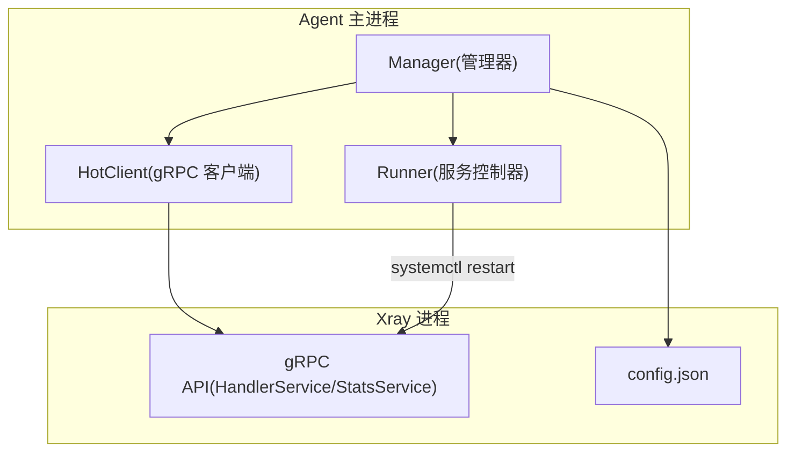
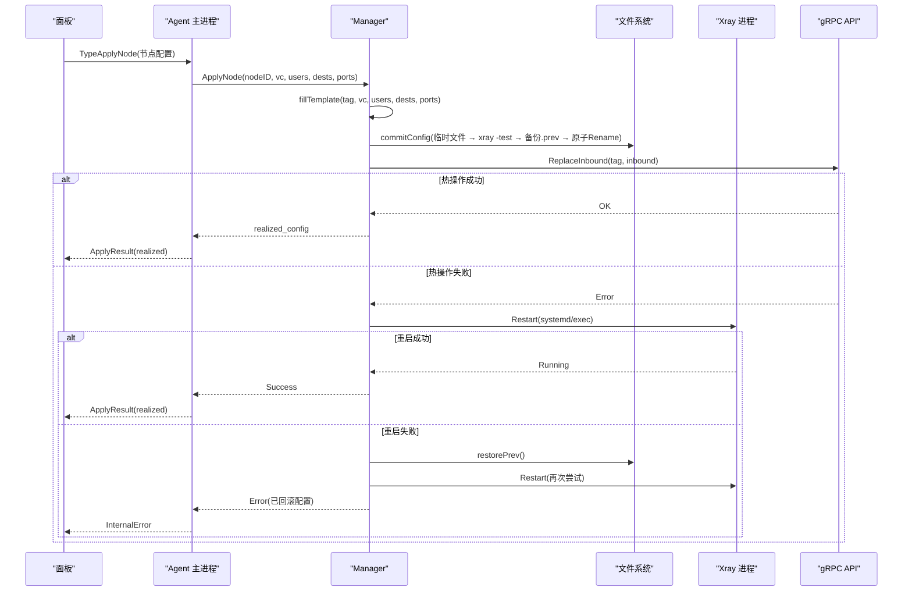
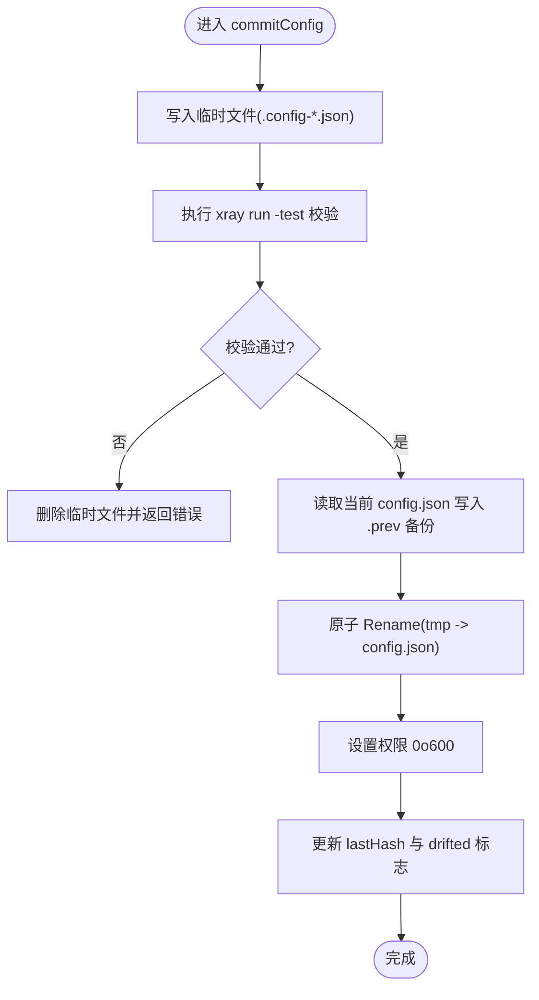
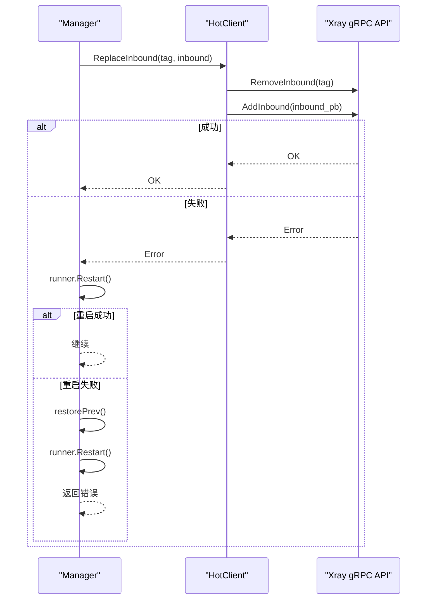
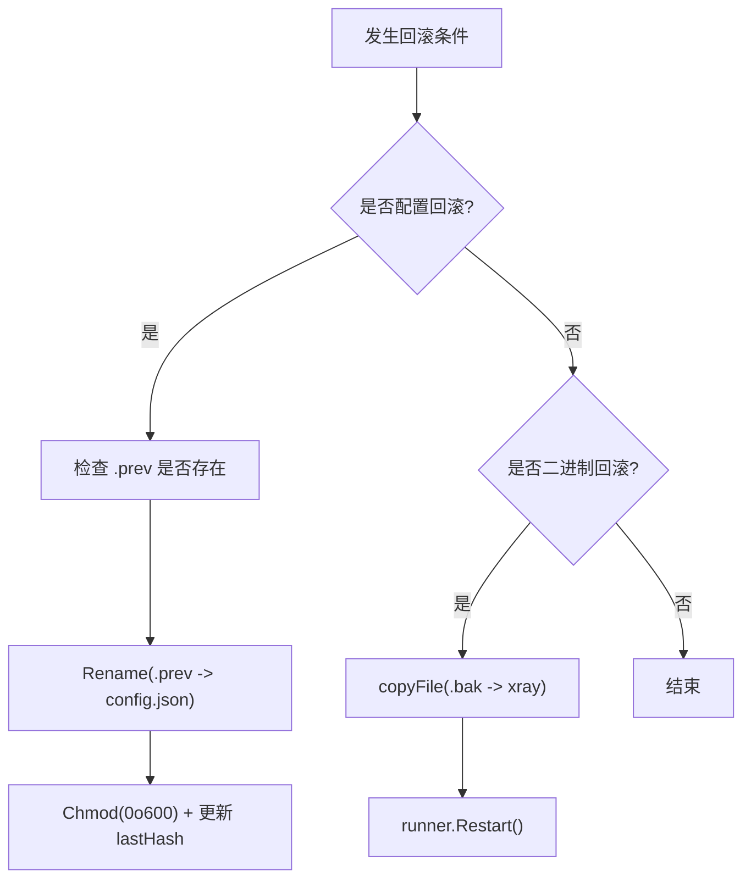
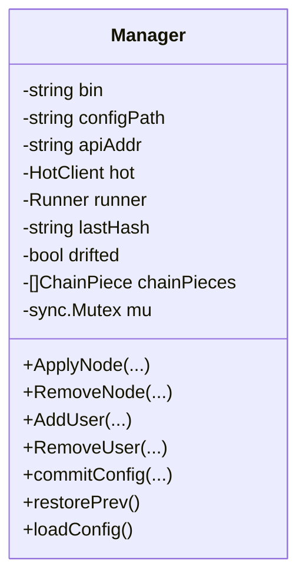
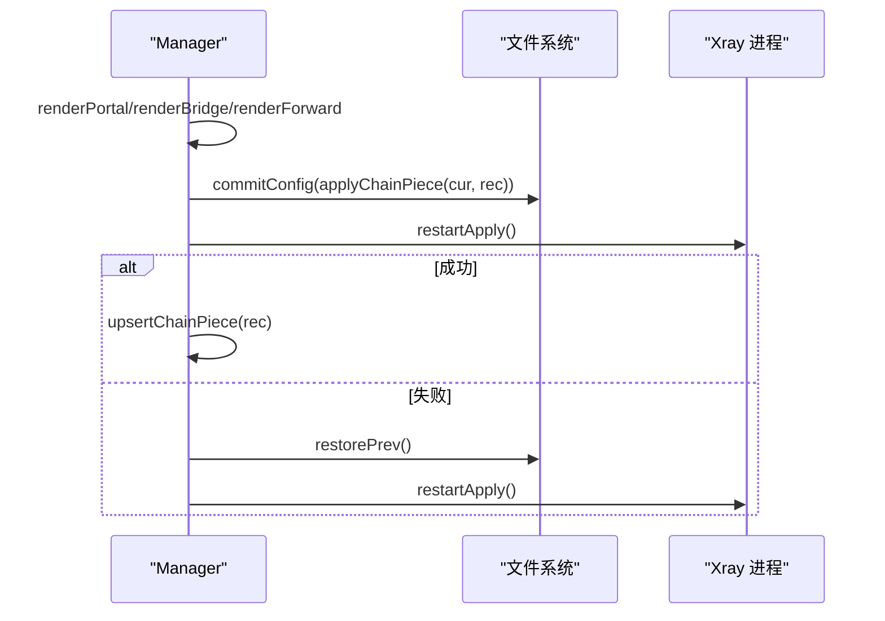
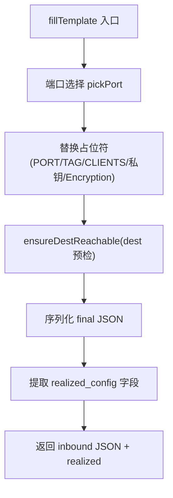
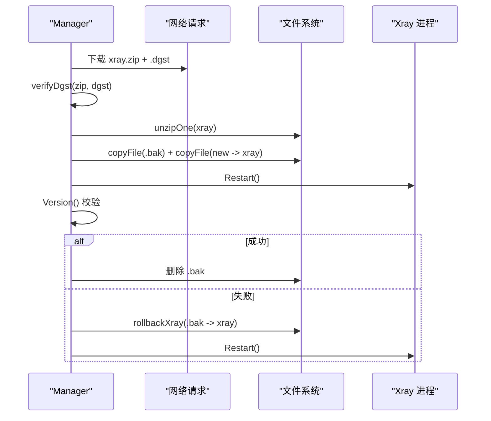
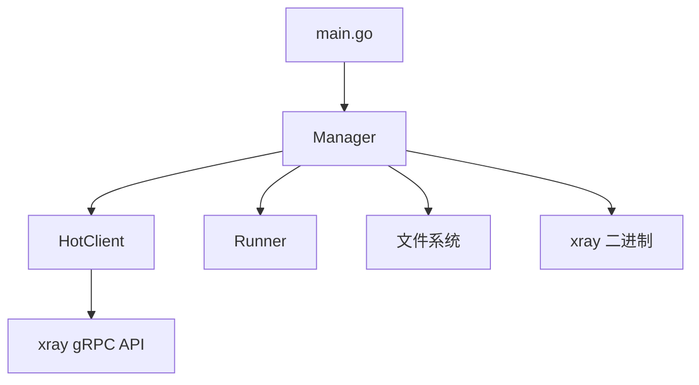

# 原子更新策略

<cite>
**本文引用的文件**   
- [manager.go](file://src/agent/internal/xray/manager.go)
- [hot.go](file://src/agent/internal/xray/hot.go)
- [runner.go](file://src/agent/internal/xray/runner.go)
- [config.go](file://src/agent/internal/xray/config.go)
- [fill.go](file://src/agent/internal/xray/fill.go)
- [chain.go](file://src/agent/internal/xray/chain.go)
- [upgrade.go](file://src/agent/internal/xray/upgrade.go)
- [main.go](file://src/agent/cmd/agent/main.go)
</cite>

## 目录
1. [简介](#简介)
2. [项目结构](#项目结构)
3. [核心组件](#核心组件)
4. [架构总览](#架构总览)
5. [详细组件分析](#详细组件分析)
6. [依赖关系分析](#依赖关系分析)
7. [性能考量](#性能考量)
8. [故障排查指南](#故障排查指南)
9. [结论](#结论)
10. [附录](#附录)

## 简介
本技术文档围绕 Lattix-codex Agent 中 Xray 配置的“原子更新策略”展开，系统性阐述以下主题：
- 原子更新的实现原理：临时文件写入、预验证机制、原子替换操作
- 热重载流程：配置变更检测、进程信号发送（systemd）、状态同步机制
- 回滚策略：版本管理、快照保存、失败恢复
- 并发控制：锁机制、事务化落盘、冲突解决
- 监控与日志：变更追踪、遥测指标、错误诊断
- 故障排查与手动干预：常见失败场景、恢复步骤
- 性能优化与最佳实践：大规模配置更新的高效运维建议

该策略确保在节点增删、用户热加/热删、链跳 piece 应用、Xray 升级等场景中，配置始终处于一致、可回滚、可观测的状态。

## 项目结构
Agent 的 Xray 管理模块位于 src/agent/internal/xray，核心职责包括：
- 配置模板填充与校验
- 原子落盘与回滚
- gRPC 热操作（AddInbound/AlterInbound/RemoveInbound）
- 服务重启兜底（systemd/exec）
- 遥测与漂移检测
- 链跳 piece 渲染与合并
- Xray 二进制升级与回滚



图表来源
- [manager.go:24-55](file://src/agent/internal/xray/manager.go#L24-L55)
- [hot.go:27-54](file://src/agent/internal/xray/hot.go#L27-L54)
- [runner.go:35-53](file://src/agent/internal/xray/runner.go#L35-L53)

章节来源
- [manager.go:1-55](file://src/agent/internal/xray/manager.go#L1-L55)
- [main.go:50-60](file://src/agent/cmd/agent/main.go#L50-L60)

## 核心组件
- Manager：编排配置生命周期（填充→校验→落盘→热操作→重启→回滚），维护 lastHash/drifted/chainPieces 等状态，串行化所有写路径。
- HotClient：通过 xray gRPC API 执行零重启的用户/入站热操作，并拉取 StatsService 计数器。
- Runner：抽象服务控制（systemd 或 exec），负责重启、停止、运行态探测与实例 ID 生成。
- Config 工具集：fullConfig 表示 config.json 浅层结构，提供 inbounds/outbounds/reverse/routing 的增删改方法。
- Fill：模板占位符填充、dest 可达性预检、端口选择、x25519/vlessenc 调用。
- Chain：链跳 piece（portal/bridge/forward）渲染与合并，统一走“落盘→校验→重启→回滚”流水线。
- Upgrade：Xray 二进制下载、dgst 校验、原子替换、重启与版本校验、失败回滚。

章节来源
- [manager.go:24-142](file://src/agent/internal/xray/manager.go#L24-L142)
- [hot.go:27-148](file://src/agent/internal/xray/hot.go#L27-L148)
- [runner.go:16-159](file://src/agent/internal/xray/runner.go#L16-L159)
- [config.go:10-202](file://src/agent/internal/xray/config.go#L10-L202)
- [fill.go:20-142](file://src/agent/internal/xray/fill.go#L20-L142)
- [chain.go:25-144](file://src/agent/internal/xray/chain.go#L25-L144)
- [upgrade.go:24-113](file://src/agent/internal/xray/upgrade.go#L24-L113)

## 架构总览
下图展示一次“节点 ApplyNode”的完整原子更新流程，涵盖模板填充、预校验、原子落盘、热操作与回退路径。



图表来源
- [manager.go:111-142](file://src/agent/internal/xray/manager.go#L111-L142)
- [manager.go:237-287](file://src/agent/internal/xray/manager.go#L237-L287)
- [hot.go:72-90](file://src/agent/internal/xray/hot.go#L72-L90)
- [runner.go:41-53](file://src/agent/internal/xray/runner.go#L41-L53)

章节来源
- [manager.go:111-142](file://src/agent/internal/xray/manager.go#L111-L142)
- [manager.go:237-287](file://src/agent/internal/xray/manager.go#L237-L287)

## 详细组件分析

### 原子落盘与预验证（commitConfig）
- 临时文件写入：在 config.json 同目录下创建 .config-*.json 临时文件，写入序列化后的候选配置。
- 预验证：调用 xray run -test -config <tmp> 进行语法与逻辑校验；失败则删除临时文件并返回错误。
- 备份与原子替换：读取当前 config.json 写入 .prev 备份；使用 os.Rename 原子替换目标文件，设置权限 0o600。
- 漂移基线更新：计算新配置哈希作为 lastHash，重置 drifted 标志。



图表来源
- [manager.go:237-287](file://src/agent/internal/xray/manager.go#L237-L287)

章节来源
- [manager.go:237-287](file://src/agent/internal/xray/manager.go#L237-L287)

### 热重载流程（ReplaceInbound / AlterInbound）
- ReplaceInbound：先 RemoveInbound（同 tag 旧入站，不存在属预期），再 AddInbound（将 inbound JSON 转为 protobuf）。
- AlterInbound：对 vless/vmess/trojan 支持 AddUserOperation/RemoveUserOperation，按 email/user 匹配键幂等操作。
- 失败回退：若热操作失败，触发 runner.Restart；若重启失败，恢复 .prev 配置并再次重启，最终返回错误。



图表来源
- [hot.go:72-100](file://src/agent/internal/xray/hot.go#L72-L100)
- [hot.go:102-135](file://src/agent/internal/xray/hot.go#L102-L135)
- [manager.go:131-140](file://src/agent/internal/xray/manager.go#L131-L140)

章节来源
- [hot.go:72-135](file://src/agent/internal/xray/hot.go#L72-L135)
- [manager.go:131-140](file://src/agent/internal/xray/manager.go#L131-L140)

### 回滚策略（restorePrev / 版本管理）
- 配置回滚：.prev 文件存在时，通过 Rename 恢复为 config.json，并重新设置权限与 lastHash。
- 二进制回滚：升级失败时从 .bak 恢复旧二进制，并尝试重启。
- 漂移修复：首次 loadConfig 以骨架+受管节点 inbound+链 piece 重建，丢弃外部改动其他内容。



图表来源
- [manager.go:319-334](file://src/agent/internal/xray/manager.go#L319-L334)
- [upgrade.go:115-124](file://src/agent/internal/xray/upgrade.go#L115-L124)

章节来源
- [manager.go:319-334](file://src/agent/internal/xray/manager.go#L319-L334)
- [upgrade.go:115-124](file://src/agent/internal/xray/upgrade.go#L115-L124)

### 并发控制（互斥锁与事务化落盘）
- Manager.mu 串行化一切配置变更，避免并发写坏 config.json。
- 所有写路径（ApplyNode/RemoveNode/AddUser/RemoveUser/EnsureTelemetryFeatures/ChainHop）均持锁。
- 落盘过程具备“事务性”语义：临时文件→校验→备份→原子替换，任一阶段失败不污染目标文件。



图表来源
- [manager.go:24-40](file://src/agent/internal/xray/manager.go#L24-L40)

章节来源
- [manager.go:24-40](file://src/agent/internal/xray/manager.go#L24-L40)

### 配置漂移检测与修复（ConfigDrift）
- 基于 lastHash 比对当前文件哈希；首次调用以当前文件为基线。
- 文件被删除视为漂移；drifted=true 时 loadConfig 以骨架+受管节点 inbound+链 piece 重建，丢弃外部改动。
- 主进程周期性上报 DriftReport 事件给面板。

```mermaid
flowchart TD
S["开始 ConfigDrift"] --> Read["读取 config.json"]
Read --> Exists{"文件存在?"}
Exists --> |否| MarkDrift["设置 drifted = (lastHash != "")"]
Exists --> |是| Hash["计算哈希 h"]
Hash --> First{"lastHash 为空?"}
First --> |是| SetBase["lastHash = h; 返回 false"]
First --> |否| Compare{"h == lastHash?"}
Compare --> |是| NoDrift["drifted=false; 返回 false"]
Compare --> |否| SetDrift["drifted=true; 返回 true"]
```

图表来源
- [manager.go:289-317](file://src/agent/internal/xray/manager.go#L289-L317)
- [manager.go:338-375](file://src/agent/internal/xray/manager.go#L338-L375)
- [main.go:316-358](file://src/agent/cmd/agent/main.go#L316-L358)

章节来源
- [manager.go:289-317](file://src/agent/internal/xray/manager.go#L289-L317)
- [manager.go:338-375](file://src/agent/internal/xray/manager.go#L338-L375)
- [main.go:316-358](file://src/agent/cmd/agent/main.go#L316-L358)

### 链跳 piece 原子更新（ApplyChainHop/RemoveChainHop）
- 渲染 portal/bridge/forward 配置件，合并进 fullConfig（inbounds/outbounds/reverse/routing）。
- 落盘后统一走 restartApply（失败回滚 .prev 并再次重启）。
- 记录 chainPieces 到 state，用于重启重建 config.json。



图表来源
- [chain.go:82-144](file://src/agent/internal/xray/chain.go#L82-L144)
- [chain.go:632-664](file://src/agent/internal/xray/chain.go#L632-L664)

章节来源
- [chain.go:82-144](file://src/agent/internal/xray/chain.go#L82-L144)
- [chain.go:632-664](file://src/agent/internal/xray/chain.go#L632-L664)

### 模板填充与预检（fillTemplate）
- 占位符替换：PORT/TAG/CLIENTS/Reality 私钥/VLESS Encryption。
- dest 预检：realitySettings.dest TCP+TLS1.3 可达性探测，不可达则按白名单候选逐个尝试并改写 serverNames。
- 提取 realized_config：port/publicKey/shortId/serverName/network/serviceName/path/mode/host/method/psk/encryption。



图表来源
- [fill.go:20-142](file://src/agent/internal/xray/fill.go#L20-L142)
- [fill.go:170-237](file://src/agent/internal/xray/fill.go#L170-L237)

章节来源
- [fill.go:20-142](file://src/agent/internal/xray/fill.go#L20-L142)
- [fill.go:170-237](file://src/agent/internal/xray/fill.go#L170-L237)

### Xray 升级与回滚（UpgradeXray）
- 解析 latest（镜像基址跳过 GitHub API）→ 下载 zip 与 .dgst → 校验 SHA2-256 → 解压二进制。
- 备份旧二进制 .bak → 原子替换 → 重启 → 版本校验；失败则回滚 .bak 并重启。



图表来源
- [upgrade.go:24-113](file://src/agent/internal/xray/upgrade.go#L24-L113)
- [upgrade.go:148-178](file://src/agent/internal/xray/upgrade.go#L148-L178)

章节来源
- [upgrade.go:24-113](file://src/agent/internal/xray/upgrade.go#L24-L113)
- [upgrade.go:148-178](file://src/agent/internal/xray/upgrade.go#L148-L178)

## 依赖关系分析
- Manager 依赖 HotClient（gRPC 热操作）、Runner（服务控制）、文件系统（config.json/.prev/.broken/.rebind-backup）、xray 二进制（run -test/x25519/vlessenc/version）。
- HotClient 依赖 xray gRPC API（HandlerService/StatsService）。
- Runner 依赖系统命令（systemctl/pkill/pgrep）或子进程管理。
- main.go 初始化 Manager，注入 releaseBase、chainPieces，启动遥测与漂移检测协程。



图表来源
- [main.go:50-60](file://src/agent/cmd/agent/main.go#L50-L60)
- [manager.go:24-55](file://src/agent/internal/xray/manager.go#L24-L55)
- [hot.go:27-54](file://src/agent/internal/xray/hot.go#L27-L54)
- [runner.go:35-53](file://src/agent/internal/xray/runner.go#L35-L53)

章节来源
- [main.go:50-60](file://src/agent/cmd/agent/main.go#L50-L60)
- [manager.go:24-55](file://src/agent/internal/xray/manager.go#L24-L55)

## 性能考量
- 热操作优先：尽量使用 gRPC 热操作（AddInbound/AlterInbound/RemoveInbound）避免重启开销。
- 批量用户操作：mutateClients 仅处理 params 列出的 tag，减少不必要的全量重算。
- 端口选择优化：受限直连 NAT 机使用 portCandidates 段内挑选，降低随机端口分配成本。
- 遥测采样间隔：Telemetry.IntervalSeconds 与 DriftDetection.IntervalSeconds 可调，平衡开销与实时性。
- 大配置合并：chain piece 合并采用增量 append/remove，避免全量重建。

[本节为通用指导，无需特定文件引用]

## 故障排查指南
- 配置校验失败：查看 xray run -test 输出，定位 JSON 语法或逻辑错误；检查模板占位符替换是否正确。
- 热操作失败：确认 gRPC API 可达（api.listen 端口），检查 inbound tag 是否存在；必要时降级重启。
- 重启失败：检查 systemd 单元状态（systemctl status xray），查看进程日志；确认配置文件权限 0o600。
- 漂移检测告警：对比 lastHash 与实际文件哈希，确认是否有外部修改；必要时清理 .broken/.prev。
- 升级失败：检查 .dgst 校验结果、网络连接、磁盘空间；确认 .bak 回滚是否成功。
- 手动干预步骤：
  - 恢复配置：手动将 .prev 重命名为 config.json，设置权限 0o600，重启 xray。
  - 清理损坏：将 .broken 文件移出，重建骨架配置。
  - 回滚二进制：从 .bak 恢复 xray 二进制，重启服务。

章节来源
- [manager.go:237-287](file://src/agent/internal/xray/manager.go#L237-L287)
- [manager.go:319-334](file://src/agent/internal/xray/manager.go#L319-L334)
- [upgrade.go:115-124](file://src/agent/internal/xray/upgrade.go#L115-L124)
- [main.go:316-358](file://src/agent/cmd/agent/main.go#L316-L358)

## 结论
Lattix-codex Agent 的 Xray 原子更新策略通过“临时文件写入→预验证→原子替换→热操作→回滚”的闭环设计，确保了配置更新的高可靠性与安全性。结合漂移检测、遥测监控与完善的故障排查指南，运维人员可在大规模环境中高效管理配置更新，最小化停机风险与人为失误。

[本节为总结性内容，无需特定文件引用]

## 附录
- 关键术语：
  - 原子替换：os.Rename 在同一文件系统上的原子性保证
  - 热操作：不重启进程的 gRPC API 调用
  - 漂移检测：基于哈希的配置变更感知
  - 链跳 piece：反向链路中的 portal/bridge/forward 配置片段
- 相关设计文档：
  - §6 热操作主路径
  - §7 原样写入与 realized_config
  - §13 遥测与流量统计
  - §17 配置漂移 reconcile
  - §18 版本升级管理
  - §21.1 链跳配置件

[本节为补充信息，无需特定文件引用]