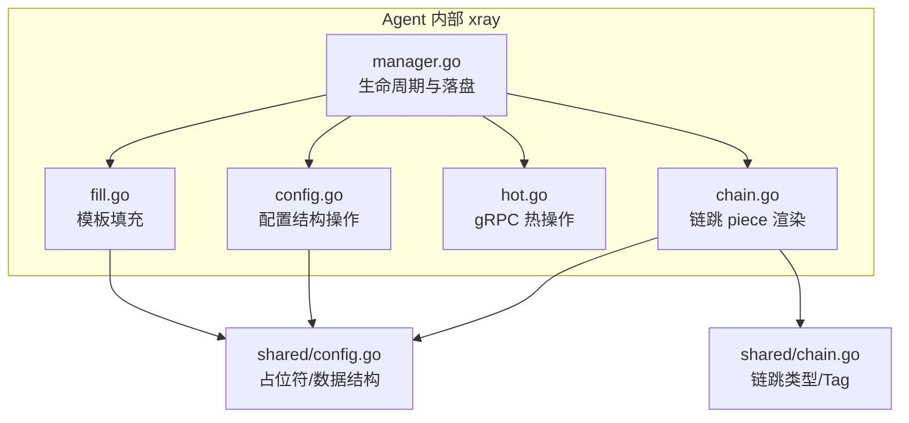
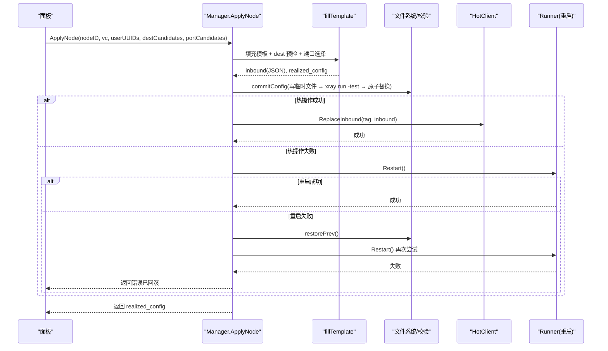
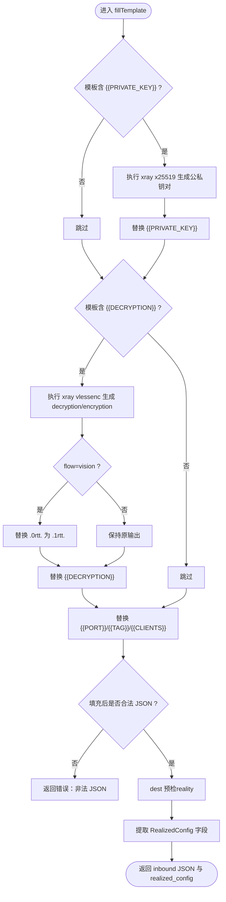
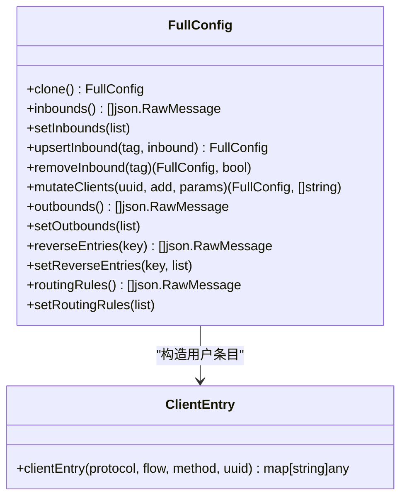
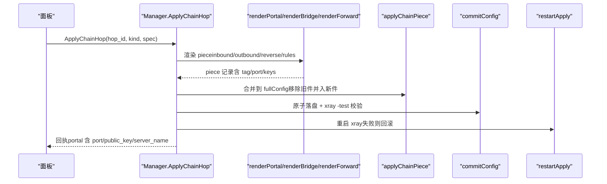
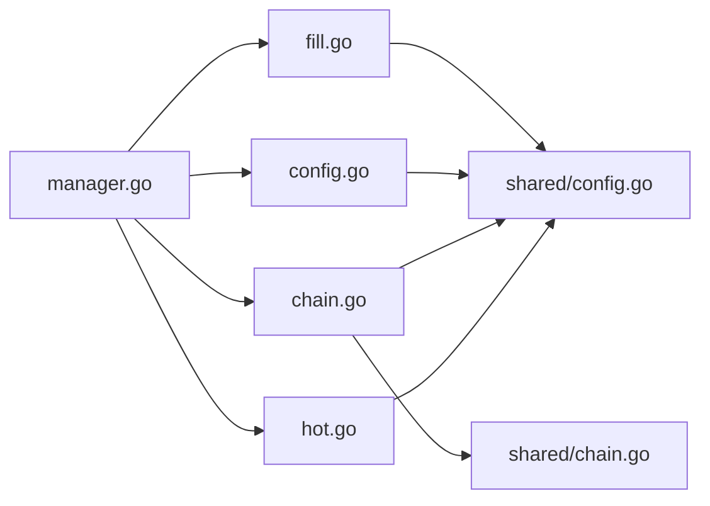

# 模板填充与生成

<cite>
**本文引用的文件**   
- [fill.go](file://src/agent/internal/xray/fill.go)
- [config.go](file://src/agent/internal/xray/config.go)
- [chain.go](file://src/agent/internal/xray/chain.go)
- [manager.go](file://src/agent/internal/xray/manager.go)
- [hot.go](file://src/agent/internal/xray/hot.go)
- [config.go](file://src/shared/config.go)
- [chain.go](file://src/shared/chain.go)
</cite>

## 目录
1. [简介](#简介)
2. [项目结构](#项目结构)
3. [核心组件](#核心组件)
4. [架构总览](#架构总览)
5. [详细组件分析](#详细组件分析)
6. [依赖关系分析](#依赖关系分析)
7. [性能考量](#性能考量)
8. [故障排查指南](#故障排查指南)
9. [结论](#结论)
10. [附录：模板示例与对照](#附录模板示例与对照)

## 简介
本技术文档聚焦 Lattix-codex Agent 中 Xray 配置文件的“模板填充与生成”能力，覆盖以下关键主题：
- JSON 模板格式与占位符语法（端口、用户列表、Reality 私钥、VLESS Encryption、Tag）
- 模板填充算法（变量替换规则、类型转换、默认值处理、条件填充）
- 动态参数注入机制（运行时参数获取、环境变量读取、配置合并策略）
- 链式代理配置的生成逻辑（中转节点编排、路由规则构建、负载均衡配置）
- 错误处理与调试方法，确保模板填充的可靠性与可维护性

该能力由 Agent 侧 xray 管理模块实现，遵循“模板填充 → 预检校验 → 原子落盘 → 热操作/重启生效 → 失败回滚”的流水线。

## 项目结构
围绕模板填充与生成的核心代码位于 agent 内部 xray 包与 shared 公共定义中：
- fill.go：模板填充主流程、占位符替换、dest 可达性预检、端口选择、密钥与加密对生成
- config.go：fullConfig 抽象、inbounds/outbounds/reverse/routing 的增删改查、用户列表变更
- chain.go：链跳 piece 渲染（portal/bridge/forward）、reverse 与 routing 规则拼装、幂等应用与移除
- manager.go：ApplyNode/RemoveNode 等入口、配置加载与骨架重建、commitConfig 原子落盘与校验、热操作与重启回滚
- hot.go：xray gRPC 热操作客户端（AddInbound/AlterInbound/RemoveInbound、StatsService）
- shared/config.go：协议常量、传输方式、Fingerprint、VLESS Encryption、占位符常量、VirtualConfig/RealizedConfig 数据结构
- shared/chain.go：链跳 piece 类型与 tag 命名约定

图表来源
- [manager.go:106-139](file://src/agent/internal/xray/manager.go#L106-L139)
- [fill.go:20-142](file://src/agent/internal/xray/fill.go#L20-L142)
- [config.go:10-202](file://src/agent/internal/xray/config.go#L10-L202)
- [chain.go:82-119](file://src/agent/internal/xray/chain.go#L82-L119)
- [hot.go:72-100](file://src/agent/internal/xray/hot.go#L72-L100)
- [config.go:149-186](file://src/shared/config.go#L149-L186)
- [chain.go:5-24](file://src/shared/chain.go#L5-L24)

章节来源
- [manager.go:106-139](file://src/agent/internal/xray/manager.go#L106-L139)
- [config.go:10-202](file://src/agent/internal/xray/config.go#L10-L202)
- [chain.go:82-119](file://src/agent/internal/xray/chain.go#L82-L119)
- [hot.go:72-100](file://src/agent/internal/xray/hot.go#L72-L100)
- [config.go:149-186](file://src/shared/config.go#L149-L186)
- [chain.go:5-24](file://src/shared/chain.go#L5-L24)

## 核心组件
- 模板填充器（fillTemplate）：将 VirtualConfig.Template 中的占位符替换为实际值，执行 dest 预检，提取 RealizedConfig 上报字段
- 配置管理器（Manager）：负责 ApplyNode/RemoveNode、配置加载、骨架重建、commitConfig 原子落盘、热操作与重启回滚
- 配置结构操作（fullConfig）：对 inbounds/outbounds/reverse/routing 进行增删改查，支持用户列表增量修改
- 链跳渲染器（renderPortal/renderBridge/renderForward）：按 hop 类型生成 inbound/outbound/reverse/rule 片段，并写入配置
- 热操作客户端（HotClient）：通过 xray gRPC API 零重启地添加/删除 inbound 和用户

章节来源
- [fill.go:20-142](file://src/agent/internal/xray/fill.go#L20-L142)
- [manager.go:106-139](file://src/agent/internal/xray/manager.go#L106-L139)
- [config.go:10-202](file://src/agent/internal/xray/config.go#L10-L202)
- [chain.go:156-349](file://src/agent/internal/xray/chain.go#L156-L349)
- [hot.go:72-100](file://src/agent/internal/xray/hot.go#L72-L100)

## 架构总览
模板填充与生成的整体流程如下：
- 面板下发 VirtualConfig（含 Template 与协议参数）
- Agent 调用 fillTemplate 完成占位符替换、dest 预检、端口选择、密钥与加密对生成
- Manager 组装候选配置，commitConfig 原子落盘并通过 xray -test 校验
- 优先走 gRPC 热操作；失败则重启 xray；若重启失败则恢复上一份配置并重试
- 链跳场景下，按 portal/bridge/forward 分别渲染 piece，合并进配置并重启生效

图表来源
- [manager.go:106-139](file://src/agent/internal/xray/manager.go#L106-L139)
- [fill.go:20-142](file://src/agent/internal/xray/fill.go#L20-L142)
- [manager.go:232-273](file://src/agent/internal/xray/manager.go#L232-L273)
- [hot.go:72-100](file://src/agent/internal/xray/hot.go#L72-L100)

## 详细组件分析

### 模板填充算法（fillTemplate）
- 占位符替换
  - PORT：支持带引号与不带引号的两种写法，统一替换为整型端口字符串
  - TAG：替换为 NodeTag(nodeID)
  - CLIENTS：根据协议构造用户条目数组（vless/vmess/trojan/ss/socks/http），dokodemo 不含此占位符
  - PRIVATE_KEY：仅 reality 协议模板包含，调用 xray x25519 生成私钥/公钥对，私钥不出服务器
  - DECRYPTION：仅当模板包含 VLESS Encryption 占位符时执行 xray vlessenc，生成 decryption/encryption 对；flow 为 vision 时需强制 1-RTT 模式
- 类型转换与默认值
  - 端口：preferred=0 时从 portCandidates 挑选空闲端口；若无候选则随机分配
  - Fingerprint：未指定时使用 chrome
  - SS 2022-blake3 多用户密码：基于 UUID 确定性派生
- 条件填充
  - 仅当模板包含特定占位符时才执行对应逻辑（如 PRIVATE_KEY、DECRYPTION、CLIENTS）
- Dest 预检
  - 对 realitySettings.dest 进行 TCP+TLS1.3 握手探测；不可达时按白名单逐个尝试并改写 dest/serverNames
- 结果提取
  - 解析最终 JSON 提取 port、reality serverName/shortId、grpc serviceName、xhttp path/mode/host、ss PSK、vless encryption 等字段，形成 RealizedConfig

图表来源
- [fill.go:20-142](file://src/agent/internal/xray/fill.go#L20-L142)
- [config.go:149-186](file://src/shared/config.go#L149-L186)

章节来源
- [fill.go:20-142](file://src/agent/internal/xray/fill.go#L20-L142)
- [config.go:149-186](file://src/shared/config.go#L149-L186)

### 配置结构与用户列表操作（fullConfig）
- fullConfig 抽象：顶层键保留原始 JSON，inbounds/outbounds/reverse/routing 以 json.RawMessage 形式操作，避免序列化失真
- Inbound 增删改
  - upsertInbound：移除同 tag 后追加新 inbound
  - removeInbound：移除指定 tag 的 inbound
- 用户列表变更
  - mutateClients：针对 node_ 前缀的 inbound，按协议构造 clients/accounts 条目，支持增量扇出（仅处理 params 列出的 tag）
  - mutateInboundUsers：按 email/user 匹配键增删用户，幂等
  - clientEntry：按协议生成用户条目（vless/vmess/trojan/ss/socks/http），2022-blake3 使用定长 base64 密钥

图表来源
- [config.go:10-202](file://src/agent/internal/xray/config.go#L10-L202)

章节来源
- [config.go:10-202](file://src/agent/internal/xray/config.go#L10-L202)

### 链式代理配置生成（chain.go）
- 三种角色
  - Portal（上游机）：VLESS+Reality interconn inbound + reverse portal + routing（interconn → portal）
  - Bridge（下游机）：reverse bridge + VLESS+Reality interconn outbound + routing（tunnel_domain → interconn；bridge → freedom）
  - Forward（入口/中间跳）：dokodemo-door 透传 inbound + routing（via_tunnel_domain 非空 → reverse portal；空 → direct）
- 端口与密钥
  - pickChainPort：优先复用已记录端口（重发幂等），被占用则从候选段挑选空闲端口
  - x25519：Portal 侧生成公私钥对，重发时复用旧密钥保证凭证稳定
- 路由规则
  - 依据 inboundTag/outboundTag/domain 构建 field 规则，转发到对应的 reverse portal/bridge 或 direct
- 幂等应用与移除
  - applyChainPiece：先移除同 piece 旧件再并入新件，避免重复项
  - removeChainPieceItems：按 tag 集合清理 inbound/outbounds/reverse/rules

图表来源
- [chain.go:82-119](file://src/agent/internal/xray/chain.go#L82-L119)
- [chain.go:156-349](file://src/agent/internal/xray/chain.go#L156-L349)
- [chain.go:632-664](file://src/agent/internal/xray/chain.go#L632-L664)
- [manager.go:232-273](file://src/agent/internal/xray/manager.go#L232-L273)

章节来源
- [chain.go:82-119](file://src/agent/internal/xray/chain.go#L82-L119)
- [chain.go:156-349](file://src/agent/internal/xray/chain.go#L156-L349)
- [chain.go:632-664](file://src/agent/internal/xray/chain.go#L632-L664)
- [manager.go:232-273](file://src/agent/internal/xray/manager.go#L232-L273)

### 热操作与回滚（hot.go + manager.go）
- 热操作主路径：ReplaceInbound/RemoveInbound/AddUser/RemoveUser 通过 gRPC 调用 xray HandlerService/StatsService
- 回退策略：热操作失败才重启；重启失败则恢复上一份可用配置并重试
- 漂移检测：ConfigDrift 比较哈希，首次调用以当前文件为基线；外部修改视为漂移，loadConfig 以骨架+受管节点 inbound+链 piece 净化重建

章节来源
- [hot.go:72-100](file://src/agent/internal/xray/hot.go#L72-L100)
- [manager.go:232-273](file://src/agent/internal/xray/manager.go#L232-L273)
- [manager.go:275-316](file://src/agent/internal/xray/manager.go#L275-L316)

## 依赖关系分析
- 模板填充依赖 shared 定义的占位符常量与协议枚举
- 配置操作依赖 json.RawMessage 以保持字节级一致性
- 链跳渲染依赖 shared 的 HopKind 与 Tag 命名约定
- 热操作依赖 xray-core 的 gRPC API（HandlerService/StatsService）

图表来源
- [fill.go:20-142](file://src/agent/internal/xray/fill.go#L20-L142)
- [config.go:10-202](file://src/agent/internal/xray/config.go#L10-L202)
- [chain.go:82-119](file://src/agent/internal/xray/chain.go#L82-L119)
- [manager.go:106-139](file://src/agent/internal/xray/manager.go#L106-L139)
- [hot.go:72-100](file://src/agent/internal/xray/hot.go#L72-L100)
- [config.go:149-186](file://src/shared/config.go#L149-L186)
- [chain.go:5-24](file://src/shared/chain.go#L5-L24)

章节来源
- [fill.go:20-142](file://src/agent/internal/xray/fill.go#L20-L142)
- [config.go:10-202](file://src/agent/internal/xray/config.go#L10-L202)
- [chain.go:82-119](file://src/agent/internal/xray/chain.go#L82-L119)
- [manager.go:106-139](file://src/agent/internal/xray/manager.go#L106-L139)
- [hot.go:72-100](file://src/agent/internal/xray/hot.go#L72-L100)
- [config.go:149-186](file://src/shared/config.go#L149-L186)
- [chain.go:5-24](file://src/shared/chain.go#L5-L24)

## 性能考量
- 模板填充阶段避免不必要的子进程调用：仅在模板包含相应占位符时才执行 xray x25519/vlessenc
- dest 预检采用短超时（4 秒）与 TLS1.3 握手，快速失败
- 端口选择优先复用已分配端口，减少冲突与重试
- 热操作为主路径，避免频繁重启；失败才回退重启
- 配置落盘采用原子替换与备份，降低 I/O 风险

[本节为通用指导，不直接分析具体文件]

## 故障排查指南
- 模板填充失败
  - 检查模板是否为合法 JSON（填充后）
  - 确认占位符名称与大小写一致（{{PORT}}/{{CLIENTS}}/{{PRIVATE_KEY}}/{{DECRYPTION}}/{{TAG}}）
  - 若 flow=vision，需确保 vlessenc 输出包含 .1rtt. 标记
- Dest 不可达
  - 检查 realitySettings.dest 与 serverNames 是否正确
  - 提供可用的 destCandidates 白名单供 fallback
- 端口冲突
  - preferred 端口被占用时报错；portCandidates 全占用时报错；无候选时随机分配
- 热操作失败
  - 查看 gRPC 调用日志；确认 xray API 地址与权限
  - 失败将自动回退重启；若重启失败，检查系统服务状态与配置文件
- 配置漂移
  - 使用 ConfigDrift 检测；漂移时将按骨架+受管节点 inbound+链 piece 净化重建

章节来源
- [fill.go:20-142](file://src/agent/internal/xray/fill.go#L20-L142)
- [manager.go:232-273](file://src/agent/internal/xray/manager.go#L232-L273)
- [manager.go:275-316](file://src/agent/internal/xray/manager.go#L275-L316)

## 结论
模板填充与生成体系以“占位符驱动 + 预检校验 + 原子落盘 + 热操作/重启回滚”为核心，实现了高可靠、可扩展的 Xray 配置管理能力。通过清晰的协议与传输约束、严格的占位符替换规则、完善的错误处理与回滚机制，开发者可以安全地扩展模板系统与链式代理编排。

[本节为总结，不直接分析具体文件]

## 附录：模板示例与对照
以下为典型模板占位符与填充结果的对照说明（以路径引用代替具体代码内容）：
- 端口占位符
  - 模板写法："port": "{{PORT}}" 或 "port": {{PORT}}
  - 填充结果：整数端口（如 443、8080 或随机分配）
  - 参考路径：[fill.go:61-77](file://src/agent/internal/xray/fill.go#L61-L77)
- 用户列表占位符
  - 模板写法："clients": "{{CLIENTS}}"
  - 填充结果：按协议生成的用户条目数组（vless/vmess/trojan/ss/socks/http）
  - 参考路径：[fill.go:66-77](file://src/agent/internal/xray/fill.go#L66-L77)
- Reality 私钥占位符
  - 模板写法："privateKey": "{{PRIVATE_KEY}}"
  - 填充结果：xray x25519 生成的私钥（公钥随 realized_config 上报）
  - 参考路径：[fill.go:31-39](file://src/agent/internal/xray/fill.go#L31-L39)
- VLESS Encryption 占位符
  - 模板写法："decryption": "{{DECRYPTION}}"
  - 填充结果：xray vlessenc 生成的 decryption（客户端 encryption 字符串随 realized_config 上报）
  - 参考路径：[fill.go:42-59](file://src/agent/internal/xray/fill.go#L42-L59)
- Tag 占位符
  - 模板写法："tag": "{{TAG}}"
  - 填充结果：NodeTag(nodeID)
  - 参考路径：[fill.go:65](file://src/agent/internal/xray/fill.go#L65)

章节来源
- [fill.go:61-77](file://src/agent/internal/xray/fill.go#L61-L77)
- [fill.go:31-39](file://src/agent/internal/xray/fill.go#L31-L39)
- [fill.go:42-59](file://src/agent/internal/xray/fill.go#L42-L59)
- [fill.go:65](file://src/agent/internal/xray/fill.go#L65)