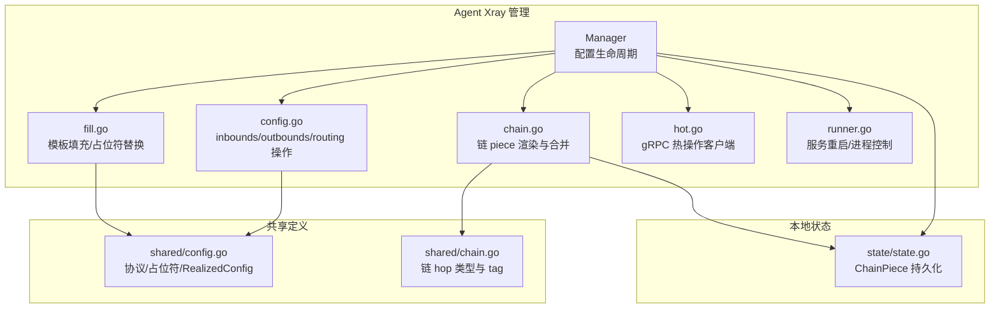
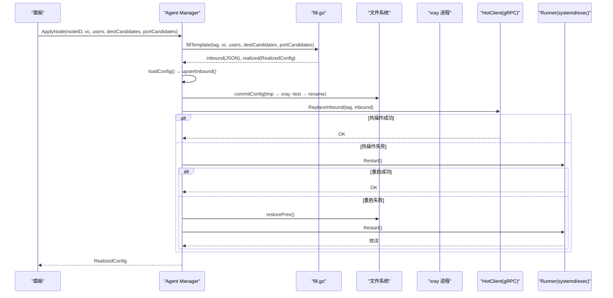
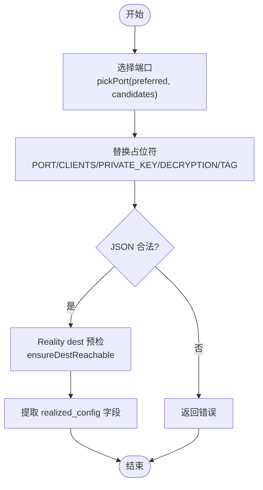
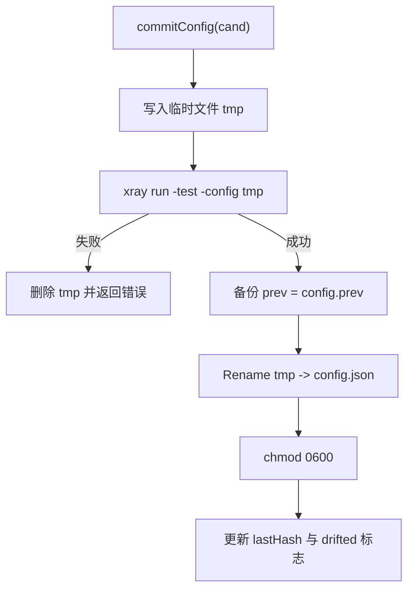
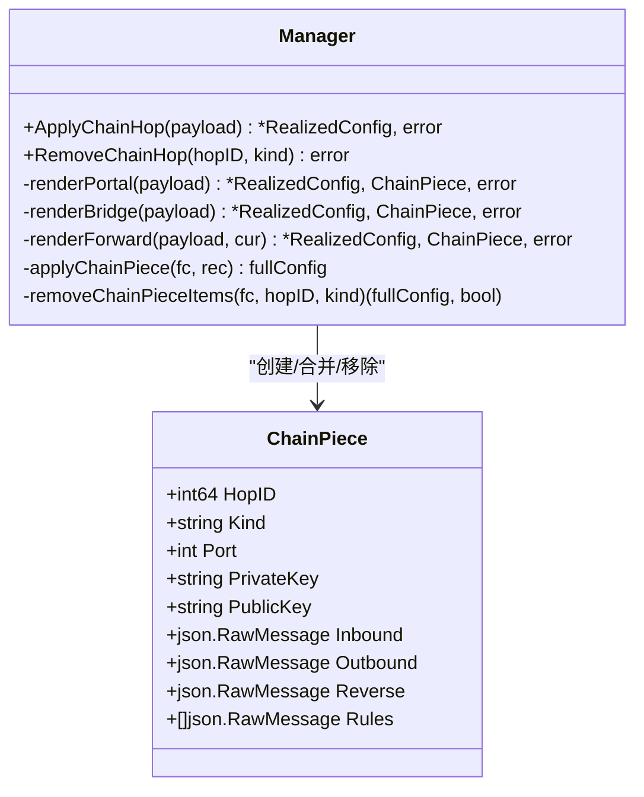
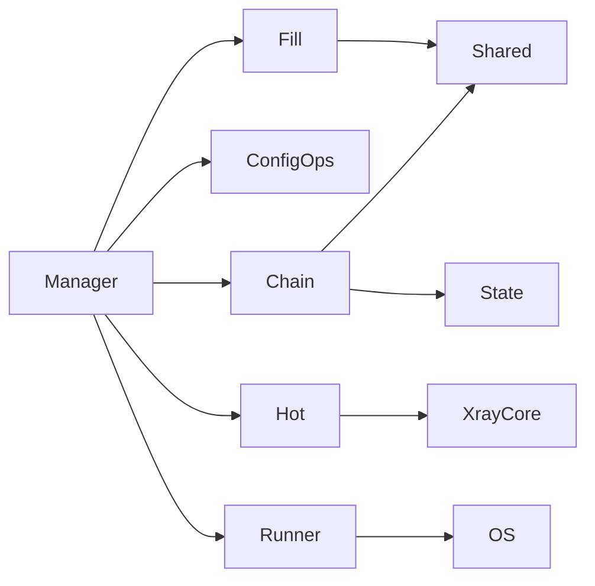

# 配置文件管理

<cite>
**本文引用的文件**   
- [src/agent/internal/xray/config.go](file://src/agent/internal/xray/config.go)
- [src/agent/internal/xray/fill.go](file://src/agent/internal/xray/fill.go)
- [src/agent/internal/xray/chain.go](file://src/agent/internal/xray/chain.go)
- [src/agent/internal/xray/manager.go](file://src/agent/internal/xray/manager.go)
- [src/agent/internal/xray/hot.go](file://src/agent/internal/xray/hot.go)
- [src/agent/internal/xray/runner.go](file://src/agent/internal/xray/runner.go)
- [src/shared/config.go](file://src/shared/config.go)
- [src/shared/chain.go](file://src/shared/chain.go)
- [src/agent/internal/state/state.go](file://src/agent/internal/state/state.go)
</cite>

## 目录
1. [简介](#简介)
2. [项目结构](#项目结构)
3. [核心组件](#核心组件)
4. [架构总览](#架构总览)
5. [详细组件分析](#详细组件分析)
6. [依赖关系分析](#依赖关系分析)
7. [性能考量](#性能考量)
8. [故障排查指南](#故障排查指南)
9. [结论](#结论)
10. [附录：配置示例与最佳实践](#附录配置示例与最佳实践)

## 简介
本技术文档聚焦 Lattix-codex Agent 中 Xray 配置文件管理能力，覆盖以下关键主题：
- 配置文件生成流程：模板填充、占位符替换、动态参数注入（端口、用户列表、Reality 私钥、VLESS Encryption）
- 配置验证机制：语法校验、依赖可达性检查、冲突检测（端口占用等）
- 原子更新策略：临时文件写入、xray -test 校验、备份与原子替换、失败回滚
- 配置漂移检测：哈希基线、变更追踪、自动修复（净化受管 inbound）
- 链式代理配置：中转节点编排、链路拓扑构建、路由规则配置（portal/bridge/forward 三角色）
- 运维建议：配置示例、常见问题定位与恢复方法

## 项目结构
Xray 配置管理位于 agent 内部 xray 包，围绕 Manager 组织，配合 fill、config、chain、hot、runner 等模块完成“模板→校验→落盘→热操作/重启→回滚”的完整流水线。共享类型与常量定义在 shared 包，状态持久化在 state 包。

图表来源
- [src/agent/internal/xray/manager.go:24-55](file://src/agent/internal/xray/manager.go#L24-L55)
- [src/agent/internal/xray/fill.go:20-142](file://src/agent/internal/xray/fill.go#L20-L142)
- [src/agent/internal/xray/config.go:10-114](file://src/agent/internal/xray/config.go#L10-L114)
- [src/agent/internal/xray/chain.go:25-119](file://src/agent/internal/xray/chain.go#L25-L119)
- [src/agent/internal/xray/hot.go:27-90](file://src/agent/internal/xray/hot.go#L27-L90)
- [src/agent/internal/xray/runner.go:16-33](file://src/agent/internal/xray/runner.go#L16-L33)
- [src/shared/config.go:149-168](file://src/shared/config.go#L149-L168)
- [src/shared/chain.go:5-24](file://src/shared/chain.go#L5-L24)
- [src/agent/internal/state/state.go:25-38](file://src/agent/internal/state/state.go#L25-L38)

章节来源
- [src/agent/internal/xray/manager.go:24-55](file://src/agent/internal/xray/manager.go#L24-L55)
- [src/shared/config.go:149-168](file://src/shared/config.go#L149-L168)

## 核心组件
- Manager：Xray 配置生命周期管理者，负责加载骨架配置、应用节点/链 piece、原子落盘、热操作与重启、漂移检测与修复。
- fill：模板填充与占位符替换，包含端口选择、Reality 私钥生成、VLESS Encryption 对生成、dest 可达性预检。
- config：对 fullConfig 的 inbounds/outbounds/reverse/routing 进行增删改查，支持用户列表增量修改。
- chain：渲染 portal/bridge/forward 三种链 piece，维护 reverse 段与 routing 规则，保证幂等合并与清理。
- hot：通过 gRPC 调用 xray HandlerService/StatsService，实现零重启的热更新与流量统计查询。
- runner：抽象 xray 进程管理，生产使用 systemd，开发使用 exec 子进程。
- shared：协议、传输、指纹、占位符、VirtualConfig/RealizedConfig 等共享模型。
- state：持久化 ChainPiece 记录，用于重启重建与重发幂等。

章节来源
- [src/agent/internal/xray/manager.go:109-142](file://src/agent/internal/xray/manager.go#L109-L142)
- [src/agent/internal/xray/fill.go:20-142](file://src/agent/internal/xray/fill.go#L20-L142)
- [src/agent/internal/xray/config.go:50-114](file://src/agent/internal/xray/config.go#L50-L114)
- [src/agent/internal/xray/chain.go:82-119](file://src/agent/internal/xray/chain.go#L82-L119)
- [src/agent/internal/xray/hot.go:27-90](file://src/agent/internal/xray/hot.go#L27-L90)
- [src/agent/internal/xray/runner.go:16-33](file://src/agent/internal/xray/runner.go#L16-L33)
- [src/shared/config.go:170-206](file://src/shared/config.go#L170-L206)
- [src/agent/internal/state/state.go:25-38](file://src/agent/internal/state/state.go#L25-L38)

## 架构总览
下图展示了从面板下发 VirtualConfig 到最终生效的端到端流程，包括模板填充、校验、落盘、热操作与回滚路径。

图表来源
- [src/agent/internal/xray/manager.go:109-142](file://src/agent/internal/xray/manager.go#L109-L142)
- [src/agent/internal/xray/fill.go:20-142](file://src/agent/internal/xray/fill.go#L20-L142)
- [src/agent/internal/xray/manager.go:235-287](file://src/agent/internal/xray/manager.go#L235-L287)
- [src/agent/internal/xray/hot.go:72-90](file://src/agent/internal/xray/hot.go#L72-L90)
- [src/agent/internal/xray/runner.go:40-53](file://src/agent/internal/xray/runner.go#L40-L53)

## 详细组件分析

### 模板填充与占位符替换（fill.go + shared/config.go）
- 支持的占位符：
  - PORT：端口占位符，若未指定则由 pickPort 自动挑选空闲端口；受限 NAT 场景可传入候选段按序尝试。
  - CLIENTS：用户列表占位符，根据协议构造 clients/accounts JSON 数组并替换。
  - PRIVATE_KEY：Reality 私钥占位符，调用 xray x25519 生成，私钥不出服务器。
  - DECRYPTION：VLESS Encryption 私钥侧占位符，调用 xray vlessenc 生成 decryption/encryption 对。
  - TAG：inbound tag 占位符，替换为 NodeTag(nodeID)。
- 填充后校验：
  - 必须为合法 JSON，否则报错。
  - Reality 模板执行 ensureDestReachable：TCP+TLS1.3 握手探测 dest 可达性，不可达则按白名单逐个尝试改写 dest/serverNames。
- 提取 realized_config：
  - 端口、public_key、short_id、server_name、flow、fingerprint、network、service_name/path/mode/host、method、psk、encryption 等字段。

图表来源
- [src/agent/internal/xray/fill.go:20-142](file://src/agent/internal/xray/fill.go#L20-L142)
- [src/shared/config.go:149-168](file://src/shared/config.go#L149-L168)

章节来源
- [src/agent/internal/xray/fill.go:20-142](file://src/agent/internal/xray/fill.go#L20-L142)
- [src/shared/config.go:149-168](file://src/shared/config.go#L149-L168)

### 配置验证与冲突检测（manager.go + fill.go）
- 语法校验：commitConfig 写临时文件后执行 xray run -test -config <tmp> 校验，失败丢弃临时文件并返回错误。
- 依赖可达性：ensureDestReachable 对 realitySettings.dest 做 TCP+TLS1.3 探测，失败时按候选白名单重试并改写。
- 端口冲突：pickPort 优先校验指定端口是否被占用；无候选时随机分配；候选全占用时报错。
- 权限与安全：config.json 权限设置为 0600，prev/broken 备份文件同样设置安全权限。

章节来源
- [src/agent/internal/xray/manager.go:235-287](file://src/agent/internal/xray/manager.go#L235-L287)
- [src/agent/internal/xray/fill.go:170-237](file://src/agent/internal/xray/fill.go#L170-L237)
- [src/agent/internal/xray/fill.go:247-276](file://src/agent/internal/xray/fill.go#L247-L276)

### 原子更新策略（manager.go）
- 临时文件写入：os.CreateTemp 生成 .config-*.json 临时文件。
- 校验测试：xray run -test 校验通过后继续。
- 备份与原子替换：读取当前配置保存为 .prev，然后 os.Rename 原子替换为目标路径。
- 失败回滚：restartApply 失败时调用 restorePrev 恢复上一份可用配置，再尝试重启一次。

图表来源
- [src/agent/internal/xray/manager.go:235-287](file://src/agent/internal/xray/manager.go#L235-L287)

章节来源
- [src/agent/internal/xray/manager.go:235-287](file://src/agent/internal/xray/manager.go#L235-L287)

### 配置漂移检测与自动修复（manager.go）
- 漂移检测：ConfigDrift 比较当前文件内容与 lastHash；首次调用以当前文件为基线；文件不存在视为漂移。
- 自动修复：loadConfig 检测到 drifted=true 时，以 skeleton + 受管节点 inbound（node_* 前缀）+ 链 piece 为基，丢弃外部改动其他内容，实现净化。
- 基线更新：restorePrev 恢复成功后重新计算 lastHash，避免误报。

章节来源
- [src/agent/internal/xray/manager.go:289-334](file://src/agent/internal/xray/manager.go#L289-L334)
- [src/agent/internal/xray/manager.go:336-375](file://src/agent/internal/xray/manager.go#L336-L375)

### 链式代理配置生成（chain.go + shared/chain.go + state/state.go）
- 三种角色：
  - portal：上游机 VLESS+Reality interconn inbound + reverse.portal + routing（interconn → portal）。
  - bridge：下游机 reverse.bridge + VLESS+Reality interconn outbound + routing（tunnel_domain → interconn；bridge → freedom）。
  - forward：入口/中间跳 dokodemo-door 透传 inbound + routing（via_tunnel_domain 非空则走 reverse portal，否则直连下一跳）。
- 渲染与合并：
  - applyChainPiece 先移除同 hop_id+kind 旧件，再并入新件，保证幂等。
  - removeChainPieceItems 精确移除 inbound/outbound/reverse/routing 引用项，保留骨架段。
- 端口与密钥：
  - pickChainPort 复用已记录端口（重发幂等），否则从候选段挑选空闲端口。
  - portal 的 privateKey/publicKey 由 x25519 生成或复用历史值。
- 持久化：
  - ChainPiece 记录入 state，重启时重建 config.json，与节点 inbound 同等地位。

图表来源
- [src/agent/internal/state/state.go:25-38](file://src/agent/internal/state/state.go#L25-L38)
- [src/agent/internal/xray/chain.go:82-119](file://src/agent/internal/xray/chain.go#L82-L119)
- [src/agent/internal/xray/chain.go:632-664](file://src/agent/internal/xray/chain.go#L632-L664)

章节来源
- [src/agent/internal/xray/chain.go:82-119](file://src/agent/internal/xray/chain.go#L82-L119)
- [src/agent/internal/xray/chain.go:156-218](file://src/agent/internal/xray/chain.go#L156-L218)
- [src/agent/internal/xray/chain.go:241-286](file://src/agent/internal/xray/chain.go#L241-L286)
- [src/agent/internal/xray/chain.go:310-349](file://src/agent/internal/xray/chain.go#L310-L349)
- [src/shared/chain.go:5-24](file://src/shared/chain.go#L5-L24)
- [src/agent/internal/state/state.go:25-38](file://src/agent/internal/state/state.go#L25-L38)

### 热操作与用户管理（hot.go + config.go）
- 热操作主路径：ReplaceInbound（先 RemoveInbound 再 AddInbound）、RemoveInbound、AddUser/RemoveUser（AlterInbound）。
- 用户列表修改：mutateClients 仅处理 params 列出的 tag，未列出不受影响；mutateInboundUsers 针对 clients/accounts 增删条目，按 email/user 匹配键幂等。
- 协议限制：仅 vless/vmess/trojan 支持热操作用户；其他协议回退重启。

章节来源
- [src/agent/internal/xray/hot.go:72-148](file://src/agent/internal/xray/hot.go#L72-L148)
- [src/agent/internal/xray/config.go:83-114](file://src/agent/internal/xray/config.go#L83-L114)
- [src/agent/internal/xray/config.go:116-202](file://src/agent/internal/xray/config.go#L116-L202)

### 服务重启与实例识别（runner.go）
- SystemdRunner：systemctl restart/is-active/stop，InstanceID 基于 MainPID 解析 /proc/<pid>/stat。
- ExecRunner：直接拉起 xray 子进程，输出并入 agent 日志，启动后短暂观察避免“启动即崩”。

章节来源
- [src/agent/internal/xray/runner.go:35-65](file://src/agent/internal/xray/runner.go#L35-L65)
- [src/agent/internal/xray/runner.go:67-114](file://src/agent/internal/xray/runner.go#L67-L114)

## 依赖关系分析
- Manager 依赖 fill（模板填充）、config（配置操作）、chain（链 piece）、hot（gRPC 热操作）、runner（进程管理）。
- fill 依赖 shared 中的协议/占位符/RealizedConfig 定义。
- chain 依赖 shared 的链 hop 类型与 tag 生成函数，以及 state 的 ChainPiece 持久化。
- hot 依赖 xray-core 的 command/stats 客户端。
- runner 依赖系统命令（systemctl 或 exec）。

图表来源
- [src/agent/internal/xray/manager.go:24-55](file://src/agent/internal/xray/manager.go#L24-L55)
- [src/agent/internal/xray/fill.go:1-15](file://src/agent/internal/xray/fill.go#L1-L15)
- [src/agent/internal/xray/chain.go:1-14](file://src/agent/internal/xray/chain.go#L1-L14)
- [src/agent/internal/xray/hot.go:1-22](file://src/agent/internal/xray/hot.go#L1-L22)
- [src/agent/internal/xray/runner.go:1-14](file://src/agent/internal/xray/runner.go#L1-L14)

章节来源
- [src/agent/internal/xray/manager.go:24-55](file://src/agent/internal/xray/manager.go#L24-L55)

## 性能考量
- 热操作优先：ReplaceInbound/AddUser/RemoveUser 走 gRPC 热操作，避免重启带来的中断。
- 最小化序列化：fullConfig 使用 json.RawMessage 浅层表示，减少不必要的反序列化开销。
- 端口选择优化：pickPort/pickChainPort 优先复用已分配端口，减少端口抖动。
- 配置校验前置：xray -test 在落盘前执行，避免无效配置导致运行时异常。
- 并发控制：Manager 使用互斥锁串行化所有配置变更，避免并发写坏 config.json。

[本节为通用指导，不直接分析具体文件]

## 故障排查指南
- 配置校验失败：
  - 现象：commitConfig 返回“xray 配置校验失败”，临时文件被删除。
  - 排查：检查模板占位符替换结果是否为合法 JSON；确认 dest 可达性与端口未被占用。
  - 参考：[src/agent/internal/xray/manager.go:235-287](file://src/agent/internal/xray/manager.go#L235-L287)
- 热操作失败：
  - 现象：ReplaceInbound/AddUser/RemoveUser 报错，触发重启兜底。
  - 排查：确认 xray API 地址可达；协议是否支持热操作（仅 vless/vmess/trojan）；查看 gRPC 超时与错误信息。
  - 参考：[src/agent/internal/xray/hot.go:72-148](file://src/agent/internal/xray/hot.go#L72-L148)
- 重启失败：
  - 现象：Restart 失败后自动恢复 .prev 配置并再次重启。
  - 排查：检查 .prev 是否存在且权限正确；systemd 单元状态；exec 模式下子进程是否立即退出。
  - 参考：[src/agent/internal/xray/manager.go:146-154](file://src/agent/internal/xray/manager.go#L146-L154)
- 配置漂移：
  - 现象：ConfigDrift 返回 true，loadConfig 以净化配置为基重建。
  - 排查：确认是否有外部工具修改了 config.json；检查 lastHash 是否与当前文件一致。
  - 参考：[src/agent/internal/xray/manager.go:289-334](file://src/agent/internal/xray/manager.go#L289-L334)
- 链 piece 重复或缺失：
  - 现象：applyChainPiece 幂等合并，重复下发不应产生重复项；removeChainPieceItems 应精确移除引用。
  - 排查：检查 hop_id+kind 是否正确；确认 inbound/outbound/reverse/routing 的 tag 匹配。
  - 参考：[src/agent/internal/xray/chain.go:632-664](file://src/agent/internal/xray/chain.go#L632-L664)

章节来源
- [src/agent/internal/xray/manager.go:235-287](file://src/agent/internal/xray/manager.go#L235-L287)
- [src/agent/internal/xray/hot.go:72-148](file://src/agent/internal/xray/hot.go#L72-L148)
- [src/agent/internal/xray/manager.go:146-154](file://src/agent/internal/xray/manager.go#L146-L154)
- [src/agent/internal/xray/manager.go:289-334](file://src/agent/internal/xray/manager.go#L289-L334)
- [src/agent/internal/xray/chain.go:632-664](file://src/agent/internal/xray/chain.go#L632-L664)

## 结论
Xray 配置管理在 Agent 中以 Manager 为核心，结合模板填充、严格校验、原子落盘、热操作与回滚机制，实现了高可靠、低中断的配置更新能力。链式代理通过 portal/bridge/forward 三角色协作，借助 reverse 与 routing 构建稳定隧道。漂移检测与净化确保配置一致性，适合大规模运维场景。

[本节为总结，不直接分析具体文件]

## 附录：配置示例与最佳实践
- 模板占位符使用：
  - PORT：留空由 Agent 自动分配，或通过 port_candidates 限定候选段。
  - CLIENTS：按协议生成 clients/accounts 数组，确保 email/user 与删除操作匹配键一致。
  - PRIVATE_KEY/DECRYPTION：仅 reality/VLESS Encryption 模板需要，私钥不出服务器。
- 端口管理：
  - 指定端口需确保未被占用；受限 NAT 场景提供候选段提升成功率。
- 链式代理：
  - portal：生成 interconn inbound 与 reverse.portal，上报 public_key/server_name。
  - bridge：配置 interconn outbound 与 reverse.bridge，无需回执。
  - forward：dokodemo-door 透传，路由目标可为 reverse portal 或直连下一跳。
- 运维建议：
  - 优先使用热操作减少中断；失败自动回滚保障可用性。
  - 定期巡检 config.json 权限与 .prev/.broken 备份文件。
  - 关注 dest 可达性与端口占用情况，必要时调整候选段。

[本节为通用指导，不直接分析具体文件]