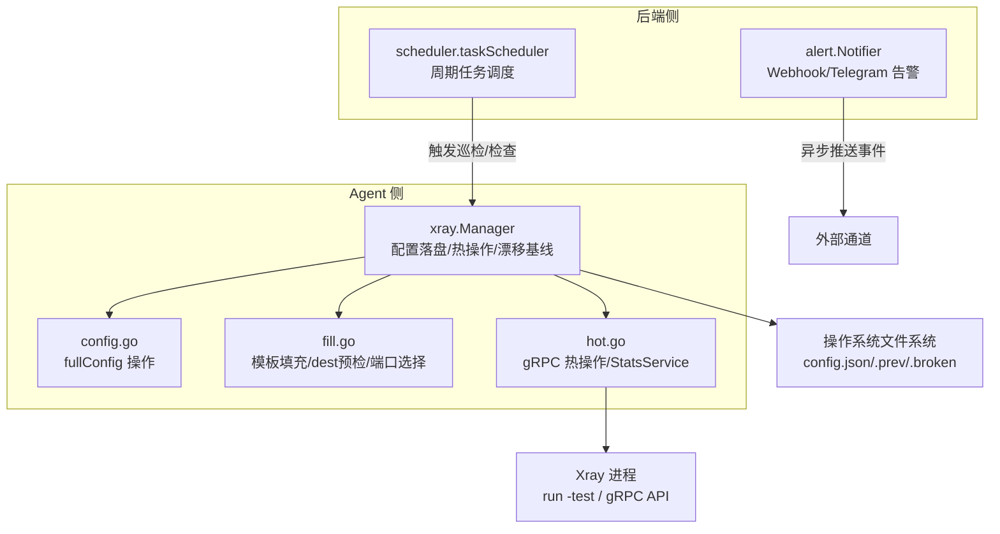
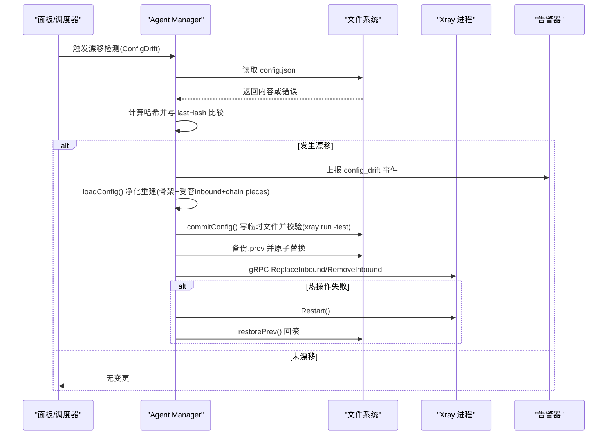
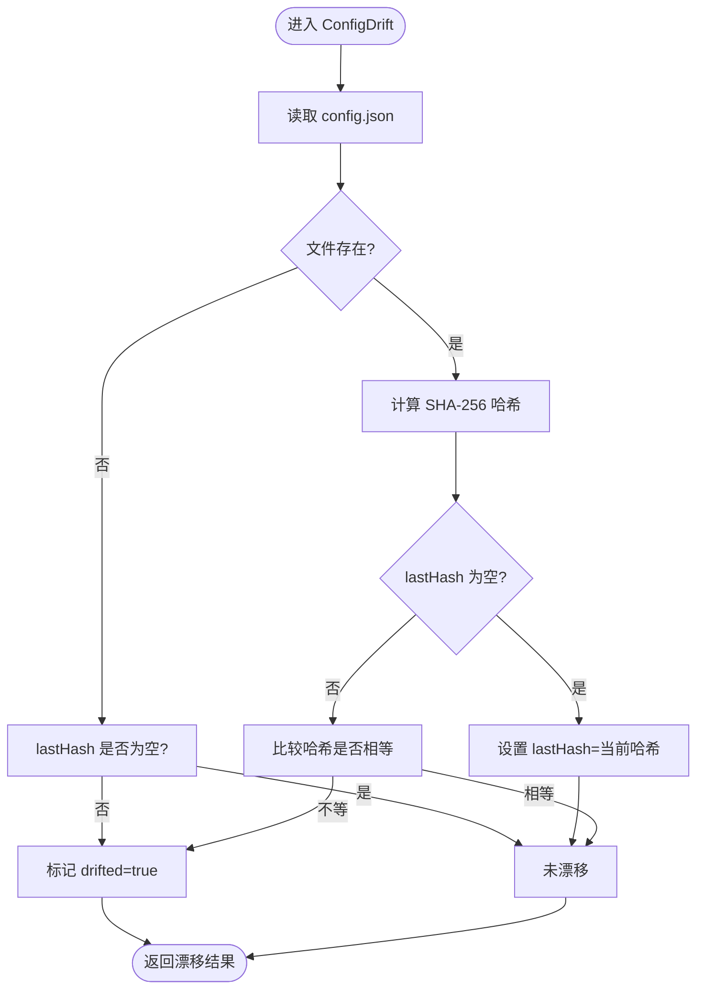
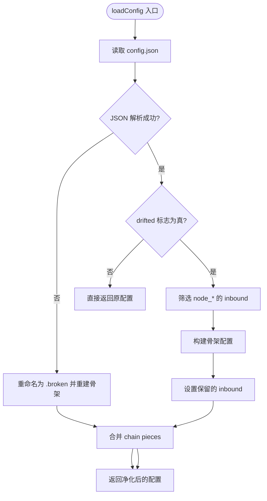
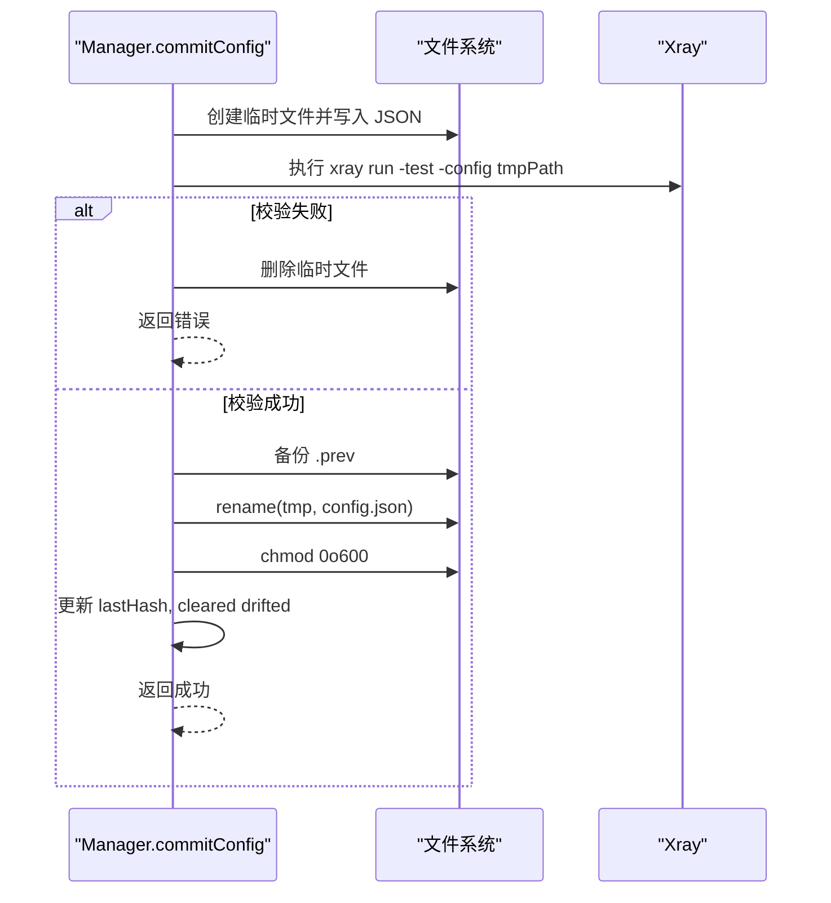
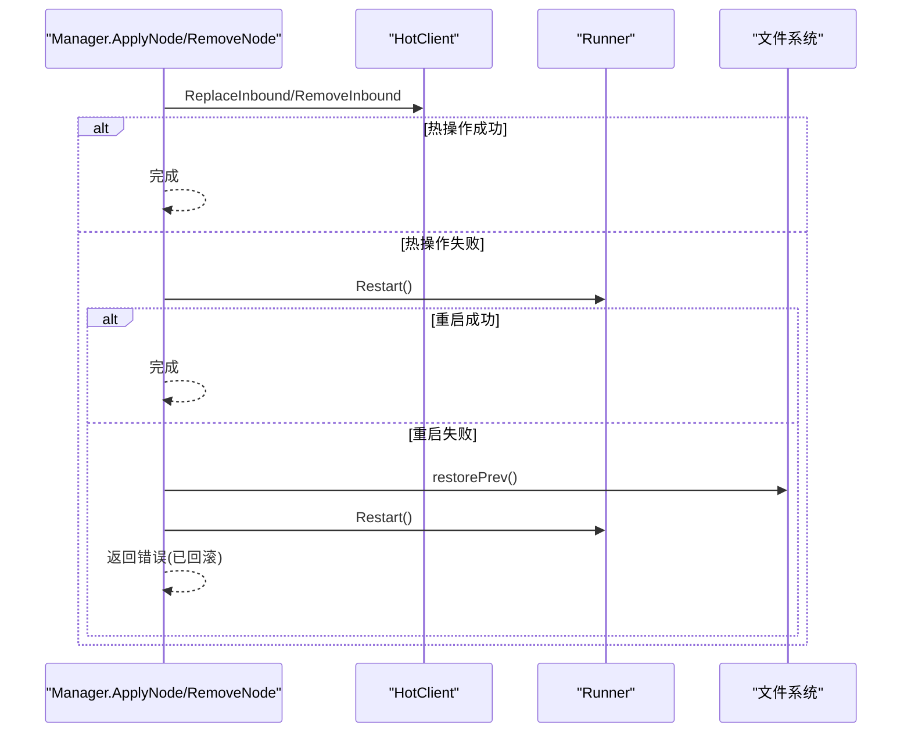
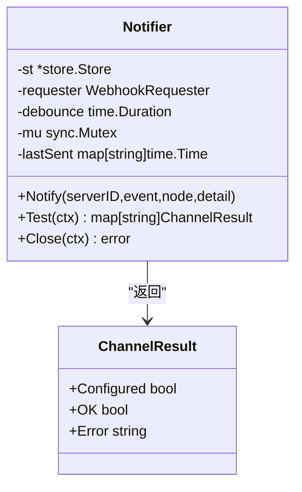
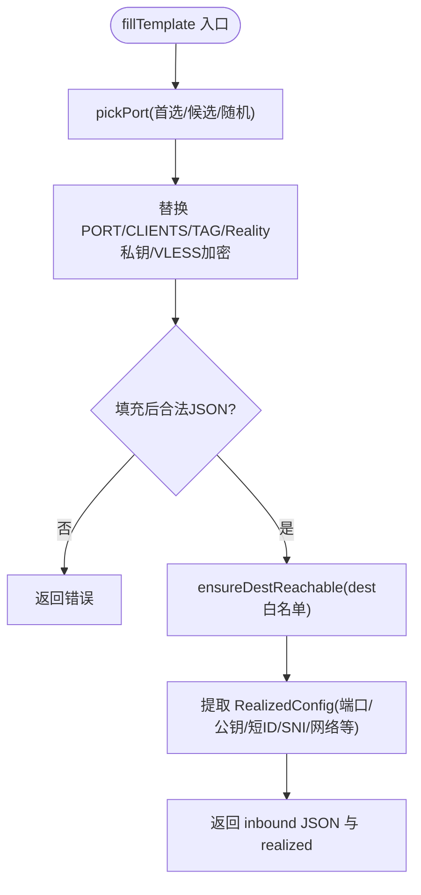
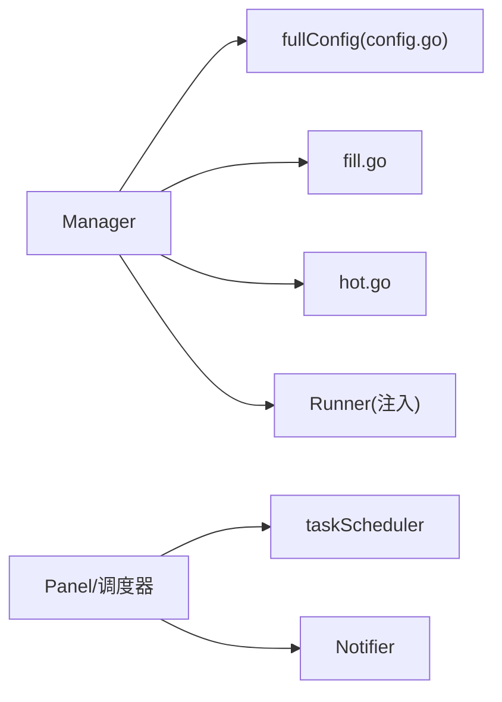
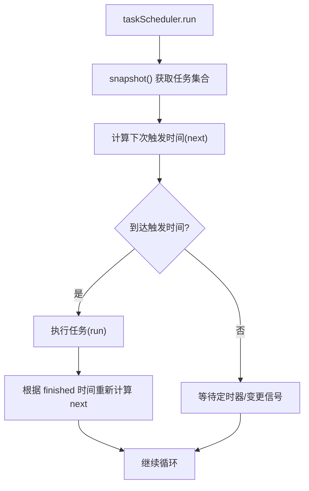

# 配置漂移检测

<cite>
**本文引用的文件**   
- [src/agent/internal/xray/manager.go](file://src/agent/internal/xray/manager.go)
- [src/agent/internal/xray/config.go](file://src/agent/internal/xray/config.go)
- [src/agent/internal/xray/fill.go](file://src/agent/internal/xray/fill.go)
- [src/agent/internal/xray/hot.go](file://src/agent/internal/xray/hot.go)
- [src/backend/internal/alert/alert.go](file://src/backend/internal/alert/alert.go)
- [src/backend/internal/panel/scheduler.go](file://src/backend/internal/panel/scheduler.go)
- [docs/openapi.yaml](file://docs/openapi.yaml)
- [scripts/install-agent.sh](file://scripts/install-agent.sh)
</cite>

## 目录
1. [简介](#简介)
2. [项目结构](#项目结构)
3. [核心组件](#核心组件)
4. [架构总览](#架构总览)
5. [详细组件分析](#详细组件分析)
6. [依赖关系分析](#依赖关系分析)
7. [性能与调度](#性能与调度)
8. [故障排查指南](#故障排查指南)
9. [结论](#结论)
10. [附录：配置选项与调优参数](#附录配置选项与调优参数)

## 简介
本技术文档聚焦 Lattix-codex Agent 中的 Xray 配置漂移检测能力，系统性阐述以下方面：
- 漂移检测实现原理：配置哈希计算、变更追踪、差异分析与净化修复策略
- 自动修复机制：配置同步策略、冲突解决、增量更新与回滚
- 漂移告警系统：阈值设置、通知渠道、事件类型与防抖
- 历史版本管理：变更记录、版本对比与审计追踪
- 检测频率与性能优化：定时任务调度、增量检测、缓存策略
- 配置选项与调优参数：帮助运维在精度与性能之间取得平衡
- 常见漂移场景处理与预防措施：确保配置一致性与稳定性

## 项目结构
围绕 Xray 配置漂移检测的关键代码位于 Agent 侧的 xray 管理模块与后端告警/调度模块。Agent 负责读取、校验、落盘与热更新 Xray 配置，并维护漂移基线；后端提供告警推送与周期性任务调度能力。

**图表来源** 
- [src/agent/internal/xray/manager.go:1-459](file://src/agent/internal/xray/manager.go#L1-L459)
- [src/agent/internal/xray/config.go:1-202](file://src/agent/internal/xray/config.go#L1-L202)
- [src/agent/internal/xray/fill.go:1-355](file://src/agent/internal/xray/fill.go#L1-L355)
- [src/agent/internal/xray/hot.go:1-148](file://src/agent/internal/xray/hot.go#L1-L148)
- [src/backend/internal/alert/alert.go:1-253](file://src/backend/internal/alert/alert.go#L1-L253)
- [src/backend/internal/panel/scheduler.go:1-216](file://src/backend/internal/panel/scheduler.go#L1-L216)

**章节来源**
- [src/agent/internal/xray/manager.go:1-459](file://src/agent/internal/xray/manager.go#L1-L459)
- [src/backend/internal/alert/alert.go:1-253](file://src/backend/internal/alert/alert.go#L1-L253)
- [src/backend/internal/panel/scheduler.go:1-216](file://src/backend/internal/panel/scheduler.go#L1-L216)

## 核心组件
- Manager（xray 管理器）
  - 职责：模板填充 → 校验 → 原子落盘 → gRPC 热操作 → 重启兜底 → 回滚；维护 lastHash/drifted 漂移基线与链 piece 记录
  - 关键方法：ApplyNode/RemoveNode/AddUser/RemoveUser、commitConfig、loadConfig、ConfigDrift、restorePrev、EnsureTelemetryFeatures
- fullConfig（配置抽象）
  - 职责：对 config.json 进行浅层表示与 inbounds 增删改、用户列表 mutateClients
- HotClient（gRPC 热操作客户端）
  - 职责：ReplaceInbound/RemoveInbound、AddUser/RemoveUser、QueryStats
- Notifier（告警器）
  - 职责：Webhook/Telegram 双通道异步推送，支持防抖与测试
- taskScheduler（任务调度器）
  - 职责：统一注册周期任务，按间隔或日历时间触发

**章节来源**
- [src/agent/internal/xray/manager.go:24-41](file://src/agent/internal/xray/manager.go#L24-L41)
- [src/agent/internal/xray/config.go:10-20](file://src/agent/internal/xray/config.go#L10-L20)
- [src/agent/internal/xray/hot.go:27-37](file://src/agent/internal/xray/hot.go#L27-L37)
- [src/backend/internal/alert/alert.go:33-68](file://src/backend/internal/alert/alert.go#L33-L68)
- [src/backend/internal/panel/scheduler.go:84-101](file://src/backend/internal/panel/scheduler.go#L84-L101)

## 架构总览
Xray 配置漂移检测的整体流程如下：
- Agent 侧通过 Manager 维护 config.json 的受管状态，使用 SHA-256 哈希作为漂移基线
- 当检测到漂移时，Manager 以骨架 + 受管 inbound + 链 piece 为基进行“净化”重建，丢弃外部改动
- 配置变更通过 gRPC 热操作生效，失败则回退到重启路径并回滚至 .prev
- 后端 Notifier 接收漂移事件并通过 Webhook/Telegram 推送告警
- 任务调度器可驱动周期性巡检（如 drift_detection.interval_seconds）

**图表来源** 
- [src/agent/internal/xray/manager.go:289-311](file://src/agent/internal/xray/manager.go#L289-L311)
- [src/agent/internal/xray/manager.go:336-375](file://src/agent/internal/xray/manager.go#L336-L375)
- [src/agent/internal/xray/manager.go:235-287](file://src/agent/internal/xray/manager.go#L235-L287)
- [src/agent/internal/xray/hot.go:72-100](file://src/agent/internal/xray/hot.go#L72-L100)
- [src/backend/internal/alert/alert.go:19-25](file://src/backend/internal/alert/alert.go#L19-L25)

## 详细组件分析

### 漂移检测与哈希基线
- 哈希计算：对 config.json 字节序列执行 SHA-256，得到十六进制字符串作为 lastHash
- 首次调用：若 lastHash 为空，则以当前文件哈希初始化基线
- 删除检测：若文件不存在且 lastHash 非空，视为漂移
- 标记漂移：将 drifted 置位，后续 loadConfig 进入净化模式

**图表来源** 
- [src/agent/internal/xray/manager.go:289-311](file://src/agent/internal/xray/manager.go#L289-L311)
- [src/agent/internal/xray/manager.go:313-317](file://src/agent/internal/xray/manager.go#L313-L317)

**章节来源**
- [src/agent/internal/xray/manager.go:289-317](file://src/agent/internal/xray/manager.go#L289-L317)

### 配置净化与重建
- 骨架生成：包含 api.listen、stats/policy、freedom outbound 等基础项
- 受管节点保留：仅保留 tag 前缀为 node_ 的 inbound
- 链 piece 合并：将已落盘的链跳配置件并入最终配置
- 权限加固：config.json 设置为 0o600

**图表来源** 
- [src/agent/internal/xray/manager.go:336-375](file://src/agent/internal/xray/manager.go#L336-L375)
- [src/agent/internal/xray/config.go:22-40](file://src/agent/internal/xray/config.go#L22-L40)

**章节来源**
- [src/agent/internal/xray/manager.go:336-375](file://src/agent/internal/xray/manager.go#L336-L375)
- [src/agent/internal/xray/config.go:22-40](file://src/agent/internal/xray/config.go#L22-L40)

### 配置落盘与校验
- 临时文件写入：在 config.json 同级目录创建 .config-*.json
- 运行校验：调用 xray run -test -config tmpPath 验证合法性
- 备份与原子替换：备份 .prev，rename 原子替换，设置权限 0o600
- 更新基线：成功后更新 lastHash 并清除 drifted

**图表来源** 
- [src/agent/internal/xray/manager.go:235-287](file://src/agent/internal/xray/manager.go#L235-L287)

**章节来源**
- [src/agent/internal/xray/manager.go:235-287](file://src/agent/internal/xray/manager.go#L235-L287)

### 热操作与回滚
- 主路径：gRPC ReplaceInbound/RemoveInbound/AddUser/RemoveUser
- 失败回退：调用 runner.Restart() 重启 Xray
- 二次失败：恢复 .prev 并再次尝试重启，保证可用配置

**图表来源** 
- [src/agent/internal/xray/manager.go:109-142](file://src/agent/internal/xray/manager.go#L109-L142)
- [src/agent/internal/xray/manager.go:144-170](file://src/agent/internal/xray/manager.go#L144-L170)
- [src/agent/internal/xray/manager.go:319-334](file://src/agent/internal/xray/manager.go#L319-L334)

**章节来源**
- [src/agent/internal/xray/manager.go:109-170](file://src/agent/internal/xray/manager.go#L109-L170)
- [src/agent/internal/xray/manager.go:319-334](file://src/agent/internal/xray/manager.go#L319-L334)

### 告警系统与事件
- 事件类型：server_offline、config_drift、node_failed、chain_degraded
- 通知渠道：Webhook POST JSON、Telegram sendMessage
- 防抖：同一服务器同一事件在窗口内不重复发送（默认 5 分钟）
- 测试接口：POST /api/settings/alerts/test 返回各通道配置与发送结果

**图表来源** 
- [src/backend/internal/alert/alert.go:33-68](file://src/backend/internal/alert/alert.go#L33-L68)
- [src/backend/internal/alert/alert.go:175-205](file://src/backend/internal/alert/alert.go#L175-L205)

**章节来源**
- [src/backend/internal/alert/alert.go:19-25](file://src/backend/internal/alert/alert.go#L19-L25)
- [src/backend/internal/alert/alert.go:106-144](file://src/backend/internal/alert/alert.go#L106-L144)
- [src/backend/internal/alert/alert.go:182-205](file://src/backend/internal/alert/alert.go#L182-L205)

### 模板填充与目标可达性
- 占位符替换：PORT/CLIENTS/TAG/Reality 私钥/VLESS Encryption
- dest 预检：TCP+TLS1.3 握手探测，不可达时按白名单候选切换
- 端口选择：优先指定端口，其次候选段，最后随机空闲端口

**图表来源** 
- [src/agent/internal/xray/fill.go:23-142](file://src/agent/internal/xray/fill.go#L23-L142)
- [src/agent/internal/xray/fill.go:170-223](file://src/agent/internal/xray/fill.go#L170-L223)
- [src/agent/internal/xray/fill.go:247-276](file://src/agent/internal/xray/fill.go#L247-L276)

**章节来源**
- [src/agent/internal/xray/fill.go:23-142](file://src/agent/internal/xray/fill.go#L23-L142)
- [src/agent/internal/xray/fill.go:170-223](file://src/agent/internal/xray/fill.go#L170-L223)
- [src/agent/internal/xray/fill.go:247-276](file://src/agent/internal/xray/fill.go#L247-L276)

## 依赖关系分析
- Manager 依赖：
  - config.go：fullConfig 的 inbounds 增删改、用户列表 mutateClients
  - fill.go：模板填充、dest 预检、端口选择、vlessenc/x25519 子命令
  - hot.go：gRPC 热操作与 StatsService 查询
  - Runner：Restart/IsRunning/InstanceID（由上层注入）
- 后端依赖：
  - alert.Notifier：settings 表读取、Webhook/Telegram 发送
  - scheduler.taskScheduler：周期任务注册与触发

**图表来源** 
- [src/agent/internal/xray/manager.go:24-41](file://src/agent/internal/xray/manager.go#L24-L41)
- [src/backend/internal/panel/scheduler.go:84-101](file://src/backend/internal/panel/scheduler.go#L84-L101)
- [src/backend/internal/alert/alert.go:33-68](file://src/backend/internal/alert/alert.go#L33-L68)

**章节来源**
- [src/agent/internal/xray/manager.go:24-41](file://src/agent/internal/xray/manager.go#L24-L41)
- [src/backend/internal/panel/scheduler.go:84-101](file://src/backend/internal/panel/scheduler.go#L84-L101)
- [src/backend/internal/alert/alert.go:33-68](file://src/backend/internal/alert/alert.go#L33-L68)

## 性能与调度
- 检测频率：Agent Settings 中 drift_detection.interval_seconds（最小 5 秒，最大 3600 秒，默认 15 秒）
- 增量检测：基于 lastHash 的哈希比对，避免全量解析开销
- 缓存策略：
  - 内存缓存：lastHash/drifted 标志、chainPieces 落盘记录
  - 文件缓存：.prev/.broken 备份用于快速回滚与重建
- 任务调度：taskScheduler 支持固定间隔与日历对齐（day/month/year），可结合 settings 变更动态刷新

**图表来源** 
- [src/backend/internal/panel/scheduler.go:132-216](file://src/backend/internal/panel/scheduler.go#L132-L216)

**章节来源**
- [docs/openapi.yaml:581-593](file://docs/openapi.yaml#L581-L593)
- [src/backend/internal/panel/scheduler.go:132-216](file://src/backend/internal/panel/scheduler.go#L132-L216)

## 故障排查指南
- 配置文件损坏
  - 现象：JSON 解析失败，自动重命名为 .broken 并重建骨架
  - 处理：检查 .broken 文件，确认骨架重建日志
- 漂移误报/漏报
  - 现象：首次调用以当前文件为基线，停机期间外部修改无法区分
  - 处理：确认 lastHash 初始化时机与 drifted 标志
- 热操作失败
  - 现象：gRPC 调用报错，回退到重启路径
  - 处理：查看热操作日志，必要时手动重启 Xray
- 回滚失败
  - 现象：.prev 不存在或权限不足
  - 处理：检查 .prev 文件与权限 0o600，必要时从 .rebind-backup 恢复
- 告警未送达
  - 现象：Webhook/Telegram 发送失败
  - 处理：检查 settings 表中的 webhook URL、Telegram token/chat_id，测试接口返回结果

**章节来源**
- [src/agent/internal/xray/manager.go:336-375](file://src/agent/internal/xray/manager.go#L336-L375)
- [src/agent/internal/xray/manager.go:235-287](file://src/agent/internal/xray/manager.go#L235-L287)
- [src/backend/internal/alert/alert.go:182-205](file://src/backend/internal/alert/alert.go#L182-L205)

## 结论
Xray 配置漂移检测通过“哈希基线 + 净化重建 + 热操作回滚”的组合策略，实现了高可靠性的配置一致性保障。配合后端的告警与调度能力，可在保证精度的同时兼顾性能与可观测性。建议在生产环境中合理设置 drift_detection.interval_seconds，并结合 .prev/.broken 备份与审计日志，形成完整的配置治理闭环。

## 附录：配置选项与调优参数
- Agent Settings.drift_detection.interval_seconds
  - 范围：5–3600 秒，默认 15 秒
  - 作用：控制漂移检测周期，越小越及时但开销越大
- 环境变量
  - LATTIX_ALERT_DEBOUNCE：覆盖告警防抖窗口（Go duration）
- 安装脚本
  - install-agent.sh：初始化 Xray 二进制与默认 config.json（首次不存在时写入骨架）

**章节来源**
- [docs/openapi.yaml:581-593](file://docs/openapi.yaml#L581-L593)
- [src/backend/internal/alert/alert.go:46-56](file://src/backend/internal/alert/alert.go#L46-L56)
- [scripts/install-agent.sh:285-293](file://scripts/install-agent.sh#L285-L293)