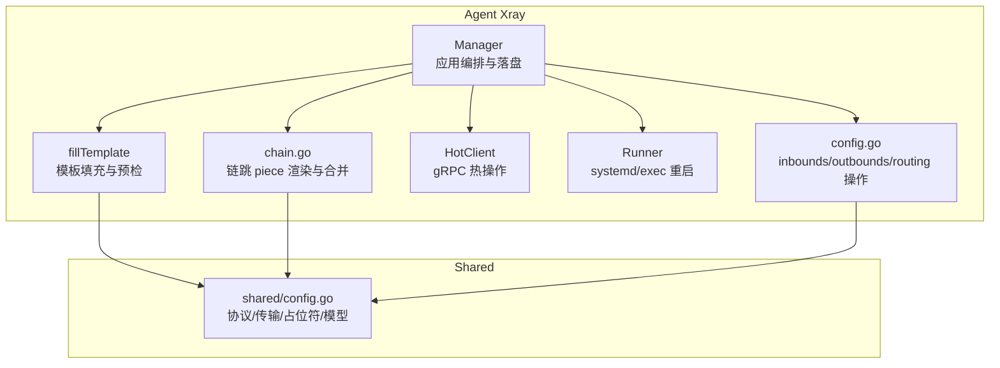
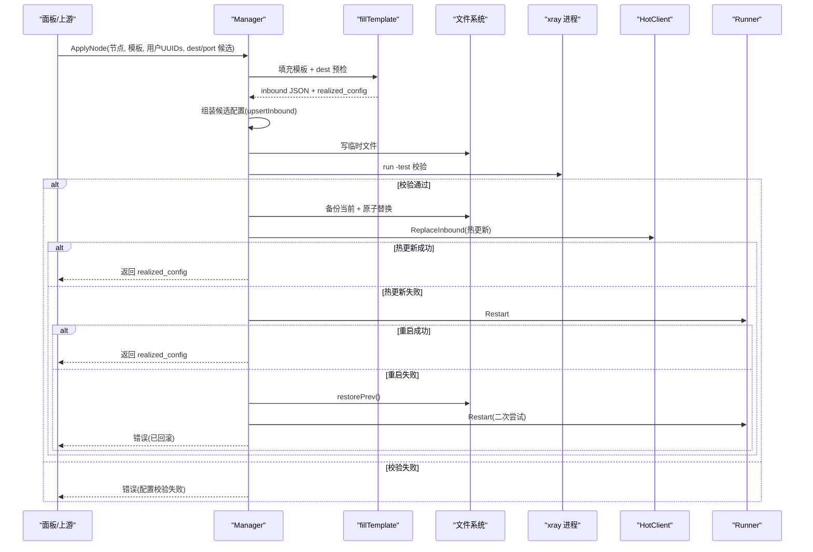
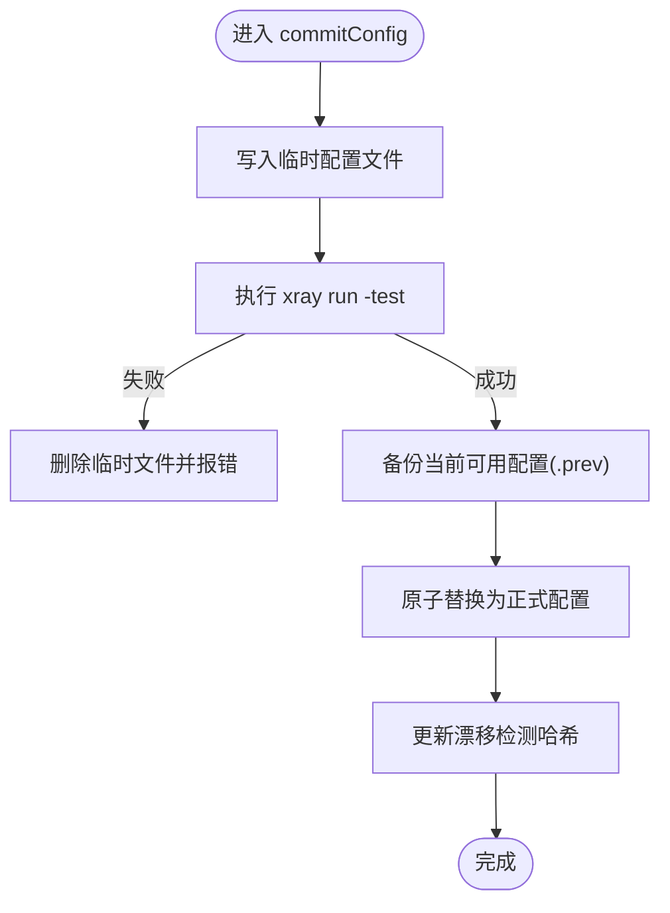
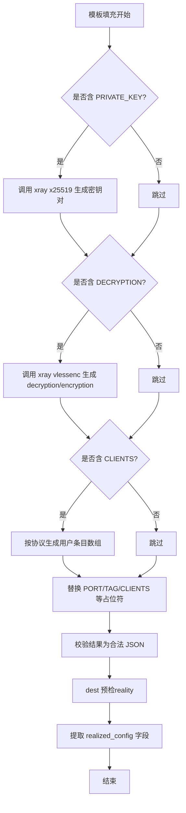
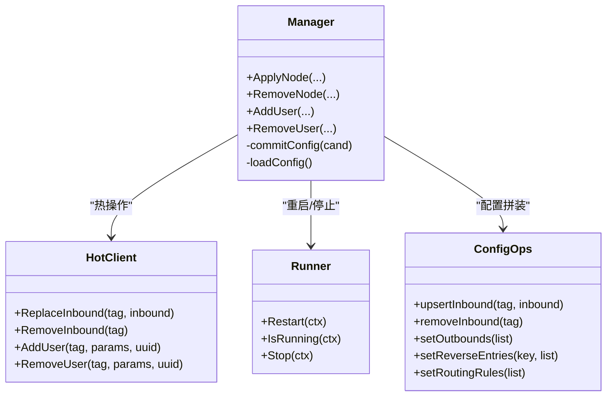
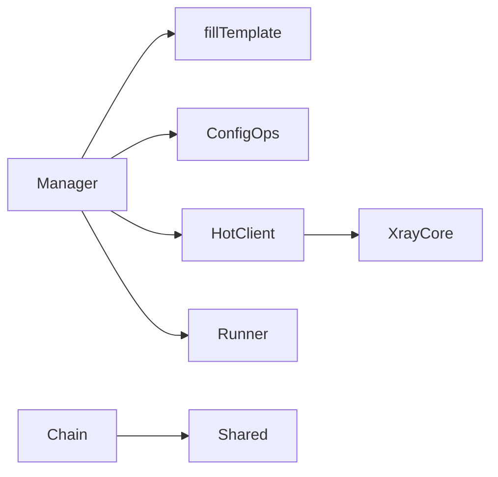

# 配置验证机制

<cite>
**本文引用的文件**   
- [config.go](file://src/agent/internal/xray/config.go)
- [chain.go](file://src/agent/internal/xray/chain.go)
- [fill.go](file://src/agent/internal/xray/fill.go)
- [manager.go](file://src/agent/internal/xray/manager.go)
- [hot.go](file://src/agent/internal/xray/hot.go)
- [runner.go](file://src/agent/internal/xray/runner.go)
- [config.go](file://src/shared/config.go)
</cite>

## 目录
1. [简介](#简介)
2. [项目结构](#项目结构)
3. [核心组件](#核心组件)
4. [架构总览](#架构总览)
5. [详细组件分析](#详细组件分析)
6. [依赖关系分析](#依赖关系分析)
7. [性能考量](#性能考量)
8. [故障排查指南](#故障排查指南)
9. [结论](#结论)
10. [附录：扩展与自定义验证器](#附录扩展与自定义验证器)

## 简介
本技术文档围绕 Lattix-codex Agent 中的 Xray 配置验证机制，系统化说明从模板填充、JSON 校验、字段类型与必填项检查，到依赖关系（端口冲突、协议兼容性、节点依赖）与业务规则（用户权限、配额限制、安全策略）、完整性检查（必需组件、网络可达性、证书有效性）的全流程。同时给出错误分类与处理策略，以及扩展方法与自定义验证器的实现指南，帮助运维人员按需定制验证逻辑。

## 项目结构
Xray 配置验证相关代码集中在 agent 的 xray 子包与 shared 公共库中：
- agent/internal/xray：管理器、热操作客户端、运行器、链跳渲染、模板填充与校验等
- shared：协议常量、占位符、虚拟配置与生效配置模型

**图表来源** 
- [manager.go:106-139](file://src/agent/internal/xray/manager.go#L106-L139)
- [fill.go:20-142](file://src/agent/internal/xray/fill.go#L20-L142)
- [config.go:10-81](file://src/agent/internal/xray/config.go#L10-L81)
- [hot.go:72-100](file://src/agent/internal/xray/hot.go#L72-L100)
- [runner.go:27-53](file://src/agent/internal/xray/runner.go#L27-L53)
- [chain.go:82-119](file://src/agent/internal/xray/chain.go#L82-L119)
- [config.go:170-206](file://src/shared/config.go#L170-L206)

**章节来源**
- [manager.go:106-139](file://src/agent/internal/xray/manager.go#L106-L139)
- [config.go:10-81](file://src/agent/internal/xray/config.go#L10-L81)
- [config.go:170-206](file://src/shared/config.go#L170-L206)

## 核心组件
- Manager：负责整体编排，包括模板填充、候选配置组装、xray -test 校验、原子落盘、热操作与回滚、漂移检测与修复。
- fillTemplate：填充模板占位符（端口、密钥、用户列表、VLESS Encryption），执行 dest 预检，提取 realized_config 上报值。
- config.go：对 fullConfig 进行 inbounds/outbounds/reverse/routing 的增删改查，支持幂等替换与清理。
- HotClient：通过 gRPC API 热更新 inbound、用户、查询统计；不支持的协议自动回退重启。
- Runner：抽象系统服务控制（systemd/exec），提供重启、停止、运行状态与实例 ID。
- chain.go：渲染并合并链跳 piece（portal/bridge/forward），维护 reverse 与 routing 引用一致性。
- shared/config.go：定义协议、传输、指纹、VLESS Encryption、SS 方法、占位符、VirtualConfig/RealizedConfig 模型。

**章节来源**
- [manager.go:24-55](file://src/agent/internal/xray/manager.go#L24-L55)
- [fill.go:20-142](file://src/agent/internal/xray/fill.go#L20-L142)
- [config.go:10-81](file://src/agent/internal/xray/config.go#L10-L81)
- [hot.go:27-100](file://src/agent/internal/xray/hot.go#L27-L100)
- [runner.go:16-53](file://src/agent/internal/xray/runner.go#L16-L53)
- [chain.go:25-119](file://src/agent/internal/xray/chain.go#L25-L119)
- [config.go:170-206](file://src/shared/config.go#L170-L206)

## 架构总览
Xray 配置验证的主路径遵循“模板填充 → xray -test 校验 → 原子落盘 → 热操作 → 失败回滚”的流水线。链跳 piece 采用“落盘 → 测试 → 重启 → 失败回滚”的兜底流程。

**图表来源** 
- [manager.go:106-139](file://src/agent/internal/xray/manager.go#L106-L139)
- [fill.go:20-142](file://src/agent/internal/xray/fill.go#L20-L142)
- [manager.go:232-273](file://src/agent/internal/xray/manager.go#L232-L273)
- [hot.go:72-100](file://src/agent/internal/xray/hot.go#L72-L100)
- [runner.go:77-114](file://src/agent/internal/xray/runner.go#L77-L114)

## 详细组件分析

### 配置语法与结构验证
- JSON 格式校验：在 commitConfig 中对临时配置文件执行 xray run -test，确保最终 JSON 合法且符合 xray 期望的结构。
- 骨架配置与漂移修复：loadConfig 在缺失或损坏时重建骨架，并在检测到外部漂移时以“受管 inbound + 链 piece”为基净化配置。
- 段级操作：fullConfig 提供 inbounds/outbounds/reverse/routing 的读写与空段清理，保证配置片段的一致性。

**图表来源** 
- [manager.go:232-273](file://src/agent/internal/xray/manager.go#L232-L273)

**章节来源**
- [manager.go:318-351](file://src/agent/internal/xray/manager.go#L318-L351)
- [config.go:10-81](file://src/agent/internal/xray/config.go#L10-L81)

### 字段类型与必填项检查
- 端口必填与冲突检测：fillTemplate 要求模板必须包含端口（显式或占位符），pickPort 会检查指定端口占用情况，或在候选集中挑选空闲端口，否则报错。
- Reality 私钥与 VLESS Encryption：当模板包含对应占位符时，调用 xray x25519/vlessenc 生成密钥对或加密参数，解析失败则直接报错。
- 用户条目构造：按协议生成 clients/accounts 条目，dokodemo 跳过用户概念；ss 2022-blake3 使用定长 base64 密钥派生。

**图表来源** 
- [fill.go:20-142](file://src/agent/internal/xray/fill.go#L20-L142)
- [fill.go:247-276](file://src/agent/internal/xray/fill.go#L247-L276)
- [config.go:147-168](file://src/shared/config.go#L147-L168)

**章节来源**
- [fill.go:20-142](file://src/agent/internal/xray/fill.go#L20-L142)
- [fill.go:247-276](file://src/agent/internal/xray/fill.go#L247-L276)
- [config.go:147-168](file://src/shared/config.go#L147-L168)

### 依赖关系验证
- 端口冲突检测：pickPort 在指定端口时尝试监听，失败即报占用；候选集全占用时报错；无候选时随机分配。
- 协议兼容性检查：hot.go 仅对 vless/vmess/trojan 支持热操作用户，其他协议返回错误并由 Manager 回退重启。
- 节点依赖验证：chain.go 在 forward 渲染时根据 via_tunnel_domain 查找对应的 reverse portal tag，未就绪则报错；removeChainPieceItems 会清理 inbound/outbound/reverse/routing 中引用该 piece 的所有条目。

**图表来源** 
- [manager.go:106-139](file://src/agent/internal/xray/manager.go#L106-L139)
- [hot.go:72-148](file://src/agent/internal/xray/hot.go#L72-L148)
- [runner.go:27-53](file://src/agent/internal/xray/runner.go#L27-L53)
- [config.go:10-81](file://src/agent/internal/xray/config.go#L10-L81)

**章节来源**
- [fill.go:247-276](file://src/agent/internal/xray/fill.go#L247-L276)
- [hot.go:113-135](file://src/agent/internal/xray/hot.go#L113-L135)
- [chain.go:313-349](file://src/agent/internal/xray/chain.go#L313-L349)
- [chain.go:551-613](file://src/agent/internal/xray/chain.go#L551-L613)

### 业务规则验证
- 用户权限与配额限制：当前代码未实现显式的配额或权限校验逻辑；用户增删基于 UUID 匹配键（email/user）进行幂等操作。如需扩展，可在 mutateClients/mutateUserList 前加入配额检查与权限校验钩子。
- 安全策略校验：Reality 的 dest 预检通过 TLS1.3 握手探测可达性，不校验证书链；VLESS Encryption 与 uTLS 指纹由模板与 realized_config 下发，确保安全参数一致。

**章节来源**
- [config.go:117-201](file://src/agent/internal/xray/config.go#L117-L201)
- [fill.go:170-223](file://src/agent/internal/xray/fill.go#L170-L223)
- [config.go:170-206](file://src/shared/config.go#L170-L206)

### 配置完整性检查
- 必需组件验证：skeleton 确保 api/stats/policy/outbounds.direct 存在；EnsureTelemetryFeatures 会在缺失 stats/policy/services 时补齐并重启。
- 网络可达性测试：ensureDestReachable 对 realitySettings.dest 进行 TCP+TLS1.3 探测，不可达时按白名单候选逐个尝试并改写 dest/serverNames。
- 证书有效性检查：dest 预检仅探测可达性，不校验证书链；实际证书有效性由 xray 运行时保障。

**章节来源**
- [manager.go:353-373](file://src/agent/internal/xray/manager.go#L353-L373)
- [manager.go:380-434](file://src/agent/internal/xray/manager.go#L380-L434)
- [fill.go:170-223](file://src/agent/internal/xray/fill.go#L170-L223)

### 验证错误的分类与处理策略
- 致命错误：xray -test 失败、xray 二进制命令执行失败（x25519/vlessenc）、端口被占用、候选端口全部占用、dest 预检全部失败、链跳规格缺失等，直接返回错误并中止流程。
- 警告信息：热操作失败时记录日志并回退重启；dest 不可达 fallback 到候选时会打印日志。
- 可恢复错误：热操作失败后通过重启恢复；重启失败则恢复上一份配置并再次尝试重启。

**章节来源**
- [manager.go:232-273](file://src/agent/internal/xray/manager.go#L232-L273)
- [fill.go:170-223](file://src/agent/internal/xray/fill.go#L170-L223)
- [hot.go:72-100](file://src/agent/internal/xray/hot.go#L72-L100)
- [chain.go:82-119](file://src/agent/internal/xray/chain.go#L82-L119)

## 依赖关系分析
- Manager 依赖 fillTemplate 完成模板填充与预检，依赖 config.go 进行配置片段操作，依赖 HotClient 进行热更新，依赖 Runner 进行服务控制。
- chain.go 依赖 shared 的协议与标签常量，负责链跳 piece 的渲染与反向路由一致性。
- hot.go 依赖 xray-core gRPC API，仅部分协议支持热操作用户。

**图表来源** 
- [manager.go:106-139](file://src/agent/internal/xray/manager.go#L106-L139)
- [chain.go:82-119](file://src/agent/internal/xray/chain.go#L82-L119)
- [hot.go:72-148](file://src/agent/internal/xray/hot.go#L72-L148)

**章节来源**
- [manager.go:106-139](file://src/agent/internal/xray/manager.go#L106-L139)
- [chain.go:82-119](file://src/agent/internal/xray/chain.go#L82-L119)
- [hot.go:72-148](file://src/agent/internal/xray/hot.go#L72-L148)

## 性能考量
- 热操作优先：尽量通过 gRPC 热更新避免重启，减少服务中断时间。
- 原子落盘与测试前置：先 xray -test 再原子替换，避免脏配置影响运行态。
- 端口选择优化：优先复用已有端口，其次候选集顺序挑选，最后随机分配，降低冲突概率。
- 预检超时控制：dest 预检设置单次超时，避免长时间阻塞。

[本节为通用指导，无需源码引用]

## 故障排查指南
- 配置校验失败：查看 xray -test 输出，定位 JSON 结构或字段问题；必要时回滚至 .prev 配置。
- 热操作失败：确认协议是否支持热操作用户；若不支持，等待 Manager 回退重启。
- 端口冲突：检查目标端口是否被占用，或调整候选端口集合。
- dest 不可达：检查白名单候选是否有效，或修正模板中的 dest/serverNames。
- 漂移检测：若检测到外部修改，Manager 将以净化配置为基重建，保留受管 inbound。

**章节来源**
- [manager.go:232-273](file://src/agent/internal/xray/manager.go#L232-L273)
- [fill.go:170-223](file://src/agent/internal/xray/fill.go#L170-L223)
- [hot.go:113-135](file://src/agent/internal/xray/hot.go#L113-L135)

## 结论
Xray 配置验证机制以“模板填充 + xray -test + 原子落盘 + 热操作 + 回滚”为核心，覆盖 JSON 合法性、字段类型与必填项、端口冲突、协议兼容、节点依赖、dest 预检、骨架完整性等关键维度。错误分级明确，具备完善的回滚与自愈能力。通过扩展 mutateClients/mutateUserList 与 pre-commit 钩子，可灵活接入权限与配额校验，满足多样化运维需求。

[本节为总结，无需源码引用]

## 附录：扩展与自定义验证器
- 扩展点建议：
  - 在 mutateClients/mutateUserList 前插入配额与权限校验，拒绝非法请求。
  - 在 commitConfig 之前增加自定义 schema 校验（如额外字段白名单）。
  - 在 ensureDestReachable 中扩展更多可达性探测方式（HTTP/HTTPS、WebSocket）。
- 自定义验证器实现要点：
  - 保持幂等性与错误分类（致命/警告/可恢复）。
  - 与现有回滚机制协同，确保失败时能恢复到稳定状态。
  - 记录详细日志与指标，便于排障与监控。

[本节为通用指导，无需源码引用]