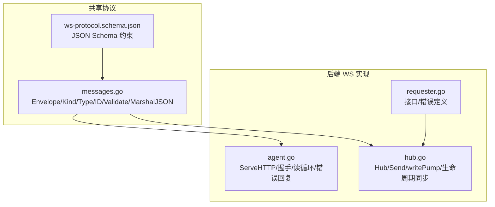
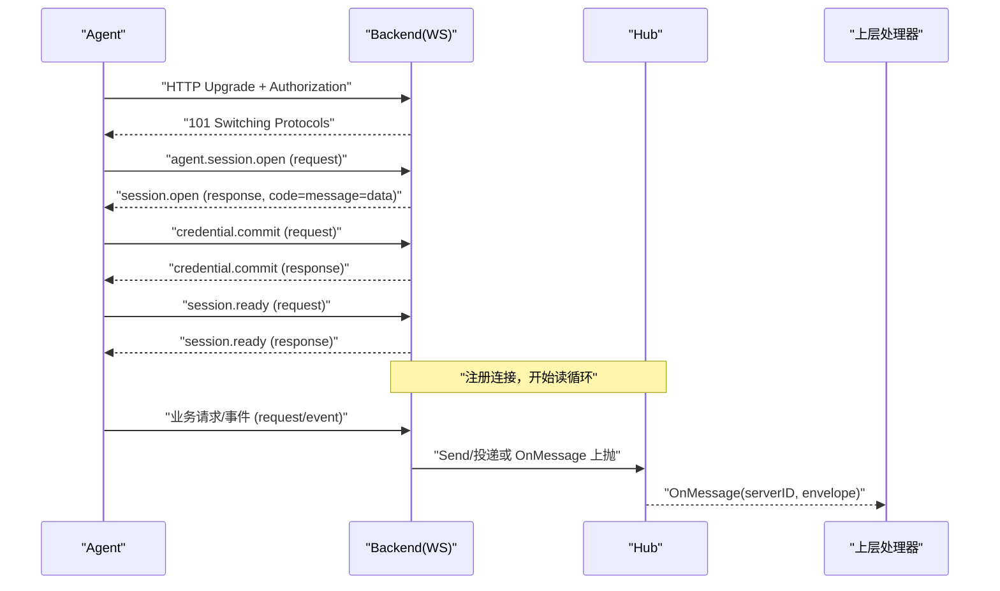
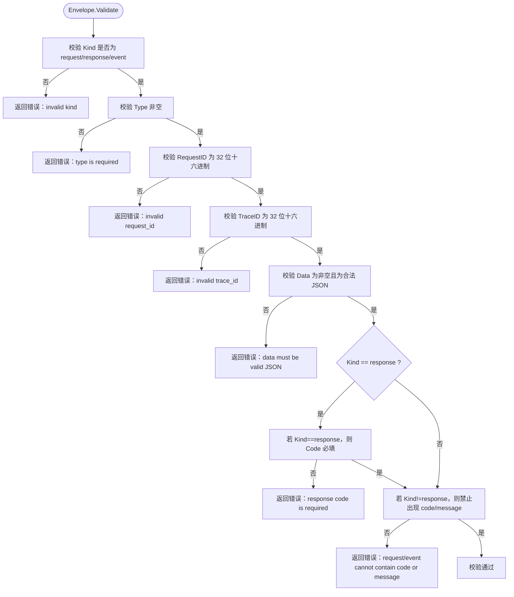
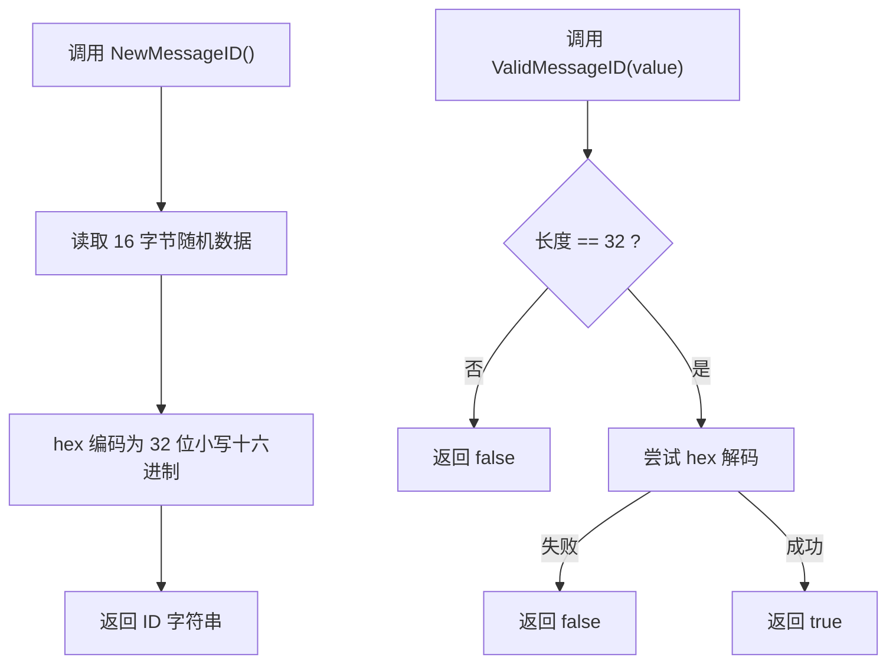
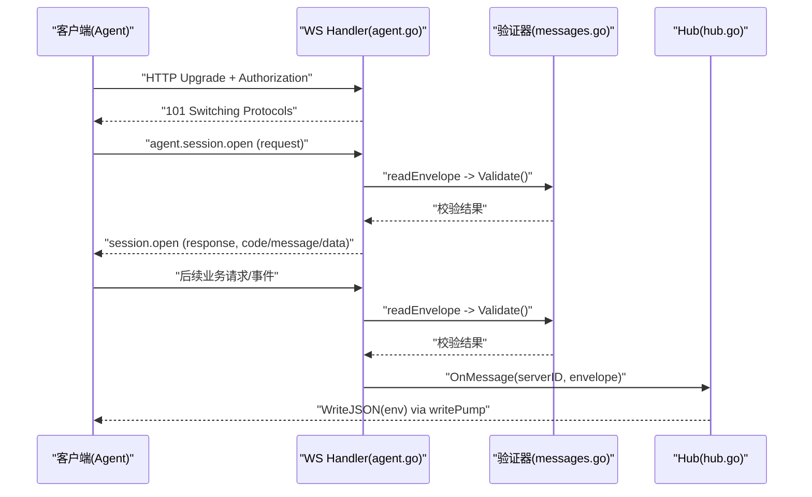
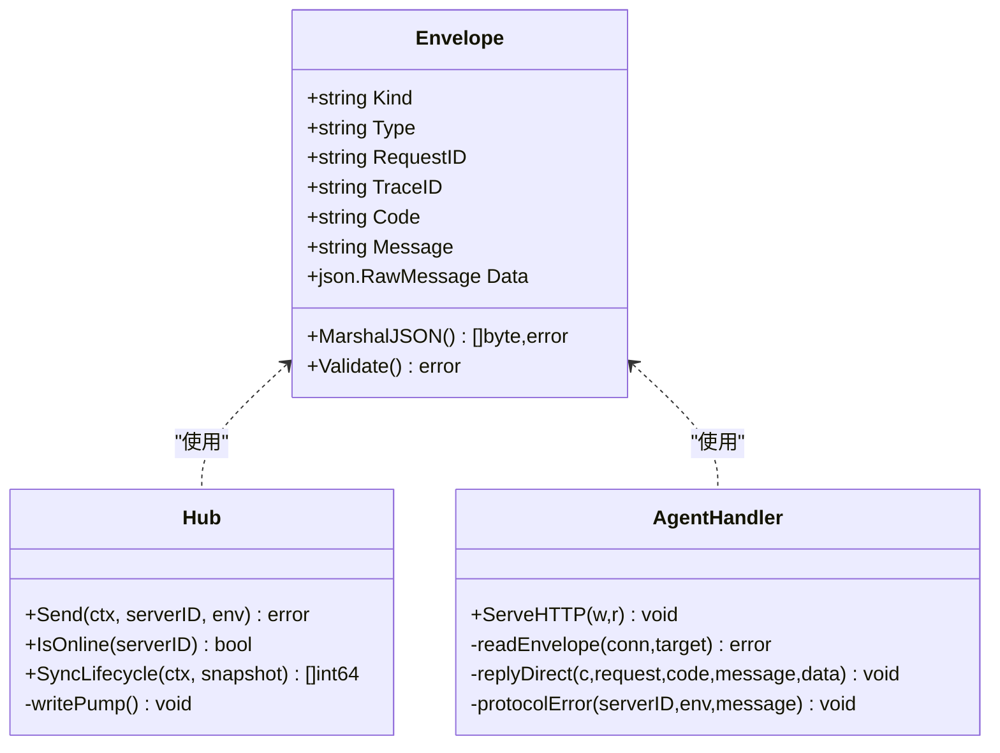

# WebSocket 消息格式

<cite>
**本文引用的文件**   
- [messages.go](file://src/shared/messages.go)
- [ws-protocol.schema.json](file://docs/ws-protocol.schema.json)
- [hub.go](file://src/backend/internal/ws/hub.go)
- [agent.go](file://src/backend/internal/ws/agent.go)
- [requester.go](file://src/backend/internal/ws/requester.go)
- [messages_test.go](file://src/shared/messages_test.go)
</cite>

## 目录
1. [简介](#简介)
2. [项目结构](#项目结构)
3. [核心组件](#核心组件)
4. [架构总览](#架构总览)
5. [详细组件分析](#详细组件分析)
6. [依赖关系分析](#依赖关系分析)
7. [性能考量](#性能考量)
8. [故障排查指南](#故障排查指南)
9. [结论](#结论)
10. [附录：消息示例与使用场景](#附录消息示例与使用场景)

## 简介
本技术文档聚焦于 Lattix-codex 后端与 Agent 之间通过 WebSocket 进行控制面通信的消息格式。重点解释统一信封 Envelope 的结构与序列化规则，包括 Kind（请求/响应/事件）、Type（业务类型）、RequestID、TraceID、Code、Message 和 Data 字段的作用与约束；说明 JSON 序列化中“响应必须包含 Code 与 Message，而请求与事件不包含”的设计原理；详述消息 ID 的生成与校验机制（NewMessageID 与 ValidMessageID）；并提供完整消息示例，展示不同类型消息的差异与实际使用场景。

## 项目结构
WebSocket 协议定义与实现分布在以下位置：
- 共享协议类型与序列化逻辑：src/shared/messages.go
- 协议 JSON Schema 定义：docs/ws-protocol.schema.json
- 后端 WebSocket 服务端处理与连接管理：src/backend/internal/ws/agent.go、hub.go、requester.go
- 协议行为测试用例：src/shared/messages_test.go

**图表来源** 
- [messages.go:14-45](file://src/shared/messages.go#L14-L45)
- [ws-protocol.schema.json:107-132](file://docs/ws-protocol.schema.json#L107-L132)
- [agent.go:33-120](file://src/backend/internal/ws/agent.go#L33-L120)
- [hub.go:111-139](file://src/backend/internal/ws/hub.go#L111-L139)
- [requester.go:18-24](file://src/backend/internal/ws/requester.go#L18-L24)

**章节来源**
- [messages.go:14-45](file://src/shared/messages.go#L14-L45)
- [ws-protocol.schema.json:107-132](file://docs/ws-protocol.schema.json#L107-L132)
- [agent.go:33-120](file://src/backend/internal/ws/agent.go#L33-L120)
- [hub.go:111-139](file://src/backend/internal/ws/hub.go#L111-L139)
- [requester.go:18-24](file://src/backend/internal/ws/requester.go#L18-L24)

## 核心组件
- Envelope 信封：统一的 RPC 消息载体，包含 Kind、Type、RequestID、TraceID、Code、Message、Data。
- Kind 枚举：request、response、event，分别表示请求、响应与事件。
- Type 命名空间：采用 domain.action 形式，如 agent.session.open、node.apply 等。
- 消息 ID：RequestID/TraceID 为 32 位十六进制随机字符串，由 NewMessageID() 生成，ValidMessageID() 校验。
- 序列化策略：MarshalJSON 根据 Kind 动态决定是否输出 code/message 字段。
- 验证器：Validate() 对信封结构与语义进行强校验。

**章节来源**
- [messages.go:14-45](file://src/shared/messages.go#L14-L45)
- [messages.go:47-91](file://src/shared/messages.go#L47-L91)
- [messages.go:93-109](file://src/shared/messages.go#L93-L109)
- [messages.go:111-137](file://src/shared/messages.go#L111-L137)

## 架构总览
WebSocket 控制通道的工作流如下：
- Agent 发起 HTTP Upgrade 到 /api/agent/ws，携带 Bearer Token。
- 首次应用帧必须是 agent.session.open 请求，随后完成会话建立与认证。
- 在 session.ready 之前仅允许 credential.commit 与 session.ready。
- 注册成功后进入读循环，所有业务信封通过 OnMessage 上抛给上层处理。
- Hub 维护连接表与发送队列，writePump 串行写出，保证 gorilla/websocket 并发安全。

**图表来源** 
- [agent.go:33-120](file://src/backend/internal/ws/agent.go#L33-L120)
- [agent.go:158-197](file://src/backend/internal/ws/agent.go#L158-L197)
- [agent.go:221-238](file://src/backend/internal/ws/agent.go#L221-L238)
- [hub.go:111-139](file://src/backend/internal/ws/hub.go#L111-L139)

**章节来源**
- [agent.go:33-120](file://src/backend/internal/ws/agent.go#L33-L120)
- [agent.go:158-197](file://src/backend/internal/ws/agent.go#L158-L197)
- [agent.go:221-238](file://src/backend/internal/ws/agent.go#L221-L238)
- [hub.go:111-139](file://src/backend/internal/ws/hub.go#L111-L139)

## 详细组件分析

### Envelope 信封结构与序列化
- 字段说明
  - kind: 固定枚举值 request/response/event。
  - type: 小写字母开头的层级命名，形如 domain.action。
  - request_id/trace_id: 32 位十六进制字符串，用于关联请求与链路追踪。
  - code/message: 仅在 kind=response 时出现，且必须存在。
  - data: 任意合法 JSON 对象，作为业务载荷。
- 序列化规则
  - MarshalJSON 根据 Kind 动态选择结构体：非 response 不输出 code/message；response 强制输出这两个字段。
  - 该设计确保响应消息始终携带状态码与描述信息，便于调用方统一处理错误与成功路径。
- 验证规则
  - Validate() 检查 Kind 合法性、Type 非空、RequestID/TraceID 格式、Data 为合法 JSON。
  - 当 Kind=response 时要求 Code 必填；当 Kind=request/event 时禁止出现 Code/Message。

**图表来源** 
- [messages.go:111-137](file://src/shared/messages.go#L111-L137)

**章节来源**
- [messages.go:14-45](file://src/shared/messages.go#L14-L45)
- [messages.go:111-137](file://src/shared/messages.go#L111-L137)

### 消息 ID 生成与校验
- NewMessageID(): 使用加密安全的随机源生成 16 字节随机数，并编码为 32 位小写十六进制字符串。
- ValidMessageID(): 校验长度等于 32 且可被十六进制解码。
- 用途：作为 request_id 与 trace_id 的值，贯穿整个请求生命周期，用于关联与追踪。

**图表来源** 
- [messages.go:93-109](file://src/shared/messages.go#L93-L109)

**章节来源**
- [messages.go:93-109](file://src/shared/messages.go#L93-L109)

### JSON Schema 约束与一致性
- ws-protocol.schema.json 定义了信封顶层字段与条件约束：
  - kind 限定为 request/response/event。
  - type 遵循层级命名模式。
  - request_id/trace_id 限定为 32 位十六进制。
  - response 必须包含 code 与 message；request/event 不得包含 code/message。
  - 针对特定 type 的 data 结构进行了细化约束（例如 agent.session.open、telemetry.report 等）。
- 该 Schema 与 Go 侧 Validate()/MarshalJSON 保持一致，确保两端契约一致。

**章节来源**
- [ws-protocol.schema.json:107-132](file://docs/ws-protocol.schema.json#L107-L132)
- [ws-protocol.schema.json:232-251](file://docs/ws-protocol.schema.json#L232-L251)

### 后端 WS 处理流程与错误处理
- ServeHTTP 负责 HTTP Upgrade、鉴权、会话建立与注册。
- readEnvelope 严格解析文本帧并调用 Envelope.Validate()。
- replyDirect 构造标准响应信封，确保 code/message 存在。
- protocolError 记录协议级错误，必要时生成新的 request_id/trace_id。
- writePump 串行写出，避免并发写入导致连接异常。

**图表来源** 
- [agent.go:33-120](file://src/backend/internal/ws/agent.go#L33-L120)
- [agent.go:302-314](file://src/backend/internal/ws/agent.go#L302-L314)
- [agent.go:276-285](file://src/backend/internal/ws/agent.go#L276-L285)
- [agent.go:287-300](file://src/backend/internal/ws/agent.go#L287-L300)
- [hub.go:398-413](file://src/backend/internal/ws/hub.go#L398-L413)

**章节来源**
- [agent.go:33-120](file://src/backend/internal/ws/agent.go#L33-L120)
- [agent.go:302-314](file://src/backend/internal/ws/agent.go#L302-L314)
- [agent.go:276-285](file://src/backend/internal/ws/agent.go#L276-L285)
- [agent.go:287-300](file://src/backend/internal/ws/agent.go#L287-L300)
- [hub.go:398-413](file://src/backend/internal/ws/hub.go#L398-L413)

## 依赖关系分析
- shared.Envelope 被 ws 包广泛使用，作为传输与处理的统一数据结构。
- hub.Send 将 Envelope 投递到连接的发送队列，writePump 负责序列化与写出。
- agent.ServeHTTP 负责读循环与协议错误上报，依赖 messages.Validate 与 NewMessageID。
- requester.go 定义了 AgentRequester 接口与错误常量，供上层编排调用。

**图表来源** 
- [messages.go:14-45](file://src/shared/messages.go#L14-L45)
- [hub.go:111-139](file://src/backend/internal/ws/hub.go#L111-L139)
- [agent.go:302-314](file://src/backend/internal/ws/agent.go#L302-L314)
- [agent.go:276-285](file://src/backend/internal/ws/agent.go#L276-L285)

**章节来源**
- [messages.go:14-45](file://src/shared/messages.go#L14-L45)
- [hub.go:111-139](file://src/backend/internal/ws/hub.go#L111-L139)
- [agent.go:302-314](file://src/backend/internal/ws/agent.go#L302-L314)
- [agent.go:276-285](file://src/backend/internal/ws/agent.go#L276-L285)

## 性能考量
- 发送缓冲：每连接 sendBuffer=256，满即视为慢连接并断开，重连后补发，避免内存膨胀。
- 写超时：单次写超时 10s，超时即判定连接死亡，及时释放资源。
- 心跳：Agent 主动 Ping，Panel 原样 Pong，并以收到的控制帧续期读超时，默认 90s 无活动关闭。
- 串行写出：writePump 串行消费发送队列，避免 gorilla/websocket 并发写问题。
- 严格反序列化：strictUnmarshal 禁用未知字段，防止多余数据影响解析性能与安全性。

**章节来源**
- [hub.go:16-24](file://src/backend/internal/ws/hub.go#L16-L24)
- [hub.go:398-413](file://src/backend/internal/ws/hub.go#L398-L413)
- [agent.go:102-111](file://src/backend/internal/ws/agent.go#L102-L111)
- [agent.go:316-329](file://src/backend/internal/ws/agent.go#L316-L329)

## 故障排查指南
- 常见协议错误
  - 首帧不是 agent.session.open：返回 4002 关闭码与错误消息。
  - 非法 JSON 或未知字段：strictUnmarshal 报错，拒绝解析。
  - 缺少必要字段：Validate() 返回具体错误（type、request_id、trace_id、data、response code）。
- 诊断要点
  - 检查 request_id/trace_id 是否符合 32 位十六进制。
  - 确认 Kind 与 code/message 的组合符合约束（response 必须包含，request/event 禁止包含）。
  - 查看 Hub 日志中的 “send buffer full” 提示，定位慢连接。
  - 使用 OnProtocolError 回调获取协议级错误详情。

**章节来源**
- [agent.go:91-99](file://src/backend/internal/ws/agent.go#L91-L99)
- [agent.go:302-314](file://src/backend/internal/ws/agent.go#L302-L314)
- [messages.go:111-137](file://src/shared/messages.go#L111-L137)
- [hub.go:134-138](file://src/backend/internal/ws/hub.go#L134-L138)

## 结论
Lattix-codex 的 WebSocket 消息格式以 Envelope 为核心，通过严格的 JSON Schema 与 Go 侧 Validate/MarshalJSON 保障两端契约一致。Kind 区分了请求、响应与事件，响应强制携带 code/message 以便统一错误处理；消息 ID 由安全随机源生成并通过固定格式校验，确保可追踪性与幂等性。后端实现采用串行写出与严格反序列化，兼顾性能与安全。整体设计清晰、健壮，适用于高可靠的 Agent 控制通道。

## 附录：消息示例与使用场景
以下为基于代码与 Schema 推导的典型消息结构示例（字段名与约束与源码一致）：

- 请求：agent.session.open
  - kind: "request"
  - type: "agent.session.open"
  - request_id: "32位十六进制"
  - trace_id: "32位十六进制"
  - data: 包含 protocol_version、agent_version、xray_version、xray_running 等字段
  - 注意：不包含 code/message

- 响应：agent.session.open
  - kind: "response"
  - type: "agent.session.open"
  - request_id: 与请求一致
  - trace_id: 与请求一致
  - code: "OK"
  - message: ""
  - data: 包含 server_id、session_id、session_kind、issued_token、credential_exchange_id、panel_state 等

- 事件：telemetry.report
  - kind: "event"
  - type: "telemetry.report"
  - request_id: "32位十六进制"
  - trace_id: "32位十六进制"
  - data: 包含 xray_instance_id、traffic 数组等
  - 注意：不包含 code/message

- 请求：node.apply
  - kind: "request"
  - type: "node.apply"
  - request_id/trace_id: 32位十六进制
  - data: 包含 node_id、config、user_uuids、dest_candidates、port_candidates 等
  - 注意：不包含 code/message

- 响应：node.apply
  - kind: "response"
  - type: "node.apply"
  - request_id/trace_id: 与请求一致
  - code: "OK" 或其他业务码
  - message: 描述信息
  - data: ApplyResultPayload（node_id、realized_config、hop_id、kind 等）

以上示例均满足 ws-protocol.schema.json 的条件约束与 Go 侧 Validate/MarshalJSON 的行为。实际使用中，请求与事件消息不应包含 code/message；响应消息必须包含 code/message。

**章节来源**
- [ws-protocol.schema.json:136-179](file://docs/ws-protocol.schema.json#L136-L179)
- [ws-protocol.schema.json:317-333](file://docs/ws-protocol.schema.json#L317-L333)
- [messages.go:139-193](file://src/shared/messages.go#L139-L193)
- [messages_test.go:9-33](file://src/shared/messages_test.go#L9-L33)