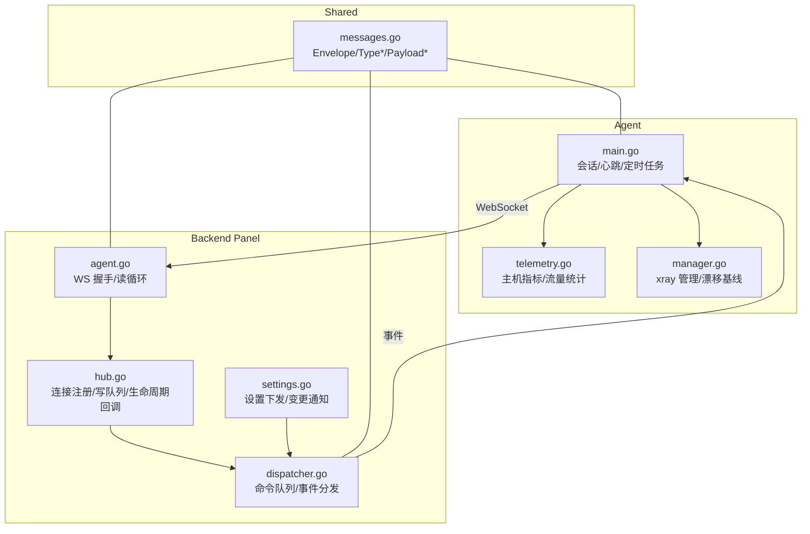
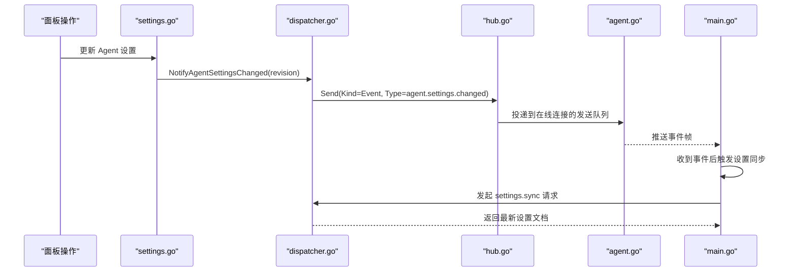
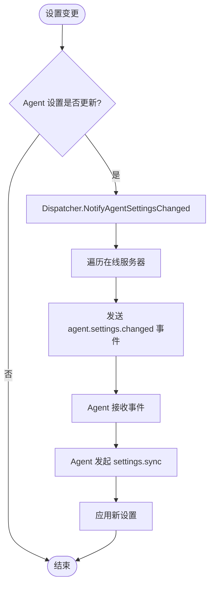
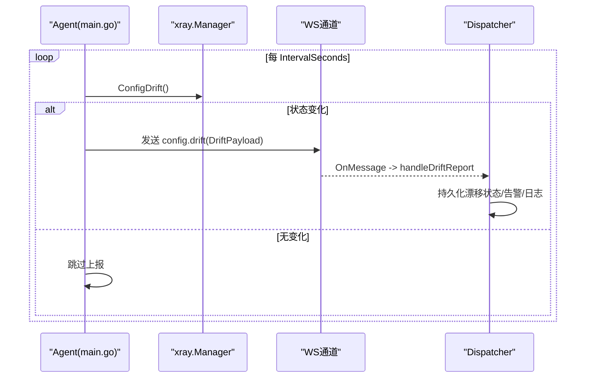
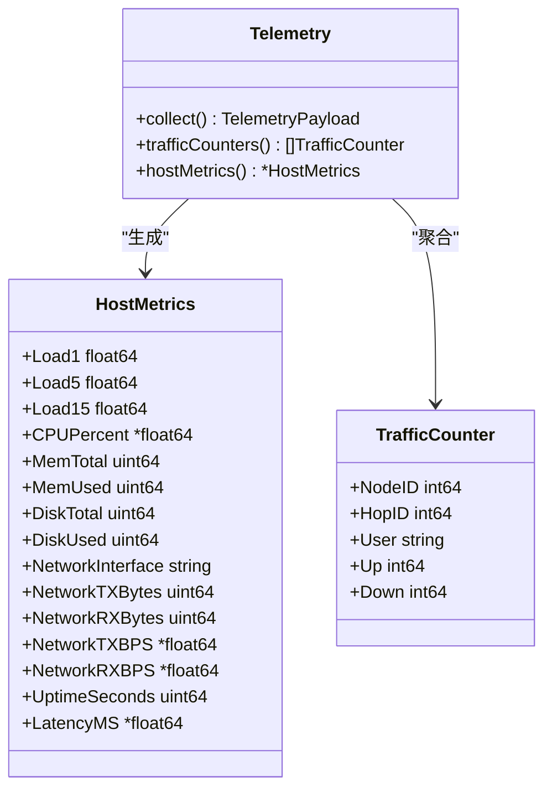
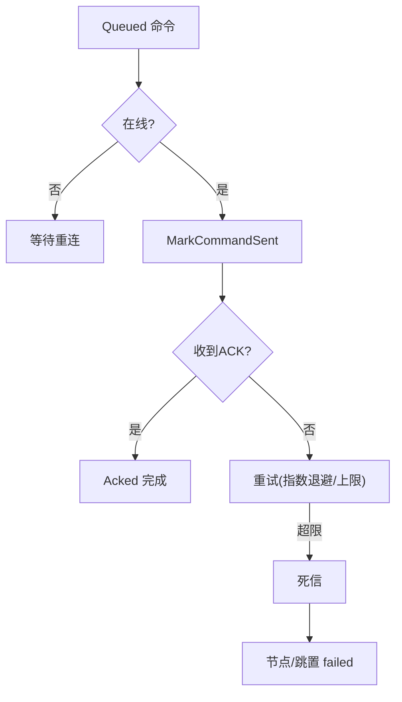
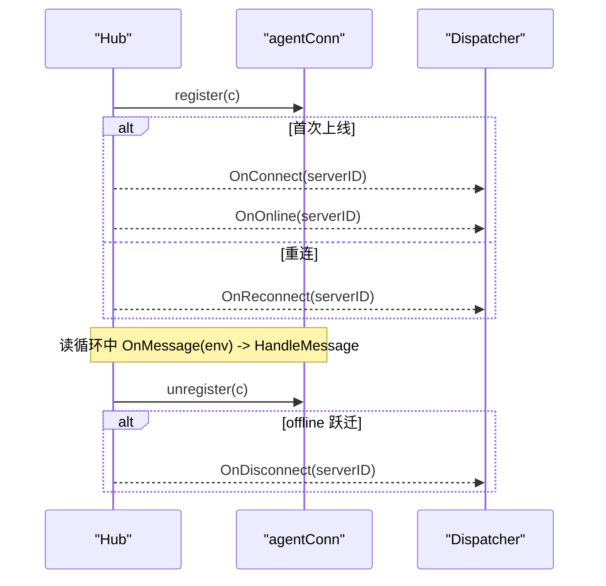
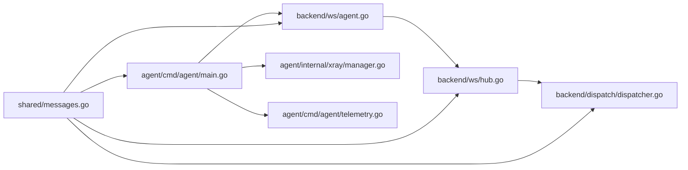

# 事件通知

<cite>
**本文引用的文件**   
- [messages.go](file://src/shared/messages.go)
- [hub.go](file://src/backend/internal/ws/hub.go)
- [agent.go](file://src/backend/internal/ws/agent.go)
- [dispatcher.go](file://src/backend/internal/dispatch/dispatcher.go)
- [settings.go](file://src/backend/internal/panel/settings.go)
- [telemetry.go](file://src/agent/cmd/agent/telemetry.go)
- [manager.go](file://src/agent/internal/xray/manager.go)
- [main.go](file://src/agent/cmd/agent/main.go)
</cite>

## 目录
1. [简介](#简介)
2. [项目结构](#项目结构)
3. [核心组件](#核心组件)
4. [架构总览](#架构总览)
5. [详细组件分析](#详细组件分析)
6. [依赖关系分析](#依赖关系分析)
7. [性能考量](#性能考量)
8. [故障排查指南](#故障排查指南)
9. [结论](#结论)
10. [附录](#附录)

## 简介
本文件面向 Lattix-codex 的事件通知机制，围绕以下目标展开：
- agent.settings.changed 事件的触发条件与设置变更通知流程
- config.drift 漂移检测的实现细节（外部修改检测、DriftPayload 上报）
- telemetry.report 遥测的周期性上报机制（HostMetrics、TrafficCounter、Xray 实例状态）
- 事件分发与可靠性保证（去重、顺序、丢失重试）
- 事件监听器的注册与注销流程
- 事件处理代码示例路径与调试方法

## 项目结构
事件系统贯穿 Agent、Backend（Panel）、共享协议层（shared），并通过 WebSocket 控制通道进行双向通信。关键位置如下：
- shared：定义统一信封 Envelope、消息类型常量与载荷结构
- backend/ws：Hub 管理连接、发送队列、生命周期回调；Agent 接入握手与读循环
- backend/dispatch：命令入队、离线排队、重连补发、事件分发（遥测、漂移）
- agent/cmd/agent：主循环、心跳、遥测采集、漂移检测、设置同步
- agent/internal/xray：xray 管理器（版本/运行态、统计查询、配置漂移基线）

**图示来源** 
- [main.go](file://src/agent/cmd/agent/main.go)
- [telemetry.go](file://src/agent/cmd/agent/telemetry.go)
- [manager.go](file://src/agent/internal/xray/manager.go)
- [agent.go](file://src/backend/internal/ws/agent.go)
- [hub.go](file://src/backend/internal/ws/hub.go)
- [dispatcher.go](file://src/backend/internal/dispatch/dispatcher.go)
- [settings.go](file://src/backend/internal/panel/settings.go)
- [messages.go](file://src/shared/messages.go)

**章节来源**
- [messages.go:13-137](file://src/shared/messages.go#L13-L137)
- [agent.go:33-239](file://src/backend/internal/ws/agent.go#L33-L239)
- [hub.go:26-139](file://src/backend/internal/ws/hub.go#L26-L139)
- [dispatcher.go:412-438](file://src/backend/internal/dispatch/dispatcher.go#L412-L438)
- [settings.go:468-488](file://src/backend/internal/panel/settings.go#L468-L488)
- [main.go:284-358](file://src/agent/cmd/agent/main.go#L284-L358)

## 核心组件
- 统一信封与类型
  - Envelope：统一 RPC 消息信封，包含 Kind/Type/RequestID/TraceID/Data
  - 事件类型：agent.settings.changed、telemetry.report、config.drift
  - 载荷：TelemetryPayload、DriftPayload、AgentSettingsChangedPayload
- WS 传输与连接管理
  - Hub：连接注册表、发送队列、超时与断线处理、生命周期回调
  - Agent 接入：认证、session.open/ready、读循环、业务上抛
- 命令与事件分发
  - Dispatcher：命令入队/Flush、离线排队、重连补发、事件路由（遥测/漂移）
- Agent 侧采集与上报
  - telemetry：周期采集 HostMetrics/TrafficCounter/Xray 状态并上报
  - xray.Manager：Version/StatsInstanceID/QueryStats、ConfigDrift 基线
- 设置变更通知
  - settings：应用设置后调用 NotifyAgentSettingsChanged，广播 agent.settings.changed

**章节来源**
- [messages.go:72-91](file://src/shared/messages.go#L72-L91)
- [messages.go:195-238](file://src/shared/messages.go#L195-L238)
- [hub.go:111-139](file://src/backend/internal/ws/hub.go#L111-L139)
- [agent.go:158-239](file://src/backend/internal/ws/agent.go#L158-L239)
- [dispatcher.go:520-543](file://src/backend/internal/dispatch/dispatcher.go#L520-L543)
- [telemetry.go:35-53](file://src/agent/cmd/agent/telemetry.go#L35-L53)
- [manager.go:289-304](file://src/agent/internal/xray/manager.go#L289-L304)

## 架构总览
下图展示一次“设置变更 → 事件通知 → Agent 拉取”的端到端流程。

**图示来源** 
- [settings.go:468-488](file://src/backend/internal/panel/settings.go#L468-L488)
- [dispatcher.go:520-543](file://src/backend/internal/dispatch/dispatcher.go#L520-L543)
- [hub.go:111-139](file://src/backend/internal/ws/hub.go#L111-L139)
- [agent.go:213-239](file://src/backend/internal/ws/agent.go#L213-L239)
- [main.go:553-559](file://src/agent/cmd/agent/main.go#L553-L559)

## 详细组件分析

### agent.settings.changed 事件
- 触发条件
  - 面板设置变更后，若 Agent 设置发生更新（revision 变化），则调用 NotifyAgentSettingsChanged
- 通知机制
  - Dispatcher 遍历在线服务器，向每个连接发送 Kind=Event、Type=agent.settings.changed 的帧
  - Hub 将事件写入连接发送队列；ws.Hub.OnMessage 回调将事件上抛给 Dispatcher
  - Agent 收到事件后主动发起 settings.sync 拉取最新设置
- 可靠性
  - 该通知为 best-effort；Agent 也会定期 pull 设置，避免丢失导致长期不一致

**图示来源** 
- [settings.go:468-488](file://src/backend/internal/panel/settings.go#L468-L488)
- [dispatcher.go:520-543](file://src/backend/internal/dispatch/dispatcher.go#L520-L543)
- [main.go:553-559](file://src/agent/cmd/agent/main.go#L553-L559)

**章节来源**
- [settings.go:468-488](file://src/backend/internal/panel/settings.go#L468-L488)
- [dispatcher.go:520-543](file://src/backend/internal/dispatch/dispatcher.go#L520-L543)
- [main.go:553-559](file://src/agent/cmd/agent/main.go#L553-L559)

### config.drift 漂移检测
- 检测逻辑
  - Manager.ConfigDrift 读取 xray.json，与上次由 Agent 落盘的哈希对比；首次以当前文件为基线；文件删除视为漂移
  - 当检测到 drifted 状态变化时，构造 DriftPayload{drifted: true/false} 上报
- 后端处理
  - Dispatcher.handleDriftReport 持久化漂移状态，并在 drifted=true 时记录告警与操作日志
- 上报时机
  - Agent 启动漂移检测协程，按 settings.DriftDetection.IntervalSeconds 周期检查，仅状态变化时上报

**图示来源** 
- [manager.go:289-304](file://src/agent/internal/xray/manager.go#L289-L304)
- [main.go:316-358](file://src/agent/cmd/agent/main.go#L316-L358)
- [dispatcher.go:594-623](file://src/backend/internal/dispatch/dispatcher.go#L594-L623)

**章节来源**
- [manager.go:289-304](file://src/agent/internal/xray/manager.go#L289-L304)
- [main.go:316-358](file://src/agent/cmd/agent/main.go#L316-L358)
- [dispatcher.go:594-623](file://src/backend/internal/dispatch/dispatcher.go#L594-L623)

### telemetry.report 遥测上报
- 采集内容
  - Xray 版本与运行状态、XrayInstanceID（用于绝对计数器关联）
  - HostMetrics：负载、CPU%、内存、磁盘、网卡、上行/下行速率、Uptime、RTT 中位数
  - TrafficCounter：按 node/hop/user 维度的绝对字节计数（自 Xray 实例启动以来）
- 采集实现
  - telemetry.collect 聚合上述指标；trafficCounters 通过 QueryStats 获取
  - main.go 中按 settings.Telemetry.IntervalSeconds 周期上报
- 后端处理
  - Dispatcher.handleTelemetry 持久化主机指标与流量快照（基于 XrayInstanceID 游标计算增量）

**图示来源** 
- [telemetry.go:35-53](file://src/agent/cmd/agent/telemetry.go#L35-L53)
- [telemetry.go:104-141](file://src/agent/cmd/agent/telemetry.go#L104-L141)
- [messages.go:195-232](file://src/shared/messages.go#L195-L232)

**章节来源**
- [telemetry.go:35-53](file://src/agent/cmd/agent/telemetry.go#L35-L53)
- [telemetry.go:104-141](file://src/agent/cmd/agent/telemetry.go#L104-L141)
- [messages.go:195-232](file://src/shared/messages.go#L195-L232)
- [dispatcher.go:554-592](file://src/backend/internal/dispatch/dispatcher.go#L554-L592)

### 事件分发与可靠性保证
- 去重与幂等
  - RequestID/TraceID 唯一标识；命令回执按 request_id 匹配，重复 ack 被忽略
  - 遥测使用绝对计数器+XrayInstanceID，后端持久化游标，丢帧可补齐且天然幂等
- 顺序保证
  - Hub.writePump 串行写出，保证单连接写序；命令按 queued→sent→acked/fail 状态机推进
- 丢失重试
  - 离线时命令滞留 queued；重连后 ResetSentCommands + Flush 补发
  - 超过最大尝试次数进入死信（dead-letter），对 apply_node/chain_hop 做失败定位
- 事件监听器
  - Hub 提供 OnConnect/OnOnline/OnReconnect/OnDisconnect/OnMessage/OnProtocolError 回调
  - Dispatcher 在 OnAgentConnect 中重置未终态命令并 Flush；HandleMessage 路由事件

**图示来源** 
- [hub.go:111-139](file://src/backend/internal/ws/hub.go#L111-L139)
- [dispatcher.go:171-241](file://src/backend/internal/dispatch/dispatcher.go#L171-L241)
- [dispatcher.go:402-409](file://src/backend/internal/dispatch/dispatcher.go#L402-L409)
- [dispatcher.go:625-730](file://src/backend/internal/dispatch/dispatcher.go#L625-L730)

**章节来源**
- [hub.go:111-139](file://src/backend/internal/ws/hub.go#L111-L139)
- [dispatcher.go:171-241](file://src/backend/internal/dispatch/dispatcher.go#L171-L241)
- [dispatcher.go:402-409](file://src/backend/internal/dispatch/dispatcher.go#L402-L409)
- [dispatcher.go:625-730](file://src/backend/internal/dispatch/dispatcher.go#L625-L730)

### 事件监听器的注册与注销
- 注册
  - Hub.NewHub 初始化连接表与状态表；ServeHTTP 认证成功后 register(c)，触发 OnConnect/OnOnline/OnReconnect
- 注销
  - 连接关闭或断开时 unregister(c)，若从 online→offline 跃迁则触发 OnDisconnect
- 使用点
  - Dispatcher.OnAgentConnect 在 session.ready 完成后重置 sent 命令并 Flush
  - ws.Hub.OnMessage 将 Agent 上行业务信封交给 Dispatcher.HandleMessage

**图示来源** 
- [agent.go:199-239](file://src/backend/internal/ws/agent.go#L199-L239)
- [hub.go:232-279](file://src/backend/internal/ws/hub.go#L232-L279)
- [dispatcher.go:402-409](file://src/backend/internal/dispatch/dispatcher.go#L402-L409)

**章节来源**
- [agent.go:199-239](file://src/backend/internal/ws/agent.go#L199-L239)
- [hub.go:232-279](file://src/backend/internal/ws/hub.go#L232-L279)
- [dispatcher.go:402-409](file://src/backend/internal/dispatch/dispatcher.go#L402-L409)

## 依赖关系分析
- shared.messages 被 ws、dispatch、agent 共同引用，确保协议一致
- ws.hub 依赖 shared.Envelope 与 AgentRequester 接口；ws.agent 负责握手与读循环
- dispatch 依赖 store 与 ws.AgentRequester，串联命令与事件
- agent.main 依赖 xray.Manager、state、shared，组织心跳/遥测/漂移/设置同步

**图示来源** 
- [messages.go:13-137](file://src/shared/messages.go#L13-L137)
- [agent.go:1-30](file://src/backend/internal/ws/agent.go#L1-L30)
- [hub.go:1-25](file://src/backend/internal/ws/hub.go#L1-L25)
- [dispatcher.go:1-22](file://src/backend/internal/dispatch/dispatcher.go#L1-L22)
- [main.go:1-26](file://src/agent/cmd/agent/main.go#L1-L26)

**章节来源**
- [messages.go:13-137](file://src/shared/messages.go#L13-L137)
- [agent.go:1-30](file://src/backend/internal/ws/agent.go#L1-L30)
- [hub.go:1-25](file://src/backend/internal/ws/hub.go#L1-L25)
- [dispatcher.go:1-22](file://src/backend/internal/dispatch/dispatcher.go#L1-L22)
- [main.go:1-26](file://src/agent/cmd/agent/main.go#L1-L26)

## 性能考量
- WS 写队列长度有限（sendBuffer=256），慢连接会断开并重连补发，避免背压扩散
- 遥测与漂移检测均为周期任务，间隔由 Agent 设置驱动，避免高频 IO
- 遥测使用绝对计数器与实例 ID，后端增量计算减少带宽与存储压力
- 命令重试采用指数退避与上限，防止风暴；死信隔离异常命令

[本节为通用指导，不直接分析具体文件]

## 故障排查指南
- 常见问题定位
  - 设置未生效：检查 agent.settings.changed 是否到达；确认 settings.sync 响应是否 OK
  - 漂移告警频繁：查看 config.drift 上报频率与状态变化原因（外部编辑/删除）
  - 遥测缺失：确认 telemetry.report 是否周期性上报；检查 XrayInstanceID 是否稳定
- 日志与观察
  - Backend：Hub 写超时、协议错误、命令死信、漂移告警
  - Agent：连接重试、遥测发送失败、漂移检测错误
- 建议步骤
  - 启用操作日志与请求日志，结合 RequestID/TraceID 追踪链路
  - 检查面板生命周期状态（active/faulted）与连接状态（online/offline）

**章节来源**
- [hub.go:287-300](file://src/backend/internal/ws/agent.go#L287-L300)
- [dispatcher.go:171-241](file://src/backend/internal/dispatch/dispatcher.go#L171-L241)
- [dispatcher.go:594-623](file://src/backend/internal/dispatch/dispatcher.go#L594-L623)

## 结论
Lattix-codex 的事件系统以统一的 Envelope 协议为基础，借助 WS 长连接实现高可靠的双向通信。通过 Hub 的连接管理与 Dispatcher 的命令/事件分发，配合 Agent 的周期采集与漂移检测，形成闭环的可观测性与可控性体系。设置变更、漂移检测与遥测三类事件各司其职，既保证了实时性，也兼顾了可靠性与可扩展性。

[本节为总结，不直接分析具体文件]

## 附录
- 事件类型与载荷参考
  - agent.settings.changed：AgentSettingsChangedPayload
  - telemetry.report：TelemetryPayload（含 HostMetrics、TrafficCounter）
  - config.drift：DriftPayload
- 关键函数路径
  - 设置变更通知：NotifyAgentSettingsChanged
  - 遥测处理：handleTelemetry
  - 漂移处理：handleDriftReport
  - 漂移检测：ConfigDrift
  - 遥测采集：telemetry.collect / trafficCounters / hostMetrics

**章节来源**
- [messages.go:72-91](file://src/shared/messages.go#L72-L91)
- [messages.go:195-238](file://src/shared/messages.go#L195-L238)
- [dispatcher.go:520-543](file://src/backend/internal/dispatch/dispatcher.go#L520-L543)
- [dispatcher.go:554-592](file://src/backend/internal/dispatch/dispatcher.go#L554-L592)
- [dispatcher.go:594-623](file://src/backend/internal/dispatch/dispatcher.go#L594-L623)
- [manager.go:289-304](file://src/agent/internal/xray/manager.go#L289-L304)
- [telemetry.go:35-53](file://src/agent/cmd/agent/telemetry.go#L35-L53)