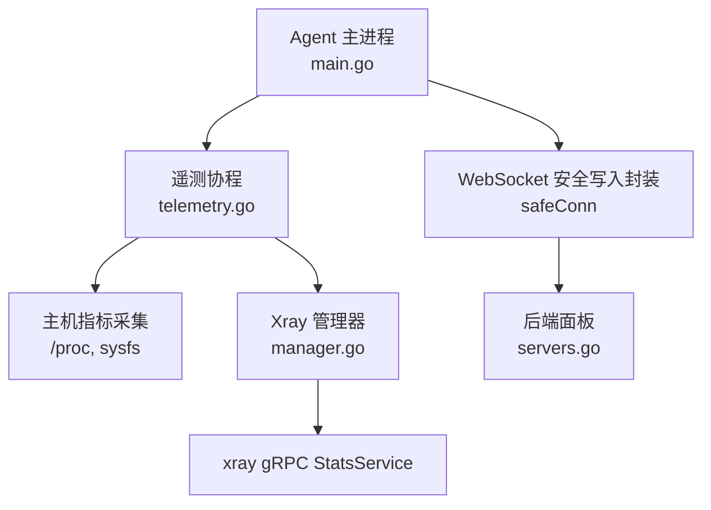
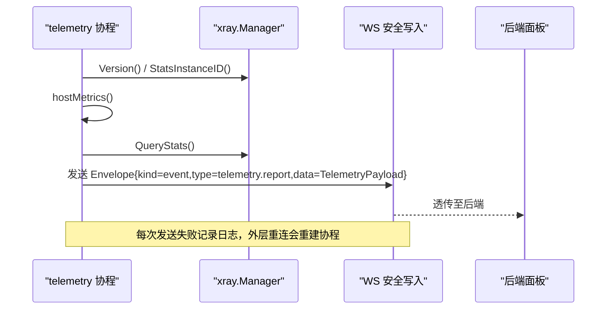
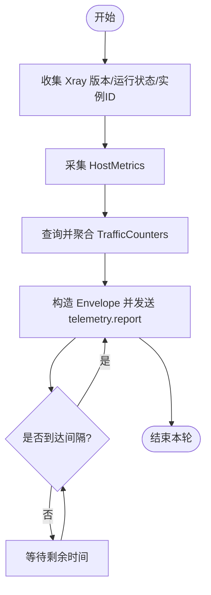
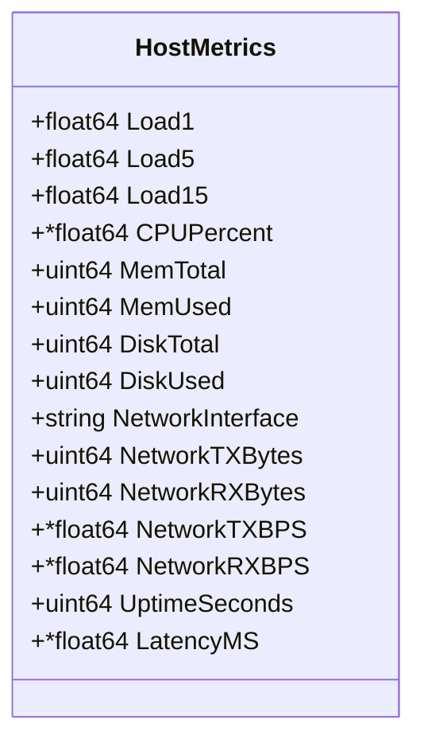
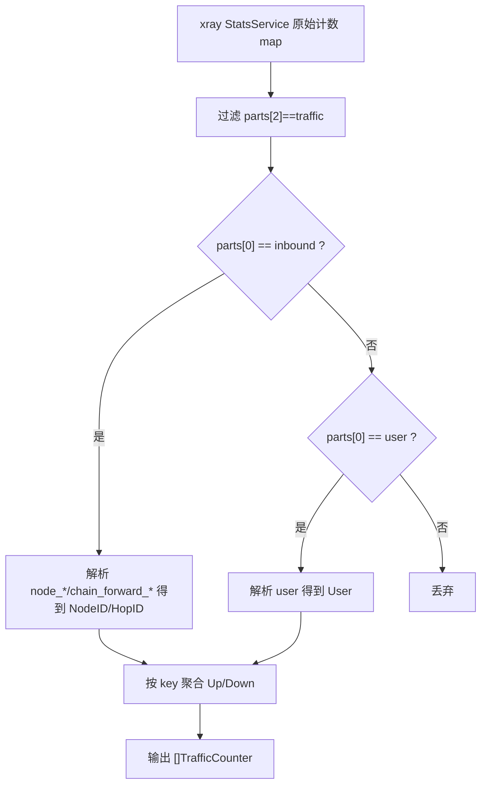
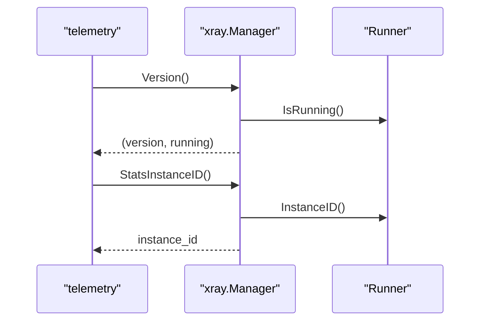
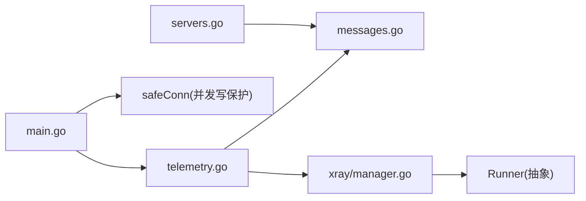

# 遥测事件

<cite>
**本文引用的文件**   
- [src/agent/cmd/agent/telemetry.go](file://src/agent/cmd/agent/telemetry.go)
- [src/agent/cmd/agent/main.go](file://src/agent/cmd/agent/main.go)
- [src/shared/messages.go](file://src/shared/messages.go)
- [src/agent/internal/xray/manager.go](file://src/agent/internal/xray/manager.go)
- [src/backend/internal/panel/servers.go](file://src/backend/internal/panel/servers.go)
- [src/agent/cmd/agent/telemetry_test.go](file://src/agent/cmd/agent/telemetry_test.go)
- [src/agent/cmd/agent/telemetry_host_test.go](file://src/agent/cmd/agent/telemetry_host_test.go)
</cite>

## 目录
1. [简介](#简介)
2. [项目结构](#项目结构)
3. [核心组件](#核心组件)
4. [架构总览](#架构总览)
5. [详细组件分析](#详细组件分析)
6. [依赖关系分析](#依赖关系分析)
7. [性能考量](#性能考量)
8. [故障排查指南](#故障排查指南)
9. [结论](#结论)
10. [附录：自定义遥测指标示例](#附录自定义遥测指标示例)

## 简介
本技术文档围绕 Agent 侧的遥测上报机制展开，重点说明 telemetry.report 事件的周期性上报、HostMetrics 指标采集、TrafficCounter 流量统计、Xray 实例状态监控、以及端到端的数据流与优化策略。读者将了解如何在现有框架上扩展自定义遥测指标，并掌握性能与安全传输的最佳实践。

## 项目结构
Agent 进程通过 WebSocket 长连接与后端面板通信，遥测事件作为“事件”类型消息周期上报。关键路径包括：
- Agent 主循环建立 WS 会话、心跳与延迟探测
- 独立协程按设置间隔收集并发送 telemetry.report
- Host 指标从 /proc 与系统接口读取
- Xray 流量计数器通过 gRPC StatsService 拉取并聚合

**图表来源** 
- [src/agent/cmd/agent/main.go:284-314](file://src/agent/cmd/agent/main.go#L284-L314)
- [src/agent/cmd/agent/telemetry.go:35-45](file://src/agent/cmd/agent/telemetry.go#L35-L45)
- [src/agent/internal/xray/manager.go:399-402](file://src/agent/internal/xray/manager.go#L399-L402)
- [src/backend/internal/panel/servers.go:19-37](file://src/backend/internal/panel/servers.go#L19-L37)

**章节来源**
- [src/agent/cmd/agent/main.go:141-314](file://src/agent/cmd/agent/main.go#L141-L314)
- [src/agent/cmd/agent/telemetry.go:1-45](file://src/agent/cmd/agent/telemetry.go#L1-L45)
- [src/agent/internal/xray/manager.go:399-402](file://src/agent/internal/xray/manager.go#L399-L402)
- [src/backend/internal/panel/servers.go:19-37](file://src/backend/internal/panel/servers.go#L19-L37)

## 核心组件
- 遥测载荷与协议定义：TelemetryPayload、HostMetrics、TrafficCounter、TypeTelemetry
- 遥测采集器：telemetry（负责组装一帧载荷）
- Xray 管理：Manager.Version、StatsInstanceID、QueryStats、EnsureTelemetryFeatures
- 传输层：WebSocket Envelope 与 safeConn 并发写保护
- 后端 DTO：metricsDTO（用于 API 展示）

**章节来源**
- [src/shared/messages.go:195-232](file://src/shared/messages.go#L195-L232)
- [src/agent/cmd/agent/telemetry.go:17-45](file://src/agent/cmd/agent/telemetry.go#L17-L45)
- [src/agent/internal/xray/manager.go:86-107](file://src/agent/internal/xray/manager.go#L86-L107)
- [src/agent/cmd/agent/main.go:112-139](file://src/agent/cmd/agent/main.go#L112-L139)
- [src/backend/internal/panel/servers.go:19-37](file://src/backend/internal/panel/servers.go#L19-L37)

## 架构总览
telemetry.report 事件由 Agent 定时触发，经 WS 发送至后端。Agent 内部通过 xray.Manager 获取运行态信息与流量计数器，同时从 /proc 与系统接口采集主机指标。后端接收后持久化并计算增量，供前端展示与计费使用。

**图表来源** 
- [src/agent/cmd/agent/main.go:284-314](file://src/agent/cmd/agent/main.go#L284-L314)
- [src/agent/cmd/agent/telemetry.go:35-53](file://src/agent/cmd/agent/telemetry.go#L35-L53)
- [src/shared/messages.go:195-203](file://src/shared/messages.go#L195-L203)

## 详细组件分析

### telemetry 采集器与周期性上报
- collect 组装 TelemetryPayload：包含 Xray 版本/运行状态、实例 ID、HostMetrics、TrafficCounters
- trafficCounters 调用 xray.Manager.QueryStats 获取绝对计数器，再聚合为节点/跳/用户维度
- 周期性调度：基于运行时设置的 Telemetry.IntervalSeconds，使用 waitInterval 控制间隔
- 首次发送不等待延迟样本；后续发送失败仅记录日志，外层重连会重建协程

**图表来源** 
- [src/agent/cmd/agent/telemetry.go:35-53](file://src/agent/cmd/agent/telemetry.go#L35-L53)
- [src/agent/cmd/agent/main.go:284-314](file://src/agent/cmd/agent/main.go#L284-L314)

**章节来源**
- [src/agent/cmd/agent/telemetry.go:35-53](file://src/agent/cmd/agent/telemetry.go#L35-L53)
- [src/agent/cmd/agent/main.go:284-314](file://src/agent/cmd/agent/main.go#L284-L314)

### HostMetrics 指标采集与精度控制
- 负载：/proc/loadavg 解析 load1/5/15
- 内存：/proc/meminfo 解析 MemTotal/MemAvailable，计算 MemUsed
- CPU：/proc/stat 首行 idle+total 两次采样差值计算百分比，首帧为 0
- 磁盘：syscall.Statfs("/") 计算 total/used
- 网络：默认路由网卡选择（IPv4/IPv6），/sys/class/net/{iface}/statistics/rx_bytes, tx_bytes 累计字节；区间速率 = (tx-rx)/elapsed
- 系统运行时间：/proc/uptime
- 延迟：最近 3 次 WS RTT 中位数（由 latency.medianMS 注入）

**图表来源** 
- [src/shared/messages.go:205-222](file://src/shared/messages.go#L205-L222)

**章节来源**
- [src/agent/cmd/agent/telemetry.go:103-184](file://src/agent/cmd/agent/telemetry.go#L103-L184)
- [src/agent/cmd/agent/telemetry.go:186-213](file://src/agent/cmd/agent/telemetry.go#L186-L213)
- [src/agent/cmd/agent/telemetry.go:215-296](file://src/agent/cmd/agent/telemetry.go#L215-L296)
- [src/shared/messages.go:205-222](file://src/shared/messages.go#L205-L222)

### TrafficCounter 数据结构与增量计算逻辑
- 数据结构：NodeID/HopID/User 三选一标识，Up/Down 为自启动以来的绝对字节数
- 聚合逻辑：从 xray StatsService 返回的 name>>>parts 映射到 node/hop/user 维度，累加 uplink/downlink
- 幂等性：后端以绝对计数器游标计算增量，WS 丢帧可由下一帧补齐

**图表来源** 
- [src/agent/cmd/agent/telemetry.go:55-101](file://src/agent/cmd/agent/telemetry.go#L55-L101)
- [src/shared/messages.go:224-232](file://src/shared/messages.go#L224-L232)

**章节来源**
- [src/agent/cmd/agent/telemetry.go:55-101](file://src/agent/cmd/agent/telemetry.go#L55-L101)
- [src/shared/messages.go:224-232](file://src/shared/messages.go#L224-L232)

### Xray 实例状态监控
- 版本与运行状态：exec.Command(xray_bin, "version") 解析版本字符串；runner.IsRunning 判断进程存活
- 实例 ID：runner.InstanceID 提供稳定标识，跨 Agent/Panel 重连不变，重启后变化
- 遥测特性保障：EnsureTelemetryFeatures 确保 stats/policy/StatsService 存在，缺失则落盘并重启生效

**图表来源** 
- [src/agent/internal/xray/manager.go:86-107](file://src/agent/internal/xray/manager.go#L86-L107)

**章节来源**
- [src/agent/internal/xray/manager.go:86-107](file://src/agent/internal/xray/manager.go#L86-L107)
- [src/agent/internal/xray/manager.go:404-458](file://src/agent/internal/xray/manager.go#L404-L458)

### 压缩与加密传输机制
- 加密：WebSocket 连接本身由上层 TLS 提供传输加密（Agent 通过标准 Dialer 建立 WS 连接）
- 压缩：代码未实现应用层压缩；建议在上层 TLS 或反向代理层启用 gzip/br，或在 WS 层按需启用 permessage-deflate

[本节为通用指导，不直接分析具体文件]

## 依赖关系分析
- Agent main 初始化 xray.Manager，创建 telemetry 协程，使用 safeConn 串行化写帧
- telemetry 依赖 shared.TelemetryPayload/HostMetrics/TrafficCounter 类型
- xray.Manager 依赖 Runner 与 gRPC StatsService
- 后端 metricsDTO 映射 HostMetrics 字段用于 API 展示

**图表来源** 
- [src/agent/cmd/agent/main.go:284-314](file://src/agent/cmd/agent/main.go#L284-L314)
- [src/agent/cmd/agent/telemetry.go:35-53](file://src/agent/cmd/agent/telemetry.go#L35-L53)
- [src/shared/messages.go:195-232](file://src/shared/messages.go#L195-L232)
- [src/agent/internal/xray/manager.go:399-402](file://src/agent/internal/xray/manager.go#L399-L402)
- [src/backend/internal/panel/servers.go:19-37](file://src/backend/internal/panel/servers.go#L19-L37)

**章节来源**
- [src/agent/cmd/agent/main.go:284-314](file://src/agent/cmd/agent/main.go#L284-L314)
- [src/agent/cmd/agent/telemetry.go:35-53](file://src/agent/cmd/agent/telemetry.go#L35-L53)
- [src/shared/messages.go:195-232](file://src/shared/messages.go#L195-L232)
- [src/agent/internal/xray/manager.go:399-402](file://src/agent/internal/xray/manager.go#L399-L402)
- [src/backend/internal/panel/servers.go:19-37](file://src/backend/internal/panel/servers.go#L19-L37)

## 性能考量
- 采样间隔：通过 AgentSettings.Telemetry.IntervalSeconds 控制，避免频繁 I/O 与 gRPC 调用
- CPU 使用率：采用两次采样差值，首帧为 0，减少抖动影响
- 网络速率：基于同一网卡两次采样差值除以时间间隔，忽略回环与虚拟化网卡
- 聚合开销：aggregateTrafficCounters 使用 map 聚合，复杂度 O(N)，N 为 xray 统计项数量
- 并发写保护：safeConn 对 WS 写操作加锁，避免 gorilla 并发写异常
- 错误处理：发送失败仅记录日志，外层重连自动恢复，保证稳定性

[本节为通用指导，结合源码中的实现要点总结]

## 故障排查指南
- 遥测未上报：检查 Telemetry.IntervalSeconds 设置、WS 连接状态、logTelemetryError 日志
- CPU 使用率为 0：确认至少两次采样间隔已过去
- 网络速率为空：确认默认路由网卡可识别且非忽略列表（lo/docker/veth/br-/virbr/tun/tap）
- Xray 流量为空：确认 EnsureTelemetryFeatures 已执行，stats/policy/StatsService 已启用
- 漂移检测误报：检查 config.json 权限与外部修改，必要时重置基线

**章节来源**
- [src/agent/cmd/agent/telemetry.go:322-326](file://src/agent/cmd/agent/telemetry.go#L322-L326)
- [src/agent/cmd/agent/telemetry.go:272-282](file://src/agent/cmd/agent/telemetry.go#L272-L282)
- [src/agent/internal/xray/manager.go:404-458](file://src/agent/internal/xray/manager.go#L404-L458)

## 结论
telemetry.report 事件通过稳定的周期调度与精确的系统级指标采集，提供了可靠的服务器健康与流量观测能力。借助 xray 的绝对计数器与后端游标计算，实现了容错与幂等。建议在传输层启用 TLS 与应用层压缩，并根据业务需求扩展自定义遥测指标。

[本节为总结性内容，不直接分析具体文件]

## 附录：自定义遥测指标示例
以下示例展示如何在现有框架基础上添加自定义指标（如进程句柄数、goroutine 数、特定服务延迟等）。请遵循以下步骤：
- 在 telemetry 结构体中添加新字段与方法
- 在 hostMetrics 或新增方法中采集数据
- 在 TelemetryPayload 中扩展字段（shared/messages.go 中定义）
- 在 Agent 设置中增加对应开关或阈值
- 在后端 metricsDTO 中映射新字段以便展示

参考路径：
- 采集器扩展点：[src/agent/cmd/agent/telemetry.go:103-184](file://src/agent/cmd/agent/telemetry.go#L103-L184)
- 载荷定义扩展点：[src/shared/messages.go:195-232](file://src/shared/messages.go#L195-L232)
- 后端展示映射：[src/backend/internal/panel/servers.go:19-37](file://src/backend/internal/panel/servers.go#L19-L37)

**章节来源**
- [src/agent/cmd/agent/telemetry.go:103-184](file://src/agent/cmd/agent/telemetry.go#L103-L184)
- [src/shared/messages.go:195-232](file://src/shared/messages.go#L195-L232)
- [src/backend/internal/panel/servers.go:19-37](file://src/backend/internal/panel/servers.go#L19-L37)