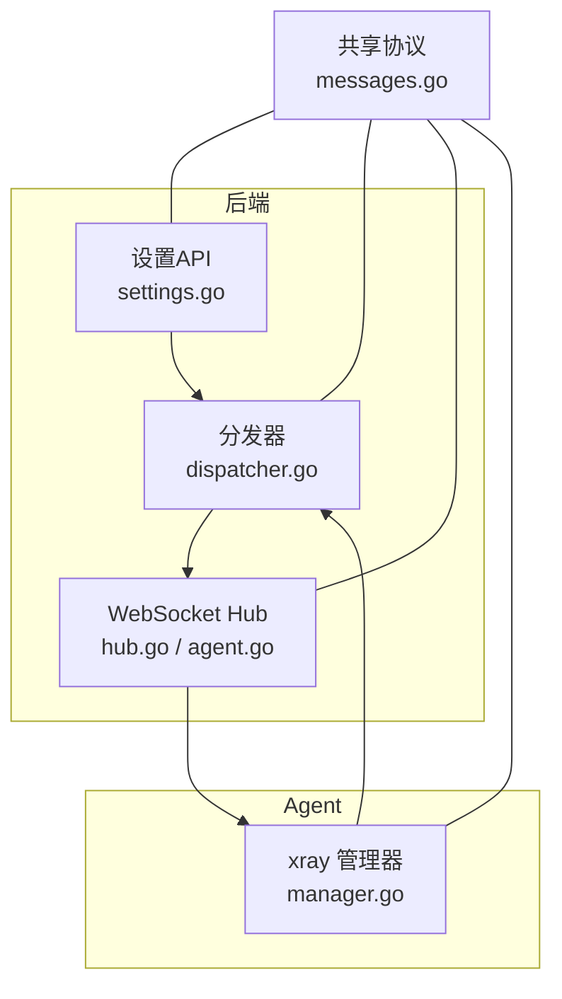
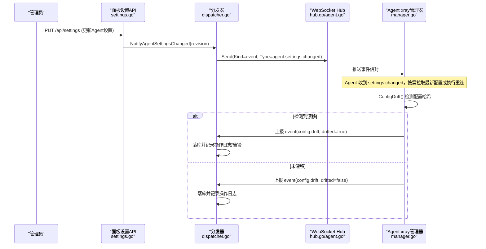
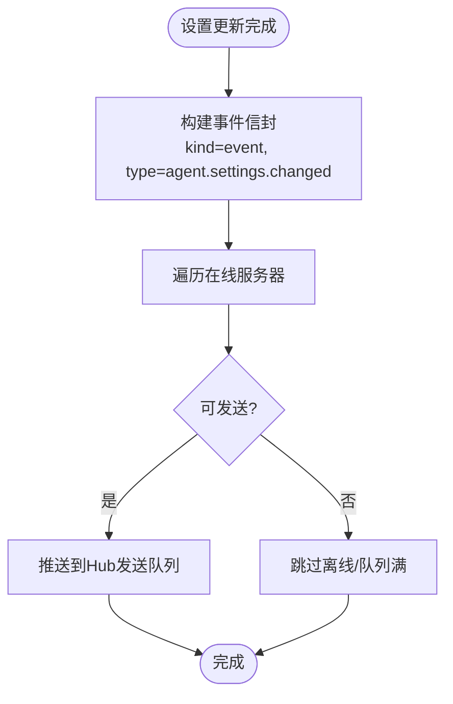
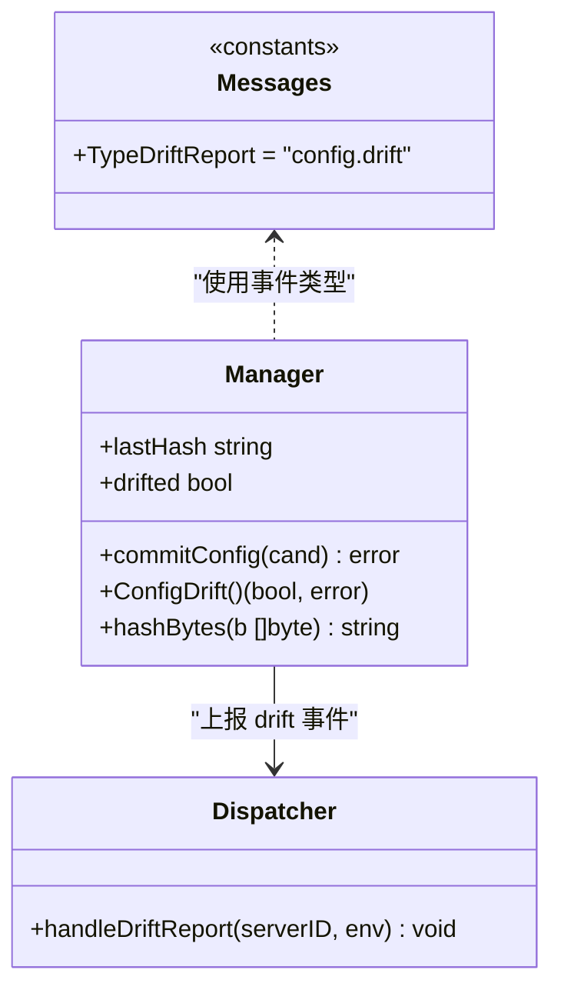
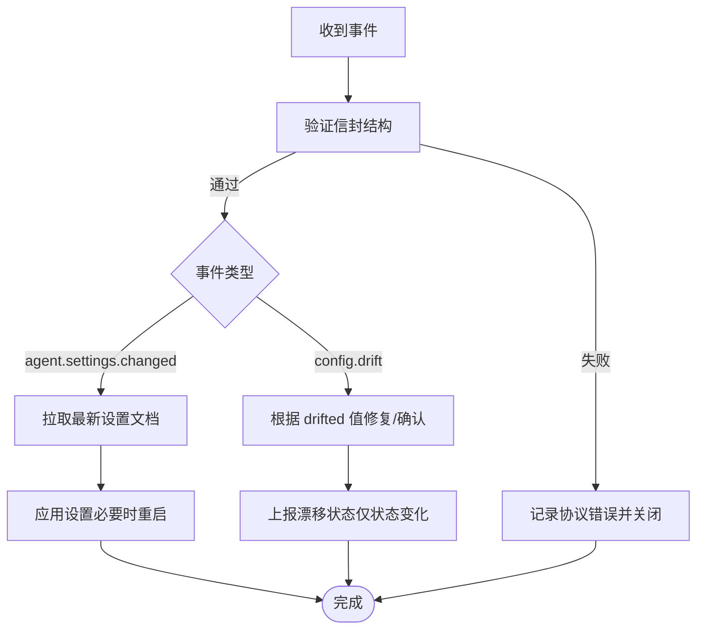
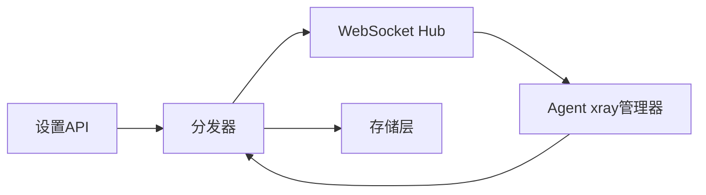

# 配置事件

<cite>
**本文引用的文件**   
- [messages.go](file://src/shared/messages.go)
- [settings.go](file://src/backend/internal/panel/settings.go)
- [dispatcher.go](file://src/backend/internal/dispatch/dispatcher.go)
- [hub.go](file://src/backend/internal/ws/hub.go)
- [agent.go](file://src/backend/internal/ws/agent.go)
- [manager.go](file://src/agent/internal/xray/manager.go)
</cite>

## 目录
1. [简介](#简介)
2. [项目结构](#项目结构)
3. [核心组件](#核心组件)
4. [架构总览](#架构总览)
5. [详细组件分析](#详细组件分析)
6. [依赖关系分析](#依赖关系分析)
7. [性能考量](#性能考量)
8. [故障排查指南](#故障排查指南)
9. [结论](#结论)
10. [附录](#附录)

## 简介
本文件围绕“配置相关事件”展开，重点解释以下主题：
- agent.settings.changed 事件的触发条件与传播路径（运行时设置动态修改、持久化配置变更）
- config.drift 漂移检测的实现原理（配置文件监控机制、外部修改检测、状态同步策略）
- DriftPayload 中 drifted 字段的含义与状态转换逻辑
- 配置事件的优先级处理与批量通知机制
- 配置事件监听的实现示例与最佳实践（含错误处理与数据校验）

## 项目结构
与配置事件相关的代码主要分布在后端面板、WebSocket 传输层、分发器以及 Agent 侧的 xray 管理器中。关键文件职责如下：
- shared/messages.go：定义控制通道信封、事件类型常量与载荷结构（如 agent.settings.changed、config.drift、DriftPayload）
- backend/internal/panel/settings.go：设置页 API 与持久化更新流程，Agent 设置变更时触发通知
- backend/internal/dispatch/dispatcher.go：命令生命周期、事件分发与上报处理（包括 settings changed 广播与 drift report 落库）
- backend/internal/ws/hub.go 与 agent.go：WebSocket Hub 连接管理、消息投递与协议握手
- agent/internal/xray/manager.go：xray 配置文件的受管写入、漂移检测与修复

**图表来源** 
- [settings.go:221-566](file://src/backend/internal/panel/settings.go#L221-L566)
- [dispatcher.go:412-623](file://src/backend/internal/dispatch/dispatcher.go#L412-L623)
- [hub.go:109-138](file://src/backend/internal/ws/hub.go#L109-L138)
- [agent.go:32-237](file://src/backend/internal/ws/agent.go#L32-L237)
- [manager.go:275-303](file://src/agent/internal/xray/manager.go#L275-L303)
- [messages.go:72-91](file://src/shared/messages.go#L72-L91)

**章节来源**
- [settings.go:221-566](file://src/backend/internal/panel/settings.go#L221-L566)
- [dispatcher.go:412-623](file://src/backend/internal/dispatch/dispatcher.go#L412-L623)
- [hub.go:109-138](file://src/backend/internal/ws/hub.go#L109-L138)
- [agent.go:32-237](file://src/backend/internal/ws/agent.go#L32-L237)
- [manager.go:275-303](file://src/agent/internal/xray/manager.go#L275-L303)
- [messages.go:72-91](file://src/shared/messages.go#L72-L91)

## 核心组件
- 共享协议与事件类型
  - 事件类型常量：agent.settings.changed、config.drift、telemetry.report 等
  - 信封 Envelope：统一 RPC/事件封装，包含 kind、type、request_id、trace_id、data
  - DriftPayload：仅包含 drifted 布尔字段，表示是否检测到配置漂移
- 设置更新与通知
  - 设置页 API 在持久化 Agent 设置后，调用分发器的 NotifyAgentSettingsChanged，向在线 Agent 广播 settings changed 事件
- WebSocket 传输
  - Hub 负责连接注册、发送队列与写超时；Agent 端通过 session.open/ready 建立会话
- 分发器
  - 负责将事件以 Kind=Event 形式推送给 Agent；同时处理 Agent 上报的 drift report 并落库
- Agent xray 管理器
  - 对 xray 配置文件进行原子落盘与哈希基线维护；周期性检测漂移并上报

**章节来源**
- [messages.go:72-91](file://src/shared/messages.go#L72-L91)
- [messages.go:234-238](file://src/shared/messages.go#L234-L238)
- [settings.go:507-516](file://src/backend/internal/panel/settings.go#L507-L516)
- [dispatcher.go:521-543](file://src/backend/internal/dispatch/dispatcher.go#L521-L543)
- [hub.go:109-138](file://src/backend/internal/ws/hub.go#L109-L138)
- [agent.go:32-237](file://src/backend/internal/ws/agent.go#L32-L237)
- [manager.go:275-303](file://src/agent/internal/xray/manager.go#L275-L303)

## 架构总览
下图展示了配置事件从面板设置更新到 Agent 接收，再到漂移检测与上报的全链路。

**图表来源** 
- [settings.go:507-516](file://src/backend/internal/panel/settings.go#L507-L516)
- [dispatcher.go:521-543](file://src/backend/internal/dispatch/dispatcher.go#L521-L543)
- [dispatcher.go:594-623](file://src/backend/internal/dispatch/dispatcher.go#L594-L623)
- [manager.go:275-303](file://src/agent/internal/xray/manager.go#L275-L303)
- [messages.go:72-91](file://src/shared/messages.go#L72-L91)

## 详细组件分析

### agent.settings.changed 事件
- 触发条件
  - 当面板设置页更新 Agent 设置（如 Reconnect、Telemetry、DriftDetection 等）并成功持久化后，会调用分发器的 NotifyAgentSettingsChanged，携带新的 revision
  - 该事件为“尽力而为”的推送，Agent 也可在 session.open 与周期轮询中主动拉取设置
- 传播路径
  - 分发器遍历在线服务器，构造 Kind=Event、Type=agent.settings.changed 的信封并通过 WebSocket 推送
  - Hub 将事件放入发送队列，由 writePump 串行写出；若队列满则断开慢连接并重连补发
- 优先级与批量通知
  - 事件属于非阻塞型通知，优先保证低延迟；离线服务器不缓存事件，但会在重连后通过设置同步补齐
  - 批量通知按服务器维度逐个发送，避免单点阻塞影响整体

**图表来源** 
- [dispatcher.go:521-543](file://src/backend/internal/dispatch/dispatcher.go#L521-L543)
- [hub.go:109-138](file://src/backend/internal/ws/hub.go#L109-L138)

**章节来源**
- [settings.go:507-516](file://src/backend/internal/panel/settings.go#L507-L516)
- [dispatcher.go:521-543](file://src/backend/internal/dispatch/dispatcher.go#L521-L543)
- [hub.go:109-138](file://src/backend/internal/ws/hub.go#L109-L138)

### config.drift 漂移检测事件
- 实现原理
  - Agent 侧 Manager 维护最后一次由自身落盘的配置哈希 lastHash 与漂移标记 drifted
  - commitConfig 成功后更新 lastHash 并重置 drifted=false
  - ConfigDrift 读取当前配置文件计算哈希并与 lastHash 比较；首次调用以当前文件为基线；文件不存在视为漂移
- 状态转换逻辑（drifted 字段）
  - drifted=true：检测到外部修改或删除
  - drifted=false：已按受管状态落盘或外部恢复
  - 仅在状态变化时上报，避免重复噪声
- 上报与处理
  - Agent 通过 event(config.drift) 上报 drifted 值
  - 分发器 handleDriftReport 落库，并根据 drifted 值记录操作日志与告警

**图表来源** 
- [manager.go:275-303](file://src/agent/internal/xray/manager.go#L275-L303)
- [dispatcher.go:594-623](file://src/backend/internal/dispatch/dispatcher.go#L594-L623)
- [messages.go:72-91](file://src/shared/messages.go#L72-L91)

**章节来源**
- [manager.go:275-303](file://src/agent/internal/xray/manager.go#L275-L303)
- [dispatcher.go:594-623](file://src/backend/internal/dispatch/dispatcher.go#L594-L623)
- [messages.go:234-238](file://src/shared/messages.go#L234-L238)

### 配置事件监听与处理示例（最佳实践）
- 监听 agent.settings.changed
  - 在 Agent 侧收到事件后，建议立即拉取最新 AgentSettingsDocument，校验 schemaVersion 与 panel 元信息，必要时触发重连或热更新
  - 对 DriftDetection 字段敏感：开启时应定期调用 ConfigDrift 并上报结果
- 处理 config.drift
  - 根据 drifted 值决定修复策略：true 时重新应用受管配置（commitConfig），false 时保持现状
  - 上报前确保 drifted 状态确实发生变化，避免频繁抖动
- 错误处理与数据校验
  - 对 Envelope.Validate 失败的消息应记录协议错误并关闭连接
  - 对 payload 解析失败应返回 INVALID_ARGUMENT，并记录 trace_id 便于追踪
  - 对网络异常与队列满场景，采用重连与重试策略，保证最终一致性

**图表来源** 
- [agent.go:300-327](file://src/backend/internal/ws/agent.go#L300-L327)
- [dispatcher.go:594-623](file://src/backend/internal/dispatch/dispatcher.go#L594-L623)
- [manager.go:275-303](file://src/agent/internal/xray/manager.go#L275-L303)

**章节来源**
- [agent.go:300-327](file://src/backend/internal/ws/agent.go#L300-L327)
- [dispatcher.go:594-623](file://src/backend/internal/dispatch/dispatcher.go#L594-L623)
- [manager.go:275-303](file://src/agent/internal/xray/manager.go#L275-L303)

## 依赖关系分析
- 模块耦合
  - 设置 API 依赖分发器进行事件广播；分发器依赖 WebSocket Hub 进行消息投递
  - Agent xray 管理器依赖文件系统与哈希计算进行漂移检测；上报事件经分发器落库
- 外部依赖
  - WebSocket 协议与心跳机制（Ping/Pong）保障连接健康
  - 存储层用于持久化设置、命令与漂移状态

**图表来源** 
- [settings.go:507-516](file://src/backend/internal/panel/settings.go#L507-L516)
- [dispatcher.go:521-543](file://src/backend/internal/dispatch/dispatcher.go#L521-L543)
- [hub.go:109-138](file://src/backend/internal/ws/hub.go#L109-L138)
- [manager.go:275-303](file://src/agent/internal/xray/manager.go#L275-L303)

**章节来源**
- [settings.go:507-516](file://src/backend/internal/panel/settings.go#L507-L516)
- [dispatcher.go:521-543](file://src/backend/internal/dispatch/dispatcher.go#L521-L543)
- [hub.go:109-138](file://src/backend/internal/ws/hub.go#L109-L138)
- [manager.go:275-303](file://src/agent/internal/xray/manager.go#L275-L303)

## 性能考量
- 事件推送
  - Hub 发送队列长度有限（MVP 场景较小），队列满即断开慢连接，重连后补发，避免背压扩散
  - 事件为尽力推送，离线不缓存，降低内存占用
- 漂移检测
  - 基于 SHA256 哈希计算，开销较低；仅在状态变化时上报，减少网络与存储压力
- 配置落盘
  - 原子替换与备份机制确保一致性；校验失败丢弃临时文件，避免污染运行配置

[本节为通用指导，无需具体文件引用]

## 故障排查指南
- 常见问题
  - 设置变更后 Agent 未收到事件：检查 Hub 发送队列是否满、连接是否在线、分发器是否成功遍历在线服务器
  - 漂移误报：确认 lastHash 是否正确初始化；首次调用以当前文件为基线，停机期间的外部改动无法区分
  - 漂移未清除：确认 drifted=false 时是否重新 commitConfig 并更新 lastHash
- 诊断步骤
  - 查看分发器日志中的 drift report 处理与操作日志
  - 检查 WebSocket 握手与 ping/pong 是否正常
  - 核对 Agent 设置的 DriftDetection 开关与 Reconnect 行为

**章节来源**
- [dispatcher.go:594-623](file://src/backend/internal/dispatch/dispatcher.go#L594-L623)
- [agent.go:100-120](file://src/backend/internal/ws/agent.go#L100-L120)
- [manager.go:275-303](file://src/agent/internal/xray/manager.go#L275-L303)

## 结论
- agent.settings.changed 事件用于在设置变更后快速通知 Agent，结合轮询与重连保证最终一致
- config.drift 漂移检测通过哈希基线与状态机实现，仅在状态变化时上报，兼顾准确性与性能
- 建议在 Agent 侧严格校验事件与载荷，合理处理网络异常与队列满场景，确保系统健壮性

[本节为总结，无需具体文件引用]

## 附录
- 事件类型与载荷参考
  - agent.settings.changed：Revision 标识设置版本
  - config.drift：DriftPayload.Drifted 布尔值
- 关键函数与路径
  - 设置更新与通知：settings.go 的 handleUpdateSettings 与 NotifyAgentSettingsChanged
  - 漂移检测：manager.go 的 ConfigDrift 与 commitConfig
  - 事件分发：dispatcher.go 的 HandleMessage 与 handleDriftReport

**章节来源**
- [settings.go:221-566](file://src/backend/internal/panel/settings.go#L221-L566)
- [dispatcher.go:412-623](file://src/backend/internal/dispatch/dispatcher.go#L412-L623)
- [manager.go:275-303](file://src/agent/internal/xray/manager.go#L275-L303)
- [messages.go:72-91](file://src/shared/messages.go#L72-L91)
- [messages.go:234-238](file://src/shared/messages.go#L234-L238)