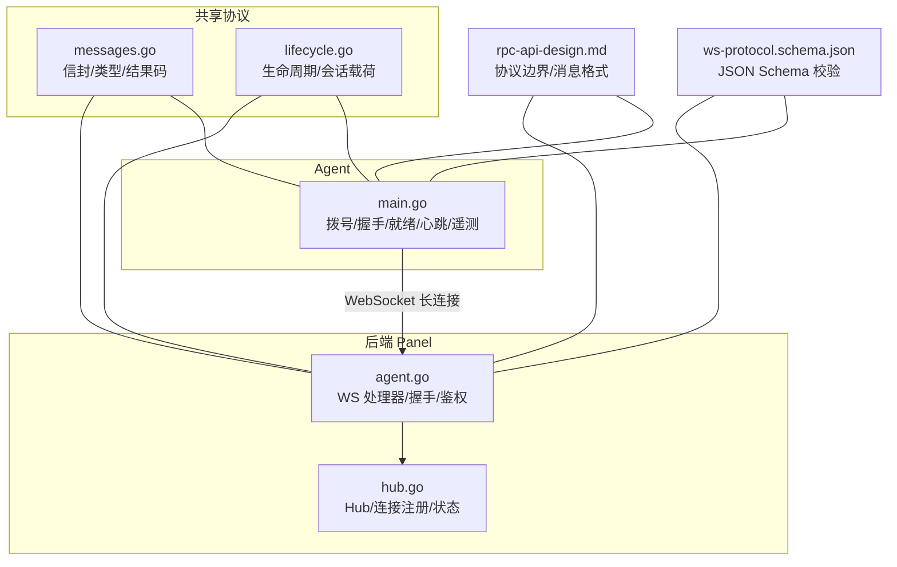
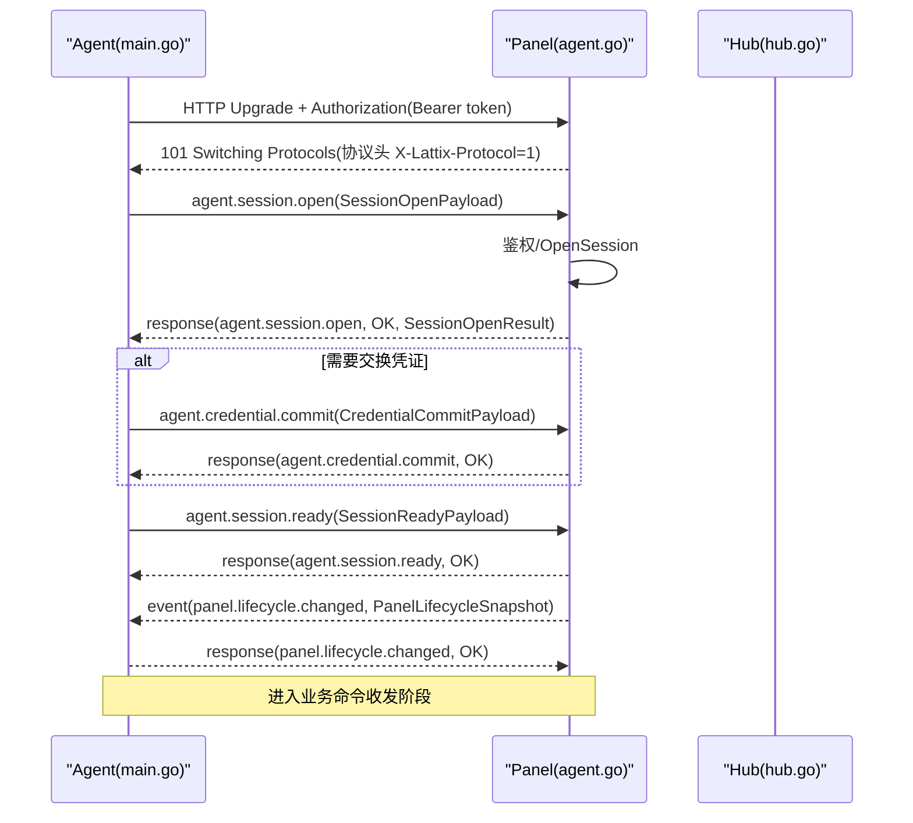
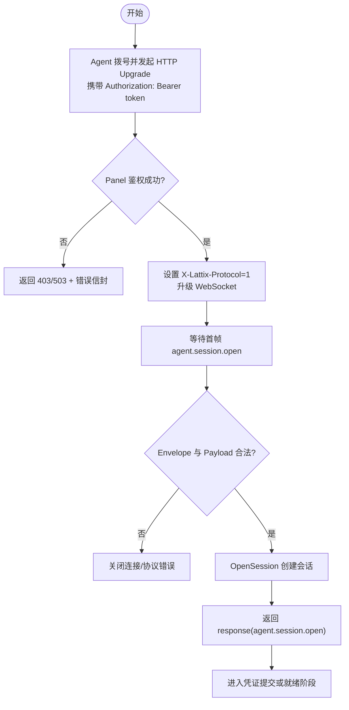
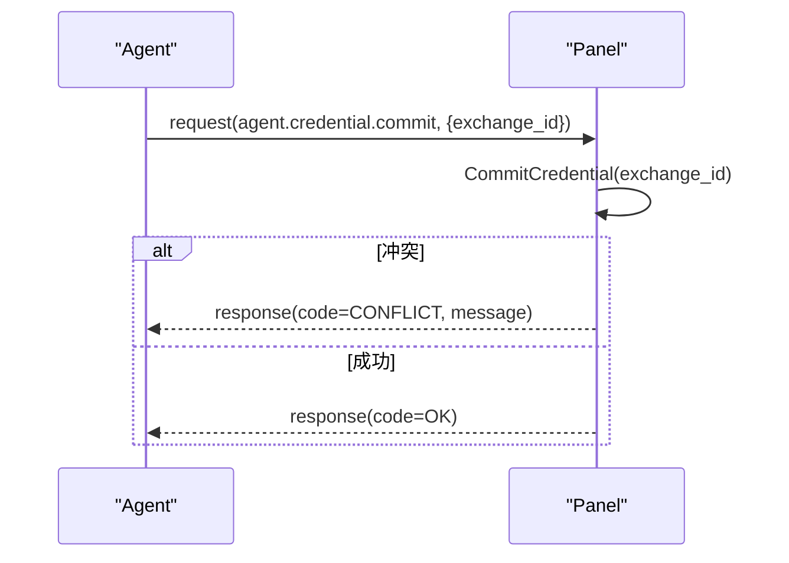
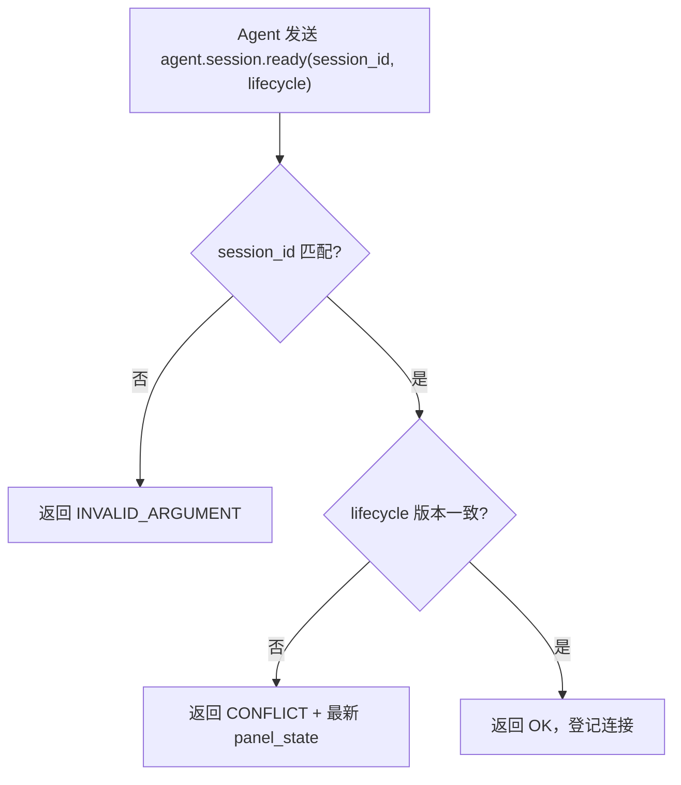
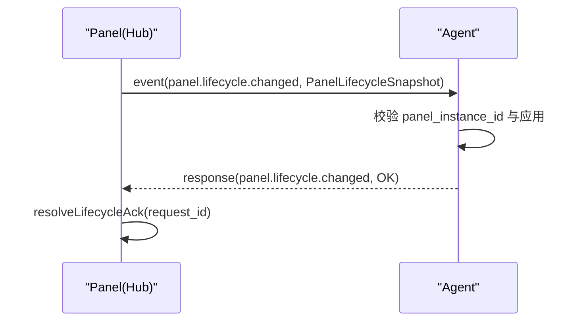
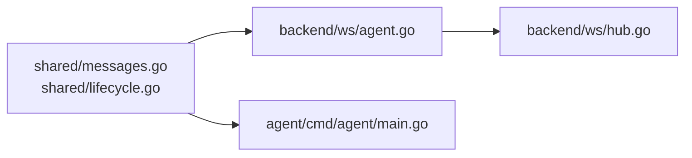
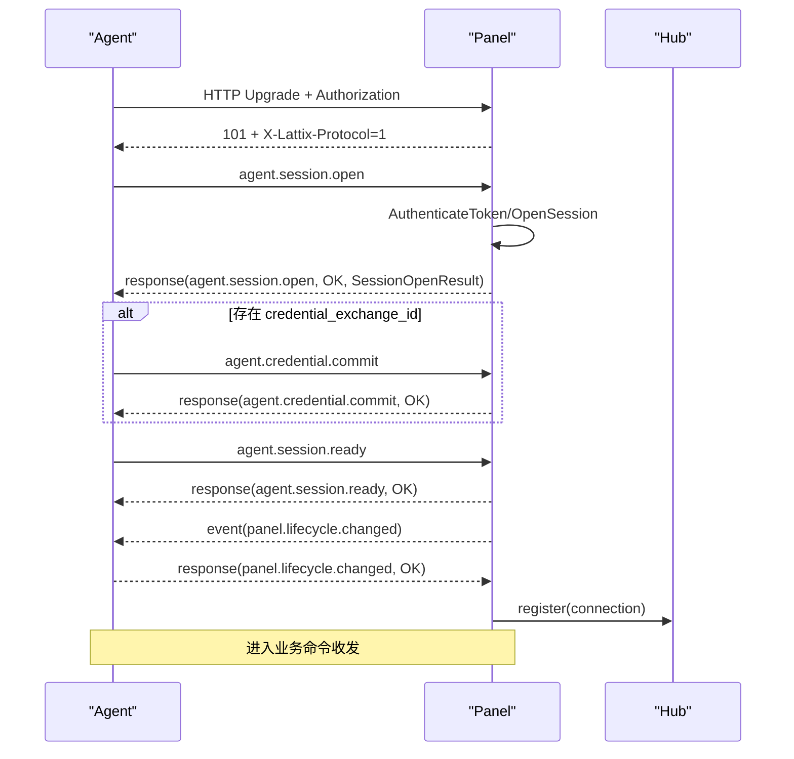

# 会话管理

<cite>
**本文引用的文件**   
- [src/shared/messages.go](file://src/shared/messages.go)
- [src/shared/lifecycle.go](file://src/shared/lifecycle.go)
- [src/backend/internal/ws/agent.go](file://src/backend/internal/ws/agent.go)
- [src/backend/internal/ws/hub.go](file://src/backend/internal/ws/hub.go)
- [src/agent/cmd/agent/main.go](file://src/agent/cmd/agent/main.go)
- [docs/rpc-api-design.md](file://docs/rpc-api-design.md)
- [docs/ws-protocol.schema.json](file://docs/ws-protocol.schema.json)
</cite>

## 目录
1. [简介](#简介)
2. [项目结构](#项目结构)
3. [核心组件](#核心组件)
4. [架构总览](#架构总览)
5. [详细组件分析](#详细组件分析)
6. [依赖关系分析](#依赖关系分析)
7. [性能与可靠性](#性能与可靠性)
8. [故障排查指南](#故障排查指南)
9. [结论](#结论)
10. [附录：时序图与错误处理示例](#附录：时序图与错误处理示例)

## 简介
本文件面向 Lattix-codex Agent 与后端（Panel）之间的 WebSocket 控制通道，聚焦“会话管理”的端到端机制。内容覆盖：
- 会话建立流程：agent.session.open 的发送时机、认证参数与握手过程
- agent.session.ready 响应的含义与后续交互准备
- 生命周期同步：panel.lifecycle.changed 事件触发条件与处理逻辑
- 凭证提交流程：agent.credential.commit 的安全传输与验证
- 会话状态管理与异常恢复：断线重连、超时处理、状态一致性保证
- 完整的会话建立时序图与典型错误处理路径

## 项目结构
与本次文档相关的代码分布在共享协议定义、后端 WS 处理、Agent 主流程以及设计文档中：
- 共享协议与数据结构：src/shared/messages.go、src/shared/lifecycle.go
- 后端 WS Hub 与 Agent 连接处理：src/backend/internal/ws/hub.go、src/backend/internal/ws/agent.go
- Agent 主流程与握手实现：src/agent/cmd/agent/main.go
- 协议契约与设计说明：docs/rpc-api-design.md、docs/ws-protocol.schema.json



**图表来源** 
- [src/shared/messages.go:1-120](file://src/shared/messages.go#L1-L120)
- [src/shared/lifecycle.go:1-86](file://src/shared/lifecycle.go#L1-L86)
- [src/backend/internal/ws/hub.go:1-120](file://src/backend/internal/ws/hub.go#L1-L120)
- [src/backend/internal/ws/agent.go:1-120](file://src/backend/internal/ws/agent.go#L1-L120)
- [src/agent/cmd/agent/main.go:1-200](file://src/agent/cmd/agent/main.go#L1-L200)
- [docs/rpc-api-design.md:280-360](file://docs/rpc-api-design.md#L280-L360)
- [docs/ws-protocol.schema.json:1-120](file://docs/ws-protocol.schema.json#L1-L120)

**章节来源**
- [src/shared/messages.go:1-120](file://src/shared/messages.go#L1-L120)
- [src/shared/lifecycle.go:1-86](file://src/shared/lifecycle.go#L1-L86)
- [src/backend/internal/ws/hub.go:1-120](file://src/backend/internal/ws/hub.go#L1-L120)
- [src/backend/internal/ws/agent.go:1-120](file://src/backend/internal/ws/agent.go#L1-L120)
- [src/agent/cmd/agent/main.go:1-200](file://src/agent/cmd/agent/main.go#L1-L200)
- [docs/rpc-api-design.md:280-360](file://docs/rpc-api-design.md#L280-L360)
- [docs/ws-protocol.schema.json:1-120](file://docs/ws-protocol.schema.json#L1-L120)

## 核心组件
- 信封与消息类型
  - Envelope：统一 RPC 信封，包含 kind/type/request_id/trace_id/data，响应额外携带 code/message
  - 关键 Type：agent.session.open、agent.session.ready、agent.credential.commit、panel.lifecycle.changed
  - 结果码：OK、ACCEPTED、AUTH_REQUIRED、AUTH_INVALID_CREDENTIALS、INVALID_ARGUMENT、CONFLICT、UNSUPPORTED_ACTION、INTERNAL_ERROR、SERVICE_UNAVAILABLE 等
- 生命周期与会话载荷
  - SessionOpenPayload/SessionOpenResult：会话打开请求与结果（含 server_id、session_id、session_kind、issued_token、credential_exchange_id、panel_state）
  - SessionReadyPayload：会话就绪确认（session_id、lifecycle）
  - CredentialCommitPayload：凭证提交（exchange_id）
  - LifecycleChangedPayload：面板生命周期快照推送
- 后端 Hub 与 Agent 连接
  - Hub：连接注册表、在线状态、发送队列、优雅关停、生命周期同步广播
  - agent.go：HTTP Upgrade、鉴权、首帧校验、会话打开、凭证提交、就绪确认、读循环与协议错误上报

**章节来源**
- [src/shared/messages.go:1-120](file://src/shared/messages.go#L1-L120)
- [src/shared/lifecycle.go:56-86](file://src/shared/lifecycle.go#L56-L86)
- [src/backend/internal/ws/hub.go:26-120](file://src/backend/internal/ws/hub.go#L26-L120)
- [src/backend/internal/ws/agent.go:31-120](file://src/backend/internal/ws/agent.go#L31-L120)

## 架构总览
Panel 与 Agent 通过 WebSocket 建立一条双向控制通道。Agent 主动拨号并发起 session.open；Panel 完成鉴权后返回会话结果；随后 Agent 在安全范围内提交凭证并完成 session.ready；此后进入业务命令收发阶段。Panel 可主动推送 panel.lifecycle.changed 以同步面板状态。



**图表来源** 
- [src/agent/cmd/agent/main.go:168-260](file://src/agent/cmd/agent/main.go#L168-L260)
- [src/backend/internal/ws/agent.go:31-120](file://src/backend/internal/ws/agent.go#L31-L120)
- [src/backend/internal/ws/hub.go:230-260](file://src/backend/internal/ws/hub.go#L230-L260)
- [docs/rpc-api-design.md:280-360](file://docs/rpc-api-design.md#L280-L360)

## 详细组件分析

### 会话建立流程（agent.session.open）
- 发送时机
  - Agent 在完成 HTTP Upgrade 后立即发送第一条应用帧为 agent.session.open，作为认证后的首个控制帧
  - 该帧必须严格符合 Envelope 规范，且 data 为 SessionOpenPayload
- 认证参数
  - HTTP 层使用 Authorization: Bearer <token> 进行握手前鉴权
  - Panel 解析 token 并通过 Auth.AuthenticateToken 校验，失败则直接拒绝
- 握手过程
  - Panel 设置协议头 X-Lattix-Protocol=1，升级成功后限制单条消息大小
  - 首次读取设置短超时等待 agent.session.open，否则关闭连接
  - 校验通过后调用 OpenSession，生成 session_id、session_kind、issued_token、credential_exchange_id 及当前 panel_state
  - 将 response(agent.session.open) 回发 Agent



**图表来源** 
- [src/backend/internal/ws/agent.go:31-120](file://src/backend/internal/ws/agent.go#L31-L120)
- [src/agent/cmd/agent/main.go:168-210](file://src/agent/cmd/agent/main.go#L168-L210)

**章节来源**
- [src/backend/internal/ws/agent.go:31-120](file://src/backend/internal/ws/agent.go#L31-L120)
- [src/agent/cmd/agent/main.go:168-210](file://src/agent/cmd/agent/main.go#L168-L210)
- [docs/rpc-api-design.md:280-360](file://docs/rpc-api-design.md#L280-L360)

### 凭证提交流程（agent.credential.commit）
- 触发条件
  - 当 SessionOpenResult 中包含 credential_exchange_id 时，Agent 需在会话就绪前提交凭证
- 安全传输与验证
  - 通过 agent.credential.commit 请求携带 exchange_id
  - Panel 侧 CommitCredential 执行幂等提交，冲突时返回 CONFLICT
  - 成功后返回 OK，允许继续 session.ready



**图表来源** 
- [src/backend/internal/ws/agent.go:158-197](file://src/backend/internal/ws/agent.go#L158-L197)
- [src/agent/cmd/agent/main.go:396-414](file://src/agent/cmd/agent/main.go#L396-L414)

**章节来源**
- [src/backend/internal/ws/agent.go:158-197](file://src/backend/internal/ws/agent.go#L158-L197)
- [src/agent/cmd/agent/main.go:396-414](file://src/agent/cmd/agent/main.go#L396-L414)

### 会话就绪（agent.session.ready）
- 含义
  - Agent 向 Panel 声明自身已准备好接收业务命令，同时附带当前观察到的面板生命周期版本
- 处理逻辑
  - Panel 校验 session_id 与 lifecycle 版本是否一致
  - 若不一致，返回 CONFLICT 并附最新生命周期快照，Agent 需更新本地状态并重试
  - 成功后 Panel 登记连接，进入业务收发阶段



**图表来源** 
- [src/backend/internal/ws/agent.go:181-197](file://src/backend/internal/ws/agent.go#L181-L197)
- [src/agent/cmd/agent/main.go:416-453](file://src/agent/cmd/agent/main.go#L416-L453)

**章节来源**
- [src/backend/internal/ws/agent.go:181-197](file://src/backend/internal/ws/agent.go#L181-L197)
- [src/agent/cmd/agent/main.go:416-453](file://src/agent/cmd/agent/main.go#L416-L453)

### 生命周期同步（panel.lifecycle.changed）
- 触发条件
  - Panel 内部生命周期变化时，通过 Hub.SyncLifecycle 向所有在线 Agent 推送
  - Agent 收到后需校验 panel_instance_id 与本地一致，并应用新快照
- 处理逻辑
  - Agent 应用新的生命周期快照，持久化到状态文件，并回复 OK
  - Panel 侧通过 lifecycleAcks 机制等待 ACK，确保一致性



**图表来源** 
- [src/backend/internal/ws/hub.go:320-378](file://src/backend/internal/ws/hub.go#L320-L378)
- [src/agent/cmd/agent/main.go:534-549](file://src/agent/cmd/agent/main.go#L534-L549)

**章节来源**
- [src/backend/internal/ws/hub.go:320-378](file://src/backend/internal/ws/hub.go#L320-L378)
- [src/agent/cmd/agent/main.go:534-549](file://src/agent/cmd/agent/main.go#L534-L549)

### 会话状态管理与异常恢复
- 连接状态
  - ConnectionStateNeverConnected/Connecting/Reconnecting/Online/Offline/AuthRejected
  - Hub 维护每服务器的连接快照与在线状态
- 断线重连
  - Agent 侧根据重试策略与面板提供的 RetryPolicy 计算退避时间
  - 支持无限/有限重试模式，结合面板生命周期调整延迟窗口
- 超时处理
  - 读超时：无心跳/消息超过 pongTimeoutDefault（默认 90s）判定连接死亡
  - 写超时：单次写操作超时即关闭连接
- 状态一致性
  - session.ready 强校验 lifecycle 版本，避免旧会话参与业务
  - lifecycle.changed 要求 ACK，未 ACK 视为缺失

```mermaid
classDiagram
class Hub {
+IsOnline(serverID) bool
+Send(ctx, serverID, env) error
+BeginDrain()
+SyncLifecycle(ctx, snapshot) []int64
-register(c) (becameOnline, accepted)
-unregister(c)
}
class agentConn {
+send chan Envelope
+done chan struct{}
+registerLifecycleAck(id) <-chan struct{}
+resolveLifecycleAck(id) bool
-close()
-closeWithCode(code, reason)
}
class ConnectionSnapshot {
+State string
+SessionID string
+SessionKind string
+ChangedAt time.Time
}
Hub --> agentConn : "管理连接"
Hub --> ConnectionSnapshot : "维护状态"
```

**图表来源** 
- [src/backend/internal/ws/hub.go:26-120](file://src/backend/internal/ws/hub.go#L26-L120)
- [src/backend/internal/ws/hub.go:280-320](file://src/backend/internal/ws/hub.go#L280-L320)

**章节来源**
- [src/backend/internal/ws/hub.go:26-120](file://src/backend/internal/ws/hub.go#L26-L120)
- [src/backend/internal/ws/hub.go:280-320](file://src/backend/internal/ws/hub.go#L280-L320)
- [src/agent/cmd/agent/main.go:69-98](file://src/agent/cmd/agent/main.go#L69-L98)

## 依赖关系分析
- 共享协议被 Panel 与 Agent 共同引用，确保信封结构与类型一致
- Panel 的 ws.agent 依赖 Hub 进行连接管理与状态同步
- Agent 的主流程依赖 shared 类型构造/解析信封，并实现重试、心跳、遥测等



**图表来源** 
- [src/shared/messages.go:1-120](file://src/shared/messages.go#L1-L120)
- [src/shared/lifecycle.go:1-86](file://src/shared/lifecycle.go#L1-L86)
- [src/backend/internal/ws/agent.go:1-120](file://src/backend/internal/ws/agent.go#L1-L120)
- [src/backend/internal/ws/hub.go:1-120](file://src/backend/internal/ws/hub.go#L1-L120)
- [src/agent/cmd/agent/main.go:1-200](file://src/agent/cmd/agent/main.go#L1-L200)

**章节来源**
- [src/shared/messages.go:1-120](file://src/shared/messages.go#L1-L120)
- [src/shared/lifecycle.go:1-86](file://src/shared/lifecycle.go#L1-L86)
- [src/backend/internal/ws/agent.go:1-120](file://src/backend/internal/ws/agent.go#L1-L120)
- [src/backend/internal/ws/hub.go:1-120](file://src/backend/internal/ws/hub.go#L1-L120)
- [src/agent/cmd/agent/main.go:1-200](file://src/agent/cmd/agent/main.go#L1-L200)

## 性能与可靠性
- 心跳与保活
  - Agent 每 30s 发送 Ping，Panel 原样 Pong 并续期读超时
  - 任意消息到达均续期读超时，避免误判
- 发送缓冲
  - 每连接 256 条缓冲，满则断开连接，重连后补发 queued 命令
- 优雅关停
  - BeginDrain 拒绝新工作并关闭所有连接，促使 Agent 走快速重启重试路径
- 超时策略
  - 写超时 10s，读超时默认 90s，可根据面板配置动态调整

[本节为通用指导，不直接分析具体文件]

## 故障排查指南
- 握手失败
  - 检查 Authorization 是否正确，Panel 是否处于可用状态
  - 关注 writeHandshakeError 返回的状态码与信封 code/message
- 首帧错误
  - 确认第一条应用帧为 agent.session.open，且 data 合法
  - 查看 protocolError 回调记录
- 凭证提交冲突
  - 检查 credential_exchange_id 是否重复提交
  - 关注 CONFLICT 响应与日志
- 会话就绪冲突
  - 核对 lifecycle 版本是否一致，必要时重新拉取最新快照
- 生命周期不同步
  - 检查 panel.lifecycle.changed 的 ACK 是否到达
  - 确认 Panel 的 SyncLifecycle 是否超时或缺失 ACK

**章节来源**
- [src/backend/internal/ws/agent.go:264-300](file://src/backend/internal/ws/agent.go#L264-L300)
- [src/backend/internal/ws/hub.go:320-378](file://src/backend/internal/ws/hub.go#L320-L378)
- [src/agent/cmd/agent/main.go:416-453](file://src/agent/cmd/agent/main.go#L416-L453)

## 结论
Lattix-codex 的会话管理机制通过严格的信封校验、分阶段握手（open→commit→ready）、生命周期同步与 ACK 机制，确保了 Panel 与 Agent 之间的高可靠通信。结合心跳、超时、缓冲与优雅关停策略，系统在异常场景下具备良好的一致性与恢复能力。

[本节为总结性内容，不直接分析具体文件]

## 附录：时序图与错误处理示例

### 完整会话建立时序图


**图表来源** 
- [src/agent/cmd/agent/main.go:168-260](file://src/agent/cmd/agent/main.go#L168-L260)
- [src/backend/internal/ws/agent.go:31-120](file://src/backend/internal/ws/agent.go#L31-L120)
- [src/backend/internal/ws/hub.go:230-260](file://src/backend/internal/ws/hub.go#L230-L260)

### 典型错误处理示例
- 认证失败
  - Panel 返回 403 + AUTH_INVALID_CREDENTIALS
  - Agent 停止自动重试，等待新凭证
- 首帧非 session.open
  - Panel 返回协议错误并关闭连接
- 会话就绪版本冲突
  - Panel 返回 CONFLICT + 最新 panel_state
  - Agent 更新本地状态并重试
- 生命周期 ACK 缺失
  - Hub 记录缺失列表，上层可采取补救措施

**章节来源**
- [src/backend/internal/ws/agent.go:45-59](file://src/backend/internal/ws/agent.go#L45-L59)
- [src/backend/internal/ws/agent.go:88-120](file://src/backend/internal/ws/agent.go#L88-L120)
- [src/backend/internal/ws/agent.go:181-197](file://src/backend/internal/ws/agent.go#L181-L197)
- [src/backend/internal/ws/hub.go:320-378](file://src/backend/internal/ws/hub.go#L320-L378)