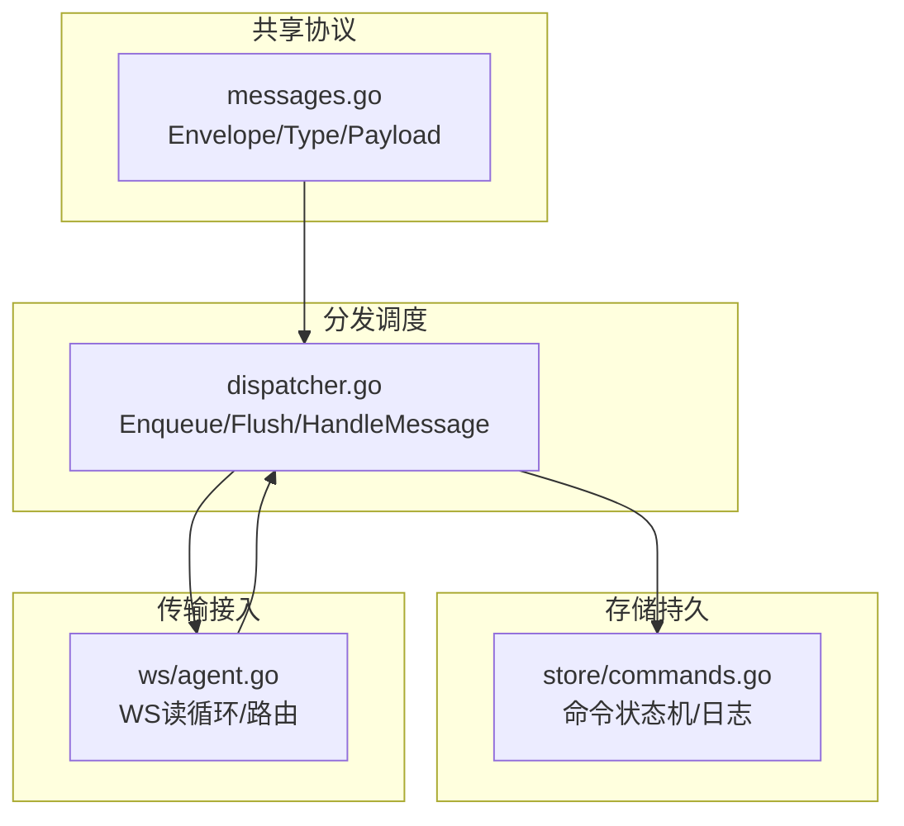
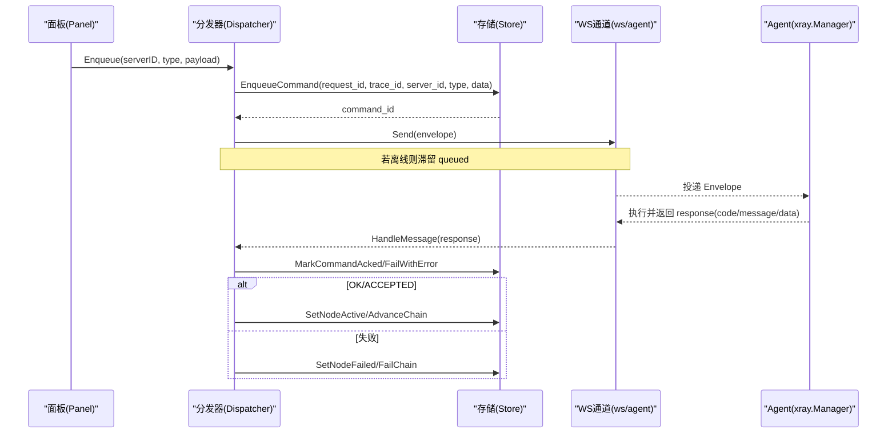
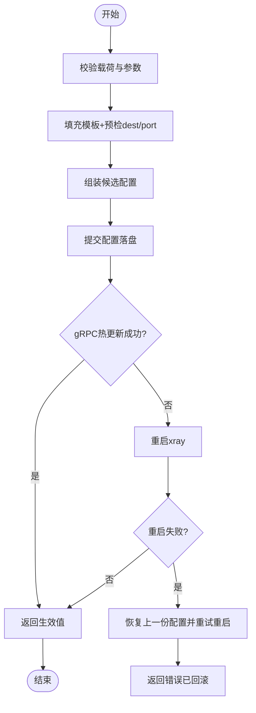
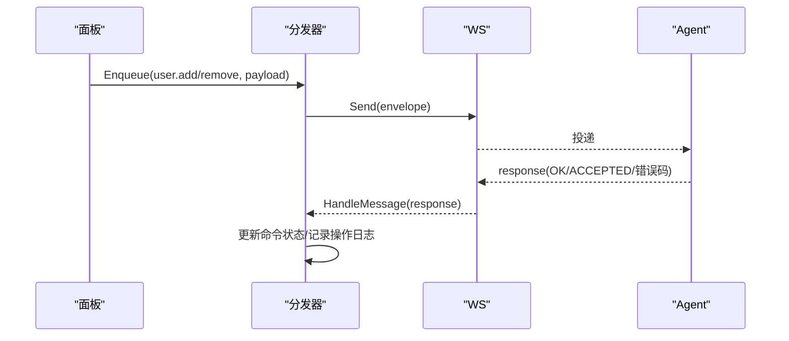
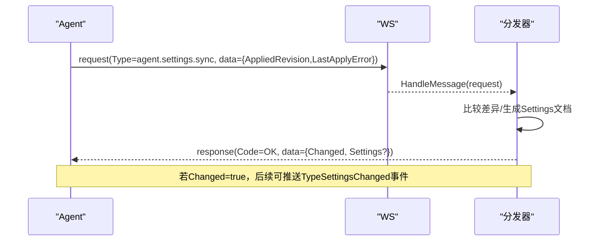
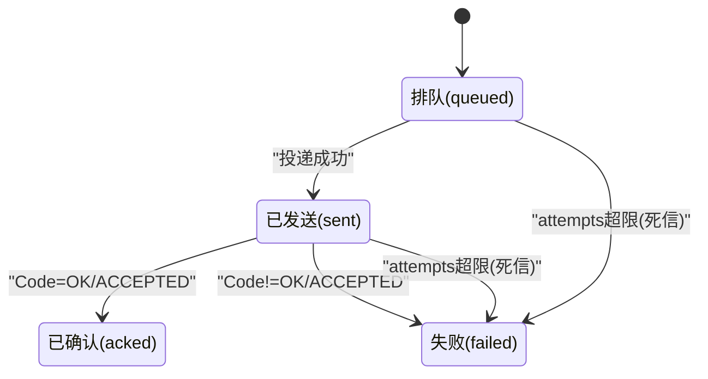
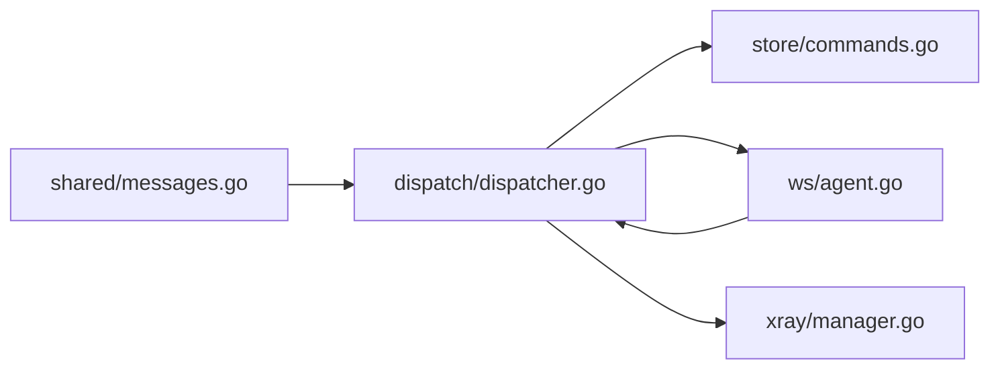

# 命令处理

<cite>
**本文引用的文件**   
- [src/shared/messages.go](file://src/shared/messages.go)
- [src/backend/internal/dispatch/dispatcher.go](file://src/backend/internal/dispatch/dispatcher.go)
- [src/backend/internal/store/commands.go](file://src/backend/internal/store/commands.go)
- [src/backend/internal/ws/agent.go](file://src/backend/internal/ws/agent.go)
- [src/backend/internal/panel/commands.go](file://src/backend/internal/panel/commands.go)
- [src/backend/internal/xray/manager.go](file://src/backend/internal/xray/manager.go)
- [src/backend/internal/panel/servers.go](file://src/backend/internal/panel/servers.go)
- [src/backend/internal/panel/settings.go](file://src/backend/internal/panel/settings.go)
- [src/frontend/src/lib/requester.ts](file://src/frontend/src/lib/requester.ts)
</cite>

## 目录
1. [简介](#简介)
2. [项目结构](#项目结构)
3. [核心组件](#核心组件)
4. [架构总览](#架构总览)
5. [详细组件分析](#详细组件分析)
6. [依赖关系分析](#依赖关系分析)
7. [性能考量](#性能考量)
8. [故障排查指南](#故障排查指南)
9. [结论](#结论)
10. [附录](#附录)

## 简介
本文件面向 Lattix-codex 的命令处理机制，系统性说明从面板到 Agent 的控制通道协议、命令生命周期、异步执行模型（ACCEPTED）、错误码语义与处理策略，以及节点管理（node.apply、node.remove）、用户管理（user.add、user.remove）、配置更新（settings.sync）等关键操作的实现要点。文档同时提供调用时序图、状态机与流程图，帮助读者快速理解并正确使用命令系统。

## 项目结构
命令处理涉及四个层次：
- 共享协议层：定义信封 Envelope、消息类型、载荷结构与通用结果码。
- 分发调度层：负责命令入队、投递、ACK 轮询、死信处理与链路编排联动。
- 存储持久层：命令队列、状态迁移、最近操作日志查询。
- 传输与接入层：WebSocket 连接建立、上行业务信封路由、Agent 会话认证。

图表来源
- [src/shared/messages.go:1-137](file://src/shared/messages.go#L1-L137)
- [src/backend/internal/dispatch/dispatcher.go:1-120](file://src/backend/internal/dispatch/dispatcher.go#L1-L120)
- [src/backend/internal/store/commands.go:1-188](file://src/backend/internal/store/commands.go#L1-L188)
- [src/backend/internal/ws/agent.go:199-239](file://src/backend/internal/ws/agent.go#L199-L239)

章节来源
- [src/shared/messages.go:1-137](file://src/shared/messages.go#L1-L137)
- [src/backend/internal/dispatch/dispatcher.go:1-120](file://src/backend/internal/dispatch/dispatcher.go#L1-L120)
- [src/backend/internal/store/commands.go:1-188](file://src/backend/internal/store/commands.go#L1-L188)
- [src/backend/internal/ws/agent.go:199-239](file://src/backend/internal/ws/agent.go#L199-L239)

## 核心组件
- 共享协议（Envelope/Type/Payload）
  - 统一信封：Kind（request/response/event）、Type（业务动作）、RequestID/TraceID、Code/Message（响应专用）、Data（JSON）。
  - 业务类型：node.apply、node.remove、user.add、user.remove、agent.settings.sync 等。
  - 载荷模型：ApplyNodePayload、RemoveNodePayload、AddUserPayload、RemoveUserPayload、UninstallPayload、ApplyResultPayload 等。
  - 结果码：OK、ACCEPTED、INVALID_ARGUMENT、NOT_FOUND、CONFLICT、OPERATION_LOCKED、UNSUPPORTED_ACTION、INTERNAL_ERROR、UPSTREAM_ERROR、SERVICE_UNAVAILABLE、SERVER_OFFLINE、PORT_OUT_OF_RANGE、UPDATE_IN_PROGRESS。

- 分发器（Dispatcher）
  - 入队与尽力投递：Enqueue → Flush → Send；离线滞留，重连补发。
  - ACK 轮询：waitForCommandACK 基于 request_id 轮询命令终态。
  - 死信与回退：attempts 超限标记 failed，apply_node/chain-hop 特殊回退逻辑。
  - 设置同步：handleAgentSettingsSync 与 NotifyAgentSettingsChanged。

- 存储（Store）
  - 命令状态机：queued → sent → acked|failed；支持 ResetSentCommands、DeadLetterCommand。
  - 操作日志：RecentCommands 返回不敏感字段。

- WebSocket 接入（ws/agent）
  - 读循环：读取 Envelope，区分 Kind/Type，转发至 OnMessage。
  - 生命周期事件：session.open/ready、lifecycle.changed。

章节来源
- [src/shared/messages.go:1-313](file://src/shared/messages.go#L1-L313)
- [src/backend/internal/dispatch/dispatcher.go:1-800](file://src/backend/internal/dispatch/dispatcher.go#L1-L800)
- [src/backend/internal/store/commands.go:1-188](file://src/backend/internal/store/commands.go#L1-L188)
- [src/backend/internal/ws/agent.go:199-239](file://src/backend/internal/ws/agent.go#L199-L239)

## 架构总览
命令从面板发起，经分发器入队并通过 WS 下发至 Agent；Agent 执行后以 response 回执，分发器根据 Code/Message 更新命令状态与节点/链状态。

图表来源
- [src/backend/internal/dispatch/dispatcher.go:50-134](file://src/backend/internal/dispatch/dispatcher.go#L50-L134)
- [src/backend/internal/store/commands.go:36-137](file://src/backend/internal/store/commands.go#L36-L137)
- [src/backend/internal/ws/agent.go:221-239](file://src/backend/internal/ws/agent.go#L221-L239)
- [src/backend/internal/xray/manager.go:109-154](file://src/backend/internal/xray/manager.go#L109-L154)

## 详细组件分析

### 节点管理：node.apply / node.remove
- ApplyNodePayload
  - 字段：revision_id、node_id、config（VirtualConfig）、user_uuids、dest_candidates、port_candidates。
  - 用途：向 Agent 下发虚拟配置模板与用户白名单，Agent 填充占位符、预检 dest、落盘并热更新或重启兜底。
- RemoveNodePayload
  - 字段：node_id。
  - 用途：幂等删除 inbound，清理配置。

图表来源
- [src/backend/internal/xray/manager.go:109-154](file://src/backend/internal/xray/manager.go#L109-L154)
- [src/shared/messages.go:139-154](file://src/shared/messages.go#L139-L154)

章节来源
- [src/shared/messages.go:139-154](file://src/shared/messages.go#L139-L154)
- [src/backend/internal/xray/manager.go:109-154](file://src/backend/internal/xray/manager.go#L109-L154)

### 用户管理：user.add / user.remove
- AddUserPayload
  - 字段：uuid、nodes（map[node_tag]UserNodeParams）。
  - 用途：按节点协议构造 account（vless id+flow、vmess id、trojan password、ss method+password、socks/http），热加入 inbound。
- RemoveUserPayload
  - 字段：uuid、nodes（同 add）。
  - 用途：热移除用户；若协议不支持热删则走重启兜底。

图表来源
- [src/shared/messages.go:156-178](file://src/shared/messages.go#L156-L178)
- [src/backend/internal/dispatch/dispatcher.go:625-730](file://src/backend/internal/dispatch/dispatcher.go#L625-L730)

章节来源
- [src/shared/messages.go:156-178](file://src/shared/messages.go#L156-L178)
- [src/backend/internal/dispatch/dispatcher.go:625-730](file://src/backend/internal/dispatch/dispatcher.go#L625-L730)

### 配置更新：agent.settings.sync
- settings.sync 为 Agent 主动请求，携带 AppliedRevision 与 LastApplyError。
- 面板比较本地 Settings 与 Agent 上报差异，必要时下发新 Settings 文档（含 SchemaVersion、Panel元数据、Agent配置）。
- 变更后可通过事件 TypeSettingsChanged 通知在线 Agent 拉取。

图表来源
- [src/backend/internal/dispatch/dispatcher.go:440-482](file://src/backend/internal/dispatch/dispatcher.go#L440-L482)
- [src/backend/internal/panel/settings.go:468-488](file://src/backend/internal/panel/settings.go#L468-L488)

章节来源
- [src/backend/internal/dispatch/dispatcher.go:440-482](file://src/backend/internal/dispatch/dispatcher.go#L440-L482)
- [src/backend/internal/panel/settings.go:468-488](file://src/backend/internal/panel/settings.go#L468-L488)

### 卸载与重试：uninstall/retry
- UninstallWithRetry：带有限重试预算的卸载 RPC，复用 request_id 保证幂等；即使无 ACK，面板侧删除仍权威有效。
- 重试场景：链重试、节点重试由前端 API 触发，后端通过分发器入队相应命令。

章节来源
- [src/backend/internal/dispatch/dispatcher.go:75-111](file://src/backend/internal/dispatch/dispatcher.go#L75-L111)
- [src/backend/internal/panel/servers.go:808-845](file://src/backend/internal/panel/servers.go#L808-L845)

### 命令生命周期与状态机
- 状态流转：queued → sent → acked|failed；超过 attempts 上限进入 dead-letter（failed）。
- 重连语义：OnAgentConnect 重置 sent→queued 并补发滞留命令。
- 回执归属校验：仅接受与命令所属服务器一致的回执，防串线。

图表来源
- [src/backend/internal/store/commands.go:11-18](file://src/backend/internal/store/commands.go#L11-L18)
- [src/backend/internal/dispatch/dispatcher.go:167-241](file://src/backend/internal/dispatch/dispatcher.go#L167-L241)
- [src/backend/internal/dispatch/dispatcher.go:402-409](file://src/backend/internal/dispatch/dispatcher.go#L402-L409)

章节来源
- [src/backend/internal/store/commands.go:11-188](file://src/backend/internal/store/commands.go#L11-L188)
- [src/backend/internal/dispatch/dispatcher.go:167-241](file://src/backend/internal/dispatch/dispatcher.go#L167-L241)

### 错误码与处理策略
- OK：执行成功，命令置 acked，可能触发节点 active/链推进。
- ACCEPTED：异步接受，命令置 acked，后续通过事件或轮询获取最终结果（如长耗时任务）。
- INVALID_ARGUMENT：参数校验失败，立即失败。
- NOT_FOUND/CONFLICT/OPERATION_LOCKED：资源不存在/冲突/锁定，需客户端重试或修正。
- UNSUPPORTED_ACTION：当前版本/环境不支持该动作。
- INTERNAL_ERROR/UPSTREAM_ERROR/SERVICE_UNAVAILABLE：内部错误或上游不可用，建议重试。
- SERVER_OFFLINE：Agent 离线，投递失败，命令滞留 queued。
- PORT_OUT_OF_RANGE：端口越界，需修正配置。
- UPDATE_IN_PROGRESS：存在进行中的更新，需等待或取消。

章节来源
- [src/shared/messages.go:53-70](file://src/shared/messages.go#L53-L70)
- [src/backend/internal/dispatch/dispatcher.go:625-730](file://src/backend/internal/dispatch/dispatcher.go#L625-L730)

### 前端调用与最佳实践
- 使用 Requester 发起 HTTP/WS 请求，自动处理 requestId/traceId、重试与错误分类。
- 对 ACCEPTED 的业务，应监听后续事件或轮询命令状态，避免误判为失败。
- 对 AUTH_REQUIRED 错误，触发未授权回调（如跳转登录）。

章节来源
- [src/frontend/src/lib/requester.ts:198-220](file://src/frontend/src/lib/requester.ts#L198-L220)

## 依赖关系分析
- Dispatcher 依赖 Store 与 ws.AgentRequester，封装命令生命周期与投递。
- ws/agent 作为接入点，将上行业务信封路由至 Dispatcher.HandleMessage。
- shared.messages 提供两端一致的协议与数据结构。
- xray.Manager 在 Agent 侧实现节点/链配置的落地与热更新。

图表来源
- [src/shared/messages.go:1-137](file://src/shared/messages.go#L1-L137)
- [src/backend/internal/dispatch/dispatcher.go:1-120](file://src/backend/internal/dispatch/dispatcher.go#L1-L120)
- [src/backend/internal/store/commands.go:1-188](file://src/backend/internal/store/commands.go#L1-L188)
- [src/backend/internal/ws/agent.go:199-239](file://src/backend/internal/ws/agent.go#L199-L239)
- [src/backend/internal/xray/manager.go:109-154](file://src/backend/internal/xray/manager.go#L109-L154)

章节来源
- [src/shared/messages.go:1-137](file://src/shared/messages.go#L1-L137)
- [src/backend/internal/dispatch/dispatcher.go:1-120](file://src/backend/internal/dispatch/dispatcher.go#L1-L120)
- [src/backend/internal/store/commands.go:1-188](file://src/backend/internal/store/commands.go#L1-L188)
- [src/backend/internal/ws/agent.go:199-239](file://src/backend/internal/ws/agent.go#L199-L239)
- [src/backend/internal/xray/manager.go:109-154](file://src/backend/internal/xray/manager.go#L109-L154)

## 性能考量
- 批量投递与每服务器锁：Flush 内按服务器加锁避免并发重复投递。
- 指数退避重试：卸载等长耗时操作采用有界重试预算，降低风暴风险。
- 遥测与流量快照：周期上报主机指标与绝对计数器，便于增量统计与丢帧补齐。
- 配置漂移检测：外部修改时上报 drift，减少无效重放。

章节来源
- [src/backend/internal/dispatch/dispatcher.go:167-241](file://src/backend/internal/dispatch/dispatcher.go#L167-L241)
- [src/backend/internal/dispatch/dispatcher.go:553-592](file://src/backend/internal/dispatch/dispatcher.go#L553-L592)
- [src/backend/internal/dispatch/dispatcher.go:594-623](file://src/backend/internal/dispatch/dispatcher.go#L594-L623)

## 故障排查指南
- 查看命令历史：GET /api/servers/{id}/commands?limit=N，返回 ID、RequestID、TraceID、Type、Status、Error、Attempts、时间戳。
- 定位失败原因：命令失败时 error 字段来自 apply_result.error 或死信说明。
- 检查节点状态：apply_node 死信会置节点 failed，链出口失败会定位到跳。
- 重连补发：Agent 重连后 sent 命令重置为 queued 并补发。

章节来源
- [src/backend/internal/panel/commands.go:25-70](file://src/backend/internal/panel/commands.go#L25-L70)
- [src/backend/internal/store/commands.go:139-167](file://src/backend/internal/store/commands.go#L139-L167)
- [src/backend/internal/dispatch/dispatcher.go:402-409](file://src/backend/internal/dispatch/dispatcher.go#L402-L409)

## 结论
Lattix-codex 的命令处理机制以共享协议为核心，结合分发器的健壮投递与状态机、存储层的可靠持久化与操作日志、以及 WS 通道的实时双向通信，实现了高可用的节点/用户/配置管理与链编排。通过 ACCEPTED 异步模型与完善的错误码体系，系统在复杂网络与不稳定环境下仍能保持强一致性与可观测性。

## 附录
- 常用载荷与类型参考路径
  - ApplyNodePayload/RemoveNodePayload/AddUserPayload/RemoveUserPayload/UninstallPayload/ApplyResultPayload：[src/shared/messages.go:139-193](file://src/shared/messages.go#L139-L193)
  - 业务类型常量：[src/shared/messages.go:72-91](file://src/shared/messages.go#L72-L91)
  - 结果码常量：[src/shared/messages.go:53-70](file://src/shared/messages.go#L53-L70)
- 典型调用示例（概念性）
  - 创建节点：POST /api/node/create，后端入队 node.apply，等待 ACK/ACCEPTED。
  - 删除节点：POST /api/node/delete，后端入队 node.remove。
  - 添加用户：POST /api/user/create，后端入队 user.add。
  - 更新设置：面板保存设置后，触发 settings.sync 与可能的 settings.changed 事件。