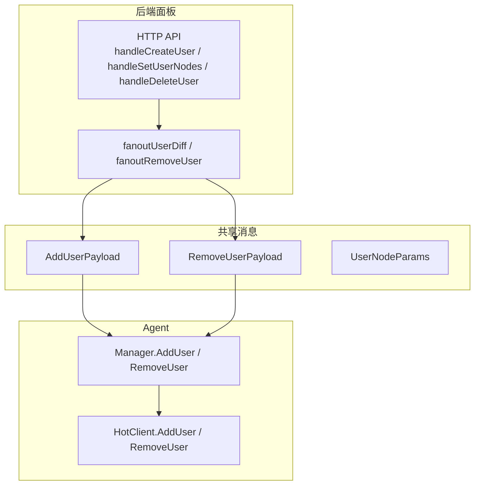
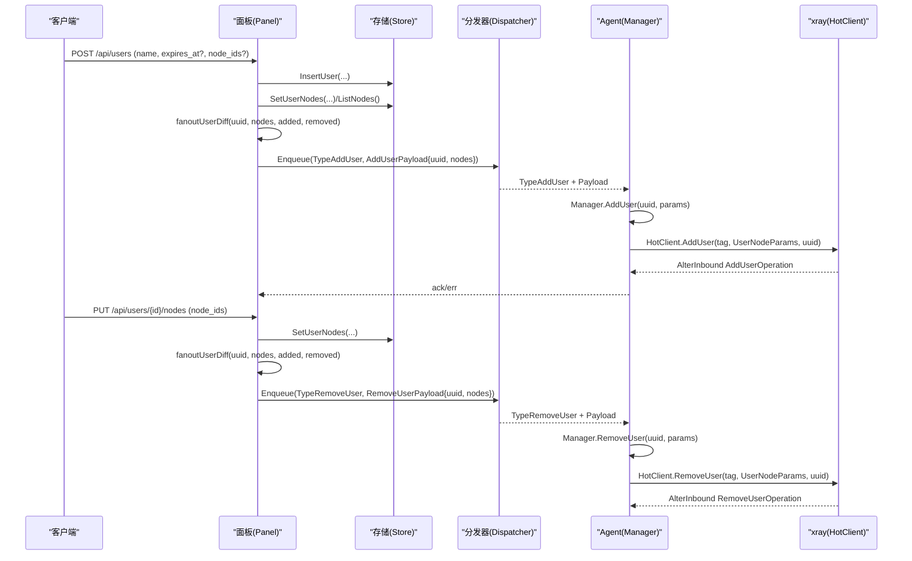
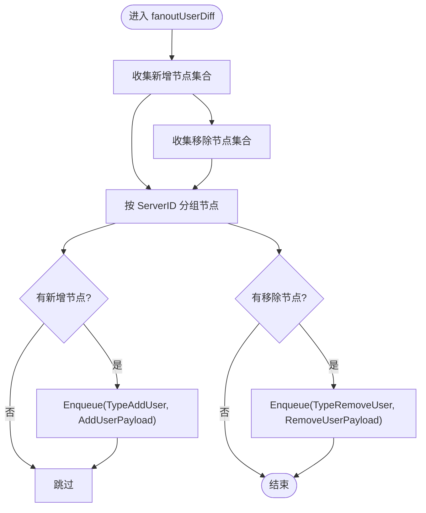
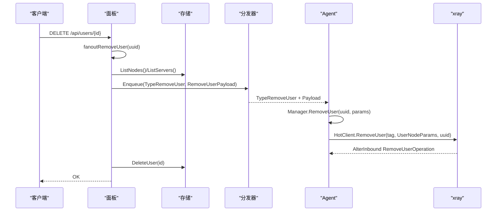
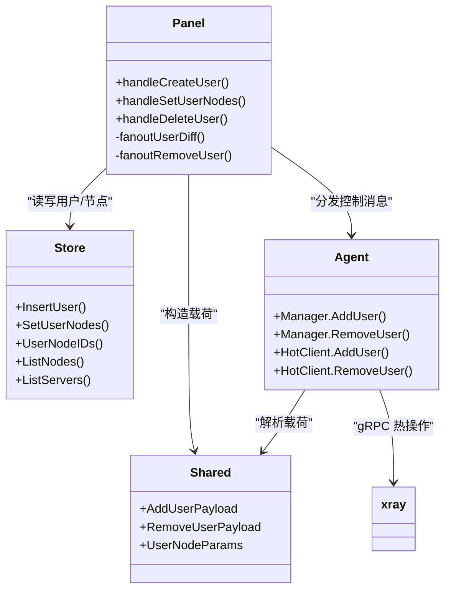

# 用户管理命令

<cite>
**本文引用的文件**   
- [users.go](file://src/backend/internal/panel/users.go)
- [messages.go](file://src/shared/messages.go)
- [config.go](file://src/shared/config.go)
- [hot.go](file://src/agent/internal/xray/hot.go)
- [manager.go](file://src/agent/internal/xray/manager.go)
- [users_store.go](file://src/backend/internal/store/users.go)
</cite>

## 目录
1. [简介](#简介)
2. [项目结构](#项目结构)
3. [核心组件](#核心组件)
4. [架构总览](#架构总览)
5. [详细组件分析](#详细组件分析)
6. [依赖关系分析](#依赖关系分析)
7. [性能考量](#性能考量)
8. [故障排查指南](#故障排查指南)
9. [结论](#结论)
10. [附录：调用示例与协议兼容性](#附录调用示例与协议兼容性)

## 简介
本文件面向“用户管理”相关命令，重点解释 user.add 与 user.remove 的实现机制、载荷结构与协议差异，并说明 dokodemo 节点的特殊处理。文档覆盖以下要点：
- user.add：向指定节点的 inbound 热添加用户；不同协议的账户构造（vless id+flow、vmess id、trojan password 等）。
- user.remove：执行逻辑与热删除支持情况。
- AddUserPayload 与 RemoveUserPayload 的 Nodes 映射和用户参数配置。
- dokodemo 节点无用户概念的处理方式。
- 完整调用示例与协议兼容性说明。

## 项目结构
用户管理涉及后端面板、共享消息定义、Agent 端 xray 热操作以及存储层。关键路径如下：
- 后端面板：HTTP API 接收请求，计算差量并扇出 add_user/remove_user 到 Agent。
- 共享消息：定义 AddUserPayload、RemoveUserPayload、UserNodeParams 等类型。
- Agent：根据协议构造 account，通过 xray gRPC 热操作增删用户。
- 存储层：维护用户、节点分配、有效期与停权标记。

图表来源
- [users.go:287-379](file://src/backend/internal/panel/users.go#L287-L379)
- [messages.go:156-178](file://src/shared/messages.go#L156-L178)
- [manager.go:172-181](file://src/agent/internal/xray/manager.go#L172-L181)
- [hot.go:102-135](file://src/agent/internal/xray/hot.go#L102-L135)

章节来源
- [users.go:1-461](file://src/backend/internal/panel/users.go#L1-L461)
- [messages.go:1-313](file://src/shared/messages.go#L1-L313)
- [config.go:1-206](file://src/shared/config.go#L1-L206)
- [hot.go:1-148](file://src/agent/internal/xray/hot.go#L1-L148)
- [manager.go:109-182](file://src/agent/internal/xray/manager.go#L109-L182)
- [users_store.go:1-276](file://src/backend/internal/store/users.go#L1-L276)

## 核心组件
- 面板侧用户管理接口
  - 创建用户：POST /api/users（可选预选 node_ids）
  - 更新用户：PATCH /api/users/{id}（expires_at、disabled）
  - 设置节点分配：PUT /api/users/{id}/nodes（整体替换）
  - 删除用户：DELETE /api/users/{id}
- 共享消息与参数
  - AddUserPayload：包含 uuid 与 nodes 映射（按 tag → UserNodeParams）
  - RemoveUserPayload：同上
  - UserNodeParams：protocol、flow（vless）、method（shadowsocks）
- Agent 侧热操作
  - Manager.AddUser / RemoveUser：封装 mutateUser
  - HotClient：通过 xray gRPC AlterInbound/AddUserOperation/RemoveUserOperation 实现零重启热操作
- 存储层
  - 用户生命周期、节点分配、有效期与停权标记

章节来源
- [users.go:78-156](file://src/backend/internal/panel/users.go#L78-L156)
- [users.go:287-379](file://src/backend/internal/panel/users.go#L287-L379)
- [messages.go:156-178](file://src/shared/messages.go#L156-L178)
- [manager.go:172-181](file://src/agent/internal/xray/manager.go#L172-L181)
- [hot.go:102-135](file://src/agent/internal/xray/hot.go#L102-L135)
- [users_store.go:118-192](file://src/backend/internal/store/users.go#L118-L192)

## 架构总览
下图展示从面板 API 到 Agent 热操作的端到端流程，包括用户节点分配的差量计算与按服务器分组下发。

图表来源
- [users.go:287-379](file://src/backend/internal/panel/users.go#L287-L379)
- [messages.go:156-178](file://src/shared/messages.go#L156-L178)
- [manager.go:172-181](file://src/agent/internal/xray/manager.go#L172-L181)
- [hot.go:102-135](file://src/agent/internal/xray/hot.go#L102-L135)

## 详细组件分析

### user.add 命令实现与热添加机制
- 触发点
  - 创建用户时可选预选 node_ids，校验存在后写入分配，并调用 fanoutUserDiff 增量扇出 add_user。
  - 更新用户节点分配（PUT /api/users/{id}/nodes）时，计算差量并扇出 add_user/remove_user。
- 差量扇出
  - fanoutUserDiff 将新增节点映射为 AddUserPayload，移除节点映射为 RemoveUserPayload，按服务器分组下发。
- 节点参数构造
  - nodeParamsByServer 遍历节点，解析 VirtualConfig，过滤不支持用户列表的协议（如 dokodemo），生成 map[tag]UserNodeParams。
- Agent 热操作
  - Manager.AddUser 调用 mutateUser(true, params)，HotClient.AddUser 根据 protocol 构造 account：
    - vless：Account{id, flow}
    - vmess：Account{id}
    - trojan：Account{password}
  - 仅 vless/vmess/trojan 支持热操作；其他协议返回错误，由上层回退重启兜底。

图表来源
- [users.go:347-379](file://src/backend/internal/panel/users.go#L347-L379)

章节来源
- [users.go:78-156](file://src/backend/internal/panel/users.go#L78-L156)
- [users.go:287-379](file://src/backend/internal/panel/users.go#L287-L379)
- [hot.go:102-135](file://src/agent/internal/xray/hot.go#L102-L135)
- [manager.go:172-181](file://src/agent/internal/xray/manager.go#L172-L181)

### user.remove 命令执行逻辑与热删除支持
- 触发点
  - 删除用户（DELETE /api/users/{id}）时，先调用 fanoutRemoveUser 扇出 remove_user，再删除数据库记录。
- 扇出策略
  - fanoutRemoveUser 获取所有节点，按服务器分组，仅对含用户节点的服务器下发 remove_user；无用户节点的服务器跳过。
- 热删除能力
  - Agent 侧 HotClient.RemoveUser 使用 AlterInbound RemoveUserOperation，按 email（即 uuid）匹配并移除。
  - 仅 vless/vmess/trojan 支持热操作；其他协议会报错并回退重启。

图表来源
- [users.go:435-460](file://src/backend/internal/panel/users.go#L435-L460)
- [messages.go:173-178](file://src/shared/messages.go#L173-L178)
- [hot.go:108-135](file://src/agent/internal/xray/hot.go#L108-L135)

章节来源
- [users.go:381-412](file://src/backend/internal/panel/users.go#L381-L412)
- [users.go:435-460](file://src/backend/internal/panel/users.go#L435-L460)
- [hot.go:108-135](file://src/agent/internal/xray/hot.go#L108-L135)

### AddUserPayload 与 RemoveUserPayload 的 Nodes 映射与用户参数
- AddUserPayload
  - uuid：用户唯一标识（跨服务器一致）
  - nodes：map[node_tag]UserNodeParams，key 为 NodeTag(nodeID)，value 描述该节点的用户条目构造参数
- RemoveUserPayload
  - 结构与 AddUserPayload 相同，用于热删除
- UserNodeParams
  - protocol：协议名（vless/vmess/trojan/shadowsocks/socks/http/dokodemo-door）
  - flow：vless 专用（如 xtls-rprx-vision）
  - method：shadowsocks 加密方式（如 aes-128-gcm、2022-blake3-*）

章节来源
- [messages.go:156-178](file://src/shared/messages.go#L156-L178)
- [config.go:170-186](file://src/shared/config.go#L170-L186)

### dokodemo 节点的特殊处理与无用户概念支持
- 过滤规则
  - nodeParamsByServer 中通过 HasUserList(protocol) 过滤掉 dokodemo-door 节点，因其无用户概念，不参与用户列表下发。
- 影响范围
  - 创建用户或设置节点分配时，dokodemo 节点不会出现在 AddUserPayload/RemoveUserPayload 的 nodes 映射中。
  - 订阅与模板渲染亦不将其纳入用户列表占位符替换。

章节来源
- [users.go:414-433](file://src/backend/internal/panel/users.go#L414-L433)
- [config.go:100-103](file://src/shared/config.go#L100-L103)

### 协议账户构造与热操作限制
- 账户构造
  - vless：Account{id, flow}
  - vmess：Account{id}
  - trojan：Account{password}
- 热操作限制
  - 仅 vless/vmess/trojan 支持热操作；其他协议（如 shadowsocks、socks、http、dokodemo）在 HotClient.alterUser 中直接报错，由上层回退重启。

章节来源
- [hot.go:137-147](file://src/agent/internal/xray/hot.go#L137-L147)
- [hot.go:113-135](file://src/agent/internal/xray/hot.go#L113-L135)

## 依赖关系分析
- 面板依赖存储层进行用户与节点分配持久化，并通过分发器向 Agent 发送控制消息。
- Agent 依赖 xray gRPC API 实现热操作，失败时回退重启。
- 共享消息类型确保两端数据结构一致。

图表来源
- [users.go:287-379](file://src/backend/internal/panel/users.go#L287-L379)
- [messages.go:156-178](file://src/shared/messages.go#L156-L178)
- [manager.go:172-181](file://src/agent/internal/xray/manager.go#L172-L181)
- [hot.go:102-135](file://src/agent/internal/xray/hot.go#L102-L135)

章节来源
- [users.go:287-379](file://src/backend/internal/panel/users.go#L287-L379)
- [messages.go:156-178](file://src/shared/messages.go#L156-L178)
- [manager.go:172-181](file://src/agent/internal/xray/manager.go#L172-L181)
- [hot.go:102-135](file://src/agent/internal/xray/hot.go#L102-L135)

## 性能考量
- 差量扇出：仅在节点分配变化时下发 add_user/remove_user，避免全量作用。
- 热操作优先：对支持的协议优先走 gRPC 热操作，减少服务中断。
- 回退机制：热操作失败自动回退重启，保障一致性。
- 批量处理：按服务器分组聚合节点参数，减少重复下发。

[本节为通用指导，无需引用具体文件]

## 故障排查指南
- 常见错误
  - 协议不支持热操作：检查 protocol 是否为 vless/vmess/trojan。
  - Nodes 为空或缺失：AddUserPayload/RemoveUserPayload 要求 nodes 非空，否则回执错误。
  - dokodemo 节点未生效：确认节点是否被正确过滤（无用户概念）。
- 定位方法
  - 查看面板日志：fanout 过程中的错误信息。
  - 查看 Agent 日志：AlterInbound 调用结果与回退重启日志。
  - 检查存储层：用户节点分配与有效期/停权标记是否正确。

章节来源
- [users.go:347-379](file://src/backend/internal/panel/users.go#L347-L379)
- [hot.go:113-135](file://src/agent/internal/xray/hot.go#L113-L135)

## 结论
用户管理命令通过面板差量计算与 Agent 热操作实现了高效、可靠的动态用户增删。不同协议的账户构造与热操作限制清晰明确，dokodemo 节点因无用户概念被合理排除。整体设计兼顾性能与稳定性，具备完善的回退与错误处理机制。

[本节为总结性内容，无需引用具体文件]

## 附录：调用示例与协议兼容性

### 调用示例
- 创建用户并预选节点
  - 请求：POST /api/users
  - 载荷：{ name: "alice", expires_at: "2025-12-31T23:59:59Z", node_ids: [1, 2] }
  - 行为：创建用户，校验节点存在，写入分配，扇出 add_user。
- 设置用户节点分配
  - 请求：PUT /api/users/{id}/nodes
  - 载荷：{ user_id: 1, node_ids: [1, 2, 3] }
  - 行为：计算差量，扇出 add_user/remove_user。
- 删除用户
  - 请求：DELETE /api/users/{id}
  - 载荷：{ user_id: 1 }
  - 行为：扇出 remove_user，删除数据库记录。

章节来源
- [users.go:78-156](file://src/backend/internal/panel/users.go#L78-L156)
- [users.go:287-379](file://src/backend/internal/panel/users.go#L287-L379)
- [users.go:381-412](file://src/backend/internal/panel/users.go#L381-L412)

### 协议兼容性说明
- 支持热操作的协议
  - vless：Account{id, flow}
  - vmess：Account{id}
  - trojan：Account{password}
- 不支持热操作的协议
  - shadowsocks、socks、http、dokodemo-door：热操作报错，回退重启。
- dokodemo 节点
  - 无用户概念，不参与用户列表下发。

章节来源
- [hot.go:113-135](file://src/agent/internal/xray/hot.go#L113-L135)
- [config.go:100-103](file://src/shared/config.go#L100-L103)