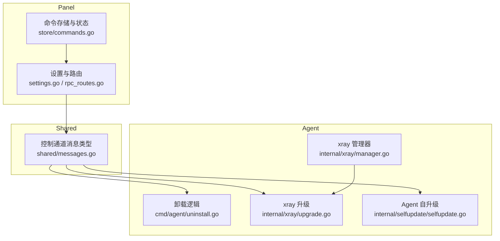
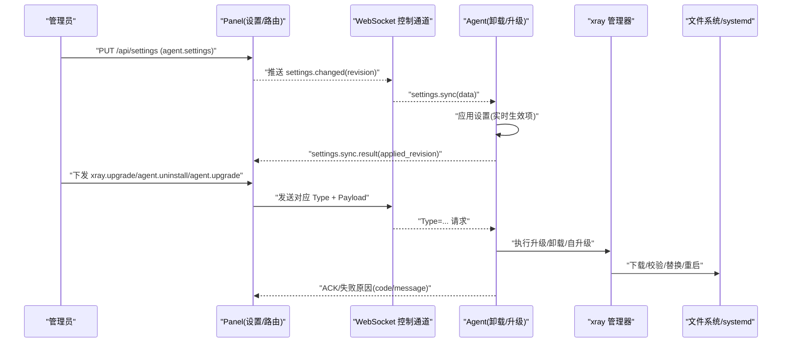
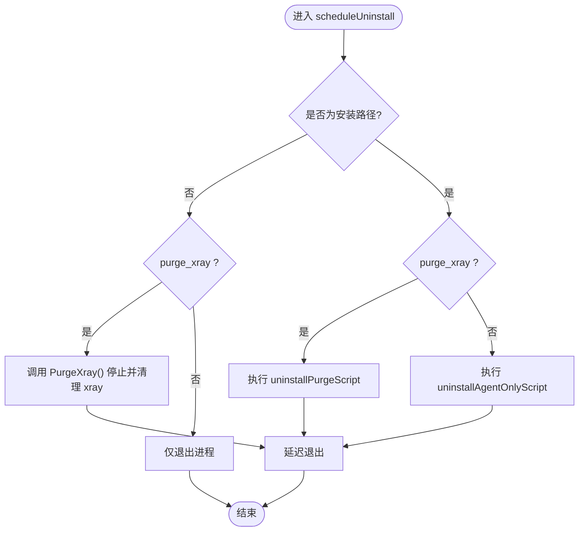
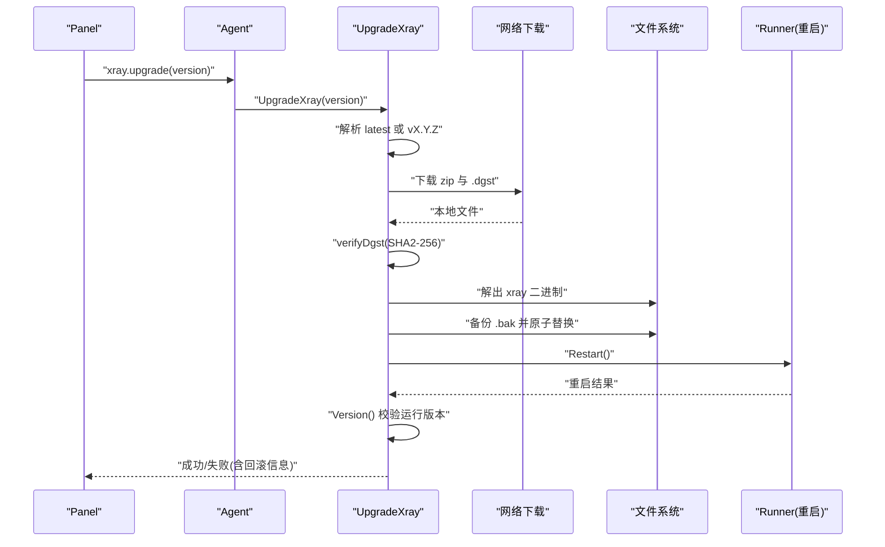
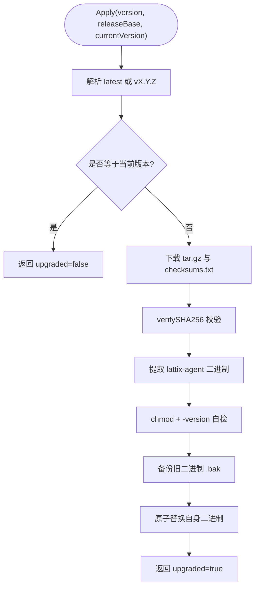
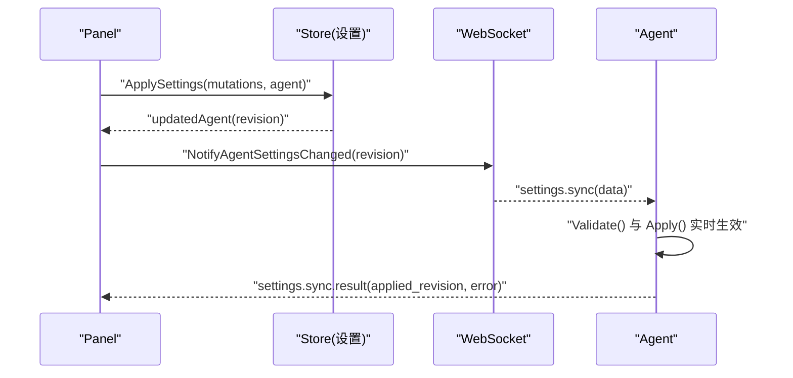
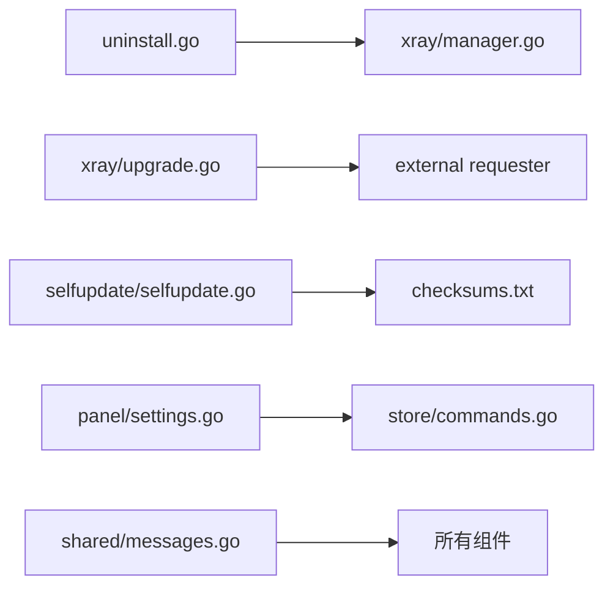

# 系统管理命令

<cite>
**本文引用的文件**   
- [uninstall.go](file://src/agent/cmd/agent/uninstall.go)
- [upgrade.go](file://src/agent/internal/xray/upgrade.go)
- [manager.go](file://src/agent/internal/xray/manager.go)
- [selfupdate.go](file://src/agent/internal/selfupdate/selfupdate.go)
- [messages.go](file://src/shared/messages.go)
- [settings.go](file://src/backend/internal/panel/settings.go)
- [rpc_routes.go](file://src/backend/internal/panel/rpc_routes.go)
- [commands.go](file://src/backend/internal/store/commands.go)
</cite>

## 目录
1. [简介](#简介)
2. [项目结构](#项目结构)
3. [核心组件](#核心组件)
4. [架构总览](#架构总览)
5. [详细组件分析](#详细组件分析)
6. [依赖关系分析](#依赖关系分析)
7. [性能考量](#性能考量)
8. [故障排查指南](#故障排查指南)
9. [结论](#结论)
10. [附录：调用示例与恢复方案](#附录调用示例与恢复方案)

## 简介
本文件面向系统管理员，提供系统管理相关命令的 API 文档与实现说明，重点覆盖以下命令：
- agent.uninstall：卸载 Agent，并可选清理 xray（PurgeXray 参数控制清理范围）
- xray.upgrade：升级 xray，包含版本解析、下载校验与原子替换流程
- agent.upgrade：Agent 自更新机制，基于 ReleaseBase 与 checksums.txt 校验
- settings.sync：配置同步逻辑与实时生效机制

同时说明各命令的执行权限与安全考虑，并提供完整的调用示例与故障恢复方案。

## 项目结构
- Agent 侧负责执行具体系统级操作（xray 管理、二进制替换、进程重启等）
- Panel 侧负责编排命令下发、状态追踪、审计与设置持久化
- Shared 层定义控制通道消息类型与载荷，确保两端协议一致

图表来源
- [settings.go:110-173](file://src/backend/internal/panel/settings.go#L110-L173)
- [rpc_routes.go:33-72](file://src/backend/internal/panel/rpc_routes.go#L33-L72)
- [messages.go:73-91](file://src/shared/messages.go#L73-L91)
- [uninstall.go:24-51](file://src/agent/cmd/agent/uninstall.go#L24-L51)
- [manager.go:25-40](file://src/agent/internal/xray/manager.go#L25-L40)
- [upgrade.go:28-46](file://src/agent/internal/xray/upgrade.go#L28-L46)
- [selfupdate.go:31-57](file://src/agent/internal/selfupdate/selfupdate.go#L31-L57)

章节来源
- [settings.go:110-173](file://src/backend/internal/panel/settings.go#L110-L173)
- [rpc_routes.go:33-72](file://src/backend/internal/panel/rpc_routes.go#L33-L72)
- [messages.go:73-91](file://src/shared/messages.go#L73-L91)

## 核心组件
- 卸载组件（agent.uninstall）
  - 根据安装路径判断是否由 install.sh 安装；非安装路径时仅退出或停止管理的 xray
  - 安装路径下通过脚本执行 systemd 禁用与文件清理；purge_xray=true 时连同 xray 与配置一并清除
- xray 升级组件（xray.upgrade）
  - 支持 latest 与 vX.Y.Z；镜像基址场景跳过 GitHub API 直接走 latest/download
  - 下载 zip 与 .dgst，校验 SHA2-256；备份旧二进制后原子替换，重启并校验运行版本
- Agent 自升级组件（agent.upgrade）
  - 从 release 下载 tar.gz 与 checksums.txt，校验 SHA256；预检新二进制可运行后原子替换自身
  - 返回 upgraded=true 表示已替换，调用方回执后退出，systemd 拉起完成切换
- 设置同步组件（settings.sync）
  - Panel 保存设置并通知变更；Agent 拉取并应用，部分设置即时生效（如 telemetry/drift_detection）

章节来源
- [uninstall.go:24-51](file://src/agent/cmd/agent/uninstall.go#L24-L51)
- [upgrade.go:28-46](file://src/agent/internal/xray/upgrade.go#L28-L46)
- [selfupdate.go:31-57](file://src/agent/internal/selfupdate/selfupdate.go#L31-L57)
- [settings.go:110-173](file://src/backend/internal/panel/settings.go#L110-L173)

## 架构总览
系统管理命令通过 WebSocket 控制通道传递，Panel 负责编排与持久化，Agent 负责执行与回执。

图表来源
- [messages.go:73-91](file://src/shared/messages.go#L73-L91)
- [settings.go:110-173](file://src/backend/internal/panel/settings.go#L110-L173)
- [upgrade.go:28-46](file://src/agent/internal/xray/upgrade.go#L28-L46)
- [uninstall.go:24-51](file://src/agent/cmd/agent/uninstall.go#L24-L51)
- [selfupdate.go:31-57](file://src/agent/internal/selfupdate/selfupdate.go#L31-L57)

## 详细组件分析

### 组件一：agent.uninstall（卸载 Agent）
- 功能要点
  - 若运行路径为安装路径（/opt/lattix-agent/bin/lattix-agent），则调用脚本执行卸载；否则仅退出进程或停止管理的 xray
  - purge_xray=true：删除 xray 二进制、备份与配置文件，并禁用相关服务
  - purge_xray=false：仅移除 Agent 相关文件与服务，保留 xray 继续运行
- 安全与权限
  - 需要 root 权限以操作 systemd 单元与受保护路径
  - 非安装路径运行的 Agent 不得触碰真实安装目录，避免误删
- 错误处理
  - 脚本启动失败记录日志并退出；进程延迟退出确保后台脚本继续执行

图表来源
- [uninstall.go:24-51](file://src/agent/cmd/agent/uninstall.go#L24-L51)
- [manager.go:185-194](file://src/agent/internal/xray/manager.go#L185-L194)

章节来源
- [uninstall.go:24-51](file://src/agent/cmd/agent/uninstall.go#L24-L51)
- [manager.go:185-194](file://src/agent/internal/xray/manager.go#L185-L194)

### 组件二：xray.upgrade（升级 xray）
- 功能要点
  - 版本号解析：latest 在镜像基址场景直接走 latest/download；否则经 GitHub API 解析最新 tag
  - 下载与校验：下载 zip 与 .dgst，计算 SHA2-256 并与官方校验值比对
  - 原子替换：备份旧二进制为 .bak，写入新二进制后重启；重启后校验实际运行版本
  - 回滚机制：任一阶段失败均回滚至 .bak 并尽力重启
- 安全与权限
  - 需要 root 权限以替换二进制与重启服务
  - 严格校验 .dgst 防止篡改包
- 错误处理
  - 下载失败、校验失败、解压失败、替换失败、重启失败均返回错误并回滚

图表来源
- [upgrade.go:28-46](file://src/agent/internal/xray/upgrade.go#L28-L46)
- [upgrade.go:50-113](file://src/agent/internal/xray/upgrade.go#L50-L113)
- [upgrade.go:127-140](file://src/agent/internal/xray/upgrade.go#L127-L140)
- [upgrade.go:148-178](file://src/agent/internal/xray/upgrade.go#L148-L178)

章节来源
- [upgrade.go:28-46](file://src/agent/internal/xray/upgrade.go#L28-L46)
- [upgrade.go:50-113](file://src/agent/internal/xray/upgrade.go#L50-L113)
- [upgrade.go:127-140](file://src/agent/internal/xray/upgrade.go#L127-L140)
- [upgrade.go:148-178](file://src/agent/internal/xray/upgrade.go#L148-L178)

### 组件三：agent.upgrade（Agent 自升级）
- 功能要点
  - 版本解析：latest 需显式仓库推导；镜像基址不支持 latest
  - 下载与校验：下载 tar.gz 与 checksums.txt，校验 SHA256
  - 预检与替换：赋予执行权限并执行 -version 自检；备份并原子替换自身二进制
  - 幂等性：当前版本与目标版本一致时不升级
- 安全与权限
  - 需要 root 权限以替换自身二进制
  - 严格的 checksums.txt 校验与二进制自检，防止坏包导致崩溃循环
- 错误处理
  - 下载失败、校验失败、自检失败、替换失败均返回错误且不替换

图表来源
- [selfupdate.go:31-57](file://src/agent/internal/selfupdate/selfupdate.go#L31-L57)
- [selfupdate.go:116-129](file://src/agent/internal/selfupdate/selfupdate.go#L116-L129)
- [selfupdate.go:131-161](file://src/agent/internal/selfupdate/selfupdate.go#L131-L161)
- [selfupdate.go:169-217](file://src/agent/internal/selfupdate/selfupdate.go#L169-L217)

章节来源
- [selfupdate.go:31-57](file://src/agent/internal/selfupdate/selfupdate.go#L31-L57)
- [selfupdate.go:116-129](file://src/agent/internal/selfupdate/selfupdate.go#L116-L129)
- [selfupdate.go:131-161](file://src/agent/internal/selfupdate/selfupdate.go#L131-L161)
- [selfupdate.go:169-217](file://src/agent/internal/selfupdate/selfupdate.go#L169-L217)

### 组件四：settings.sync（配置同步与实时生效）
- 功能要点
  - Panel 保存设置并生成 revision；Agent 拉取并应用
  - 部分设置即时生效（如 telemetry、drift_detection 间隔），无需重启
  - TLS/ACME 等设置需重启生效，Panel 返回 restart_required 提示
- 安全与权限
  - 设置字段包含敏感信息（证书、密钥、token），API 限制 Content-Type 与 Body 大小，白名单字段记录
- 错误处理
  - 设置校验失败返回错误；Agent 应用失败上报 last_apply_error

图表来源
- [settings.go:110-173](file://src/backend/internal/panel/settings.go#L110-L173)
- [settings.go:222-289](file://src/backend/internal/panel/settings.go#L222-L289)
- [messages.go:73-91](file://src/shared/messages.go#L73-L91)

章节来源
- [settings.go:110-173](file://src/backend/internal/panel/settings.go#L110-L173)
- [settings.go:222-289](file://src/backend/internal/panel/settings.go#L222-L289)
- [messages.go:73-91](file://src/shared/messages.go#L73-L91)

## 依赖关系分析
- 组件耦合
  - Agent 卸载依赖 xray.Manager.PurgeXray 与 systemd 脚本
  - xray 升级依赖外部下载器与 .dgst 校验
  - Agent 自升级依赖 checksums.txt 与二进制自检
  - 设置同步依赖 Panel 的设置持久化与 WS 通知
- 外部依赖
  - GitHub API（latest 解析）、HTTP 下载器、systemd、文件系统

图表来源
- [uninstall.go:24-51](file://src/agent/cmd/agent/uninstall.go#L24-L51)
- [manager.go:185-194](file://src/agent/internal/xray/manager.go#L185-L194)
- [upgrade.go:142-146](file://src/agent/internal/xray/upgrade.go#L142-L146)
- [selfupdate.go:131-161](file://src/agent/internal/selfupdate/selfupdate.go#L131-L161)
- [settings.go:222-289](file://src/backend/internal/panel/settings.go#L222-L289)
- [messages.go:73-91](file://src/shared/messages.go#L73-L91)

章节来源
- [uninstall.go:24-51](file://src/agent/cmd/agent/uninstall.go#L24-L51)
- [manager.go:185-194](file://src/agent/internal/xray/manager.go#L185-L194)
- [upgrade.go:142-146](file://src/agent/internal/xray/upgrade.go#L142-L146)
- [selfupdate.go:131-161](file://src/agent/internal/selfupdate/selfupdate.go#L131-L161)
- [settings.go:222-289](file://src/backend/internal/panel/settings.go#L222-L289)
- [messages.go:73-91](file://src/shared/messages.go#L73-L91)

## 性能考量
- 下载超时：xray 升级单次 HTTP 请求超时 120s；latest 解析 30s
- 原子替换：使用临时文件与 rename 保证一致性，减少停机时间
- 热操作优先：xray 配置变更优先 gRPC 热操作，失败再重启兜底
- 幂等与重试：命令队列支持重发与死信，避免重复执行与丢失

[本节为通用指导，不直接分析具体文件]

## 故障排查指南
- 常见错误
  - 下载失败：检查网络与镜像基址配置
  - 校验失败：确认 .dgst/checksums.txt 可用且哈希匹配
  - 替换失败：检查文件权限与磁盘空间
  - 重启失败：查看 systemd 日志与二进制自检输出
- 命令日志
  - 通过 GET /api/servers/{id}/commands 查询最近命令记录，定位失败原因与尝试次数

章节来源
- [commands.go:140-167](file://src/backend/internal/store/commands.go#L140-L167)

## 结论
系统管理命令通过 Panel 编排与 Agent 执行，结合严格的校验与原子替换机制，确保升级与卸载的安全性与可靠性。settings.sync 提供实时生效的配置同步能力，满足运维灵活性需求。建议在生产环境启用镜像基址与校验文件，以降低网络风险与提升稳定性。

[本节为总结，不直接分析具体文件]

## 附录：调用示例与恢复方案

### 调用示例（概念性）
- agent.uninstall
  - 请求体包含 purge_xray 布尔值，true 时连同 xray 与配置一并清除
- xray.upgrade
  - 请求体包含 version（vX.Y.Z 或 latest），latest 在镜像基址场景直接走 latest/download
- agent.upgrade
  - 请求体包含 version 与可选 release_base；release_base 为空时使用默认仓库
- settings.sync
  - 面板推送 settings.changed 事件，Agent 拉取并应用，返回 applied_revision 与 last_apply_error

### 恢复方案
- xray 升级失败
  - 自动回滚至 .bak 并重启；若仍失败，手动恢复 .bak 并重启
- Agent 自升级失败
  - 未替换二进制；若已替换但自检失败，回退到 .bak 并重启
- 卸载误操作
  - 非安装路径运行的 Agent 不会触碰真实安装；安装路径下可通过脚本恢复 systemd 单元与文件

章节来源
- [messages.go:180-183](file://src/shared/messages.go#L180-L183)
- [messages.go:240-253](file://src/shared/messages.go#L240-L253)
- [upgrade.go:115-124](file://src/agent/internal/xray/upgrade.go#L115-L124)
- [selfupdate.go:105-114](file://src/agent/internal/selfupdate/selfupdate.go#L105-L114)