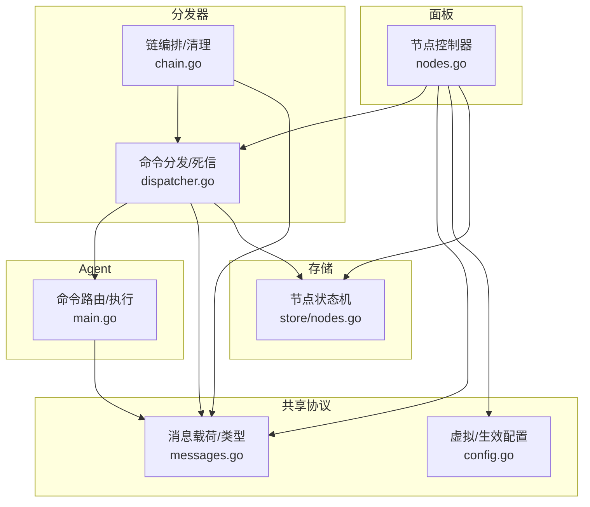
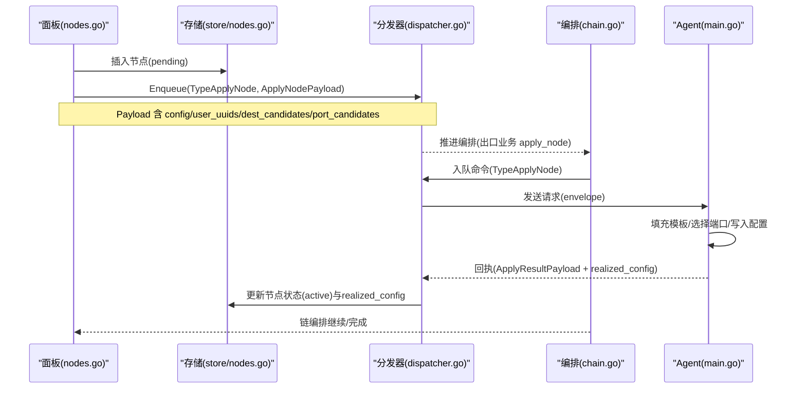
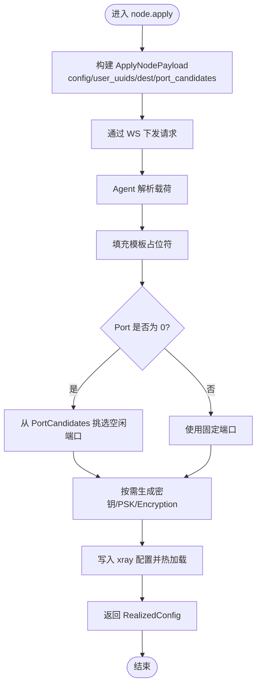
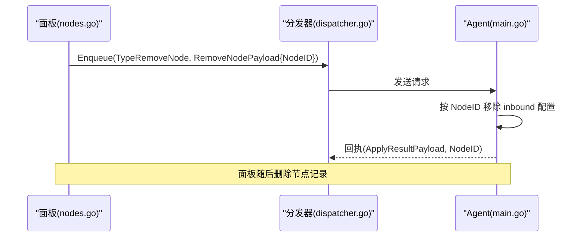
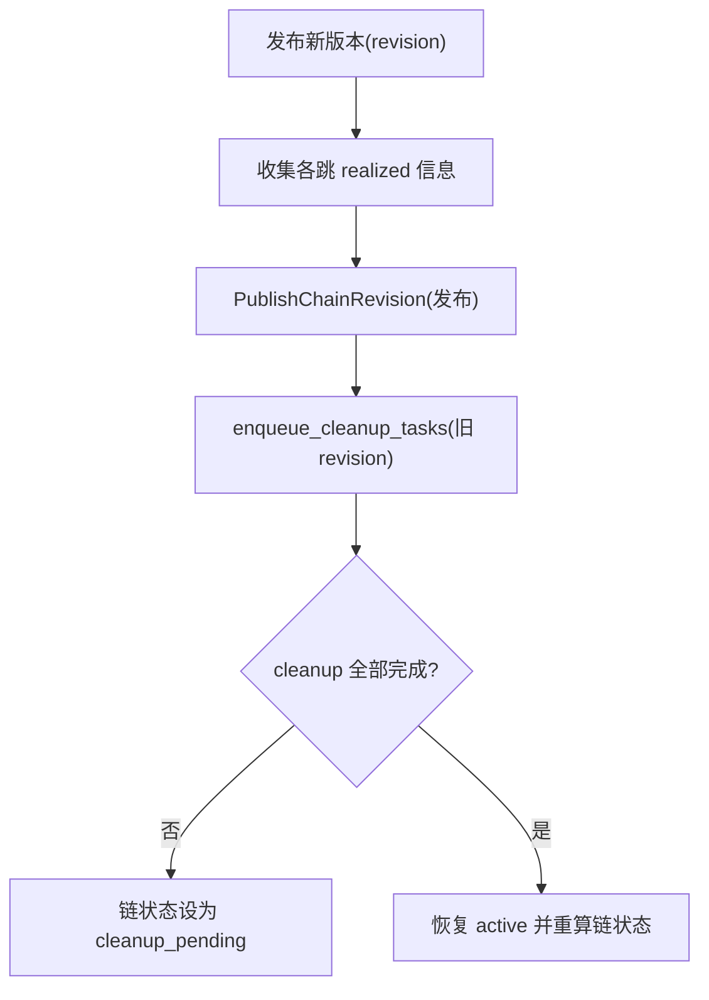
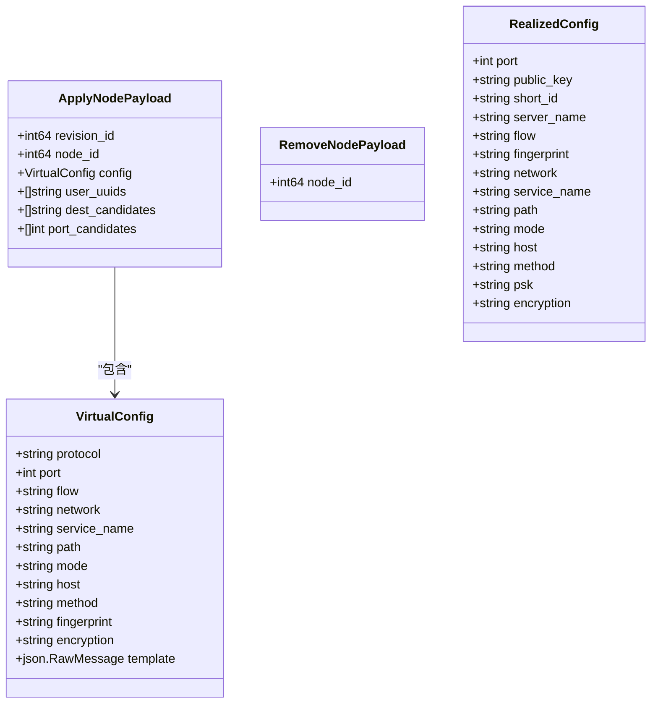

# 节点管理命令

<cite>
**本文引用的文件**   
- [messages.go](file://src/shared/messages.go)
- [config.go](file://src/shared/config.go)
- [nodes.go](file://src/backend/internal/panel/nodes.go)
- [chain.go](file://src/backend/internal/dispatch/chain.go)
- [dispatcher.go](file://src/backend/internal/dispatch/dispatcher.go)
- [main.go](file://src/agent/cmd/agent/main.go)
- [nodes_store.go](file://src/backend/internal/store/nodes.go)
</cite>

## 目录
1. [简介](#简介)
2. [项目结构](#项目结构)
3. [核心组件](#核心组件)
4. [架构总览](#架构总览)
5. [详细组件分析](#详细组件分析)
6. [依赖关系分析](#依赖关系分析)
7. [性能考量](#性能考量)
8. [故障排查指南](#故障排查指南)
9. [结论](#结论)
10. [附录](#附录)

## 简介
本文件为“节点管理”相关命令的 API 文档，重点覆盖 node.apply 与 node.remove 两类命令。内容包含：
- ApplyNodePayload 与 RemoveNodePayload 字段说明与使用场景
- 虚拟配置模板的应用流程、用户 UUID 列表处理策略
- 目标地址候选（dest_candidates）与端口候选（port_candidates）的选择策略
- 节点配置的版本控制与回滚机制
- 完整的调用示例与错误处理方案

## 项目结构
节点管理涉及后端面板（Panel）、分发器（Dispatcher）、Agent 端以及共享协议类型定义。关键路径如下：
- 共享协议与数据结构：src/shared/messages.go、src/shared/config.go
- 面板侧节点创建/删除与下发：src/backend/internal/panel/nodes.go
- 分发编排与重试/死信：src/backend/internal/dispatch/chain.go、dispatcher.go
- Agent 端命令路由与执行：src/agent/cmd/agent/main.go
- 节点持久化状态机：src/backend/internal/store/nodes.go

**图表来源** 
- [nodes.go:196-369](file://src/backend/internal/panel/nodes.go#L196-L369)
- [chain.go:150-222](file://src/backend/internal/dispatch/chain.go#L150-L222)
- [dispatcher.go:200-241](file://src/backend/internal/dispatch/dispatcher.go#L200-L241)
- [main.go:560-601](file://src/agent/cmd/agent/main.go#L560-L601)
- [messages.go:138-154](file://src/shared/messages.go#L138-L154)
- [config.go:172-206](file://src/shared/config.go#L172-L206)
- [nodes_store.go:12-34](file://src/backend/internal/store/nodes.go#L12-L34)

**章节来源**
- [nodes.go:196-369](file://src/backend/internal/panel/nodes.go#L196-L369)
- [chain.go:150-222](file://src/backend/internal/dispatch/chain.go#L150-L222)
- [dispatcher.go:200-241](file://src/backend/internal/dispatch/dispatcher.go#L200-L241)
- [main.go:560-601](file://src/agent/cmd/agent/main.go#L560-L601)
- [messages.go:138-154](file://src/shared/messages.go#L138-L154)
- [config.go:172-206](file://src/shared/config.go#L172-L206)
- [nodes_store.go:12-34](file://src/backend/internal/store/nodes.go#L12-L34)

## 核心组件
- 共享消息与载荷
  - Envelope：统一 RPC 信封（请求/响应/事件），含 code/message
  - TypeApplyNode / TypeRemoveNode：节点应用与移除的命令类型
  - ApplyNodePayload / RemoveNodePayload：节点命令载荷
  - VirtualConfig / RealizedConfig：虚拟配置模板与生效配置
- 面板节点控制器
  - 创建节点：生成虚拟配置模板 → 落库 pending → 入队 apply_node
  - 删除节点：入队 remove_node → 删除记录
  - 重试节点：重新下发 apply_node
- 分发器
  - 编排出口业务 apply_node（携带 dest/port 候选）
  - 死信处理：apply_node 失败置 failed 并定位到链跳
  - 清理旧 revision 时下发 remove_node
- Agent 端
  - 解析 node.apply/node.remove 请求
  - 调用管理器执行应用/移除，返回 realized_config

**章节来源**
- [messages.go:138-154](file://src/shared/messages.go#L138-L154)
- [config.go:172-206](file://src/shared/config.go#L172-L206)
- [nodes.go:196-369](file://src/backend/internal/panel/nodes.go#L196-L369)
- [chain.go:150-222](file://src/backend/internal/dispatch/chain.go#L150-L222)
- [dispatcher.go:200-241](file://src/backend/internal/dispatch/dispatcher.go#L200-L241)
- [main.go:560-601](file://src/agent/cmd/agent/main.go#L560-L601)

## 架构总览
node.apply 端到端时序（从面板到 Agent）：

**图表来源** 
- [nodes.go:328-369](file://src/backend/internal/panel/nodes.go#L328-L369)
- [chain.go:150-222](file://src/backend/internal/dispatch/chain.go#L150-L222)
- [dispatcher.go:227-241](file://src/backend/internal/dispatch/dispatcher.go#L227-L241)
- [main.go:560-568](file://src/agent/cmd/agent/main.go#L560-L568)
- [nodes_store.go:109-115](file://src/backend/internal/store/nodes.go#L109-L115)

## 详细组件分析

### node.apply 命令实现
- 触发点
  - 面板新建节点或重试节点时，构造 VirtualConfig 模板并调用 enqueueApply
  - 链编排阶段对出口业务节点进行 apply_node 下发
- 载荷构建
  - NodeID：目标节点标识
  - Config：VirtualConfig（含 protocol/port/flow/network/service_name/path/mode/host/method/fingerprint/encryption/template）
  - UserUUIDs：该节点关联的全部用户 UUID 列表（用于生成 clients/accounts）
  - DestCandidates：面板内置 dest 白名单（Reality 预检 fallback）
  - PortCandidates：受限 NAT 机监听端口段内候选（当 virtual port=0 时由 Agent 挑选）
- Agent 执行要点
  - 替换模板占位符（PORT/CLIENTS/PRIVATE_KEY/TAG/DECRYPTION）
  - 若 port=0，从 PortCandidates 中挑选空闲端口
  - 生成/校验 Reality 私钥、VLESS Encryption 参数、SS PSK（如适用）
  - 返回 RealizedConfig（port/public_key/short_id/server_name/flow/network/service_name/path/mode/host/method/psk/encryption）

**图表来源** 
- [nodes.go:344-369](file://src/backend/internal/panel/nodes.go#L344-L369)
- [chain.go:170-196](file://src/backend/internal/dispatch/chain.go#L170-L196)
- [main.go:560-568](file://src/agent/cmd/agent/main.go#L560-L568)
- [config.go:172-206](file://src/shared/config.go#L172-L206)

**章节来源**
- [nodes.go:328-369](file://src/backend/internal/panel/nodes.go#L328-L369)
- [chain.go:150-222](file://src/backend/internal/dispatch/chain.go#L150-L222)
- [main.go:560-568](file://src/agent/cmd/agent/main.go#L560-L568)
- [config.go:172-206](file://src/shared/config.go#L172-L206)

### node.remove 命令执行流程与资源清理
- 触发点
  - 面板删除节点：先入队 remove_node，再删除数据库记录
  - 链 revision 清理：旧 revision 对应的服务节点清理任务入队 remove_node
- Agent 执行
  - 根据 NodeID 定位 inbound tag，移除对应配置条目并热重载
  - 幂等：重复删除不报错
- 结果上报
  - 回执 ApplyResultPayload（NodeID 非空，RealizedConfig 为空）

**图表来源** 
- [nodes.go:289-326](file://src/backend/internal/panel/nodes.go#L289-L326)
- [chain.go:516-529](file://src/backend/internal/dispatch/chain.go#L516-L529)
- [main.go:593-601](file://src/agent/cmd/agent/main.go#L593-L601)

**章节来源**
- [nodes.go:289-326](file://src/backend/internal/panel/nodes.go#L289-L326)
- [chain.go:516-529](file://src/backend/internal/dispatch/chain.go#L516-L529)
- [main.go:593-601](file://src/agent/cmd/agent/main.go#L593-L601)

### ApplyNodePayload 与 RemoveNodePayload 字段说明
- ApplyNodePayload
  - revision_id：可选，链修订版 ID（用于编排上下文）
  - node_id：必填，目标节点 ID
  - config：必填，VirtualConfig（含 template 与协议参数）
  - user_uuids：必填，全量用户 UUID 列表（用于生成客户端条目）
  - dest_candidates：可选，Reality dest 白名单（面板内置，随版本更新）
  - port_candidates：可选，受限直连 NAT 机端口段候选（port=0 时由 Agent 挑选）
- RemoveNodePayload
  - node_id：必填，要删除的节点 ID

**章节来源**
- [messages.go:138-154](file://src/shared/messages.go#L138-L154)

### 虚拟配置模板与应用
- 模板占位符
  - PORT：端口占位符（字符串形式，Agent 替换为 JSON 值）
  - CLIENTS：用户列表占位符（按协议生成 clients/accounts）
  - PRIVATE_KEY：Reality 私钥占位符（Agent 生成）
  - TAG：inbound tag 占位符（NodeTag(nodeID)）
  - DECRYPTION：VLESS Encryption 私钥侧占位符（Agent 生成）
- 模板构造
  - 面板根据协议与向导参数生成 inbound JSON 模板（含 streamSettings/sniffing 等）
  - 模板以 json.RawMessage 存储于 nodes.config_template

**章节来源**
- [config.go:149-168](file://src/shared/config.go#L149-L168)
- [nodes.go:390-462](file://src/backend/internal/panel/nodes.go#L390-L462)

### 用户 UUID 列表的处理
- 数据来源：面板查询与该节点关联的用户 UUID 集合
- 用途：按协议生成 clients/accounts 数组（dokodemo 无用户概念）
- 热操作：add_user/remove_user 支持增量热更新；但 node.apply 采用全量替换策略保证一致性

**章节来源**
- [nodes.go:344-369](file://src/backend/internal/panel/nodes.go#L344-L369)
- [messages.go:156-178](file://src/shared/messages.go#L156-L178)

### 目标地址候选（DestCandidates）与端口候选（PortCandidates）
- DestCandidates
  - 面板内置白名单，覆盖全球主要大厂网络（TLS1.3 友好、可达性高）
  - 用于 Reality dest 预检与 fallback（避免滥用 CDN）
- PortCandidates
  - 当 virtual port=0 且服务器 allowed_ports 非空时，由面板展开端口段候选
  - Agent 在候选集中挑选空闲端口并回填 realized_config.port

**章节来源**
- [nodes.go:371-388](file://src/backend/internal/panel/nodes.go#L371-L388)
- [chain.go:176-180](file://src/backend/internal/dispatch/chain.go#L176-L180)

### 节点配置的版本控制与回滚机制
- 版本控制
  - 链编排维护 DesiredRevision/PublishedRevision，发布前收集各跳 realized 信息
  - 发布后仅保留当前有效 revision，旧 revision 进入清理阶段
- 回滚与清理
  - 新 revision 发布后，对旧 revision 的 cleanup 任务入队（remove_node/remove_chain_hop）
  - 清理完成后链恢复 active 状态

**图表来源** 
- [chain.go:356-384](file://src/backend/internal/dispatch/chain.go#L356-L384)
- [chain.go:499-531](file://src/backend/internal/dispatch/chain.go#L499-L531)

**章节来源**
- [chain.go:356-384](file://src/backend/internal/dispatch/chain.go#L356-L384)
- [chain.go:499-531](file://src/backend/internal/dispatch/chain.go#L499-L531)

### 完整调用示例与错误处理
- 创建节点（POST /api/nodes）
  - 请求体：name/server_id/protocol/port(可空)/...（见向导参数）
  - 成功：返回节点 DTO（含 config_template/realized_config 初始为空）
  - 失败：400（参数非法/端口不在允许段）、500（内部错误）
- 重试节点（POST /api/nodes/{id}/retry）
  - 请求体：node_id
  - 作用：重新下发 apply_node（failed/pending 节点）
- 删除节点（DELETE /api/nodes/{id}）
  - 请求体：node_id
  - 行为：入队 remove_node → 删除记录 → 审计日志
- 错误码（Envelope.Code）
  - OK/ACCEPTED/INVALID_ARGUMENT/NOT_FOUND/CONFLICT/OPERATION_LOCKED/UNSUPPORTED_ACTION/INTERNAL_ERROR/UPSTREAM_ERROR/SERVICE_UNAVAILABLE/SERVER_OFFLINE/PORT_OUT_OF_RANGE/UPDATE_IN_PROGRESS

**章节来源**
- [nodes.go:196-326](file://src/backend/internal/panel/nodes.go#L196-L326)
- [messages.go:54-70](file://src/shared/messages.go#L54-L70)

## 依赖关系分析
- 面板 → 分发器：Enqueue(TypeApplyNode/TypeRemoveNode)
- 分发器 → Agent：WS 请求（Envelope.Type + Data）
- Agent → 分发器：回执（ApplyResultPayload）
- 存储：节点状态机（pending/applying/active/failed）与 realized_config 持久化

**图表来源** 
- [messages.go:138-154](file://src/shared/messages.go#L138-L154)
- [config.go:172-206](file://src/shared/config.go#L172-L206)

**章节来源**
- [messages.go:138-154](file://src/shared/messages.go#L138-L154)
- [config.go:172-206](file://src/shared/config.go#L172-L206)

## 性能考量
- 全量用户列表下发：node.apply 采用全量替换策略，确保客户端配置一致性与幂等性
- 端口自动分配：在受限 NAT 环境下，通过 PortCandidates 缩小搜索空间，降低冲突概率
- 死信与重试：apply_node 死信会置 failed 并定位到链跳，避免节点长期卡 applying
- 链编排步进推进：每步仅一个在途 piece，减少并发压力与状态竞争

[本节为通用指导，无需特定文件引用]

## 故障排查指南
- 常见错误码与含义
  - INVALID_ARGUMENT：请求数据格式错误或参数非法
  - NOT_FOUND：节点不存在
  - CONFLICT：端口占用或状态冲突
  - OPERATION_LOCKED：正在更新中
  - INTERNAL_ERROR：内部异常
  - UPSTREAM_ERROR：上游错误（Agent/Xray）
  - SERVICE_UNAVAILABLE：服务不可用
  - SERVER_OFFLINE：Agent 离线
  - PORT_OUT_OF_RANGE：端口超出范围
  - UPDATE_IN_PROGRESS：更新进行中
- 排查步骤
  - 检查节点状态（pending/applying/active/failed）与 error 字段
  - 查看分发器日志（dead-lettered、sent、acked）
  - 确认 dest_candidates/port_candidates 是否合理
  - 验证模板占位符是否正确替换
  - 关注链编排阶段（出口→portal→bridge→forward）

**章节来源**
- [messages.go:54-70](file://src/shared/messages.go#L54-L70)
- [dispatcher.go:200-241](file://src/backend/internal/dispatch/dispatcher.go#L200-L241)
- [nodes_store.go:12-34](file://src/backend/internal/store/nodes.go#L12-L34)

## 结论
node.apply 与 node.remove 构成了节点生命周期管理的核心。通过虚拟配置模板、全量用户列表与候选集策略，系统在复杂网络环境下实现了稳定、可观测、可回滚的节点配置管理。配合分发器的死信与重试机制，以及链编排的版本控制，确保了端到端的一致性与可靠性。

[本节为总结，无需特定文件引用]

## 附录
- 术语
  - VirtualConfig：面板侧虚拟配置模板（含占位符）
  - RealizedConfig：Agent 上报的实际生效配置
  - DestCandidates：Reality dest 白名单
  - PortCandidates：受限 NAT 机端口段候选
- 参考实现路径
  - 面板创建/删除/重试节点：nodes.go
  - 分发编排与清理：chain.go、dispatcher.go
  - Agent 命令路由：main.go
  - 共享数据结构：messages.go、config.go
  - 节点状态机：store/nodes.go

[本节为补充信息，无需特定文件引用]