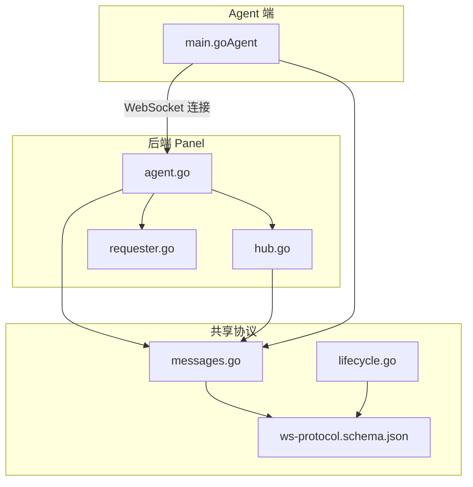
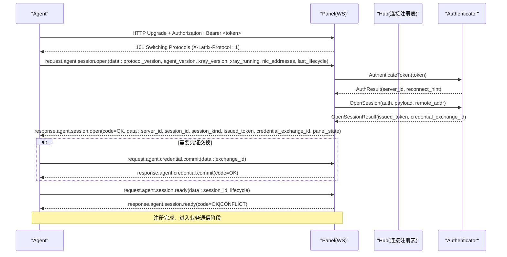
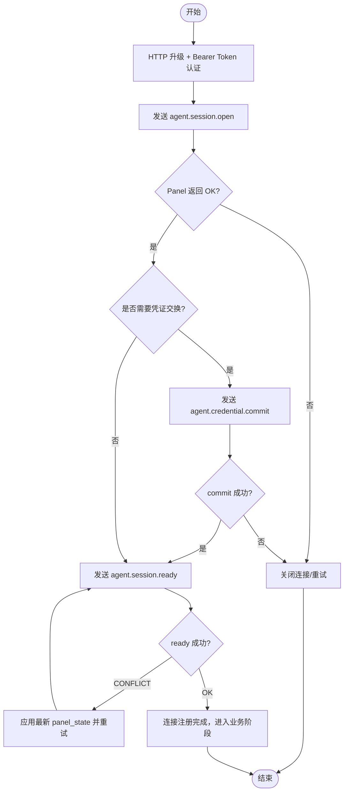
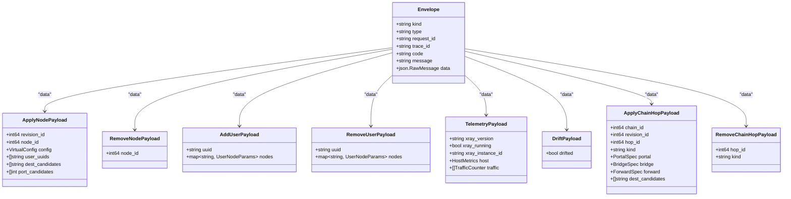
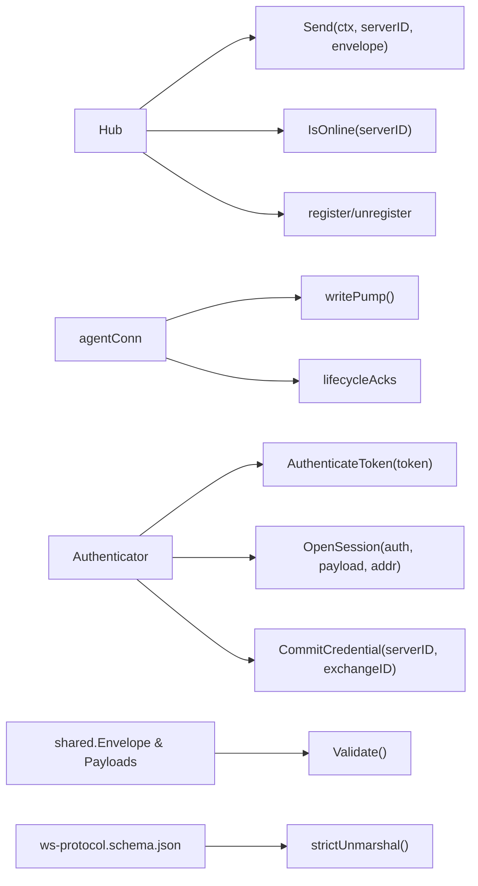

# 通信协议

<cite>
**本文引用的文件**   
- [ws-protocol.schema.json](file://docs/ws-protocol.schema.json)
- [messages.go](file://src/shared/messages.go)
- [lifecycle.go](file://src/shared/lifecycle.go)
- [agent.go](file://src/backend/internal/ws/agent.go)
- [hub.go](file://src/backend/internal/ws/hub.go)
- [requester.go](file://src/backend/internal/ws/requester.go)
- [main.go（Agent）](file://src/agent/cmd/agent/main.go)
</cite>

## 目录
1. [简介](#简介)
2. [项目结构](#项目结构)
3. [核心组件](#核心组件)
4. [架构总览](#架构总览)
5. [详细组件分析](#详细组件分析)
6. [依赖关系分析](#依赖关系分析)
7. [性能考量](#性能考量)
8. [故障排查指南](#故障排查指南)
9. [结论](#结论)
10. [附录：消息示例与调试方法](#附录消息示例与调试方法)

## 简介
本文件为 Lattix-codex Agent 与后端 Panel 之间的 WebSocket 控制通道协议文档。内容涵盖：
- 统一信封结构与消息类型
- 请求-响应模式与事件通知机制
- 会话建立流程（认证握手、生命周期同步、凭证交换）
- 命令类型与处理机制（节点管理、用户管理、配置更新等）
- 错误码与重试策略
- 完整消息示例与调试建议

该协议以 JSON 文本帧承载，所有控制消息均遵循统一的 Envelope 结构，并通过 type 字段标识具体领域动作（domain.action）。

## 项目结构
协议相关代码分布在共享类型定义、后端 WS 实现与 Agent 端实现三部分：
- 共享类型与常量：src/shared/messages.go、src/shared/lifecycle.go
- 后端 WS 端点与会话管理：src/backend/internal/ws/agent.go、hub.go、requester.go
- Agent 端连接与握手流程：src/agent/cmd/agent/main.go
- 协议 Schema：docs/ws-protocol.schema.json

图表来源 
- [messages.go:1-120](file://src/shared/messages.go#L1-L120)
- [lifecycle.go:1-86](file://src/shared/lifecycle.go#L1-L86)
- [ws-protocol.schema.json:1-356](file://docs/ws-protocol.schema.json#L1-L356)
- [agent.go:1-120](file://src/backend/internal/ws/agent.go#L1-L120)
- [hub.go:1-120](file://src/backend/internal/ws/hub.go#L1-L120)
- [requester.go:1-43](file://src/backend/internal/ws/requester.go#L1-L43)
- [main.go（Agent）:160-260](file://src/agent/cmd/agent/main.go#L160-L260)

章节来源
- [messages.go:1-120](file://src/shared/messages.go#L1-L120)
- [lifecycle.go:1-86](file://src/shared/lifecycle.go#L1-L86)
- [ws-protocol.schema.json:1-356](file://docs/ws-protocol.schema.json#L1-L356)
- [agent.go:1-120](file://src/backend/internal/ws/agent.go#L1-L120)
- [hub.go:1-120](file://src/backend/internal/ws/hub.go#L1-L120)
- [requester.go:1-43](file://src/backend/internal/ws/requester.go#L1-L43)
- [main.go（Agent）:160-260](file://src/agent/cmd/agent/main.go#L160-L260)

## 核心组件
- 统一信封 Envelope：包含 kind、type、request_id、trace_id、code、message、data
- 消息种类：request、response、event
- 业务结果码：OK、ACCEPTED、AUTH_REQUIRED、AUTH_INVALID_CREDENTIALS、INVALID_ARGUMENT、NOT_FOUND、CONFLICT、OPERATION_LOCKED、UNSUPPORTED_ACTION、INTERNAL_ERROR、UPSTREAM_ERROR、SERVICE_UNAVAILABLE、SERVER_OFFLINE、PORT_OUT_OF_RANGE、UPDATE_IN_PROGRESS
- 消息类型（部分）：agent.session.open、agent.session.ready、agent.credential.commit、panel.lifecycle.changed、agent.settings.sync、agent.settings.changed、node.apply、node.remove、user.add、user.remove、agent.uninstall、xray.upgrade、agent.upgrade、telemetry.report、config.drift、chain-hop.apply、chain-hop.remove
- 生命周期与连接状态：Panel 生命周期快照、连接状态（never_connected/connecting/reconnecting/online/offline/auth_rejected）、会话类型（initial/reconnect）

章节来源
- [messages.go:47-91](file://src/shared/messages.go#L47-L91)
- [messages.go:112-137](file://src/shared/messages.go#L112-L137)
- [lifecycle.go:5-20](file://src/shared/lifecycle.go#L5-L20)
- [lifecycle.go:22-45](file://src/shared/lifecycle.go#L22-L45)
- [lifecycle.go:56-86](file://src/shared/lifecycle.go#L56-L86)

## 架构总览
Agent 主动发起 WebSocket 连接到 Panel 的 /api/agent/ws。首次应用帧必须是 agent.session.open；随后进行可选的凭证交换与 session.ready 确认；之后进入稳定运行期，双向收发 request/response/event。

图表来源 
- [agent.go:33-120](file://src/backend/internal/ws/agent.go#L33-L120)
- [agent.go:148-197](file://src/backend/internal/ws/agent.go#L148-L197)
- [requester.go:26-43](file://src/backend/internal/ws/requester.go#L26-L43)
- [main.go（Agent）:160-260](file://src/agent/cmd/agent/main.go#L160-L260)
- [main.go（Agent）:396-453](file://src/agent/cmd/agent/main.go#L396-L453)

## 详细组件分析

### 信封与消息格式
- 统一信封字段
  - kind: "request" | "response" | "event"
  - type: 小写字母开头的层级命名（如 node.apply）
  - request_id: 32 位十六进制随机 ID
  - trace_id: 32 位十六进制随机 ID
  - code: 仅 response 携带
  - message: 仅 response 携带
  - data: JSON 对象，按 type 约束
- 校验规则
  - request/event 不得携带 code/message
  - response 必须携带 code/message
  - request_id/trace_id 必须符合 32 位十六进制格式
  - data 必须为合法 JSON

章节来源
- [messages.go:14-45](file://src/shared/messages.go#L14-L45)
- [messages.go:112-137](file://src/shared/messages.go#L112-L137)
- [ws-protocol.schema.json:106-132](file://docs/ws-protocol.schema.json#L106-L132)

### 会话建立流程
- 认证握手
  - HTTP 升级前需携带 Authorization: Bearer <token>
  - Panel 通过 X-Lattix-Protocol 头返回协议版本
  - 失败时返回带 Code 的 JSON 响应（如 AUTH_INVALID_CREDENTIALS、SERVICE_UNAVAILABLE）
- 首次应用帧
  - Agent 发送 agent.session.open，包含协议版本、Agent/Xray 版本、NIC 地址、上次生命周期版本
  - Panel 验证并调用 Authenticator.OpenSession，返回 server_id、session_id、session_kind、issued_token、credential_exchange_id、panel_state
- 凭证交换（可选）
  - 若存在 credential_exchange_id，Agent 发送 agent.credential.commit，Panel 确认后返回 OK
- 生命周期同步
  - Agent 发送 agent.session.ready，附带当前 session_id 与生命周期版本
  - Panel 校验生命周期是否变更，可能返回 CONFLICT 并附带最新 panel_state，Agent 需应用后重试
- 注册完成
  - 成功后 Panel 登记连接，后续可接收业务命令与事件

图表来源 
- [agent.go:33-120](file://src/backend/internal/ws/agent.go#L33-L120)
- [agent.go:148-197](file://src/backend/internal/ws/agent.go#L148-L197)
- [main.go（Agent）:160-260](file://src/agent/cmd/agent/main.go#L160-L260)
- [main.go（Agent）:396-453](file://src/agent/cmd/agent/main.go#L396-L453)

章节来源
- [agent.go:33-120](file://src/backend/internal/ws/agent.go#L33-L120)
- [agent.go:148-197](file://src/backend/internal/ws/agent.go#L148-L197)
- [main.go（Agent）:160-260](file://src/agent/cmd/agent/main.go#L160-L260)
- [main.go（Agent）:396-453](file://src/agent/cmd/agent/main.go#L396-L453)

### 命令类型与处理机制
- 节点管理
  - node.apply：下发虚拟配置模板与用户 UUID 列表，Agent 执行并返回 realized_config
  - node.remove：移除指定节点
- 用户管理
  - user.add：向指定节点的 inbound 热加入用户条目
  - user.remove：从指定节点的 inbound 热移除用户条目
- 配置更新
  - agent.uninstall：卸载 Agent（可选择清理 xray）
  - xray.upgrade：升级 xray 到指定版本或 latest
  - agent.upgrade：升级 Agent 自身二进制
- 链式跳配置
  - chain-hop.apply：按 Kind（portal/bridge/forward）下发配置件
  - chain-hop.remove：逐条删除链式跳配置
- 遥测与漂移
  - telemetry.report：周期性上报主机指标与流量计数器（无需回执）
  - config.drift：配置文件被外部修改时上报

图表来源 
- [messages.go:139-313](file://src/shared/messages.go#L139-L313)

章节来源
- [messages.go:73-91](file://src/shared/messages.go#L73-L91)
- [messages.go:139-313](file://src/shared/messages.go#L139-L313)

### 事件通知机制
- panel.lifecycle.changed：Panel 生命周期变化事件，Agent 需应用最新 panel_state 并回 ACK
- agent.settings.changed：Agent 设置变更事件，触发 Agent 拉取最新 settings
- telemetry.report：Agent 周期上报遥测数据（无需回执）
- config.drift：Agent 检测到配置漂移时上报

章节来源
- [messages.go:73-91](file://src/shared/messages.go#L73-L91)
- [messages.go:195-238](file://src/shared/messages.go#L195-L238)
- [agent.go:231-238](file://src/backend/internal/ws/agent.go#L231-L238)

### 错误处理与重试策略
- 错误码语义
  - 认证类：AUTH_REQUIRED、AUTH_INVALID_CREDENTIALS
  - 参数类：INVALID_ARGUMENT
  - 资源类：NOT_FOUND
  - 冲突类：CONFLICT（常用于生命周期版本不一致）
  - 操作类：OPERATION_LOCKED、UPDATE_IN_PROGRESS
  - 服务类：SERVICE_UNAVAILABLE、SERVER_OFFLINE、UPSTREAM_ERROR、INTERNAL_ERROR
- 网络异常与重连
  - Agent 侧根据 close_code 与失败次数计算退避时间
  - 服务重启场景使用特定 close_code（如 1012），Agent 走快速重连路径
- 认证失败
  - Panel 在握手阶段拒绝时返回明确 code/message，Agent 停止无限重试
- 版本冲突
  - session.ready 返回 CONFLICT 时，Agent 应用最新 panel_state 后重试

章节来源
- [messages.go:54-70](file://src/shared/messages.go#L54-L70)
- [agent.go:264-274](file://src/backend/internal/ws/agent.go#L264-L274)
- [main.go（Agent）:396-453](file://src/agent/cmd/agent/main.go#L396-L453)
- [main.go（Agent）:86-101](file://src/agent/cmd/agent/main.go#L86-L101)

## 依赖关系分析
- Hub 作为连接注册中心，提供 Send/IsOnline 能力，屏蔽连接细节
- Authenticator 接口负责 token 校验与 session 打开
- shared.Envelope 与各类 Payload 由两端共享，确保协议一致性
- ws-protocol.schema.json 用于严格校验消息结构

图表来源 
- [hub.go:110-154](file://src/backend/internal/ws/hub.go#L110-L154)
- [hub.go:282-318](file://src/backend/internal/ws/hub.go#L282-L318)
- [hub.go:398-413](file://src/backend/internal/ws/hub.go#L398-L413)
- [requester.go:18-43](file://src/backend/internal/ws/requester.go#L18-L43)
- [messages.go:112-137](file://src/shared/messages.go#L112-L137)
- [agent.go:316-329](file://src/backend/internal/ws/agent.go#L316-L329)

章节来源
- [hub.go:110-154](file://src/backend/internal/ws/hub.go#L110-L154)
- [hub.go:282-318](file://src/backend/internal/ws/hub.go#L282-L318)
- [hub.go:398-413](file://src/backend/internal/ws/hub.go#L398-L413)
- [requester.go:18-43](file://src/backend/internal/ws/requester.go#L18-L43)
- [messages.go:112-137](file://src/shared/messages.go#L112-L137)
- [agent.go:316-329](file://src/backend/internal/ws/agent.go#L316-L329)

## 性能考量
- 心跳与保活
  - Agent 每 30s 主动 Ping，Panel 未收到任何字节 90s 判定连接死亡
  - Panel 对 Pong 原样回发，并以收到的控制帧续期读超时
- 写缓冲与慢连接
  - 每连接发送队列长度 256，写满即断开连接，重连后补发
- 串行写入
  - writePump 串行消费发送队列，避免并发写导致竞争
- 遥测与漂移检测
  - 遥测按配置间隔上报，漂移检测仅在状态变化时上报

章节来源
- [hub.go:17-23](file://src/backend/internal/ws/hub.go#L17-L23)
- [hub.go:398-413](file://src/backend/internal/ws/hub.go#L398-L413)
- [agent.go:102-111](file://src/backend/internal/ws/agent.go#L102-L111)
- [main.go（Agent）:284-314](file://src/agent/cmd/agent/main.go#L284-L314)
- [main.go（Agent）:316-359](file://src/agent/cmd/agent/main.go#L316-L359)

## 故障排查指南
- 握手失败
  - 检查 Authorization: Bearer 是否正确
  - 查看 Panel 返回的 code/message（如 AUTH_INVALID_CREDENTIALS、SERVICE_UNAVAILABLE）
- 首次应用帧错误
  - 确保第一个帧为 agent.session.open，且 data 符合 schema
- 生命周期冲突
  - session.ready 返回 CONFLICT 时，应用最新 panel_state 后重试
- 连接断开
  - 关注 close_code（如 1012 表示服务重启），Agent 应走快速重连路径
- 遥测与漂移
  - 检查 telemetry.report 与 config.drift 是否正常上报

章节来源
- [agent.go:264-274](file://src/backend/internal/ws/agent.go#L264-L274)
- [agent.go:91-121](file://src/backend/internal/ws/agent.go#L91-L121)
- [main.go（Agent）:396-453](file://src/agent/cmd/agent/main.go#L396-L453)
- [main.go（Agent）:86-101](file://src/agent/cmd/agent/main.go#L86-L101)

## 结论
本协议通过统一信封、严格的 JSON Schema 校验与清晰的生命周期同步机制，实现了 Agent 与 Panel 之间可靠、可扩展的实时通信。结合心跳保活、写缓冲与错误码体系，能够在网络波动与服务重启等场景下保持稳定。开发者可依据本文档与 Schema 进行集成与排障。

## 附录：消息示例与调试方法
- 信封示例（request）
  - kind: "request"
  - type: "node.apply"
  - request_id: "32位十六进制"
  - trace_id: "32位十六进制"
  - data: { node_id, config, user_uuids, ... }
- 信封示例（response）
  - kind: "response"
  - type: "node.apply"
  - request_id: 对应请求
  - trace_id: 对应请求
  - code: "OK"
  - message: ""
  - data: { node_id, realized_config, ... }
- 事件示例（telemetry.report）
  - kind: "event"
  - type: "telemetry.report"
  - request_id: 随机
  - trace_id: 随机
  - data: { xray_instance_id, traffic: [...] }
- 调试建议
  - 使用抓包工具捕获 WS 文本帧，核对 JSON 结构是否符合 schema
  - 检查 X-Lattix-Protocol 头是否为 "1"
  - 记录 request_id/trace_id 以便跨日志追踪
  - 观察 close_code 判断断连原因（如 1012 服务重启）

章节来源
- [ws-protocol.schema.json:106-132](file://docs/ws-protocol.schema.json#L106-L132)
- [ws-protocol.schema.json:316-333](file://docs/ws-protocol.schema.json#L316-L333)
- [agent.go:264-274](file://src/backend/internal/ws/agent.go#L264-L274)