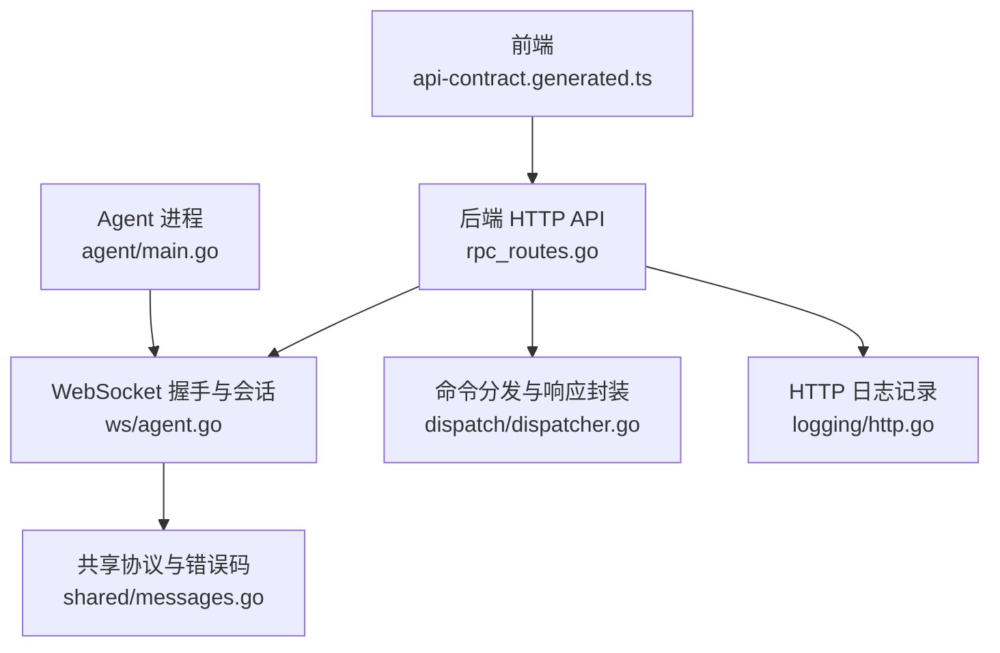
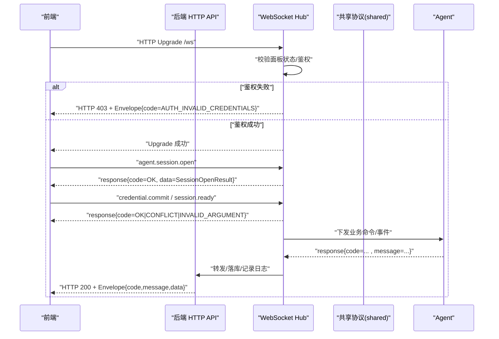
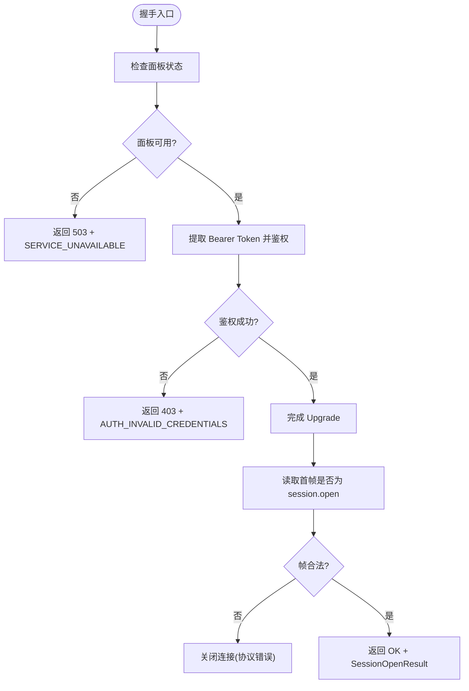
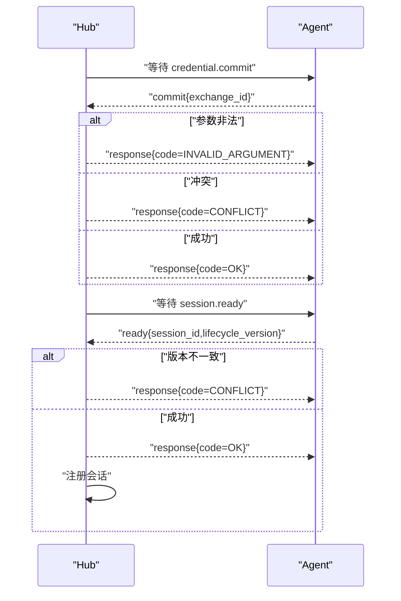
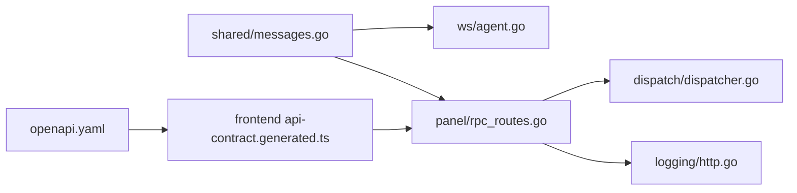

# 错误处理

<cite>
**本文引用的文件**   
- [src/shared/messages.go](file://src/shared/messages.go)
- [src/backend/internal/ws/agent.go](file://src/backend/internal/ws/agent.go)
- [src/backend/internal/ws/agent_test.go](file://src/backend/internal/ws/agent_test.go)
- [src/backend/internal/dispatcher.go](file://src/backend/internal/dispatch/dispatcher.go)
- [src/backend/internal/logging/http.go](file://src/backend/internal/logging/http.go)
- [src/backend/internal/panel/rpc_routes.go](file://src/backend/internal/panel/rpc_routes.go)
- [src/frontend/src/lib/api-contract.generated.ts](file://src/frontend/src/lib/api-contract.generated.ts)
- [docs/openapi.yaml](file://docs/openapi.yaml)
- [docs/rpc-api-design.md](file://docs/rpc-api-design.md)
- [docs/logging-design.md](file://docs/logging-design.md)
- [src/agent/cmd/agent/main.go](file://src/agent/cmd/agent/main.go)
</cite>

## 目录
1. [简介](#简介)
2. [项目结构](#项目结构)
3. [核心组件](#核心组件)
4. [架构总览](#架构总览)
5. [详细组件分析](#详细组件分析)
6. [依赖关系分析](#依赖关系分析)
7. [性能考虑](#性能考虑)
8. [故障排查指南](#故障排查指南)
9. [结论](#结论)
10. [附录](#附录)

## 简介
本文件面向 Lattix-codex 通信协议（HTTP API 与 WebSocket 控制通道）的错误处理机制，系统化说明预定义错误码、消息信封规范、网络异常处理策略以及业务逻辑错误的分类与标准化处理方式。文档同时提供调试技巧与可操作的排错路径，帮助前后端与 Agent 侧在一致语义下统一处理错误。

## 项目结构
- 共享协议与错误码定义位于 shared 包，WebSocket 握手与会话生命周期在 backend/internal/ws，RPC 路由与响应封装在 panel 层，前端类型由 OpenAPI 生成，Agent 侧对错误码进行消费与重试判断。
- 关键文件：
  - 协议与错误码常量、信封结构：src/shared/messages.go
  - WebSocket 握手、鉴权失败、协议错误、心跳续期：src/backend/internal/ws/agent.go
  - 测试用例验证握手错误为结构化 RPC 响应：src/backend/internal/ws/agent_test.go
  - 分发器构造响应信封：src/backend/internal/dispatch/dispatcher.go
  - HTTP 日志记录 RPCCode 与安全消息：src/backend/internal/logging/http.go
  - RPC 路由缓存与响应写入：src/backend/internal/panel/rpc_routes.go
  - 前端生成的 RPC 类型与操作表：src/frontend/src/lib/api-contract.generated.ts
  - OpenAPI 中 RPCCode 枚举：docs/openapi.yaml
  - RPC 设计文档（HTTP 状态码与 RPC code 的约定）：docs/rpc-api-design.md
  - 日志设计文档（错误码优先级与记录规则）：docs/logging-design.md
  - Agent 侧对 Code/Message 的消费与错误提示：src/agent/cmd/agent/main.go

**图表来源** 
- [src/frontend/src/lib/api-contract.generated.ts:1-40](file://src/frontend/src/lib/api-contract.generated.ts#L1-L40)
- [src/backend/internal/panel/rpc_routes.go:191-214](file://src/backend/internal/panel/rpc_routes.go#L191-L214)
- [src/backend/internal/ws/agent.go:32-77](file://src/backend/internal/ws/agent.go#L32-L77)
- [src/shared/messages.go:13-70](file://src/shared/messages.go#L13-L70)
- [src/backend/internal/dispatch/dispatcher.go:490](file://src/backend/internal/dispatch/dispatcher.go#L490)
- [src/backend/internal/logging/http.go:113-117](file://src/backend/internal/logging/http.go#L113-L117)
- [src/agent/cmd/agent/main.go:196-433](file://src/agent/cmd/agent/main.go#L196-L433)

**章节来源**
- [src/shared/messages.go:13-70](file://src/shared/messages.go#L13-L70)
- [src/backend/internal/ws/agent.go:32-77](file://src/backend/internal/ws/agent.go#L32-L77)
- [src/backend/internal/dispatch/dispatcher.go:490](file://src/backend/internal/dispatch/dispatcher.go#L490)
- [src/backend/internal/logging/http.go:113-117](file://src/backend/internal/logging/http.go#L113-L117)
- [src/backend/internal/panel/rpc_routes.go:191-214](file://src/backend/internal/panel/rpc_routes.go#L191-L214)
- [src/frontend/src/lib/api-contract.generated.ts:1-40](file://src/frontend/src/lib/api-contract.generated.ts#L1-L40)
- [docs/openapi.yaml:499-511](file://docs/openapi.yaml#L499-L511)
- [docs/rpc-api-design.md:77-107](file://docs/rpc-api-design.md#L77-L107)
- [docs/logging-design.md:209-214](file://docs/logging-design.md#L209-L214)
- [src/agent/cmd/agent/main.go:196-433](file://src/agent/cmd/agent/main.go#L196-L433)

## 核心组件
- 信封 Envelope：统一请求/响应/事件结构，包含 kind、type、request_id、trace_id、code、message、data。响应必须携带 code 与 message；请求/事件不得携带。
- 错误码常量：集中定义于 shared，涵盖认证、参数、资源、冲突、锁定、不支持、内部错误、上游错误、服务不可用、服务器离线、端口越界、更新进行中等。
- WebSocket 握手与鉴权：失败时以 HTTP 状态码 + 结构化 Envelope 返回，确保客户端能解析错误码与消息。
- HTTP API 响应：通过 rpc_routes 将后端响应写入 HTTP 响应体，保持 code/message/data 一致性。
- 日志记录：HTTP 中间件记录 RPCCode 与安全消息，便于问题定位。
- Agent 消费：Agent 根据 Code/Message 决定重试、退出或上报。

**章节来源**
- [src/shared/messages.go:13-70](file://src/shared/messages.go#L13-L70)
- [src/backend/internal/ws/agent.go:262-283](file://src/backend/internal/ws/agent.go#L262-L283)
- [src/backend/internal/panel/rpc_routes.go:191-214](file://src/backend/internal/panel/rpc_routes.go#L191-L214)
- [src/backend/internal/logging/http.go:113-117](file://src/backend/internal/logging/http.go#L113-L117)
- [src/agent/cmd/agent/main.go:196-433](file://src/agent/cmd/agent/main.go#L196-L433)

## 架构总览
下图展示从前端到后端、再到 Agent 的错误处理链路，包括握手阶段、会话建立、业务回执与日志记录。

**图表来源** 
- [src/backend/internal/ws/agent.go:32-77](file://src/backend/internal/ws/agent.go#L32-L77)
- [src/backend/internal/ws/agent.go:156-195](file://src/backend/internal/ws/agent.go#L156-L195)
- [src/backend/internal/panel/rpc_routes.go:191-214](file://src/backend/internal/panel/rpc_routes.go#L191-L214)
- [src/shared/messages.go:13-70](file://src/shared/messages.go#L13-L70)

## 详细组件分析

### 错误码定义与含义
- OK：成功
- ACCEPTED：已接受（异步处理）
- AUTH_REQUIRED：需要认证
- AUTH_INVALID_CREDENTIALS：凭证无效
- INVALID_ARGUMENT：参数非法
- NOT_FOUND：资源不存在
- CONFLICT：冲突（如生命周期版本不一致、并发冲突）
- OPERATION_LOCKED：操作被锁定（幂等/并发保护）
- UNSUPPORTED_ACTION：不支持的动作（兼容旧 Agent）
- INTERNAL_ERROR：内部错误
- UPSTREAM_ERROR：上游错误（下游服务/外部依赖）
- SERVICE_UNAVAILABLE：服务不可用（重启/降级）
- SERVER_OFFLINE：服务器离线
- PORT_OUT_OF_RANGE：端口越界
- UPDATE_IN_PROGRESS：更新进行中

上述枚举在前端类型与 OpenAPI 中保持一致，用于前后端与 Agent 的统一语义。

**章节来源**
- [src/shared/messages.go:54-70](file://src/shared/messages.go#L54-L70)
- [src/frontend/src/lib/api-contract.generated.ts:4-20](file://src/frontend/src/lib/api-contract.generated.ts#L4-L20)
- [docs/openapi.yaml:499-511](file://docs/openapi.yaml#L499-L511)

### 信封结构与字段作用
- Kind：request/response/event
- Type：动作标识（如 agent.session.open、node.apply）
- RequestID/TraceID：请求与追踪 ID，用于跨层关联
- Code：业务结果码（仅 response 携带）
- Message：人类可读的错误信息（仅 response 携带）
- Data：业务数据载荷

MarshalJSON 保证响应必带 code/message，请求/事件不携带。Validate 强制校验必填字段与格式。

**章节来源**
- [src/shared/messages.go:13-45](file://src/shared/messages.go#L13-L45)
- [src/shared/messages.go:112-137](file://src/shared/messages.go#L112-L137)

### WebSocket 握手与鉴权错误
- 握手阶段若鉴权失败，返回 HTTP 403 + Envelope{kind=response, type=session.open, code=AUTH_INVALID_CREDENTIALS, message="authentication failed"}
- 面板处于重启/不可用时，返回 HTTP 503 + Envelope{code=SERVICE_UNAVAILABLE}
- 首次帧非 session.open 或数据非法，关闭连接并附带协议错误码

**图表来源** 
- [src/backend/internal/ws/agent.go:32-77](file://src/backend/internal/ws/agent.go#L32-L77)
- [src/backend/internal/ws/agent.go:262-272](file://src/backend/internal/ws/agent.go#L262-L272)
- [src/backend/internal/ws/agent_test.go:42-64](file://src/backend/internal/ws/agent_test.go#L42-L64)

**章节来源**
- [src/backend/internal/ws/agent.go:32-77](file://src/backend/internal/ws/agent.go#L32-L77)
- [src/backend/internal/ws/agent_test.go:42-64](file://src/backend/internal/ws/agent_test.go#L42-L64)

### 会话建立与前置动作校验
- 在注册前仅允许 credential.commit 与 session.ready
- 参数非法返回 INVALID_ARGUMENT
- 生命周期版本不一致返回 CONFLICT
- 其他动作返回 UNSUPPORTED_ACTION

**图表来源** 
- [src/backend/internal/ws/agent.go:156-195](file://src/backend/internal/ws/agent.go#L156-L195)

**章节来源**
- [src/backend/internal/ws/agent.go:156-195](file://src/backend/internal/ws/agent.go#L156-L195)

### HTTP API 响应与日志记录
- 路由层将后端响应写入 HTTP 响应体，保持 code/message/data 一致
- 日志中间件记录 RPCCode 与安全消息，避免泄露敏感信息
- HTTP 状态码与 RPC code 的约定见设计文档（例如 200 + SERVICE_UNAVAILABLE 表示传输成功但业务不可用）

**章节来源**
- [src/backend/internal/panel/rpc_routes.go:191-214](file://src/backend/internal/panel/rpc_routes.go#L191-L214)
- [src/backend/internal/logging/http.go:113-117](file://src/backend/internal/logging/http.go#L113-L117)
- [docs/rpc-api-design.md:77-107](file://docs/rpc-api-design.md#L77-L107)

### Agent 侧错误消费与重试策略
- Agent 对 session.open、credential.commit、session.ready 等响应的 Code 进行判断
- 遇到 AUTH_INVALID_CREDENTIALS 等错误直接报错并退出
- 对于可重试场景（如临时不可用），结合业务策略进行退避重试

**章节来源**
- [src/agent/cmd/agent/main.go:196-433](file://src/agent/cmd/agent/main.go#L196-L433)

## 依赖关系分析
- shared 包为所有组件提供统一的错误码与信封结构
- ws/agent.go 依赖 shared 进行握手错误与协议错误处理
- panel/rpc_routes.go 依赖 dispatcher 构造响应信封
- logging/http.go 依赖上层元数据（RPCCode、SafeMessage）进行安全记录
- 前端 api-contract.generated.ts 与 docs/openapi.yaml 同步枚举，保障类型一致

**图表来源** 
- [src/shared/messages.go:13-70](file://src/shared/messages.go#L13-L70)
- [src/backend/internal/ws/agent.go:32-77](file://src/backend/internal/ws/agent.go#L32-L77)
- [src/backend/internal/panel/rpc_routes.go:191-214](file://src/backend/internal/panel/rpc_routes.go#L191-L214)
- [src/backend/internal/dispatch/dispatcher.go:490](file://src/backend/internal/dispatch/dispatcher.go#L490)
- [src/backend/internal/logging/http.go:113-117](file://src/backend/internal/logging/http.go#L113-L117)
- [src/frontend/src/lib/api-contract.generated.ts:1-40](file://src/frontend/src/lib/api-contract.generated.ts#L1-L40)
- [docs/openapi.yaml:499-511](file://docs/openapi.yaml#L499-L511)

**章节来源**
- [src/shared/messages.go:13-70](file://src/shared/messages.go#L13-L70)
- [src/backend/internal/ws/agent.go:32-77](file://src/backend/internal/ws/agent.go#L32-L77)
- [src/backend/internal/panel/rpc_routes.go:191-214](file://src/backend/internal/panel/rpc_routes.go#L191-L214)
- [src/backend/internal/dispatch/dispatcher.go:490](file://src/backend/internal/dispatch/dispatcher.go#L490)
- [src/backend/internal/logging/http.go:113-117](file://src/backend/internal/logging/http.go#L113-L117)
- [src/frontend/src/lib/api-contract.generated.ts:1-40](file://src/frontend/src/lib/api-contract.generated.ts#L1-L40)
- [docs/openapi.yaml:499-511](file://docs/openapi.yaml#L499-L511)

## 性能考虑
- 使用严格 JSON 解码与未知字段拒绝，减少解析开销与安全风险
- 心跳 Ping/Pong 与读超时续期降低长连接空闲占用
- 响应信封复用与缓冲发送，降低频繁序列化与写放大
- 日志记录采用安全消息，避免大对象或敏感数据影响吞吐

[本节为通用指导，无需特定文件引用]

## 故障排查指南
- 握手失败
  - 检查 Authorization 头是否包含有效 Bearer Token
  - 查看面板状态（重启/不可用）与日志中的 SERVICE_UNAVAILABLE
  - 参考握手错误测试用例确认响应结构
- 会话前置动作失败
  - 核对 credential.commit 的 exchange_id 与 session.ready 的 session_id/lifecycle_version
  - 关注 CONFLICT 与 INVALID_ARGUMENT 的具体消息
- 业务错误
  - 根据 Code 分类定位：参数类（INVALID_ARGUMENT）、资源类（NOT_FOUND）、并发类（CONFLICT/OPERATION_LOCKED）、系统类（INTERNAL_ERROR/UPSTREAM_ERROR/SERVICE_UNAVAILABLE）
  - 利用 request_id/trace_id 跨层追踪
- 日志与监控
  - 查看 HTTP 日志记录的 RPCCode 与安全消息
  - 结合 Agent 侧错误输出与重试策略定位根因

**章节来源**
- [src/backend/internal/ws/agent_test.go:42-64](file://src/backend/internal/ws/agent_test.go#L42-L64)
- [src/backend/internal/logging/http.go:113-117](file://src/backend/internal/logging/http.go#L113-L117)
- [docs/logging-design.md:209-214](file://docs/logging-design.md#L209-L214)

## 结论
Lattix-codex 的错误处理以共享错误码与统一信封为核心，贯穿 HTTP API 与 WebSocket 控制通道。握手阶段即返回结构化错误，会话前置动作严格校验，业务回执遵循一致的 code/message 语义。配合严格的 JSON 解析、心跳保活、安全日志与 Agent 侧消费策略，形成稳定可靠的错误处理体系。

[本节为总结性内容，无需特定文件引用]

## 附录

### 错误码使用场景与处理策略速查
- AUTH_REQUIRED：未携带或过期令牌，引导重新登录
- AUTH_INVALID_CREDENTIALS：凭证无效，提示用户或终止连接
- INVALID_ARGUMENT：参数校验失败，修正后重试
- NOT_FOUND：资源不存在，检查 ID/路径
- CONFLICT：版本/并发冲突，刷新状态或退避重试
- OPERATION_LOCKED：操作被锁，等待或取消前序任务
- UNSUPPORTED_ACTION：旧 Agent 或未知动作，升级或忽略
- INTERNAL_ERROR：内部异常，收集堆栈与上下文
- UPSTREAM_ERROR：上游依赖失败，降级或重试
- SERVICE_UNAVAILABLE：服务重启/不可用，延迟重试
- SERVER_OFFLINE：节点离线，等待重连或切换
- PORT_OUT_OF_RANGE：端口配置越界，修正配置
- UPDATE_IN_PROGRESS：更新进行中，等待完成

**章节来源**
- [src/shared/messages.go:54-70](file://src/shared/messages.go#L54-L70)
- [docs/rpc-api-design.md:77-107](file://docs/rpc-api-design.md#L77-L107)

### 代码示例路径（不展示具体代码）
- 握手错误结构化响应：[writeHandshakeError:262-272](file://src/backend/internal/ws/agent.go#L262-L272)
- 会话前置动作校验与回执：[replyDirect 调用处:156-195](file://src/backend/internal/ws/agent.go#L156-L195)
- 响应信封构造：[dispatcher 构造响应](file://src/backend/internal/dispatch/dispatcher.go#L490)
- HTTP 响应写入：[rpc_routes 写入:191-214](file://src/backend/internal/panel/rpc_routes.go#L191-L214)
- Agent 错误消费：[main.go 错误处理:196-433](file://src/agent/cmd/agent/main.go#L196-L433)

**章节来源**
- [src/backend/internal/ws/agent.go:262-272](file://src/backend/internal/ws/agent.go#L262-L272)
- [src/backend/internal/ws/agent.go:156-195](file://src/backend/internal/ws/agent.go#L156-L195)
- [src/backend/internal/dispatch/dispatcher.go:490](file://src/backend/internal/dispatch/dispatcher.go#L490)
- [src/backend/internal/panel/rpc_routes.go:191-214](file://src/backend/internal/panel/rpc_routes.go#L191-L214)
- [src/agent/cmd/agent/main.go:196-433](file://src/agent/cmd/agent/main.go#L196-L433)