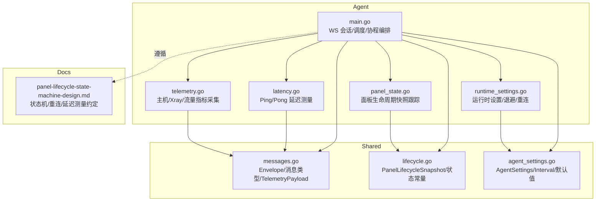
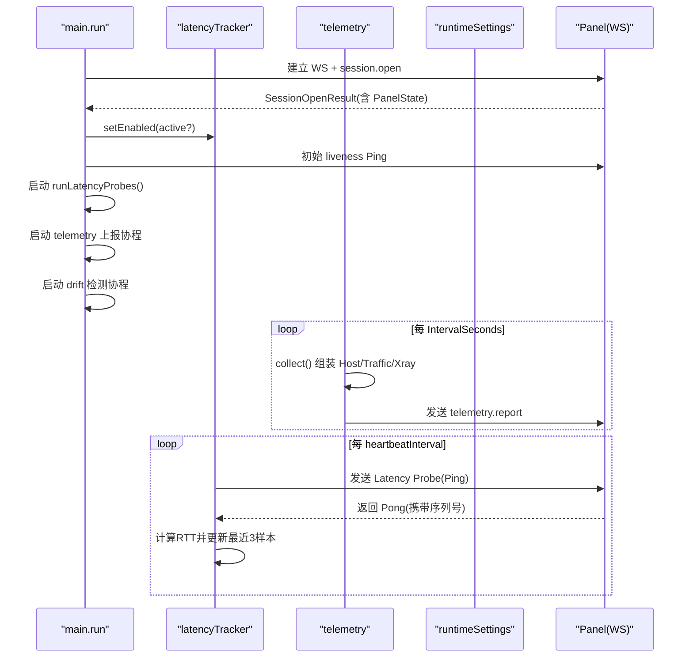
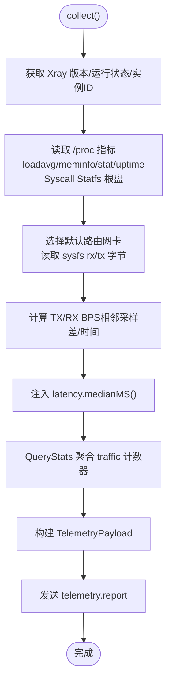
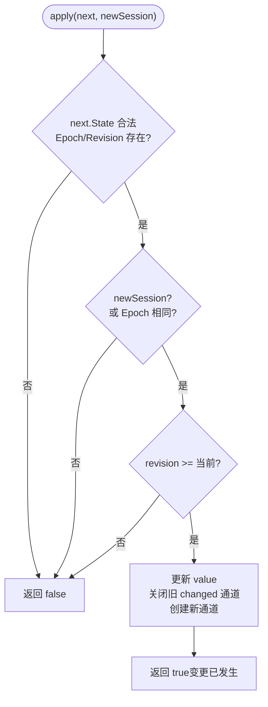
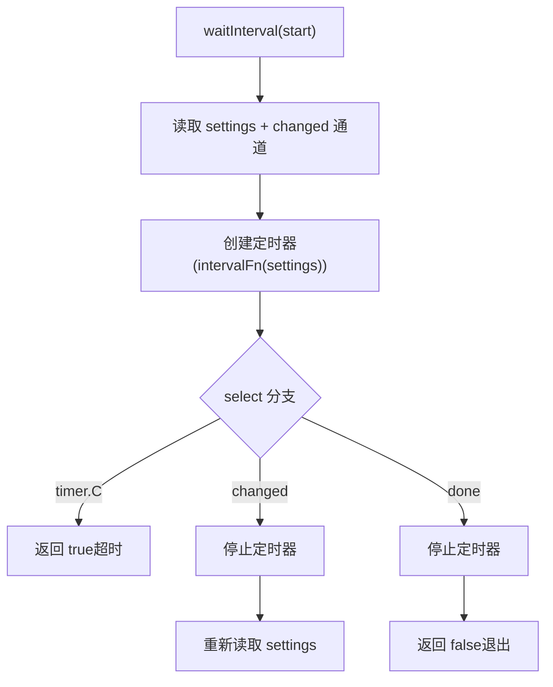
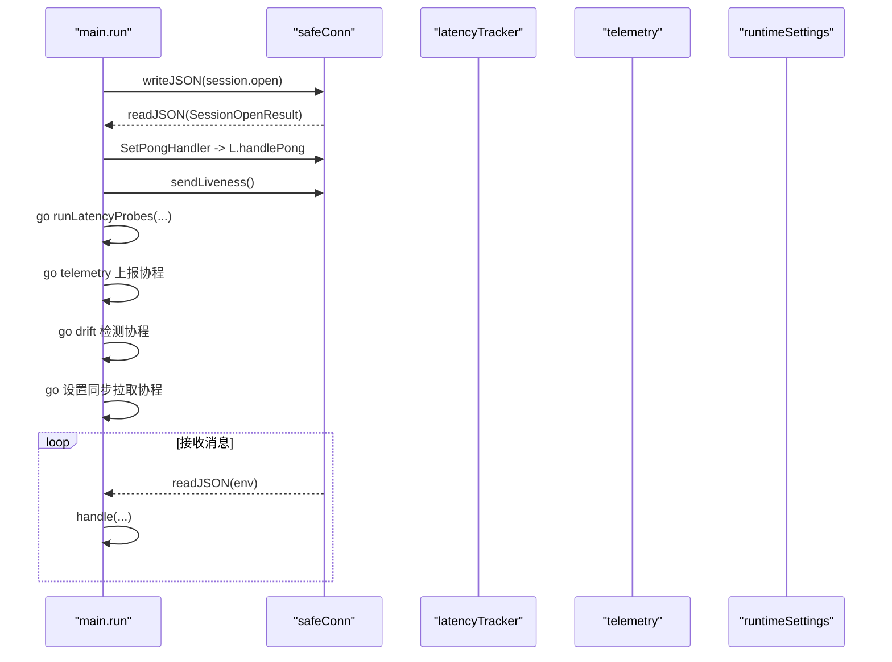
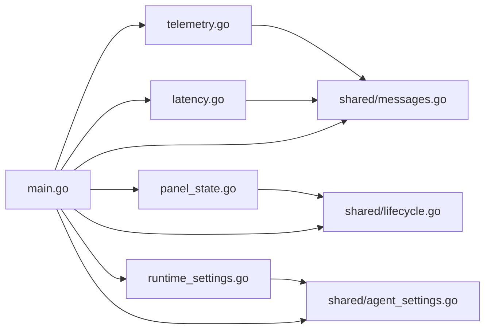

# 遥测系统

<cite>
**本文引用的文件**   
- [src/agent/cmd/agent/main.go](file://src/agent/cmd/agent/main.go)
- [src/agent/cmd/agent/telemetry.go](file://src/agent/cmd/agent/telemetry.go)
- [src/agent/cmd/agent/latency.go](file://src/agent/cmd/agent/latency.go)
- [src/agent/cmd/agent/panel_state.go](file://src/agent/cmd/agent/panel_state.go)
- [src/agent/cmd/agent/runtime_settings.go](file://src/agent/cmd/agent/runtime_settings.go)
- [src/shared/messages.go](file://src/shared/messages.go)
- [src/shared/lifecycle.go](file://src/shared/lifecycle.go)
- [src/shared/agent_settings.go](file://src/shared/agent_settings.go)
- [docs/panel-lifecycle-state-machine-design.md](file://docs/panel-lifecycle-state-machine-design.md)
</cite>

## 目录
1. [简介](#简介)
2. [项目结构](#项目结构)
3. [核心组件](#核心组件)
4. [架构总览](#架构总览)
5. [详细组件分析](#详细组件分析)
6. [依赖关系分析](#依赖关系分析)
7. [性能考量](#性能考量)
8. [故障排查指南](#故障排查指南)
9. [结论](#结论)
10. [附录](#附录)

## 简介
本技术文档面向 Lattix-codex Agent 的遥测子系统，系统性阐述以下能力：
- 指标采集与上报：主机负载、CPU/内存/磁盘/网络、Xray 版本与运行状态、按节点/链跳/用户维度的绝对流量计数器。
- 延迟测量系统：基于 WebSocket Ping/Pong 的 RTT 采样、中位数统计、生命周期感知（active/updating/faulted）与恢复窗口。
- 面板状态跟踪：生命周期快照、版本幂等应用、变更通知通道。
- 遥测数据上报机制：定时轮询发送、错误日志记录、连接断开后的重连重建。
- 动态配置调整：Telemetry/DriftDetection 间隔、Reconnect 策略、功能开关（延迟探测启用/禁用）。
- 运维解读与调优：如何从遥测载荷解读系统健康、如何根据面板重试策略与 Agent 行为进行优化。

## 项目结构
Agent 侧遥测相关代码集中在 agent 命令包内，共享协议与数据结构位于 shared 包；面板生命周期设计文档提供状态机语义约束。



**图表来源** 
- [src/agent/cmd/agent/main.go:1-800](file://src/agent/cmd/agent/main.go#L1-L800)
- [src/agent/cmd/agent/telemetry.go:1-326](file://src/agent/cmd/agent/telemetry.go#L1-L326)
- [src/agent/cmd/agent/latency.go:1-114](file://src/agent/cmd/agent/latency.go#L1-L114)
- [src/agent/cmd/agent/panel_state.go:1-52](file://src/agent/cmd/agent/panel_state.go#L1-L52)
- [src/agent/cmd/agent/runtime_settings.go:1-199](file://src/agent/cmd/agent/runtime_settings.go#L1-L199)
- [src/shared/messages.go:1-313](file://src/shared/messages.go#L1-L313)
- [src/shared/lifecycle.go:1-86](file://src/shared/lifecycle.go#L1-L86)
- [src/shared/agent_settings.go:1-111](file://src/shared/agent_settings.go#L1-L111)
- [docs/panel-lifecycle-state-machine-design.md:1-133](file://docs/panel-lifecycle-state-machine-design.md#L1-L133)

**章节来源**
- [src/agent/cmd/agent/main.go:1-800](file://src/agent/cmd/agent/main.go#L1-L800)
- [src/shared/messages.go:1-313](file://src/shared/messages.go#L1-L313)
- [src/shared/lifecycle.go:1-86](file://src/shared/lifecycle.go#L1-L86)
- [src/shared/agent_settings.go:1-111](file://src/shared/agent_settings.go#L1-L111)
- [docs/panel-lifecycle-state-machine-design.md:1-133](file://docs/panel-lifecycle-state-machine-design.md#L1-L133)

## 核心组件
- 遥测采集器 telemetry：聚合 Xray 版本/运行状态、主机指标（/proc）、按维度聚合的绝对流量计数器，并注入最近 3 次 WS RTT 中位数。
- 延迟追踪器 latencyTracker：基于 WS Ping/Pong 控制帧发送探针、维护 pending 序列号、计算微秒级 RTT 并保留最近 3 个样本，支持暂停/恢复。
- 面板状态跟踪 panelStateTracker：维护 PanelLifecycleSnapshot，按 epoch/revision 幂等应用，变更通过 channel 通知。
- 运行时设置 runtimeSettings：管理 AgentSettings（含 Telemetry/DriftDetection 间隔、Reconnect 策略），提供 waitInterval 动态等待与失败记录。
- 主循环 main.run：建立 WS、初始化心跳与延迟探测、启动遥测上报协程、漂移检测协程、设置同步拉取协程。

**章节来源**
- [src/agent/cmd/agent/telemetry.go:1-326](file://src/agent/cmd/agent/telemetry.go#L1-L326)
- [src/agent/cmd/agent/latency.go:1-114](file://src/agent/cmd/agent/latency.go#L1-L114)
- [src/agent/cmd/agent/panel_state.go:1-52](file://src/agent/cmd/agent/panel_state.go#L1-L52)
- [src/agent/cmd/agent/runtime_settings.go:1-199](file://src/agent/cmd/agent/runtime_settings.go#L1-L199)
- [src/agent/cmd/agent/main.go:1-800](file://src/agent/cmd/agent/main.go#L1-L800)

## 架构总览
Agent 通过一条 WS 长连接与 Panel 通信，承载认证、生命周期同步、配置同步、业务命令与遥测事件。遥测子系统由三个并行协程组成：
- 心跳与延迟探测：每 30s 发送 liveness Ping；在 active 状态下周期性发送带序列号的 Latency Probe PING，PONG 回调计算 RTT。
- 遥测上报：按 AgentSettings.Telemetry.IntervalSeconds 周期收集并上报 telemetry.report 事件。
- 漂移检测：按 AgentSettings.DriftDetection.IntervalSeconds 检查 xray 配置文件是否被外部修改，变化时上报 config.drift。



**图表来源** 
- [src/agent/cmd/agent/main.go:236-310](file://src/agent/cmd/agent/main.go#L236-L310)
- [src/agent/cmd/agent/main.go:465-525](file://src/agent/cmd/agent/main.go#L465-L525)
- [src/agent/cmd/agent/telemetry.go:36-45](file://src/agent/cmd/agent/telemetry.go#L36-L45)
- [src/agent/cmd/agent/latency.go:36-85](file://src/agent/cmd/agent/latency.go#L36-L85)
- [src/shared/messages.go:195-238](file://src/shared/messages.go#L195-L238)

## 详细组件分析

### 遥测采集与上报（telemetry）
- 采集内容
  - Xray 版本与运行状态、实例 ID。
  - 主机指标：load1/5/15、CPU%（两次采样区间）、内存总量与已用、根盘总量与已用、系统运行时间、默认网卡及收发字节与速率。
  - 流量计数器：对 Xray 统计键名解析，聚合为 node/hop/user 三类的 up/down 绝对计数。
  - 延迟：注入 latency.medianMS() 返回最近 3 次 RTT 中位数（若无则 null）。
- 上报机制
  - 使用 Envelope{Kind:event, Type:telemetry.report} 发送，无需回执。
  - 发送失败仅记录日志，外层重连会重建遥测循环。
- 关键实现要点
  - CPU% 需要首帧置零，第二次采样才有效。
  - 网络速率基于相邻两次采样的差值与时间间隔计算。
  - 默认路由接口选择忽略 lo/docker/veth/br-/virbr/tun/tap 等虚拟接口。



**图表来源** 
- [src/agent/cmd/agent/telemetry.go:36-45](file://src/agent/cmd/agent/telemetry.go#L36-L45)
- [src/agent/cmd/agent/telemetry.go:104-184](file://src/agent/cmd/agent/telemetry.go#L104-L184)
- [src/agent/cmd/agent/telemetry.go:215-296](file://src/agent/cmd/agent/telemetry.go#L215-L296)
- [src/agent/cmd/agent/telemetry.go:298-320](file://src/agent/cmd/agent/telemetry.go#L298-L320)
- [src/shared/messages.go:195-238](file://src/shared/messages.go#L195-L238)

**章节来源**
- [src/agent/cmd/agent/telemetry.go:1-326](file://src/agent/cmd/agent/telemetry.go#L1-L326)
- [src/shared/messages.go:195-238](file://src/shared/messages.go#L195-L238)

### 延迟测量系统（latencyTracker）
- 机制
  - 使用 WS 控制帧 Ping 发送 probeKindLatency + 64位序列号；Pong 回传相同 payload。
  - 收到 Pong 后从 pending 表查找发送时间，计算微秒级 RTT，转换为毫秒并追加到 samples。
  - samples 保持最多 3 条，medianMS() 排序取中位数。
- 生命周期联动
  - 仅在 PanelStateActive 下启用；进入 updating/faulted 时暂停，清理 pending，保留已完成样本。
  - 首次成功 Pong 关闭 ready 通道，供上层判断“延迟可用”。
- 健壮性
  - sendProbe 失败删除 pending 对应项；handlePong 校验 payload 长度与类型。

```mermaid
classDiagram
class latencyTracker {
-mu : Mutex
-next : uint64
-pending : map[uint64]time.Time
-samples : []float64
-ready : chan struct{}
-once : sync.Once
-enabled : bool
+sendProbe(conn) error
+handlePong(payload) error
+medianMS() *float64
+setEnabled(enabled) void
}
```

**图表来源** 
- [src/agent/cmd/agent/latency.go:18-34](file://src/agent/cmd/agent/latency.go#L18-L34)
- [src/agent/cmd/agent/latency.go:36-85](file://src/agent/cmd/agent/latency.go#L36-L85)
- [src/agent/cmd/agent/latency.go:87-106](file://src/agent/cmd/agent/latency.go#L87-L106)

**章节来源**
- [src/agent/cmd/agent/latency.go:1-114](file://src/agent/cmd/agent/latency.go#L1-L114)

### 面板状态跟踪（panelStateTracker）
- 职责
  - 保存当前 PanelLifecycleSnapshot，提供 snapshot() 返回 value 与 changed 通道。
  - apply(next, newSession) 按 epoch/revision 规则幂等更新，并在变更时关闭旧通道、创建新通道以通知监听者。
- 规则
  - 非新会话且 epoch 不同直接拒绝；epoch 相同但 revision 更小拒绝；revision 相同且 State/Fault 未变视为幂等确认。



**图表来源** 
- [src/agent/cmd/agent/panel_state.go:29-51](file://src/agent/cmd/agent/panel_state.go#L29-L51)

**章节来源**
- [src/agent/cmd/agent/panel_state.go:1-52](file://src/agent/cmd/agent/panel_state.go#L1-L52)
- [src/shared/lifecycle.go:32-54](file://src/shared/lifecycle.go#L32-L54)

### 运行时设置与动态调整（runtimeSettings）
- 存储与快照
  - 保存 AgentSettingsDocument，包含 Panel 元数据与 Agent 配置（含 Telemetry/DriftDetection 间隔、Reconnect 策略）。
  - snapshot() 返回当前设置、PanelInstanceID、appliedRevision、lastApplyError。
- 动态等待
  - waitInterval(done, intervalFn) 基于设置的间隔计时，支持 changed 通道中断与 done 退出。
- 重连退避
  - reconnectDelay：区分 CloseServiceRestart、有限模式超过最大重试、指数退避上限 30s，并加入 ±20% 抖动。
  - lifecycleRetryDelay：根据 Panel 观察到的 RetryPolicy 随机化重试间隔，限制 1s~5min。
  - unavailableRetryDelay：HTTP 503 场景固定 30~90s 随机。



**图表来源** 
- [src/agent/cmd/agent/runtime_settings.go:78-99](file://src/agent/cmd/agent/runtime_settings.go#L78-L99)
- [src/agent/cmd/agent/runtime_settings.go:101-176](file://src/agent/cmd/agent/runtime_settings.go#L101-L176)

**章节来源**
- [src/agent/cmd/agent/runtime_settings.go:1-199](file://src/agent/cmd/agent/runtime_settings.go#L1-L199)
- [src/shared/agent_settings.go:37-83](file://src/shared/agent_settings.go#L37-L83)

### 主循环中的遥测编排（main.run）
- 连接与会话
  - 建立 WS，发送 session.open，接收 SessionOpenResult，必要时执行凭据交换。
  - 设置 PongHandler 将 Pong 转发给 latencyTracker，并刷新读超时。
- 协程编排
  - 心跳协程：每 30s 发送 liveness Ping。
  - 延迟探测协程：runLatencyProbes 依据 PanelState 与恢复窗口调度探针。
  - 遥测协程：按 Telemetry.IntervalSeconds 周期收集并上报 telemetry.report。
  - 漂移检测协程：按 DriftDetection.IntervalSeconds 检查并上报 config.drift。
  - 设置同步拉取：周期性拉取最新设置，响应处理写入 settings.json 并触发运行时更新。



**图表来源** 
- [src/agent/cmd/agent/main.go:139-256](file://src/agent/cmd/agent/main.go#L139-L256)
- [src/agent/cmd/agent/main.go:259-310](file://src/agent/cmd/agent/main.go#L259-L310)
- [src/agent/cmd/agent/main.go:311-371](file://src/agent/cmd/agent/main.go#L311-L371)
- [src/agent/cmd/agent/main.go:465-525](file://src/agent/cmd/agent/main.go#L465-L525)

**章节来源**
- [src/agent/cmd/agent/main.go:1-800](file://src/agent/cmd/agent/main.go#L1-L800)

## 依赖关系分析
- 模块耦合
  - main 依赖 telemetry、latencyTracker、panelStateTracker、runtimeSettings。
  - telemetry 依赖 shared.TelemetryPayload/HostMetrics/TrafficCounter 与 xray.Manager。
  - latencyTracker 依赖 gorilla/websocket 控制帧。
  - panelStateTracker 依赖 shared.PanelLifecycleSnapshot。
  - runtimeSettings 依赖 shared.AgentSettingsDocument/AgentSettings。
- 外部依赖
  - /proc、/sys/class/net、syscall.Statfs 用于主机指标采集。
  - WebSocket 作为唯一双向通道。



**图表来源** 
- [src/agent/cmd/agent/main.go:1-800](file://src/agent/cmd/agent/main.go#L1-L800)
- [src/agent/cmd/agent/telemetry.go:1-326](file://src/agent/cmd/agent/telemetry.go#L1-L326)
- [src/agent/cmd/agent/latency.go:1-114](file://src/agent/cmd/agent/latency.go#L1-L114)
- [src/agent/cmd/agent/panel_state.go:1-52](file://src/agent/cmd/agent/panel_state.go#L1-L52)
- [src/agent/cmd/agent/runtime_settings.go:1-199](file://src/agent/cmd/agent/runtime_settings.go#L1-L199)
- [src/shared/messages.go:1-313](file://src/shared/messages.go#L1-L313)
- [src/shared/lifecycle.go:1-86](file://src/shared/lifecycle.go#L1-L86)
- [src/shared/agent_settings.go:1-111](file://src/shared/agent_settings.go#L1-L111)

**章节来源**
- [src/agent/cmd/agent/main.go:1-800](file://src/agent/cmd/agent/main.go#L1-L800)
- [src/shared/messages.go:1-313](file://src/shared/messages.go#L1-L313)

## 性能考量
- 指标采集开销
  - CPU% 需两次采样，首帧无效；网络速率需保存上次采样值与时间戳。
  - 根盘使用率通过 syscall.Statfs 一次调用，开销低。
- 上报频率
  - Telemetry.IntervalSeconds 默认 60s，范围 10~3600s；过短会增加 WS 与后端压力。
- 延迟测量
  - 仅保留最近 3 个样本，降低内存占用；中位数抗抖动。
  - 恢复窗口受 Panel 提示限制（5s~5min），避免更新期间集中探测。
- 重连退避
  - 指数退避上限 30s，配合 ±20% 抖动；HTTP 503 使用 30~90s 随机。
  - 面板可下发 RetryPolicy，Agent 在 1s~5min 范围内随机化。

[本节为通用指导，不直接分析具体文件]

## 故障排查指南
- 鉴权拒绝
  - HTTP 403 且携带 X-Lattix-Protocol:1 与特定 code 时，Agent 进入 auth_rejected 并停止自动重试，需重新安装绑定。
- 面板不可用
  - HTTP 503 触发 unavailableRetryDelay 随机 30~90s 重试。
- 遥测上报失败
  - 仅记录日志，外层重连会重建遥测协程；检查 WS 连接稳定性与 Panel 端 telemetry.report 消费。
- 延迟测量异常
  - 若 PanelState 非 active，延迟探测暂停；检查生命周期状态与恢复窗口；确认 PongHandler 是否刷新读超时。
- 配置漂移
  - 当 config.json 被外部修改，drift 检测协程上报 drifted=true；修复后再次检测为 false。

**章节来源**
- [src/agent/cmd/agent/runtime_settings.go:121-155](file://src/agent/cmd/agent/runtime_settings.go#L121-L155)
- [src/agent/cmd/agent/main.go:78-98](file://src/agent/cmd/agent/main.go#L78-L98)
- [src/agent/cmd/agent/telemetry.go:322-326](file://src/agent/cmd/agent/telemetry.go#L322-L326)
- [src/agent/cmd/agent/main.go:311-353](file://src/agent/cmd/agent/main.go#L311-L353)

## 结论
Agent 遥测子系统以 WS 长连接为核心，结合轻量控制帧实现心跳与延迟测量，通过 /proc/sysfs 采集主机与网络指标，聚合 Xray 流量计数器，形成稳定可靠的监控闭环。生命周期状态机与动态配置驱动了探测节奏与重连策略，确保在面板更新/故障期间的鲁棒性。运维人员可通过 TelemetryPayload 与延迟中位数快速评估链路质量与资源瓶颈，并结合面板重试策略与 Agent 设置进行精细化调优。

[本节为总结性内容，不直接分析具体文件]

## 附录

### 遥测载荷字段说明（TelemetryPayload）
- xray_version/xray_running/xray_instance_id：Xray 版本、运行状态与实例标识。
- host：HostMetrics，包含 load、CPU%、内存、磁盘、网卡、上行/下行字节与速率、系统运行时间、latency_ms。
- traffic：TrafficCounter 列表，按 node/hop/user 维度聚合 up/down 绝对字节数。

**章节来源**
- [src/shared/messages.go:195-238](file://src/shared/messages.go#L195-L238)

### 面板生命周期状态机（摘要）
- 状态：startup/active/updating/faulted。
- Agent 行为：
  - startup：允许 WS，暂停业务命令，继续 liveness，暂停 latency。
  - active：允许 WS/业务命令，继续 liveness，正常 latency。
  - updating：允许 WS，维持现状，继续 liveness，暂停 latency。
  - faulted：尽力通知后断开，禁止业务命令，不要求 liveness，暂停 latency。
- 重连策略：指数退避+抖动，面板可下发 RetryPolicy 限制范围。

**章节来源**
- [docs/panel-lifecycle-state-machine-design.md:1-133](file://docs/panel-lifecycle-state-machine-design.md#L1-L133)
- [src/shared/lifecycle.go:5-20](file://src/shared/lifecycle.go#L5-L20)